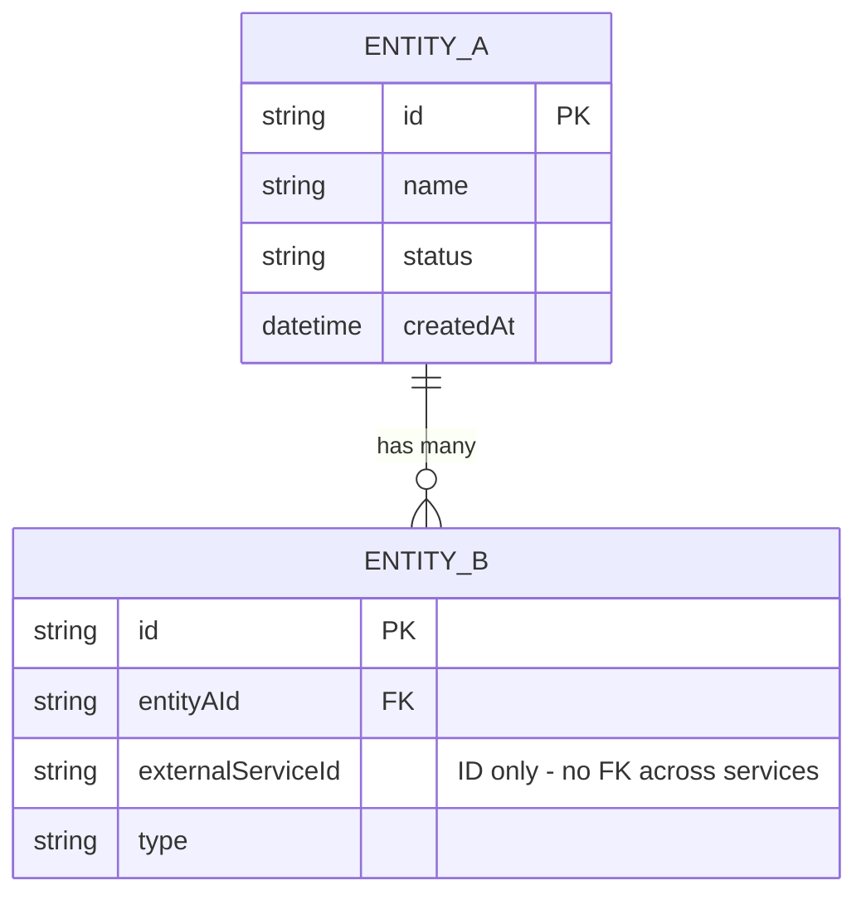

> Codex compatibility note:
> - Invoke repository skills with `$skill-name` in Codex; this mirrored copy rewrites legacy Claude `/skill-name` references.
> - Task tracker mandate: BEFORE executing any workflow or skill step, create/update task tracking for all steps and keep it synchronized as progress changes.
> - User-question prompts mean to ask the user directly in Codex.
> - Ignore Claude-specific mode-switch instructions when they appear.
> - Strict execution contract: when a user explicitly invokes a skill, execute that skill protocol as written.
> - Subagent authorization: when a skill is user-invoked or AI-detected and its protocol requires subagents, that skill activation authorizes use of the required `spawn_agent` subagent(s) for that task.
> - Do not skip, reorder, or merge protocol steps unless the user explicitly approves the deviation first.
> - For workflow skills, steps follow the guided contract in `$start-workflow` (gate steps fixed; other steps may flex with a logged reason); report step-by-step evidence.
> - If a required step/tool cannot run in this environment, stop and ask the user before adapting.
<!-- CODEX:PROJECT-REFERENCE-LOADING:START -->
## Codex Project-Reference Loading (Hook-Independent)

Claude and Codex use static project-reference loading as the authority; hooks may accelerate discovery but never replace the explicit read.
When coding, planning, debugging, testing, or reviewing, open project docs explicitly using this routing.

**Always read:**
- `docs/project-config.json` (project-specific paths, commands, modules, and workflow/test settings)
- `docs/project-reference/docs-index-reference.md` (routes to the full `docs/project-reference/*` catalog)
- `docs/project-reference/lessons.md` (always-on guardrails and anti-patterns)

**Missing/stale context route:** If `docs/project-config.json`, the docs index, `lessons.md`, `CLAUDE.md`, `AGENTS.md`, or any task-required reference doc is missing or stale, auto-run `$project-init` or the narrow setup route (`$project-config`, `$docs-init`, `$scan-all`, `$scan --target=<key>`, `$ai-context-refresh`) before ordinary project-specific work. A full `$sync-codex` run preflights `CLAUDE.md`; a completed `$ai-context-refresh` run may invoke the standalone runner with `--skip=claude-md` after final source edits. Markerless roots need AI smart-merge unless `portability.requireUniversalGuides: false` is explicit.

**Situation-based docs** (pick by the phase you are about to enter — plan/investigate, edit, test, spec/doc, review — and read only docs the project selects in `referenceDocs` that exist):
- Planning, investigation, or design: `project-structure-reference.md`, `domain-entities-reference.md`, plus the docs below for every file type the plan touches
- Editing or writing code: `code-review-rules.md` plus the backend or frontend docs below for the file type
- Project structure/architecture/tech-stack/deployment/setup (any layer — backend, frontend, or infra): `project-structure-reference.md`
- Backend/CQRS/API/domain/entity changes: `backend-patterns-reference.md`, `domain-entities-reference.md`
- Frontend/UI/styling/design-system: `frontend-patterns-reference.md`, `scss-styling-guide.md` (or the configured styling reference), `design-system/README.md`
- Spec authoring, `docs/specs/` pathing, or TC format: `feature-spec-reference.md`, `spec-system-reference.md`, `spec-principles.md`
- Behavior/public-contract changes or spec-test-code sync: `workflow-spec-test-code-cycle-reference.md` plus the spec docs above
- Derived spec indexes/ERDs/reimplementation guides: `spec-system-reference.md` and source Feature Specs under `docs/specs/`
- Integration test implementation/review: `integration-test-reference.md`
- E2E test implementation/review: `e2e-test-reference.md`
- Test-data seeders: `seed-test-data-reference.md`
- Code review/audit work: `code-review-rules.md` plus the docs above for every file type under review
- Per-file conventions (`contextGroups[]`): before editing an unfamiliar path class, run `node .claude/hooks/lib/file-conventions.cjs --lookup <path>`

**Dedup:** a doc counts as loaded only when your own read returned its full content to this context after the last compaction and within roughly the last 200K tokens, and it has not changed since — cite it `(loaded)` instead of re-reading. A hook reminder, a summary, or a prior mention never counts; a delegated sub-agent starts empty, so name the resolved doc paths in its brief.

Never read all docs blindly: route from `docs-index-reference.md` and open only what the task needs.
<!-- CODEX:PROJECT-REFERENCE-LOADING:END -->

<!-- PROMPT-ENHANCE:STEP-TASK-ANCHOR:START -->

> **[BLOCKING]** Execute skill steps in declared order. NEVER skip, reorder, or merge steps without explicit user approval.
> **[BLOCKING]** Before each step or sub-skill call, update task tracking: set `in_progress` when step starts, set `completed` when step ends.
> **[BLOCKING]** Every completed/skipped step MUST include brief evidence or explicit skip reason.
> **[BLOCKING]** If Task tools are unavailable, create and maintain an equivalent step-by-step plan tracker with the same status transitions.

<!-- PROMPT-ENHANCE:STEP-TASK-ANCHOR:END -->

## Quick Summary

**Goal:** Analyze business artifacts into a user-validated DDD domain model and ERD covering bounded contexts, aggregates, entities, value objects, relationships, and domain events, so downstream implementation uses correct invariants and avoids boundary rework after consumers depend on them.

**Summary:**

- **Purpose:** turn business artifacts into a user-validated DDD model; derive nouns→entities, verbs→events, roles, and processes before classification — NEVER model from guesses.
- **Ordered flow (all steps):** `0` locate active plan, prior research, domain reference, set `{plan-dir}` → `1` load business context → `2` identify contexts and validate boundaries → `3` model entities/VOs/aggregates → `4` map relationships → `5` identify events → `6` generate Mermaid ERD → `7` run 5-8-question user validation → `8` assess new/modified/deprecated reference entities and request approval → `9` update `{plan-dir}/plan.md` `## Domain Model`.
- **Model gates:** apply Entity-vs-VO and aggregate rules (≤5 entities, one transaction, ID-only cross-aggregate references, root-only mutation); flag primitive obsession, anemic models, and cross-service FKs.
- **Closure:** persist the report, confirmed model, approved reference changes, and plan update; keep cross-context communication event-driven with `{AggregateNoun}{PastTenseVerb}` naming.

**Workflow:**

0. **Locate Active Plan & Domain Reference** — Glob `plans/*/plan.md` in the plans root (default `plans/`; `docsRoots.plans.path` in `docs/project-config.json` overrides), read plan + prior research + `domain-entities-reference.md`; set `{plan-dir}`
1. **Load Business Context** — Read idea, business evaluation, refined PBI artifacts; extract nouns→entities, verbs→events, roles, processes
2. **Identify Bounded Contexts** — Group related concepts, define context boundaries (validate grouping with user)
3. **Model Entities & Aggregates** — Define aggregates, entities, value objects per context
4. **Map Relationships** — Entity relationships, cross-context integration points (context map)
5. **Domain Events** — Identify events crossing context boundaries, `{AggregateNoun}{PastTenseVerb}`
6. **Generate ERD** — Mermaid ER diagram with all entities and relationships
7. **User Validation** — Present model, ask 5-8 questions, confirm decisions → `status: confirmed`
8. **Domain Entity Change Assessment** — Compare new/modified/deprecated entities against `domain-entities-reference.md`; update/create only after approval
9. **Update Main Plan** — Append/update `## Domain Model` section of `{plan-dir}/plan.md`

**Key Rules:**

- **MANDATORY IMPORTANT MUST ATTENTION** validate every bounded context boundary with user
- **MANDATORY IMPORTANT MUST ATTENTION** include Mermaid ERD diagram in report
- **MANDATORY IMPORTANT MUST ATTENTION** run user validation interview at end (NEVER skip)
- Every entity belongs to exactly one bounded context
- Cross-context communication via domain events only — NEVER direct references

**Be skeptical. Every claim needs traced proof, confidence percentages >80% to act.**

---

## DDD Reference: Strategic Design

### Bounded Context Rules

| Signal                                     | Action                                 |
| ------------------------------------------ | -------------------------------------- |
| Same term, different meaning across teams  | Separate bounded contexts              |
| Different data lifecycles for same concept | Separate contexts                      |
| Different invariants on same entity        | Separate contexts                      |
| Team ownership conflict (Conway's Law)     | Separate contexts                      |
| Shared DB table touched by two services    | Extract shared kernel or introduce ACL |

**Ubiquitous Language Rules:**

- Every noun in codebase matches domain expert vocabulary exactly (not "User" when the domain says "Customer")
- Class/method/variable names reflect ubiquitous language — zero translation layers inside bounded context
- Developers say "we call it X but domain means Y" → model is wrong, fix it

### Context Map Pattern Decision Table

| Situation                                              | Pattern                                |
| ------------------------------------------------------ | -------------------------------------- |
| Two teams, joint success/failure, equal power          | Partnership                            |
| Small shared code nucleus, joint governance acceptable | Shared Kernel                          |
| Downstream can influence upstream roadmap              | Customer-Supplier                      |
| Downstream has no influence on upstream                | Conformist                             |
| External/legacy system with hostile or polluting model | Anti-Corruption Layer (ACL)            |
| One upstream, many downstream consumers                | Open Host Service + Published Language |
| Integration cost exceeds integration value             | Separate Ways                          |

**ACL — use when:** upstream is external, legacy, or third-party (Salesforce, SAP, Workday); upstream types NEVER cross ACL into domain model.

**Shared Kernel — avoid when:** teams cannot coordinate every change → use Customer-Supplier + Published Language.

---

## DDD Reference: Entity vs Value Object

### Decision Matrix

| Question                                          | Entity | Value Object |
| ------------------------------------------------- | ------ | ------------ |
| Has identity beyond its attributes?               | YES    | no           |
| Can two instances with same data be distinct?     | YES    | no           |
| Has a lifecycle (created, modified, deleted)?     | YES    | no           |
| Identified by an ID in any downstream system?     | YES    | no           |
| Measured or described (quantity, address, money)? | no     | YES          |
| Replaced rather than modified on change?          | no     | YES          |
| Must be found independently of parent?            | YES    | no           |

**Fast heuristics:**

- Replace with equal-valued copy → breaks nothing? → **Value Object**
- Must be tracked across time or fetched by ID? → **Entity**
- Always retrieved as part of another object? → likely **Value Object**
- Two instances with same data are interchangeable? → **Value Object**

### Canonical Value Objects

| VO            | Attributes                          | Key Invariants                                                     |
| ------------- | ----------------------------------- | ------------------------------------------------------------------ |
| `Money`       | amount: Decimal, currency: Currency | amount ≥ 0, valid ISO currency; Add/Subtract require same currency |
| `Email`       | value: string                       | RFC 5322 format, normalized to lowercase                           |
| `Address`     | street, city, country, postalCode   | All fields non-empty; composed of Country + PostalCode VOs         |
| `DateRange`   | start: DateOnly, end: DateOnly      | start ≤ end; operations: Contains, Overlaps, Duration              |
| `PhoneNumber` | countryCode, number                 | E.164 format                                                       |
| `Percentage`  | value: int                          | 0 ≤ value ≤ 100                                                    |

### Primitive Obsession → Value Object Mapping

| Primitive Usage                          | Replace With                          |
| ---------------------------------------- | ------------------------------------- |
| `string orderId`                         | `OrderId` typed wrapper               |
| `decimal amount, string currency`        | `Money { amount, currency }`          |
| `string street, string city, string zip` | `Address { ... }`                     |
| `DateTime start, DateTime end`           | `DateRange { start, end }`            |
| `string email`                           | `Email { value }`                     |
| `int percentage`                         | `Percentage { value }`                |
| `string phoneNumber`                     | `PhoneNumber { countryCode, number }` |

**Rule:** Primitive with validation rules, formatting, or always passed grouped with other primitives → missing Value Object.

### Value Object Construction Pattern

VO self-validates invariants at construction via a factory; no public constructor may produce an invalid instance; immutable; equality-by-value. Base class and factory names below are illustrative; adapt to your language.

**Example (illustrative — adapt to your language):**

```csharp
// Self-validating VO — never an invalid instance in memory
public sealed class Email : ValueObject<Email>
{
    private Email(string value) { Value = value; }
    public string Value { get; }

    public static Email Of(string raw)
    {
        var normalized = raw?.Trim().ToLowerInvariant();
        if (string.IsNullOrWhiteSpace(normalized) || !IsValidFormat(normalized))
            throw new DomainException($"Invalid email: {raw}");
        return new Email(normalized);
    }
}
```

**Rules:**

- No public constructor without validation — factory method (`Of()` / `Create()`) enforces invariants
- VOs can reference other VOs; VOs NEVER reference entities (lifecycle coupling)
- Mutation means replacement: `email = Email.Of(newValue)`, NEVER `email.Value = newValue`

### VO Persistence Strategies

| Strategy                    | When to Use                                  | Trade-offs                               |
| --------------------------- | -------------------------------------------- | ---------------------------------------- |
| Owned types (EF Core)       | VO maps to same table as owning entity       | Simple, no FK, nullable columns possible |
| Embedded document store | VO stored as subdocument                     | Natural fit, no joins                    |
| JSON column                 | Complex VO, low query frequency on VO fields | Flexible, not queryable by parts         |
| Serialized string           | Simple VOs (Email, PostalCode)               | Compact, unqueryable by parts            |

**Rule:** VOs NEVER have own table with primary key — that makes them entities by infrastructure.

---

## DDD Reference: Entity Design

### Identity Strategies

| Strategy           | When to Use                                       | Trade-offs                                |
| ------------------ | ------------------------------------------------- | ----------------------------------------- |
| **ULID** (default) | New entities in distributed system                | Sortable, URL-safe, monotonic, 128-bit    |
| **UUID v4**        | True randomness / security-sensitive IDs          | Not sortable, fragmented indexes          |
| **UUID v7**        | Sortable UUID needed                              | Time-ordered, good index locality         |
| **Natural key**    | Domain guarantees permanent uniqueness (SSN, EAN) | Unstable — domain can change              |
| **Surrogate int**  | Legacy/single-DB sequences                        | No distributed generation                 |
| **Composite key**  | Relationship/join table                           | Harder to reference from other aggregates |

**Rules:**

- Prefer ULID for new entities — sortable, no coordination overhead
- NEVER use email/username as PK — users change them
- Cross-service references use same ID type as the owning service

### Rich vs Anemic Domain Model

| Anemic (Anti-Pattern)                    | Rich (Correct)                              |
| ---------------------------------------- | ------------------------------------------- |
| Entity is data bag, logic in services    | Entity contains behavior + invariants       |
| `public set` on all properties           | Private setters, mutation via named methods |
| `OrderService.Confirm(order)`            | `order.Confirm()`                           |
| Service checks rules then mutates entity | Entity refuses invalid state transitions    |
| Logic duplicated across services         | Single authoritative location in entity     |

**Tell Don't Ask Principle:**

- BAD: `if (order.Status == Confirmed) { order.Status = OnHold; }` (external ask + mutate)
- GOOD: `order.Hold(reason)` (entity enforces its own invariants)

### Entity Invariant Enforcement

Rich entity guards its state: private constructor for ORM/persistence hydration, valid-creation factories, and intent-named mutation methods that reject invalid transitions and emit domain events. Base class, guard, and ID-generator names below are illustrative; adapt to your language.

**Example (illustrative — adapt to your language):**

```csharp
public class Order : AuditedAggregateRoot<Order, string>
{
    private Order() { }  // ORM hydration only

    public static Order Create(string name, Email email, WarehouseId warehouseId)
    {
        Guard.NotNullOrWhitespace(name, nameof(name));
        Guard.NotNull(email, nameof(email));
        return new Order
        {
            Id = Ulid.NewUlid().ToString(),
            Name = name,
            Email = email,
            WarehouseId = warehouseId,
            Status = OrderStatus.Confirmed
        };
    }

    public void Cancel(string reason, DateOnly cancellationDate)
    {
        if (Status == OrderStatus.Cancelled)
            throw new DomainException("Order already cancelled");
        if (cancellationDate < DateOnly.FromDateTime(DateTime.UtcNow))
            throw new DomainException("Cancellation date cannot be in the past");

        Status = OrderStatus.Cancelled;
        CancellationReason = reason;
        CancellationDate = cancellationDate;
        AddDomainEvent(new OrderCancelledDomainEvent(Id, cancellationDate));
    }
}
```

### Entity Lifecycle State Machines

Document ALL transitions explicitly. Unmodeled transitions throw `DomainException`.

```
Draft → Submitted (Submit())
Submitted → Approved (Approve(approverId))
Submitted → Rejected (Reject(reason))
Approved → Active (Activate())
Active → Suspended (Suspend(reason))
Suspended → Active (Reinstate())
Active → Archived (Archive())
```

| Pattern                          | When to Use                                              |
| -------------------------------- | -------------------------------------------------------- |
| Status enum + transition methods | Simple linear/branching lifecycles (most cases)          |
| State pattern (class per state)  | Complex per-state behavior, many states                  |
| Event sourcing                   | Full audit trail + point-in-time reconstruction required |

### Domain Validation Layers

| Layer                   | What It Validates                               | Failure Signal (per stack)                                |
| ----------------------- | ----------------------------------------------- | --------------------------------------------------------- |
| **Value Object**        | Single-value format/range invariants            | Construction failure (raised error or result type)        |
| **Entity method**       | Aggregate consistency rules, state transitions  | Domain rule violation (e.g. `DomainException`)            |
| **Application service** | Cross-aggregate rules, authorization, existence | Structured validation result (e.g. `ValidationResult` / problem-details payload) |
| **Infrastructure**      | DB constraints (last resort, NEVER first line)  | Persistence-layer error (last-resort constraint)          |

**Decision rule:**

- Rule requires loading another aggregate? → Application service
- Rule needs only data within aggregate? → Entity method
- Rule concerns single value's format? → Value Object constructor

### Factory Methods on Entities

Use when construction requires domain logic, multiple creation paths, domain events, or object-graph initialization.

**Naming:**

- `Order.Create(...)` — primary creation
- `Order.Place(...)` — semantically loaded creation (domain language)
- Private constructor — ORM hydration only, NEVER called directly

### Temporal (Bi-Temporal) Entities

Two time axes: **valid time** (fact true in real world) + **transaction time** (recorded in system).

```
ProductPrice {
    validFrom: DateOnly     // valid time: price effective from
    validTo: DateOnly       // valid time: price effective until
    recordedAt: DateTime    // transaction time: when entered into system
}
```

Use when: regulatory compliance, retroactive corrections, "as-of" queries.

---

## DDD Reference: Aggregate Design

### Aggregate Boundary Rules

1. **Invariant scope** — boundary = objects needed to enforce invariants atomically
2. **Transaction boundary** — exactly one database transaction per aggregate operation
3. **Consistency scope** — must be consistent atomically? same aggregate. Eventual consistency acceptable? separate aggregates
4. **Small aggregates preferred** — fewer members = fewer transaction conflicts = better scalability

### Aggregate Size Heuristics

| Heuristic                  | Guideline                                                            |
| -------------------------- | -------------------------------------------------------------------- |
| Default                    | Start with single-entity aggregate unless invariant demands more     |
| Add member                 | Only when invariant requires atomic consistency across root + member |
| Max size                   | > 5 entities → redesign; likely missing sub-aggregates               |
| Concurrent writes conflict | Reduce aggregate size                                                |

### Aggregate Root Responsibilities

1. Maintain all invariants across all members
2. All mutation paths go through root (child entities NEVER directly accessible from outside)
3. Emit domain events for significant state changes
4. Control creation of child entities (factory methods on root)
5. Assign IDs to child entities

**Rule:** Outside code NEVER holds direct reference to non-root entity within aggregate.

### Cross-Aggregate References

| Rule                                      | Detail                                                            |
| ----------------------------------------- | ----------------------------------------------------------------- |
| Reference by ID only                      | NEVER `order.Customer.Name` — load separately                     |
| No FK object navigation                   | `CustomerId` field, NEVER `Customer Customer` navigation property |
| Cross-aggregate transactions are eventual | Need them in same transaction → boundaries are wrong              |
| Deletion cascade                          | Domain event → handler → compensating action in other aggregate   |

### Aggregate Invariant Enforcement

Aggregate root owns mutation: check every invariant before change and recompute derived state to prevent inconsistency. Throw-on-violation example is illustrative; language may use exceptions or result types.

**Example (illustrative — adapt to your language):**

```csharp
public void AddLineItem(ProductId productId, int quantity, Money unitPrice)
{
    if (Status != OrderStatus.Draft)
        throw new DomainException("Cannot modify confirmed order");
    if (LineItems.Count >= 50)
        throw new DomainException("Order cannot exceed 50 line items");

    var item = OrderLineItem.Create(productId, quantity, unitPrice);
    _lineItems.Add(item);
    RecalculateTotal();  // invariant: Total == sum(lineItems)
}
```

### Aggregate Design Patterns

| Pattern                 | When to Use                                                  |
| ----------------------- | ------------------------------------------------------------ |
| Single-entity aggregate | Default — most entities are their own aggregate              |
| Nested aggregate        | Invariant requires atomic consistency across root + children |
| Aggregate with VOs      | Root + embedded value objects (no IDs, no own table)         |

### When to Break Aggregate Rules (Pragmatic DDD)

| Situation                          | Acceptable Pragmatism                                            |
| ---------------------------------- | ---------------------------------------------------------------- |
| ORM limitation (EF owned entities) | Allow private owned collections even if not strictly necessary   |
| Performance — 1-query load         | Embed child data as VO/owned type rather than separate aggregate |
| Legacy schema migration            | Accept cross-aggregate FK temporarily, document as debt          |

**Rule:** Break aggregate rules ONLY with explicit technical-debt documentation and mitigation plan.

---

## DDD Reference: ERD Design

### Cardinality Types

| Cardinality | Mermaid    | When to Use                                                    |
| ----------- | ---------- | -------------------------------------------------------------- |
| 1:1         | `\|o--o\|` | Same-table extension, optional sub-type, shared lifecycle      |
| 1:N         | `\|o--{`   | Parent-child, one entity owns many dependent records           |
| M:N         | `}o--o{`   | Peer relationship; ALWAYS use explicit join/association entity |

**M:N rule:** Attributes (date joined, role) → explicit named join entity.

**1:1 decision:** Same concept + optional attributes → same table; different concepts with independent lifecycles → separate tables with FK.

### Normalization Targets

| Normal Form  | Rule                                   | Use For                        |
| ------------ | -------------------------------------- | ------------------------------ |
| 1NF          | Atomic values, no repeating groups     | Always — baseline              |
| 2NF          | No partial dependency on composite key | Composite PKs only             |
| 3NF          | No transitive dependencies             | OLTP — standard target         |
| BCNF         | Every determinant is a candidate key   | When 3NF still has anomalies   |
| Denormalized | Intentional redundancy                 | Read models, projections, OLAP |

**Rule:** 3NF for OLTP write models; denormalize only in read models/projections with documented justification.

### Identifying vs Non-Identifying Relationships

| Type            | FK in Child PK?            | Child Existence                                             |
| --------------- | -------------------------- | ----------------------------------------------------------- |
| Identifying     | YES (FK is part of PK)     | Child cannot exist without parent (line item without order) |
| Non-identifying | NO (FK is separate column) | Child can exist independently (order without warehouse)     |

**Mapping to DDD:** Identifying relationship → child entity inside parent aggregate. Non-identifying FK → likely separate aggregates.

### ERD for Microservices

- Each bounded context has its OWN ERD — NEVER cross-service entity arrows
- Cross-service references shown as `ExternalEntityId (string/ULID)` — ID only, no relationship line
- Shared data shown as replicated/synced data note, NEVER shared table
- Event-sourced aggregates: ERD shows current state projection, not event stream

### ERD Anti-Patterns

| Anti-Pattern                      | Problem                                | Fix                                                |
| --------------------------------- | -------------------------------------- | -------------------------------------------------- |
| God table (50+ columns)           | Every feature adds more columns        | Extract sub-entities, decompose by bounded context |
| Cross-service FK                  | Direct FK across microservice schemas  | Replicate needed data, use events to sync          |
| Polymorphic association           | `entityType + entityId` columns        | Separate tables per concrete type or JSON column   |
| EAV (Entity-Attribute-Value)      | Key-value rows replacing typed columns | JSON column or explicit schema with migration      |
| Implicit M:N (two FK cols, no PK) | Hard to add relationship attributes    | Explicit join table with surrogate PK              |
| Nullable FK everywhere            | Unclear cardinality                    | Separate optional relationship into explicit table |

### ERD to Aggregate Mapping

| ERD Pattern                                | DDD Mapping                                          |
| ------------------------------------------ | ---------------------------------------------------- |
| Parent-child with identifying relationship | Child entity inside parent aggregate                 |
| Parent-child with non-identifying FK       | Likely separate aggregates (independent lifecycle)   |
| M:N join table with no extra attributes    | Both sides separate aggregates, IDs in domain events |
| M:N join table with attributes             | Association entity as separate aggregate             |
| Strong entity + many weak dependents       | Root entity + owned collection aggregate             |

---

## DDD Reference: Domain Events

### Event Naming Conventions

**Format:** `{AggregateNoun}{PastTenseVerb}` — what happened, not what to do.

| Good                 | Bad                                  |
| -------------------- | ------------------------------------ |
| `OrderCancelled`     | `CancelOrder` (command naming)       |
| `OrderConfirmed`     | `OrderStatusChanged` (too generic)   |
| `PaymentProcessed`   | `PaymentComplete` (not past tense)   |
| `SalaryBandUpdated`  | `SalaryChanged` (vague)              |

### Event Payload Design Rules

| Decision               | Rule                                                                                   |
| ---------------------- | -------------------------------------------------------------------------------------- |
| Minimal vs fat         | **Minimal (default):** AggregateId + what changed. Consumer queries for rest if needed |
| Fat event              | Accept when: round-trip cost high AND consumers known AND staleness acceptable         |
| Required fields always | `AggregateId`, `OccurredOn` (UTC timestamp), `Version`, `CorrelationId`                |
| No mutable references  | Payload contains value copies, not object references                                   |

### Domain Events vs Integration Events

| Dimension        | Domain Event               | Integration Event                           |
| ---------------- | -------------------------- | ------------------------------------------- |
| Scope            | Within one bounded context | Across bounded contexts                     |
| Delivery         | In-process, post-commit    | Via configured message bus or event stream  |
| Schema ownership | Domain owns, internal      | Published Language contract                 |
| Versioning       | Internal refactor freely   | Versioned, backward-compatible              |
| Failure handling | Transaction rollback       | At-least-once delivery, idempotent consumer |

**Rule:** Domain event raised → in-process handlers fire → if cross-service needed, handler publishes integration event to message bus.

### Event Versioning Strategies

| Strategy          | Mechanism                                      | Trade-offs                              |
| ----------------- | ---------------------------------------------- | --------------------------------------- |
| Additive only     | NEVER remove/rename fields, only add           | Simple, payload bloats over time        |
| Multiple versions | `OrderConfirmedV1`, `OrderConfirmedV2`         | Clear versioning, consumers handle both |
| Upcasting         | Transform old events to new on deserialization | Transparent to consumers, complex infra |

**Backward compatibility rules:**

- Adding optional field → backward compatible
- Removing or renaming field → breaking
- Changing field type → breaking

---

## DDD Reference: Repository Pattern

### Interface Design Principles

1. One repository per aggregate root — NEVER one for child entities
2. Domain language in methods — `GetConfirmedOrdersInWarehouse()` not `FindAll(e => e.Status == Active)`
3. Return domain objects — repositories return entities, not DTOs
4. No infrastructure concerns — no leaked query/ORM types or connection strings in the interface.
5. Async-first — methods return the configured runtime's async primitive.

### Repository vs DAO

| Repository                       | DAO                                 |
| -------------------------------- | ----------------------------------- |
| Domain-oriented interface        | Data-oriented interface             |
| Returns entities/VOs             | Returns DTOs or raw data            |
| Used in application/domain layer | Used in infrastructure layer        |
| Hides persistence mechanism      | Often tied to persistence mechanism |

### Query Objects — When to Use Specification

Use when a rule repeats, needs a name/test, or needs composition. A specification is a reusable, composable, testable domain-owned query predicate. The expression-tree form below is illustrative; adapt to your language's predicate, query-builder, or specification-object equivalent.

**Example (illustrative — adapt to your language):**

```csharp
// Static expression on entity — composable, testable
public static Expression<Func<Order, bool>> ByWarehouseExpression(string warehouseId)
    => o => o.WarehouseId == warehouseId && o.Status == OrderStatus.Confirmed;
```

**When NOT to use Specification:** Simple single-use predicate → inline lambda. Rule only used once → repository method directly.

---

## DDD Reference: Anti-Patterns Quick Reference

| Anti-Pattern                | Detection Signal                                                   | Fix                                           |
| --------------------------- | ------------------------------------------------------------------ | --------------------------------------------- |
| **Anemic domain model**     | Services have entity-specific logic; entity has all public setters | Move logic to entity                          |
| **God aggregate**           | Aggregate > 5 entities or 100+ ms load time                        | Extract sub-aggregates                        |
| **Leaky aggregate**         | External code mutates child entities directly                      | Private setters + root mutation methods       |
| **Primitive obsession**     | 3+ primitives always travel together as group                      | Introduce Value Object                        |
| **Implicit concept**        | Domain expert names it, code doesn't model it                      | Explicit class                                |
| **Feature envy**            | Method uses more of B's data than A's                              | Move method to B                              |
| **Getter/setter entity**    | All mutation via property assignment, no intent-named methods      | Replace with `Cancel()`, `Approve()`, etc.    |
| **Cross-aggregate loading** | Full aggregate loaded just to read one field                       | Pass scalar; resolve in app service           |
| **Side effects in handler** | Command handler calls multiple services after save                 | Domain event + separate handlers              |
| **Cross-service FK**        | Database FK across microservice schemas                            | ID reference + event-driven sync              |
| **Shared Kernel overuse**   | Two teams, one shared model, constant coordination overhead        | Split to Customer-Supplier                    |
| **Missing ACL**             | External model types bleed into domain classes                     | ACL at integration boundary                   |

---

## Skill Workflow

### Step 0: Locate Active Plan & Domain Reference (MANDATORY)

1. Glob `plans/*/plan.md` sorted by modification time — find active plan directory (plans root default `plans/`; `docsRoots.plans.path` in `docs/project-config.json` overrides)
2. Read `plan.md` — project scope, goals, prior decisions
3. Read all `{plan-dir}/research/*.md` — avoid duplicating prior work
4. Read `domain-entities-reference.md` under the reference-docs root (default `docs/project-reference`; `docsRoots.projectReference.path` in `docs/project-config.json` overrides), if it exists — project's single source of truth for domain entities
5. Set `{plan-dir}` variable — all outputs write to this directory

If no plan directory, create using naming convention from session context.

**MUST ATTENTION update `{plan-dir}/plan.md`** with domain model summary section after completing analysis.

### Step 1: Load Business Context

Read artifacts from prior workflow steps — search the plans root (default `plans/`) and the team-artifacts root (default `team-artifacts/`); `docsRoots.plans.path` / `docsRoots.teamArtifacts.path` in `docs/project-config.json` override those paths:

- Active plan (`{plan-dir}/plan.md`) — scope, goals, constraints
- Business evaluation report — value proposition, customer segments
- Refined PBI — acceptance criteria, user stories, features
- Discovery interview notes — problem statement, user roles

Extract and list:

- **Nouns** — Candidate entities (user, order, product, etc.)
- **Verbs** — Candidate domain events (created, approved, assigned, etc.)
- **Roles** — User types with different permissions/views
- **Processes** — Business workflows (application flow, review cycle, etc.)

### Step 2: Identify Bounded Contexts

Group related entities by DDD principles; apply context-boundary signals above.

```markdown
### Bounded Context: {Name}

**Purpose:** {What this context owns — one sentence}
**Classification:** Core domain / Supporting / Generic
**Key Responsibility:** {primary business capability}
**Team ownership:** {suggested team or role}
**Ubiquitous language:** {key terms and their meaning in this context}
```

**Context boundary tests:**

- Same term used by two teams with different meanings? → separate contexts
- Two entities with same name but different invariants? → separate contexts
- Can this context be worked on without understanding the other? → good separation

**MANDATORY IMPORTANT MUST ATTENTION** present identified contexts to user by asking the user directly:

- "I identified {N} bounded contexts: {list}. Does this grouping make sense?"
- Options: Agree (Recommended) | Merge {X} and {Y} | Split {Z} | Add missing context

### Step 3: Model Entities & Aggregates

Per bounded context: classify each concept using Entity vs VO matrix above, then apply aggregate boundary rules.

```markdown
### {Context Name}

**Aggregate Root:** {EntityName}
**Identity:** {ULID / UUID / Natural key — justify}
**Lifecycle states:** {Draft → Active → Archived, etc.}

- **Child Entities:** {list — share aggregate boundary, identifying FK}
- **Value Objects:** {list — immutable, no identity, embedded}
- **Invariants:** {business rules this aggregate enforces atomically}
- **Factory method:** {Order.Create(...) / Order.Place(...)}

**Other Aggregates in this Context:**

- {Entity} — {purpose, identity strategy, lifecycle}
```

### Entity Detail Template

| Entity | Classification                         | Identity                | Key Fields | Lifecycle States | Invariants       |
| ------ | -------------------------------------- | ----------------------- | ---------- | ---------------- | ---------------- |
| {Name} | Aggregate Root / Entity / Value Object | ULID / UUID / Composite | {fields}   | {states}         | {business rules} |

**VO Composition — MUST ATTENTION verify:**

- 3+ primitives always travel together? → extract VO
- String field has format rules? → extract VO (Email, PhoneNumber)
- Numeric field has range rules? → extract VO (Percentage, Money)
- Concept named by domain experts but not modeled? → make explicit class

**Aggregate Boundary — MUST ATTENTION verify:**

- All entities in aggregate enforced in one transaction?
- Cross-aggregate references use ID only (no navigation properties)?
- Aggregate root is sole entry point for ALL mutations?
- Aggregate ≤ 5 entities? If not — justify or decompose

### Step 4: Map Relationships

#### Intra-Context Relationships

```markdown
| From | To        | Type | Cardinality     | Relationship Kind       | Description              |
| ---- | --------- | ---- | --------------- | ----------------------- | ------------------------ |
| Order | Product  | M:N  | via OrderLine   | Non-identifying (assoc) | Orders contain products  |
```

Apply identifying vs non-identifying relationship rule:

- Identifying relationship (child FK is part of PK) → child entity inside parent aggregate
- Non-identifying FK → likely separate aggregates

#### Cross-Context Integration (Context Map)

```markdown
| Upstream Context | Downstream Context | Pattern | Integration Point          | Sync Mechanism |
| ---------------- | ------------------ | ------- | -------------------------- | -------------- |
| Sales            | Order              | ACL     | Cart becomes Order         | Domain event   |
```

Apply context-map patterns above:

- **Anti-Corruption Layer** — external/hostile upstream model
- **Customer-Supplier** — downstream can negotiate with upstream
- **Open Host Service** — one upstream, many consumers
- **Conformist** — no negotiating power with upstream

### Step 5: Domain Events

Identify cross-context events; name them `{AggregateNoun}{PastTenseVerb}`.

| Event            | Source Context | Target Context(s)    | Payload (minimal)            | Trigger        |
| ---------------- | -------------- | -------------------- | ---------------------------- | -------------- |
| `OrderPlaced`    | Sales          | Order, Fulfillment   | cartId, productId, placedDate | Checkout completed |

**Event design — MUST ATTENTION verify:**

- Name is past tense + includes aggregate noun?
- Payload includes AggregateId, OccurredOn (UTC), Version?
- Payload minimal — just what changed + correlation IDs?
- Version field included for schema evolution?
- Domain event vs integration event clearly classified?

### Step 6: Generate ERD

Produce Mermaid ER diagram. Apply ERD-to-Aggregate mapping + anti-patterns from reference above.

````markdown

````

**ERD requirements:**

- Group entities by bounded context (use Mermaid comments `%% Context: ...`)
- Show PK/FK fields and key business fields (not all fields)
- Show cardinality (1:1, 1:N, M:N) using Crow's Foot notation
- Cross-service references: string/ULID field with comment, no relationship line
- Identify association entities for M:N relationships

**ERD — MUST ATTENTION verify before finalizing:**

- No God tables (>20 columns — consider decomposing)?
- No cross-service FK arrows?
- All M:N through explicit named join entity?
- No nullable FK everywhere (clarify optional relationships)?

### Step 7: User Validation Interview

**MANDATORY IMPORTANT MUST ATTENTION** present domain model and ask 5-8 questions by asking the user directly:

#### Required Questions

1. **Context boundaries** — "Are these {N} bounded contexts correct? Any missing or misplaced?"
    - Options: Correct (Recommended) | Need changes | Not sure, explain more
2. **Aggregate roots** — "Is {Entity} the right aggregate root for {Context}? It controls {child entities}."
3. **Entity vs VO** — "I modeled {concept} as a Value Object because it has no independent identity. Does that match the business model?"
4. **Relationship verification** — "The {Entity A} to {Entity B} relationship is {type/cardinality}. Is that correct?"
5. **Missing entities** — "Are there business concepts — workflows, roles, rules — I haven't captured as explicit domain objects?"
6. **Event verification** — "When {event} happens, should {contexts} be notified? What data do they need?"

#### Deep-Dive Questions (pick 2-3 based on complexity)

- "Should {Entity} be a separate aggregate or part of {Aggregate}? [separating = eventual consistency between them]"
- "Is {field} really a Value Object or does it need its own identity and lifecycle?"
- "How does {process} work step-by-step? What state transitions are involved?"
- "What happens when {edge case}? Which invariant prevents the bad state?"
- "Which entities change most frequently under concurrent load? (impacts aggregate design)"
- "Any concepts domain experts name that I haven't modeled explicitly?"

After confirmation, update report with final decisions; set `status: confirmed`.

### Step 8: Domain Entity Change Assessment (MANDATORY)

**MANDATORY IMPORTANT MUST ATTENTION** compare domain analysis results against `domain-entities-reference.md` under the reference-docs root (default `docs/project-reference`; `docsRoots.projectReference.path` in `docs/project-config.json` overrides), if it exists:

1. **Identify new entities** — in analysis but not in reference doc
2. **Identify modified entities** — changed fields, relationships, or bounded context assignment
3. **Identify deprecated entities** — in reference doc but no longer needed by feature
4. **Present changes to user** by asking the user directly:
    - "Domain entity changes detected: {N} new, {N} modified, {N} deprecated. Proceed with updating domain-entities-reference.md?"
    - Options: Approve all (Recommended) | Review each change | Skip update

If `domain-entities-reference.md` does NOT exist in the reference-docs root (default `docs/project-reference`; `docsRoots.projectReference.path` in `docs/project-config.json` overrides), ask user:

- "No domain-entities-reference.md found. Create it with all entities from this analysis?"
- Options: Yes, create it (Recommended) | No, skip

**After approval:** update/create `domain-entities-reference.md` in the reference-docs root (default `docs/project-reference`; `docsRoots.projectReference.path` in `docs/project-config.json` overrides) in its existing format; append new entities to the appropriate bounded-context section; update fields + relationships for modified entities.

### Step 9: Update Main Plan (MANDATORY)

Read `{plan-dir}/plan.md`, append/update `## Domain Model` section:

```markdown
## Domain Model

- **Bounded Contexts:** {N} — {list names with context map patterns between them}
- **Total Entities:** {N} ({N} aggregates, {N} child entities, {N} value objects)
- **Domain Events:** {N} cross-context events
- **Key Aggregates:** {list with invariant summaries}
- **Key Relationships:** {summary of critical relationships}
- **ERD:** See `phase-01-domain-model.md`
- **Full Analysis:** See `research/domain-analysis.md`
```

---

## Output

```
{plan-dir}/research/domain-analysis.md          # Full domain analysis report
{plan-dir}/phase-01-domain-model.md             # Confirmed domain model with ERD
{plan-dir}/plan.md                              # Updated with domain model summary
docs/project-reference/domain-entities-reference.md  # Updated/created with new/modified entities; docsRoots.projectReference.path in docs/project-config.json overrides this root
```

Report structure:

1. Executive summary (bounded contexts + entity count + key decisions)
2. Context map (bounded contexts with integration patterns)
3. Per-context entity/aggregate detail with identity strategy and invariants
4. Relationship tables (intra + cross-context, identifying vs non-identifying)
5. Value Objects catalog (VO type, attributes, invariants)
6. Domain events catalog (with payload design)
7. Mermaid ERD diagram
8. Anti-pattern warnings (any detected issues in model)
9. Unresolved questions

Report must be **≤250 lines**. Use tables over prose.

---

**MANDATORY IMPORTANT MUST ATTENTION** break work into small todo tasks using task tracking BEFORE starting.
**MANDATORY IMPORTANT MUST ATTENTION** validate EVERY bounded context and key relationship with user by asking the user directly.
**MANDATORY IMPORTANT MUST ATTENTION** include Mermaid ERD and confidence % for all architectural decisions.
**MANDATORY IMPORTANT MUST ATTENTION** add a final review todo task to verify work quality.

---

## Next Steps

**MANDATORY IMPORTANT MUST ATTENTION — NO EXCEPTIONS** after completing this skill, use ask the user directly to present these options:

- **"$domain-entities-review (Recommended)"** — Review DDD quality of entities modeled/modified in this analysis (anemic model, VO classification, invariant enforcement, aggregate boundaries)
- **"$tech-stack-research"** — Research tech stack based on domain model
- **"$plan"** — If tech stack already decided and entity quality already reviewed
- **"Skip, continue manually"** — user decides

### Council escalation (always-offer, second prompt)

After the existing `## Next Steps` prompt above resolves, present a **second**, independent ask the user directly call (do NOT merge into the first):

- **"Skip council — proceed with model (Recommended)"** — Continue with the bounded contexts / aggregate boundaries as drawn. Recommended default.
- **"Escalate to $llm-council"** — Run 11 sub-agent council (5 advisors + 5 reviewers + chairman). Best applied when bounded-context splits or aggregate boundaries are contested (multiple defensible cuts), the model touches >=3 services, or invariants span aggregates. DDD boundary decisions are hard to reverse once consumers depend on them. Cheaper alternatives: `$why-review`, `$plan-validate` (run these first if you haven't).

---

**MANDATORY IMPORTANT MUST ATTENTION** use task tracking to break ALL work into small tasks BEFORE starting.
**MANDATORY IMPORTANT MUST ATTENTION** use ask the user directly at EVERY decision point — validate every bounded context and entity relationship with user.
**MANDATORY IMPORTANT MUST ATTENTION** produce ERD diagram (Mermaid) and domain model report with confidence %.

> **External Memory:** For complex or lengthy work (research, analysis, scan, review), write intermediate findings and final results to a report file in `tmp/reports/` — prevents context loss and serves as deliverable.

> **Evidence Gate:** MANDATORY IMPORTANT MUST ATTENTION — every claim, finding, and recommendation requires `file:line` proof or traced evidence with confidence percentage (>80% to act, <80% must verify first).

---

<!-- PROTOCOL-GUIDES:START -->

> **Protocol guides** — A hook delivers each protocol's full text when this skill loads. If a protocol's text is not in your context, read its file below before you act on it.

- `ai-mistake-prevention` — Failure modes to avoid on every task; carried by the root instruction file; if it is absent, read → .claude/skills/shared/protocols/ai-mistake-prevention.md
- `critical-thinking-mindset` — Critical and sequential thinking with traced proof for every claim; carried by the root instruction file; if it is absent, read → .claude/skills/shared/protocols/critical-thinking-mindset.md
- `project-protocol-overlay` — Resolve the additive project overlays for the running skill; carried by the root instruction file; if it is absent, read → .claude/skills/shared/protocols/project-protocol-overlay.md
- `project-reference-docs-guide` — Read the project config and the right reference docs just in time; carried by the root instruction file; if it is absent, read → .claude/skills/shared/protocols/project-reference-docs-guide.md

<!-- PROTOCOL-GUIDES:END -->

<!-- SYNC:critical-thinking-mindset:reminder -->

**MUST ATTENTION** critical + sequential thinking: every claim carries traced evidence (`file:line` for code, source URL or artifact section otherwise); confidence >80% to act, <60% do NOT recommend. Never present a guess as fact; admit uncertainty and stay skeptical of your own confidence.

<!-- /SYNC:critical-thinking-mindset:reminder -->

<!-- SYNC:ai-mistake-prevention:reminder -->

**MUST ATTENTION** Check project config, relevant references, and local evidence before applying stack-specific conventions; honor explicit N/A. ROOT-CAUSE GATE: before any project-related correction, use the appropriate root-cause investigation protocol; failed/unstable tests require the test-investigation protocol before editing source/tests — never force green.

<!-- /SYNC:ai-mistake-prevention:reminder -->

<!-- PROMPT-ENHANCE:STEP-TASK-CLOSING:START -->

## Prompt-Enhance Closing Anchors

**IMPORTANT MUST ATTENTION** follow declared step order for this skill; NEVER skip, reorder, or merge steps without explicit user approval
**IMPORTANT MUST ATTENTION** for every step/sub-skill call: set `in_progress` before execution, set `completed` after execution
**IMPORTANT MUST ATTENTION** every skipped step MUST include explicit reason; every completed step MUST include concise evidence
**IMPORTANT MUST ATTENTION** if Task tools unavailable, maintain an equivalent step-by-step plan tracker with synchronized statuses

<!-- PROMPT-ENHANCE:STEP-TASK-CLOSING:END -->

<!-- SYNC:project-protocol-overlay:reminder -->

**MUST ATTENTION** resolve this skill's overlays from the index at `<docsRoots.projectReference.path>/skill-protocols-reference.md` (default `docs/project-reference/`; overridable in `docs/project-config.json`); an empty task `referenceDocs` does NOT disable this lookup. Read ONLY matched bodies from the directory the index header names (default `docs/project-protocols/`). Specificity (exact > glob > `*`) ranks overlays against EACH OTHER, never against the skill. Missing/malformed body → report and skip; no index or no match → proceed silently. Overlays are ADDITIVE ONLY — never an authority escalation or a gate waiver; equal-tier contradiction goes to the user.

<!-- /SYNC:project-protocol-overlay:reminder -->

<!-- SYNC:project-reference-docs-guide:reminder -->

- **MANDATORY** Project config is OPTIONAL (default `docs/project-config.json`, via its loader): absent → portable defaults plus repository evidence, state material assumptions, never block; present → non-empty `project.name`, neutral defaults for omitted capabilities, fail closed on a declared malformed section.
- **MANDATORY** An explicit `referenceDocs` array is exact, including `[]`; absent → only the capability-aware resolver output, which may be empty. `lessons.md` and docs-index are always-on, outside that selection. A missing/stale required input or malformed declared section → `$project-init` or the narrow owner route before relying on it.
- **MANDATORY** Pick docs by the phase you are about to enter — plan/investigate, edit code, tests, specs/docs, review — from the gate's routing table, JUST IN TIME before the first target read/grep/edit/test, plus the file's `contextGroups[]` conventions before editing it; cite `Reference docs read: ...`.
- **MANDATORY** Dedup: skip a re-read only for your own full read after the last compaction, within ~200K tokens, unchanged since — a hook reminder, summary, or prior mention is NEVER evidence; re-read after compaction or resume, and give delegated sub-agents the resolved doc paths. Project config and conventions override generic framework defaults.

<!-- /SYNC:project-reference-docs-guide:reminder -->

## Closing Reminders

**IMPORTANT MUST ATTENTION Goal:** Analyze business artifacts into a user-validated DDD domain model and ERD covering bounded contexts, aggregates, entities, value objects, relationships, and domain events, so downstream implementation uses correct invariants and avoids boundary rework after consumers depend on them.

**Protocols in force (concise digest of the SYNC/shared blocks this skill carries):**

- **AI Mistake Prevention:** verify generated content against evidence, trace downstream references, verify all affected outputs, re-read after context loss, surface ambiguity.
- **Critical Thinking:** Traced proof per claim; confidence >80% to act, NEVER guess as fact.

**IMPORTANT MUST ATTENTION** run ALL 10 ordered steps, none skippable: (0) locate active plan + prior research + domain reference, set `{plan-dir}` → (1) load business artifacts and derive nouns→entities, verbs→events, roles, processes → (2) identify contexts + validate boundaries → (3) model entities/VOs/aggregates → (4) map relationships/context map → (5) identify events → (6) generate Mermaid ERD → (7) run 5-8-question user validation → (8) assess new/modified/deprecated reference entities + request approval → (9) update `{plan-dir}/plan.md` `## Domain Model` — why: dropped steps leave the model un-anchored or un-persisted.
**IMPORTANT MUST ATTENTION** validate EVERY bounded context + key relationship with user by asking the user directly — NEVER auto-decide a boundary — why: DDD boundaries are hard to reverse once consumers depend on them; one wrong cut costs days of rework.
**IMPORTANT MUST ATTENTION** domain events ALWAYS follow `{AggregateNoun}{PastTenseVerb}` naming — NEVER command-style (`CancelOrder`) or generic (`OrderStatusChanged`) — why: command/generic names hide what happened and break consumer routing.
**IMPORTANT MUST ATTENTION** NEVER place cross-service FK in the ERD — use ID reference (`{Entity}Id` string/ULID) + event-driven sync only — why: cross-service FK couples schemas and blocks independent deployment.

**MUST ATTENTION** task tracking ALL tasks BEFORE the first artifact read or write; mark one `in_progress`, complete immediately after evidence; on context loss the current task list first — why: compaction wipes prior-work memory, duplicated tasks waste budget.
**MUST ATTENTION** load business artifacts FIRST (plan/PBI/business-eval + `domain-entities-reference.md`) and derive nouns→entities, verbs→events — NEVER model from guesses — why: a model built on assumptions encodes the wrong invariants.
**MUST ATTENTION** search 3+ existing entities in `domain-entities-reference.md` before introducing a new one; reconcile new/modified/deprecated against it and follow its existing format — why: divergent or duplicated domain models fragment the source of truth.
**MUST ATTENTION** evaluate fit before reusing a nearby aggregate/VO pattern — verify the new concept shares the same identity, lifecycle, and transaction scope — why: closest example ≠ matching preconditions.
**MUST ATTENTION** entity vs VO classification — replace with equal-valued copy breaks nothing? → Value Object. Tracked across time or fetched by ID? → Entity. Flag primitive obsession (3+ primitives travel together) and anemic models as you go.
**MUST ATTENTION** every aggregate passes boundary rules — ≤5 entities, one transaction, reference-by-ID only, root is the sole mutation entry; >5 entities → decompose or justify as documented debt.
**MUST ATTENTION** include the Mermaid ERD and a confidence % (>80% to act, <80% verify first) for EVERY architectural decision; cite `file:line` / artifact evidence — NEVER present a boundary or classification as fact without traced proof.
**MUST ATTENTION** persist intermediate findings to `tmp/reports/` incrementally and add a final review task to verify work quality — why: long analysis hits context cutoffs; batched writes lose findings.
**MUST ATTENTION** apply conditional gates: create a plan only when none exists; if the domain reference is missing, ask whether to create it; update it only after approval; present both independent post-analysis ask the user directly prompts (Next Steps, then council) — why: user decisions control mutation and terminal routing.

**Anti-Rationalization:**

| Evasion                                          | Rebuttal                                                                          |
| ------------------------------------------------ | --------------------------------------------------------------------------------- |
| "Boundaries are obvious, skip user validation"   | User validation is non-skippable — run the 5-8 question ask the user directly interview. |
| "Already know the entities, skip reference doc"  | Show `file:line` from `domain-entities-reference.md`. No proof = not checked.      |
| "This concept is clearly an entity"              | Run the Entity-vs-VO matrix anyway — state confidence %. Pattern-matching skips context. |
| "Small model, skip task tracking"                | Still task tracking first. Skip depth, never skip tracking.                         |
| "Cross-service link is just one FK"              | Never — ID reference + event-driven sync. One FK couples two schemas permanently. |

**IMPORTANT MUST ATTENTION** re-anchor the highest-blast-radius rules: create all tasks before acting; run all ten steps in order; validate every bounded context and key relationship; produce the Mermaid ERD; persist approved domain changes and the plan update.
**IMPORTANT MUST ATTENTION** derive from business artifacts with traced evidence; name events `{AggregateNoun}{PastTenseVerb}`; keep cross-service links ID-only + event-driven — NEVER model from guesses or add cross-service FKs.
**IMPORTANT MUST ATTENTION** preserve approval-dependent reference updates and both independent post-analysis user prompts; do not silently choose a terminal route.

<!-- CODEX:SYNC-PROMPT-PROTOCOLS:START -->
## Static Prompt Protocol Mirror (Auto-Synced)

Source: `.claude/.ck.json` + `.claude/skills/shared/sync-inline-versions.md` (`:full` blocks) + `.claude/scripts/lib/hookless-prompt-protocol.cjs` (static quality-protocol composer)

## Shared AI-SDD Protocol Markers

Source: `.claude/skills/shared/sync-inline-versions.md`

## SYNC:ai-sdd-artifact-contract

> **AI-SDD Artifact Contract** — Shared spec-driven development rules stay portable and source-owned.
>
> 1. Keep reusable AI-SDD principles in `.claude`; put repository-specific paths, commands, owners, products, and formats in project config/reference docs.
> 2. Preserve cycle: `spec -> plan -> tasks -> implement -> verify -> update spec/docs`.
> 3. Resolve `specArtifacts` before selecting identity or carrier: use a valid profile, use strict-default TC/test identity only when the profile is absent, and block a malformed or unsupported declaration. Trace every requirement or invariant through decision, task, configured case/test identity and inspected assertion evidence, then carry it through source evidence and canonical docs/spec updates.
> 4. Treat code-to-spec extraction as reference-only until accepted by the canonical spec owner.
> 5. Any supported AI tool may plan, implement, review, or verify with synced context; using multiple tools is optional.
> 6. Update `.claude` source first, then sync generated mirrors; do not manually edit `.agents`, `.codex`, or `AGENTS.md`. — why: mirrors are generated artifacts; hand-edits are overwritten on the next sync
> 7. If `docs/project-config.json`, root instruction files, or a required project-reference doc is missing or stale, auto-run `$project-init` or the narrow lower-level route before ordinary project-specific work.
>
> **Active reference:** `shared/sdd-artifact-contract.md` in the active skills root.

---

## SYNC:ai-sdd-artifact-contract:reminder

- **MANDATORY** Apply `shared/sdd-artifact-contract.md`; keep reusable AI-SDD in `.claude` and local rules in project docs.
- **MANDATORY** Resolve and validate `specArtifacts`: use valid native owner/case/variant identity and assertion-bearing evidence; use strict-default TC/TestSpec only when the profile is absent; block a malformed or unsupported declaration without fallback.
- **MANDATORY** Code-to-spec extraction is reference-only until canonical acceptance; any supported AI tool may execute with synced context.
- **MANDATORY** Update `.claude` source before syncing generated mirrors; do not manually edit `.agents`, `.codex`, or `AGENTS.md`.
- **MANDATORY** Missing or stale project config, root instruction files, or required reference docs route project-specific work through `$project-init` or the narrow setup route automatically.
**[TASK-PLANNING] [MANDATORY]** BEFORE executing any workflow or skill step, create/update task tracking for all planned steps, analyze the task graph (output dependencies, shared write targets) into ordered parallel waves per PARALLELIZE before starting any task, then keep it synchronized as each step starts/completes. Preserve fixed ordering when a skill or workflow explicitly fixes it.
- **MANDATORY** Pin `Original goal:` before the first action and keep `User prompts this session: P1…Pn` current; re-read both at every step, before delegation, and after compaction.
- **MANDATORY** Before claiming done, map the result to the original goal and every prompt (`P# → done | deferred | n/a`); never store secrets in them.
## [LESSON-LEARNED-REMINDER] [BLOCKING] Task Planning & Continuous Improvement — MANDATORY. Do not skip.

Break work into small tasks (task tracking) before starting. Add final task: "Analyze AI mistakes & lessons learned".

**Extract lessons — ROOT CAUSE ONLY, not symptom fixes:**
1. Name the FAILURE MODE (reasoning/assumption failure), not symptom — "assumed API existed without reading source" not "used wrong enum value".
2. Generality test: does this failure mode apply to ≥3 contexts/codebases? If not, abstract one level up.
3. Write as a universal rule — strip project-specific names/paths/classes. Useful on any codebase.
4. Consolidate: multiple mistakes sharing one failure mode → ONE lesson.
5. **Recurrence gate:** "Would this recur in future session WITHOUT this reminder?" — No → skip `$learn`.
6. **Auto-fix gate:** "Could `$code-review`/`$code-simplifier`/`$security-review`/a linter catch this?" — Yes → improve review skill instead.
7. BOTH gates pass → ask user to run `$learn`.
**[CRITICAL-THINKING-MINDSET]** Apply critical thinking, sequential thinking. Every claim needs traced proof, confidence >80% to act.
**Anti-hallucination principle:** Never present guess as fact — cite sources for every claim, admit uncertainty freely, self-check output for errors, cross-reference independently, stay skeptical of own confidence — certainty without evidence root of all hallucination.
**AI Attention principle (Primacy-Recency):** Put the 3 most critical rules at both top and bottom of long prompts/protocols so instruction adherence survives long context windows.
**Goal-driven execution:** Define success criteria first, loop until verified, and stop only when observable checks pass.
**Tests verify intent:** Tests must protect business rules/invariants and fail when the protected intent breaks, not only mirror current behavior.
**Judgement integrity:** For theory checks, judgements, evaluations and gap hunts, the prompt's premise is a hypothesis — test it AND its opposite with one evidence bar (web-verify external facts), why-review the draft as an inline self-check (run the `why-review` skill only for a formal review/audit/gap-hunt deliverable or a MEDIUM+/consequential issue the inline pass cannot settle), never invent findings or manufacture disagreement ("no material issues" is a valid verdict); end with a `Bias check:` line (`SYNC:judgement-integrity`).
## Common AI Mistake Prevention (System Lessons)

- **Resolve project applicability before using framework examples.** Read the project config and relevant references, then inspect local evidence; honor explicit N/A and never impose a language, framework, architecture layer, styling method, tool, or runtime surface the project does not use.
- **ROOT-CAUSE GATE — INVESTIGATE FIRST.** Before applying any project-related correction, always use the project's root-cause investigation protocol and establish the cause; the failure site may be only a symptom.
- **FAILED-TEST GATE.** For any failed or unstable test, use the project's test-investigation protocol before editing source or tests; never change either side merely to force green.
- **Re-read and re-verify after context compaction or resume.** Compaction wipes read state and memory; summaries describe intent, not environment state. Re-read before editing, audit current state (git status, files) before creating anything new, grep-verify sub-agent output — every "completed" claim is a hypothesis until evidence confirms it.
- **Verify AI-generated content against actual code.** AI hallucinates APIs, class names, method signatures. Grep to confirm existence before documenting/referencing.
- **Trace every consumer before and after a change.** Map referencing files before deleting; after bulk replacements, renames, or extractions, grep ALL consumer file types (templates, configs, catalogs and generated files fail silently) for every old or removed name; trace the full dependency chain of an edited definition; update docs that embed canonical data alongside their source.
- **Trace ALL code paths when verifying correctness.** Code existing ≠ code executing. Trace early exits, error branches, conditional skips — not just happy path.
- **Sub-agents: inherit, cover, persist.** Sub-agents know only their agent .md definition — use custom agent types, not built-in Explore. Reconcile the union of assignments against the full target list — category splits miss boundary items. Make the report write the first deliverable, appended per file/section with bounded scope; a truncated run with no report → spawn a narrower scope, never the same prompt.
- **Ownership before action.** When investigating a failure, ask which part owns the behavior before changing anything. Trace the wrong state to the component responsible for its invariant, then make one authoritative correction there.
- **Test failure → record a provisional verdict before trace/edit, then investigate.** Use the full five-way taxonomy: SOURCE-WRONG (production violates intent), TEST-WRONG (assertion/setup is stale), TEST-NOT-OPTIMAL (valid but fragile or low-signal test), ENVIRONMENT-BLOCKED (external state prevents a verdict), or AMBIGUOUS (intent/evidence cannot choose safely). Then trace root cause and triangulate against the governing spec if one exists (the business spec root — default `docs/specs`; a `specRoots.business.path` entry in `docs/project-config.json` overrides the path) AND source. NEVER weaken an assertion, add a skip, relax a timeout, or change source merely to force green.
- **Assume existing values are intentional — ask WHY before changing OR flagging one as a defect.** Before changing or reporting any constant/limit/flag/cutoff, read comments, git blame, the CALLER's ordering (the guarantee usually runs immediately BEFORE the cited line), and 2+ sibling call sites. A doc stating WHAT without WHY is missing rationale, not proof of a missing guard — and an accurate `file:line` citation proves the transcription, never the defect.
- **Verify ALL affected outputs, not just the first.** One build green ≠ all green. Multi-stack changes (backend/frontend/tests/docs) require verifying EVERY output.
- **Evaluate fit before copying a nearby pattern.** Closest example ≠ matching preconditions — verify the new context shares the same constraints, base classes, scope, lifetime.
- **Holistic analysis — resist the nearest-attention trap.** Do not dive into the first plausible cause. List every precondition (configuration, environment, inputs, dependencies, versions, permissions, state) and verify each against evidence. Ask "what would falsify this?" — if nothing, it is not a hypothesis.
- **Minimal changes — apply the relevance test.** Every change must trace to the reported problem: "Would this change exist if I were not addressing this request?" — if not, remove or disclose it; never silently expand scope.
- **Surface ambiguity before coding — don't pick silently.** Multiple valid interpretations → present each with effort ("(1) [N h], (2) [N h]. Which matters?"), list assumptions, name a simpler path when one exists.
- **Why-Review adversarial mindset — apply when reviewing any plan, decision, or design.** Default SKEPTIC: steel-man a rejected alternative, invert each reason ("what does it sacrifice?"), stress-test the top 2-3 assumptions, run a pre-mortem. Quality = causal reasoning + mitigations + evidence, not section presence.
- **OOM/memory: check row count before row size.** An unbounded query (no DB filter for the trigger) → push the filter to the DB; then large rows → projection. Row reduction > projection in ROI.
- **Assert the outcome your system OWNS, never the intermediate state your INFRASTRUCTURE owns.** For async work (queues, retries, background jobs, caches, replication) assert the final business/entity state — NEVER delivery bookkeeping (consume/send status, attempt counts, last-error, broker/scheduler/outbox rows) that ANY co-running process can write: green alone, flaky once anything shares that broker + database. Gate: "would this hold no matter WHICH process did the work?" Process-local fault injection is a stress amplifier (arm → bounded window → disarm → assert convergence), never a precondition.
- **Store disposable generated output in the project workspace.** If an output can be regenerated and is not source code, a canonical source-of-truth, or an intentionally versioned projection, write it under the project-root `tmp/` or `temp/` directory (prefer `tmp/`), scoped to the run. This includes temporary state, integration/E2E results, reports, logs, screenshots, traces, videos, coverage, dumps, and candidate evidence. Never put these outputs in source, docs, the plans root (default `plans/`; a `docsRoots.plans.path` entry in `docs/project-config.json` overrides the path), the team-artifacts root (default `team-artifacts/`; `docsRoots.teamArtifacts.path` in the same config overrides the path), or mirror directories; the project-root `.gitignore` must ignore `/tmp/` and `/temp/` by default. Committed fixtures, accepted baselines, canonical specs/docs, and explicitly versioned generated mirrors remain at their declared owner paths.
- **Judge the environment before judging the code — a competing hypothesis, not a fallback.** A bug, failed test, error, or odd output is NOT proof of a code defect. Before any verdict, sweep environment preconditions (toolchain/lockfile state, stale build/cache artifacts, env vars and config, service dependencies, ports/clock, OS path/locale, permissions, leftover processes/test data) AND transient resource pressure (RAM/OOM, CPU, disk/temp, handle and connection-pool limits, network, a timeout that is really slowness). Tell-tale: non-deterministic, fails only in parallel, on one machine or only on CI, or an error naming resources. Cite the discriminator you ran (clean environment? path changed? concurrency 1?) — a verdict without one is a guess. Fix an environment cause in the environment; NEVER edit product code or weaken/skip a test to absorb it; a failure that vanishes on retry stays unexplained until its mechanism is named.
- **Cross-platform execution is a required contract.** Before authoring or changing a tool, script, process launcher, path assertion, or filesystem test, name the supported Windows, macOS, and Linux behaviors. Use platform-neutral APIs and literal argv vectors; never infer shell, temp-path, executable-extension, ACL, or symlink semantics from the current host. A documented command gives its Windows, macOS, and Linux form (Python: `py -3` on Windows, `python3` on macOS/Linux; shell: PowerShell/`.cmd` beside POSIX `sh`) or one platform-neutral runner such as `node <script>`. Canonicalize existing paths before identity, hashing, or equality checks; test native Windows and POSIX seams when behavior differs; keep CI platform matrices authoritative. Preserve fail-closed security boundaries — repair the fixture or platform branch, never weaken the guard just to make one OS green.
- **Keep domain concepts out of generic/shared/infrastructure layers.** A reusable layer must reference NO consumer-specific domain concept (tenant/customer/product IDs, business entities, feature rules); such a leak compiles, runs, and passes review while coupling the layer to one consumer. Push domain fields/logic down into the consumer via subclass/composition.

<!-- CODEX:SYNC-PROMPT-PROTOCOLS:END -->
