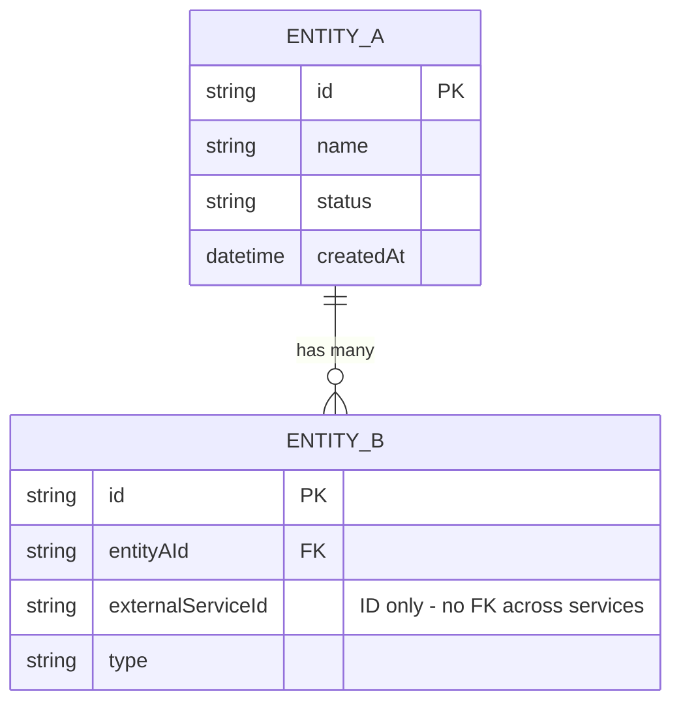

> Codex compatibility note:
> - Invoke repository skills with `$skill-name` in Codex; this mirrored copy rewrites legacy Claude `/skill-name` references.
> - Host-native execution: Codex runs a skill by loading its `SKILL.md` instructions and executing the required steps with available tools. No separate `Skill` tool is required; a loaded skill is already activated.
> - Source vs execution: prefer the registered `.agents/skills/<name>/SKILL.md` for Codex execution. `.claude/**` remains the canonical authoring source; reading it for a registry or source inspection does not switch this session to Claude Code.
> - Capability check: interpret Claude tool names through the active host before declaring a blocker. Continue when Codex can perform the required operation; stop and ask only when the actual capability is unavailable, naming the step and evidence. Host-native execution is not a protocol deviation and needs no extra approval.
> - Task tracker mandate: BEFORE executing any workflow or skill step, create/update task tracking for all steps and keep it synchronized as progress changes.
> - Use ask user tool to ask user.
> - Ignore Claude-specific mode-switch instructions when they appear.
> - Strict execution contract: when a user explicitly invokes a skill, execute that skill protocol as written.
> - Subagent authorization: when a skill is user-invoked or AI-detected and its protocol requires subagents, that skill activation authorizes use of the required `spawn_agent` subagent(s) for that task.
> - Do not skip, reorder, or merge protocol steps unless the user explicitly approves the deviation first.
> - For workflow skills, steps follow the guided contract in `$start-workflow` (gate steps fixed; other steps may flex with a logged reason); report step-by-step evidence.
> - If a required step/tool cannot run in this environment, stop and ask the user before adapting.
> **[BLOCKING] Mode routing — detect FIRST.** Explicit `--mode=review` selects the DDD entity/value-object quality review; no mode is the default business domain analysis (everything below, unchanged). `$domain-analysis --mode=review` is the former `/domain-entities-review`: that slash command no longer exists, and the mode works called directly with no workflow. Read the mode file in full before anything else (see [Mode Dispatch](#mode-dispatch)).

<!-- PROMPT-ENHANCE:STEP-TASK-ANCHOR:START -->

> **[BLOCKING]** Execute skill steps in declared order. NEVER skip, reorder, or merge steps without explicit user approval.
> **[BLOCKING]** Before each step or sub-skill call, update task tracking: set `in_progress` when step starts, set `completed` when step ends.
> **[BLOCKING]** Every completed/skipped step MUST include brief evidence or explicit skip reason.
> **[BLOCKING]** If Task tools are unavailable, create and maintain an equivalent step-by-step plan tracker with the same status transitions.

<!-- PROMPT-ENHANCE:STEP-TASK-ANCHOR:END -->

## Quick Summary

**Goal:** Analyze business artifacts into a user-validated DDD domain model and ERD covering bounded contexts, aggregates, entities, value objects, relationships, and domain events, so downstream implementation uses correct invariants and avoids boundary rework after consumers depend on them.

**Summary:**

- **Purpose:** turn business artifacts into a user-validated DDD model; derive nouns→entities, verbs→events, roles, and processes before classification — NEVER model from guesses.
- **Ordered flow (all steps):** `0` locate active plan, prior research, domain reference, set `{plan-dir}` → `1` load business context → `2` identify contexts and validate boundaries → `3` model entities/VOs/aggregates → `4` map relationships → `5` identify events → `6` generate Mermaid ERD → `7` run 5-8-question user validation → `8` assess new/modified/deprecated reference entities and request approval → `9` update `{plan-dir}/plan.md` `## Domain Model`.
- **Model gates:** apply Entity-vs-VO and aggregate rules (≤5 entities, one transaction, ID-only cross-aggregate references, root-only mutation); flag primitive obsession, anemic models, and cross-service FKs.
- **Closure:** persist the report, confirmed model, approved reference changes, and plan update; keep cross-context communication event-driven with `{AggregateNoun}{PastTenseVerb}` naming.

**Workflow:**

0. **Locate Active Plan & Domain Reference** — Glob `plans/*/plan.md` in the plans root (default `plans/`; `docsRoots.plans.path` in `docs/project-config.json` overrides), read plan + prior research + `domain-entities-reference.md`; set `{plan-dir}`
1. **Load Business Context** — Read idea, business evaluation, refined PBI artifacts; extract nouns→entities, verbs→events, roles, processes
2. **Identify Bounded Contexts** — Group related concepts, define context boundaries (validate grouping with user)
3. **Model Entities & Aggregates** — Define aggregates, entities, value objects per context
4. **Map Relationships** — Entity relationships, cross-context integration points (context map)
5. **Domain Events** — Identify events crossing context boundaries, `{AggregateNoun}{PastTenseVerb}`
6. **Generate ERD** — Mermaid ER diagram with all entities and relationships
7. **User Validation** — Present model, ask 5-8 questions, confirm decisions → `status: confirmed`
8. **Domain Entity Change Assessment** — Compare new/modified/deprecated entities against `domain-entities-reference.md`; update/create only after approval
9. **Update Main Plan** — Append/update `## Domain Model` section of `{plan-dir}/plan.md`

**Key Rules:**

- **MANDATORY IMPORTANT MUST ATTENTION** validate every bounded context boundary with user
- **MANDATORY IMPORTANT MUST ATTENTION** include Mermaid ERD diagram in report
- **MANDATORY IMPORTANT MUST ATTENTION** run user validation interview at end (NEVER skip)
- Every entity belongs to exactly one bounded context
- Cross-context communication via domain events only — NEVER direct references

**Be skeptical. Every claim needs traced proof, confidence percentages >80% to act.**

---

## Mode Dispatch

Detect the mode from the invocation arguments before any other work; do not load a mode file the invocation did not select.

| Mode | Purpose | Read in full FIRST |
| --- | --- | --- |
| _(none)_ | Default business domain analysis — this file | — |
| `--mode=review [changes \| scan [<module>]] [--report-only]` | DDD design-quality review of domain entities and value objects: checklist A–P, health score, validated-finding fix loop (`--report-only`: read-only leaf, no fix). Formerly `/domain-entities-review` | `references/mode-review.md` |

- **[BLOCKING]** When `--mode=review`, read `references/mode-review.md` in full FIRST; it replaces the domain analysis for the invocation (Phase 0 discovery → Phase 5 validation-first loop, scope `changes` by default or `scan [<module>]`) and owns the `--report-only` flag. Workflow invocation and standalone both run it; the mode reads `references/ddd-reference.md` on demand instead of carrying its own primer.

---

## DDD Reference (on-demand)

**[MANDATORY]** Read `references/ddd-reference.md` (in this skill's directory) before Step 2, then re-read the section for each step you enter — never model from memory. Sections: Strategic Design (context-boundary signals, context-map patterns) → Steps 2 and 4 · Entity vs Value Object, Entity Design, Aggregate Design, Repository Pattern → Step 3 · Domain Events → Step 5 · ERD Design → Step 6 · Anti-Patterns Quick Reference → Steps 3 and 7.

---

## Skill Workflow

### Step 0: Locate Active Plan & Domain Reference (MANDATORY)

1. Glob `plans/*/plan.md` sorted by modification time — find active plan directory (plans root default `plans/`; `docsRoots.plans.path` in `docs/project-config.json` overrides)
2. Read `plan.md` — project scope, goals, prior decisions
3. Read all `{plan-dir}/research/*.md` — avoid duplicating prior work
4. Read `domain-entities-reference.md` under the reference-docs root (default `docs/project-reference`; `docsRoots.projectReference.path` in `docs/project-config.json` overrides), if it exists — project's single source of truth for domain entities
5. Set `{plan-dir}` variable — all outputs write to this directory

If no plan directory, create using naming convention from session context.

**MUST ATTENTION update `{plan-dir}/plan.md`** with domain model summary section after completing analysis.

### Step 1: Load Business Context

Read artifacts from prior workflow steps — search the plans root (default `plans/`) and the team-artifacts root (default `team-artifacts/`); `docsRoots.plans.path` / `docsRoots.teamArtifacts.path` in `docs/project-config.json` override those paths:

- Active plan (`{plan-dir}/plan.md`) — scope, goals, constraints
- Business evaluation report — value proposition, customer segments
- Refined PBI — acceptance criteria, user stories, features
- Discovery interview notes — problem statement, user roles

Extract and list:

- **Nouns** — Candidate entities (user, order, product, etc.)
- **Verbs** — Candidate domain events (created, approved, assigned, etc.)
- **Roles** — User types with different permissions/views
- **Processes** — Business workflows (application flow, review cycle, etc.)

### Step 2: Identify Bounded Contexts

Group related entities by DDD principles; apply the context-boundary signals in `references/ddd-reference.md` (Strategic Design).

```markdown
### Bounded Context: {Name}

**Purpose:** {What this context owns — one sentence}
**Classification:** Core domain / Supporting / Generic
**Key Responsibility:** {primary business capability}
**Team ownership:** {suggested team or role}
**Ubiquitous language:** {key terms and their meaning in this context}
```

**Context boundary tests:**

- Same term used by two teams with different meanings? → separate contexts
- Two entities with same name but different invariants? → separate contexts
- Can this context be worked on without understanding the other? → good separation

**MANDATORY IMPORTANT MUST ATTENTION** present identified contexts to user using ask user tool:

- "I identified {N} bounded contexts: {list}. Does this grouping make sense?"
- Options: Agree (Recommended) | Merge {X} and {Y} | Split {Z} | Add missing context

### Step 3: Model Entities & Aggregates

Per bounded context: classify each concept using the Entity vs VO matrix in `references/ddd-reference.md`, then apply its aggregate boundary rules.

```markdown
### {Context Name}

**Aggregate Root:** {EntityName}
**Identity:** {ULID / UUID / Natural key — justify}
**Lifecycle states:** {Draft → Active → Archived, etc.}

- **Child Entities:** {list — share aggregate boundary, identifying FK}
- **Value Objects:** {list — immutable, no identity, embedded}
- **Invariants:** {business rules this aggregate enforces atomically}
- **Factory method:** {Order.Create(...) / Order.Place(...)}

**Other Aggregates in this Context:**

- {Entity} — {purpose, identity strategy, lifecycle}
```

### Entity Detail Template

| Entity | Classification                         | Identity                | Key Fields | Lifecycle States | Invariants       |
| ------ | -------------------------------------- | ----------------------- | ---------- | ---------------- | ---------------- |
| {Name} | Aggregate Root / Entity / Value Object | ULID / UUID / Composite | {fields}   | {states}         | {business rules} |

**VO Composition — MUST ATTENTION verify:**

- 3+ primitives always travel together? → extract VO
- String field has format rules? → extract VO (Email, PhoneNumber)
- Numeric field has range rules? → extract VO (Percentage, Money)
- Concept named by domain experts but not modeled? → make explicit class

**Aggregate Boundary — MUST ATTENTION verify:**

- All entities in aggregate enforced in one transaction?
- Cross-aggregate references use ID only (no navigation properties)?
- Aggregate root is sole entry point for ALL mutations?
- Aggregate ≤ 5 entities? If not — justify or decompose

### Step 4: Map Relationships

#### Intra-Context Relationships

```markdown
| From | To        | Type | Cardinality     | Relationship Kind       | Description              |
| ---- | --------- | ---- | --------------- | ----------------------- | ------------------------ |
| Order | Product  | M:N  | via OrderLine   | Non-identifying (assoc) | Orders contain products  |
```

Apply identifying vs non-identifying relationship rule:

- Identifying relationship (child FK is part of PK) → child entity inside parent aggregate
- Non-identifying FK → likely separate aggregates

#### Cross-Context Integration (Context Map)

```markdown
| Upstream Context | Downstream Context | Pattern | Integration Point          | Sync Mechanism |
| ---------------- | ------------------ | ------- | -------------------------- | -------------- |
| Sales            | Order              | ACL     | Cart becomes Order         | Domain event   |
```

Apply the context-map patterns in `references/ddd-reference.md`:

- **Anti-Corruption Layer** — external/hostile upstream model
- **Customer-Supplier** — downstream can negotiate with upstream
- **Open Host Service** — one upstream, many consumers
- **Conformist** — no negotiating power with upstream

### Step 5: Domain Events

Identify cross-context events; name them `{AggregateNoun}{PastTenseVerb}`.

| Event            | Source Context | Target Context(s)    | Payload (minimal)            | Trigger        |
| ---------------- | -------------- | -------------------- | ---------------------------- | -------------- |
| `OrderPlaced`    | Sales          | Order, Fulfillment   | cartId, productId, placedDate | Checkout completed |

**Event design — MUST ATTENTION verify:**

- Name is past tense + includes aggregate noun?
- Payload includes AggregateId, OccurredOn (UTC), Version?
- Payload minimal — just what changed + correlation IDs?
- Version field included for schema evolution?
- Domain event vs integration event clearly classified?

### Step 6: Generate ERD

Produce Mermaid ER diagram. Apply the ERD-to-Aggregate mapping + anti-patterns from `references/ddd-reference.md`.

````markdown

```mermaid
erDiagram
 %% Bounded Context: {Name}
 ENTITY_A ||--o{ ENTITY_B: "has many"
 ENTITY_A {
 string id PK
 string name
 string status
 datetime createdAt
 }
 ENTITY_B {
 string id PK
 string entityAId FK
 string externalServiceId "ID only - no FK across services"
 string type
 }
```
````

**ERD requirements:**

- Group entities by bounded context (use Mermaid comments `%% Context: ...`)
- Show PK/FK fields and key business fields (not all fields)
- Show cardinality (1:1, 1:N, M:N) using Crow's Foot notation
- Cross-service references: string/ULID field with comment, no relationship line
- Identify association entities for M:N relationships

**ERD — MUST ATTENTION verify before finalizing:**

- No God tables (>20 columns — consider decomposing)?
- No cross-service FK arrows?
- All M:N through explicit named join entity?
- No nullable FK everywhere (clarify optional relationships)?

### Step 7: User Validation Interview

**MANDATORY IMPORTANT MUST ATTENTION** present domain model and ask 5-8 questions using ask user tool:

#### Required Questions

1. **Context boundaries** — "Are these {N} bounded contexts correct? Any missing or misplaced?"
    - Options: Correct (Recommended) | Need changes | Not sure, explain more
2. **Aggregate roots** — "Is {Entity} the right aggregate root for {Context}? It controls {child entities}."
3. **Entity vs VO** — "I modeled {concept} as a Value Object because it has no independent identity. Does that match the business model?"
4. **Relationship verification** — "The {Entity A} to {Entity B} relationship is {type/cardinality}. Is that correct?"
5. **Missing entities** — "Are there business concepts — workflows, roles, rules — I haven't captured as explicit domain objects?"
6. **Event verification** — "When {event} happens, should {contexts} be notified? What data do they need?"

#### Deep-Dive Questions (pick 2-3 based on complexity)

- "Should {Entity} be a separate aggregate or part of {Aggregate}? [separating = eventual consistency between them]"
- "Is {field} really a Value Object or does it need its own identity and lifecycle?"
- "How does {process} work step-by-step? What state transitions are involved?"
- "What happens when {edge case}? Which invariant prevents the bad state?"
- "Which entities change most frequently under concurrent load? (impacts aggregate design)"
- "Any concepts domain experts name that I haven't modeled explicitly?"

After confirmation, update report with final decisions; set `status: confirmed`.

### Step 8: Domain Entity Change Assessment (MANDATORY)

**MANDATORY IMPORTANT MUST ATTENTION** compare domain analysis results against `domain-entities-reference.md` under the reference-docs root (default `docs/project-reference`; `docsRoots.projectReference.path` in `docs/project-config.json` overrides), if it exists:

1. **Identify new entities** — in analysis but not in reference doc
2. **Identify modified entities** — changed fields, relationships, or bounded context assignment
3. **Identify deprecated entities** — in reference doc but no longer needed by feature
4. **Present changes to user** using ask user tool:
    - "Domain entity changes detected: {N} new, {N} modified, {N} deprecated. Proceed with updating domain-entities-reference.md?"
    - Options: Approve all (Recommended) | Review each change | Skip update

If `domain-entities-reference.md` does NOT exist in the reference-docs root (default `docs/project-reference`; `docsRoots.projectReference.path` in `docs/project-config.json` overrides), ask user:

- "No domain-entities-reference.md found. Create it with all entities from this analysis?"
- Options: Yes, create it (Recommended) | No, skip

**After approval:** update/create `domain-entities-reference.md` in the reference-docs root (default `docs/project-reference`; `docsRoots.projectReference.path` in `docs/project-config.json` overrides) in its existing format; append new entities to the appropriate bounded-context section; update fields + relationships for modified entities.

### Step 9: Update Main Plan (MANDATORY)

Read `{plan-dir}/plan.md`, append/update `## Domain Model` section:

```markdown
## Domain Model

- **Bounded Contexts:** {N} — {list names with context map patterns between them}
- **Total Entities:** {N} ({N} aggregates, {N} child entities, {N} value objects)
- **Domain Events:** {N} cross-context events
- **Key Aggregates:** {list with invariant summaries}
- **Key Relationships:** {summary of critical relationships}
- **ERD:** See `phase-01-domain-model.md`
- **Full Analysis:** See `research/domain-analysis.md`
```

---

## Output

```
{plan-dir}/research/domain-analysis.md          # Full domain analysis report
{plan-dir}/phase-01-domain-model.md             # Confirmed domain model with ERD
{plan-dir}/plan.md                              # Updated with domain model summary
docs/project-reference/domain-entities-reference.md  # Updated/created with new/modified entities; docsRoots.projectReference.path in docs/project-config.json overrides this root
```

Report structure:

1. Executive summary (bounded contexts + entity count + key decisions)
2. Context map (bounded contexts with integration patterns)
3. Per-context entity/aggregate detail with identity strategy and invariants
4. Relationship tables (intra + cross-context, identifying vs non-identifying)
5. Value Objects catalog (VO type, attributes, invariants)
6. Domain events catalog (with payload design)
7. Mermaid ERD diagram
8. Anti-pattern warnings (any detected issues in model)
9. Unresolved questions

Report must be **≤250 lines**. Use tables over prose.

---

**MANDATORY IMPORTANT MUST ATTENTION** break work into small todo tasks using task tracking BEFORE starting.
**MANDATORY IMPORTANT MUST ATTENTION** validate EVERY bounded context and key relationship with user using ask user tool.
**MANDATORY IMPORTANT MUST ATTENTION** include Mermaid ERD and confidence % for all architectural decisions.
**MANDATORY IMPORTANT MUST ATTENTION** add a final review todo task to verify work quality.

---

## Next Steps

**MANDATORY IMPORTANT MUST ATTENTION — NO EXCEPTIONS** after completing this skill, use ask user tool to present these options:

- **"$domain-analysis --mode=review (Recommended)"** — Review DDD quality of entities modeled/modified in this analysis (anemic model, VO classification, invariant enforcement, aggregate boundaries)
- **"$tech-stack-research"** — Research tech stack based on domain model
- **"$plan"** — If tech stack already decided and entity quality already reviewed
- **"Skip, continue manually"** — user decides

### Council escalation (always-offer, second prompt)

After the existing `## Next Steps` prompt above resolves, present a **second**, independent ask user tool call (do NOT merge into the first):

- **"Skip council — proceed with model (Recommended)"** — Continue with the bounded contexts / aggregate boundaries as drawn. Recommended default.
- **"Escalate to $llm-council"** — Run 11 sub-agent council (5 advisors + 5 reviewers + chairman). Best applied when bounded-context splits or aggregate boundaries are contested (multiple defensible cuts), the model touches >=3 services, or invariants span aggregates. DDD boundary decisions are hard to reverse once consumers depend on them. Cheaper alternatives: `$why-review`, `$plan --mode=validate` (run these first if you haven't).

---

**MANDATORY IMPORTANT MUST ATTENTION** use task tracking to break ALL work into small tasks BEFORE starting.
**MANDATORY IMPORTANT MUST ATTENTION** use ask user tool at EVERY decision point — validate every bounded context and entity relationship with user.
**MANDATORY IMPORTANT MUST ATTENTION** produce ERD diagram (Mermaid) and domain model report with confidence %.

> **External Memory:** For complex or lengthy work (research, analysis, scan, review), write intermediate findings and final results to a report file in `tmp/reports/` — prevents context loss and serves as deliverable.

> **Evidence Gate:** MANDATORY IMPORTANT MUST ATTENTION — every claim, finding, and recommendation requires `file:line` proof or traced evidence with confidence percentage (>80% to act, <80% must verify first).

---

<!-- PROMPT-ENHANCE:STEP-TASK-CLOSING:START -->

## Prompt-Enhance Closing Anchors

**IMPORTANT MUST ATTENTION** follow declared step order for this skill; NEVER skip, reorder, or merge steps without explicit user approval
**IMPORTANT MUST ATTENTION** for every step/sub-skill call: set `in_progress` before execution, set `completed` after execution
**IMPORTANT MUST ATTENTION** every skipped step MUST include explicit reason; every completed step MUST include concise evidence
**IMPORTANT MUST ATTENTION** if Task tools unavailable, maintain an equivalent step-by-step plan tracker with synchronized statuses

<!-- PROMPT-ENHANCE:STEP-TASK-CLOSING:END -->

## Closing Reminders

**IMPORTANT MUST ATTENTION Goal:** Analyze business artifacts into a user-validated DDD domain model and ERD covering bounded contexts, aggregates, entities, value objects, relationships, and domain events, so downstream implementation uses correct invariants and avoids boundary rework after consumers depend on them.

**IMPORTANT MUST ATTENTION** run ALL 10 ordered steps, none skippable: (0) locate active plan + prior research + domain reference, set `{plan-dir}` → (1) load business artifacts and derive nouns→entities, verbs→events, roles, processes → (2) identify contexts + validate boundaries → (3) model entities/VOs/aggregates → (4) map relationships/context map → (5) identify events → (6) generate Mermaid ERD → (7) run 5-8-question user validation → (8) assess new/modified/deprecated reference entities + request approval → (9) update `{plan-dir}/plan.md` `## Domain Model` — why: dropped steps leave the model un-anchored or un-persisted.
**IMPORTANT MUST ATTENTION** validate EVERY bounded context + key relationship with user using ask user tool — NEVER auto-decide a boundary — why: DDD boundaries are hard to reverse once consumers depend on them; one wrong cut costs days of rework.
**IMPORTANT MUST ATTENTION** domain events ALWAYS follow `{AggregateNoun}{PastTenseVerb}` naming — NEVER command-style (`CancelOrder`) or generic (`OrderStatusChanged`) — why: command/generic names hide what happened and break consumer routing.
**IMPORTANT MUST ATTENTION** NEVER place cross-service FK in the ERD — use ID reference (`{Entity}Id` string/ULID) + event-driven sync only — why: cross-service FK couples schemas and blocks independent deployment.

**MUST ATTENTION** task tracking ALL tasks BEFORE the first artifact read or write; mark one `in_progress`, complete immediately after evidence; on context loss the current task list first — why: compaction wipes prior-work memory, duplicated tasks waste budget.
**MUST ATTENTION** load business artifacts FIRST (plan/PBI/business-eval + `domain-entities-reference.md`) and derive nouns→entities, verbs→events — NEVER model from guesses — why: a model built on assumptions encodes the wrong invariants.
**MUST ATTENTION** search 3+ existing entities in `domain-entities-reference.md` before introducing a new one; reconcile new/modified/deprecated against it and follow its existing format — why: divergent or duplicated domain models fragment the source of truth.
**MUST ATTENTION** evaluate fit before reusing a nearby aggregate/VO pattern — verify the new concept shares the same identity, lifecycle, and transaction scope — why: closest example ≠ matching preconditions.
**MUST ATTENTION** entity vs VO classification — replace with equal-valued copy breaks nothing? → Value Object. Tracked across time or fetched by ID? → Entity. Flag primitive obsession (3+ primitives travel together) and anemic models as you go.
**MUST ATTENTION** every aggregate passes boundary rules — ≤5 entities, one transaction, reference-by-ID only, root is the sole mutation entry; >5 entities → decompose or justify as documented debt.
**MUST ATTENTION** include the Mermaid ERD and a confidence % (>80% to act, <80% verify first) for EVERY architectural decision; cite `file:line` / artifact evidence — NEVER present a boundary or classification as fact without traced proof.
**MUST ATTENTION** persist intermediate findings to `tmp/reports/` incrementally and add a final review task to verify work quality — why: long analysis hits context cutoffs; batched writes lose findings.
**MUST ATTENTION** apply conditional gates: create a plan only when none exists; if the domain reference is missing, ask whether to create it; update it only after approval; present both independent post-analysis ask user tool prompts (Next Steps, then council) — why: user decisions control mutation and terminal routing.

**Anti-Rationalization:**

| Evasion                                          | Rebuttal                                                                          |
| ------------------------------------------------ | --------------------------------------------------------------------------------- |
| "Boundaries are obvious, skip user validation"   | User validation is non-skippable — run the 5-8 question ask user tool interview. |
| "Already know the entities, skip reference doc"  | Show `file:line` from `domain-entities-reference.md`. No proof = not checked.      |
| "This concept is clearly an entity"              | Run the Entity-vs-VO matrix anyway — state confidence %. Pattern-matching skips context. |
| "Small model, skip task tracking"                | Still task tracking first. Skip depth, never skip tracking.                         |
| "Cross-service link is just one FK"              | Never — ID reference + event-driven sync. One FK couples two schemas permanently. |

**IMPORTANT MUST ATTENTION** re-anchor the highest-blast-radius rules: create all tasks before acting; run all ten steps in order; validate every bounded context and key relationship; produce the Mermaid ERD; persist approved domain changes and the plan update.
**IMPORTANT MUST ATTENTION** derive from business artifacts with traced evidence; name events `{AggregateNoun}{PastTenseVerb}`; keep cross-service links ID-only + event-driven — NEVER model from guesses or add cross-service FKs.
**IMPORTANT MUST ATTENTION** preserve approval-dependent reference updates and both independent post-analysis user prompts; do not silently choose a terminal route.
