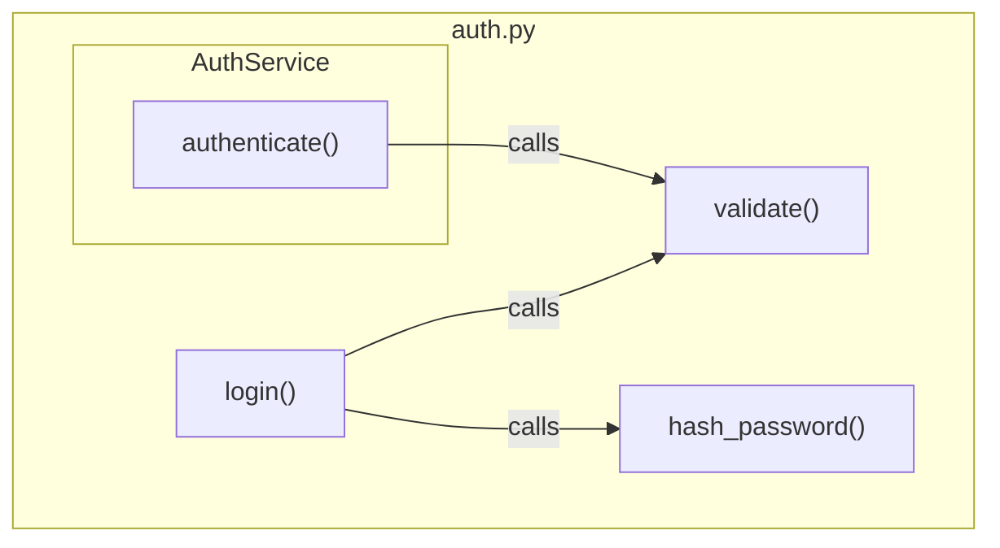

> Codex compatibility note:
> - Invoke repository skills with `$skill-name` in Codex; this mirrored copy rewrites legacy Claude `/skill-name` references.
> - Prefer the `plan-hard` skill for planning guidance in this Codex mirror.
> - Task tracker mandate: BEFORE executing any workflow or skill step, create/update task tracking for all steps and keep it synchronized as progress changes.
> - User-question prompts mean to ask the user directly in Codex.
> - Ignore Claude-specific mode-switch instructions when they appear.
> - Strict execution contract: when a user explicitly invokes a skill, execute that skill protocol as written.
> - Do not skip, reorder, or merge protocol steps unless the user explicitly approves the deviation first.
> - For workflow skills, execute each listed child-skill step explicitly and report step-by-step evidence.
> - If a required step/tool cannot run in this environment, stop and ask the user before adapting.
<!-- CODEX:PROJECT-REFERENCE-LOADING:START -->
## Codex Project-Reference Loading (No Hooks)

Codex does not receive Claude hook-based doc injection.
When coding, planning, debugging, testing, or reviewing, open project docs explicitly using this routing.

**Always read:**
- `docs/project-reference/docs-index-reference.md` (routes to the full `docs/project-reference/*` catalog)
- `docs/project-reference/lessons.md` (always-on guardrails and anti-patterns)

**Situation-based docs:**
- Backend/CQRS/API/domain/entity changes: `backend-patterns-reference.md`, `domain-entities-reference.md`, `project-structure-reference.md`
- Frontend/UI/styling/design-system: `frontend-patterns-reference.md`, `scss-styling-guide.md`, `design-system/README.md`
- Spec/test-case planning or TC mapping: `feature-docs-reference.md`
- Integration test implementation/review: `integration-test-reference.md`
- E2E test implementation/review: `e2e-test-reference.md`
- Code review/audit work: `code-review-rules.md` plus domain docs above based on changed files

Do not read all docs blindly. Start from `docs-index-reference.md`, then open only relevant files for the task.
<!-- CODEX:PROJECT-REFERENCE-LOADING:END -->

<!-- SYNC:critical-thinking-mindset -->

> **Critical Thinking Mindset** — Apply critical thinking, sequential thinking. Every claim needs traced proof, confidence >80% to act.
> **Anti-hallucination:** Never present guess as fact — cite sources for every claim, admit uncertainty freely, self-check output for errors, cross-reference independently, stay skeptical of own confidence — certainty without evidence root of all hallucination.

<!-- /SYNC:critical-thinking-mindset -->

# Export Graph as Mermaid Diagram

Export a single file's internal graph structure from `.code-graph/graph.db` as a Mermaid flowchart in a markdown file.

## Quick Summary

**Goal:** [Code Intelligence] Export a single file

**Workflow:**

1. **Detect** — classify request scope and target artifacts.
2. **Execute** — apply required steps with evidence-backed actions.
3. **Verify** — confirm constraints, output quality, and completion evidence.

**Key Rules:**

- MUST ATTENTION keep claims evidence-based (`file:line`) with confidence >80% to act.
- MUST ATTENTION keep task tracking updated as each step starts/completes.
- NEVER skip mandatory workflow or skill gates.

## Prerequisites

- Graph must be built first: run `$graph-build` if `.code-graph/graph.db` doesn't exist
- Requires Python 3.10+ with tree-sitter, tree-sitter-language-pack, networkx

## Steps

1. **Export file graph as Mermaid** — Run via Bash (positional or `--file` flag both work):

    ```bash
    python .claude/scripts/code_graph export-mermaid <relative-path> --json
    # OR
    python .claude/scripts/code_graph export-mermaid --file <relative-path> --json
    ```

Default output: `.code-graph/<path-based-unique-name>-graph.md` (e.g., `docs--project-config-graph.md`)

2. **Custom output path** (optional):

    ```bash
    python .claude/scripts/code_graph export-mermaid <relative-path> -o custom-path.md --json
    ```

3. **Report results:** File path, node count, edge count.

## Output Format

````markdown
# Graph: src/auth.py


````

## What's Included

- Functions, classes, and test functions within the file
- Internal call relationships (both caller and callee in the file)
- Class membership shown via nested subgraphs
- Edge types: calls, imports, inherits, implements, tests, depends
- **Non-code files (markdown, JSON):** renders outgoing and incoming `IMPORTS_FROM` edges as a reference graph

## What's Excluded

- External/stdlib function calls (e.g., `parseInt`, `trim`)
- Cross-file relationships for code files (callers from other files)
- CONTAINS edges (shown structurally via subgraphs instead)

## Implicit Edge Types

Mermaid diagrams include implicit edges when present in the graph:

- `MESSAGE_BUS` edges show cross-service message flow
- `TRIGGERS_EVENT` edges show entity-to-event-handler relationships
- `API_ENDPOINT` edges show frontend-to-backend API connections

These edges are rendered alongside structural edges (CALLS, IMPORTS_FROM, INHERITS).

## Use Cases

- Visualize a file's internal function call graph
- Understand code structure before refactoring
- Document architecture in markdown-compatible format
- Review file complexity and coupling

---

<!-- SYNC:ai-mistake-prevention -->

> **AI Mistake Prevention** — Failure modes to avoid on every task:
>
> **Check downstream references before deleting.** Deleting components causes documentation and code staleness cascades. Map all referencing files before removal.
> **Verify AI-generated content against actual code.** AI hallucinates APIs, class names, and method signatures. Always grep to confirm existence before documenting or referencing.
> **Trace full dependency chain after edits.** Changing a definition misses downstream variables and consumers derived from it. Always trace the full chain.
> **Trace ALL code paths when verifying correctness.** Confirming code exists is not confirming it executes. Always trace early exits, error branches, and conditional skips — not just happy path.
> **When debugging, ask "whose responsibility?" before fixing.** Trace whether bug is in caller (wrong data) or callee (wrong handling). Fix at responsible layer — never patch symptom site.
> **Assume existing values are intentional — ask WHY before changing.** Before changing any constant, limit, flag, or pattern: read comments, check git blame, examine surrounding code.
> **Verify ALL affected outputs, not just the first.** Changes touching multiple stacks require verifying EVERY output. One green check is not all green checks.
> **Holistic-first debugging — resist nearest-attention trap.** When investigating any failure, list EVERY precondition first (config, env vars, DB names, endpoints, DI registrations, data preconditions), then verify each against evidence before forming any code-layer hypothesis.
> **Surgical changes — apply the diff test.** Bug fix: every changed line must trace directly to the bug. Don't restyle or improve adjacent code. Enhancement task: implement improvements AND announce them explicitly.
> **Surface ambiguity before coding — don't pick silently.** If request has multiple interpretations, present each with effort estimate and ask. Never assume all-records, file-based, or more complex path.

<!-- /SYNC:ai-mistake-prevention -->
<!-- SYNC:critical-thinking-mindset:reminder -->

**MUST ATTENTION** apply critical thinking — every claim needs traced proof, confidence >80% to act. Anti-hallucination: never present guess as fact.

<!-- /SYNC:critical-thinking-mindset:reminder -->
<!-- SYNC:ai-mistake-prevention:reminder -->

**MUST ATTENTION** apply AI mistake prevention — holistic-first debugging, fix at responsible layer, surface ambiguity before coding, re-read files after compaction.

<!-- /SYNC:ai-mistake-prevention:reminder -->

## Closing Reminders

- **MANDATORY IMPORTANT MUST ATTENTION** break work into small todo tasks using task tracking BEFORE starting
- **MANDATORY IMPORTANT MUST ATTENTION** search codebase for 3+ similar patterns before creating new code
- **MANDATORY IMPORTANT MUST ATTENTION** cite `file:line` evidence for every claim (confidence >80% to act)
- **MANDATORY IMPORTANT MUST ATTENTION** add a final review todo task to verify work quality

**[TASK-PLANNING]** Before acting, analyze task scope and systematically break it into small todo tasks and sub-tasks using task tracking.

<!-- CODEX:SYNC-PROMPT-PROTOCOLS:START -->
## Hookless Prompt Protocol Mirror (Auto-Synced)

Source: `.claude/hooks/lib/prompt-injections.cjs` + `.claude/.ck.json`

## [WORKFLOW-EXECUTION-PROTOCOL] [BLOCKING] Workflow Execution Protocol — MANDATORY IMPORTANT MUST CRITICAL. Do not skip for any reason.

1. **DETECT:** Match prompt against workflow catalog
2. **ANALYZE:** Find best-match workflow AND evaluate if a custom step combination would fit better
3. **ASK (REQUIRED FORMAT):** Use a direct user question with this structure:
   - Question: "Which workflow do you want to activate?"
   - Option 1: "Activate **[BestMatch Workflow]** (Recommended)"
   - Option 2: "Activate custom workflow: **[step1 → step2 → ...]**" (include one-line rationale)
4. **ACTIVATE (if confirmed):** Call `$workflow-start <workflowId>` for standard; sequence custom steps manually
5. **CREATE TASKS:** task tracking for ALL workflow steps
6. **EXECUTE:** Follow each step in sequence
**[CRITICAL-THINKING-MINDSET]** Apply critical thinking, sequential thinking. Every claim needs traced proof, confidence >80% to act.
**Anti-hallucination principle:** Never present guess as fact — cite sources for every claim, admit uncertainty freely, self-check output for errors, cross-reference independently, stay skeptical of own confidence — certainty without evidence root of all hallucination.
**AI Attention principle (Primacy-Recency):** Put the 3 most critical rules at both top and bottom of long prompts/protocols so instruction adherence survives long context windows.
## Learned Lessons

# Lessons

<!-- This file is referenced by Claude skills and agents for project-specific context. -->
<!-- Fill in your project's details below. -->

- [2026-03-10] **Mirror copies create staleness traps.** Editing a canonical source is insufficient when mirror copies exist — must trace and update ALL mirrored files (configs, skill definitions, docs). Grep verification after edits catches missed mirrors.
- [2026-03-10] **Docs embedding derived data stale on source modification.** Documentation that inlines data from a canonical source (e.g., workflow sequences, API schemas) goes stale silently when the source changes. Map all docs that embed canonical data and update them alongside the source.
- [2026-04-14] **Front-load report-write in sub-agent prompts for large reviews.** Sub-agents reviewing many files exhaust token budget before writing the final report — all findings lost. Design prompts so: (1) report-write is the explicit first deliverable, (2) findings appended per-file immediately (not batched), (3) scope is bounded. If sub-agent returns truncated output with no report, spawn a new one with narrower scope.
- [2026-04-14] **After context compaction, re-verify all prior phase outcomes before continuing.** Session summaries describe what the AI intended — not what persisted in the environment. When resuming a multi-phase task, the first action must be a state audit: re-check git status, re-read files, verify filesystem state. Treat every "completed" phase claim as an untested hypothesis.
## [LESSON-LEARNED-REMINDER] [BLOCKING] Task Planning & Continuous Improvement — MANDATORY. Do not skip.

Break work into small tasks (task tracking) before starting. Add final task: "Analyze AI mistakes & lessons learned".

**Extract lessons — ROOT CAUSE ONLY, not symptom fixes:**
1. Name the FAILURE MODE (reasoning/assumption failure), not symptom — "assumed API existed without reading source" not "used wrong enum value".
2. Generality test: does this failure mode apply to ≥3 contexts/codebases? If not, abstract one level up.
3. Write as a universal rule — strip project-specific names/paths/classes. Useful on any codebase.
4. Consolidate: multiple mistakes sharing one failure mode → ONE lesson.
5. **Recurrence gate:** "Would this recur in future session WITHOUT this reminder?" — No → skip `$learn`.
6. **Auto-fix gate:** "Could `$code-review`/`/simplify`/`$security`/`$lint` catch this?" — Yes → improve review skill instead.
7. BOTH gates pass → ask user to run `$learn`.
**[TASK-PLANNING] [MANDATORY]** BEFORE executing any workflow or skill step, create/update task tracking for all planned steps, then keep it synchronized as each step starts/completes.

<!-- CODEX:SYNC-PROMPT-PROTOCOLS:END -->
