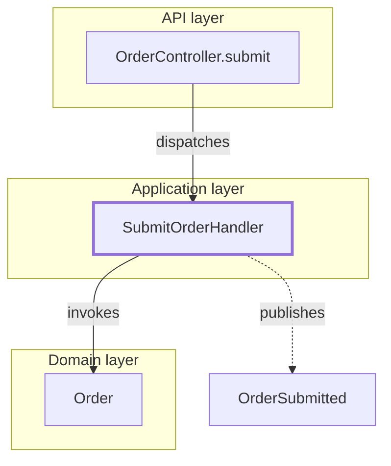
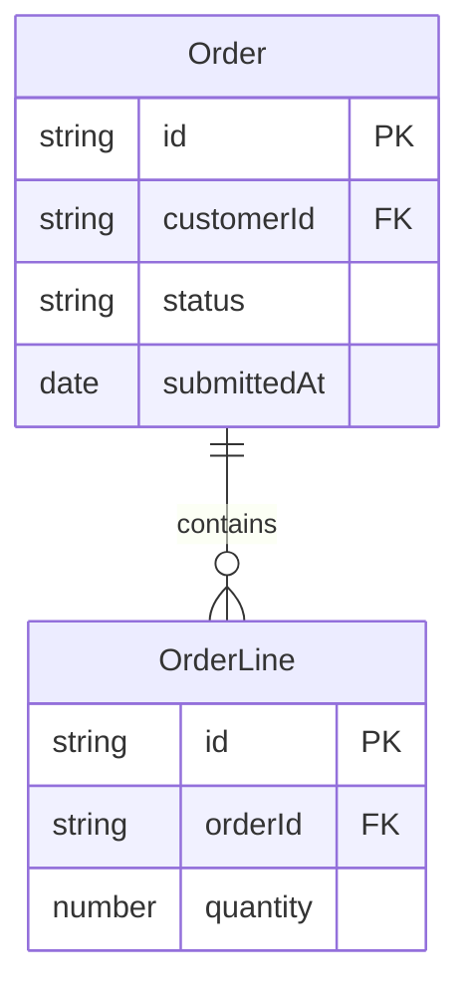
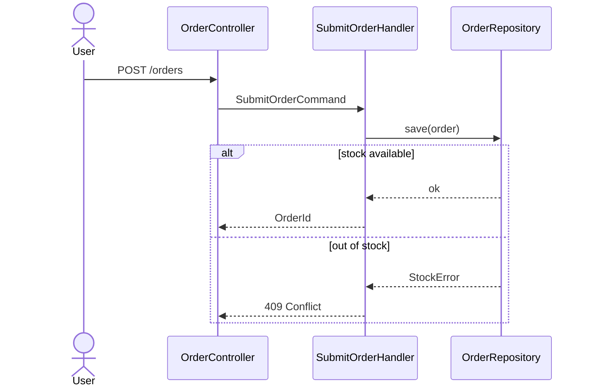
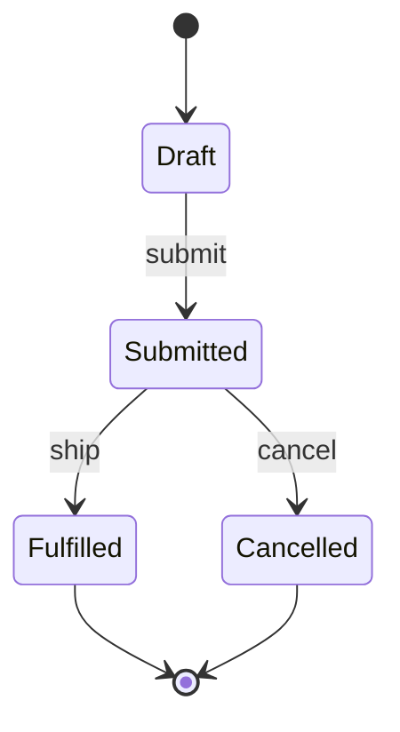
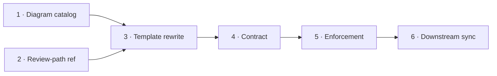
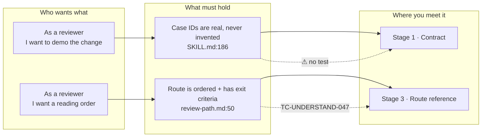
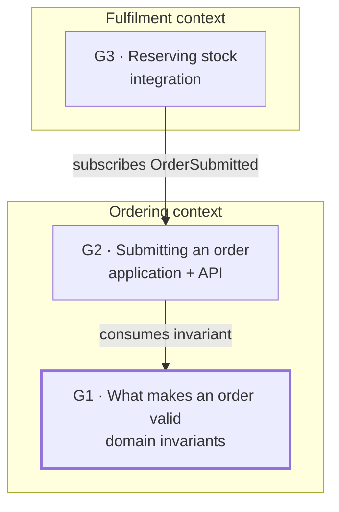

# Diagram Catalog — the §2 Visual Map contract

> Loaded at Step 0. This file answers three questions the run must never improvise: **which diagrams are mandatory**, **how each is derived from real evidence**, and **what to emit when one genuinely cannot be derived**.
>
> Mermaid only — it renders inline in the report with no dependency and no build step.

## The diagram set

**Mandatory** means *always attempted*, for every target. An underivable mandatory diagram degrades to a **stated blocker** (see the ladder below) — never to silence. The Status column answers **"is this diagram owed?"**, never "which section renders it" — D5 is owed on every report and renders in §4, not §2.

| ID | Diagram | Status | Fires when |
| --- | --- | --- | --- |
| **D1** | System / component `flowchart` | **MANDATORY** | Always |
| **D2** | Domain `erDiagram` | **MANDATORY** | Always |
| **D3** | `sequenceDiagram` — one per main flow | **MANDATORY** | Always (one per main flow — every one, no maximum) |
| D4 | `stateDiagram-v2` | Conditional | An in-scope entity has a `status` / `state` / `phase` / `stage` field, an enum of lifecycle values, or a transition guard |
| **D5** | Review-path `flowchart` | **MANDATORY** — rendered in §4, not §2 | Always. The reading order: which group of files to open first, then next. **Fully owned by `references/review-path.md`** — purpose, derivation, skeleton, labelling and failure modes all live there, so D5 has no spec below. WRONG when duplicated into §2: §2 shows *what the system is*, §4 *how to read it* |
| D6 | Phase / milestone `flowchart` | Conditional | The target is a **plan**, roadmap, or multi-phase sequence |
| **D7** | Story-map `flowchart` | **MANDATORY** | Always. Renders the §3 stories and the §4 route as ONE picture — the bridge between what the change is *for* and where you start reading |
| **D8** | Group-map `flowchart` | Conditional | The run decomposed the target into **≥2 understanding groups** (observable in the group ledger). Renders ONCE, in the report's **spine region** — the header region above the first `# G{n}` block — never inside a group block |

**Trigger discipline.** A conditional diagram fires on something **observable in the code or artifact** — a field, an enum, a file type. Never on "it would be useful here". A `stateDiagram` for a change with no state machine is noise that costs the reader attention and costs you credibility.

---

## Per-diagram specs

Each spec has the same five fields: **purpose · derivation source · skeleton · labelling rule · what makes it WRONG**. **D5 has no spec here** — `references/review-path.md` owns all five of its fields, and a stub that only pointed there is what drifted out of agreement with the table above three times running.

### D1 — System / component flowchart (MANDATORY)

- **Purpose:** the one picture that orients a reviewer before they open any file — what talks to what, and where the change landed.
- **Derivation source:** `code_graph trace <file> --direction both --node-mode file --json` → grep+read of imports/references → the diff's own file list grouped by directory.
- **Labelling:** reuse `graph-export`'s vocabulary — nodes are files/classes/functions, edges are labelled with the relationship (`-->|calls|`, `-->|imports|`), and layer grouping uses `subgraph`. Mark changed nodes so the reader sees the blast site at a glance.
- **Skeleton:**

- **WRONG when:** it shows the architecture you expect rather than the one you traced; or it omits the changed files, leaving the reader unable to locate the diff.

### D2 — Domain `erDiagram` (MANDATORY)

- **Purpose:** the nouns and their relationships — what data the feature owns and how it connects.
- **Derivation source:** an existing spec §5 `erDiagram` (**lift it verbatim** — cheapest correct source) → entity/model class fields read from source → migration or schema files.
- **Labelling:** match the repo standard exactly (`spec/references/author.md:744-760`, `domain-analysis/SKILL.md:708-720`): **tech-agnostic types only** — `string`, `number`, `boolean`, `date`, `list`, `map`. Mark `PK` / `FK`. Cardinality carries a quoted label. Cross-service references are ID-only, annotated as such.
- **Skeleton:**

- **WRONG when:** it uses database types (`varchar`, `uuid`, `int4`) instead of the tech-agnostic set; or it invents a relationship that no foreign key, navigation property, or query actually establishes.

### D3 — `sequenceDiagram` per main flow (MANDATORY)

- **Purpose:** the verbs — the ordered call path a request actually takes, which is what a reviewer walks when checking correctness.
- **Derivation source:** `code_graph trace <entrypoint> --direction down --json` → read the handler/service chain → the test that exercises the flow.
- **Labelling:** participants are components, not files. One diagram **per flow** — draw every main flow the change touches; omit none, and there is no maximum. Show the failure branch when the change has one — `alt` / `else`.
- **Skeleton:**

- **WRONG when:** it shows only the happy path on a change whose whole point is the error branch; or a participant appears that no traced call reaches.

### D4 — `stateDiagram-v2` (conditional)

- **Purpose:** the legal lifecycle — which transitions exist, and which the change adds, removes, or guards.
- **Derivation source:** the enum or constant set defining the states → the methods/guards that perform transitions → any state-machine config.
- **Labelling:** states are domain terms, not codes. Transition labels name the **event or command** that causes them. Mark the transitions this change touches.
- **Skeleton:**

- **WRONG when:** it lists the enum's values without the transitions between them — that is a list, not a state machine; or it omits a transition the code allows, implying an invariant that is not enforced.

### D6 — Phase / milestone flowchart (conditional)

- **Purpose:** for a plan target — the sequence, what each phase delivers, and what blocks what.
- **Derivation source:** the plan's own phase table and its stated dependencies. Never inferred from phase numbering alone; ordering claims come from a declared dependency.
- **Labelling:** one node per phase carrying its number and deliverable. Edges are dependencies, not mere sequence.
- **Skeleton:**

- **WRONG when:** it renders phases as a straight line when the plan declares parallelism, or vice versa.

### D7 — Story map (MANDATORY)

- **Purpose:** the single picture that answers *"what is this **for**, and where do I start?"* — it puts each user story next to the business rule it protects, the test that proves it, and the review stage where the reviewer will actually meet it. It is the bridge between §3 and §4, and it is the diagram a reviewer looks at first.
- **Derivation source:** §3 and §4, which are both already derived — D7 introduces **no new claim**. Every story node restates a §3 story, every rule node restates a §3 invariant with its `file:line`, every stage node restates a §4 stage. If a story/rule/stage is not in §3 or §4, it does not belong in D7; if D7 seems to need one that is missing, the defect is in §3/§4 and is fixed there.
- **Labelling:** a story with **no** covering test carries the node label `⚠ no test` — the same coverage gap §3 records, made visible. **Never** invent a `TC-*` ID to fill a node (`[ANTI-HALLUCINATION]`).
- **Skeleton:**

- **WRONG when:** it invents a story the spec does not carry, cites a test ID that does not exist, or shows stories with no edge into the route — a story the reviewer never *meets* while reading is a story the route failed to cover, and that is a §4 defect D7 exists to expose.
- **Form note:** for a target with no user-facing story (F6), D7 maps **invariants** instead, with node labels saying *"invariant, not story"* — see Table 3 of 3 in `references/report-template.md`. The picture is still owed; only its left-hand column changes.

### D8 — Group map (conditional — multi-group targets only)

- **Purpose:** the one picture that makes a large target navigable — what the **understanding groups** are, how they depend on each other, and where the reader enters. Without it a 60-file or whole-project report is a wall; with it the reader sees the whole shape in seconds and knows which block to open.
- **Derivation source:** the group registry (`references/scale-protocol.md` §1 — IDs, names, scopes, depends-on) → cross-group edges traced with `code_graph trace <group entry> --direction both --node-mode file --json` → grep of imports/references **across group boundaries**. An edge means *"this group consumes something that group owns"* — never mere adjacency, never shared directory.
- **Labelling:** one node per group carrying `G{n}` plus the group name in domain words — never a path. Edges are labelled with what crosses the boundary (`-->|consumes invariant|`, `-->|subscribes event|`). Mark the entry group — the one §4's group route opens with. At S4, wrap groups in a `subgraph` per bounded context.
- **Skeleton:**

- **WRONG when:** its nodes are directories rather than explainable units; an edge asserts a dependency that no import, call, or message actually establishes; or it duplicates the spine's D5 reading order instead of showing structure — **D8 is what the groups ARE, D5 is the order you read them in** (the same §2-vs-§4 split, one altitude up).

---

## Derivation ladder

Walk it top-down per diagram. Stop at the first rung that yields verified nodes.

1. **Graph trace** — `python .claude/scripts/code_graph trace <file> --direction both --json` (Windows: `py -3`). Highest confidence; edges are traced.
2. **Grep + read** — find the references, open the files, record what you actually read. Edges from a read call site are traced; edges from a name match alone are **inferred**.
3. **Spec / plan text** — an existing `erDiagram` or a declared dependency list. Traced, because the artifact asserts it.
4. **STATE THE BLOCKER.** Emit the diagram with **only the nodes you verified**, and one line beneath naming what you could not derive and why.

> **The ladder never terminates in invented nodes.** A diagram with three real nodes and a stated gap is useful. A diagram with ten plausible nodes and one wrong edge is worse than no diagram — a reviewer trusts a picture more than prose and verifies it less. **Never emit an empty fence.**

## Provenance marking

| Rendering | Means | Rule |
| --- | --- | --- |
| Solid edge (`-->`) | **Traced** — you followed a graph edge or read the call site | Default. No annotation needed |
| Dashed edge (`-.->`) | **Inferred** — naming, convention, or a framework contract implies it, but you did not read the call | MUST also be listed beneath the diagram: *"Inferred: H ⇢ B — publishes via convention, not traced"* |
| Neither | **Fabricated** | Not a rendering choice. A fabricated edge is a **failed section** |

Every diagram carries a one-line legend when it contains any dashed edge.

## Size discipline

A diagram over **~20 nodes** stops being a map and becomes a hairball. Two remedies, in order:

1. **Split by layer** — one diagram per architectural layer, or one per bounded context.
2. **Collapse into `subgraph`s** — group the detail behind a named boundary and show only the boundary's edges.

**An unreadable diagram is a failed diagram**, exactly as an empty one is. Size is part of the contract, not a style preference — and this is a **split trigger**, not a cap: both remedies above preserve every node.

**At multi-group scale the split is already made for you:** D1, D2 and D3 render **per group**, inside that group's block, each bounded by the ~20-node rule over that group's files only. The spine region carries D8 plus a boundary-only scope view — group nodes and the edges between them, never every file in the system. — why: one whole-project flowchart is the hairball this rule exists to prevent, and the grouping is the layer split rung 1 already asks for — and because every group now renders into the SAME file, the ~20-node bound is what keeps that file readable; it is a harder rule here, never a softer one.

## Redaction

Diagrams are generated from real source into a report. **No secret value ever enters a diagram** — connection strings, tokens, keys, passwords, and customer identifiers render as placeholders: `<redacted:connstring>`, `<redacted:apikey>`, `<redacted:customer-id>`. Name the setting, never its value. This holds for node labels, edge labels, and the legend alike.

## Target forms

**This file defines which diagrams are owed and how each is derived; it does NOT define the target forms.** What each diagram *shows* for a given form is **Table 3 of 3 in `references/report-template.md`**. Read it there.

Every form gets every mandatory diagram, in the form that target actually has. **Never write a form list here** — the registry and all three per-form tables live together in `report-template.md` precisely so a form cannot be added to one and forgotten in another.
