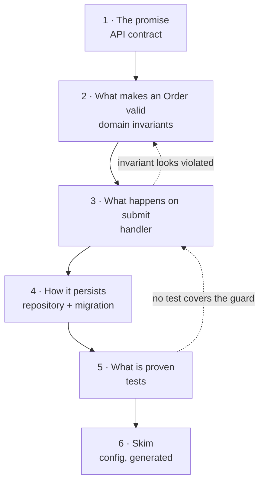

# Review Path — the §4 route contract

> Loaded at Step 0. This file turns a change set into an **ordered reading route**: which group of files to open first, then next, and what the reviewer must be able to answer before moving on.
>
> A route is not a file list. The difference is the **exit criterion**.

## Layer taxonomy

Eight stack-agnostic buckets. Discovery is by `docs/project-config.json` key first, path pattern second — **never a hardcoded framework path**, because this skill runs on repos it has never seen.

| # | Layer | What it decides | Discovery heuristic |
| --- | --- | --- | --- |
| L1 | **Contracts / API surface** | What callers are promised | `api` key; paths matching `*controller*`, `*route*`, `*endpoint*`, `*.proto`, `openapi*`, `*dto*` |
| L2 | **Domain model & invariants** | What is *true* — the rules everything else must hold | `modules` domain entries; `*entity*`, `*model*`, `*domain*`, `*aggregate*`, `*valueobject*` |
| L3 | **Application logic / handlers** | What *happens* when a contract is invoked | `*handler*`, `*command*`, `*query*`, `*service*`, `*usecase*`, `*interactor*` |
| L4 | **Persistence & migrations** | How state survives | `databases` key; `*repository*`, `*migration*`, `*schema*`, `*dao*` |
| L5 | **Integration / messaging** | What crosses a process boundary | `messaging` key; `*event*`, `*consumer*`, `*producer*`, `*client*`, `*adapter*` |
| L6 | **UI** | What a human sees | `componentSystem` / `designSystem` / `styling` keys; component and style file extensions |
| L7 | **Tests** | What is *proven* | `testing` / `e2eTesting` keys; test path globs from those keys |
| L8 | **Config / infra / generated** | Everything that is read, not reasoned about | `infrastructure` key; lockfiles, generated markers, CI config |

A file that matches two buckets goes in the **lower-numbered** one — meaning outranks mechanism. State the call in the stage's *why now* field so a reader can see and discount a misfile.

## Ordering algorithm

Deterministic: the same change set always yields the same stage order.

1. **Seed with meaning.** The route starts at the lowest-numbered non-empty layer among L1-L2. If both are empty, start at the lowest-numbered non-empty layer overall.
2. **Walk outward.** `python .claude/scripts/code_graph trace <seed> --direction both --json` (Windows: `py -3`). Order files *within* a stage by call-graph dependency — callees before callers.
3. **Break ties by blast radius, descending.** Where two files are peers, the higher-reach file goes first. This reuses the signal `changes-review/SKILL.md:161` already establishes ("prioritize file review order, highest-impact files first") — the route **adopts** it as the tie-break rather than replacing it, so the two skills never disagree on the same diff.
4. **Tests last.** L7 is always the final substantive stage — it is the verification pass, read once you know what should be true.
5. **Skim bucket.** L8 plus generated/boilerplate files collapse into a single final "skim" stage. Never distribute them through the route.
6. **No stage ceiling.** One stage per meaningful shift in what the reviewer is checking. Fewer than three → the change is small; say so. A route that grows long is a signal the **GROUP** is too big — **split the group, never collapse the stages** (`SKILL.md` Step 0.5). A 15-stage route is not followed; a 15-stage route is also not the remedy for a 15-stage problem.

## Context inclusion

The route covers **changed files PLUS the unchanged files a reviewer needs in order to judge them**. A handler diff you cannot evaluate without its entity's invariant is not reviewable on its own.

**Walk one hop outward** from each changed file (graph `trace --direction both`; grep of imports/references when no graph) and admit an unchanged file as *context* only when it supplies **the standard the change is measured against**:

1. **Invariant owner** — the entity/aggregate whose rule the changed code must uphold
2. **Interface satisfied** — the contract the changed implementation claims to fulfil
3. **Base-class contract** — the inherited behaviour the change must not break
4. **Governing spec/TC** — the specification or test case defining expected behaviour

**Every context file renders `[context — not changed]`** inside its stage's file group. Without the marker a reviewer burns effort on unchanged code, or finds a pre-existing issue and attributes it to this change.

**No cap on context files.** Route every unchanged file the reviewer needs in order to judge the changed ones — the invariant owner, the interface satisfied, the base-class contract, the governing spec/TC — **highest blast radius first** (rule 3's tie-break). If the list grows past what a stage can carry, that is a split signal for the stage or the group, **never a reason to leave a needed file unrouted**.

> **§4 bounds the ROUTE, never the reader's context.** §4 admits only what is needed to *walk* the route; **§1 owes the full picture of the pre-existing system** — every file the route touches, and every file it did not need to. If a stage's context list grows past what a reviewer can hold in one sitting, that is the split signal above, not a licence to name a file and leave it unexplained.

## Stage record contract

Every stage carries **all eight** fields. A stage missing any of them is a failed stage.

| # | Field | Rule |
| --- | --- | --- |
| 1 | **Stage N** | Sequential, from 1 |
| 2 | **Name** | What this stage is *about*, in domain words — not the layer number |
| 3 | **File group** | Explicit paths. Each marked changed, or `[context — not changed]` |
| 4 | **Why this stage is here now** | The reason it precedes the next one. States the layer call so a misfile is visible |
| 5 | **What to check** | Concrete, checkable items — not "review the code" |
| 6 | **Red flags** | Sourced, not invented (see below) |
| 7 | **Exit criterion** | **A question the reviewer can answer.** Not "you have read the files" |
| 8 | **Time-box** | Honest minutes. A stage over 30 min should have been split |

### Worked example

> **Stage 2 · What makes an Order valid** — 15 min
>
> - `src/domain/Order.cs` — changed
> - `src/domain/OrderLine.cs` — changed
> - `src/domain/IPricingPolicy.cs` — `[context — not changed]` *(interface the changed pricing call satisfies)*
> - *further context available: `src/domain/Money.cs`, `src/domain/Discount.cs`*
>
> **Why now:** Stage 3's handler mutates this aggregate. You cannot tell a correct mutation from an incorrect one until you know the invariant. Classified L2 (domain) because it owns rules, though it also carries persistence attributes.
> **What to check:** the new `status` transition guard; whether `AddLine` still enforces the non-empty-order rule; whether `IPricingPolicy`'s contract is actually satisfied by the new call.
> **Red flags:** invariant enforced in a setter rather than a factory/method (`code-review-rules.md`); a public setter on a field the invariant depends on.
> **Exit criterion:** *Can you state, in one sentence, what now makes an Order invalid that did not before?*

## Route flowchart (D5)

Rendered in §4, above the stage table. Nodes are stages; edges are reading order; **at least one back-edge** shows where a failed check sends the reviewer.

## "Start here" — mandatory one-liner

Above the stage table, **exactly one sentence** naming the ONE file to open first and why:

> **Start here:** `src/domain/Order.cs` — it owns the invariant every other changed file has to respect.

This is the single most actionable line the report produces. It is never omitted, never a list, and never hedged.

## Red-flag sourcing

Per stage, walk the ladder and stop at the first rung that yields rules:

1. `docs/project-reference/code-review-rules.md` — the repo's own codified rules
2. The repo's review skills (`changes-review`, `architecture-review`, `security-review`, `domain-entities-review`) for rules matching the stage's layer
3. `docs/project-config.json` → `referenceDocs` for the layer's pattern doc
4. **STATE THE FALLBACK.** No codified rules exist → say so — *"no project review rules found; red flags below are general-practice, not repo doctrine"* — and give general-practice flags labelled as such.

**Never invent a rule and present it as the repo's.** A fabricated house rule is worse than no rule: the reviewer enforces it on a colleague.

## Graph-absent degradation

No `.code-graph/graph.db` → the algorithm still runs, with grep+read of imports/references replacing the trace in rules 2 and 3, and the one-hop context walk. Ordering within a stage falls back to layer + path grouping.

**The emitted route MUST carry the trust label:** *"Route derived by grep, not graph trace — ordering within stages is approximate."* The reader calibrates on it. Silently emitting a grep-derived route as if it were traced is the same failure class as an unmarked inferred edge in a diagram.

## Scale — the bound is PER GROUP, and a group route sits above it

When `SKILL.md` Step 0.5 decomposes the target into **≥2 understanding groups**, everything above runs **once per group, over that group's files only** — the layer taxonomy, the ordering algorithm, and the routing rules alike. A 60-file target never produces a 20-stage route; it produces 8 groups with a short route each. — why: a 15-stage route is not followed, and that fact does not change when the target grows — so **the remedy is more groups, never more stages**.

**Above the per-group routes sits the GROUP route** — the spine's §4. Same eight-field grammar, one altitude up:

| Field | At group altitude |
| --- | --- |
| **Stage N** | The group's reading position (G-order, not file order) |
| **Name** | What the group is about, in domain words |
| **File group** | The group's **anchor** (`#g{n}-{slug}`) plus its entry files; groups it depends on marked `[context — already read]` |
| **Why now** | The dependency or contract reason this group precedes the next |
| **What to check** | The claim the reader should be able to make about this group once done |
| **Red flags** | Cross-group flags only — a boundary crossed, a contract consumed but not owned, a duplicated invariant |
| **Exit criterion** | A question that spans the group — *"can you state what G3 guarantees to G5?"* |
| **Time-box** | The group's honest total: block plus its entry files |

**"Start here" stays exactly one sentence** — it names the first GROUP and, inside it, the one file to open first. Never a list of groups.

**D5 renders at both altitudes:** a group-level flowchart in the spine region (nodes are groups, edges are reading order, back-edges where a failed check sends the reader to an earlier group), and the usual stage-level flowchart inside each group block. **Do not merge it with §2's D8 group map** — D8 shows what the groups ARE and how they depend on each other; the spine's D5 shows the ORDER you read them in. Same §2-vs-§4 split as at file altitude, one level up.

## Security

The route names paths and quotes red flags. When a stage's file group includes config or secret-bearing files, name the file and the **class** of setting to check — *"verify no credential is committed"* — and **never reproduce a secret value** into the report. Same rule as the diagram catalog: name the setting, never its value.

## Target-form variants

**This file defines the route's algorithm and grammar; it does NOT define the target forms.** What each form makes of §4 — what "route" means for it, where stage 1 seeds, and what its exit criteria interrogate — is **Table 2 of 3 in `references/report-template.md`**. Read it there.

The eight-field grammar above is identical for every form; only that table's three fields change. **Never write a form list here** — the registry and all three per-form tables live together in `report-template.md` precisely so a form cannot be added to one and forgotten in another.
