# Claude AI Agent Framework — Architecture & Best Practices

> How to engineer Claude Code into a self-reinforcing, hallucination-resistant, context-aware AI development agent through hooks, skills, workflows, and specialized agents.

**Audience:** AI engineers, tech leads, and teams wanting to build reliable AI-assisted development systems.
**Scope:** What each layer does, why it exists, how the pieces compose, the design principles behind every decision, and which AI agent best practices each addresses.

> **Document Sync Status** — Current local verification (2026-06-13): **54 hook files · 156 skills · 17 workflows · 29 agents** using the ADR-0002 filesystem metrics. Codex mirrors are committed under `.agents/`, `.codex/`, and `AGENTS.md`; Copilot instructions are generated on demand by the Copilot sync skills/scripts. Notable mechanisms documented here include multi-AI-tool portability (§13), behavioral-principle injection (§8.21), self-validating review (§8.20), and embedded sequential-thinking.

---

## Table of Contents

1. [Executive Summary](#1-executive-summary)
2. [System Architecture Overview](#2-system-architecture-overview)
3. [The Three Pillars](#3-the-three-pillars-hooks-skills-workflows)
4. [Hook System Deep Dive](#4-hook-system-deep-dive)
5. [Skill System Deep Dive](#5-skill-system-deep-dive)
    - 5.5 [Cross-Cutting Skill Patterns](#55-cross-cutting-skill-patterns-new)
6. [Workflow System Deep Dive](#6-workflow-system-deep-dive)
7. [Project Configuration — Generic & Reusable](#7-project-configuration--generic--reusable)
8. [AI Agent Best Practices Applied](#8-ai-agent-best-practices-applied)
    - 8.9 [TDD Workflow & Unified Test Specification System](#89-tdd-workflow--unified-test-specification-system)
    - 8.10 [Full Development Lifecycle Coverage](#810-full-development-lifecycle-coverage)
    - 8.11 [How to Use — Test Generation & Documentation Cases](#811-how-to-use--test-generation--documentation-cases)
    - 8.12 [E2E Testing System — Framework-Agnostic AI-Assisted E2E](#812-e2e-testing-system--framework-agnostic-ai-assisted-e2e)
    - 8.13 [Greenfield Project Support — AI as Solution Architect](#813-greenfield-project-support--ai-as-solution-architect)
    - 8.14 [Big Feature Workflow — Research-Driven Development](#814-big-feature-workflow--research-driven-development)
    - 8.15 [Prompt Engineering Principles Applied](#815-prompt-engineering-principles-applied)
    - 8.16 [Context Engineering Principles Applied](#816-context-engineering-principles-applied)
    - 8.17 [Code Review Graph — Structural Intelligence](#817-code-graph--structural-intelligence)
    - 8.18 [Surface-Aware Code Review — Phase 0.7 Detection](#818-surface-aware-code-review--phase-07-detection)
    - 8.19 [Spec-Driven Development Loop — Closed Feedback Chain](#819-spec-driven-development-loop--closed-feedback-chain)
    - 8.20 [Self-Validating Review — Findings Validation Gate](#820-self-validating-review--findings-validation-gate)
    - 8.21 [Behavioral Principle Injection — The Mindset Layer](#821-behavioral-principle-injection--the-mindset-layer)
9. [State Management & Recovery](#9-state-management--recovery)
10. [Testing Infrastructure](#10-testing-infrastructure)
11. [Quick Reference](#11-quick-reference)
12. [The Agent System](#12-the-agent-system--specialized-subagents)
    - 12.3 [Agent Behavioral Rules](#123-agent-behavioral-rules-new)
13. [Multi-AI-Tool Portability — One Source, Every Harness](#13-multi-ai-tool-portability--one-source-every-harness)
14. [Summary — Philosophy & Principles](#summary--philosophy--principles)

---

## 1. Executive Summary

This framework wraps Claude Code in a three-pillar execution framework — **54 top-level hook files**, **156 skills**, **17 registered workflows**, and **29 specialized agents** — that transforms a generic LLM into a project-aware, quality-enforced, hallucination-resistant development agent. The framework covers the **entire software development lifecycle** — from idea capture and TDD test specification through implementation, testing, E2E testing, code review, and documentation — with AI as a first-class participant at every stage.

It is also **harness- and project-agnostic**: the `.claude/` source compiles to verified OpenAI Codex mirrors (`AGENTS.md`, `.agents/`, `.codex/`) and can generate GitHub Copilot instruction files on demand, while all project-specific knowledge is factored into `project-config.json` + reference docs — so the same behavior runs on any supported AI tool and ports to any codebase (Section 13).

**Core insight:** LLMs forget, hallucinate, and drift. Instead of hoping the AI "just gets it right," this framework uses **programmatic guardrails** (hooks) and **prompt-engineered protocols** (skills/workflows) to enforce correctness at every stage.

```
┌─────────────────────────────────────────────────────────────────┐
│                    WHAT THE FRAMEWORK SOLVES                     │
├─────────────────────────────────────────────────────────────────┤
│  Problem               │  Solution Layer     │  Mechanism       │
│────────────────────────│─────────────────────│──────────────────│
│  AI forgets context    │  Hooks              │  Auto-injection  │
│  AI hallucinates code  │  Skills/Protocols   │  Evidence gates  │
│  AI skips steps        │  Workflows          │  Step enforcement│
│  AI ignores patterns   │  project-config     │  Dynamic context │
│  AI loses state        │  Swap engine        │  External memory │
│  AI drifts from plan   │  Edit enforcement   │  Task gating     │
│  AI injects duplicates │  Hooks (dedup)      │  File-based dedup│
│  AI skips test specs   │  TDD skills/flows   │  Unified TC IDs  │
│  AI misses lifecycle   │  17 workflows       │  Full SDLC cover │
│  AI skips research   │  big-feature wf      │  Step-select gate  │
│  AI skips E2E tests    │  E2E skills/flows   │  Recording→test  │
│  AI ignores doc format │  buildSpecContext   │  8-section inject  │
│  AI reviews wrong surface│ Phase 0.7 detect  │  BE/FE/SCSS buckets│
│  AI writes stale docs  │  DOC SYNC DEFERRAL  │  Review=read-only  │
│  Docs phases skipped   │  docs-update BLOCK  │  8-task audit trail│
│  Spec bundle stale     │  spec-index upd     │  Incremental diffs │
│  AI trusts own review  │  Findings-val gate  │  Self re-review    │
│  AI tool lock-in       │  Mirror sync        │  Codex+Copilot     │
│  Project lock-in       │  Residue verifier   │  Build-gate fail   │
└─────────────────────────────────────────────────────────────────┘
```

---

## 2. System Architecture Overview

### High-Level Architecture

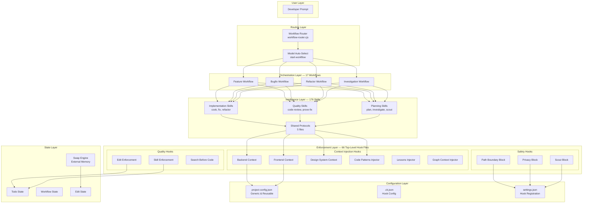

### Component Interaction Flow

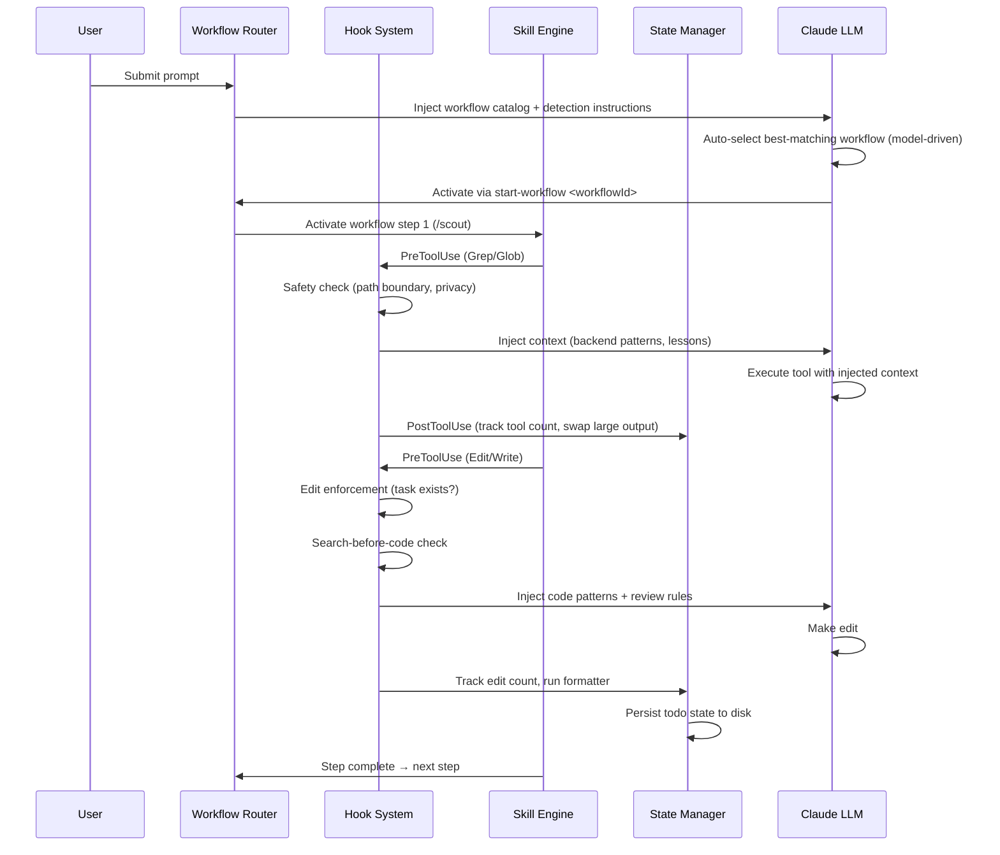

---

## 3. The Three Pillars: Hooks, Skills, Workflows

```
┌─────────────────────────────────────────────────────────────────────────┐
│                        THREE-PILLAR ARCHITECTURE                        │
│                                                                         │
│  ┌──────────────────┐  ┌──────────────────┐  ┌──────────────────┐      │
│  │      HOOKS        │  │      SKILLS      │  │    WORKFLOWS     │      │
│  │  (Enforcement)    │  │  (Intelligence)  │  │  (Orchestration) │      │
│  ├──────────────────┤  ├──────────────────┤  ├──────────────────┤      │
│  │ • Run as shell    │  │ • Markdown prompts│  │ • JSON sequences │      │
│  │   processes       │  │   with YAML front │  │   of skill steps │      │
│  │ • Trigger on      │  │   matter          │  │ • Routed via     │      │
│  │   lifecycle events│  │ • Define AI       │  │   keyword detect │      │
│  │ • Block/allow/    │  │   behavior &      │  │ • User confirms  │      │
│  │   inject context  │  │   protocols       │  │   before activate│      │
│  │ • Persist state   │  │ • Enforce evidence│  │ • Steps tracked  │      │
│  │   across sessions │  │   & quality gates │  │   via todo system│      │
│  ├──────────────────┤  ├──────────────────┤  ├──────────────────┤      │
│  │ ANALOGY:          │  │ ANALOGY:          │  │ ANALOGY:          │      │
│  │ Middleware in a   │  │ Expert knowledge  │  │ CI/CD pipeline   │      │
│  │ web framework     │  │ loaded on demand  │  │ with stage gates │      │
│  └──────────────────┘  └──────────────────┘  └──────────────────┘      │
│                                                                         │
│  Hooks are PROGRAMMATIC (Node.js) — they execute reliably.              │
│  Skills are PROMPT-BASED (Markdown) — they guide AI reasoning.          │
│  Workflows are DECLARATIVE (JSON) — they define execution order.        │
└─────────────────────────────────────────────────────────────────────────┘
```

**Why three layers?** Each solves a different failure mode:

| Failure Mode                             | Layer         | Mechanism                                                                  |
| ---------------------------------------- | ------------- | -------------------------------------------------------------------------- |
| AI ignores instructions in long contexts | **Hooks**     | Inject reminders programmatically at every tool call                       |
| AI invents code patterns                 | **Skills**    | Load project-specific patterns into context on demand                      |
| AI skips investigation steps             | **Workflows** | Enforce step sequence with todo tracking                                   |
| AI forgets learned lessons               | **Hooks**     | Re-inject `docs/project-reference/lessons.md` on every prompt + every edit |
| AI makes changes without understanding   | **Hooks**     | Block edits until search evidence exists                                   |
| AI skips test planning                   | **Workflows** | TDD workflows enforce spec-before-code sequence                            |
| AI uses inconsistent test IDs            | **Skills**    | Unified `TC-{FEATURE}-{NNN}` format across all skills                      |

---

## 4. Hook System Deep Dive

### 4.1 What Hooks Are

Hooks are **Node.js scripts** that execute as child processes at specific lifecycle events. They receive JSON input on stdin and produce output on stdout. Exit codes control behavior:

```
Exit 0  →  Allow (inject context via stdout)
Exit 1  →  Block (user can override with APPROVED: prefix)
Exit 2  →  Block (security — no override possible)
```

### 4.2 Hook Lifecycle Events

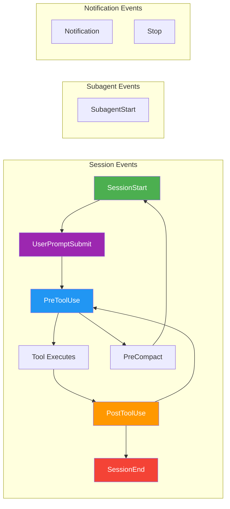

### 4.3 Hook Files — Organized by Purpose

```
HOOK SYSTEM (54 top-level hook files)
│
├── SESSION LIFECYCLE (7 hooks)
│   ├── session-init.cjs ─────────── Load config, set 25 env vars
│   ├── session-init-docs.cjs ────── Initialize reference docs from project-config
│   ├── post-compact-recovery.cjs ── Restore state after context compaction
│   ├── session-resume.cjs ────────── Restore todos from checkpoints
│   ├── npm-auto-install.cjs ──────── Install missing npm packages
│   ├── session-end.cjs ──────────── Cleanup swap files, save state
│   └── subagent-init-*.cjs ──────── Inject context into subagents (8 hooks)
│
├── PROMPT PROCESSING (3 hooks)
│   ├── init-prompt-gate.cjs ──────── Block until project-config exists; routes
│   │                                  /project-init when CLAUDE.md/AGENTS.md missing
│   ├── workflow-router.cjs ───────── Detect & inject workflow catalog
│   └── prompt-context-assembler.cjs ─ Assemble dev rules + lessons + reminders
│
├── SAFETY & BLOCKING (4 hooks)
│   ├── path-boundary-block.cjs ──── Block access outside project root
│   ├── privacy-block.cjs ─────────── Block .env, credentials, keys
│   ├── scout-block.cjs ──────────── Block node_modules, dist, obj
│   └── windows-command-detector ──── Block Windows CMD in Git Bash
│
├── QUALITY ENFORCEMENT (3 hooks)
│   ├── edit-enforcement.cjs ──────── Require tasks before edits
│   ├── skill-enforcement.cjs ─────── Require tasks before skills
│   └── doc-sync-gate.cjs ─────────── WARN (exit 0, advisory — never blocks) when a
│                                      commit ships behavioral code in an enforced
│                                      area without its Feature Spec update
│
├── CONTEXT INJECTION (9 pretooluse-ctx-* dispatchers + 2 standalone)
│   │   The former standalone inject modules (backend/frontend/design-system/scss/
│   │   code-patterns/knowledge/lessons/role/spec/artifact/code-review-rules/graph/
│   │   mindset/mindset-compact/python-call-guide + canonical design-system guide)
│   │   are now pure builder functions in lib/pretooluse-context-builders.cjs,
│   │   dispatched by 9 cap-bounded processes via lib/pretooluse-dispatch.cjs:
│   ├── pretooluse-ctx-edit.cjs ───── buildDesignSystemCanonicalGuide / DesignSystemContext / KnowledgeContext
│   ├── pretooluse-ctx-edit-tail.cjs  buildBackendContext / FrontendContext / ScssStyling / CodePatterns / RoleContext / Lessons
│   ├── pretooluse-ctx-edit-spec.cjs  buildSpecContext (docs/specs/** 8-section) / buildArtifactPath
│   ├── pretooluse-ctx-canon.cjs ──── buildDesignSystemCanonicalGuide (Read|Skill)
│   ├── pretooluse-ctx-crr.cjs ────── buildCodeReviewRules (code review standards)
│   ├── pretooluse-ctx-dev.cjs ────── buildDevRules (development-rules.md)
│   ├── pretooluse-ctx-graph.cjs ──── buildGraphContext (blast radius on review/debug)
│   ├── pretooluse-ctx-mindset.cjs ── buildMindset (critical thinking + AI mistake prevention)
│   ├── pretooluse-ctx-readbash.cjs   buildMindsetCompact / buildPythonGuide (read-only tools)
│   ├── figma-context-extractor.cjs ─ Figma design context (standalone, NOT consolidated)
│   └── ba-refinement-context.cjs ─── BA refinement context for PBI artifacts (standalone)
│
├── POST-PROCESSING (6 hooks)
│   ├── tool-output-swap.cjs ──────── Externalize large outputs (>50KB)
│   ├── post-edit-prettier.cjs ────── Auto-format after edits
│   ├── bash-cleanup.cjs ─────────── Clean temp files
│   ├── todo-tracker.cjs ─────────── Persist todo state to disk
│   ├── workflow-step-tracker.cjs ── Track workflow step completion
│   └── write-compact-marker.cjs ─── Save recovery state pre-compact
│
└── SUPPORT INFRASTRUCTURE (33 lib modules)
    ├── State: ck-session-state, workflow-state, todo-state, edit-state
    ├── Context: context-injector-base, prompt-injections, context-tracker
    ├── Memory: swap-engine (externalize large outputs)
    ├── Config: ck-paths, ck-config-loader, project-config-loader, ck-config-utils
    ├── Session: session-init-helpers, test-fixture-generator
    └── Utils: debug-log, hook-runner, stdin-parser, dedup-constants, ck-env-utils, ck-git-utils, ck-plan-resolver
```

### 4.3.5 Hook Part-File Architecture

Large hooks are split into chained **part-files** (`-p2.cjs`, `-p3.cjs`) to stay within single-file maintainability limits. The Claude Code harness chains them sequentially at runtime — each part-file reads stdin, appends its output, and passes through to the next.

```
prompt-context-assembler.cjs      ← Main: dev rules + workflow catalog
prompt-context-assembler-closers.cjs   ← Closers: project config summary + CLAUDE.md re-injection
prompt-context-assembler-claude.cjs   ← Claude-specific: model/session context
prompt-context-assembler-docs.cjs ← Docs: read-guidance pointer for project-structure-reference.md

workflow-router.cjs               ← Main: detect workflow intent
workflow-router-p2.cjs            ← Part 2: inject workflow catalog
workflow-router-p3.cjs            ← Part 3: lesson-learned reminder

pretooluse-ctx-mindset.cjs        ← Dispatches buildMindset: critical thinking + AI mistakes + golden rules (Skill|Agent|Edit|Write|MultiEdit|TaskCreate|TaskUpdate)
pretooluse-ctx-readbash.cjs       ← Dispatches buildMindsetCompact: critical-thinking only (Read|Grep|Glob|Bash) — cheap re-anchor
```

**Why this matters:** Previously, accumulating logic in a single hook file made it hard to reason about, test, and maintain. Part-file splitting applies single-responsibility at the file level — each part handles one concern.

**File-based deduplication:** `dedup-constants.cjs` holds shared dedup keys. Every injection point checks whether its key has already fired in the current session, preventing the same rules from appearing multiple times in a long prompt context.

### 4.4 How Context Injection Works

This is the **most important pattern** in the framework. Every time the AI edits a file, relevant knowledge is automatically injected:

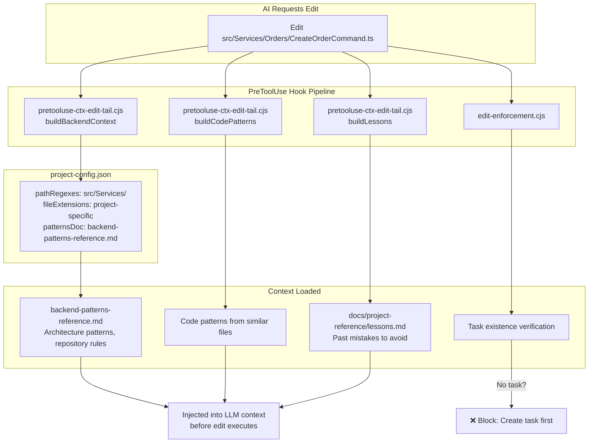

**Why this matters:** The AI receives ~50-100KB of project-specific context **automatically**, without the developer needing to remember to ask for it.

### 4.5 Deduplication — Preventing Context Bloat

Hooks check the last N lines of the conversation transcript for dedup markers before re-injecting:

```
┌─────────────────────────────────────────────────────┐
│  DEDUP MECHANISM                                     │
│                                                      │
│  Builder                 │ Marker           │ Lines  │
│──────────────────────────│──────────────────│────────│
│  buildBackendContext     │ ## Backend Context│  300  │
│  buildFrontendContext    │ ## Frontend Context│ 300  │
│  buildCodePatterns       │ ## Code Patterns  │  300  │
│  buildLessons (prompt)   │ ## Learned Lessons│   50  │
│                                                      │
│  IF marker found in last N lines → SKIP injection    │
│  IF not found → INJECT (context was compacted away)  │
└─────────────────────────────────────────────────────┘
```

**Why:** Without dedup, the same 50KB backend patterns doc would be injected on every single edit, consuming the context window. With dedup, it's injected once per compaction cycle.

### 4.6 Blocking Hierarchy

```
SECURITY BLOCKS (Exit 2) — Cannot override
├── path-boundary-block: Files outside project root
└── scout-block: Bulk access to node_modules, dist, obj

FEATURE BLOCKS (Exit 1) — User can override
├── privacy-block: .env, credentials (override: APPROVED: prefix)
├── edit-enforcement: No active task (override: create task first)
├── skill-enforcement: No active task for implementation skills

DOC-SYNC GATE (WARN-only — exit 0, never blocks)
└── doc-sync-gate: Behavioral code staged in an ENFORCED area (config-driven)
    without touching its Feature Spec — commit PROCEEDS with an advisory WARN
    that routes the model to /spec, /spec [mode=tests], or /docs-update
    (DOC_SYNC_OVERRIDE only suppresses the warn); per-edit spec-drift check
    on src/** also only WARNs (exit 0, never blocks iteration)

ADVISORY (Exit 0) — Context injection, no blocking
├── All context injection hooks
├── Lessons injection
└── Role context injection
```

---

## 5. Skill System Deep Dive

### 5.1 What Skills Are

Skills are **Markdown files with YAML frontmatter** that define AI behavior patterns. When activated, their content is loaded into the LLM context, guiding reasoning and enforcing protocols.

```yaml
# .claude/skills/{skill-name}/SKILL.md
---
name: prove-fix
description: '[Code Quality] Prove fix correctness with code proof traces'
version: 1.2.0
allowed-tools: Read, Grep, Glob, Bash, Write, TaskCreate
---
# Skill body (Markdown)
## Protocol
1. For each changed file, trace proof chain...
2. Declare confidence level...
```

### 5.2 Skill Categories (176 skills)

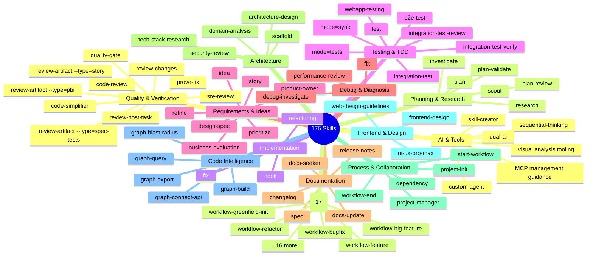

### 5.3 Shared Protocols — The Foundation

5 shared reference/protocol files provide canonical reusable behavior for skills. Protocol blocks are **inlined** into each skill via `<!-- SYNC:tag -->` blocks (not file-read references) for maximum AI compliance.

**Architecture:** The canonical source is `.claude/skills/shared/sync-inline-versions.md`. Each protocol is wrapped in `<!-- SYNC:protocol-name -->` / `<!-- /SYNC:protocol-name -->` HTML comment tags. Closing Reminders use `:reminder` suffix variants. To update a protocol: edit the canonical file first, then `grep SYNC:protocol-name` and update all copies.

```
.claude/skills/shared/
└── sync-inline-versions.md             ← CANONICAL source for all SYNC blocks
```

> **Note:** Protocol content is inlined into consuming skills via `<!-- SYNC:tag -->` blocks. `sync-inline-versions.md` is the canonical source for shared inline protocol text; adjacent shared files hold related reusable contracts and reference guidance.

**Why inline instead of file-read?** AI compliance drops significantly when protocols are behind `MUST ATTENTION READ file.md` indirection. AI agents skip the file-read step ~40% of the time. Inline SYNC blocks are always present in the skill's context window.

#### Protocol 1: Understand Code First

```
┌─────────────────────────────────────────────────────────────────┐
│  UNDERSTAND CODE FIRST PROTOCOL                                  │
│                                                                   │
│  BEFORE writing any code, you MUST ATTENTION:                              │
│                                                                   │
│  1. SEARCH for 3+ similar implementations (Grep/Glob)           │
│     └─ "How does the codebase already do this?"                  │
│                                                                   │
│  2. READ the target file (Read tool)                             │
│     └─ "What exists here now?"                                   │
│                                                                   │
│  3. VALIDATE assumptions with evidence                            │
│     └─ "Is my understanding correct? Proof: file:line"           │
│                                                                   │
│  4. For non-trivial tasks (>3 files):                            │
│     └─ Write analysis to .ai/workspace/analysis/                 │
│                                                                   │
│  ANTI-PATTERNS (FORBIDDEN):                                       │
│  ❌ Guessing constructor signatures                               │
│  ❌ Assuming DI registrations                                      │
│  ❌ Inventing new patterns when existing ones work                │
│  ❌ Making changes without reading current code                   │
└─────────────────────────────────────────────────────────────────┘
```

#### Protocol 2: Evidence-Based Reasoning

```
┌─────────────────────────────────────────────────────────────────┐
│  EVIDENCE-BASED REASONING PROTOCOL                               │
│                                                                   │
│  CONFIDENCE LEVELS:                                               │
│                                                                   │
│    95-100%  ████████████████████  Recommend freely                │
│             Full trace, all services checked                      │
│                                                                   │
│    80-94%   ████████████████░░░░  Recommend with caveats          │
│             Main paths verified, edge cases unverified            │
│                                                                   │
│    60-79%   ████████████░░░░░░░░  Recommend cautiously            │
│             Partial trace, need more evidence                    │
│                                                                   │
│    <60%     ████░░░░░░░░░░░░░░░░  ❌ DO NOT RECOMMEND            │
│             Insufficient evidence — STOP and investigate         │
│                                                                   │
│  FORBIDDEN PHRASES:                                               │
│  "obviously..."    → Replace with: "Pattern found in 8 files"    │
│  "I think..."      → Replace with: "Evidence from file:42"       │
│  "probably..."     → Replace with: "Needs verification: [list]"  │
│  "should be..."    → Replace with: "Grep shows 12 instances"     │
│  "this is because" → Replace with: "file:line shows..."          │
│                                                                   │
│  BREAKING CHANGE RISK MATRIX:                                     │
│  HIGH   → Full usage trace + all 5 services + impact analysis    │
│  MEDIUM → Usage trace + test verification + all 5 services       │
│  LOW    → Code review only                                       │
│                                                                   │
│  VALIDATION CHECKLIST (skip none):                                │
│  □ Find ALL implementations (grep "class.*:.*IInterface")        │
│  □ Trace ALL registrations (grep "AddScoped|AddSingleton")       │
│  □ Verify ALL usage sites (grep -r "ClassName" = 0)              │
│  □ Check string literals / reflection / dynamic invocations      │
│  □ Check config references (appsettings.json, env vars)          │
│  □ Cross-service check — ALL 5 microservices                     │
│  □ Assess impact — what breaks if removed?                       │
│  □ Declare confidence — X% with evidence list                    │
└─────────────────────────────────────────────────────────────────┘
```

### 5.4 How Skills Activate

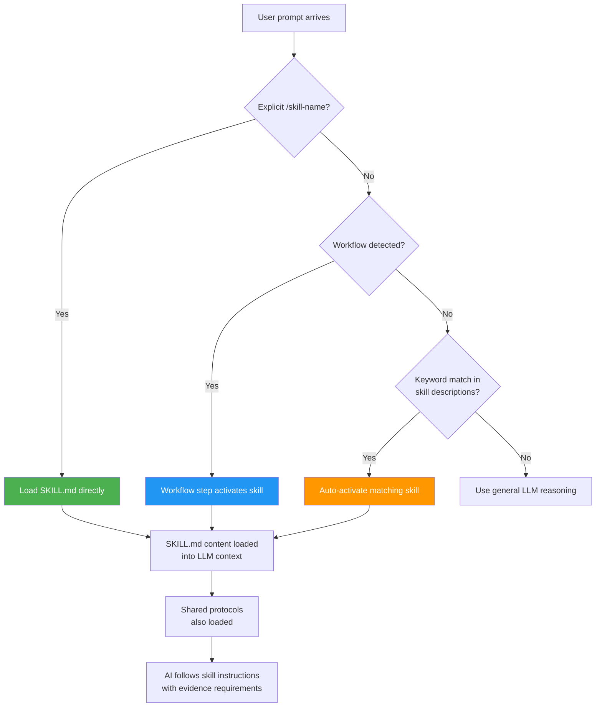

### 5.5 Cross-Cutting Skill Patterns (NEW)

Three patterns were systematically applied across 30+ skills to improve workflow continuity and plan awareness:

#### Pattern 1: Skill Chain Navigation (Next Steps)

Every skill that participates in a workflow now ends with a **Next Steps** section that uses `AskUserQuestion` to recommend the logical next skill. This creates a **self-guiding chain** — the AI doesn't need to remember what comes next; each skill tells it.

```
## Next Steps
MANDATORY after completing this skill, use AskUserQuestion to recommend:
- "/next-skill (Recommended)" — Why this is the natural next step
- "/alternative-skill" — When applicable
- "Skip, continue manually" — user decides
```

**Why this matters:** Without explicit chain navigation, AI often stops after completing a skill or picks an arbitrary next action. The Next Steps pattern ensures workflow continuity even when the AI's context has been compacted.

#### Pattern 2: Plan-Aware Skills (Step 0)

Skills that participate in long workflows (big-feature, greenfield-init) now include a **Step 0: Locate Active Plan** that reads prior workflow outputs before starting work:

```
## Step 0: Locate Active Plan (if in workflow)
1. Search for active plan — Glob plans/*/plan.md
2. Read plan.md — understand scope, goals, architecture decisions
3. Read existing research — {plan-dir}/research/*.md
4. Read domain-entities-reference.md — understand existing entities
5. Use plan context to inform this step (don't re-ask answered questions)
```

**Applied to:** `refine`, `story`, `domain-analysis`, `architecture-design`, `tech-stack-research`

**Why this matters:** In a 20+ step workflow, each skill runs in isolation. Without Step 0, later skills would re-ask questions already answered in earlier steps, wasting user time and creating inconsistencies.

#### Pattern 3: Review Gate Skills

Three new review skills create quality checkpoints between artifact-producing steps:

| Review Skill                        | Reviews Output From   | Checks                                                  |
| ----------------------------------- | --------------------- | ------------------------------------------------------- |
| `review-artifact --type=pbi`        | `/refine` (PBI)       | INVEST criteria, acceptance criteria completeness, gaps |
| `review-artifact --type=story`      | `/story` (stories)    | Vertical slicing quality, dependency tables, SPIDR      |
| `review-artifact --type=spec-tests` | `/spec [mode=tests]` (specs) | TC coverage, traceability to ACs, boundary cases        |

**Added to workflows:** workflow-idea-to-pbi, workflow-big-feature, workflow-greenfield-init

**Why this matters:** Without review gates, artifacts flow through workflows unchecked. A vague PBI becomes vague stories which become vague tests. Review gates catch quality issues early when they're cheapest to fix.

#### Pattern 4: SYNC Tag Inline Protocols

Shared protocols are inlined directly into skills wrapped in HTML comment tags:

```markdown
<!-- SYNC:understand-code-first -->

> **Understand Code First** — HARD-GATE: Do NOT write, plan, or fix until you READ existing code.
>
> 1. Search 3+ similar patterns — cite file:line evidence
>    ...

<!-- /SYNC:understand-code-first -->
```

Bottom of each skill has condensed `:reminder` variants:

```markdown
<!-- SYNC:understand-code-first:reminder -->

**MANDATORY IMPORTANT MUST ATTENTION** search 3+ existing patterns and read code BEFORE any modification.

<!-- /SYNC:understand-code-first:reminder -->
```

**Update workflow:** Edit `sync-inline-versions.md` (canonical) → `grep SYNC:tag-name` → update all copies. The `SYNC:shared-protocol-duplication-policy` tag in `code-simplifier` and `development-rules.md` prevents AI from "helpfully" extracting inline content back to file references.

**Why this matters:** AI compliance with file-read directives (`MUST ATTENTION READ shared/*.md`) was inconsistent. Inlining ensures protocols are always in the context window. The SYNC tag system enables bulk updates via grep while maintaining the duplication intentionally.

---

## 6. Workflow System Deep Dive

### 6.1 What Workflows Are

Workflows are **JSON-defined sequences of skills** stored in `.claude/workflows.json`. They ensure the AI follows a disciplined step-by-step process rather than jumping straight to code.

```json
{
    "bugfix": {
        "name": "Bug Fix",
        "whenToUse": "User reports a bug, error, crash, failure",
        "whenNotToUse": "New feature implementation, refactoring",
        "sequence": [
            "scout",
            "feature-investigation",
            "debug",
            "plan",
            "plan-review",
            "plan-validate",
            "why-review",
            "fix",
            "prove-fix",
            "code-simplifier",
            "review-changes",
            "code-review",
            "changelog",
            "test",
            "docs-update",
            "workflow-end",
            "watzup"
        ],
        "preActions": {
            "readFiles": ["docs/project-reference/backend-patterns-reference.md"],
            "injectContext": "Debug mindset: Never assume first hypothesis..."
        }
    }
}
```

### 6.2 Workflow Catalog (17 Workflows)

```
WORKFLOW CATALOG
│
├── DEVELOPMENT (3)
│   ├── workflow-big-feature
│   ├── workflow-bugfix
│   └── workflow-feature
│
├── REFACTORING (1)
│   └── workflow-refactor
│
├── TESTING (4)
│   ├── workflow-e2e (--source=changes|recording|update-ui)
│   ├── workflow-spec-sync
│   ├── workflow-seed-test-data
│   └── workflow-write-integration-test
│
├── DISCOVERY & PLANNING (6)
│   ├── workflow-greenfield-init
│   ├── workflow-idea-to-pbi
│   ├── workflow-product-discovery
│   ├── workflow-research
│   ├── workflow-spec-to-pbi
│   └── workflow-build-specs
│
├── DOCUMENTATION & SPEC (1)
│   └── workflow-feature-spec
│
├── REVIEW (1)
│   └── workflow-review-changes
│
└── DESIGN & VISUALIZATION (1)
    └── workflow-visualize
│
```

> Removed in the 2026-06 catalog prune (use the equivalent skill directly instead of a workflow):
> tdd-feature → `feature` (spec-driven with tests by default) · test-to-integration / test-verify → `write-integration-test` ·
> pbi-to-tests → `/spec [mode=tests]` · quality-audit → `review-changes` · security-audit → `/security-review` ·
> performance → `/performance-review` · investigation → `/investigate` · migration → `/db-migrate` ·
> package-upgrade → `/package-upgrade` skill · release-prep → `/sre-review` + `/quality-gate` ·
> batch-operation / verification / deployment → direct execution with `/plan` + `/review-changes`.
>
> Removed in the 2026-06-13 prune: full-feature-lifecycle → `workflow-idea-to-pbi` (now idea→spec→pbi) then `workflow-feature` ·
> documentation → `/docs-update` skill (or the docs-update step in `workflow-feature`) · spec-index → `/spec-index` skill (still a step in `workflow-spec-to-pbi`) ·
> design-workflow → `/design-spec` → `/interface-design` (product UIs) or `/frontend-design` (marketing/creative).

### 6.3 Workflow Detection & Auto-Selection

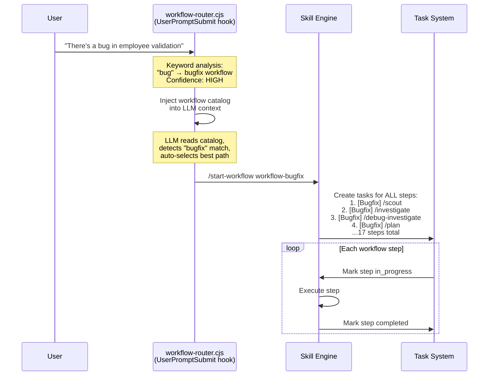

**Auto-select, never confirm-first.** The AI evaluates direct execution vs skill vs workflow fit and activates the best match itself — no workflow-selection confirmation prompt. The explicit-invocation exception still applies: when the user names a workflow/skill, that exact one runs.

### 6.4 Pre-Actions — Context Loading Before Execution

Each workflow defines `preActions` that load context before any step executes:

```json
{
    "preActions": {
        "readFiles": ["docs/project-reference/backend-patterns-reference.md", "docs/project-reference/code-review-rules.md"],
        "injectContext": "Role: API Designer\nMulti-line instruction text that guides AI behavior..."
    }
}
```

This ensures the AI has domain knowledge **before** it starts working, not after it makes mistakes.

---

## 7. Project Configuration — Generic & Reusable

### 7.1 Why project-config.json Exists

The hook and skill system is **project-agnostic**. All project-specific knowledge lives in `docs/project-config.json`. This means the entire `.claude/` framework can be reused across different projects by swapping one config file.

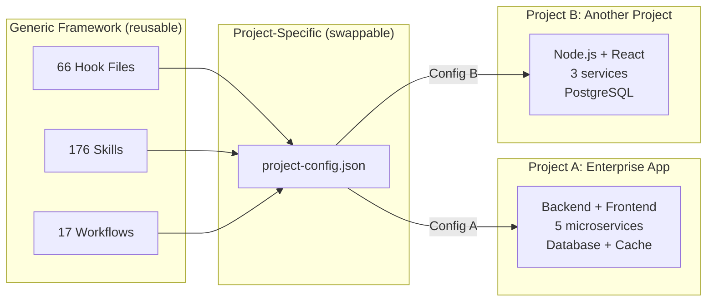

### 7.2 Configuration Sections

```json
{
    "$schema": "v2",

    "framework": {
        "name": "Your Framework Name",
        "backendPatternsDoc": "docs/project-reference/backend-patterns-reference.md",
        "frontendPatternsDoc": "docs/project-reference/frontend-patterns-reference.md",
        "searchPatternKeywords": ["yourPattern1", "yourPattern2"]
    },

    "contextGroups": [
        {
            "name": "Backend Services",
            "pathRegexes": ["src[\\\\/]services[\\\\/]", "src[\\\\/]api[\\\\/]"],
            "fileExtensions": [".ts", ".py", ".cs", ".go"],
            "patternsDoc": "docs/project-reference/backend-patterns-reference.md",
            "rules": ["Use service-specific repositories", "Use validation framework, never throw raw exceptions", "Side effects go in event handlers"]
        },
        {
            "name": "Frontend Apps",
            "pathRegexes": ["src[\\\\/]web[\\\\/]", "src[\\\\/]client[\\\\/]"],
            "fileExtensions": [".ts", ".tsx", ".vue", ".html", ".scss"],
            "patternsDoc": "docs/project-reference/frontend-patterns-reference.md",
            "rules": ["Extend project base components", "Use project state management", "Follow project CSS conventions"]
        }
    ],

    "modules": [
        {
            "name": "orders-service",
            "type": "backend",
            "path": "src/services/orders",
            "database": "postgresql",
            "port": 5100
        }
        // ... add all your modules
    ],

    "designSystem": {
        "appMappings": [
            {
                "name": "web-app",
                "docFile": "DesignSystem.md",
                "pathRegexes": ["src[\\\\/]web[\\\\/]"]
            }
        ]
    },

    "referenceDocs": ["project-structure-reference.md", "backend-patterns-reference.md", "frontend-patterns-reference.md", "code-review-rules.md", "lessons.md"]
}
```

### 7.2.5 settings.json — Key Configuration Flags

Beyond `project-config.json`, `settings.json` governs Claude Code's runtime behavior. Key flags as of the current version:

| Setting                           | Value                                                                             | Purpose                                                                                                                    |
| --------------------------------- | --------------------------------------------------------------------------------- | -------------------------------------------------------------------------------------------------------------------------- |
| `autoMemoryEnabled`               | `false`                                                                           | Disables Claude Code's built-in memory — framework uses its own external state (swap engine, todo state, lessons.md)       |
| `CLAUDE_CODE_AUTO_COMPACT_WINDOW` | `250000`                                                                          | Context compaction triggers at 250K tokens (up from default), giving longer sessions before recovery kicks in              |
| `CLAUDE_CODE_DISABLE_AUTO_MEMORY` | `1`                                                                               | Env-level memory disable (belt-and-suspenders with `autoMemoryEnabled`)                                                    |
| `enableAllProjectMcpServers`      | `false`                                                                           | Opt-in MCP only — prevents auto-enabling untrusted servers                                                                 |
| `enabledMcpjsonServers`           | `["context7","github"]`                                                           | Only context7 (library docs) and github MCP active; memory/sequential-thinking disabled (framework handles these natively) |
| `disabledMcpjsonServers`          | `["chrome-devtools","mongodb","postgres","figma","memory","sequential-thinking"]` | Explicit disable list prevents accidental re-enable                                                                        |

**Why disable built-in memory?** The framework's external state persistence (swap engine, todo-tracker, lessons.md, workflow-state) is more controlled and transparent than Claude Code's automatic memory. Disabling built-in memory prevents the two systems from conflicting.

### 7.3 How Hooks Consume Config

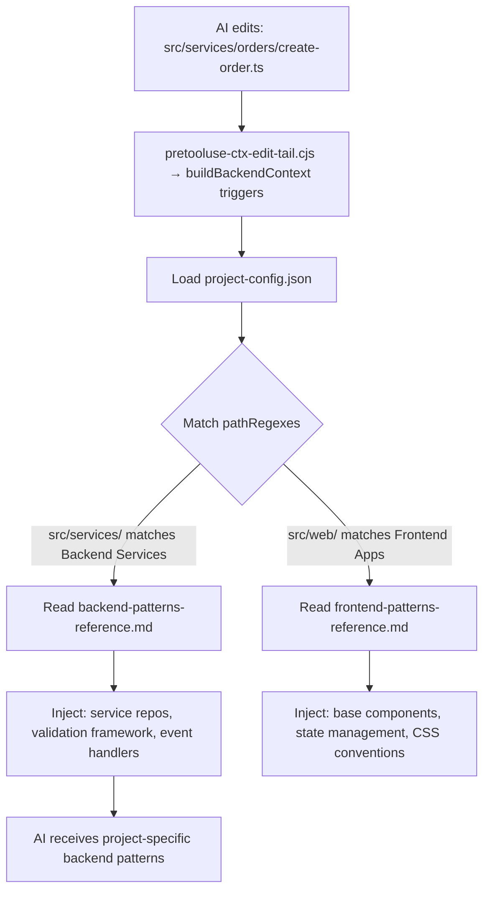

---

## 8. AI Agent Best Practices Applied

This section maps each framework mechanism to the **AI agent best practice** it implements.

### 8.1 Context Injection Rules — Preventing AI Amnesia

```
┌─────────────────────────────────────────────────────────────────┐
│  BEST PRACTICE: Context Injection at Decision Points             │
│                                                                   │
│  PROBLEM: LLMs have limited context windows. Project knowledge   │
│  gets pushed out during long conversations. After compaction,    │
│  all context is lost.                                             │
│                                                                   │
│  SOLUTION: Hooks re-inject relevant knowledge automatically      │
│  at every decision point (edit, prompt, tool use).               │
│                                                                   │
│  IMPLEMENTATION:                                                  │
│                                                                   │
│  Event                │ Injected Context              │ Hook     │
│───────────────────────│───────────────────────────────│──────────│
│  Every user prompt    │ Workflow catalog               │ router  │
│  Every user prompt    │ Development rules              │ rules   │
│  Every user prompt    │ Learned lessons                │ lessons │
│  Edit backend file    │ Backend patterns (up to 60KB)  │ backend │
│  Edit frontend file   │ Frontend patterns              │ frontend│
│  Edit style file      │ Styling guide                  │ scss    │
│  Edit UI component    │ Design system tokens           │ design  │
│  Activate code-review │ Code review rules              │ cr-rules│
│  Context compaction   │ Recovery state                 │ compact │
│  Subagent spawned     │ Project context + lessons      │ sub-init│
│  Edit|Write Agent|Skill│ Critical thinking + AI guardrails│ mindset│
│  Read|Grep|Glob|Bash  │ Lightweight critical-thinking  │ mindset-compact│
│  Write docs/specs/**  │ 8-section format + TC rules   │ buildSpecContext│
│                                                                   │
│  DEDUP: Each injection checks for its marker in last 300 lines  │
│  of transcript. Skips if already present. Re-injects after      │
│  compaction when markers are gone.                               │
└─────────────────────────────────────────────────────────────────┘
```

### 8.2 Reminder Rules — Preventing AI Attention Drift

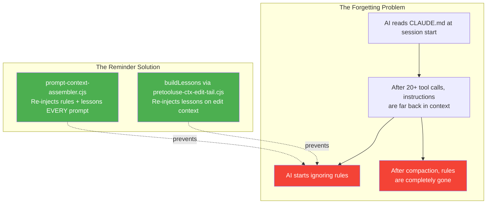

**Key insight:** Rules in CLAUDE.md are read once at session start. Rules injected via hooks are re-read on every prompt. The hooks turn one-time instructions into persistent reminders.

### 8.3 Workflow Auto-Selection — Preventing AI Misrouting

```
┌─────────────────────────────────────────────────────────────────┐
│  BEST PRACTICE: Auto-Select the Best Route, Never Confirm-First  │
│                                                                   │
│  PROBLEM: AI detects "feature" keyword and immediately starts    │
│  implementing without evaluating whether a workflow, a single    │
│  skill, or direct execution fits the task best.                  │
│                                                                   │
│  SOLUTION: Per-prompt routing evaluation — AI scores candidates  │
│  (direct / skill / workflow) against intent and activates the    │
│  best match itself. No confirmation prompt.                       │
│                                                                   │
│  FLOW:                                                            │
│                                                                   │
│  User: "Add a delete button to user profile"                     │
│                    ↓                                              │
│  AI evaluates: direct edit? single skill? feature workflow?      │
│                    ↓                                              │
│  Best match: feature workflow → activates immediately            │
│  (steps: scout→investigate→spec [mode=tests]→plan→cook→test→docs)│
│                                                                   │
│  EXCEPTION: explicit invocation — when the user names a          │
│  workflow or skill (start-workflow X, slash-skill), that exact   │
│  one runs without re-evaluation.                                  │
│                                                                   │
│  WHY: Prevents misrouting without blocking. "Fix this test"      │
│  could be:                                                        │
│  - bugfix workflow (if test reveals a bug)                       │
│  - write-integration-test workflow (if test code needs fixing)   │
│  - direct investigate skill (to understand the test)             │
│  Intent analysis picks one; the user can always interrupt and    │
│  redirect — cheaper than confirming every routine task.          │
└─────────────────────────────────────────────────────────────────┘
```

### 8.4 Plan Confirmation — Preventing AI "Ready, Fire, Aim"

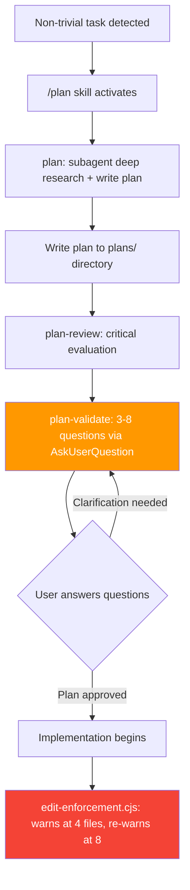

**The 3-question minimum:** `/plan-validate` asks 3-8 critical questions about the plan before implementation. This catches:

- Scope misunderstandings
- Missing edge cases
- Wrong architectural assumptions
- Unstated dependencies

### 8.5 Sequential Thinking — Preventing AI Shallow Reasoning

```
┌─────────────────────────────────────────────────────────────────┐
│  BEST PRACTICE: Force Sequential Thinking for Complex Problems   │
│                                                                   │
│  TOOLS:                                                           │
│  1. /sequential-thinking skill — Structured multi-step analysis  │
│  2. /debug-investigate skill — Systematic root cause investigation           │
│  3. Sequential-thinking MCP server — External reasoning tool     │
│                                                                   │
│  WHEN ACTIVATED:                                                  │
│  - Complex debugging (multiple possible root causes)             │
│  - Architectural decisions (multiple valid approaches)           │
│  - Performance analysis (layered bottlenecks)                    │
│  - Security review (attack surface analysis)                     │
│                                                                   │
│  HOW IT WORKS:                                                    │
│                                                                   │
│  Step 1: State the problem precisely                              │
│  Step 2: List ALL hypotheses (don't commit to first one)         │
│  Step 3: For EACH hypothesis, find supporting/contradicting      │
│          evidence (file:line citations)                           │
│  Step 4: Rank hypotheses by evidence strength                    │
│  Step 5: Test highest-ranked hypothesis                          │
│  Step 6: If wrong, update rankings and test next                 │
│                                                                   │
│  KEY RULE: "Never assume first hypothesis → verify with traces"  │
│                                                                   │
│  INTEGRATION:                                                     │
│  - bugfix workflow injects: "Debug mindset is NON-NEGOTIABLE"    │
│  - /prove-fix requires proof traces for every change             │
│  - /investigate requires Knowledge Graph per file                │
└─────────────────────────────────────────────────────────────────┘
```

### 8.6 Anti-Hallucination Protocol — Code Proof Tracing

This is the **most critical best practice** in the framework.

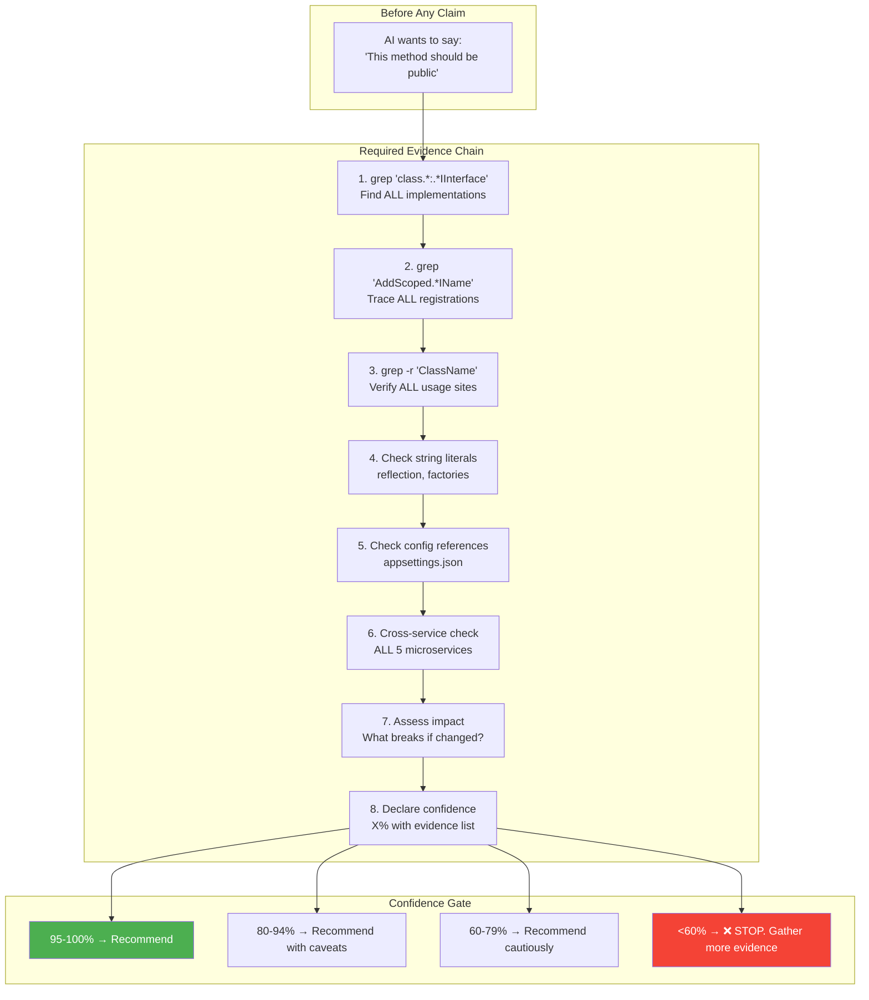

**The prove-fix skill** takes this further by requiring a **proof trace** for every bug fix:

```
## Recommendation: Change visibility of ProcessPayment to public

### Evidence
1. **orders-service/PaymentProcessor.ts:42** — Currently internal
2. **Grep Result** — Found 3 call sites expecting public access
3. **Framework Documentation** — Base service class exposes public API
4. **Similar Patterns** — ProcessRefund (public), ProcessInvoice (public)

### Confidence: 92%
- ✅ Verified: Main usage in Orders, Accounts
- ⚠️ Unverified: Surveys service (no payment module found)
- ❓ Assumptions: No reflection-based access

### Risk Assessment
If Wrong: Build error in consuming services
Mitigation: Grep for all references before changing
```

### 8.7 Lessons System — Learning From Mistakes

```mermaid
flowchart TB
    subgraph "Mistake Happens"
        M[AI makes wrong assumption<br/>e.g., used wrong repository type]
    end

    subgraph "Lesson Captured"
        L1[User or AI identifies the mistake]
        L2[Run /learn skill]
        L3[Append to docs/project-reference/lessons.md:<br/>'Always use service-specific repository,<br/>never generic base repository']
    end

    subgraph "Lesson Persisted"
        P1[prompt-context-assembler.cjs<br/>Injects on EVERY prompt]
        P2[buildLessons via pretooluse-ctx-edit-tail.cjs<br/>Injects on EVERY edit]
        P3[subagent-init.cjs / -2 / -3 (3 SubagentStart dispatchers)<br/>Injects into subagents]
    end

    subgraph "Mistake Prevented"
        R[AI reads lesson BEFORE<br/>making same mistake]
    end

    M --> L1 --> L2 --> L3
    L3 --> P1 & P2 & P3
    P1 & P2 & P3 --> R

    style M fill:#f44336,color:white
    style R fill:#4CAF50,color:white
```

**Properties:**

- Max 50 lessons (FIFO trim — oldest removed when full)
- Injected with dedup on prompt (checks last 50 transcript lines)
- Injected WITHOUT dedup on edit (performance: avoids I/O per edit)
- Persists across sessions (stored in `docs/project-reference/lessons.md`)
- Shared with subagents (via 8 `subagent-init-*.cjs` hooks)

### 8.9 TDD Workflow & Unified Test Specification System

The framework includes a **complete test-driven development (TDD) system** with unified test case identification, interactive specification generation, and bidirectional traceability between specs and code.

#### Unified TC Format: `TC-{FEATURE}-{NNN}`

All test-related skills use a **single TC ID format** across the entire project, eliminating namespace collisions between parallel systems:

```
┌─────────────────────────────────────────────────────────────────┐
│  UNIFIED TEST CASE ID FORMAT                                      │
│                                                                   │
│  Format: TC-{FEATURE}-{NNN}                                      │
│  Example: TC-GM-001 (Goal Management, test case 1)               │
│  Example: TC-CI-025 (Check-In, test case 25)                     │
│                                                                   │
��  Feature Codes (from feature-spec-reference.md):                 │
│  Define 2-3 letter codes per domain feature.                    │
│  Examples: GM (Goal Mgmt), CI (Check-In), AUTH (Auth),          │
│            CAN (Candidate), JOB (Job), EMP (Employee)           │
│  Source: docs/project-reference/feature-spec-reference.md       │
│                                                                   │
│  SOURCE OF TRUTH: Feature docs Section 8 (canonical registry)   │
│  DERIVED INDEX: docs/specs/{Bucket}/INDEX.md (regenerable nav)  │
│  CODE LINK: Test annotation linking test to TC ID               │
│             e.g., tag/trait/decorator in test files               │
└─────────────────────────────────────────────────────────────────┘
```

#### TDD Skill Chain

Four skills form a connected test specification pipeline:

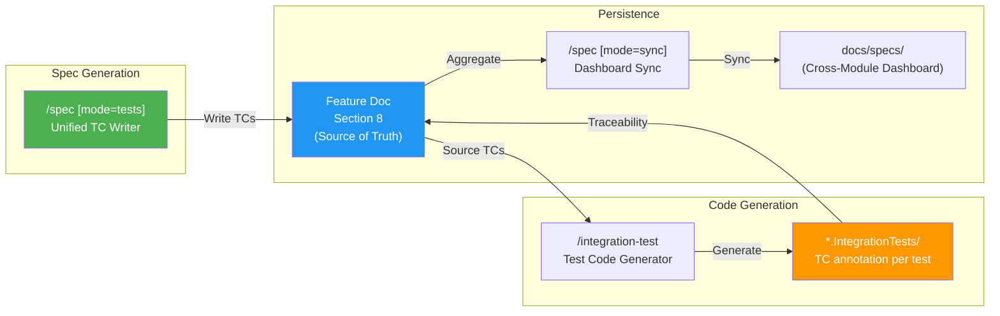

#### `/spec [mode=tests]` — The Core Skill (3 Modes)

```
┌─────────────────────────────────────────────────────────────────┐
│  /spec [mode=tests] — UNIFIED TC WRITER                           │
│                                                                   │
│  Mode 1: TDD-FIRST                                               │
│  Input: PBI / user story (no code yet)                           │
│  Action: Generate TC specs from requirements                     │
│  Evidence: "TBD (pre-implementation)"                            │
│  Next: /integration-test → /plan → /cook                        │
│                                                                   │
│  Mode 2: IMPLEMENT-FIRST                                         │
│  Input: Existing codebase (code already written)                 │
│  Action: Analyze code paths → generate TC specs                  │
│  Evidence: [Source: namespace/service/id] abstract anchor        │
│  Next: /integration-test → /test                                 │
│                                                                   │
│  Mode 3: UPDATE                                                   │
│  Input: Existing TCs + code changes                              │
│  Action: Diff TCs against current code → find gaps               │
│  Evidence: updated [Source: namespace/service/id] anchors        │
│  Next: /test → /review-changes                                   │
│                                                                   │
│  ALL MODES:                                                       │
│  • Write TCs to feature doc Section 8 (canonical)               │
│  • Use AskUserQuestion for TC review with user                  │
│  • Sync each §8 TC's IntegrationTest field to test code         │
│  • Unified format: TC-{FEATURE}-{NNN}                           │
└─────────────────────────────────────────────────────────────────┘
```

#### TDD Workflows

Dedicated registered workflows and workflow trigger skills support test-driven development:

| Workflow                                           | Sequence                                                                                                    | Use Case                                                                                         |
| -------------------------------------------------- | ----------------------------------------------------------------------------------------------------------- | ------------------------------------------------------------------------------------------------ |
| **idea-to-pbi**                                    | `/idea` → `/refine` → `/story` → `/spec [mode=tests]` → `/dor-gate`                                                | Go from raw idea to grooming-ready PBI, stories, and reviewed test specifications                |
| **feature**                                        | `/scout` → `/investigate` → `/spec` → `/spec [mode=tests]` → `/plan` → `/cook` → `/integration-test` → ... | Spec-driven with tests by default: test specs written and reviewed FIRST, then implement         |
| **e2e** (`--source=recording\|update-ui\|changes`) | `/scout` → `/e2e-test` → `/test` → `/docs-update` → `/workflow-end` → `/watzup`                             | Generate from a recording, update screenshot baselines, or sync E2E tests to spec/source changes |

#### Interactive Idea & Requirement Capture

The `/idea` and `/refine` skills include interactive discovery to improve test-driven thinking:

```
/idea — Step 6.5: Discovery Interview (MANDATORY)
├── Problem Clarity: "What problem does this solve?"
├── User Persona: "Who benefits most?"
├── Scope: "What's the smallest valuable version?"
├── Testability: "How would you verify this works?" ← ALWAYS included
├── Impact: "How many users/processes affected?"
└── Constraints: "Any technical/business constraints?"

/refine — Phase 5.5: Testability Assessment
├── Testing approach: TDD-first vs Implement-first vs Parallel
├── Test levels: Integration only, Integration + E2E, Unit + Integration + E2E
└── AC-to-TC mapping table (seed for /spec [mode=tests])
```

### 8.10 Full Development Lifecycle Coverage

The framework supports AI-assisted development across **every phase** of the software development lifecycle:

```
┌─────────────────────────────────────────────────────────────────┐
│           AI-ASSISTED DEVELOPMENT LIFECYCLE                       │
│                                                                   │
│  PHASE              │ Skills/Workflows       │ AI Value           │
│─────────────────────│────────────────────────│────────────────────│
│  0. INCEPTION       │ /greenfield            │ Solution architect │
│     (Greenfield)    │ greenfield-init wf     │ mode: research,    │
│                     │ solution-architect     │ DDD, tech choices, │
│                     │ /domain-analysis       │ waterfall planning │
│                     │ /tech-stack-research   │                    │
│─────────────────────│────────────────────────│────────────────────│
│  0.5 BIG FEATURE    │ big-feature workflow   │ Research-driven    │
│     (Existing proj) │ /domain-analysis       │ development for    │
│                     │ /tech-stack-research   │ complex features   │
│                     │ step-select gate       │ with optional skip │
│─────────────────────│────────────────────────│────────────────────│
│  1. IDEATION        │ /idea (interactive)    │ Structured         │
│                     │ /product-owner         │ discovery,         │
│                     │ idea-to-pbi workflow   │ testability check  │
│─────────────────────│────────────────────────│────────────────────│
│  2. REQUIREMENTS    │ /refine (interactive)  │ PBI generation,    │
│                     │ /story, /prioritize    │ acceptance criteria│
│                     │ /design-spec           │ with TC seeds      │
│─────────────────────│────────────────────────│────────────────────│
│  3. TEST SPECS      │ /spec [mode=tests]     │ TDD-first or      │
│                     │ idea-to-pbi workflow   │ implement-first    │
│                     │                        │ test case gen      │
│─────────────────────│────────────────────────│────────────────────│
│  4. PLANNING        │ /plan, /plan-review    │ Evidence-based     │
│                     │ /plan-validate         │ plans with user    │
│                     │ /why-review            │ Q&A validation     │
│─────────────────────│────────────────────────│────────────────────│
│  5. IMPLEMENTATION  │ /cook                  │ Pattern-enforced   │
│                     │ /fix, /refactoring     │ coding with auto   │
│                     │ feature workflow        │ context injection  │
│─────────────────────│────────────────────────│────────────────────│
│  6. TESTING         │ /integration-test      │ Test gen from      │
│                     │ /integration-test-review│ TDD specs; review │
│                     │ /integration-test-verify│ quality; verify   │
│                     │ /test, /webapp-testing │ spec traceability  │
│                     │ feature workflow       │ build verification │
│─────────────────────│────────────────────────│────────────────────│
│  7. CODE REVIEW     │ /code-review           │ Automated quality  │
│                     │ /review-changes        │ checks, pattern    │
│                     │ /prove-fix, /sre-review│ compliance, proofs │
│─────────────────────│────────────────────────│────────────────────│
│  8. DOCUMENTATION   │ /docs-update           │ Auto-detect stale  │
│                     │ /spec                  │ docs, generate     │
│                     │ /changelog             │ changelogs, sync   │
│─────────────────────│────────────────────────│────────────────────│
│  9. SIGN-OFF        │ /quality-gate          │ Quality gates,     │
│                     │ /review-artifact       │ artifact review    │
│─────────────────────│────────────────────────│────────────────────│
│  10. OPERATIONS     │ /devops                │ Infrastructure     │
│                     │ /sre-review            │ automation and     │
│                     │                        │ readiness checks   │
└─────────────────────────────────────────────────────────────────┘
```

**Key insight:** No phase is "AI-free." The framework ensures AI has the right context, constraints, and quality gates at every stage — from the first idea sketch to production deployment review.

#### Integration Testing — 3-Step Sequence

Testing is not a single step. The framework breaks it into discrete skills enforced across major development workflows such as `feature`, `bugfix`, `refactor`, `big-feature`, and `write-integration-test`:

| Step         | Skill                      | Purpose                                                                              |
| ------------ | -------------------------- | ------------------------------------------------------------------------------------ |
| 1. Write/run | `/integration-test`        | Generate test code from TDD specs, execute, verify pass/fail                         |
| 2. Review    | `/integration-test-review` | Review test quality: coverage, edge cases, naming, assertions                        |
| 3. Verify    | `/integration-test-verify` | Verify **spec traceability** — every TC-ID maps to a test, every test maps to a spec |

The verify step is the novel one. It catches tests that pass but don't actually cover the requirement they're supposed to cover — the most common form of false confidence in test suites.

### 8.11 How to Use — Test Generation & Documentation Cases

This section provides concrete prompts and expected flows for every test generation scenario supported by the framework.

#### Architecture Overview

```
TEST SPECIFICATION ARCHITECTURE

  SOURCE OF TRUTH (canonical)            CODE LINK (test impl)
  ┌─────────────────────────┐         ┌─────────────────────────┐
  │ Feature Spec Section 8   │ ──────→ │ Integration Test Code    │
  │ TC-{FEATURE}-{NNN}       │ ←────── │ (annotated with TC ID,   │
  │ — the canonical registry │         │  one per test method)    │
  └─────────────────────────┘         └─────────────────────────┘
              └──────────── TRACEABILITY ───────────┘

  Skills:    /spec [mode=tests] (write §8 TCs) → /integration-test (test code)
             /spec [mode=sync]  (forward-sync §8 ↔ test code)
  Workflows: workflow-feature (spec-driven), workflow-spec-sync, workflow-write-integration-test
```

#### Case 1: Existing Code → Generate Test Specs

**Scenario:** Code already exists (commands, queries, entities) but no test specifications have been written yet.

**Prompt examples:**

```
# Direct skill invocation
/spec [mode=tests] generate test specs for Orders feature from existing code

# With specific command
/spec [mode=tests] implement-first mode for CreateOrderCommand
```

> No dedicated workflow — invoke `/spec [mode=tests]` directly (the former `pbi-to-tests` workflow was removed).

**What happens:**

1. `/spec [mode=tests]` detects **implement-first mode** (code exists, no/incomplete TCs)
2. Greps for commands, queries, entities in target service
3. Traces code paths: Controller → Command → Handler → Entity → Event Handler
4. Generates TC outlines with `Evidence: [Source: namespace/service/id]` abstract anchors
5. Presents TC list via `AskUserQuestion` for interactive review
6. Writes approved TCs to feature doc Section 8 (canonical TC registry)
7. Records each TC's `IntegrationTest` field (test path or `Untested`)

**Output locations:**

| Artifact                        | Path                                                                                    |
| ------------------------------- | --------------------------------------------------------------------------------------- |
| TCs (canonical)                 | `docs/specs/{Bucket}/README.{Feature}.md` Section 8                                     |
| Derived system index (optional) | `docs/specs/{Bucket}/INDEX.md` — regenerate via `/spec-index` (never a source of truth) |

---

#### Case 2: PBI or Plan → Generate Test Specs (TDD-First)

**Scenario:** A PBI, user story, or detailed plan exists. You want to write test specs before implementing.

**Prompt examples:**

```
# Direct skill invocation
/spec [mode=tests] create test specs from PBI for order processing feature

# Full spec-driven workflow (recommended — specs + tests before code by default)
/start-workflow workflow-feature

# Idea-to-PBI pipeline with test specs
/start-workflow workflow-idea-to-pbi
```

**What happens:**

1. `/spec [mode=tests]` detects **TDD-first mode** (PBI exists, no implementation yet)
2. Reads PBI from `team-artifacts/pbis/` or user-provided document
3. Extracts acceptance criteria, identifies test categories (CRUD, validation, permissions, workflows, edge cases)
4. Generates TC outlines with `Evidence: TBD (pre-implementation)`
5. Interactive review via `AskUserQuestion`
6. Writes TCs to feature doc Section 8
7. Suggests: `/integration-test` to generate test stubs, or `/plan` to start implementation

**Workflow sequence:** the `feature` workflow is spec-driven with tests by default — see the full sequence under Case 2b below (former `tdd-feature` workflow was merged into it).

#### Case 2b: Feature Implementation WITH Integration Tests

**Scenario:** You want to implement a feature AND ensure integration test coverage — write specs first, refine the plan with test strategy, then implement and generate tests.

> **Merged into `feature` (2026-06).** The former standalone `feature-with-integration-test` workflow was a ~85% subset of `feature`; it has been merged. The `feature` workflow now natively carries the spec-first integration-test path (`/integration-test → /integration-test-review → /integration-test-verify`) plus the entity-conditional `/domain-analysis` + `/review-domain-entities` steps. Use the `feature` workflow for this scenario.

**Key points:** `feature` writes and reviews test specs before implementation (spec-driven with tests by default, covering the former `tdd-feature` use case), includes a dedicated re-planning step after specs to refine the implementation plan with test infrastructure needs, and a `/spec [mode=sync]` step that keeps spec §8 TCs and integration-test code aligned.

```bash
/start-workflow workflow-feature
```

```
feature:
  scout → investigate → domain-analysis → why-review → spec →
  plan → plan-review → plan-validate → why-review →
  spec [mode=tests] → why-review → review-artifact --type=spec-tests → plan → plan-review →
  cook → review-domain-entities → spec [mode=tests] → why-review → review-artifact --type=spec-tests →
  spec [mode=sync] → integration-test → integration-test-review →
  integration-test-verify → workflow-review-changes → sre-review →
  security-review → changelog → test → docs-update → workflow-end → watzup
```

**Note:** `feature` includes a second planning round (`plan → plan-review`) that refines the implementation plan with test strategy after specs are written, and two verification points after implementation — `/integration-test-verify` following integration-test generation and the final `/test` regression check before docs.

---

#### Case 3: Sync §8 TCs ↔ Integration Test Code (Bidirectional)

**Scenario:** Section 8 TCs and the integration test code have drifted — TCs exist with no covering test, or tests exist with no canonical §8 TC. Need to reconcile. Section 8 is canonical; test code implements it.

**Prompt examples:**

```
# Forward sync: §8 TCs → flag uncovered tests (default, safe direction)
/spec [mode=sync] sync test specs for Orders module

# Reverse sync: test code → §8 (emergency recovery only, needs confirmation)
/spec [mode=sync] reverse sync to feature docs for Orders

# Full bidirectional reconciliation
/spec [mode=sync] sync test specs for Orders feature
```

**What happens (bidirectional via /spec [mode=sync]):**

1. Reads feature doc Section 8 TCs (the canonical registry)
2. Greps for TC annotations (e.g., test tags/traits) in the integration test code
3. Builds a 2-way comparison:

```
| TC ID     | §8 (canonical)? | Test Code? | Action                             |
| --------- | --------------- | ---------- | ---------------------------------- |
| TC-GM-001 | ✅              | ✅         | None — synced                      |
| TC-GM-025 | ✅              | ❌         | Flag uncovered → /integration-test |
| TC-GM-030 | ❌              | ✅         | Back-fill §8 (emergency only)      |
```

4. Forward (default): §8 is the source — flag every TC with no covering test; update each TC's `IntegrationTest` field once a test exists.
5. Reverse (**emergency recovery only**): back-fill §8 for tests that exist without a canonical TC, with explicit user confirmation and a recovery report. §8 always wins conflicts.

**Direction detection keywords:**

| User says                              | Direction                           | Skill                          |
| -------------------------------------- | ----------------------------------- | ------------------------------ |
| "sync test specs", "sync to tests"     | Forward (§8 → flag uncovered tests) | `/spec [mode=sync]` |
| "reverse sync", "back-fill from tests" | Reverse (test code → §8, emergency) | `/spec [mode=sync]` |
| "full sync", "bidirectional"           | Both directions                     | `/spec [mode=sync]`        |

---

#### Case 4: Bug Fix / Code Changes / PR → Update Test Specs

**Scenario:** After fixing a bug, implementing changes, or reviewing a PR — test specs and feature docs need updating to reflect what changed.

**Prompt examples:**

```
# After a bug fix (detects git changes automatically)
/spec [mode=tests] update test specs after bugfix

# After code changes
/spec [mode=tests] update test specs based on current changes

# After a PR
/spec [mode=tests] update test specs from PR #123

# Full workflow (recommended for significant changes)
/start-workflow workflow-spec-sync
```

**What happens:**

1. `/spec [mode=tests]` detects **update mode** (existing TCs + code changes/bugfix/PR)
2. Reads existing Section 8 TCs
3. Runs `git diff` (or `git diff main...HEAD` for PRs) to find code changes
4. Identifies: new commands/queries not covered, changed behaviors, removed features
5. For bugfixes: adds a **regression TC** (e.g., `TC-GM-040: Regression — goal title validation bypass`)
6. Generates gap analysis
7. Updates feature docs Section 8 (canonical) and each affected TC's `IntegrationTest` field
8. Suggests: `/integration-test` to generate/update tests for changed TCs

**spec-sync workflow sequence:**

```
spec-sync: review-changes → spec [mode=tests] → spec [mode=sync] →
                  integration-test → test → workflow-end
```

**Key difference from Case 1:** Update mode preserves existing TC IDs, only adding/modifying what changed. It also generates regression TCs for bugfixes.

---

#### Case 5: Test Specs → Generate Integration Tests

**Scenario:** Test specifications exist in feature docs Section 8 (or `docs/specs/`). Now generate integration test code.

**Prompt examples:**

```
# From specific command
/integration-test CreateOrderCommand

# From git changes (auto-detect)
/integration-test

# Full workflow
/start-workflow workflow-write-integration-test

# After /spec [mode=tests] created specs
/spec [mode=tests] → /integration-test
```

**What happens:**

1. `/integration-test` reads feature doc Section 8 for TC codes matching target domain
2. Builds mapping: TC code → test method name (e.g., `TC-ORD-001` → `CreateOrder_WhenValidData_ShouldCreateSuccessfully`)
3. Reads existing integration tests in same service for conventions (namespace, base class, naming)
4. Generates test file with:
    - TC annotation/tag linking each test to its TC code
    - `// TC-ORD-001: Description` comment before each test
    - Real DI (no mocks), unique test data helpers, entity assertion helpers
5. Runs build to verify compilation
6. Verifies bidirectional traceability: every test ↔ doc TC

**write-integration-test workflow sequence** (absorbs the former `test-to-integration` use case):

```
write-integration-test: scout → investigate → spec [mode=tests] → why-review →
                        review-artifact --type=spec-tests → integration-test →
                        integration-test-review → integration-test-verify →
                        spec [mode=sync] → docs-update → workflow-end → watzup
```

**If TCs are missing:** `/integration-test` auto-creates TC entries in Section 8 before generating tests. For comprehensive spec creation first, use `/spec [mode=tests]` → `/integration-test`.

---

#### Case 6: Review Test Quality & Fix Flaky Tests

**When:** Existing tests intermittently fail, or you want a quality audit of integration tests.

**Prompt examples:**

```
# Review test quality for a domain
/integration-test review Orders

# Full workflow (write-integration-test absorbs the former test-verify use case)
/start-workflow workflow-write-integration-test
```

**What happens:**

1. `/integration-test` enters REVIEW mode — scans all test files in the target domain
2. Checks for flaky patterns:
    - DB assertions without async polling (e.g., checking state changed by background event handlers without retry/wait)
    - Hardcoded delays instead of condition-based polling
    - Non-unique test data causing cross-test interference
    - Race conditions from shared mutable state
3. Checks best practices: collection attributes, TC annotations, minimum test count, no mocks
4. Generates quality report with severity levels (HIGH/MEDIUM/LOW)

**Manual sequence** (the former `test-verify` workflow was removed — its review/diagnose loop runs via `/integration-test` modes plus `/integration-test-verify` inside `write-integration-test`):

```
/integration-test review → /test → /integration-test diagnose → /integration-test-verify
```

---

#### Case 7: Diagnose Test Failures (Test Bug vs Code Bug)

**When:** Tests are failing and you need to determine whether the test code or the application code is wrong.

**Prompt examples:**

```
# Diagnose a specific test class
/integration-test diagnose OrderCommandIntegrationTests

# After running tests that fail
/test → /integration-test diagnose {FailingTestClass}
```

**What happens:**

1. `/integration-test` enters DIAGNOSE mode — reads the failing test and traces the application code path
2. Walks a decision tree:
    - Compilation error? → Test not updated after code change (TEST BUG)
    - Assertion failure with correct expected value? → Application logic wrong (CODE BUG)
    - Intermittent failure? → Missing async polling or non-unique data (TEST BUG — flaky)
    - Validation error on happy path? → Test sends invalid data (TEST BUG) or rule too strict (CODE BUG)
3. Generates diagnosis report classifying each failure as TEST BUG, CODE BUG, or INFRA ISSUE
4. Provides specific fix recommendations with file:line evidence

---

#### Case 8: Verify Test-Spec Traceability

**When:** You want to ensure all test code maps to specs and all specs map to tests — no orphans.

**Prompt examples:**

```
# Verify traceability for a service
/integration-test verify {Service}

# Full workflow (includes the /integration-test-verify traceability gate)
/start-workflow workflow-write-integration-test
```

**What happens:**

1. `/integration-test` enters VERIFY-TRACEABILITY mode
2. Collects test methods with TC annotations from the test project
3. Collects TC entries from feature doc Section 8
4. Builds 2-way traceability matrix: test code ↔ feature doc Section 8 (canonical)
5. Identifies:
    - Orphaned tests (have annotation but no matching TC in docs)
    - Orphaned TCs (documented but no matching test)
    - Behavior mismatches (test does something different from what spec says)
6. For mismatches, determines which source is correct:
    - Test passes + spec disagrees → update spec
    - Test fails + spec describes expected behavior → update test
7. Generates traceability report with recommended fixes

---

#### Case 9: End-to-End Test Health Check

**When:** You want a comprehensive test health assessment combining quality, failures, and traceability.

**Prompt examples:**

```
# Full workflow (recommended — absorbs the former test-verify use case)
/start-workflow workflow-write-integration-test

# Manual sequence
/integration-test review Orders → /test → /integration-test diagnose {failures} → /integration-test verify {Service}
```

**What happens (test health check):**

1. **Scout** — finds all test files and related specs
2. **Review** — audits quality, flags flaky patterns
3. **Run tests** — executes test suite, collects pass/fail results
4. **Diagnose** — for any failures, determines root cause (test bug vs code bug)
5. **Summarize** — consolidated report with prioritized action items

**Output:** Single consolidated report covering quality issues, failure diagnoses, and traceability gaps — all prioritized by severity.

---

#### Quick Reference: Which Skill for Which Case?

```
┌─────────────────────────────────────────────────────────────────┐
│  CASE → SKILL / WORKFLOW LOOKUP                                 │
│                                                                 │
│  CASE                    │ PRIMARY SKILL   │ WORKFLOW            │
│─────────────────────────│────────────────│────────────────────│
│  Code → test specs       │ /spec [mode=tests] │ — (skill direct)   │
│  PBI → test specs (TDD)  │ /spec [mode=tests] │ feature            │
│  Sync specs ↔ docs       │ /spec [mode=sync]  │ —                  │
│                          │ (sync mode)        │                    │
│  Bug/PR → update specs   │ /spec [mode=tests] │ spec-sync          │
│  Specs → test code       │ /integration-   │ write-integration- │
│                          │  test           │ test               │
│  Full TDD cycle          │ /spec [mode=tests] then│ feature            │
│                          │ /integration-   │ (spec-driven       │
│                          │  test           │  by default)       │
│  Feature + int. tests    │ /cook then      │ feature            │
│                          │ /spec [mode=tests] then│                    │
│                          │ /integration-   │                    │
│                          │  test           │                    │
│  Idea → specs            │ /idea → /refine │ idea-to-pbi        │
│                          │ → /spec [mode=tests]   │                    │
│  Review test quality     │ /integration-   │ write-integration- │
│                          │  test review    │ test               │
│  Diagnose test failures  │ /integration-   │ write-integration- │
│                          │  test diagnose  │ test               │
│  Verify traceability     │ /integration-   │ write-integration- │
│                          │  test verify    │ test               │
│  Full test health check  │ (all 3 modes)   │ write-integration- │
│                          │                 │ test               │
│  Recording → E2E test    │ /e2e-test       │ e2e (recording)    │
│  UI change → baseline    │ /e2e-test       │ e2e (update-ui)    │
│  Code change → E2E sync  │ /e2e-test       │ e2e (changes)      │
└─────────────────────────────────────────────────────────────────┘
```

---

### 8.12 E2E Testing System — Framework-Agnostic AI-Assisted E2E

The framework includes a comprehensive **end-to-end testing system** that auto-detects the project's E2E stack from `docs/project-config.json` and provides AI-assisted test generation, maintenance, and execution across any E2E framework.

#### E2E Architecture Overview

```text
┌─────────────────────────────────────────────────────────────────┐
│  E2E TESTING ARCHITECTURE                                        │
│                                                                   │
│  project-config.json          SKILL              OUTPUT           │
│  ┌──────────────────┐    ┌──────────────────┐  ┌──────────────┐ │
│  │ e2eTesting:      │───▶│  /e2e-test        │─▶│ Test files   │ │
│  │  framework: ...  │    │  (auto-detect)    │  │ Page objects │ │
│  │  architecture: . │    │                   │  │ Step defs    │ │
│  │  entryPoints: .  │    │  3 modes:         │  └──────────────┘ │
│  └──────────────────┘    │  • from-recording │                   │
│                          │  • from-changes   │                   │
│  ┌──────────────────┐    │  • update-ui      │                   │
│  │ Feature Doc TCs  │───▶│                   │                   │
│  │ TC-{FEATURE}-{NNN}│    └──────────────────┘                   │
│  └──────────────────┘                                            │
│                                                                   │
│  Supported: Playwright, Selenium+SpecFlow, Cypress, any stack   │
│  TC Traceability: TC-{MODULE}-E2E-{NNN} in test names            │
└─────────────────────────────────────────────────────────────────┘
```

#### How It Works — Auto-Detection

The `/e2e-test` skill reads `docs/project-config.json` → `e2eTesting` section to determine:

- **Framework** (Playwright, Selenium+SpecFlow, Cypress, etc.)
- **Architecture** (POM pattern, BDD, direct tests)
- **Entry points** (key base classes, config files)
- **Run commands** (how to execute tests)
- **Best practices** (project-specific conventions)

This means the AI agent adapts to whatever E2E stack the project uses — no hardcoded assumptions.

#### E2E Skill — 3 Modes

```text
┌─────────────────────────────────────────────────────────────────┐
│  /e2e-test — FRAMEWORK-AGNOSTIC E2E TEST ASSISTANT               │
│                                                                   │
│  Mode 1: FROM-RECORDING                                          │
│  Input: Browser recording (DevTools JSON, HAR, etc.)             │
│  Action: Convert recording → test file + page object             │
│  Adapts to: Playwright .spec.ts, SpecFlow .feature, Cypress .cy │
│                                                                   │
│  Mode 2: UPDATE-UI                                                │
│  Input: Git diff showing UI changes                              │
│  Action: Identify affected tests → update baselines/assertions   │
│  Adapts to: Screenshot baselines, assertion updates              │
│                                                                   │
│  Mode 3: FROM-CHANGES                                             │
│  Input: Changed test specs or source code                        │
│  Action: Sync E2E tests with code/spec changes                   │
│  Output: Updated/new test implementations                        │
│                                                                   │
│  ALL MODES:                                                       │
│  • Read project-config.json e2eTesting for framework detection   │
│  • Read entryPoints for base classes and patterns                │
│  • Follow bestPractices from config                              │
│  • Add TC-{MODULE}-E2E-{NNN} references to test names           │
│  • Use e2e-test-reference.md as pattern guide                    │
└─────────────────────────────────────────────────────────────────┘
```

#### E2E Workflows

One parameterized workflow (`e2e --source=…`) covers all E2E testing scenarios:

| `--source`    | Sequence                                                                        | Use Case                                             |
| ------------- | ------------------------------------------------------------------------------- | ---------------------------------------------------- |
| **recording** | `/scout` → `/e2e-test` → `/test` → `/docs-update` → `/workflow-end` → `/watzup` | Browser recording → generate E2E test                |
| **update-ui** | `/scout` → `/e2e-test` → `/test` → `/docs-update` → `/workflow-end` → `/watzup` | UI visual changes → update test baselines/assertions |
| **changes**   | `/scout` → `/e2e-test` → `/test` → `/docs-update` → `/workflow-end` → `/watzup` | Code/spec changes → sync E2E test implementations    |

#### Case 10: Recording → E2E Test

**Scenario:** QC tester records a browser interaction and wants to generate an E2E test.

**Prompt examples:**

```bash
# Direct skill invocation
/e2e-test from recording path/to/recording.json

# With context
/e2e-test generate test from recording for Login feature

# Full workflow (recommended)
/workflow-e2e --source=recording
```

**What happens:**

1. `/e2e-test` reads `project-config.json` → `e2eTesting` to detect framework
2. Reads `entryPoints` to understand base classes and patterns
3. Validates recording file exists
4. Loads test specs from feature docs (TC-{MODULE}-{NNN})
5. Generates test file following project conventions:
    - Page Object class (using project's POM pattern)
    - Test assertions using project's assertion patterns
    - TC references in test names for traceability
6. Runs test to verify it passes
7. Reports generated files

---

#### Case 11: UI Changes → Update Tests

**Scenario:** UI changed intentionally, and existing E2E tests need updating.

**Prompt examples:**

```bash
/e2e-test update tests after UI changes
/workflow-e2e --source=update-ui
```

**What happens:**

1. `/e2e-test` analyzes git diff for UI changes
2. Maps changed files to affected test files
3. Updates assertions, selectors, or baselines as needed
4. Runs tests to verify changes work
5. Reports updated files

---

#### Case 12: Code/Spec Changes → Sync E2E Tests

**Scenario:** Test specifications or source code changed, and E2E tests need updating.

**Prompt examples:**

```bash
/e2e-test sync tests with spec changes
/workflow-e2e --source=changes
```

**What happens:**

1. `/e2e-test` detects change type from git diff
2. Loads affected test specifications (TC-{MODULE}-{NNN})
3. Updates or generates test implementations following project patterns
4. Ensures traceability: each TC has corresponding E2E test
5. Runs tests to verify changes work

---

#### project-config.json — e2eTesting Section

The `/e2e-test` skill relies on the `e2eTesting` section in `docs/project-config.json`. Example:

```json
{
    "e2eTesting": {
        "framework": "selenium-specflow",
        "language": "csharp",
        "guideDoc": "docs/project-reference/e2e-test-reference.md",
        "architecture": {
            "pattern": "page-object-model",
            "bddFramework": "specflow",
            "testRunner": "xunit",
            "settingsClass": "YourAutomationTestSettings",
            "startupClass": "BaseYourStartup"
        },
        "runCommands": {
            "all": "dotnet test src/AutomationTest/...",
            "filter": "dotnet test --filter \"FullyQualifiedName~{TestName}\""
        },
        "bestPractices": [
            "Extend BddStepDefinitions<TSettings, TContext> for step defs",
            "Use Page Object Model hierarchy",
            "Use WaitUntilAssertSuccess for resilient assertions"
        ],
        "entryPoints": [
            "src/Platform/{YourFramework}.AutomationTest/Pages/Page.cs",
            "src/Platform/{YourFramework}.AutomationTest/TestCases/BddStepDefinitions.cs"
        ]
    }
}
```

Each project configures this section during `/project-config` setup (Phase 2h). The AI agent reads it at runtime — no hardcoded framework assumptions.

#### Selector Strategy (Generic Best Practices)

```text
┌─────────────────────────────────────────────────────────────────┐
│  E2E SELECTOR PRIORITY (general guidelines)                      │
│                                                                   │
│  PRIORITY │ PATTERN                    │ WHY                      │
│───────────│────────────────────────────│──────────────────────────│
│  1 (Best) │ data-testid / data-test   │ Explicit test contract   │
│  2        │ BEM class / semantic CSS   │ Stable, intentional      │
│  3        │ Component selector         │ Framework-specific       │
│  4        │ Role + aria-label          │ Accessibility-based      │
│  5        │ Text content               │ Last resort, fragile     │
│                                                                   │
│  AVOID (unstable across framework versions):                     │
│  ✗ Auto-generated classes (.ng-*, .v-*, .css-*)                 │
│  ✗ Deep CSS paths, :nth-child()                                 │
│  ✗ XPath (brittle, hard to maintain)                            │
└─────────────────────────────────────────────────────────────────┘
```

---

### 8.13 Greenfield Project Support — AI as Solution Architect

The framework doesn't just assist with existing codebases — it guides **new project inception** from raw idea to approved implementation plan, acting as a Solution Architect and Business Domain Expert.

#### The Problem

When an AI agent encounters an empty project directory, most AI tools fail in predictable ways:

```
┌─────────────────────────────────────────────────────────────────┐
│  AI FAILURES IN GREENFIELD PROJECTS                              │
│                                                                   │
│  Failure                    │ Why It Happens                     │
│─────────────────────────────│────────────────────────────────────│
│  Skips straight to code     │ No patterns to search → generates │
│                             │ from generic training data         │
│  Wrong tech stack choice    │ No evidence to ground decisions;  │
│                             │ picks "popular" not "appropriate"  │
│  No domain modeling         │ No existing entities to read →    │
│                             │ invents schema on the fly          │
│  Missing infrastructure     │ Jumps to features, skips CI/CD,   │
│                             │ project scaffold, dev tooling      │
│  No user collaboration      │ AI decides everything silently;   │
│                             │ user gets a fait accompli          │
│  Context hooks fail         │ Session-init creates skeleton     │
│                             │ files in empty projects            │
└─────────────────────────────────────────────────────────────────┘
```

#### The Solution — Two-Layer Detection + Waterfall Workflow

The framework solves this with **automatic greenfield detection** and a **structured inception workflow**:

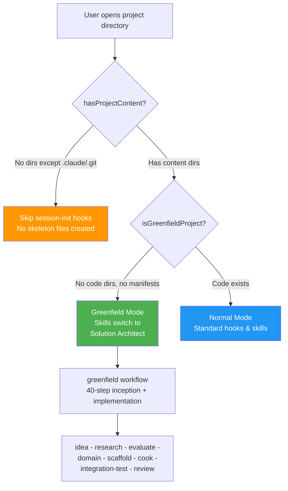

#### Detection Logic

Two complementary functions in `session-init-helpers.cjs`:

```
┌─────────────────────────────────────────────────────────────────┐
│  GREENFIELD DETECTION                                            │
│                                                                   │
│  hasProjectContent(dir)                                          │
│  ─────────────────────                                           │
│  Returns FALSE if root has NO directories except:                │
│  .claude, .git, .github, .vscode, .idea, node_modules, .ai      │
│  → Used to SKIP session-init hooks in truly empty projects       │
│                                                                   │
│  isGreenfieldProject(dir)                                        │
│  ────────────────────────                                        │
│  Returns TRUE when ALL of:                                       │
│  • No code directories with content:                             │
│    src/, app/, lib/, server/, client/, backend/, frontend/,      │
│    cmd/, pkg/, internal/, packages/                              │
│  • No manifest files:                                            │
│    package.json, *.sln, *.csproj, Cargo.toml, go.mod,          │
│    pyproject.toml, requirements.txt, pom.xml, build.gradle,     │
│    Gemfile, composer.json, Makefile, CMakeLists.txt              │
│  • No populated project-config.json                              │
│                                                                   │
│  STILL GREENFIELD (planning artifacts, no code):                 │
│  ✅ .claude/ + README.md + .gitignore                           │
│  ✅ docs/ + plans/ + team-artifacts/                             │
│  ✅ Empty src/ (scaffolded but no files inside)                  │
│                                                                   │
│  NOT GREENFIELD (code or tech stack present):                    │
│  ❌ app/page.tsx (Next.js) or lib/utils.rb (Ruby)               │
│  ❌ package.json (Node.js) or *.sln (.NET)                      │
│  ❌ Populated project-config.json                                │
└─────────────────────────────────────────────────────────────────┘
```

#### Greenfield-Init Workflow (40 Steps: Inception + Implementation + Integration Testing)

```
greenfield-init: FULL WATERFALL INCEPTION → IMPLEMENTATION → INTEGRATION TESTING
│
├── RESEARCH PHASE (7 steps)
│   ├── /idea ──────────────── Discovery interview: problem, vision, constraints
│   ├── /web-research ──────── WebSearch: competitors, market, existing solutions
│   ├── /deep-research ─────── WebFetch: extract findings from top sources
│   ├── /business-evaluation ── Viability, risk matrix, value proposition
│   ├── /domain-analysis ───── DDD: bounded contexts, aggregates, ERD
│   ├── /tech-stack-research ── Compare top 3 options per layer with pros/cons
│   └── /architecture-design ── Solution architecture
│
├── FIRST PLAN + REVIEWS (4 steps)
│   ├── /plan ──────────────── Architecture plan from research + domain analysis
│   ├── /security-review ──────────── Security architecture review
│   ├── /performance-review ───────── Performance architecture review
│   └── /plan-review ───────── Critical review
│
├── REFINEMENT + REVIEW GATES (6 steps)
│   ├── /refine ────────────── Refine to PBI with acceptance criteria
│   ├── /review-artifact --type=pbi ─────── PBI quality gate
│   ├── /story ─────────────── Break into prioritized stories with dependencies
│   ├── /review-artifact --type=story ──────── Story quality gate
│   ├── /plan-validate ─────── 3-8 questions: confirm all decisions with user
│   └── /spec [mode=tests] ──── Test strategy, spec generation
│
├── SECOND PLAN + SCAFFOLD (4 steps)
│   ├── /review-artifact --type=spec-tests ──── Test spec quality gate
│   ├── /plan ──────────────── Sprint-ready plan from concrete stories
│   ├── /plan-review ───────── Review sprint plan
│   └── /scaffold ──────────── Architecture scaffolding (CONDITIONAL)
│
├── IMPLEMENTATION (2 steps)
│   ├── /why-review ────────── Validate design rationale before coding
│   └── /cook ─────────────── Implement feature (backend + frontend)
│
├── INTEGRATION TESTING (6 steps)
│   ├── /spec [mode=tests] ──── Write test specs for implemented code
│   ├── /review-artifact --type=spec-tests ──── Review spec coverage and correctness
│   ├── /plan ──────────────── Plan integration test architecture (3rd round)
│   ├── /plan-review ───────── Review integration test plan
│   ├── /integration-test ──── Generate integration tests from specs
│   └── /test ─────────────── Run tests, verify all TCs pass
│
└── QUALITY + WRAP-UP (11 steps)
    ├── /code-simplifier ───── Simplify code for readability
    ├── /review-changes ────── Review all uncommitted changes
    ├── /code-review ───────── Code quality, patterns compliance
    ├── /sre-review ────────── Production readiness
    ├── /security-review ──────────── Security review
    ├── /performance-review ───────── Performance review
    ├── /changelog ─────────── Update changelog
    ├── /test ──────────────── Final regression run
    ├── /docs-update ───────── Update documentation
    ├── /workflow-end ──────── Close workflow state
    └── /watzup ────────────── Summary report + understand handoff

Every step saves artifacts to plans/{id}/ directory.
Every step validates genuine product or architecture decision points when needed.
Workflow activation is auto-selected by default.
Uses triple planning rounds and conditional scaffold.
```

#### Solution Architect Agent

The `solution-architect` agent (inherits parent session model) provides domain expertise throughout:

| Capability            | What It Does                                                   |
| --------------------- | -------------------------------------------------------------- |
| Discovery Interview   | Problem statement, vision, constraints, team skills            |
| Market Research       | WebSearch + WebFetch for competitive landscape                 |
| Tech Stack Evaluation | Comparison matrix with pros/cons, confidence %, recommendation |
| DDD Domain Modeling   | Bounded contexts, aggregates, entities, domain events          |
| Project Structure     | Folder layout, monorepo/polyrepo, CI/CD skeleton               |
| CLAUDE.md Generation  | Starter instructions file for the new project                  |

#### Skill Greenfield Mode

Nine skills auto-detect greenfield and switch behavior:

| Skill                  | Normal Mode                             | Greenfield Mode                                          |
| ---------------------- | --------------------------------------- | -------------------------------------------------------- |
| `/plan`                | Analyze codebase + research             | Skip codebase analysis, delegate to solution-architect   |
| `/idea`                | Detect module, load feature context     | Skip module detection, broader problem-space capture     |
| `/refine`              | Refine PBI with existing domain context | Add DDD domain modeling, tech constraint capture         |
| `/domain-analysis`     | Analyze existing domain entities/events | Full DDD from scratch: bounded contexts, aggregates, ERD |
| `/tech-stack-research` | Evaluate additions to existing stack    | Full stack comparison: top 3 per layer, confidence %     |
| `/story`               | Feature stories from existing patterns  | Foundation PBIs: infra, scaffold, CI/CD, first feature   |
| `/cook`                | Implement from plan                     | Scaffold project structure from approved plan            |

**Detection is per-skill-activation** (not cached from session start), so it stays accurate even as the project evolves during a session.

#### Why This Matters — Philosophy

The greenfield support embodies the framework's core philosophy: **don't let the AI skip the thinking**. Starting a new project requires:

1. **Understanding before building** — Discovery interview, not immediate scaffolding
2. **Evidence-based decisions** — Market research and tech evaluation with confidence %, not "just use React"
3. **User collaboration** — Every stage validates with `AskUserQuestion`, not AI-decided architecture
4. **Artifact preservation** — Every stage writes to plan directory, surviving context compaction
5. **Domain-first, code-second** — DDD modeling before tech stack, business value before implementation

The result: AI acts as a strategic advisor who **earns trust through structured thinking**, not a code generator that skips to `npm init`.

---

### 8.14 Big Feature Workflow — Research-Driven Development

For **large, complex, or ambiguous features** in existing projects that need research before implementation, the `big-feature` workflow bridges the gap between `feature` (well-defined) and `greenfield-init` (new project).

#### The Problem It Solves

```
FEATURE COMPLEXITY SPECTRUM

  Simple/Well-Defined          Complex/Ambiguous            New Project
  ────────────────── ──────────────────────────── ──────────────────
  Use: feature wf    Use: big-feature wf ★ NEW    Use: greenfield wf

  Examples:           Examples:                    Examples:
  • Add delete button • New analytics module       • Brand-new SaaS app
  • Fix validation    • AI-powered matching        • New microservice
  • CRUD endpoint     • Cross-service integration  • Greenfield project
```

Without `big-feature`, developers faced a false choice: use `feature` (skip research, risk wrong architecture) or use `greenfield-init` (overkill for adding to an existing project).

#### Workflow Sequence (31 Steps with Step-Selection Gate)

```
big-feature: RESEARCH-DRIVEN FEATURE DEVELOPMENT
│
├── RESEARCH PHASE (7 steps — skippable per feature)
│   ├── /idea ──────────────── Discovery interview
│   ├── /web-research ──────── Market/competitor analysis
│   ├── /deep-research ─────── Deep-dive top sources
│   ├── /business-evaluation ── Viability, risk, ROI
│   ├── /domain-analysis ───── DDD: bounded contexts, aggregates, ERD
│   ├── /tech-stack-research ── Compare top 3 options per tech layer
│   └── /architecture-design ── Solution architecture
│
├── FIRST PLANNING ROUND (2 steps — high-level architecture plan)
│   ├── /plan ──────────────── Architecture-level implementation plan
│   └── /plan-review ───────── Critical review of architecture plan
│
├── REFINEMENT PHASE (4 steps — with review gates)
│   ├── /refine ────────────── Acceptance criteria, PBI
│   ├── /review-artifact --type=pbi ─────── PBI quality gate
│   ├── /story ─────────────── User stories with dependencies
│   └── /review-artifact --type=story ──────── Story quality gate
│
├── SECOND PLANNING ROUND (5 steps — sprint-ready plan + scaffold)
│   ├── /plan ──────────────── Sprint-ready plan from stories
│   ├── /plan-review ───────── Review sprint plan
│   ├── /scaffold ──────────── Architecture scaffolding (CONDITIONAL)
│   ├── /plan-validate ─────── 3-8 user questions
│   └── /why-review ────────── Design rationale check
│
├── IMPLEMENTATION PHASE (5 steps)
│   ├── /cook ──────────────── Pattern-enforced coding
│   ├── /integration-test ──── Generate integration tests
│   ├── /code-simplifier ───── YAGNI/KISS/DRY pass
│   ├── /review-changes ────── Pre-commit review
│   └── /code-review ──────── Quality audit
│
└── QUALITY & WRAP PHASE (8 steps)
    ├── /sre-review ────────── Production readiness
    ├── /security-review ──────────── Security review
    ├── /performance-review ───────── Performance review
    ├── /changelog ─────────── Changelog entry
    ├── /test ──────────────── Test execution
    ├── /docs-update ───────── Documentation sync
    ├── /workflow-end ──────── Close workflow state
    └── /watzup ────────────── Summary, doc staleness, understand handoff
```

#### Step-Selection Gate Pattern

A key innovation: **long workflows let users deselect irrelevant steps** before execution.

```
┌─────────────────────────────────────────────────────────────────┐
│  STEP-SELECTION GATE (big-feature + greenfield workflows)       │
│                                                                  │
│  After workflow activation, AI auto-selects applicable steps:   │
│                                                                  │
│  "Which research steps apply to this feature?"                  │
│  [x] Discovery Interview (/idea)                                │
│  [x] Market Research (/web-research)                            │
│  [ ] Deep Research (/deep-research) ← user deselects           │
│  [ ] Business Evaluation (/business-evaluation) ← deselected   │
│  [x] Refine to PBI (/refine)                                   │
│  [x] Domain Analysis (/domain-analysis)                         │
│  [x] Tech Stack Research (/tech-stack-research)                 │
│  [x] ... remaining steps                                        │
│                                                                  │
│  Deselected steps are marked completed immediately.             │
│  This prevents a 30-step workflow from blocking a feature       │
│  that only needs 15 of those steps.                             │
│                                                                  │
│  WHEN TO USE:                                                    │
│  • Internal feature → skip market research                      │
│  • Known tech stack → skip tech-stack-research                  │
│  • Simple domain → skip domain-analysis                         │
│  • Pure backend → skip frontend-related reviews                 │
└─────────────────────────────────────────────────────────────────┘
```

**Why this matters for AI agents:** Long workflows risk user abandonment. The step-selection gate gives users control over process overhead while maintaining the structured sequence for steps they do use.

#### Second Planning Round Pattern (NEW)

Both `big-feature` and `greenfield-init` workflows now use a **dual planning cycle**:

```
DUAL PLANNING ROUNDS

Round 1 (after architecture-design):
  /plan → /plan-review
  Purpose: High-level architecture plan based on research + domain analysis
  Output: Architecture decisions, service boundaries, tech choices

Round 2 (after review-artifact --type=story):
  /plan → /plan-review → /scaffold
  Purpose: Sprint-ready implementation plan from concrete stories
  Output: Phased steps, file lists, dependency ordering
```

**Why two rounds:** The first plan is necessarily abstract — it's based on domain analysis and tech research, not concrete stories. After stories are written and reviewed, the requirements become concrete enough for a sprint-ready plan with exact files, phases, and ordering. A single plan would either be too abstract (useless for implementation) or premature (stories not yet defined).

#### Conditional Architecture Scaffolding (NEW)

The `/scaffold` step is **conditional** — the AI first self-investigates for existing base abstractions:

```
/scaffold DECISION LOGIC

1. Grep for: abstract/base classes, generic interfaces,
   IRepository, IUnitOfWork, Extensions, Helpers, Utils,
   base component/service/store, DI registrations

2. IF existing scaffolding found → SKIP, mark completed
   IF no foundational abstractions → PROCEED:
     • Create base abstract classes + generic interfaces
     • Infrastructure behind interfaces (Dependency Inversion)
     • Shared utilities with OOP/SOLID principles
     • At least one concrete implementation per interface

3. For existing projects adding new module:
   → Extend existing base classes, don't create duplicates
```

**Applied to:** `big-feature`, `greenfield-init` workflows

**Why this matters:** Greenfield projects need scaffolding before feature code. Existing projects adding modules need to extend, not duplicate, existing abstractions. The conditional check prevents over-engineering in codebases that already have proper foundations.

---

### 8.15 Prompt Engineering Principles Applied

This section maps **established prompt engineering techniques** to specific framework mechanisms, proving that the framework's design is grounded in research-backed AI best practices.

#### Principle 1: Role Prompting (System Identity)

```
┌─────────────────────────────────────────────────────────────────┐
│  ROLE PROMPTING — Assign AI a specific expert identity           │
│                                                                   │
│  Research basis: LLMs produce higher-quality outputs when        │
│  given a specific role identity that activates relevant          │
│  training knowledge and constrains behavior.                     │
│                                                                   │
│  WHERE APPLIED:                                                   │
│                                                                   │
│  Layer          │ Role Assignment                │ Mechanism       │
│─────────────────│────────────────────────────────│─────────────────│
│  Workflow       │ "Role: Security Architect"     │ preActions.     │
│  preActions     │ "Role: API Designer"           │ injectContext   │
│  (workflows.    │ "Role: Solution Architect"     │ field in JSON   │
│   json)         │ "Role: Debug Investigator"     │                 │
│─────────────────│────────────────────────────────│─────────────────│
│  Agent defs     │ "You are a senior code         │ Agent .md files │
│  (.claude/      │  reviewer with 15 years..."    │ system prompt   │
│   agents/)      │ "You are a solution architect" │ section         │
│─────────────────│────────────────────────────────│─────────────────│
│  Hook injection │ "Tech Lead Communication Mode" │ prompt-context- │
│  (UserPrompt    │ "Be skeptical. Apply critical  │ assembler.cjs   │
│   Submit)       │  thinking..."                  │                 │
│─────────────────│────────────────────────────────│─────────────────│
│  Skill headers  │ "Act as TDD Specialist"        │ SKILL.md body   │
│                 │ "Act as Domain Expert (DDD)"   │ instructions    │
│                                                                   │
│  EFFECT: Each workflow step activates a different expert          │
│  persona. The AI doesn't just generate code — it thinks          │
│  like a Security Architect during /security-review, switches to         │
│  SRE mindset during /sre-review, and becomes a Domain Expert     │
│  during /domain-analysis.                                        │
└─────────────────────────────────────────────────────────────────┘
```

#### Principle 2: Chain-of-Thought (Structured Reasoning)

```
┌─────────────────────────────────────────────────────────────────┐
│  CHAIN-OF-THOUGHT — Force step-by-step reasoning                 │
│                                                                   │
│  Research basis: Prompting LLMs to "think step by step"          │
│  dramatically improves accuracy on complex tasks (Wei et al.)    │
│                                                                   │
│  WHERE APPLIED:                                                   │
│                                                                   │
│  1. WORKFLOW SEQUENCES — The entire workflow system IS chain-    │
│     of-thought at macro scale. Instead of "implement feature,"   │
│     the AI is forced through:                                    │
│     scout → investigate → plan → review → validate → cook       │
│     Each step produces an intermediate artifact that feeds       │
│     the next step's reasoning.                                   │
│                                                                   │
│  2. /sequential-thinking SKILL — Explicit structured reasoning:  │
│     Step 1: State the problem precisely                          │
│     Step 2: List ALL hypotheses                                  │
│     Step 3: For EACH, find supporting/contradicting evidence     │
│     Step 4: Rank by evidence strength                            │
│     Step 5: Test highest-ranked                                  │
│                                                                   │
│  3. /debug-investigate SKILL — Forces hypothesis-driven debugging:           │
│     "Never assume first hypothesis → verify with traces"         │
│                                                                   │
│  4. /prove-fix SKILL — Proof chain for every change:             │
│     Change → Evidence → Confidence % → Risk Assessment           │
│                                                                   │
│  5. /plan-validate — 3-8 critical questions force the AI to      │
│     reason about gaps, edge cases, and assumptions before        │
│     implementing.                                                │
│                                                                   │
│  EFFECT: The AI can't skip from question to answer. Every        │
│  workflow forces intermediate reasoning steps that catch          │
│  errors the AI would miss in a single-shot response.             │
└─────────────────────────────────────────────────────────────────┘
```

#### Principle 3: Few-Shot Pattern Matching

```
┌─────────────────────────────────────────────────────────────────┐
│  FEW-SHOT LEARNING — Show examples, not just instructions        │
│                                                                   │
│  Research basis: LLMs follow demonstrated patterns more          │
│  reliably than verbal instructions alone.                        │
│                                                                   │
│  WHERE APPLIED:                                                   │
│                                                                   │
│  1. CONTEXT INJECTION HOOKS — When editing a backend file,       │
│     buildBackendContext (via pretooluse-ctx-edit-tail.cjs)       │
│     injects backend-patterns-reference.md                        │
│     (~60KB of real code examples from the project). The AI       │
│     sees actual repository patterns, validation patterns,        │
│     event handler patterns — not generic instructions.           │
│                                                                   │
│  2. SEARCH-BEFORE-CODE HOOK — Forces the AI to grep for 3+      │
│     similar implementations before writing code. Those grep      │
│     results ARE the few-shot examples — real code from the       │
│     project showing "this is how we do it."                      │
│                                                                   │
│  3. REFERENCE DOCS — Auto-initialized from project scans:        │
│     • /scan --target=backend-patterns → CQRS examples           │
│     • /scan --target=frontend-patterns → component examples     │
│     • /scan --target=design-system → design tokens              │
│                                                                   │
│  4. SKILL PROTOCOLS — Each skill includes concrete examples:     │
│     "Example recommendation format: Evidence from file:42..."    │
│     "Example TC format: TC-GM-001..."                            │
│                                                                   │
│  EFFECT: Instead of "use the repository pattern," the AI sees    │
│  5 real repository implementations from this codebase. Pattern   │
│  matching replaces pattern invention.                             │
└─────────────────────────────────────────────────────────────────┘
```

#### Principle 4: Structured Output & Formatting

```
┌─────────────────────────────────────────────────────────────────┐
│  STRUCTURED OUTPUT — Constrain response format for consistency   │
│                                                                   │
│  WHERE APPLIED:                                                   │
│                                                                   │
│  1. CONFIDENCE DECLARATIONS — Every recommendation must state:   │
│     "Confidence: 85% — Verified in Orders, Accounts.             │
│      Unverified: Surveys service"                                │
│                                                                   │
│  2. RISK MATRICES — Breaking changes must use:                   │
│     | Risk | Likelihood | Impact | Mitigation |                  │
│                                                                   │
│  3. TEST CASE FORMAT — Unified TC-{FEATURE}-{NNN}:               │
│     All skills use identical format preventing drift.             │
│                                                                   │
│  4. PLAN FILES — Written to plans/ with consistent structure:    │
│     Problem → Analysis → Options → Recommendation → Tasks        │
│                                                                   │
│  5. REPORT FORMAT — Tech lead communication mode enforces:       │
│     Executive Summary → Risk Assessment → Strategic Options →    │
│     Recommended Approach → Operational Considerations             │
│                                                                   │
│  EFFECT: Consistent formatting prevents the AI from giving       │
│  a vague "this looks fine" when the protocol demands a           │
│  structured risk matrix with evidence citations.                  │
└─────────────────────────────────────────────────────────────────┘
```

#### Principle 5: Negative Prompting (Anti-Patterns)

```
┌─────────────────────────────────────────────────────────────────┐
│  NEGATIVE PROMPTING — Explicitly forbid common AI mistakes       │
│                                                                   │
│  WHERE APPLIED:                                                   │
│                                                                   │
│  1. EVIDENCE PROTOCOL — Forbidden phrases list:                  │
│     ❌ "obviously..."  → "Pattern found in 8 files"              │
│     ❌ "I think..."    → "Evidence from file:42"                  │
│     ❌ "probably..."   → "Needs verification: [list]"            │
│     ❌ "should be..."  → "Grep shows 12 instances"               │
│                                                                   │
│  2. UNDERSTAND-CODE-FIRST PROTOCOL — Anti-patterns:              │
│     ❌ Guessing constructor signatures                            │
│     ❌ Assuming DI registrations                                  │
│     ❌ Inventing new patterns when existing ones work             │
│                                                                   │
│  3. CLAUDE.md GOLDEN RULES — "NEVER use generic repo..."        │
│     "NEVER throw exceptions for validation..."                   │
│     "NEVER direct database access cross-service..."              │
│                                                                   │
│  4. LESSONS SYSTEM — Past mistakes become future prohibitions:   │
│     "NEVER define duplicate constants inline"                    │
│     "NEVER use early returns in merged modules"                  │
│                                                                   │
│  EFFECT: LLMs are more responsive to "don't do X" + reason      │
│  than "do Y" alone. Negative examples activate different         │
│  reasoning paths than positive instructions.                      │
└─────────────────────────────────────────────────────────────────┘
```

#### Principle 6: Iterative Refinement & Self-Correction

```
┌─────────────────────────────────────────────────────────────────┐
│  ITERATIVE REFINEMENT — Multi-pass review catches errors         │
│                                                                   │
│  WHERE APPLIED:                                                   │
│                                                                   │
│  Workflow steps that force self-correction:                      │
│                                                                   │
│  /cook ────────→ /code-simplifier ──→ /review-changes ──→       │
│  (generate)      (simplify/clean)     (self-review)              │
│                                                                   │
│  /fix ─────────→ /prove-fix ────────→ /test                     │
│  (apply fix)     (prove correctness)  (verify fix works)         │
│                                                                   │
│  /plan ────────→ /plan-review ──────→ /plan-validate             │
│  (create plan)   (critique plan)      (user validates)            │
│                                                                   │
│  Each pass uses a DIFFERENT evaluation lens:                     │
│  • /code-simplifier: "Is this the simplest correct solution?"   │
│  • /review-changes: "Does this follow project conventions?"     │
│  • /code-review: "Does this meet quality standards?"            │
│  • /sre-review: "Is this production-ready?"                     │
│  • /security-review: "Are there vulnerabilities?"                      │
│                                                                   │
│  EFFECT: Single-pass generation catches ~70% of issues.          │
│  Three review passes with different lenses catch ~95%.           │
│  This multi-pass pattern is why workflows have 15-23 steps.     │
└─────────────────────────────────────────────────────────────────┘
```

#### Summary: Prompt Engineering Techniques → Framework Mapping

| Prompt Engineering Technique  | Framework Implementation                                                      |
| ----------------------------- | ----------------------------------------------------------------------------- |
| **Role prompting**            | Workflow preActions, agent definitions, hook-injected personas                |
| **Chain-of-thought**          | Workflow step sequences, /sequential-thinking, /debug-investigate, /prove-fix |
| **Few-shot examples**         | Context injection hooks, reference doc scans                                  |
| **Structured output**         | Confidence declarations, risk matrices, TC format, plan templates             |
| **Negative prompting**        | Forbidden phrases, anti-pattern lists, NEVER rules, lessons system            |
| **Iterative refinement**      | Multi-pass review (cook→simplify→review→code-review→sre→security)             |
| **Task decomposition**        | Workflows decompose "implement feature" into 15+ discrete steps               |
| **Retrieval-augmented gen.**  | Context hooks inject project-specific docs at decision points                 |
| **Self-consistency checking** | /prove-fix requires proof traces; /plan-validate asks critical questions      |

---

### 8.16 Context Engineering Principles Applied

Context engineering is the discipline of **managing what information reaches the LLM, when, and how** — treating the context window as a scarce computational resource. This framework implements context engineering as a first-class architectural concern.

#### The Context Engineering Problem

```
┌─────────────────────────────────────────────────────────────────┐
│  WHY CONTEXT ENGINEERING MATTERS                                  │
│                                                                   │
│  Claude Code context window: ~200K tokens (auto-compact at 250K) │
│  A typical project's full context: >>200K tokens                 │
│  Backend patterns doc alone: ~60KB (~15K tokens)                 │
│  Frontend patterns doc: ~57KB (~14K tokens)                      │
│  CLAUDE.md: ~20KB (~5K tokens)                                   │
│  Full code context after 30 tool calls: 150K+ tokens             │
│                                                                   │
│  PROBLEM: You can't load everything. Loading everything           │
│  degrades quality (attention dilution). Loading nothing           │
│  causes hallucination (no grounding).                            │
│                                                                   │
│  SOLUTION: Load the RIGHT context at the RIGHT time.             │
│  This is context engineering.                                     │
└─────────────────────────────────────────────────────────────────┘
```

#### Principle 1: Just-In-Time Context Injection

```
┌─────────────────────────────────────────────────────────────────┐
│  JIT CONTEXT — Load context at the moment of need, not upfront   │
│                                                                   │
│  ANTI-PATTERN: Load all docs at session start                    │
│  → Wastes 30K+ tokens, most unused                              │
│  → Attention diluted across irrelevant context                   │
│                                                                   │
│  FRAMEWORK APPROACH:                                              │
│                                                                   │
│  Trigger               │ Context Loaded          │ Size  │ Hook  │
│────────────────────────│─────────────────────────│───────│───────│
│  Edit backend file     │ Backend patterns doc    │ ~60KB │ BC    │
│  Edit frontend file    │ Frontend patterns doc   │ ~57KB │ FC    │
│  Edit style file       │ SCSS styling guide      │ ~30KB │ SC    │
│  Edit UI component     │ Design system tokens    │ ~56KB │ DC    │
│  Activate code-review  │ Code review rules       │ ~10KB │ CR    │
│  Every user prompt     │ Dev rules + lessons     │ ~5KB  │ PCA   │
│  Subagent spawned      │ CLAUDE.md + lessons     │ ~25KB │ SI    │
│                                                                   │
│  KEY INSIGHT: A frontend edit session NEVER loads backend         │
│  patterns. A backend session NEVER loads design tokens. The       │
│  AI gets ~60KB of precisely relevant context instead of           │
│  ~200KB of everything.                                            │
│                                                                   │
│  IMPLEMENTATION: PreToolUse hooks check the file path against    │
│  project-config.json pathRegexes → load matching patternsDoc.    │
│  Path-based routing is the core context engineering mechanism.    │
└─────────────────────────────────────────────────────────────────┘
```

#### Principle 2: Context Deduplication

```
┌─────────────────────────────────────────────────────────────────┐
│  DEDUP — Never inject the same context twice in one window       │
│                                                                   │
│  WITHOUT DEDUP:                                                   │
│  Edit file 1 → inject 60KB backend patterns                     │
│  Edit file 2 → inject 60KB backend patterns AGAIN                │
│  Edit file 3 → inject 60KB backend patterns AGAIN                │
│  = 180KB wasted on duplicate context = context window blown      │
│                                                                   │
│  WITH DEDUP (marker-based):                                       │
│  Edit file 1 → inject 60KB + dedup marker "## Backend Context"  │
│  Edit file 2 → check last 300 lines for marker → FOUND → SKIP  │
│  Edit file 3 → check last 300 lines for marker → FOUND → SKIP  │
│  = 60KB total, context window preserved                          │
│                                                                   │
│  AFTER COMPACTION:                                                │
│  Edit file 4 → check last 300 lines for marker → NOT FOUND →   │
│  Re-inject 60KB (compaction removed the marker = context lost)   │
│                                                                   │
│  DEDUP CONFIG per builder:                                        │
│  • buildBackendContext: marker "## Backend Context", window 300  │
│  • buildFrontendContext: marker "## Frontend Context", window 300│
│  • buildLessons (prompt): marker "## Learned Lessons", 50        │
│                                                                   │
│  WHY VARIABLE WINDOWS: Lessons (small, 50 lines) need frequent   │
│  re-injection. Backend patterns (large, 300 lines) stay longer.  │
│  The dedup window trades freshness against context budget.        │
└─────────────────────────────────────────────────────────────────┘
```

#### Principle 3: External Memory (Context Offloading)

```
┌─────────────────────────────────────────────────────────────────┐
│  EXTERNAL MEMORY — Move large data OUT of the context window     │
│                                                                   │
│  Three external memory systems:                                   │
│                                                                   │
│  1. SWAP ENGINE (tool-output-swap.cjs)                           │
│     • Trigger: Tool output >50KB                                 │
│     • Action: Write to /tmp/ck/swap/, replace with summary       │
│     • Effect: 500-line grep result → 10-line summary + pointer   │
│     • Recovery: Swap files persist after compaction              │
│                                                                   │
│  2. TODO STATE (todo-tracker.cjs)                                │
│     • Trigger: Every TaskCreate/TaskUpdate                       │
│     • Action: Write to .claude/.ck-todo-state.json               │
│     • Effect: Task progress survives compaction                  │
│     • Recovery: post-compact-recovery.cjs reads state back       │
│                                                                   │
│  3. WORKFLOW STATE (workflow-step-tracker.cjs)                   │
│     • Trigger: Every workflow step completion                    │
│     • Action: Write to .claude/.ck-workflow-state.json           │
│     • Effect: "You were on step 5 of bugfix" survives compact   │
│     • Recovery: post-compact-recovery.cjs restores progress     │
│                                                                   │
│  4. PLAN FILES (plans/ directory)                                │
│     • Trigger: /plan skill                                       │
│     • Action: Write implementation plan to disk                  │
│     • Effect: Plan survives compaction, can be re-read           │
│     • Unlike context: files on disk have unlimited "memory"      │
│                                                                   │
│  META-PRINCIPLE: The context window is volatile RAM.              │
│  Disk files are persistent storage. Move state that must          │
│  survive to disk. Keep only active reasoning in context.         │
└─────────────────────────────────────────────────────────────────┘
```

#### Principle 4: Context Budget Management

```
┌─────────────────────────────────────────────────────────────────┐
│  CONTEXT BUDGET — Allocate tokens intentionally, not randomly    │
│                                                                   │
│  BUDGET ALLOCATION (approximate per session):                    │
│                                                                   │
│  Category                 │ Tokens  │ % of Window │ Managed By   │
│───────────────────────────│─────────│─────────────│──────────────│
│  CLAUDE.md (always loaded)│ ~5K     │ 2.5%        │ System       │
│  Injected rules/lessons   │ ~3K     │ 1.5%        │ Hooks        │
│  Workflow catalog         │ ~4K     │ 2%          │ Router hook  │
│  Pattern docs (JIT)       │ ~15K    │ 7.5%        │ Context hooks│
│  Tool outputs (net)       │ ~100K   │ 50%         │ Swap engine  │
│  AI reasoning/responses   │ ~60K    │ 30%         │ LLM          │
│  State recovery           │ ~3K     │ 1.5%        │ Recovery hook│
│  Safety margin            │ ~10K    │ 5%          │ Compaction   │
│───────────────────────────│─────────│─────────────│──────────────│
│  Total                    │ ~200K   │ 100%        │              │
│                                                                   │
│  KEY DECISIONS:                                                   │
│  • Pattern docs are JIT (not upfront) to save 50% of budget     │
│  • Swap engine reclaims ~80% of large tool outputs               │
│  • Dedup prevents duplicate injection consuming 2x budget        │
│  • Lessons are small (~1K) so injected frequently                │
│  • Compaction threshold leaves 5% safety margin                  │
│                                                                   │
│  WITHOUT this budget management: context exhaustion after         │
│  ~15 tool calls. WITH it: productive sessions of 50+ tool calls. │
└─────────────────────────────────────────────────────────────────┘
```

#### Principle 5: Context Recovery After Amnesia

```
┌─────────────────────────────────────────────────────────────────┐
│  RECOVERY — Restore context after compaction destroys it          │
│                                                                   │
│  COMPACTION EVENT:                                                │
│  Context window full → system summarizes old messages →          │
│  all injected context, tool results, and state are LOST          │
│                                                                   │
│  RECOVERY PIPELINE:                                               │
│                                                                   │
│  1. PRE-COMPACT (write-compact-marker.cjs):                      │
│     Save: current task ID, workflow step, edit count, timestamp  │
│     → .claude/.ck-compact-marker.json                            │
│                                                                   │
│  2. POST-COMPACT (post-compact-recovery.cjs):                    │
│     Read: todo state, workflow state, compact marker              │
│     Inject: "You were on step 5 of bugfix workflow.              │
│              Task #3 (implement fix) is in_progress.             │
│              You've edited 4 files so far."                      │
│                                                                   │
│  3. RE-INJECTION (automatic on next tool use):                   │
│     Dedup markers are gone (compacted away) →                    │
│     Context hooks re-inject: patterns, lessons, rules            │
│     Net effect: full context restored within 1-2 tool calls      │
│                                                                   │
│  RESULT: The AI resumes exactly where it left off.                │
│  From the user's perspective, compaction is invisible.            │
└─────────────────────────────────────────────────────────────────┘
```

#### Principle 6: Context Isolation via Agents

```
┌─────────────────────────────────────────────────────────────────┐
│  ISOLATION — Prevent context pollution between concerns           │
│                                                                   │
│  PROBLEM: A main session doing feature implementation +          │
│  code review + test execution fills its context with             │
│  irrelevant cross-concern data.                                   │
│                                                                   │
│  SOLUTION: Delegate to specialized agents with isolated context  │
│                                                                   │
│  Main Session Context              Agent Context (isolated)      │
│  ┌────────────────────┐           ┌────────────────────┐        │
│  │ Implementation      │ ──spawn→ │ Code Review Agent   │        │
│  │ state, plan,        │           │ Only: diff + rules  │        │
│  │ patterns             │           │ No: impl state      │        │
│  └────────────────────┘           └────────────────────┘        │
│                                                                   │
│  28 agents × isolated contexts = no cross-contamination          │
│  Each agent inherits: CLAUDE.md + lessons (via subagent-init-*) │
│  Each agent ignores: unrelated session state                     │
│                                                                   │
│  PARALLEL BENEFIT: 5 code-reviewer agents reviewing different    │
│  file groups simultaneously, each with focused context.           │
│  (architecture + domain-entities + performance +                 │
│  integration-test-review + security — all concurrent)            │
└─────────────────────────────────────────────────────────────────┘
```

#### Summary: Context Engineering Techniques → Framework Mapping

| Context Engineering Principle  | Framework Implementation                                                      |
| ------------------------------ | ----------------------------------------------------------------------------- |
| **Just-in-time injection**     | PreToolUse hooks load docs only when editing matching file paths              |
| **Deduplication**              | Marker-based dedup with configurable window (50-300 lines)                    |
| **External memory**            | Swap engine, todo state, workflow state, plan files on disk                   |
| **Context budget management**  | JIT loading + swap + dedup = 50+ tool call sessions vs 15 without             |
| **Recovery after amnesia**     | Pre-compact save → post-compact restore → auto re-injection pipeline          |
| **Context isolation**          | 28 specialized agents with independent context windows                        |
| **Path-based routing**         | project-config.json pathRegexes drive which docs load for which files         |
| **Tiered injection frequency** | Lessons (every prompt) vs patterns (every edit) vs design tokens (UI only)    |
| **Output compression**         | Swap engine replaces 500-line outputs with 10-line summaries + disk pointers  |
| **State persistence**          | External JSON files survive compaction; disk = persistent, context = volatile |

---

### 8.17 Code Review Graph — Structural Intelligence

The Code Review Graph is a persistent knowledge graph built from your codebase using Tree-sitter AST parsing. It stores every function, class, import, call, inheritance, and test relationship in SQLite and uses BFS to compute blast radius on changes. This gives Claude **structural awareness** — it knows what your change breaks before reviewing the code.

#### The Token Problem

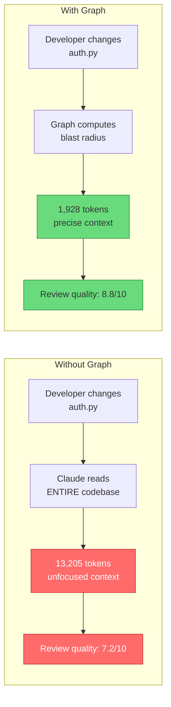

**Result: 6.8x fewer tokens, 22% higher review quality** (tested on httpx, FastAPI, Next.js).

#### Three-Hook Architecture

The graph integrates via 3 CJS hooks that fire automatically:

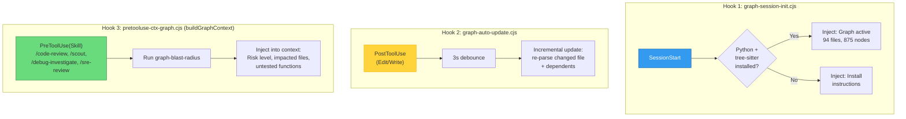

#### Graph in Workflow Context

Every workflow that touches code benefits from the graph automatically:

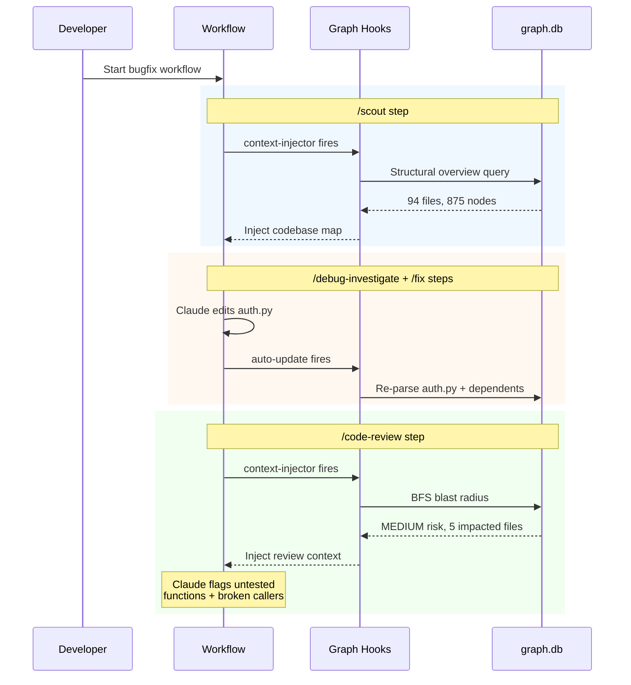

#### Available Skills & Commands

| Category    | Skill                       | Purpose                                                                                  |
| ----------- | --------------------------- | ---------------------------------------------------------------------------------------- |
| **Build**   | `/graph-build`              | Build or incrementally update the knowledge graph                                        |
| **Analyze** | `/graph-blast-radius`       | Show impacted files, functions, and test gaps                                            |
| **Query**   | `/graph-query`              | Natural language: "who calls login?", "tests for AuthService?"                           |
| **Export**  | `/graph-export`             | Full graph to JSON (`--format=json`) or single-file Mermaid diagram (`--format=mermaid`) |
| **Connect** | `/graph-connect-api`        | Detect frontend-backend API connections                                                  |
| **Connect** | `/connect-implicit`         | Detect implicit connections (events, message bus)                                        |
| **Sync**    | `/graph-build --scope=sync` | Sync graph with git state after pull/checkout                                            |
| **Batch**   | `/graph-query batch`        | Multi-file deduplicated query                                                            |

Skills that **automatically receive graph context** when graph.db exists: `/code-review`, `/review-changes`, `/review-architecture`, `/scout`, `/debug-investigate`, `/sre-review`, `/investigate`, `/feature-investigation`, `/fix`, `/refactoring`, `/security-review`, `/performance-review`, `/code-simplifier`, `/prove-fix`.

#### Auto-Maintenance

The graph requires **zero manual maintenance** after initial build:

- **Every edit:** `graph-auto-update.cjs` re-parses the edited file (3s debounce, atomic lock)
- **Every session:** `graph-session-init.cjs` diffs `last_synced_commit` vs HEAD, syncs changed files from git pull/checkout/merge
- **Implicit connections:** `connect-implicit` runs after build/update when `graphConnectors.implicitConnections[]` is configured, creating edges for entity events, message bus, and loosely coupled patterns

#### Why This Matters for AI Agents

```
┌─────────────────────────────────────────────────────────────────┐
│  AI AGENT CHALLENGE         │  GRAPH SOLUTION                    │
│─────────────────────────────│────────────────────────────────────│
│  "What did this change      │  BFS blast radius computes         │
│   break?"                   │  impacted callers + dependents     │
│─────────────────────────────│────────────────────────────────────│
│  "Are there tests for       │  TESTED_BY edges reveal untested   │
│   the changed code?"        │  functions instantly               │
│─────────────────────────────│────────────────────────────────────│
│  "What's the risk level     │  Node count + edge depth =         │
│   of this PR?"              │  LOW/MEDIUM/HIGH/CRITICAL          │
│─────────────────────────────│────────────────────────────────────│
│  "Which files should I      │  Impacted files list replaces      │
│   review?"                  │  reading entire codebase           │
│─────────────────────────────│────────────────────────────────────│
│  "How does auth connect     │  CALLS + IMPORTS edges trace       │
│   to the API layer?"        │  the full dependency chain         │
└─────────────────────────────────────────────────────────────────┘
```

> **Setup:** `pip install tree-sitter tree-sitter-language-pack networkx` then `/graph-build`. See [code-graph-mechanism.md](./code-graph-mechanism.md) for full technical details.

---

### 8.18 Surface-Aware Code Review — Phase 0.7 Detection

A key problem with generic code review: the reviewer doesn't know whether the PR touches backend, frontend, both, or only tooling — so it checks everything regardless. A BE-only fix still triggers SCSS reviews. An Angular-only change still spawns C# pattern checks.

**Phase 0.7 Surface Detection** (added to `/review-changes`) classifies the git diff into surface buckets _before_ spawning any sub-agent:

```
┌─────────────────────────────────────────────────────────────────┐
│  PHASE 0.7 — SURFACE DETECTION (runs before any sub-agent)       │
│                                                                   │
│  Surface Bucket    Files Matched          Review Mode Triggered   │
│  ──────────────    ─────────────          ────────────────────── │
│  BE-only           *.cs, handlers,        BE sub-agent only       │
│                    services                                        │
│  FE-only           *.ts, *.html           FE-Logic sub-agent only │
│                    (no .cs)                                        │
│  BE+FE             Both present           Parallel: BE + FE-Logic │
│  (dimensional)                            + SCSS (if .scss)       │
│                                           + Synthesis              │
│  SCSS-only         .scss only             SCSS sub-agent only     │
│  Tooling-only      .claude/, config,      Fast-exit (no review)   │
│                    lock files                                      │
│                                                                   │
│  WHY THIS MATTERS:                                                 │
│  Before: Every review spawned all agents regardless of diff.     │
│  After: BE-only PRs get BE-only review. No FE noise on .cs PRs.  │
│  The surface classification is written to the report and passed  │
│  downstream to /code-simplifier so simplification is also        │
│  surface-aware.                                                   │
└─────────────────────────────────────────────────────────────────┘
```

#### Structured Review Checklists

Two protocol blocks (`SYNC:be-focused-review-checklist` and `SYNC:fe-logic-focused-review-checklist`) are **embedded verbatim** in sub-agent prompts. This removes AI discretion about _what_ to check:

**`SYNC:be-focused-review-checklist`** — 9 explicit BE checks tied to project patterns:

1. Command/Query handler co-location (CQRS one-file rule)
2. Repository usage — no generic interface, no direct DbContext
3. Business validation — `PlatformValidationResult` fluent API, no `throw new`
4. Side effect placement — entity event handlers only, not in handler bodies
5. Cross-service communication — message bus only, no shared DB access
6. DTO mapping ownership — DTOs own mapping, no mapping in `Handle()`
7. Domain logic placement — lowest-layer rule
8. Common correctness patterns (null safety, LINQ, async)
9. Integration test coverage check

**`SYNC:fe-logic-focused-review-checklist`** — parallel FE checks for base class extension, store patterns, subscription lifecycle, BEM CSS class enforcement.

The checklists reference `backend-patterns-reference.md` directly, so agents look up actual class names rather than guessing.

#### DOC SYNC DEFERRAL — Eliminating Reviewer Hallucination in Docs

A subtle failure mode: review sub-agents would sometimes edit feature docs or spec files inline ("while I'm here, I'll update the docs"). This caused:

- Docs updated with potentially incorrect content (reviewer hallucinated API behavior)
- `/docs-update` step later found docs "already updated" but with wrong content
- Double-write race conditions when multiple parallel reviewers touched the same doc file

The `workflow-review-changes.injectContext` in `workflows.json` now includes a **DOC SYNC DEFERRAL** block injected into every review sub-agent:

```
DOC SYNC DEFERRAL: DO NOT update feature docs, engineering specs, or test spec TCs
during review steps. The dedicated docs-update step handles all of this.
TEST SPEC VERIFICATION above is READ-ONLY cross-reference only — flag gaps, do not write.
```

**Effect:** Review steps are strictly read-only for docs. They may _flag_ staleness as a finding, but the actual write is deferred to `/docs-update` (step 15), which uses specialized sub-skills with evidence verification. Single point of write = no race conditions, no reviewer hallucinations in docs.

#### docs-update v3.2.0 — Mandatory Task Table with Audit Trail

The `/docs-update` skill was upgraded from advisory ([IMPORTANT]) to enforced ([BLOCKING]) compliance with a **Mandatory Task Creation Table**:

```
[BLOCKING] Create ALL 8 tasks via TaskCreate BEFORE any action.
NEVER skip, batch-complete, or mark done without invoking the sub-skill.

# Task  Subject                                               Conditional?
  1     Phase 0 — Triage                                      No — always
  2     Phase 1 — Project docs update                         Yes — arch changes only
  3     Phase 2 — /spec invocation                            Yes — service files changed
  4     Phase 2.5 — /spec-index [mode=index]                  Yes — Feature Spec changed; bucket has derived index
  5     Phase 3 — /spec [mode=tests] update                   Yes — behavior changed
  6     Phase 4 — /spec [mode=sync]                           Yes — Phase 3 ran
  7     Phase 5 — Write summary report                        No — always
  8     Final review — verify all phases ran                  No — always
```

**Before:** The AI could "plan" docs-update in its head, run a few greps, write a note, and call it done with no audit trail.
**After:** Every execution creates exactly 8 tasks. Skipped phases leave a `completed` task with an explicit reason — permanent audit record of why each phase was skipped.

**Dedup module rule:** backend + frontend files for the same module = ONE `/spec` invocation. Prevents duplicate section updates when a PR touches both `Employee.Application/*.cs` and `employee-list.component.ts`.

---

### 8.19 Spec-Driven Development Loop — Closed Feedback Chain

The spec-driven development loop ensures that every code fix propagates through all documentation artifacts in sequence:

```
SPEC-DRIVEN FEEDBACK CHAIN

  Code fix (service/handler/consumer)
    → Feature Spec updated (canonical 8-section capability doc)
    → Feature doc Section 8 TCs updated (canonical TC registry)
    → Integration tests written with TC-{FEATURE}-{NNN} annotations
    → §8 IntegrationTest field synced to the test method
    → SPEC-CHANGELOG.md entry written

  Every artifact updated in a single branch — no orphaned specs,
  no undocumented tests, and no second registry to drift.
  Section 8 is the one source of truth.
```

#### Feature Spec — AI Source of Truth

The canonical 8-section Feature Spec (`docs/specs/{Bucket}/README.{Feature}.md`) is used by AI sessions as a **source of truth for domain modeling**. When a developer asks "what values does `EmployeeClassification` have?", the AI reads the Feature Spec's domain section, not the source code. (The legacy per-module A–E engineering bundle was retired — `spec-index` no longer extracts it; it only re-derives a thin navigation index FROM the Feature Specs.)

**Why accuracy matters:** A 2-value answer when the actual code has 3 values causes:

- Incorrect code generation (missing the third enum value in switch cases)
- Incorrect test assertions (only asserting 2 of 3 variants)
- Documentation that contradicts the codebase

Each Feature Spec carries `last_reviewed` frontmatter. Keeping it current lets `/spec [mode=update]` (canonical) and `/spec-index mode=index` (derived re-generation) treat the spec as a known-good baseline rather than re-deriving from scratch.

#### Section 8 — Canonical Bidirectional Test Catalog

The Feature Spec's **Section 8 is the cross-referenceable TC registry**. Each TC's `IntegrationTest` field links to the integration test method (`TestFile::MethodName`, or `Untested`). When integration tests exist but the corresponding §8 TC is not annotated, the `/integration-test-review` agent produces false-negative "no integration tests found" findings. (There is no separate QA dashboard — the retired `docs/specs/README.md` + `PRIORITY-INDEX.md` catalog was folded into §8.)

**Registration format:** Each §8 TC's `IntegrationTest` field carries the test method name (`TestFile::MethodName`). This enables future AI sessions to find the test via a single grep — no manual file tree traversal required.

The `[Trait("TestSpec", "TC-{FEATURE}-{NNN}")]` annotation in test code provides the bidirectional link:

- Feature doc Section 8 TC ID → test method (forward)
- Test method `Trait` → TC ID → feature doc §8 entry (reverse)

Both directions are queryable without reading source code, making the spec-driven chain **self-documenting for AI agents**.

---

### 8.20 Self-Validating Review — Findings Validation Gate

The hardest hallucination to catch is the one inside the review itself. A review agent that fabricates a finding — wrong `file:line`, inflated severity, a "bug" that re-traces as correct — poisons everything downstream: the fix targets nothing, the human burns trust, the audit trail records noise. Evidence gates (Section 8.6) protect the _implementation_; this gate protects the _review_.

The mechanism is a **recursion-guarded self-review loop**: after any review produces findings, the reviewer re-reviews its own output once more in a terminal mode, and a bounded re-do loop reconciles until the findings are clean. It ships in `/why-review`; standalone `/review-changes` runs it in Phase 6, while `$workflow-review-changes` runs the findings-validation gate as parent step 2 before parallel reviewers and later fix planning.

```
┌─────────────────────────────────────────────────────────────────┐
│  FINDINGS VALIDATION GATE — the reviewer reviews itself          │
│                                                                   │
│  full mode (review)                                               │
│    ├─ produce findings → write report                             │
│    └─ CLOSING TASK: invoke /why-review --validate-findings ──┐    │
│                                                              │    │
│  validate-findings mode (TERMINAL)  ◄────────────────────────┘    │
│    For EACH finding verify all four:                              │
│      (a) file:line proof exists & re-traces to real code          │
│      (b) the finding is correct (re-trace the cited code)         │
│      (c) severity is reasonable, not inflated                     │
│      (d) it reflects project conventions / best practice          │
│    + sweep for finding issues or enhancements the review MISSED    │
│    → emit CLEAN | HAS-ISSUES verdict, return to caller             │
│    NEVER calls /why-review · NEVER spawns a sub-agent             │
│    NEVER runs the gate  ── this is what stops infinite recursion  │
│                                                                   │
│  caller-owned re-do loop (bounded):                               │
│    CLEAN     → append "## Findings Validation" line, gate PASSES   │
│    HAS ISSUES→ reconcile (drop unproven, fix proof, add missed),  │
│               re-derive verdict, re-validate the UPDATED report    │
│    repeat → max 2 re-dos (3 validate passes total)                │
│    still not clean → escalate via AskUserQuestion (no silent loop) │
└─────────────────────────────────────────────────────────────────┘
```

#### Why the recursion guard is the whole design

A naive "review your review" instruction recurses forever — the validation pass is itself a review, which triggers another validation, and so on. Three rules make it terminate deterministically:

| Rule                                                                                                                                            | What it prevents                                                               |
| ----------------------------------------------------------------------------------------------------------------------------------------------- | ------------------------------------------------------------------------------ |
| `validate-findings` is **terminal** — never calls `/why-review`, never re-runs the gate, never spawns a sub-agent                               | Infinite self-recursion                                                        |
| The re-do loop lives in the **caller** (standalone `/review-changes` Phase 6 or `$workflow-review-changes` parent step 2), not in validate mode | Diffuse, unbounded looping across agents                                       |
| **Bounded at max 2 re-dos**, then `AskUserQuestion` escalation                                                                                  | A finding the AI can neither prove nor drop silently looping forever           |
| All passes run in the **same main-agent session** (never a spawned sub-agent)                                                                   | Context loss between validation rounds; the validator sees the real cited code |

#### Why this matters operationally

- **Self-correction without a second human** — the reviewer demotes its own unprovable findings before they reach the report, so humans review a pre-filtered, proof-backed list instead of triaging noise.
- **Bounded cost** — at most 3 validation passes per review, then it escalates rather than burning tokens. The cap is the budget guarantee.
- **Auditable** — every outcome writes a record: `## Findings Validation` (clean), `## Findings Validation Notes` (what changed and why), or `## Findings Validation — Unresolved` (escalated). The reconciliation is never invisible.
- **Symmetric with the rest of the framework** — it is the Section 8.6 evidence discipline turned back on the review layer: every finding must be correct, proof-backed, reasonable, and best-practice, or it gets dropped or escalated.

This closes the last open loop in the quality chain: implementation is evidence-gated, the review is evidence-gated, and now the review's _own findings_ are evidence-gated — by the same standard, with a hard recursion stop and a bounded escape hatch.

---

### 8.21 Behavioral Principle Injection — The Mindset Layer

Sections 8.1–8.2 cover injecting _project knowledge_ (patterns, reference docs). This section covers injecting _reasoning discipline_ — the small set of universal behavioral principles that must be in front of the model at every decision point regardless of project. These are the framework's encoding of AI-harness best practices, and they are delivered by their own dedicated injection path so they survive long context and compaction.

#### The canonical principles

| Principle                          | One-line rule                                                                                                                                    | Best-practice it encodes          |
| ---------------------------------- | ------------------------------------------------------------------------------------------------------------------------------------------------ | --------------------------------- |
| **Anti-hallucination**             | Never present a guess as fact — cite sources, admit uncertainty, self-check, cross-reference, stay skeptical of own confidence                   | Grounding / calibrated confidence |
| **AI Attention (Primacy-Recency)** | Put the 3 most critical rules at BOTH top and bottom of long prompts so adherence survives long context                                          | Attention engineering             |
| **Goal-driven execution**          | Define success criteria first, loop until verified, stop only when observable checks pass; each task step carries `→ verify: [observable check]` | Closed-loop agency                |
| **Tests verify intent**            | Tests must protect a business rule/invariant and fail when that intent breaks — not merely mirror current behavior                               | Specification-as-test             |
| **Critical / sequential thinking** | Every claim needs traced proof, confidence >80% to act; complex problems use explicit thought markers, revisions, and stop conditions            | Structured reasoning              |
| **Surgical changes**               | Diff test — every changed line must trace to the request; bug-fix mode adds no restyling; enhancements are announced, never silent scope-creep   | Minimal-diff discipline           |
| **Surface ambiguity**              | Multiple valid interpretations → present each with an effort estimate and ask; never silently pick the broad/complex path                        | Clarify-before-assume             |
| **Output quality**                 | Token efficiency without quality loss — no inventories/dir-trees/redundant examples; lead with the answer; unresolved questions at the end       | Signal density                    |

The short principles are authored once as hardcoded strings in `.claude/hooks/lib/prompt-injections.cjs` (the 5-line `injectCriticalContext` block + the 26-bullet AI-mistake-prevention block); their long-form canon lives in `.claude/docs/development-rules.md` and `.claude/docs/anti-hallucination-patterns.md`; and the reusable ones are also SYNC-tagged in `sync-inline-versions.md` so they propagate into skill bodies and the cross-tool mirrors (Section 13.5).

#### Three injection timings — principle stays in the attention window

The mindset layer fires at three distinct moments, each tuned for cost:

```
┌─────────────────────────────────────────────────────────────────────┐
│  UserPromptSubmit  →  prompt-context-assembler.cjs (TOP bookend)     │
│     full 5-principle block + AI-mistake block, every prompt         │
│  UserPromptSubmit  →  prompt-context-assembler-closers.cjs (BOTTOM)  │
│     graph/workflow/lesson closing gates — the recency bookend       │
│                                                                     │
│  PreToolUse: Edit|Write|Skill|Agent|Task → pretooluse-ctx-mindset   │
│     (buildMindset) re-injects principles + Golden Rules before any  │
│     consequential action (coding/planning/review skills, spawn)     │
│                                                                     │
│  PreToolUse: Read|Grep|Glob|Bash → pretooluse-ctx-readbash          │
│     (buildMindsetCompact)                                           │
│     re-anchors ONLY the 1-line critical-thinking marker (cheap)     │
│     so it can't scroll out during long read sessions                │
└─────────────────────────────────────────────────────────────────────┘
```

The top/bottom split is the **mechanical implementation of the Primacy-Recency principle**: the assembler places critical rules at the start of injected context, the closers hook places gates at the end — the model sees them at both bookends of every turn. (The split also keeps each hook under the harness's 10,000-char per-hook limit.) Injection is deliberately skipped at `SessionStart` (the harness truncates it to ~2KB) and delivered on the first real prompt instead.

#### Dual-window dedup — anchoring without bloat

Re-injecting on every prompt would flood the context. `wasMarkerRecentlyInjected` (in `prompt-injections.cjs`) does a **dual primacy + recency check**: it suppresses a re-injection if the marker already appears in either the last N lines (recency window) _or_ the first ~50 lines (primacy window). Window sizes are computed from actual content size in `dedup-constants.cjs`. The effect: a principle stays present at the boundaries of the conversation but is never duplicated mid-stream — and after compaction (which clears both windows) it correctly re-injects. This is the same dedup discipline as Section 4.5, applied specifically to keep the mindset layer cheap.

#### Embedded over external — the sequential-thinking migration

A concrete portability/reliability win: sequential-thinking was originally a **runtime MCP server**. It was removed from `.mcp.json` and replaced with an embedded `SYNC:sequential-thinking-protocol` markdown block inlined into 28 planning/review/debug skill files (27 `SKILL.md` + the lowercase-named `why-review/skill.md`; introduced in commit `5f01f44f34e`). The rationale generalizes the framework's stance: a methodology that can be expressed as a protocol should not depend on an external server that might be unavailable — and inlining means **sub-agents and hookless tools inherit it automatically** rather than needing the MCP connection. The protocol defines explicit thought markers (`Thought N/M`, `[REVISION]`, `[HYPOTHESIS]`/`[VERIFICATION]`), mandatory closers (confidence %, assumptions, open questions), and stop conditions (confidence <80% → escalate; ≥3 revisions → re-frame). Fewer runtime dependencies, more portability — the same principle that drives the whole mirror architecture.

---

## 9. State Management & Recovery

### 9.1 The Compaction Problem

```
┌─────────────────────────────────────────────────────────────────┐
│  THE COMPACTION PROBLEM                                          │
│                                                                   │
│  Claude Code has a finite context window (~200K tokens).         │
│  When it fills up, the system "compacts" — summarizing old       │
│  messages to free space.                                         │
│                                                                   │
│  WHAT'S LOST after compaction:                                    │
│  ❌ Read file state (Edit tool requires prior Read)              │
│  ❌ Todo task context (which tasks were in progress)             │
│  ❌ Workflow step progress (which step we're on)                 │
│  ❌ Injected context (patterns, rules, lessons)                  │
│  ❌ Edit count tracking (how many files changed)                 │
│                                                                   │
│  WHAT'S PRESERVED:                                                │
│  ✅ File system state (actual code changes)                      │
│  ✅ Git state (commits, branches)                                │
│  ✅ External state files (swap, todo, workflow)                  │
└─────────────────────────────────────────────────────────────────┘
```

### 9.2 Recovery Architecture

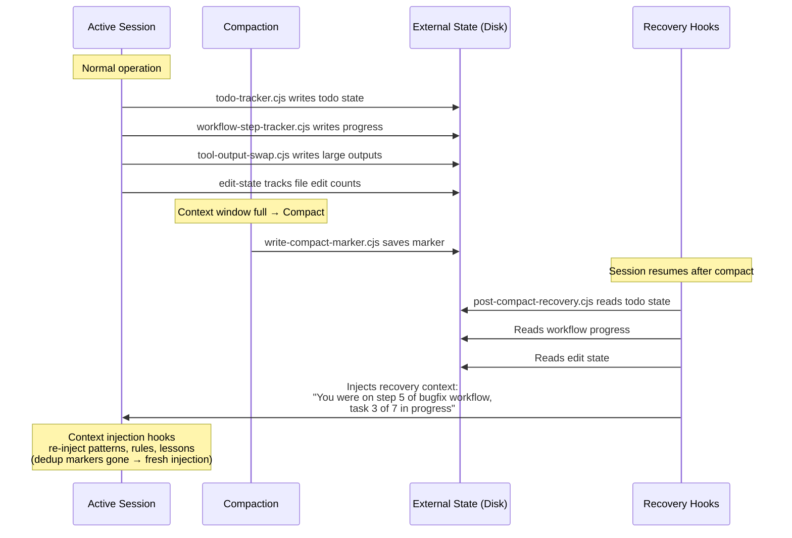

### 9.3 External Memory — Swap Engine

For large tool outputs (>50KB grep results, file reads), the swap engine externalizes them:

```
┌─────────────────────────────────────────────────────────────────┐
│  SWAP ENGINE                                                      │
│                                                                   │
│  PROBLEM: A Grep returning 500 matches fills the context window  │
│  SOLUTION: Replace large output with a pointer to disk file      │
│                                                                   │
│  Before Swap:                                                     │
│  [500 lines of grep results consuming 30KB of context]           │
│                                                                   │
│  After Swap:                                                      │
│  "Results externalized to /tmp/ck/swap/grep-abc123.txt           │
│   Summary: 500 matches across 47 files                           │
│   Top 10 matches shown inline..."                                │
│                                                                   │
│  THRESHOLD: >50KB output triggers swap                            │
│  RECOVERY: swap files available for re-read after compaction     │
│  CLEANUP: session-end.cjs removes swap files on exit             │
└─────────────────────────────────────────────────────────────────┘
```

---

## 10. Testing Infrastructure

### 10.1 Test Coverage

```
┌─────────────────────────────────────────────────────────────────┐
│  HOOK TEST INFRASTRUCTURE: 616 Tests                             │
│                                                                   │
│  Suite                         │ Tests │ Coverage Area            │
│────────────────────────────────│───────│──────────────────────────│
│  test-all-hooks.cjs            │  372  │ All 34 hook behaviors    │
│  test-lib-modules.cjs          │   10  │ Core lib modules         │
│  test-lib-modules-extended.cjs │  153  │ Extended lib + greenfield│
│  test-swap-engine.cjs          │   50  │ Swap engine edge cases   │
│  test-context-tracker.cjs      │   10  │ Context tracker          │
│  test-init-reference-docs.cjs  │    4  │ Init reference docs      │
│  test-shared-utilities.cjs     │   17  │ Shared utilities         │
│────────────────────────────────│───────│──────────────────────────│
│  Total                         │  616  │                          │
│                                                                   │
│  Additional suites in tests/suites/:                              │
│  • context.test.cjs — Context injection behavior                 │
│  • integration.test.cjs — Cross-hook interactions                │
│  • lifecycle.test.cjs — Session lifecycle events                 │
│  • security.test.cjs — Safety/blocking hooks                     │
│  • workflow.test.cjs — Workflow routing                          │
│  • notification.test.cjs — Notification providers                │
│  • bugfix-regression.test.cjs — Regression tests                 │
│                                                                   │
│  Run all: node .claude/hooks/tests/test-all-hooks.cjs            │
│  See CLAUDE.md "Development Commands" for full test list         │
└─────────────────────────────────────────────────────────────────┘
```

### 10.2 Why Test Hooks?

Hooks are the **safety net** for the entire system. A broken hook means:

- Security blocks bypassed (path boundary, privacy)
- Context injection fails (AI loses project knowledge)
- Edit enforcement disabled (AI makes unchecked changes)
- State persistence breaks (todo, workflow, edit tracking)

Testing ensures the framework remains reliable as hooks evolve.

---

## 11. Quick Reference

### Complete Request Lifecycle

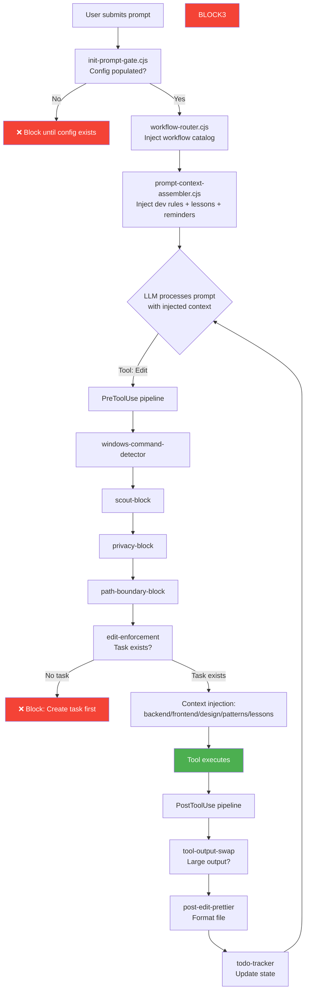

### AI Best Practice → Framework Mapping

| AI Agent Best Practice                         | Framework Mechanism                                                 | Layer     |
| ---------------------------------------------- | ------------------------------------------------------------------- | --------- |
| **Context injection at decision points**       | 10 context injector hooks, auto-triggered by file path              | Hooks     |
| **Reminder rules prevent forgetting**          | 3 UserPromptSubmit hooks re-inject on every prompt                  | Hooks     |
| **Generic & configurable via config**          | project-config.json drives all context injection                    | Config    |
| **Prompt engineering quality**                 | 176 skills with YAML frontmatter + behavior protocols               | Skills    |
| **Auto-select workflow path before acting**    | workflow-router.cjs → direct/skill/workflow/custom path             | Workflows |
| **Confirm plan with questions**                | /plan-validate asks 3-8 questions before implementation             | Skills    |
| **Sequential thinking for complex problems**   | /sequential-thinking skill + /debug-investigate skill               | Skills    |
| **Code proof tracing prevents hallucination**  | evidence-based-reasoning-protocol + /prove-fix                      | Skills    |
| **State survives context compaction**          | Swap engine + todo-tracker + compact-recovery                       | State     |
| **Lessons persist across sessions**            | docs/project-reference/lessons.md + buildLessons (pretooluse-ctx-edit-tail.cjs) | Hooks     |
| **Subagents inherit project context**          | 3 subagent-init\*.cjs dispatchers inject CLAUDE.md + lessons        | Hooks     |
| **Safety boundaries**                          | path-boundary, privacy, scout blocks (exit code 2)                  | Hooks     |
| **Task-gated edits**                           | edit-enforcement.cjs requires TaskCreate before edits               | Hooks     |
| **Auto-formatting**                            | post-edit-prettier.cjs runs formatter after every edit              | Hooks     |
| **Doc staleness detection**                    | /watzup skill cross-references changes vs. docs/                    | Skills    |
| **Unified test specification**                 | /spec [mode=tests] writes TCs to feature doc Section 8              | Skills    |
| **Spec-driven feature workflow**               | feature: specs + tests written and reviewed before implementation   | Workflows |
| **Interactive requirement capture**            | /idea discovery interview + /refine testability check               | Skills    |
| **Test-to-code traceability**                  | TC-{FEATURE}-{NNN} → test annotation linking to TC ID               | Skills    |
| **E2E from browser recordings**                | /e2e-test + Chrome DevTools Recorder → Playwright                   | Skills    |
| **Screenshot assertion baselines**             | e2e --source=update-ui workflow + toHaveScreenshot()                | Workflows |
| **Greenfield project inception**               | isGreenfieldProject() detection → solution-architect agent          | Hooks     |
| **AI as solution architect**                   | /greenfield skill + greenfield-init workflow (waterfall)            | Workflows |
| **Research-driven big features**               | big-feature workflow with step-selection gate                       | Workflows |
| **DDD domain modeling**                        | /domain-analysis skill: bounded contexts, ERD, aggregates           | Skills    |
| **Tech stack comparison with evidence**        | /tech-stack-research: top 3 per layer, confidence %                 | Skills    |
| **Step-selection gate for long workflows**     | big-feature + greenfield preActions let user deselect               | Workflows |
| **Workflow trigger shortcuts**                 | 53 workflow-\* skills for workflow activation and lifecycle control | Skills    |
| **Prompt engineering (role + CoT + evidence)** | Skills use role prompting, chain-of-thought, few-shot               | Skills    |
| **Context engineering (JIT + dedup + budget)** | Hooks manage context window with precision injection                | Hooks     |
| **Skill chain navigation (Next Steps)**        | AskUserQuestion recommends logical next skill per step              | Skills    |
| **Plan-aware skills (Step 0)**                 | Skills read prior workflow outputs before starting work             | Skills    |
| **Review gates between artifacts**             | review-artifact (--type pbi/story/spec-tests) checkpoints           | Skills    |
| **Agent negative-prompting guardrails**        | NEVER/ALWAYS rules per agent prevent role overstepping              | Agents    |
| **Dual planning rounds**                       | High-level arch plan → sprint-ready plan after stories              | Workflows |
| **Conditional architecture scaffolding**       | /scaffold auto-skips when existing abstractions found               | Skills    |

### File Structure

```
.claude/
├── settings.json ──────── Hook registration (9 events, 74 registrations)
├── ccstatusline.json ──── Status line display config (model, context, tokens, tok/s estimator)
├── .ck.json ──────────── Hook-specific config
├── .ckignore ─────────── Scout block patterns
├── workflows.json ─────── 17 workflow definitions
├── workflows/ ──────────── Workflow definitions (primary-workflow.md, etc.)
├── hooks/ ─────────────── 54 top-level hook files + 33 lib modules
│   ├── session-init.cjs
│   ├── workflow-router.cjs
│   ├── prompt-context-assembler.cjs
│   ├── edit-enforcement.cjs
│   ├── ...
│   ├── lib/ ──────────── Shared modules
│   │   ├── swap-engine.cjs
│   │   ├── context-injector-base.cjs
│   │   ├── prompt-injections.cjs
│   │   ├── todo-state.cjs
│   │   └── ...
│   └── tests/ ────────── Test suites
├── skills/ ────────────── 186 skill definitions
│   ├── {skill-name}/SKILL.md
│   ├── shared/ ───────── 5 shared reference/protocol files
│   └── _templates/ ───── Skill scaffolding
├── agents/ ────────────── 28 agent definitions
├── docs/ ─────────────── Framework documentation (co-located)
└── patterns/ ──────────── Anti-hallucination patterns

docs/
├── project-config.json ── Generic project configuration
├── project-reference/ ──── Reference docs (auto-initialized by hooks)
│   ├── project-structure-reference.md
│   ├── backend-patterns-reference.md ── Injected on backend file edits
│   ├── frontend-patterns-reference.md ── Injected on frontend file edits
│   ├── code-review-rules.md ── Injected on code-review skill
│   ├── domain-entities-reference.md ── Entity catalog & cross-service sync
│   ├── lessons.md ──────────── Persistent learned lessons (max 50)
│   ├── design-system/ ──────── Per-app design tokens
│   └── ...
└── specs/ ──────────────── Feature Specs per capability
```

---

## 12. The Agent System — Specialized Subagents

### 12.1 What Agents Are

Agents are **Markdown files** (`.claude/agents/*.md`) that define specialized AI subprocesses. Each agent receives a focused system prompt, restricted tool set, and domain-specific instructions. They run as child processes of the main Claude Code session.

```
AGENT SYSTEM (28 agents)
│
├── IMPLEMENTATION AGENTS
│   ├── backend-developer ──── .NET CQRS patterns, entities, events
│   ├── frontend-developer ─── Angular 19 components, stores, forms (NEW)
│   ├── fullstack-developer ── Parallel implementation with file ownership
│   └── git-manager ─────────── Stage, commit, push with conventions
│
├── QUALITY & REVIEW AGENTS
│   ├── code-reviewer ────────── Report-driven code review
│   ├── spec-compliance-reviewer ── Spec vs implementation drift detection
│   ├── code-simplifier ──────── YAGNI/KISS/DRY cleanup
│   ├── tester ───────────────── Test execution & coverage
│   ├── integration-tester ──── TC-based integration tests
│   └── e2e-runner ──────────── Framework-agnostic E2E tests
│
├── PLANNING & ARCHITECTURE AGENTS
│   ├── planner ─────────────── Implementation plan creation
│   ├── architect ───────────── System design & ADR creation
│   ├── solution-architect ──── Greenfield project inception & design
│   ├── scout ───────────────── Codebase file discovery
│   ├── scout-external ──────── External tool-based scouting
│   └── researcher ──────────── Web research & documentation
│
├── PROJECT MANAGEMENT AGENTS
│   ├── project-manager ─────── Status tracking & reporting
│   ├── product-owner ───────── PBI management & prioritization
│   └── business-analyst ────── Requirements & user stories
│
├── CONTENT & DOCS AGENTS
│   ├── docs-manager ────────── Documentation synchronization
│   ├── knowledge-worker ────── Research synthesis & reports
│   └── journal-writer ──────── Technical difficulty journaling
│
└── SPECIALIZED AGENTS
    ├── ui-ux-designer ──────── Interface design & accessibility
    ├── database-admin ──────── DB optimization & migrations
    ├── debugger ────────────── Root cause analysis & diagnostics
    ├── performance-optimizer ── Query, bundle, lazy-load optimization (NEW)
    ├── security-auditor ──────── Auth, secrets, OWASP, dependency audit (NEW)
    └── framework-maintainer ── .claude framework custodian: skills, hooks, SYNC, mirrors (NEW)
```

### 12.2 Why Agents Matter

Agents solve two critical problems:

1. **Context isolation** — Each agent gets a focused context window without polluting the main session. A code reviewer doesn't need implementation state; a scout doesn't need review findings.

2. **Parallel execution** — Multiple agents can run simultaneously (e.g., 5 code-reviewer agents reviewing different file categories in parallel: architecture, domain-entities, performance, integration-test-review, and security), dramatically reducing time for large tasks.

**Key design:** Agents inherit project context via 8 `subagent-init-*.cjs` hooks — they automatically receive CLAUDE.md instructions, learned lessons, and active workflow state.

### 12.3 Agent Behavioral Rules (NEW)

All 28 agents include two layers of behavioral enforcement:

**Layer 1 — Domain-specific NEVER/ALWAYS rules** appended to their system prompts:

```
# Example: ui-ux-designer agent
- NEVER skip accessibility review (WCAG 2.2 AA minimum)
- NEVER design without considering mobile responsiveness
- ALWAYS use BEM naming convention for all CSS classes

# Example: backend-developer agent
- NEVER use generic root repository interfaces (use service-specific)
- NEVER throw exceptions for validation (use project validation fluent API)
- ALWAYS place side effects in Entity Event Handlers
```

**Layer 2 — Inlined `<!-- SYNC:... -->` protocol blocks** in every agent definition:

Each agent definition now inlines two shared protocol blocks from `sync-inline-versions.md`:

```markdown
<!-- SYNC:critical-thinking-mindset -->

> **Critical Thinking Mindset** — Apply critical thinking, sequential thinking.
> Every claim needs traced proof, confidence >80% to act.
> **Anti-hallucination:** Never present guess as fact...

<!-- /SYNC:critical-thinking-mindset -->

<!-- SYNC:ai-mistake-prevention -->

> **AI Mistake Prevention** — Failure modes to avoid on every task:
>
> - Check downstream references before deleting...
> - Verify AI-generated content against actual code...
> - Holistic-first debugging — resist nearest-attention trap...

<!-- /SYNC:ai-mistake-prevention -->
```

**Agent model: `inherit`** — All agents now use `model: inherit` (inheriting the parent session's model) rather than hardcoding `model: opus`. This ensures agents always use the same model as the active session, reducing cost for lightweight tasks while allowing upgrades to propagate automatically.

**Why this matters (prompt engineering):** Negative prompting ("NEVER do X") + inlined critical-thinking protocols create two complementary guardrails. NEVER/ALWAYS rules prevent role overstepping; SYNC blocks prevent reasoning failures (hallucination, shallow investigation). The agent's focused context means both layers are always visible — they can't be compacted away like instructions in a long conversation.

---

## 13. Multi-AI-Tool Portability — One Source, Every Harness

Everything documented above is engineered as **Claude Code hooks, skills, and workflows** — but the harness is not the product. The product is the **behavior**: evidence gates, workflow enforcement, pattern injection, quality protocols. Claude Code is one execution engine; OpenAI Codex and GitHub Copilot are others. The framework treats the harness as a target, not a dependency — the same authored behavior **compiles** to each tool.

This is the answer to two questions the rest of the guide raises: _"does this only work with Claude Code?"_ (no) and _"does this only work on this codebase?"_ (no). Both are answered by the same mechanism — a **single source of truth that generates verified mirrors** for every supported tool, with project-specific knowledge factored out into config.

### 13.1 Source of Truth → Generated Mirrors

```
┌──────────────────────────────────────────────────────────────────────┐
│  SOURCE OF TRUTH  (hand-authored, the ONLY place you edit)            │
│  .claude/skills/**/SKILL.md · .claude/agents/*.md ·                   │
│  .claude/workflows.json · .claude/hooks/lib/prompt-injections.cjs ·   │
│  CLAUDE.md (project instructions)                                      │
└──────────────────────────────────────────────────────────────────────┘
            │  npm run codex:sync   (9-stage pipeline, fail-fast)
            ▼
┌──────────────────────────────────────────────────────────────────────┐
│  GENERATED MIRRORS  (never hand-edited — sync overwrites them)        │
│                                                                        │
│  Codex ── .agents/skills/**/SKILL.md   1:1 sanitized skill mirror     │
│       ├── .codex/CODEX_CONTEXT.md      prompt-protocols + workflow     │
│       │                                 catalog + AI-SDD markers       │
│       ├── .codex/agents/*.toml         agent mirror                    │
│       ├── .codex/hooks.json            hookless-parity declaration     │
│       └── AGENTS.md (root)             full CLAUDE.md mirror +         │
│                                         managed Codex-context block    │
│                                                                        │
│  Optional Copilot outputs, generated on demand:                       │
│       .github/copilot-instructions.md + .github/instructions/*.md     │
└──────────────────────────────────────────────────────────────────────┘
```

Every generated file **self-declares** as a mirror. `AGENTS.md`: _"This block is auto-generated from `CLAUDE.md` by `npm run codex:sync:context`. Do not edit manually; update `CLAUDE.md` and re-sync."_ Copilot outputs generated by `sync-copilot-workflows.cjs` carry the same auto-generated warning. The authoring rule is absolute: **edit `.claude/` source, run sync, never touch a mirror** — because the next sync overwrites direct mirror edits.

### 13.2 Why Mirrors at All? The Hookless-Parity Problem

Claude Code's power in this framework comes substantially from **hooks** — they inject context, re-anchor principles, and block unsafe actions _automatically_, outside the model's control loop (Section 4). Codex and Copilot **have no hook system**. A naive port would lose every automatic injection.

The mirror compensates by **baking what hooks would have injected into the static artifacts**:

| Hook-delivered on Claude Code                                      | How the mirror delivers it to a hookless tool                                                                    |
| ------------------------------------------------------------------ | ---------------------------------------------------------------------------------------------------------------- |
| `graph-session-init` / workflow catalog auto-injected              | Catalog written into `.codex/CODEX_CONTEXT.md` and `copilot-instructions.md` as static text                      |
| `buildLessons` re-injects `lessons.md`                             | Replaced by an explicit `CODEX:PROJECT-REFERENCE-LOADING` gate telling Codex to open the reference docs itself   |
| `prompt-context-assembler` injects project-config + reference docs | A loading gate instructs the tool to read `docs/project-config.json` + `docs/project-reference/**` at task start |
| `/skill` slash invocation                                          | Rewritten to Codex's `$skill` invocation syntax; `Agent(...)` → `spawn_agent`, `subagent_type` → `agent_type`    |

So the mirror is not a copy — it is a **transform** that converts hook-dependent automation into self-service instructions the hookless tool can follow. Frontmatter is sanitized (Claude-only keys like `version` stripped; `disable-model-invocation` preserved) so each tool reads only what it understands.

### 13.3 The Sync Skills

| Skill                   | Scope                                                                                                             | Mechanics                                                                                                                                                                                                                                                                                                                                                                                   |
| ----------------------- | ----------------------------------------------------------------------------------------------------------------- | ------------------------------------------------------------------------------------------------------------------------------------------------------------------------------------------------------------------------------------------------------------------------------------------------------------------------------------------------------------------------------------------- |
| **`sync-codex`**        | Full Claude → Codex mirror                                                                                        | `npm run codex:sync` (or the skill without npm). `disable-model-invocation: true` — **user-invoked only, never auto-runs.** 9 sequential, fail-fast stages (self-contained — regenerates the Copilot mirror too, so its `tests` stage validates fresh output).                                                                                                                              |
| **`sync-ai-dev-tools`** | Broadest, full-pipeline: **bidirectional** Claude ↔ Copilot source reconciliation **+** ordered both-mirror regen | Part A: 4-step source pipeline (Understand → Research → Compare → Sync). Part B: regenerate BOTH mirrors in load-bearing order (copilot FIRST, then `sync-codex`) + both divergence oracles. `disable-model-invocation: true` — **user-invoked only, never auto-runs** (absorbed the former `sync-all-mirrors` orchestrator).                                                               |
| **`sync-to-copilot`**   | Claude → Copilot knowledge/docs                                                                                   | Script generates instruction files from `workflows.json` + `development-rules.md`; AI enrichment adds per-doc "Key Sections". `--fast` mode runs the script only (no AI pass) — the workflow-catalog-only path, needed because Copilot has no `workflow-router` hook to auto-inject the catalog (absorbed the former `sync-copilot-workflows` skill; the generator script keeps that name). |

**`sync-codex`'s 9 stages** (1–4 mutate, 5–9 verify-only, any failure aborts): **migrate** (agents/skills/notifications) → **hooks** (`.codex/hooks.json`) → **context** (`CODEX_CONTEXT.md` + `AGENTS.md`) → **copilot** (`.github/copilot-instructions.md` + `.github/instructions/*` from `workflows.json`) → **tests** → **wf-cycle** → **sk-proto** → **residue** → **sdd**. The `copilot` stage is ordered _before_ `tests` on purpose: the `tests` stage's TC-WFPROTO-006 byte-matches the committed Copilot mirror against the generator's output, so the pipeline regenerates that mirror first — making `codex:sync` self-contained rather than dependent on a prior `/sync-to-copilot`. The sync is not "done" until all five verifiers pass (four run as dedicated stages — wf-cycle, sk-proto, residue, sdd; the `verify-sync-divergence` oracle runs via its unit test in the `tests` stage) — a stale or non-portable mirror **fails the pipeline** rather than shipping silently.

Mirror parity also enables **multi-AI execution**, not just portability: the **`dual-ai`** skill fans a single prompt out to **two fresh parallel sessions** — Claude Code and Codex CLI — each launched at xhigh reasoning effort in full-permission mode, with an `--orchestrate` mode that supervises both runs and collects a result comparison. It also accepts a workflow id, so `dual-ai workflow-review-changes` gives Claude `/workflow-review-changes` and Codex `$workflow-review-changes`, producing two independent reviews of the same working tree — possible only because the verified mirrors guarantee both tools execute the same workflow. The skill is `disable-model-invocation: true` — strictly user-invoked, since it spawns external sessions that consume quota.

### 13.4 Mirror Parity Is Mechanically Verified

Five verifier scripts (`.claude/scripts/codex/verify-*.mjs`, each with a unit test) turn "keep the mirrors in sync" from a discipline into a **build gate**:

| Verifier                           | Asserts                                                                                                                                                                                                                                                                                      |
| ---------------------------------- | -------------------------------------------------------------------------------------------------------------------------------------------------------------------------------------------------------------------------------------------------------------------------------------------- |
| `verify-sync-divergence`           | **Oracle gate** — re-runs the real mirror transform into a throwaway dir and diffs against the committed `.agents/skills`. Any difference = someone edited source without re-syncing, or hand-edited a mirror.                                                                               |
| `verify-skill-protocol-compliance` | Bidirectional set-diff parity (every source skill has a mirror and vice-versa); the 6 strict-execution-contract sentences present in every mirror; **no Claude-isms** (`Agent(`, `subagent_type`) leak into Codex output; AGENTS.md context block byte-matches `CODEX_CONTEXT.md`.           |
| `verify-workflow-cycle-compliance` | Workflow step-sequences in `workflows.json` match the skill files in **both** `.claude/skills` AND `.agents/skills` ("paired-drift" detection); ordered gates (integration → review → verify; docs-update → workflow-end) intact.                                                            |
| `verify-no-project-residue`        | **Portability enforcement** — scans the generic surfaces for the origin project's literal name and a denylist of its framework symbols (configured per-project). A reusable skill that hardcodes a project-specific name **fails the build**. |
| `verify-sdd-semantic-compliance`   | ~30 semantic assertions on the spec-driven cycle; Codex mirrors reference the _local_ shared-contract path, not the `.claude` source path.                                                                                                                                                   |

`verify-no-project-residue` is the load-bearing one for "works for any project": it is impossible to merge a generic skill that leaked project-specific names, because the residue scan rejects it. Portability isn't a guideline — it's a gate.

The **Copilot mirror** (`.github/copilot-instructions.md` + `.github/instructions/*.instructions.md`) has its own oracle outside the Codex pipeline: `.claude/scripts/verify-copilot-divergence.cjs`. Same oracle pattern as `verify-sync-divergence` — it imports the **real** generator (`sync-copilot-workflows.cjs`), regenerates the expected instruction set, and diffs against the committed `.github` files; any drift fails. It ships with a unit test (`.claude/scripts/tests/verify-copilot-divergence.test.mjs`), npm scripts (`copilot:verify:divergence`, `copilot:test:tooling`), and a diff-gated `.husky/pre-commit` block. It is standalone rather than a 6th pipeline stage because the Copilot mirror is produced by a separate generator (`sync-copilot-workflows.cjs`), not the Codex `run-codex-sync.mjs` transform — so both mirrors now have mechanical parity gates, each rooted in its own generator.

### 13.5 The SYNC-Tag Mechanism — One Protocol, Identical Everywhere

The framework's protocols (evidence-based reasoning, critical-thinking mindset, AI-SDD contract, end-to-start debugger trace, …) must read **identically** across ~200 skills _and_ across three tools. They are kept identical by **inlining, not referencing**:

1. Each shared protocol is authored **once** under a `## SYNC:{tag}` heading in `.claude/skills/shared/sync-inline-versions.md` (~55 tagged protocols).
2. In every consuming skill the content is inlined **verbatim** between `<!-- SYNC:{tag} -->` … `<!-- /SYNC:{tag} -->` fences.
3. The **`sync-skills-shared-protocols`** skill propagates a canonical edit: find every file carrying the tag, replace the text between its fences, verify fence balance. Bulk inserts across all ~286 skill/agent files go through `sync-hooks-to-skills.py`, never by hand.
4. The Codex context stage re-emits the same SYNC blocks into `CODEX_CONTEXT.md` / `AGENTS.md`.

**Why inline instead of reference?** The explicit policy (`SYNC:shared-protocol-duplication-policy`): _"Inline protocol content … is INTENTIONAL duplication. Do NOT extract, deduplicate, or replace with file references. AI compliance drops significantly when protocols are behind file-read indirection."_ This is a deliberate trade — storage/duplication cost for adherence. An LLM follows a rule in front of it far more reliably than a rule it must choose to go read. The verifiers (13.4) make the duplication safe by failing the build the moment copies diverge.

### 13.6 The Portability Contract — How It Works on Any Project

The boundary that makes the framework repo-agnostic is stated in `.claude/skills/shared/sdd-artifact-contract.md` and mirrored into every tool:

> **Generic portability boundary:** Reusable skills and protocol text stay project-neutral; project-specific conventions are discovered from `docs/project-config.json` and `docs/project-reference/`. … Any supported AI tool may execute when this shared context and local docs are available.

The rule that keeps it clean: _"If a rule can be reused unchanged by another repository, keep it out of project-reference docs and place it in `.claude`."_ Skills hold the **reusable** behavior; `project-config.json` + `project-reference/**` hold the **specific** knowledge (tech stack, paths, naming, patterns, evidence formats). Tool-specific adapters translate paths and invocation syntax but must preserve the shared contract — _"correctness comes from artifacts, evidence, tests, and review, not from requiring a named tool set."_

**Adopting this framework on a new repo, concretely:**

1. Copy `.claude/` (skills, hooks, workflows, agents) — the reusable behavior, unchanged.
2. Replace `docs/project-config.json` and `docs/project-reference/**` with the new project's stack, paths, patterns, and conventions. (The `/project-config` and `scan-*` skills can generate these from a codebase scan.)
3. Rewrite `CLAUDE.md` for the new project's golden rules.
4. Run `npm run codex:sync` to regenerate the committed Codex mirrors. Run `/sync-to-copilot` (use `--fast` for catalog-only changes) only when Copilot instruction files are part of the target repo.

The harness, the protocols, and the quality gates carry over verbatim. Only the config and reference docs change. That is what "works for any project, on any supported AI harness" means in this framework — and it is enforced by the same verifier suite that keeps the mirrors honest.

---

## Summary — Philosophy & Principles

### The Core Thesis

**LLMs are powerful but unreliable.** They forget context in long conversations, hallucinate APIs that don't exist, invent patterns instead of following established ones, and skip essential steps when not supervised. The question isn't whether AI makes mistakes — it's whether your system catches them before they reach production.

This framework answers that question with **defense in depth**: multiple independent layers that each catch a different class of failure. The framework is grounded in two engineering disciplines: **prompt engineering** (how to instruct the AI effectively — Section 8.15) and **context engineering** (how to manage what information reaches the AI — Section 8.16).

### Four Complementary Layers

1. **Hooks** (programmatic) — Guarantee enforcement. Context injection, safety blocks, and state persistence run as Node.js processes. They cannot be ignored, forgotten, or hallucinated away. The AI doesn't choose to follow them — they execute regardless.

2. **Skills** (prompt-based) — Guide reasoning. Evidence-based protocols, confidence levels, and proof traces shape how the AI thinks about code changes. They turn vague intentions into disciplined investigation.

3. **Workflows** (declarative) — Enforce process. Step sequences ensure investigation before implementation, planning before coding, and review before commit. They prevent "ready, fire, aim."

4. **Agents** (specialized) — Divide and conquer. Isolated subprocesses with focused context, restricted tools, and domain expertise. They enable parallelism without context pollution.

### Design Principles

| Principle                         | Implementation                                                                                                                                                                                                                                 |
| --------------------------------- | ---------------------------------------------------------------------------------------------------------------------------------------------------------------------------------------------------------------------------------------------- |
| **Trust but verify**              | Every AI claim must cite `file:line` evidence. The `evidence-based-reasoning-protocol` makes speculation forbidden.                                                                                                                            |
| **Fail closed, not open**         | Safety hooks use `exit 2` (non-overridable block). When in doubt, block and explain rather than allow and hope.                                                                                                                                |
| **Convention over configuration** | `project-config.json` centralizes all project-specific knowledge. Hooks read it at runtime — no hardcoded assumptions.                                                                                                                         |
| **Enforce at the boundary**       | Hooks run as separate processes at lifecycle boundaries. The AI can't bypass them because they execute outside the LLM's control loop.                                                                                                         |
| **Learn from mistakes**           | The `/learn` skill captures AI errors into `lessons.md`. `prompt-context-assembler.cjs` re-injects them on every prompt and `buildLessons` (via `pretooluse-ctx-edit-tail.cjs`) on every edit. Past mistakes become future guardrails.          |
| **Plan before implement**         | `edit-enforcement.cjs` requires `TaskCreate` before any file edit. Combined with workflow step tracking, this ensures AI doesn't skip from question to code without a plan.                                                                    |
| **State survives amnesia**        | External state files (todo, workflow progress, swap) persist to disk. After context compaction, `post-compact-recovery.cjs` restores progress — the AI resumes where it left off.                                                              |
| **Stateless-per-turn invariants** | Rules are re-injected at every `UserPromptSubmit` via `prompt-context-assembler` (and re-anchored at PreToolUse by `pretooluse-ctx-mindset` / `buildMindset`). The framework never trusts the AI to remember rules from prior turns — they are re-stated as invariants at each interaction boundary. |
| **Self-contained skill units**    | Skills inline shared protocols via `<!-- SYNC:tag -->` blocks rather than referencing external files. Each skill is a complete, deployable prompt unit. The `sync-skills-shared-protocols` skill keeps copies synchronized from a canonical source.          |
| **Structural intelligence first** | The code graph (`code_graph.py`) is a HARD-GATE before any investigation concludes. Grep finds files; graph traces reveal callers, events, bus consumers, and API contracts — relationships that textual search cannot find.                   |

### What Makes This Framework Different

Most AI coding tools focus on **generation** — producing code faster. This framework focuses on **quality** — producing code that's correct, consistent, and maintainable. The key insight:

> **The bottleneck in AI-assisted development isn't speed of generation — it's reliability of output.**

A 10x faster code generator that produces incorrect code 20% of the time is worse than a 5x faster generator that produces correct code 99% of the time. This framework optimizes for the latter.

### The AI as Strategic Advisor — Not Just a Code Generator

The framework elevates the AI from a code autocomplete tool to a **strategic development partner**:

| Traditional AI Coding Tool   | This Framework                                                                                      |
| ---------------------------- | --------------------------------------------------------------------------------------------------- |
| Generates code from prompts  | Investigates codebase, then generates code matching existing patterns                               |
| No memory between sessions   | Learned lessons persist and prevent repeated mistakes                                               |
| Implements immediately       | Plans, validates with user, reviews plan, then implements                                           |
| Uses generic patterns        | Reads project-specific patterns from reference docs                                                 |
| Works on existing code only  | Guides greenfield inception AND big-feature research                                                |
| Single-shot responses        | Multi-step workflows with quality gates at each stage                                               |
| User must remember all rules | Hooks inject rules automatically — human memory not required                                        |
| Loads all context upfront    | JIT context injection — right docs at right time (context eng.)                                     |
| One-pass generation          | Multi-pass review: cook→simplify→review→code-review→sre (prompt eng.)                               |
| Skills work in isolation     | Plan-aware skills (Step 0) read prior workflow outputs automatically                                |
| Manual workflow progression  | Skill chain navigation (Next Steps) auto-recommends next action                                     |
| Artifacts flow unchecked     | Review gate skills validate PBIs, stories, and test specs mid-flow                                  |
| Locked to one tool & repo    | One source compiles to Codex mirrors and can generate Copilot instructions; config-driven, any repo |

**For greenfield projects**, the AI becomes a full Solution Architect — conducting market research, evaluating tech stacks with confidence percentages, modeling domains with DDD, and collaborating with the user at every decision point. The AI earns trust through structured thinking, not just fast output.

**For established projects**, the AI becomes a senior team member who always reads the docs first, follows the team's conventions, cites evidence for every claim, and catches its own mistakes before they ship.

### Why This Works — The Deeper Insight

The framework succeeds because it aligns with how LLMs actually fail:

| LLM Failure Mode               | Root Cause                                                  | Framework Counter                                                   |
| ------------------------------ | ----------------------------------------------------------- | ------------------------------------------------------------------- |
| **Pattern invention**          | Training data generalizes; your project is specific         | Context injection puts real patterns in every prompt                |
| **Context amnesia**            | Long conversations exceed attention; compaction drops state | External state files + recovery hooks restore progress              |
| **Skipped steps**              | LLMs optimize for shortest path to output                   | Workflow enforcement makes process non-negotiable                   |
| **Confident hallucination**    | LLMs can't distinguish recall from confabulation            | Evidence gates demand `file:line` proof for every claim             |
| **Convention drift**           | Without reminders, AI reverts to generic patterns           | Hook injection re-injects project conventions on every edit         |
| **Repeated mistakes**          | Each session starts fresh with no memory of past errors     | Lessons system persists errors and re-injects them as guardrails    |
| **Wrong-surface reviews**      | Reviewers check FE patterns on BE-only PRs                  | Phase 0.7 surface detection routes to correct sub-agent set         |
| **Reviewer writes stale docs** | Review agents update docs with unverified content           | DOC SYNC DEFERRAL: review=read-only; writes deferred to step 15     |
| **Silent doc phase skips**     | /docs-update phases run without audit trail                 | Mandatory 8-task table: every phase tracked, skips logged           |
| **Stale Feature Spec**         | AI sessions read outdated enum/model specs                  | `/spec [mode=update]` + `docs-update` keep `last_reviewed` current |

**The meta-principle:** Don't fight the LLM's nature — build infrastructure around it. Accept that it forgets, and build state persistence. Accept that it hallucinates, and build evidence gates. Accept that it drifts, and build convention injection. The framework doesn't make the AI smarter — it makes the AI's environment smarter.

### The Result

**54 top-level hook files**, **156 skills**, **17 registered workflows**, and **29 specialized agents** working in concert to deliver:

- **Fewer hallucinations** — Evidence gates and proof traces catch AI fabrications before they reach files
- **Better code quality** — Pattern injection ensures AI follows project conventions, not generic training data
- **Full lifecycle coverage** — From greenfield inception through idea capture, test specification, implementation, code review, and documentation
- **Consistent adherence** — Programmatic enforcement means quality doesn't degrade in long sessions or complex tasks
- **Recovery from amnesia** — External state persistence means context compaction doesn't lose progress
- **Persistent learning** — Mistakes captured once prevent recurrence across all future sessions
- **Prompt engineering depth** — Role prompting, chain-of-thought, few-shot, negative prompting, and iterative refinement applied systematically across 176 skills (Section 8.15)
- **Context engineering precision** — JIT injection, dedup, external memory, budget management, and recovery keep the AI informed without overwhelming its context window (Section 8.16)

The framework is **generic and reusable**. Replace `project-config.json` with your project's specifics, and the entire system adapts — different tech stack, different patterns, different conventions, same quality enforcement.

### Adopting This Framework — What to Do First

If you want to apply this framework to your own project:

1. **Copy `.claude/` directory** — hooks, skills, workflows, agents. These are project-agnostic.
2. **Run `/project-init`** — One idempotent bootstrap route that assesses, populates, and verifies `docs/project-config.json`, reference docs, `CLAUDE.md`, and the `AGENTS.md` Codex mirror (or run `/project-config` directly for config only).
3. **Run scan skills** — `/scan --target=project-structure`, `/scan --target=backend-patterns`, `/scan --target=frontend-patterns` to populate reference docs from your codebase.
4. **Start working** — Hooks auto-inject your patterns, workflows enforce your process, skills guide AI reasoning.
5. **For greenfield projects** — Run `/greenfield` to start the waterfall inception workflow. The framework auto-detects empty projects and switches to Solution Architect mode.

**Time to value:** ~30 minutes for an existing project (config + 3 scans). Zero config for greenfield (auto-detected).

---

_This guide documents a living system. As hooks, skills, and workflows evolve, update this document to match. Use `/watzup` to detect doc staleness after changes._
