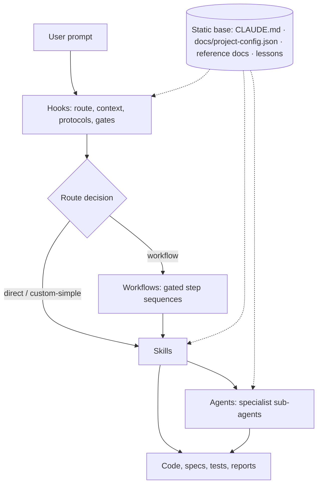

# Claude AI Agent Framework — Guide

> **Purpose:** the one-page map of the portable `.claude/` framework — what it does, how the parts fit, how to use it day to day, and where each topic's detailed owner doc lives. Read it first when you adopt the framework, change it, or need to explain a hook block, a routing decision or a workflow step.
>
> **Framework inventory:** <!-- COUNT:hooks -->23<!-- /COUNT --> top-level hook files · <!-- COUNT:lib-modules -->46<!-- /COUNT --> hook-library modules · <!-- COUNT:skills -->128<!-- /COUNT --> skills · <!-- COUNT:workflows -->21<!-- /COUNT --> workflows · <!-- COUNT:agents -->23<!-- /COUNT --> agents · <!-- COUNT:shared -->12<!-- /COUNT --> shared reference/protocol entries.
>
> **Visual version:** `.claude/docs/claude-ai-agent-framework-guide.html` (same content, one standalone page).

**Critical rules (read before anything else)**

1. **Route first.** Every first task of a session is routed (direct · custom-simple · workflow) before any edit, agent or command. Mid-session, never auto-start a workflow.
2. **Evidence, not memory.** Project facts come from `docs/project-config.json` and the project-reference docs; every claim cites `file:line`; below 80% confidence, don't act.
3. **Gates are not optional.** Root-cause before a fix, adjudicate a failed test before editing it, review before commit, spec/doc sync when behavior changes.
4. **`.claude/` is the source.** `.agents/`, `.codex/`, `.opencode/`, `AGENTS.md` and the generated parts of `CLAUDE.md` are projections — fix the source and regenerate.

---

## 1. What the framework is

A generic LLM is capable but forgetful, confident without evidence, and unaware of your project. This framework wraps Claude Code in **23 top-level hook files**, **128 skills**, **21 registered workflows**, and **23 specialized agents** that make it project-aware, evidence-driven and gated at every quality step — from idea and spec through implementation, testing, review, commit and pull request.

| Failure mode of a plain agent        | What counters it                                            | Where it lives                                     |
| ------------------------------------ | ----------------------------------------------------------- | -------------------------------------------------- |
| Picks the wrong process for the task | Routing gate + workflow catalog injected at prompt time     | `CLAUDE.md` gate, `workflow-route-inject.cjs`      |
| Skips steps or stops early           | Guided workflows: gate steps, outcome gates, evidence-gated close | `.claude/workflows.json`, `start-workflow`, `workflow-end` |
| Guesses APIs and project facts       | Evidence protocols, project config, reference docs, code graph | shared protocols, `docs/project-config.json`     |
| Forgets rules in long sessions       | Rules delivered once per session and re-armed after compaction | protocol-inject hooks, prompt ledger             |
| Ships unreviewed work                | Review fix-loop → receipt → commit gate                     | review skills, `review-commit-gate.cjs`, `commit`  |
| Drifts from the spec                 | Spec-first workflows, spec sync gates, doc-sync advisory     | `spec`, `docs-update`, `doc-sync-gate.cjs`         |
| Leaks one project into another       | Portable source + generated mirrors + residue verifiers     | `framework-portability.md`, `/sync-codex`          |

The design bet: **static rules carry the contract; hooks only accelerate it.** Everything a model must obey lives in `CLAUDE.md`, skill bodies and agent files, so it binds Claude Code, Codex and OpenCode alike. Hooks deliver the same text at the right moment and add the few checks that must be mechanical.

---

## 2. Everyday use

| You want to…                          | Use                                                     |
| ------------------------------------- | ------------------------------------------------------- |
| Build a feature                       | `/workflow-feature` (large or unclear: `/workflow-big-feature`) |
| Build what a spec already describes   | `/workflow-implement-spec`                              |
| Fix a bug                             | `/workflow-bugfix` (small, known cause: `/fix`)         |
| Understand code                       | `/investigate` (`--mode=explain`) or `/understand`      |
| Refactor without behavior change      | `/workflow-refactor`                                    |
| Review your changes                   | `/changes-review` (quick) · `/workflow-review-changes --fix-loop` (full) |
| Commit                                | `/commit` (the only agent commit path)                  |
| Open a pull request                   | `/pull-request` (branch → review → commit → PR → CI green) |
| Design or mock up UI                  | `/design`, `/pbi-mockup --explore`, `/workflow-spec-to-mockup` |
| Write or sync a spec                  | `/spec`, `/workflow-feature-spec`, `/workflow-spec-sync` |
| Write or fix tests                    | `/workflow-write-integration-test`, `/workflow-integration-test-green`, `/workflow-e2e` |
| Set up a project                      | `/project-init`, then `/scan-all`                       |
| Capture a lesson                      | `/learn`                                                |
| Ask what the framework does here      | `/project-help`                                         |

A typical request: you type a prompt → hooks inject the routing catalog and your project context → Claude declares a route (`Route: workflow-bugfix — because …`) → a workflow creates one task per step → steps run inline or as sub-agents → review, tests and outcome gates must pass → `workflow-end` closes with a summary.

---

## 3. Architecture — four layers on a static base

```mermaid
flowchart TB
  U[User prompt] --> H[Hooks: route, context, protocols, gates]
  H --> R{Route decision}
  R -->|direct / custom-simple| S[Skills]
  R -->|workflow| W[Workflows: gated step sequences]
  W --> S
  S --> A[Agents: specialist sub-agents]
  S & A --> O[Code, specs, tests, reports]
  B[(Static base: CLAUDE.md · docs/project-config.json · reference docs · lessons)] -.-> H & S & A
```

| Layer         | What it is                                                   | Kills this failure mode                   | Owner doc                                   |
| ------------- | ------------------------------------------------------------ | ----------------------------------------- | ------------------------------------------- |
| Static base   | `CLAUDE.md` (partly generated from config), project config, reference docs, `lessons.md` | Generic answers that ignore the project | `configuration/README.md`, `ai-context-refresh` |
| Hooks         | Node scripts on lifecycle events (`.claude/hooks/*.cjs`)     | Forgotten rules, unreviewed commits        | `hooks/README.md`                            |
| Skills        | Task protocols (`.claude/skills/<name>/SKILL.md`)            | Ad-hoc, unrepeatable work                  | `skills/README.md`                           |
| Workflows     | Ordered, role-tagged skill sequences (`.claude/workflows.json`) | Skipped steps, wrong process            | `start-workflow` skill, `configuration/README.md` |
| Agents        | Specialist sub-agents (`.claude/agents/*.md`)                | Context overload, shallow specialist work  | `agents/README.md`, `agents/agent-patterns.md` |

**Relocatable roots.** No path is hard-wired; each root has a framework default and a config key in `docs/project-config.json`:

| Role                     | Default                   | Override key                           |
| ------------------------ | ------------------------- | -------------------------------------- |
| Business specs           | `docs/specs`              | `specRoots.business.path`              |
| Technical specs          | (none)                    | `specRoots.technical.path`             |
| Project reference docs   | `docs/project-reference`  | `docsRoots.projectReference.path`      |
| ADRs                     | `docs/adr`                | `docsRoots.adr.path`                   |
| Plans                    | `plans`                   | `docsRoots.plans.path`                 |
| Team artifacts (PBIs, mockups) | `team-artifacts`    | `docsRoots.teamArtifacts.path`         |
| Product roadmap          | `docs/product-roadmap.md` | `docsRoots.productRoadmap.path`        |
| Disposable output        | `tmp/` (or `temp/`)       | fixed; both git-ignored                |

---

## 4. Routing — how a request becomes a route

The **WORKFLOW-GATE** block in `CLAUDE.md` (source: `.claude/skills/shared/workflow-first-gate.md`) binds every host. At prompt time `workflow-route-inject.cjs` adds a compact workflow catalog (tier, step count, when to use, parallel groups).

1. **Honor explicit requests** — a `/skill`, `/workflow-*` or "use a workflow" always runs.
2. **Assess** scope · change type · risk · ambiguity · needed artifacts. Escalate on risk and ambiguity, not file count.
3. **Pick a route:** question or trivial edit → *direct*; focused one-module change → *custom-simple* (only the steps it needs); non-trivial bug → `workflow-bugfix`; cross-module feature → `workflow-feature`; explicit roadmap → `product-roadmap`; otherwise the matching skill.
4. **Catalog fit:** keep a workflow only if >80% of its unconditional steps do real work; otherwise downgrade to custom-simple — but a behavior change keeps test and review, a bug keeps root-cause, a contract change keeps spec/doc sync.
5. **Declare and activate:** `Route: {id | skill | custom-simple [a → b] | direct} — because {signals}`, then start it before any edit.

**Activation tiers** (per workflow in `.claude/workflows.json`; absent = `auto`): `auto` may self-start · `confirm` asks once when a leaner route would also do · `manual` never self-starts. Projects adjust tiers with `portability.workflowActivation` in `docs/project-config.json` (`default` only tightens; a per-workflow `overrides` entry may loosen); a local `.claude/.ck.local.json` wins for one developer. Turn prompt-time routing off with `portability.workflowAutoDetect: false`.

**Mid-session rule:** auto-activation applies only to the first task of a session. After that, work directly or with a chain of at most three skills; required gates still run and don't count toward the cap.

---

## 5. Workflows — guided, gated execution

A workflow is an **intent** plus **outcome gates** plus an ordered list of **step occurrences**, each with a role:

| Role       | Meaning                                                                                  |
| ---------- | ---------------------------------------------------------------------------------------- |
| `gate`     | Always runs. Never skipped, merged or reordered.                                         |
| `core`     | Recommended. May flex (skip, merge, simplify, reorder) with a logged reason if outcome gates stay reachable. Unannotated steps are `core`. |
| `optional` | Carries `applicability.when` and `skipReason`; skipped when `when` is false.              |

**How a run works** (owner: `.claude/skills/start-workflow/SKILL.md`):

- **Triage first** — size (XS to XL), change kinds and risk decide depth; small work stays lean, large work batches per module.
- **Read the workflow's own SKILL.md, then create tasks 1:1** — one task per occurrence, titled `[Workflow] [{role}] {step}`, all before the first starts.
- **Log every deviation** to `tmp/workflow-runs/<runId>/skips.md` as `<occurrence-id> · <kind> · <evidence>`; a skipped task is completed with a comment, never deleted.
- **Parallel groups** run as waves: all members spawn in one message; the next step waits until every member returns.
- **Nested workflows** run as sub-agents that return a summary — except `workflow-review-changes`, which always runs inline in the main session (its loop owns the session Stop hook); its own reviewers stay sub-agents.
- **Run record** — run id, mode, fingerprint and occurrence ids persist, so a resume detects a changed definition and stops instead of silently switching.
- **Evidence-gated close** — `workflow-end` refuses to close until every outcome gate (`root-cause-traced`, `plan-approved`, `tests-pass`, `spec-synced`, `review-converged`, `run-closed`) has evidence: a review receipt or cited report, test command output, and so on.

### Workflow Catalog (21 Workflows)

| Workflow                          | Tier    | Steps | Use when                                                          |
| --------------------------------- | ------- | ----- | ----------------------------------------------------------------- |
| `workflow-feature`                | auto    | 28    | A well-defined feature or capability without a spec for it yet    |
| `workflow-big-feature`            | confirm | 45    | Large, ambiguous or research-heavy feature                        |
| `workflow-implement-spec`         | auto    | 11    | Behavior already written in a canonical spec                      |
| `workflow-bugfix`                 | auto    | 16    | A bug, crash, regression or stale output                          |
| `workflow-refactor`               | auto    | 15    | Restructure without changing behavior                             |
| `workflow-review-changes`         | auto    | 19    | Review uncommitted changes before commit                          |
| `workflow-spec-to-mockup`         | auto    | 8     | Clickable mockup of a UI spec, 1–3 design directions              |
| `workflow-feature-spec`           | auto    | 8     | Create or update a canonical feature spec                         |
| `workflow-code-to-spec`           | auto    | 6–11  | Spec from existing code, sync after changes, staleness audit      |
| `workflow-spec-sync`              | auto    | 11    | Update test specs after code, bug or PR changes                   |
| `workflow-idea-to-spec`           | auto    | 19    | Raw idea → one reviewed provisional spec                          |
| `workflow-idea-to-pbi`            | auto    | 30    | Idea → grooming-ready PBI, stories and test specs                 |
| `workflow-spec-to-pbi`            | auto    | 22    | Specs → prioritized, dependency-aware backlog                     |
| `workflow-greenfield-init`        | confirm | 56    | A new project from scratch                                        |
| `workflow-write-integration-test` | auto    | 10    | Write or update integration tests, spec-first                     |
| `workflow-integration-test-green` | auto    | 9     | Drive the integration suite to fully green                        |
| `workflow-e2e`                    | auto    | 6     | Write, update and verify E2E tests                                |
| `workflow-seed-test-data`         | auto    | 9     | Idempotent seeders and realistic dev data                         |
| `workflow-architecture-audit`     | auto    | 6     | Whole-project architecture and production-readiness check         |
| `workflow-research`               | auto    | 6–7   | Web research → synthesis, business, marketing or course output    |
| `workflow-visualize`              | auto    | 4–5   | Diagrams from code or research                                    |

### Key sequences (`gate` in bold)

- **Feature:** investigate → spec (+ optional discovery, domain, scenario, mockup) → plan → plan-review → test specs → implement → spec sync → integration tests → **review changes** → **test** → **close**.
- **Bug fix:** **root-cause investigation** → optional spec amend / plan → **failing regression test** → fix → test passes → **verify** → **review changes** → **close**.
- **Refactor:** investigate → **run tests (green baseline)** → plan → optional safety-net tests → execute → **review changes** → **test** → **close**.
- **Implement spec:** investigate → spec-clarify → plan → execute → integration tests → **verify** → **review changes** → **test** → **close**.
- **Spec to mockup:** design spec → **design review** → `pbi-mockup --explore` → `html-export` → **UI review** → **close**.
- **Review changes:** `changes-review` ∥ whole-target `why-review` → triage-selected `--report-only` specialists (the integration-test review with `--prove-tests` always runs) → validate findings → trace unexplained defects → `fix --target=review` → simplify → post-fix re-review → `scan --target=domain-entities → docs-update`. The domain-entity scan runs only when the final diff changes an entity/model, DTO/data contract, persistence schema/migration, or entity-sync evidence; otherwise complete the scan task with a cited skip reason. `docs-update` always applies the spec/doc gaps the reviewers flagged read-only.

---

## 6. Skills

A skill is a directory with `SKILL.md` (frontmatter `name`, `description` = `[Category] Use when …`, optional `version`, `disable-model-invocation`) plus optional `references/`, `scripts/` and `tests/`. The body opens with a Quick Summary, carries a `PROTOCOL-GUIDES` block, and ends with closing reminders. Naming: lowercase-hyphen, subject-first when a family exists (`spec-clarify`, `graph-trace`). Read `.claude/docs/skills/README.md` and `.claude/docs/skill-naming-conventions.md` when you add or change a skill.

| Category                         | Count | Examples                                                             |
| -------------------------------- | ----- | -------------------------------------------------------------------- |
| Workflows (entry + lifecycle)    | 23    | `workflow-*`, `start-workflow`, `workflow-end`                       |
| Planning & architecture          | 10    | `plan`, `plan-review`, `plan-validate`, `scenario`, `architecture-design` |
| Implementation                   | 5     | `feature-implement`, `plan-execute`, `code-simplifier`               |
| Understand, fix, debug, graph    | 10    | `investigate`, `understand`, `debug-investigate`, `fix`, `graph-*`   |
| Review & quality                 | 15    | `changes-review`, `why-review`, `security-review`, `ui-review`       |
| Testing                          | 9     | `test`, `integration-test`, `e2e-test`, `experience-review`          |
| Specs & reference docs           | 9     | `spec`, `spec-clarify`, `tech-spec`, `docs-update`, `scan`           |
| Design & UI                      | 4     | `design`, `design-spec`, `pbi-mockup`, `excalidraw-diagram`          |
| Product / PBI                    | 7     | `idea`, `refine`, `story`, `prioritize`, `dor-gate`                  |
| Research & business content      | 8     | `web-research`, `deep-research`, `market-analysis`                   |
| Documents, decks & media         | 8     | `feature-presentation`, `html-export`, `demo-guide`, `watzup`        |
| Git & delivery                   | 5     | `commit`, `pull-request`, `git-conflict-resolve`, `release-notes`    |
| Project setup, context & help    | 9     | `project-init`, `ai-context-refresh`, `project-skill-protocol`, `learn` |
| Framework maintenance            | 6     | `sync-codex`, `sync-opencode`, `skill-creator`, `prompt-enhance`     |

**Who can start a skill.** Most skills are model-invocable. 18 are command-only (`disable-model-invocation: true`, e.g. `sync-codex`, `release-notes`, `product-roadmap`) — only the user starts them with `/name`. A team can hide more with a **skill profile** (`skillProfile` in `docs/project-config.json`): preset `full` · `standard` · `minimal`, plus `nameOnly`, `commandOnly` and `off` lists; `node .claude/scripts/sync-skill-profile.cjs` writes the result into `.claude/settings.json` `skillOverrides`. Hiding a skill that a workflow, agent or hook calls is refused unless `allowHidingCalledSkills: true`.

**Review-family modes.** `--fix-loop` (review → validate → fix → fresh re-review until converged; mints a review receipt) and `--report-only` (a leaf reviewer that only reports — no fixes, no questions, no nested fan-out — used when a caller owns the fixes).

---

## 7. Agents

Specialist sub-agents with their own context. Each declares `memory: project`; all inherit the session model except where a definition pins one. Agents carry full protocol text (they never rely on hooks). Choose by domain — `.claude/skills/shared/sub-agent-selection-guide.md` maps domain → agent, and specialist work never goes to the generic `code-reviewer`.

| Group              | Agents                                                                                           |
| ------------------ | ------------------------------------------------------------------------------------------------ |
| Implementation     | `backend-developer`, `frontend-developer`, `fullstack-developer`, `code-simplifier`, `database-admin` |
| Review             | `code-reviewer`, `architect`, `security-auditor`, `performance-optimizer`, `spec-compliance-reviewer` |
| Testing & debugging| `tester`, `integration-tester`, `e2e-runner`, `debugger`                                         |
| Research & planning| `planner`, `researcher`, `knowledge-worker`, `solution-architect`                               |
| Design             | `ui-ux-designer`                                                                                 |
| Docs & ops         | `docs-manager`, `git-manager` (explicit git requests only), `journal-writer`                     |
| Framework          | `framework-maintainer` (edits `.claude/` itself, not app code)                                   |

A sub-agent starts with no conversation context: its brief must name the files, reference docs, and any journey report or design plan it needs, and it writes its full findings to `tmp/reports/` and returns a summary.

---

## 8. Hooks and runtime

Hooks are Node scripts registered in `.claude/settings.json`. They read stdin JSON and write context to stdout. Only two can stop you:

| Hook                  | When it blocks                                                                             |
| --------------------- | ------------------------------------------------------------------------------------------ |
| `review-commit-gate`  | An agent `git commit` with no review receipt (or user-approved skip) for that exact changeset |
| `init-prompt-gate`    | `docs/project-config.json` exists but is invalid (repair commands still pass). A missing config only gets a once-a-day notice. |

Everything else is advisory or silent.

| Event                           | Hooks (purpose)                                                                                          |
| ------------------------------- | -------------------------------------------------------------------------------------------------------- |
| SessionStart                    | `verify-install` (partial-install check, safe dependency install), `session-init` (session/plan state), `session-init-docs` (reference-doc status), `graph-session-init`, `file-convention-inject` and `prompt-ledger` (re-arm after compaction) |
| UserPromptSubmit                | `init-prompt-gate`, `graph-prompt-sync`, `workflow-route-inject` (routing catalog), `commit-skill-route`, `judgement-integrity-route`, `prompt-ledger` |
| UserPromptExpansion · PostToolUse `Skill`/`Read(SKILL.md)` · SubagentStart | six `protocol-inject-<group>` hooks (review, evidence-trace, workflow-task, spec-test, design, universal) |
| PreToolUse                      | `doc-sync-gate` (spec-drift warning), `review-commit-gate`, notifications on `AskUserQuestion`           |
| PostToolUse                     | `post-edit-prettier` (formatter), `graph-auto-update`, `file-convention-inject`, `prompt-ledger`, `token-budget-checkpoint` |
| Stop · Notification · SessionEnd| `notifications/notify.cjs` (turn-complete, question and permission alerts), `session-end` (cleanup)      |

**Key mechanisms**

- **Routing injection** — the gate (or a pointer when `CLAUDE.md` already has it) plus the workflow catalog, once per session, re-armed on change, compaction or ~200K tokens of growth.
- **Protocol delivery** — when a skill loads, its group hook sends the full text of the protocols its guide lines name, once per session, capped per message.
- **File conventions** — touching a file injects the matching `contextGroups[]` rules not already in context (opt-in `conventionInjection.enabled`; hookless: `node .claude/hooks/lib/file-conventions.cjs --lookup <path>`).
- **Prompt ledger** — pins your first prompt as the session goal and records every later prompt in `tmp/prompt-ledger/<session>/ledger.md`, re-delivered after compaction.
- **Token checkpoint** — an advisory note each time non-cached tokens pass a multiple of `hooks.tokenBudget.checkpointTokens` (default 500,000).
- **Code graph** — `hooks.codeGraph.enabled`: `auto` (default; active only when `.code-graph/graph.db` exists), `on`, `off`.
- **Notifications** — desktop alerts by default (`ENABLE_DESKTOP_NOTIFICATIONS=false` turns them off); Discord, Slack and Telegram when their env keys are set.

Read `.claude/docs/hooks/README.md` when you add a hook or need exact behavior, and `.claude/docs/troubleshooting.md` when one blocks or warns.

---

## 9. Shared protocols — one source, hybrid delivery

Reusable rules (evidence-based reasoning, root-cause debugging, severity rubric, UI/UX principles, and about 90 more) are written once in `.claude/skills/shared/sync-inline-versions.md` as `SYNC:<tag>` blocks and grouped in `protocol-groups.json`. `node .claude/scripts/build-protocol-projection.cjs` projects them into `.claude/skills/shared/protocols/`.

| Carrier                          | Holds                                                                  |
| -------------------------------- | ---------------------------------------------------------------------- |
| Normal skills                    | One guide line per protocol (tag, summary, when, path)                 |
| Protocol-inject hooks            | The full text, delivered when the skill loads                          |
| Hookless hosts                   | Read the guide line's path                                             |
| Review-family skills and agents  | Full inline bodies (a reviewer must never depend on delivery)          |
| Root `CLAUDE.md`                 | The four universal protocols                                           |

Why hybrid: a rule already in context beats a rule the model must go read, but repeating every body in every skill bloats context. Guides keep skills lean; hooks put the full rule in context exactly when it applies. After editing a canonical block, propagate with `sync-update-blocks.py <tag>` (or `/sync-skills-shared-protocols`) and rebuild the projection.

---

## 10. The quality chain — review, commit, pull request

1. **Review** — `changes-review` or `workflow-review-changes`. Round 1 must reach zero validated findings; from round 2 only Critical/High/Medium block; two rounds plus at most one extension, then escalate to the user.
2. **Validate findings** — `why-review --validate-findings` checks every finding against evidence before any fix. It is terminal: it never recurses, so validation cannot loop.
3. **Fix** — `fix --target=review` fixes validated findings at the owning layer and records FIXED / REJECTED / DEFERRED with reasons; an unexplained defect is traced with `debug-investigate` first.
4. **Receipt** — a converged `--fix-loop` mints a review receipt bound to the exact changeset; any later edit invalidates it.
5. **Commit** — `/commit` stages, runs the test-verify and review gates, and writes a Conventional Commit. `review-commit-gate` blocks any agent `git commit` without a receipt or a user-approved skip.
6. **Pull request** — `/pull-request` branches if needed, runs the review fix-loop over the whole branch, tests, commits, pushes, opens a ready PR and fixes CI until green. It never merges or force-pushes. Target: `pullRequest.targetBranch` (default `main`).
7. **Doc sync** — reviewers flag spec/doc gaps read-only; `docs-update` applies them. `doc-sync-gate` warns when enforced areas change without their spec.

**Git discipline** (model-behavioral on every host): never commit, push or stage without an explicit request; branch before committing on the default branch; never run a command that destroys uncommitted work without asking; treat `gh`/GitHub-MCP writes like a push. Only the literal `permissions.ask` patterns in `.claude/settings.json` still prompt; the commit review gate is the one mechanical rule.

---

## 11. Design and UX gates

Any task that creates or reshapes a user-facing screen runs three rule sets in order, plus a review procedure:

| Set          | Question it answers                                           | Owner doc                             |
| ------------ | ------------------------------------------------------------- | ------------------------------------- |
| `UX-1`–`UX-11` | Whose job, which journeys, what each decision needs — a journey report first | `.claude/docs/ux-journey-process.md` |
| `UI-1.1`–`UI-9.4` | Usability and accessibility floor (pass/fail)             | `SYNC:ui-ux-design-principles`        |
| `DD-1`–`DD-8` | Is it this product's interface, not a generic template        | `.claude/docs/design-knowledge.md`    |
| `CL-1`–`CL-6` | How to review: context, evidence, P0–P4 severity, sweep       | `.claude/docs/design-review-checklist.md` |

Precedence: the brief's visual direction → the project's design system and ADRs → these clauses; genuine conflicts go to the user. **Explore mode** (`/pbi-mockup --explore`, `/design --mode=explore`) first asks how many drafts (3, 2, 1 or skip), opens them in the browser, recommends one with evidence and builds the full mockup only in the direction the user picks; with nobody to ask it builds one draft and records the automatic choice.

---

## 12. Specs and tests

- **Specs** live under the business spec root. The portable default is an 8-section Feature Spec whose §8 holds test cases `TC-{FEATURE}-{NNN}`; a project can declare its own artifact profile. `spec` authors, amends, writes test specs and syncs; `tech-spec` generates the derived technical view; `spec-discovery` and `spec-clarify` run before new specs.
- **Tests verify intent** — each test names the business rule or invariant it protects and must fail when that intent breaks.
- **A failed test gets a verdict before any edit:** SOURCE-WRONG · TEST-WRONG · TEST-NOT-OPTIMAL · ENVIRONMENT-BLOCKED · AMBIGUOUS. Never weaken, skip or relax a test to force green.
- **Test skills:** `integration-test` (write), `integration-test-review` (quality), `integration-test-verify` (run, `--fix-loop`), `e2e-test` / `e2e-test-verify`, `experience-review` (drive the running product), `seed-test-data`.

Read `spec-system-reference.md` in the project-reference docs root (default `docs/project-reference`; `docsRoots.projectReference.path` in `docs/project-config.json` overrides) when you write specs, and `integration-test-reference.md` in the same root when you write tests.

---

## 13. Project config and context

`docs/project-config.json` is **optional**: absent means portable defaults plus repository evidence; present means only `project.name` is required; a declared but malformed section fails closed. Main sections:

| Section                                    | Purpose                                                  |
| ------------------------------------------ | -------------------------------------------------------- |
| `project`, `framework`, `modules`          | Identity, stack metadata, module map                     |
| `specRoots`, `docsRoots`, `referenceDocs`  | Where specs and docs live; which reference docs apply    |
| `contextGroups`, `conventionInjection`     | Per-path conventions and their hook delivery             |
| `designSystem`, `uiReview`, `styling`, `componentSystem` | UI capability and review settings        |
| `testing`, `e2eTesting`, `integrationTestVerify`, `experienceVerification` | Test commands and evidence contracts |
| `workflowPatterns`, `architectureRules`    | Architecture style, layer rules, doc-sync areas          |
| `portability`                              | Routing switches, activation tiers, universal guides, tooling package name |
| `hooks`                                    | Startup install, Windows Git, code graph, token budget   |
| `commit`, `pullRequest`, `skillProfile`    | Commit trailer, PR target branch, skill visibility       |

- **Generated context** — `/ai-context-refresh` regenerates the `SECTION:*` blocks of `CLAUDE.md` from config (your own text outside them is preserved); `AGENTS.md` is a projection of it; `COUNT:*` markers are refreshed by `generate_catalogs.py`.
- **Reference docs** — `/scan --target=<doc>` and `/scan-all` regenerate project-reference docs from evidence (a missing capability is marked not applicable, never filled with example code).
- **Lessons** — `lessons.md` holds learned guardrails. At the end of non-trivial work Claude names the root-cause failure mode, checks it is general, recurring and not mechanically catchable, and then asks you to run `/learn`.
- **Project overlays** — `/project-skill-protocol` adds project rules on top of a framework skill. Overlays are additive only and can never waive a routing, git, review or confirmation gate.
- **Saved prompts** — `/custom-prompt` stores project playbooks.
- **Developer settings** — `.claude/.ck.json` (team) and the git-ignored `.claude/.ck.local.json` (personal) hold hook switches such as `promptLedger`, `commitSkillRoute` and `judgementIntegrityRoute`.

Read `.claude/docs/configuration/README.md` for every key and its default.

---

## 14. State, memory and recovery

Context compaction drops file contents and read state; summaries describe intent, not the environment. What survives: the task list, the workflow run record, `tmp/` reports, the prompt ledger and anything on disk.

- **Recover by re-reading:** `TaskList` first, then `CLAUDE.md`, the active plan and the files you will touch. Treat every "completed" claim in a summary as a hypothesis until evidence confirms it.
- **External memory:** long work writes its report incrementally to `tmp/reports/`, one section per append, so a cut-off loses nothing.
- **Re-arming:** protocol delivery, routing, file conventions and the prompt ledger all re-arm after compaction.
- **Disposable output** (reports, logs, screenshots, coverage) goes under `tmp/`; never into source, docs, plans or mirrors.

---

## 15. Portability — one source, every harness

The framework copies into any project and runs under Claude Code, Codex and OpenCode.

| Surface                                   | Status    | Produced by                                  |
| ----------------------------------------- | --------- | -------------------------------------------- |
| `.claude/**`, `CLAUDE.md` outside markers | Source    | hand-edited                                  |
| `.agents/skills/**`, `.codex/**`, `AGENTS.md` | Generated | `/sync-codex` (`run-codex-sync.mjs`, 19 stages) |
| `.opencode/**`, `opencode.json` skill policy | Generated | `/sync-opencode`                           |
| `.claude/skills/shared/protocols/`        | Generated | `build-protocol-projection.cjs`              |

Codex transforms `/skill` into `$skill`, `Agent` into `spawn_agent` and strips Claude-only keys; OpenCode gets a permission policy for command-only skills. `/sync-codex --verify-only` runs the read-only gates: workflow-cycle compliance, skill-protocol compliance, project-residue, SDD semantics, review-validate coverage, sync adoption parity, provenance markers and divergence.

**Portability rules** (owner: `.claude/docs/framework-portability.md`): no project names, absolute paths or stack-specific base classes in framework files; state a default together with its config key; a leak found in a mirror is fixed in the source. Self-checks about the framework's own files run only when the root `package.json` name matches `portability.toolingPackageName`.

---

## 16. Testing the framework

| Runner                                  | Tests  | Covers                                                                 |
| --------------------------------------- | ------ | ---------------------------------------------------------------------- |
| `test-all-hooks.cjs` (primary gate)  | **135** | Hook behaviors, bridged suites and the count guard                     |
| `run-all-tests.cjs` (full aggregate) | **1000** | Primary plus every `tests/suites/*.test.cjs` suite                     |
| `node --test .claude/scripts/codex/tests` | —      | Mirror generators and verifiers                                        |
| `run-codex-sync.mjs --verify-only`      | —      | Every read-only gate before a commit                                   |

> Live-verified: `test-all-hooks.cjs` = 135; `run-all-tests.cjs` = 1000 discovered. Both runners fail when these numbers drift from the docs.

**Portable test contract** — shipped tests must pass in any project layout on Windows, macOS and Linux: build a temp fixture project instead of reading this repository's config or git state; blank inherited feature switches and provider keys; point `HOME`, `USERPROFILE`, `TMPDIR`, `TEMP` and `TMP` at the temp dir; name OS differences explicitly (paths, symlinks, `py -3` vs `python3`); run the full suite twice to prove repeatability.

---

## 17. Switches at a glance

| Feature                         | Key                                               | Default          |
| ------------------------------- | ------------------------------------------------- | ---------------- |
| Prompt-time routing             | `portability.workflowAutoDetect`                  | on               |
| Workflow activation tiers       | `portability.workflowActivation.{default,overrides}` | per workflow  |
| Extra routing guidance          | `portability.workflowRouteProtocol`               | none             |
| File-convention injection       | `conventionInjection.enabled`                     | off              |
| Code graph                      | `hooks.codeGraph.enabled` (`auto`/`on`/`off`)     | `auto`           |
| Token checkpoint                | `hooks.tokenBudget.{enabled,checkpointTokens}`    | on, 500,000      |
| Startup dependency install      | `hooks.startupInstall.enabled`                    | on               |
| Post-edit formatter             | `formatting.formatter` (`none` disables)          | Prettier         |
| Commit `Fix-Origin` trailer     | `commit.fixOriginTrailer`                         | off              |
| PR target branch                | `pullRequest.targetBranch`                        | `main`           |
| Skill visibility                | `skillProfile.preset`                             | `full`           |
| Prompt ledger                   | `.ck.json` `promptLedger.enabled`                 | on               |
| Commit / judgement routers      | `.ck.json` `commitSkillRoute`, `judgementIntegrityRoute` | on        |
| Desktop notifications           | env `ENABLE_DESKTOP_NOTIFICATIONS`                | on               |
| Framework off for one session   | `claude --settings .claude/config/vanilla-settings.json --disable-slash-commands` | — |

All `docs/project-config.json` keys unless marked `.ck.json` (`.claude/.ck.json`) or env.

---

## 18. Principles

| Principle                     | In practice                                                                  |
| ----------------------------- | ---------------------------------------------------------------------------- |
| Evidence before conclusion    | Cite `file:line`; state confidence; below 60% don't recommend                |
| Root cause at the owner       | Trace the wrong state to the component that owns the invariant; fix once there |
| Judgement integrity           | Treat a prompt's premise as a hypothesis; test it and its opposite; "no issues" is valid |
| Tests protect intent          | A test must fail when the business rule breaks, not only mirror behavior     |
| Static contract, hook accelerator | Correctness never depends on a hook firing                              |
| Context is a budget           | Deliver rules once, at the moment of use; write long work to disk            |
| Parallel when independent     | Tag tasks PAR/SEQ, run independent waves in one message, wait for all        |
| Minimal, relevant change      | Every change traces to the request; disclose anything beyond it              |
| Portable by default           | Defaults plus config keys, never one project's names or paths                |

Sequential thinking is embedded in skills and agent definitions (`SYNC:sequential-thinking-protocol`) rather than provided by an external tool, so it works on every host.

---

## Where to read more

| Read                                            | When                                                   |
| ----------------------------------------------- | ------------------------------------------------------ |
| `.claude/docs/README.md`                        | You need the full framework doc map                    |
| `.claude/docs/quick-start.md`                   | First run in a project                                 |
| `.claude/docs/universal-setup-guide.md`         | Adopting the framework in another repository           |
| `.claude/docs/configuration/README.md`          | Any config key, activation, skill profiles, notifications |
| `.claude/docs/hooks/README.md`                  | Hook inventory, events, receipts, startup install      |
| `.claude/docs/skills/README.md`                 | Skill anatomy, catalog, protocol guides                |
| `.claude/docs/agents/agent-patterns.md`         | Writing or changing an agent                           |
| `.claude/docs/development-rules.md`             | Framework coding rules and git-discipline rationale    |
| `.claude/docs/framework-portability.md`         | Keeping framework files portable                       |
| `.claude/docs/troubleshooting.md`               | A hook blocked or warned                               |
| `.claude/docs/ux-journey-process.md`, `design-knowledge.md`, `design-review-checklist.md` | UI and design work |
| `.claude/docs/code-graph-mechanism.md`          | Code-graph internals                                   |

---

## Closing reminders

- Route first; mid-session, never auto-start a workflow.
- Read project config and reference docs before acting; cite evidence; investigate root cause before fixing.
- Gates always run: failing test before a bug fix, review before commit, spec/doc sync when behavior changes, evidence before `workflow-end`.
- Edit `.claude/**`, never the generated mirrors; regenerate and verify every affected output.
