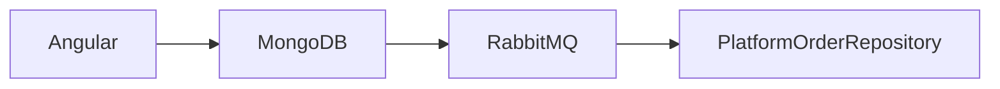

# Evidence Carrier Fixture

Business prose stays implementation neutral.

[Source: component/service/example]
**Evidence:** `Angular MongoDB RabbitMQ PlatformOrderRepository`
**IntegrationTest:** `AngularMongoRabbitFixture`

