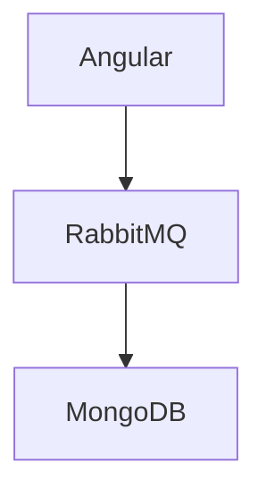

# Evidence Carriers

[Source: operation/accounts/CreateUser, event/accounts/UserSaved]
**Evidence:** `Angular RabbitMQ MongoDB PlatformOrderRepository`
**IntegrationTest:** `Angular RabbitMQ MongoDB`

