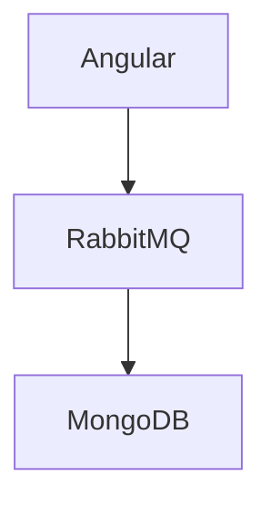

# Exclusions

<!-- sdd022-allow:start -->

Allowed migration note may mention Angular, RabbitMQ, and MongoDB.

<!-- sdd022-allow:end -->

This line has a clean `business-rule` code span.
sdd022-allow single-line note mentions PlatformOrderRepository and OAuth.

[Source: operation/accounts/CreateUser]
**Evidence:** `Angular RabbitMQ MongoDB`
