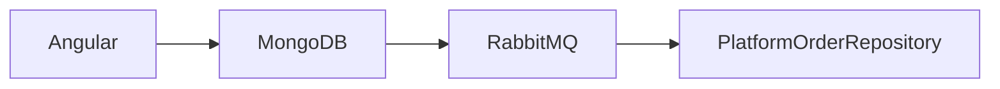

# Prose Leak Fixture

The operation persists each submission to MongoDB and RabbitMQ.

Validation runs through Angular before acceptance.

```gherkin
Given a RabbitMQ message arrives
Then the reviewer reads from MongoDB
```

LEAK_IDENTIFIER PlatformOrderRepository

[Source: component/service/example]
**Evidence:** `Angular MongoDB RabbitMQ PlatformOrderRepository`


