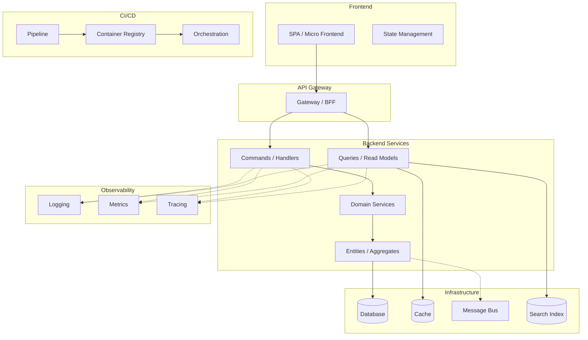

<!-- PROMPT-ENHANCE:STEP-TASK-ANCHOR:START -->

> **[BLOCKING]** Execute skill steps in declared order. NEVER skip, reorder, or merge steps without explicit user approval.
> **[BLOCKING]** Before each step or sub-skill call, update task tracking: set `in_progress` when step starts, set `completed` when step ends.
> **[BLOCKING]** Every completed/skipped step MUST include brief evidence or explicit skip reason.
> **[BLOCKING]** If Task tools are unavailable, create and maintain an equivalent step-by-step plan tracker with the same status transitions.

<!-- PROMPT-ENHANCE:STEP-TASK-ANCHOR:END -->

> **Architecture knowledge:** use universal laws, tactics, coupling/style trade-offs, anti-patterns, and judgment scripts; `— VERIFY` entries are hypotheses, so verify named sources (or project docs/primary sources for `[model-knowledge]`), while project-reference docs/accepted ADRs outrank conflicts.
> **MUST ATTENTION READ** `.claude/docs/architecture-knowledge.md` sections relevant to this design before recommending — why: it supplies portable reasoning, not binding project convention.
> **Foundation/scale/scenario catalogs:** derive Lifecycle/T/B/R plus runtime, T0–T3 and B0–B3 from evidence; use all seven foundation dimensions and applicability/stress matrices; unknowns use lower/assumed tiers, lean systems can PASS, and matrices are advice-only (never score/gate mutations).
> **MUST ATTENTION READ** `.claude/docs/engineering-foundation-catalog.md`, `.claude/docs/scale-technique-catalog.md`, and `.claude/docs/scenario-stress-catalog.md` before applying those gates — why: each catalog owns its profile, warranting, verdict, and drift boundary.
> **Routing/sequential/overlay protocols:** route specialized work to its matching agent; independent tasks use one-message PAR waves with all-return barriers; complex reasoning uses structured revision/branch/hypothesis checks; overlays resolve exact > glob > all, derive safe bodies, apply additively, and escalate equal-tier conflicts.
> **MUST ATTENTION READ** `.claude/skills/shared/sub-agent-selection-guide.md` and `.claude/skills/project-skill-protocol/references/registry.md` before using those protocols — why: these files own routing and overlay resolution.

## Quick Summary

**Goal:** Design and user-validate a complete, evidence-backed architecture decision package for all applicable backend/frontend, data, integration, deployment, observability, testing, quality, and dependency concerns—research ≥3 options, cite evidence + confidence for every recommendation, and emit ADR/Scaffold contracts—so implementation starts from sound, owned choices.
**Summary:**
- **Purpose:** fit architecture to workload, constraints, team, and risk while preserving upstream decisions and giving downstream steps an ADR-backed report plus Scaffold/Harness choices.
- **Decision gates:** choose Greenfield/Brownfield first; rank one-way doors; quantify workload/NFRs; choose ≤3 drivers + sacrifices; interrogate each irreversible choice, design it twice, then self-audit.
- **Evidence gates:** read project docs/ADRs; research ≥3 options per applicable concern; prescribe tactics before products; cite sources + confidence; complete the testability/execution matrix; get user confirmation; NEVER skip the Step-12 gate.
- **Ordered work:** 1 Context (+mode) → 2 Requirements (+workload/scaling, reversibility, NFRs, interrogation, validation) → 3A/3B backend styles/patterns → 3C data (when persistence/tenancy/consistency) → 3D integration (when a boundary exists) → 4 frontend → 4B UI (when UI exists) → 5 libraries → 6 testing → 7 delivery → 8 observability → 9 quality/Scaffold → 10 dependency risk → 11 report/ADRs → 12 AskUserQuestion user validation → Next Steps AskUserQuestion + independent council offer.

**Workflow (12 steps):**

1. **Load Context** — Read domain model, tech stack, business evaluation, refined PBI
2. **Derive Architecture Requirements** — Profile workload + ordered scaling ladder, rank reversibility, pick ≤3 driving attributes, quantify 6-part scenarios, run 2-2 pre-decision interrogation on every one-way door
3. **Backend Architecture** — 3A styles (selection procedure) · 3B design patterns · **3C data & consistency** · **3D integration & APIs**
4. **Frontend Architecture** — Research top 3 frontend architecture styles + design patterns
5. **Library Ecosystem Research** — Best-practice libraries per concern (validation, caching, logging, utils, etc.)
6. **Testing Architecture** — Unit, integration, E2E, performance testing frameworks + strategy
7. **CI/CD & Deployment** — Pipeline design, containerization, orchestration, IaC
8. **Observability & Monitoring** — Logging, metrics, tracing, alerting stack
9. **Code Quality & Clean Code** — Linters, analyzers, formatters, enforcement tooling
10. **Dependency Risk Assessment** — Package health, obsolescence risk, maintenance cost
11. **Generate Report** — Full architecture decision report with all recommendations
12. **User Validation** — Present findings, ask 8-12 questions, confirm all decisions

**Key Rules:**

- **MANDATORY IMPORTANT MUST ATTENTION** research minimum 3 options per architecture concern with web evidence
- **MANDATORY IMPORTANT MUST ATTENTION** include confidence % with evidence for every recommendation
- **MANDATORY IMPORTANT MUST ATTENTION** run user validation interview at end (never skip)
- Delegate to `solution-architect` agent for complex architecture decisions
- All claims must cite sources (URL, benchmark, case study, or codebase evidence)
- Base every recommendation on evidence, never on familiarity alone

**Be skeptical. Apply critical thinking, sequential thinking. Every claim needs traced proof, confidence percentages (Idea should be more than 80%).**

---

## Inputs & Handoffs (consume vs produce)

Skill sits mid-workflow: consume settled upstream decisions; produce named artifacts downstream steps need. NEVER re-derive upstream-owned decisions or leave consumers without their artifact — why: re-derivation wastes effort and risks divergence.

| Consumes (read, don't re-derive)                 | From                  | Produces (named deliverable)                                  | Consumed by                         |
| ------------------------------------------------ | --------------------- | ------------------------------------------------------------- | ----------------------------------- |
| Bounded contexts, aggregates, domain events, ERD | `domain-analysis`     | Architecture decision report (`{plan-dir}/research/...`)      | `plan`, `plan-execute`              |
| Confirmed languages/frameworks/databases         | `tech-stack-research` | Confirmed decisions (`{plan-dir}/phase-02b-architecture.md`)  | `plan`, `scaffold`                  |
| Expected scale, compliance, budget constraints   | `business-evaluation` | Scaffold Handoff table (tooling + fitness rules)             | `scaffold`, `harness-setup`         |
| Existing stack/patterns/ADRs (brownfield)        | reference docs, ADRs under the ADR root (default `docs/adr/**`; `docsRoots.adr.path` in `docs/project-config.json` overrides) | ADRs for hard-to-reverse decisions | `architecture-review` (conformance) |

If an upstream artifact is missing, capture its minimum needed input and record the gap; NEVER silently rerun full upstream analysis — why: silent reruns hide the gap the owning step must resolve.

---

## Step 1: Load Context

> **Mode (decide first):** **Greenfield** (new project, e.g. `workflow-greenfield-init`) → research every concern from scratch, 3+ options/concern. **Brownfield** (large feature in an existing codebase, e.g. `workflow-big-feature`) → FIRST read project-reference docs + accepted ADRs; constrain research to the existing stack/patterns; propose changes only where new requirements outgrow them. NEVER re-litigate a settled ADR without superseding-ADR rationale — why: re-deciding recorded choices churns code and breaks downstream conformance checks.

Read prior-step artifacts (search the plans root, default `plans/`, and the team-artifacts root, default `team-artifacts/`; `docsRoots.plans.path` / `docsRoots.teamArtifacts.path` in `docs/project-config.json` override these paths):

- Domain model / ERD (complexity, bounded contexts, aggregate count)
- Tech stack decisions (confirmed languages, frameworks, databases)
- Business evaluation (scale, constraints, compliance)
- Refined PBI (scope, acceptance criteria)
- Discovery interview (team skills, experience level)

Extract + summarize:

| Signal                  | Value        | Source           |
| ----------------------- | ------------ | ---------------- |
| Bounded contexts        | ...          | domain model     |
| Aggregate count         | ...          | domain model     |
| Cross-context events    | ...          | domain model     |
| Confirmed tech stack    | ...          | tech stack phase |
| Expected scale          | ...          | business eval    |
| Team architecture exp.  | ...          | discovery        |
| Compliance requirements | ...          | business eval    |
| Real-time needs         | Yes/No       | refined PBI      |
| Integration complexity  | Low/Med/High | domain model     |
| Deployment target       | ...          | business eval    |

---

## Step 2: Derive Architecture Requirements

### 2-0: Rank every decision by REVERSIBILITY (do this FIRST)

Architecture = the set of decisions **expensive to reverse**; everything cheap to reverse is design — leave it to implementers. Classify each decision BEFORE researching it, because the classification sets how much rigour it earns.

| Class | Meaning | Required treatment |
| --- | --- | --- |
| **One-way door** | Reversal costs a migration, a rewrite, or a breaking change to consumers | **ADR (Step 11) + user validation (Step 12) MANDATORY** — research 3+ options, name the rejected alternative AND the measurable revisit trigger |
| **Two-way door** | Reversal is a refactor inside one module | Decide, record one line, move on — NEVER burn a validation question on it |

**One-way doors (assume MANDATORY ADR unless proven otherwise):** data model + primary-key strategy · tenancy model · consistency model per read path · sync-vs-async at a boundary · public API/event contract · service boundary lines · cloud-primitive lock-in · auth/identity model · data residency + retention.

**MANDATORY IMPORTANT MUST ATTENTION** never treat a one-way door as a two-way door to save a step — why: an unreviewed irreversible decision is the single most expensive failure mode of this skill, and it surfaces months later as a migration.

Map signals to architecture constraints:

| Signal                      | Architecture Requirement                                  | Priority |
| --------------------------- | --------------------------------------------------------- | -------- |
| Many bounded contexts       | Clear module boundaries, context isolation                | Must     |
| High scale                  | Horizontal scaling, stateless services, caching strategy  | Must     |
| Complex domain              | Rich domain model, separation of domain from infra        | Must     |
| Cross-context events        | Event-driven communication, eventual consistency          | Must     |
| Small team                  | Low ceremony, fewer layers, convention over configuration | Should   |
| Compliance                  | Audit trail, immutable events, access control layers      | Must     |
| Real-time                   | Event sourcing or pub/sub, WebSocket/SSE support          | Should   |
| High integration complexity | Anti-corruption layers, adapter pattern, API gateway      | Should   |

### Quality-Attribute Scenarios (quantify — these drive the style choice)

Qualitative "Must/Should" cannot select a style (e.g. modular monolith vs microservices). Capture **measurable** targets; ask the user about unknowns via `AskUserQuestion` (assumptions require a label + confidence %). These targets become ADR budgets that `architecture-review` Category 9 checks against changes — why: style without numbers is guesswork, not an enforceable decision.

| Quality attribute     | Scenario (stimulus → measurable response)                             | Target (fill in) |
| --------------------- | -------------------------------------------------------------------- | ---------------- |
| Latency               | p95 / p99 response time for the hottest read and write paths         | e.g. p99 < 300ms |
| Throughput            | Sustained req/s and peak burst the system must absorb                | e.g. 500 rps peak |
| Availability / SLO    | Target uptime and error budget                                       | e.g. 99.9%       |
| Data durability (RPO) | Max acceptable data loss on failure                                  | e.g. ≤ 5 min     |
| Recovery (RTO)        | Max acceptable time to restore service                               | e.g. ≤ 30 min    |
| Data-volume growth    | Row/document/event growth → storage, index, partition strategy       | e.g. 10M rows/yr |
| Concurrency           | Concurrent users/sessions and contention hot spots                   | e.g. 2k concurrent |
| Compliance/retention  | Regulated data, retention window, residency, audit                   | e.g. GDPR, 7yr   |
| Cost unit economics   | `$/request`, `$/tenant`, `$/MAU` — and whether unit cost RISES with scale | e.g. <$0.002/req |

Scenario template — **all SIX parts, none optional**: `[SOURCE: who/what triggers] [STIMULUS: the event] on [ARTIFACT: which component] under [ENVIRONMENT: the conditions] SHALL produce [RESPONSE] within [MEASURE: threshold + instrument]`. "Must be scalable" decides nothing; "5,000 concurrent checkout sessions at 400 rps SHALL complete p99 < 800 ms, ≤0.1% errors, verified by the CI k6 profile" selects a structure.

**MUST ATTENTION** a scenario missing SOURCE or ARTIFACT is untestable — no fitness function can target "the system" under "load"; name actor + component — why: an unattributed scenario gets no owner, test, or budget, so it silently degrades.

**Rule:** any target left unknown is explicit `Unresolved question` (Step 11), NEVER a silent omission — an architecture chosen without scale numbers is a guess, not a decision.

### Workload Profile + Scaling Ladder (MANDATORY before technique selection)

Record `read:write ratio` · sustained/peak RPS or events/s · dominant query/write shapes · dataset size + growth · payload size · burst duration · hot-key/tenant skew · user regions · latency percentile targets · consistency/staleness tolerance. For each scaling component, name the measured bottleneck removed and next bottleneck created.

| Order | Use when evidence shows | First tactic | Purchase price |
| --- | --- | --- | --- |
| 1. Measure + tune | Baseline unknown or slow path unprofiled | Query/plan analysis, indexes, batching, pooling, compression | Engineering time; lowest reversibility cost |
| 2A. Vertical scale | One node remains simplest and headroom exists | More CPU/RAM/IOPS; tune runtime/database | Hardware ceiling; remaining SPOF without redundancy |
| 2B. Horizontal app scale | Availability or aggregate compute requires replicas and the path can be stateless | Replicas + redundant load balancing + health checks | Coordination, externalized state, deployment complexity |
| 4. Read-path scale | High read ratio or global read latency | Cache/CDN/read replicas/read models | Invalidation, lag, read-your-writes, cache-key correctness |
| 5. Write-path scale | Bursty ingest or heavy work need not finish inline | Batching, durable queue + workers; LSM store for sustained write-heavy known-query workloads | Accepted ≠ completed, retries/idempotency/backpressure; compaction/read amplification |
| 6. Partition/shard | Earlier rungs proven insufficient by capacity measurements | Query-aligned partition key + reshard plan | Cross-shard queries/transactions, hotspots, hard reversal |

**MANDATORY IMPORTANT MUST ATTENTION** NEVER jump to sharding, multi-region writes, or an extra datastore without evidence that earlier rungs cannot meet the quantified target — why: these are hard-to-reverse operational systems, not generic performance upgrades.

**Move each attribute with a TACTIC, not a product.** Once a target is unmet or at risk, select the mechanism from the tactics inventory in `.claude/docs/architecture-knowledge.md` §2 (availability · performance · modifiability · security · testability · usability) — "bulkhead a pool per dependency" is a design decision; "add Kubernetes" is a shopping list. — why: the tactic is portable across stacks and makes the trade-off legible, the product imports costs nobody asked for.

### 2-1: Pick ≤3 DRIVING attributes — and name what you SACRIFICE

Quality attributes CONFLICT, and that conflict IS the architecture: consistency↔availability · latency↔durability · flexibility↔simplicity · security↔usability · cost↔redundancy · performance↔modifiability.

**MANDATORY IMPORTANT MUST ATTENTION** name at most 3 DRIVING attributes and explicitly record which attributes are being SACRIFICED to buy them — a design claiming to maximize everything has decided nothing — why: unnamed sacrifices resurface as production surprises nobody agreed to.

| Field | Record |
| --- | --- |
| Driving attributes (≤3) | ... + the quantified target for each (from the table above) |
| Explicitly sacrificed | ... + the acceptable degradation, e.g. "search may lag ≤5 s" |
| Trade-off purchased | Use the "buy this / pay with this" table in `.claude/docs/architecture-knowledge.md` §19 — state cost, never just benefit |

**Availability arithmetic (compute it, never assert it):** dependencies in a request path MULTIPLY — five 99.9% deps ⇒ ~99.5% (≈43 h/yr down). Redundancy in PARALLEL adds 9s **only when failure modes are genuinely independent**; shared config, control plane, DNS and the deploy pipeline are the usual hidden serial term. Ladder: 99% = 3.65 d/yr · 99.9% = 8.77 h · 99.95% = 4.38 h · 99.99% = 52.6 min · 99.999% = 5.26 min.

**Cost is a quality attribute, not a later phase.** Model unit economics now: architecture whose UNIT cost RISES with scale eventually fails, regardless of elegance. Major web drivers: egress + cross-AZ/cross-region traffic · idle over-provisioned compute · unbounded log/metric/trace retention/cardinality · per-request managed-service pricing at steady high volume · always-on non-prod. Serverless vs always-on **inverts with utilization** — model, never assume.

**MANDATORY IMPORTANT MUST ATTENTION** validate derived requirements with user via `AskUserQuestion` before proceeding.

### 2-2: Pre-Decision Interrogation (MANDATORY for every one-way door from 2-0)

Answer the 15-question pre-decision script in `.claude/docs/architecture-knowledge.md` §20.1 for each one-way door BEFORE researching options. Record answers in the Step 11 report; each "unknown" becomes an `Unresolved question`, never a silent gap.

The five that most often expose a wrong decision — never skip these:

| # | Question | Why it changes the answer |
| --- | --- | --- |
| 3 | Is this a one-way or two-way door, and what makes it so? | Sets how much rigour the decision earns; misclassification is this skill's most expensive failure |
| 5-6 | Expected load NOW and at 10× — and **what breaks FIRST**? | Names the actual bottleneck instead of the imagined one; 10×, never 1000× |
| 8 | What is the consistency requirement PER read path, and what staleness is acceptable? | Consistency is decided per path, never once globally |
| 14 | What existing thing could be used instead of building? | Generic subdomains (auth, billing, notifications, search) are the top source of wasted architecture budget |
| 15 | **What would have to be TRUE for this to be the WRONG choice — and how would I detect it?** | Becomes the ADR's measurable revisit trigger |

**MANDATORY IMPORTANT MUST ATTENTION** a one-way door with no answer to question 15 is a BELIEF, not a decision — NEVER emit its ADR without a named falsifier and a measurable revisit trigger. — why: with no trigger nobody ever revisits it, so the decision outlives the constraints that justified it.

### Architecture & Scalability Scorecard Inputs (feeds `architecture-scalability-review`)

Record these decisions so init-time `architecture-scalability-review` (`mode=init`) can grade **enforceable mechanisms, not intent**. Each row is a **design decision**, not a finding: capture the choice AND enforcement location. Unknowns become explicit `Unresolved question` (Step 11), never silent omissions — why: a scorecard can grade only decisions with an enforcement home.

| Scorecard input | Design prompt (decide + record where enforced) | Enforcement handoff |
| --------------- | ---------------------------------------------- | ------------------- |
| Build & CI scalability | As the codebase grows, how are build/CI times kept bounded? Decide **incremental** builds, changed/**affected**-only detection, local + **remote cache** strategy, and CI test/build parallelism. Name the build-system fit (single-package vs monorepo tool such as Nx / Turborepo / Bazel) **as an evaluated option**, not a default. | Step 7 (CI/CD provider parallelism + caching) |
| Horizontal scaling budgets | From the Step 2 scale targets, decide **stateless** app nodes, load balancing, caching tiers, async/queue + back-pressure, DB scale plan (sharding/partitioning/replication), connection pooling, rate limits, and a **SPOF** scan of every single-instance dependency. | ADR + Step 8 observability SLOs |
| Strategic DRY | Decide the **strategic DRY** / shared-knowledge strategy: monorepo, shared domain lib, custom platform / util lib — AND explicitly when NOT to share. Keep domain concepts OUT of generic/shared/infra layers (a shared layer coupled to one consumer's domain is no longer reusable). | Step 9 arch-rules + `scaffold` foundation |
| Dependency-boundary enforcement | Decide explicit dependency directions between modules/contexts and the mechanism that enforces them (no circular deps). | Step 9 "Arch rules / fitness" handoff → `linter-setup` |

`architecture-scalability-review` grades these inputs at init/audit; `architecture-review` catches per-change regressions. Do NOT turn this step into an auditor: record decisions here and route grading to those skills.

---

## Step 3: Backend Architecture

### 3A: Architecture Styles

WebSearch top 3 backend architecture styles. Candidates:

| Style                       | Best For                                 | Research Focus                            |
| --------------------------- | ---------------------------------------- | ----------------------------------------- |
| **Clean Architecture**      | Complex domains, long-lived projects     | Dependency rule, testability, flexibility |
| **Hexagonal (Ports+Adapt)** | Integration-heavy, multiple I/O adapters | Port contracts, adapter isolation         |
| **Vertical Slice**          | Feature-focused teams, rapid delivery    | Slice isolation, code locality            |
| **Modular Monolith**        | Starting simple, eventual decomposition  | Module boundaries, migration path         |
| **Microservices**           | Large teams, independent deployment      | Service boundaries, operational overhead  |
| **CQRS + Event Sourcing**   | Audit-heavy, complex queries             | Read/write separation, event store        |
| **Layered (N-Tier)**        | Simple CRUD, small teams                 | Layer responsibilities, coupling risk     |

Full 16-style matrix (*buys / costs / choose-when / avoid-when*) → `.claude/docs/architecture-knowledge.md` §5.

#### Style selection procedure (MANDATORY order — never shortcut)

1. Take the ≤3 quantified driving attributes from Step 2-1.
2. **ELIMINATE** every style that cannot meet them (state which attribute eliminated it).
3. **DESIGN IT TWICE** — produce ≥2 MATERIALLY different surviving candidate designs (not two spellings of one idea) and write what each SACRIFICES. — why: committing to the first idea that occurred to you is the most common architecture failure and the one nobody records; a second real candidate is what makes the first one a choice.
4. Among survivors take the **SIMPLEST** — not the most capable.
5. Emit an ADR (Step 11) naming the rejected alternative AND the **measurable trigger** that would revisit the choice.

**MANDATORY IMPORTANT MUST ATTENTION** design-it-twice applies to EVERY one-way door from 2-0, not only the style choice — data model, tenancy model, consistency model per read path, sync-vs-async at a boundary. NEVER emit a one-way-door ADR whose "Alternatives considered" section was written to justify a decision already made. — why: a retrofitted alternative is advocacy, not evaluation, and it hides the sacrifice the reviewer needs to see.

Styles COMPOSE when their responsibilities fit together—for example, a modular application may use asynchronous integration at selected boundaries. Do not prescribe a service count or combination in advance; select each boundary from workload, consistency, ownership, deployment, and operational evidence.

**Greenfield default, when it fits:** For a new business application with one release boundary and no measured need for independent deployment, scaling, compliance, availability, or runtime, prefer a modular monolith. Give important modules explicit contracts and dependency direction; add automated boundary checks when the chosen stack can enforce them economically. This is a starting hypothesis, not a framework mandate: record the evidence when another architecture is a better fit. For brownfield work, follow the existing architecture and accepted ADRs unless a requirement justifies an explicitly reviewed migration. An existing service platform, independently operated capabilities, serverless/event workloads, or other deployment constraints may justify starting with distributed components.

| Evidence that may justify a separate deployable boundary | Weak justification by itself |
| --- | --- |
| Repeated, measured scaling or resource profiles that materially diverge | "The codebase feels big" |
| A distinct compliance, data-residency, availability, or fault-isolation boundary | "Microservices are best practice" |
| Independent ownership/release is blocked by a shared deploy and the coordination cost is evidenced | A resume, a conference talk, or framework support |
| A genuinely different runtime or platform requirement | A new team was hired |
| A bounded capability has an explicit contract and can tolerate its data/consistency boundary | The domain has many entities |

Before recommending a distributed design, assess the operating model that would support it: deployment automation, infrastructure management, observability/tracing, incident ownership, and recovery practices. Missing capabilities are risks and migration work to name; they do not automatically disqualify a design required by the workload or platform.

**MUST ATTENTION** draw boundaries around **capabilities/behaviors** (`Checkout`, `Fulfilment`, `Pricing`), NEVER around **nouns/data** (`UserService`, `ProductService`). Entity-per-service guarantees every real use case must synchronously traverse many services — a distributed monolith produced by design. The unit of extraction is the **bounded context**, not the entity.

### 3B: Backend Design Patterns

Evaluate applicability per layer:

| Pattern             | Concern / boundary | When to consider it                                                                 |
| ------------------- | ------------------ | ----------------------------------------------------------------------------------- |
| **Repository**      | Persistence        | A useful domain/query contract, test seam, or persistence-change boundary exists   |
| **CQRS**            | Read/write paths   | Read and write models have materially different needs                              |
| **Mediator**        | In-process dispatch| The project uses this idiom or it removes real caller/handler coupling              |
| **Strategy**        | Variable behavior  | Multiple real algorithms must be selected or replaced                              |
| **Observer/Events** | Reactions          | Independent reactions or async decoupling are valuable and their failure model is owned |
| **Factory**         | Construction       | Creation enforces meaningful invariants or hides non-trivial assembly               |
| **Decorator**       | Cross-cutting      | A capability can be composed around an implementation without hiding behavior       |
| **Adapter**         | External boundary  | An external dependency or protocol needs translation or isolation                    |
| **Specification**   | Business/query rules | Rules genuinely compose or need a named, reusable query contract                  |
| **Unit of Work**    | Transactions       | A use case must coordinate a transaction across persistence operations              |
| **Saga/Orchestr.**  | Distributed work   | A business process spans owners and has explicit compensation/recovery semantics   |
| **Outbox**          | Durable messaging  | A committed database change and durable message publication must agree atomically  |
| **Circuit Breaker** | Remote dependency  | A failing/slow dependency needs bounded calls and recovery behavior                 |

For each recommended pattern, document **Apply to**, **Why**, **Example**, and **Risk if skipped**.

**MUST ATTENTION** patterns are a VOCABULARY for a solution you already need, never a menu to shop from — applying patterns to demonstrate knowledge produces the *gas factory* anti-pattern. The right number of patterns is the SMALLEST number that removes a DEMONSTRATED pain. Watch the chronically over-applied ones: Singleton (global mutable state → prefer one DI registration), Service Locator (hides dependencies from compiler and tests), CQRS on simple CRUD, event sourcing used as an audit log (an audit table is the right answer).

**Purpose-oriented abstraction naming gate:** Name ports, interfaces, modules, APIs, and adapters by the capability or domain contract consumers rely on; keep provider, SDK, framework, database, and transport details on concrete implementations (`IStorage`/`Storage` → `AzureBlobStorage`). Check the proposed name against callers and all implementations, use a narrower name when the contract is narrower, preserve local interface syntax, and require an evidenced boundary/substitution need before adding an abstraction.

---

## Step 3C: Data & Consistency Architecture

> **Skip if:** no persisted state, consistency boundary, or tenant-scoped data. Otherwise evaluate applicable decisions; a row for another storage model is `NOT-APPLICABLE`, not an implementation mandate.

Data can outlive services and teams, so assess reversibility and migration cost carefully. Rank each decision using Step 2-0: high-cost choices need an ADR and Step-12 validation; ordinary or reversible choices need only the evidence and brief record useful to the project.

| Decision | Decide + record | Failure if skipped |
| --- | --- | --- |
| **Store per access pattern** | Pick each store from the ACCESS PATTERN, consistency needs, operating model, and team capability: relational (relations/transactions/flexible queries — a strong default when these matter) · document (aggregate-shaped reads) · key-value (lookup/session) · wide-column (high-volume writes with known query shapes) · graph (traversal) · time-series (append + rollups) · search (relevance/facets) · vector (semantic/ANN) · columnar (aggregation scans) · object storage (blobs). Justify each additional store against its operational and consistency costs. | Golden-hammer: the wrong store makes dominant operations expensive or hard to evolve |
| **Data ownership** | Name the owner and write contract for each important dataset. At independent service boundaries, prefer one owning writer and explicit read contracts; inside one application, shared physical storage is acceptable when module ownership/access are explicit. | Hidden multi-writer ownership makes invariants and change impact unclear |
| **Persistence boundary** | Across independently operated services, prefer an explicit API/event/data contract over direct mutation of another service's private tables. Within a monolith, follow its chosen module and persistence rules; a shared database is not itself a violation. | Private-table coupling makes independent change or deployment unsafe |
| **Consistency model per read path** | Per read path choose strong / causal / **session guarantees** (read-your-writes, monotonic reads) / eventual — and write the **STALENESS BUDGET** ("search index may lag ≤5 s") as a monitored SLI (Step 8). | Unbounded, unmeasured lag IS the defect. Most user-visible "consistency bugs" are missing read-your-writes from a lagging replica, NOT missing linearizability |
| **Replication + failover semantics** | Name topology (single-primary/read replicas, quorum, or multi-primary), write acknowledgement, sync vs async replicas, failover authority, conflict policy, and RPO/RTO. Route lag-sensitive/read-after-write reads to the primary or use a version/sticky-read guarantee. | Replicas improve read capacity/availability, not write capacity; async failover can lose acknowledged writes, sync raises latency/lowers availability, multi-primary creates conflicts |
| **Transactional isolation + invariant protection** | For relational transactions on critical write paths, verify the selected engine's actual isolation guarantees and protect each check-then-act invariant with an appropriate constraint, lock, serializable retry, or atomic conditional write. For other stores, use the equivalent conditional-write, version, compare-and-set, or transaction contract. Do not prescribe SQL isolation to a non-relational store. Full relational anomaly discussion → `.claude/docs/architecture-knowledge.md` §8. | Concurrency assumptions can corrupt state or silently lose updates |
| **Storage engine + index strategy** | For relational stores, choose engine/index structures from measured access patterns; confirm plans, write costs, durability settings, and pool limits against that engine. For other stores, inspect their partition/index/query model and consistency/latency costs. | A storage configuration mismatched to dominant operations makes them expensive or unreliable |
| **Storage substrate** | Block storage for database/filesystem volumes needing low-latency random I/O · object storage for blobs/media/backups/log archives and cheap durable scale · shared file storage only when filesystem semantics are required. Record lifecycle tiering, access frequency, object size, durability, egress and mutation pattern. | "User data uses block storage" confuses application model with physical substrate; large immutable blobs in the transactional database inflate backup, replication and query costs |
| **Distributed lock / leader election — fencing** | If any flow takes a distributed lock or elects a leader, name the **fencing token** (monotonic, rejected by the storage layer when stale), the lease duration, and the behaviour when the lease expires mid-operation. Consensus (Raft/Paxos) needs a MAJORITY — a 2-node or even-sized cluster buys nothing — and stays OFF the hot path. **NEVER order distributed events, compute expiry, or resolve conflicts by wall clock** — use versions/sequences, logical/vector clocks, or HLC. | An unfenced lock fails exactly once — under a GC/VM pause, at peak, writing corrupted state — and looks correct in every test (split brain) |
| **Transaction / consistency boundary** | Define the smallest boundary that can enforce each invariant. If using DDD aggregates, keep their invariants and transaction scope cohesive; across owners, choose synchronous coordination or an eventual workflow with explicit user-visible recovery. | Boundaries that are too broad increase contention; boundaries that are too narrow cannot protect invariants |
| **Cross-boundary transaction mechanism** | When one business outcome spans independently committed owners, compare local transaction, saga/compensation, reservation/TCC, or supported distributed transaction options against the consistency and recovery requirement. Compensations are business decisions, not generic rollbacks. | Partial completion becomes an undocumented or unrecoverable business state |
| **Tenancy model** | Only for multi-tenant products: compare shared, schema/database-per-tenant, or hybrid isolation using threat, compliance, scale, operations, and cost requirements. Shared schema with database enforcement is a common SaaS option when the chosen store supports it, not a universal default. | A late tenancy decision may force a major migration or leave isolation requirements unmet |
| **Tenant isolation ENFORCEMENT** | In a pooled model, name the LOWEST-layer mechanism: database **row-level security**, an ORM global filter/interceptor, or a mandatory repository base injecting tenant from the **authenticated principal** — plus a test asserting cross-tenant reads return zero rows (Step 6 + Step 9 fitness rule). **NEVER take `tenant_id` from a client-supplied field.** | One missing `WHERE tenant_id = ?` is a cross-tenant breach that passes every functional test |
| **Keys & partitioning** | Choose identifiers and partition keys for the project's store, access patterns, security, ordering, and migration needs. Do not expose enumerable identifiers where that leaks sensitive information; choose ordered IDs only when they improve the selected store's workload. Partitioning is warranted by measured volume/hotspots, not by scale speculation. | Hot partitions, public enumeration, or premature complexity |
| **Operational and analytical workloads** | If analytical queries threaten interactive/transactional workloads, isolate them through a replica, CDC, warehouse, or another measured design. A small system may safely share a store until evidence warrants separation. | Reports may contend with production traffic or an unnecessary second platform adds cost |
| **Denormalization / caching as a PURCHASE** | For each copy/cache, name authoritative source · policy (cache-aside/read-through/write-through/write-behind/refresh-ahead) · invalidation (TTL+jitter/event/versioned key/purge) · consistency window · max size/eviction. Design stampede/hot-key/cold-start protection (single-flight, early refresh, warm-up, LB slow-start). **NEVER cache authorization decisions or tenant data under a key omitting identity/tenant/permission.** | Stale data, stampedes and hot keys move rather than remove load; cache-key omission leaks tenants; an unbounded cache OOMs; a system correct only while cache is warm has made an undocumented source of truth |
| **Migration strategy** | For rolling/overlapping deployments, prefer compatible expand–contract steps and safe retries. For coordinated downtime or disposable data, choose a simpler migration if its rollback and recovery story is sound. Check lock duration and backfill impact on large stores. | An incompatible migration can break old/new versions during rollout or make rollback unsafe |
| **Lifecycle: classification, retention, residency, deletion** | Classify (PII/PHI/PCI/public), set retention + archival tiering + deletion (GDPR/CCPA erasure) + residency NOW. | Retrofitting deletion into an event-sourced or heavily-denormalized system is brutally expensive — and erasure conflicts with immutable event stores by design |
| **RPO / RTO per dataset** | Set them PER DATASET (they drive topology and cost) and schedule a **restore drill**. | "We have backups" is a hypothesis; an undrilled DR plan has an RTO of "unknown" |

For each applicable data decision, use Step 2-0 to decide whether an ADR/user validation is warranted. Store, tenancy, consistency, or key choices are one-way doors only when the actual migration or compatibility cost makes them hard to reverse; do not invent tenant, relational, or sharding architecture when the project does not need it.

---

## Step 3D: Integration & API Architecture

> **Skip if:** no boundary is crossed — no external consumer, second service, message bus, or third-party integration. Otherwise MANDATORY.

| Decision | Decide + record | Failure if skipped |
| --- | --- | --- |
| **Sync vs async per boundary** | **Synchronous** only when the caller genuinely cannot proceed without the answer (user-awaited QUERIES). **Asynchronous** for EFFECTS (notification, fan-out, work completable later). A sync chain deeper than 2-3 hops is an availability + latency defect — flatten, cache, or make it an event. | Sync chains MULTIPLY availability (five 99.9% deps ⇒ 99.5%) and SUM latency |
| **Async acceptance contract** | When work moves behind a queue, define the public state machine: `accepted` (`202`/job ID) → pending/running/succeeded/failed/cancelled; status lookup or callback; retry visibility; terminal failure ownership. User feedback MUST say accepted, not completed. | Fast acknowledgement without completion semantics creates false success, invisible backlog, and unrecoverable business ambiguity |
| **API style per consumer** | REST/HTTP+JSON (public, broad compat, HTTP caching) · GraphQL (client-driven queries, aggregation — needs depth/complexity limits + persisted queries + dataloader or it becomes a DoS and N+1 surface) · gRPC (low-latency internal, streaming, codegen) · webhooks (push to third parties — needs retries + signature verification) · WebSocket/SSE (real-time; SSE when one-way suffices). | Wrong style makes the dominant interaction chatty or uncacheable |
| **Versioning + deprecation policy** | For independently released APIs with external or independently deployed consumers, define compatibility/versioning and deprecation from the first contract. Version the contract, not every field; select URL/header/schema versioning and support windows from consumer needs. A lockstep internal interface may need compatibility tests without a public version scheme. | Unplanned contract changes can break consumers and make usage hard to discover |
| **Contract-first + contract tests in CI** | For independently deployed producers/consumers, choose a contract format that fits the protocol (for example OpenAPI, protobuf, or AsyncAPI) and test compatibility in CI. Use the project's actual schema/contract tooling; do not add consumer-driven tooling to a lockstep boundary without a need. | Without a visible contract and compatibility check, independent releases can break consumers |
| **Write-then-publish consistency** | When durable publication must agree atomically with a database transaction, use a transactional outbox, CDC, or a supported equivalent; do not use two uncoordinated writes for that guarantee. A best-effort local notification can use a simpler contract. | A partial failure can leave stored state and downstream messages inconsistent |
| **Retry, deduplication, and idempotency** | For operations that may be retried, repeated, or delivered at least once, define idempotency keys, deduplication, or naturally idempotent state transitions. Scope key/result retention to the actual retry contract; use versions/sequences if ordering matters. | Retries or duplicates can repeat externally visible side effects |
| **Message taxonomy — never conflate** | **Command** ("do this", one handler, may be rejected) vs **Event/fact** ("this happened", 0..N subscribers, cannot be rejected) vs query vs document message. An "event" with exactly one permitted consumer that MUST handle it, whose failure means the flow failed, is a **COMMAND in an event costume** — name it a command and own the coupling honestly. | You pay async debugging difficulty AND keep sync coupling |
| **Event granularity per stream** | Deliberate choice: thin/notification (ID only — restores temporal coupling + read load) vs fat/state-transfer (self-contained, leaks more model, bigger payloads) vs hybrid (thin event + queryable snapshot endpoint). **NEVER leak raw DB rows as events** — CDC without a mapping layer publishes your internal schema as a frozen public contract (Hyrum). | Consumers become coupled to columns you can then never rename |
| **Schema evolution** | Versioned, registered, backward-compatible event schemas with a CI compatibility check. In event sourcing, event schemas are public contracts **forever**. | One producer change silently breaks every consumer |
| **Broker semantics — ordering, replay, durability** | Decide the three properties BEFORE naming a vendor: required **ordering scope** (global / per-entity-key / none) · required **replay window** (queue = consume-and-gone; log = offset-based replay by many consumer groups) · **durability acknowledgement** (replication factor + min-in-sync-replicas + producer acks — `acks=1` accepts data loss on leader failure, and `acks=all` waits for the replicas CURRENTLY in the ISR — so `min.insync=1` still waits for a healthy 3-replica ISR but silently degrades to `acks=1` durability once the ISR shrinks to the leader alone). Log partition count is hard to raise without rekeying, and ordering on a key costs parallelism on that key. Health SLI: queue depth + oldest-message age, or **consumer lag** for a log. | Vendor picked first ⇒ the one property you actually needed (ordering, replay, or durability) turns out to be the one that is expensive to change |
| **Load balancing + rate limiting** | When the deployment or threat model needs them, choose from measured request cost, burst shape, affinity, protected resource, and availability targets. For rate limits, select token bucket, sliding window, or concurrency/in-flight limits to fit the policy; define the protected identity/dimension and distributed-counter trade-off. | A mismatched algorithm can overload a resource or block legitimate work; unnecessary infrastructure adds latency and failure modes |
| **Queue hygiene** | **Bounded** queues + DLQ + a redrive procedure + DLQ-depth alerting; capped exponential backoff **with jitter**; poison-message handling. | An unbounded queue converts a throughput problem into unbounded latency then OOM; a DLQ nobody watches is data loss with extra steps; unjittered retries synchronize into a thundering herd |
| **Resilience config on EVERY outbound call** | Timeout (derived from the caller's remaining budget) on every network call, lock and query · capped jittered retries for idempotent ops ONLY · retry BUDGET as a % of traffic · circuit breaker with a defined fallback · bulkheads per dependency/tenant · load shedding at the edge by priority. | **A missing timeout is the single most common resilience defect**; retry amplification turns a blip into an outage. The dangerous failure is SLOW, not down — it exhausts your resources while looking healthy |
| **Graceful degradation per feature** | Pre-decide the degraded mode per feature (stale data / hide module / read-only) — a PRODUCT decision, made now, not during the incident. | Undesigned degradation becomes a total outage |
| **Trust boundary rules** | Validate at the boundary (allow-list); **NEVER trust client-supplied authorization data** — IDs, roles, prices, tenant IDs come from the authenticated principal. Machine-readable error contract (stable `code`, `message`, `details`, `traceId`; RFC 9457 problem+json is a good default) — NEVER leak stack traces. Propagate a correlation/trace ID through EVERY hop including async. | Broken access control is the #1 real-world risk; untraceable async hops make incidents unexplainable |
| **Edge component responsibilities** | Gateway = TLS, routing, authn, rate limiting, quotas, versioning — **NEVER business logic**. CDN/edge = static + deliberately cacheable dynamic content; record push/pull origin strategy, `Cache-Control`, `Vary`/cache-key dimensions, TTL and purge/versioning. BFF only when a client genuinely needs owned aggregation; skip with one client or when GraphQL fills the role. | Smart gateways duplicate domain rules; careless edge caching serves stale or personalized data to the wrong audience; missing cache policy shifts global latency/load back to origin |

**MANDATORY IMPORTANT MUST ATTENTION** every sync-vs-async choice at a boundary and every public API/event contract is a one-way door — ADR + Step-12 validation, no exceptions — why: consumers you cannot see will depend on both, and Hyrum's Law makes every observable behavior a contract you must then keep.

---

## Step 4: Frontend Architecture

### 4A: Architecture Styles

WebSearch top 3 frontend architecture styles. Candidates:

| Style                       | Best For                                    | Research Focus                            |
| --------------------------- | ------------------------------------------- | ----------------------------------------- |
| **MVVM**                    | Data-binding heavy, forms-over-data apps    | ViewModel responsibility, two-way binding |
| **MVC**                     | Server-rendered, traditional web apps       | Controller routing, view separation       |
| **Component Architecture**  | Configured SPA/component framework          | Component isolation, props/events, reuse  |
| **Reactive Store (Redux)**  | Complex state, multi-component sync         | Single source of truth, immutable state   |
| **Signal-based Reactivity** | Fine-grained reactivity in frameworks that support signals | Granular updates without broad change detection |
| **Micro Frontends**         | Multiple teams, independent deployment      | Module federation, routing, shared state  |
| **Feature-based Modules**   | Large monolith SPA, lazy loading            | Feature boundaries, route-level splitting |
| **Server Components (RSC)** | SEO, initial load performance               | Server/client boundary, streaming         |

### 4B: Frontend Design Patterns

| Pattern                      | Layer       | When to Apply                                    |
| ---------------------------- | ----------- | ------------------------------------------------ |
| **Container/Presentational** | Component   | Separate logic from UI rendering                 |
| **Reactive Store**           | State       | Centralized state, cross-component communication |
| **Facade Service**           | Service     | Simplify complex API interactions                |
| **Adapter/Mapper**           | Data        | Transform API response to view model             |
| **Observer (RxJS)**          | Async       | Event streams, real-time data, debounce/throttle |
| **Strategy (renderers)**     | UI          | Conditional rendering strategies per entity type |
| **Composite (components)**   | UI          | Tree structures, recursive components            |
| **Command (undo/redo)**      | UX          | Form wizards, canvas editors, undoable actions   |
| **Lazy Loading**             | Performance | Route/module-level code splitting                |
| **Virtual Scrolling**        | Performance | Large lists, infinite scroll                     |

---

## Step 4B: UI System Architecture

> **Skip if:** Backend-only project, no frontend component.

Research and recommend design-system architecture; ask the user each decision via `AskUserQuestion`.

### 4B-1: Styling Approach

WebSearch top 3 styling approaches for confirmed frontend framework:

| Approach                         | Best For                                 | Research Focus                     |
| -------------------------------- | ---------------------------------------- | ---------------------------------- |
| **Utility-first (Tailwind CSS)** | Rapid prototyping, design enforcement    | JIT, custom config, design tokens  |
| **CSS Modules / Scoped CSS**     | Component isolation, no global conflicts | Naming, composition patterns       |
| **SCSS/SASS with BEM**           | Complex theming, token variables         | BEM methodology, mixin libraries   |
| **CSS-in-JS**                    | Dynamic styling, theme providers         | Runtime perf, SSR support          |
| **CSS Custom Properties**        | Native theming, framework-agnostic       | Browser support, fallback strategy |

### 4B-2: Design Token Strategy

| Decision         | Options                                                   | Default               |
| ---------------- | --------------------------------------------------------- | --------------------- |
| Token format     | CSS custom properties / JSON / SCSS variables             | CSS custom properties |
| Token categories | Color, spacing, typography, breakpoints, shadows, z-index | All                   |
| Token naming     | Semantic (`--color-primary`) vs Functional (`--btn-bg`)   | Semantic first        |
| Theming          | Light/dark toggle / Multi-brand / Single theme            | Single + dark mode    |

### 4B-3: Component Library Strategy

| Decision        | Options                                                                     | Default                    |
| --------------- | --------------------------------------------------------------------------- | -------------------------- |
| Library         | Build custom / Headless (Radix, Headless UI) / Full kit (MUI, Ant, PrimeNG) | Based on team and timeline |
| Component tiers | Common → Domain-Shared → Page (per ui-wireframe-protocol)                   | Standard 3-tier            |
| Documentation   | Storybook / Docusaurus / In-code only                                       | Based on team size         |

### 4B-4: Responsive Strategy

| Decision    | Options                                 | Default            |
| ----------- | --------------------------------------- | ------------------ |
| Approach    | Mobile-first / Desktop-first / Adaptive | Mobile-first       |
| Breakpoints | 320/768/1024/1280 / Custom              | Standard           |
| Grid system | CSS Grid / Flexbox / Framework grid     | CSS Grid + Flexbox |

**MANDATORY IMPORTANT MUST ATTENTION** validate all UI system decisions with user via `AskUserQuestion` before proceeding to Step 5.

---

## Step 5: Library Ecosystem Research

For each concern below, WebSearch top 3 library options for the confirmed stack. Evaluate maturity, community, bundle size, maintenance, license, and learning curve.

> **MUST ATTENTION** never recommend a library from familiarity alone — every pick needs cited evidence (stars, release date, downloads, CVE scan). — why: familiarity bias ships unmaintained or insecure dependencies.

### Library Concerns Checklist

| Concern                     | What to Research                                            | Evaluation Criteria                            |
| --------------------------- | ----------------------------------------------------------- | ---------------------------------------------- |
| **Validation**              | Input validation, schema validation, form validation        | Type safety, composability, error messages     |
| **HTTP Client / API Layer** | REST client, GraphQL client, API code generation            | Interceptors, retry, caching, type generation  |
| **State Management**        | Global store, local state, server state caching             | DevTools, SSR support, bundle size             |
| **Utilities / Helpers**     | Date/time, collections, deep clone, string manipulation     | Tree-shakability, size, native alternatives    |
| **Caching**                 | In-memory cache, distributed cache, HTTP cache, query cache | TTL, invalidation, persistence                 |
| **Logging**                 | Structured logging, log levels, log aggregation             | Structured output, transports, performance     |
| **Error Handling**          | Global error boundary, error tracking, crash reporting      | Source maps, breadcrumbs, alerting integration |
| **Authentication / AuthZ**  | JWT, OAuth, RBAC/ABAC, session management                   | Standards compliance, SSO, token refresh       |
| **File Upload / Storage**   | Multipart upload, cloud storage SDK, image processing       | Streaming, resumable, size limits              |
| **Real-time**               | WebSocket, SSE, SignalR, Socket.io                          | Reconnection, scaling, protocol support        |
| **Internationalization**    | i18n, l10n, pluralization, date/number formatting           | ICU support, lazy loading, extraction tools    |
| **PDF / Export**            | PDF generation, Excel export, CSV                           | Server-side vs client-side, template support   |

### Per-Library Evaluation Template

```markdown
### {Concern}: Top 3 Options

| Criteria         | Option A          | Option B | Option C |
| ---------------- | ----------------- | -------- | -------- |
| GitHub Stars     | ...               | ...      | ...      |
| Last Release     | ...               | ...      | ...      |
| Bundle Size      | ...               | ...      | ...      |
| Weekly Downloads | ...               | ...      | ...      |
| License          | ...               | ...      | ...      |
| Maintenance      | Active/Slow/Stale | ...      | ...      |
| Learning Curve   | Low/Med/High      | ...      | ...      |

**Recommendation:** {Option} — Confidence: {X}%
```

---

## Step 6: Testing Architecture

Research testing tools and strategy for the confirmed stack:

| Testing Layer           | What to Research                                  | Top Candidates to Compare                    |
| ----------------------- | ------------------------------------------------- | -------------------------------------------- |
| **Unit Testing**        | Test runner, assertion library, mocking framework | Repository's configured unit-test stack       |
| **Integration Testing** | API testing, DB testing, service testing          | Supertest, TestContainers, WebAppFactory     |
| **E2E Testing**         | Browser automation, BDD, visual regression        | Playwright/Cypress/Selenium, SpecFlow        |
| **Performance Testing** | Load testing, stress testing, benchmarking        | k6/Artillery/JMeter/NBomber, BenchmarkDotNet |
| **Contract Testing**    | API contract validation between services          | Pact, Dredd, Spectral                        |
| **Mutation Testing**    | Test quality validation                           | Stryker, PITest                              |
| **Coverage**            | Code coverage collection, reporting, enforcement  | Istanbul/Coverlet, SonarQube                 |
| **Test Data**           | Factories, fixtures, seeders, fakers              | Bogus/AutoFixture/Faker.js                   |

### Test Strategy Template

```markdown
### Test Pyramid

- **Unit (70%):** {framework} — {what to test}
- **Integration (20%):** {framework} — {what to test}
- **E2E (10%):** {framework} — {what to test}

### Test-Strength Targets

- Line coverage (diagnostic only — NEVER fail the build on a coverage %): Unit: {X}% | Integration: {X}% | E2E: critical paths only
- Gate: mutation score ({tool}) in CI pipeline — fail build on surviving mutants / mutation-score regression, not on a line-coverage %
```

### Testability & Execution Contract (required architecture output)

Complete this owner-owned matrix in the architecture report before Step 6 ends. Use confirmed stack/config evidence; candidate tools are options, not proof.

| Tier | Applicability + evidence | Owner | Runner/framework + config | Test root | Data/fixture policy | Full command (host) | Full command (container) | Environment reach | Focused/partial command | Zero-match behavior | CI gate | Simple/Windows entry point | Repeat proof |
| --- | --- | --- | --- | --- | --- | --- | --- | --- | --- | --- | --- | --- | --- |
| Unit | `APPLICABLE` / `N/A — {evidence}` | {owner} | {runner + config path} | {root} | {fixture/factory policy} | `{copy-ready command}` | `{copy-ready command}` / `N/A — {evidence}` | {local · CI · prod-shaped} | `{copy-ready filter}` | `{invalid/zero-match exit}` | {gate} | `{simple command or .cmd}` | `{two-run evidence or planned owner}` |
| Integration/System | `APPLICABLE` / `N/A — {evidence}` | {owner} | {runner + config path} | {root} | {public-path setup + data policy} | `{copy-ready command}` | `{copy-ready command}` / `N/A — {evidence}` | {local · CI · prod-shaped} | `{copy-ready filter}` | `{invalid/zero-match exit}` | {gate} | `{simple command or .cmd}` | `{two no-reset runs}` |
| E2E | `APPLICABLE` / `N/A — {config/source evidence}` | {owner} | {configured browser runner + config} | {root} | {reachable journey data} | `{configured command}` | `{configured command}` / `N/A — {evidence}` | {local · CI · prod-shaped} | `{configured filter}` | `{invalid/zero-match exit}` | {gate} | `{simple command or .cmd}` | `{two-run evidence or N/A}` |
| Performance/Scale | `APPLICABLE` / `N/A — {B/T-tier evidence}` | {owner} | {load/benchmark runner + config} | {root} | {volume AND shape: distribution, cardinality, skew — plus the ≥2 volumes ~10× apart} | `{copy-ready command}` | `{copy-ready command}` / `N/A — {evidence}` | {local · CI · prod-shaped} | `{single-scenario filter}` | `{invalid/zero-match exit}` | {budgets that FAIL the run} | `{simple command or .cmd}` | `{two-run evidence or planned owner}` |

- `APPLICABLE` requires a verified runner, framework, configuration, root, and command. For E2E, use `N/A — {evidence}` when no browser framework/configuration/command is verified; never turn the candidate list above into an invented stack.
- Record full/focused commands as copy-ready, with explicit scope/filter and non-zero invalid/zero-match behavior. Data/fixture and repeat columns must name unique run/test identity + business suffix, supported public setup path, realistic valid data, count-before-create idempotent/restart-safe reference setup, additive persistent-data policy, mutable-root/worker isolation, real pacing/arrange barrier, exact result, and two consecutive no-reset full runs for each applicable persistent-state suite. If implementation is downstream, mark repeat proof `planned` with its owner, not PASS.

- **Host vs container commands (both columns, per tier).** Fill BOTH when the project supports both run modes, driven from ONE source of truth for config and topology; record `N/A — {evidence}` when a mode genuinely does not apply (a tier needing a real device or host GPU, or a deliberately container-only project). Name which mode CI exercises — an unexercised mode rots silently, and a **claimed-but-rotten** mode is worse than one never claimed.
- **Environment reach (per tier).** Which of local / CI / production-shaped this tier can target. The SAME suite must reach each one **parameterized by configuration, never by a forked copy of the test code** — only one fork ever stays maintained. A target missing a required capability reports `ENVIRONMENT-BLOCKED`, never a silent pass; anything unsafe against production is excluded by an ENFORCED mechanism, so *"prod reach"* means a safe, declared, **NON-MUTATING** subset.
- **Performance/Scale tier.** `APPLICABLE` at `T1+`/`B2+`; at `T0`/`B0` record `N/A — {evidence}` with the largest expected volume and one documented manual check instead. Its CI gate must be **budgets that FAIL the run** — a perf job that only reports numbers is a dashboard, and eventually nobody reads it. Its data policy must name realistic **shape** (distribution, cardinality, skew), not just a row count, and the ≥2 volumes ~10× apart that make a super-linear curve visible.

The completed matrix is the testability decision downstream scaffold and harness setup consume; do not defer tier decisions to implementation. Full run-mode, environment-reach, and volume rationale → `SYNC:engineering-foundation-gate` **F2/F3/F5** and `.claude/docs/engineering-foundation-catalog.md`.

---

## Step 7: CI/CD & Deployment

Research deployment architecture and CI/CD tooling:

| Concern                 | What to Research                                     | Top Candidates to Compare                     |
| ----------------------- | ---------------------------------------------------- | --------------------------------------------- |
| **CI/CD Provider**      | Pipeline orchestration, parallelism, caching         | Repository's configured CI/CD tooling          |
| **Containerization**    | Container runtime, image building, registry          | Docker/Podman, BuildKit, ACR/ECR/GHCR         |
| **Orchestration**       | Container orchestration, service mesh, scaling       | Kubernetes/Docker Compose/ECS/Nomad           |
| **IaC (Infra as Code)** | Infrastructure provisioning, drift detection         | Terraform/Pulumi/Bicep/CDK                    |
| **Artifact Management** | Package registry, versioning, vulnerability scanning | NuGet/npm/Artifactory/GitHub Packages         |
| **Feature Flags**       | Progressive rollout, A/B testing, kill switches      | LaunchDarkly/Unleash/Flagsmith                |
| **Secret Management**   | Vault, key rotation, environment variables           | Azure KeyVault/HashiCorp Vault/SOPS           |
| **Database Migration**  | Schema versioning, rollback, seed data               | EF Migrations/Flyway/Liquibase/dbmate         |

### Deployment Strategy Comparison

| Strategy          | Risk | Downtime | Complexity | Best For                 |
| ----------------- | ---- | -------- | ---------- | ------------------------ |
| **Blue-Green**    | Low  | Zero     | Medium     | Critical services        |
| **Canary**        | Low  | Zero     | High       | Gradual rollout          |
| **Rolling**       | Med  | Zero     | Low        | Stateless services       |
| **Recreate**      | High | Yes      | Low        | Dev/staging environments |
| **Feature Flags** | Low  | Zero     | Medium     | Feature-level control    |

### Release-safety rules (decide + record — these bind Step 3C/3D contracts to the pipeline)

| Rule | Requirement |
| --- | --- |
| **Decouple deploy from release** | Flags / canary with SLI gates + auto-rollback. A flag needs an EXPIRY date or it becomes permanent branching complexity |
| **Backward AND forward compatible for one version** | **MANDATORY** — a rolling deploy runs both versions SIMULTANEOUSLY. Applies to APIs, event schemas AND database schemas alike |
| **Expand–contract migrations** | Add nullable → dual write → backfill → switch reads → stop writing old → drop. Forward-only, idempotent, non-blocking, deployed INDEPENDENTLY of the code using it. **NEVER a breaking schema change in one deploy** |
| **One artifact, external config** | Build once, promote the same artifact across environments (12-factor); config and secrets injected per environment |
| **Graceful shutdown** | Stop accepting → drain in-flight with a deadline → flush buffers/metrics → close pools → exit. Without it EVERY deploy sheds requests |
| **Liveness ≠ readiness** | Readiness reflects dependencies; **liveness must NOT** (or one dependency blip restarts the whole fleet). Add startup probes for slow boots |
| **Legacy replacement** | Strangler fig (facade + capability-by-capability routing) or branch by abstraction, with **parallel run / shadow compare** for high-risk replacements. **NEVER a big-bang rewrite** of a system you don't fully understand — you inherit all undocumented behavior as invisible requirements |
| **DORA as delivery SLIs** | Deploy frequency, lead time, change-failure rate, MTTR — measure outcomes, never proxy metrics (Goodhart) |

**MANDATORY IMPORTANT MUST ATTENTION** if the design changes a database schema or a published contract, the migration plan is part of THIS design, not an implementation detail deferred to `plan-execute` — why: a schema change designed without expand–contract makes the whole release irreversible.

---

## Step 8: Observability & Monitoring

| Concern | What to Research | Top Candidates to Compare |
| --- | --- | --- |
| **Structured Logging** | JSON schema, levels, trace/request/tenant correlation, redaction | Serilog/NLog/Winston/Pino |
| **Log Aggregation** | Durable centralized search, retention, sampling | ELK/Loki/Datadog/Seq |
| **Metrics backend** | Counters/gauges/histograms, scrape/push model, cardinality cost | Prometheus/App Insights/Datadog |
| **Telemetry instrumentation + transport** | Vendor-neutral logs/metrics/traces, context propagation across sync + async | OpenTelemetry |
| **Distributed tracing backend** | Trace storage/query, sampling, service graph | Jaeger/Zipkin/Tempo/vendor APM |
| **Visualization** | Service + user-journey dashboards across data sources | Grafana/vendor dashboards |
| **Alerting** | SLO burn-rate/symptom alerts, actionable routing + runbooks | PagerDuty/OpsGenie/Grafana Alerting |
| **Health Checks** | Liveness, readiness, startup probes | Stack-native health framework |
| **Uptime Monitoring** | External availability and SLA tracking | UptimeRobot/Pingdom/Checkly |

**MANDATORY IMPORTANT MUST ATTENTION** keep signal roles distinct: Prometheus-class systems store/query metrics; log backends store logs; trace backends store traces; Grafana-class tools visualize; OpenTelemetry instruments/transports telemetry. Define RED/USE/golden signals, SLIs→SLOs→error budgets, routine sampling, full-fidelity critical-operation telemetry, bounded retention/cardinality, PII redaction, and actionable alerts — why: collecting everything without signal ownership creates cost and noise, not observability.

### Observability Decision: 3 Pillars

```markdown
### Recommended Observability Stack

| Pillar   | Tool   | Why         |
| -------- | ------ | ----------- |
| Logs     | {tool} | {rationale} |
| Metrics  | {tool} | {rationale} |
| Traces   | {tool} | {rationale} |
| Alerting | {tool} | {rationale} |
```

---

## Step 9: Code Quality & Clean Code Enforcement

Research and recommend automated code-quality tooling:

| Concern                    | What to Research                                   | Top Candidates to Compare                     |
| -------------------------- | -------------------------------------------------- | --------------------------------------------- |
| **Linter (Backend)**       | Static analysis, code style, bug detection         | Roslyn Analyzers/SonarQube/StyleCop/ReSharper |
| **Linter (Frontend)**      | JS/TS linting, accessibility, complexity           | ESLint/Biome/oxlint                           |
| **Formatter**              | Auto-formatting, consistent style                  | Prettier/dotnet-format/EditorConfig           |
| **Code Analyzer**          | Security scanning, complexity metrics, duplication | SonarQube/CodeClimate/Codacy                  |
| **Pre-commit Hooks**       | Git hooks, staged file validation                  | Husky+lint-staged/pre-commit/Lefthook         |
| **Editor Config**          | Cross-IDE consistency                              | .editorconfig/IDE-specific configs            |
| **Architecture Rules**     | Layer dependency enforcement, naming conventions   | ArchUnit/NetArchTest/Dependency-Cruiser       |
| **API Design Standards**   | OpenAPI validation, naming, versioning             | Spectral/Redocly/swagger-lint                 |
| **Commit Conventions**     | Commit message format, changelog generation        | Commitlint/Conventional Commits               |
| **Code Review Automation** | Automated PR review, suggestion bots               | Danger.js/Reviewdog/CodeRabbit                |

### Enforcement Strategy

```markdown
### Code Quality Gates

| Gate        | Tool   | Trigger        | Fail Criteria         |
| ----------- | ------ | -------------- | --------------------- |
| Pre-commit  | {tool} | git commit     | Lint errors, format   |
| PR Check    | {tool} | Pull request   | Surviving mutants / mutation-score regression, issues (line-coverage diagnostic only) |
| CI Pipeline | {tool} | Push to branch | Build fail, test fail |
| Scheduled   | {tool} | Weekly/nightly | Security vulns, debt  |
```

### Scaffold Handoff (MANDATORY — consumed by `/scaffold`)

After code-quality research, add this handoff table to the architecture report. `/scaffold` reads it to generate config; without it, scaffold cannot auto-configure quality tooling — why: this table is scaffold's only tool-choice contract.

```markdown
### Scaffold Handoff — Tool Choices

| Concern        | Chosen Tool       | Config File | Rationale |
| -------------- | ----------------- | ----------- | --------- |
| Linter (FE)    | {tool}            | {filename}  | {why}     |
| Linter (BE)    | {tool}            | {filename}  | {why}     |
| Formatter      | {tool}            | {filename}  | {why}     |
| Pre-commit     | {tool}            | {filename}  | {why}     |
| Arch rules / fitness | {tool: ArchUnit / NetArchTest / Dependency-Cruiser} | {filename} | {layer + dependency rules and Step-2 NFR budgets to enforce} |
| Error handling | {pattern}         | {files}     | {why}     |
| Loading state  | {pattern}         | {files}     | {why}     |
| Docker         | {compose pattern} | {files}     | {why}     |
```

**Also include:** error-handling strategy (4-layer pattern), loading-state approach (global vs per-component), and Docker profile structure. Specific tool choices → `docs/project-reference/` or `project-config.json`. The **Arch rules / fitness** row MUST encode Step-2 quality-attribute budgets and layer/dependency rules as executable checks; `harness-setup` wires them into CI so ADR decisions stay enforced — why: documented-but-unenforced budgets erode silently as code changes.

**Example patterns to scaffold (golden-path reference set):** the handoff MUST also name the worked, copy-me examples `/scaffold` emits under an isolated, production-excluded `examples/` tree — one per applicable pattern, using the scaffolded base abstractions, so the post-scaffold `/architecture-review-full` has real code to grade. Target set (≥ 11 when a UI is present; skip absent layers and log why):

```markdown
### Scaffold Handoff — Golden-Path Examples

| Layer     | Example patterns (one worked `*.example.*` each)                                                        |
| --------- | ------------------------------------------------------------------------------------------------------ |
| Backend   | command · query · command/query handler · entity-with-invariants · value-object · repository (concrete) · domain event + event handler |
| Frontend  | form component · list component · state store · API service  *(only if a UI stack is present)*          |
| Tests     | one integration test exercising an example command/query on BOTH the happy path AND a failure path      |
```

Every example carries the `GOLDEN-PATH EXAMPLE — copy into src/ …; NOT compiled into the production build` header, contains NO secrets/real endpoints (placeholders only: `EXAMPLE_API_KEY`, `example.invalid`), and compiles/lints under the non-production CI target — why: empty base abstractions are unverified skeletons; one worked example per pattern makes usage demonstrated, reviewable, and copy-ready.

### Scaffold Handoff — Testability Contract

The handoff MUST carry the completed Step-6 matrix unchanged so `/scaffold` and `/harness-setup` execute it without re-deciding confirmed choices. For each tier, resolve `APPLICABLE` with runner/config/root evidence or record `N/A — {evidence}`; E2E `N/A` must cite missing/verified config or command. Also name the example/documentation path, full/focused commands, zero-match failure behavior, CI gate, simple/Windows entry point, run identity, data/accumulation policy, and repeat-proof owner/status. Unresolved material choices still use the existing user-confirmation gate.

---

## Step 10: Dependency Risk Assessment

For each recommended library/package, evaluate maintenance and obsolescence risk:

### Package Health Scorecard

| Criteria                  | Score (1-5) | How to Verify                                    |
| ------------------------- | ----------- | ------------------------------------------------ |
| **Last Release Date**     | ...         | npm/NuGet page — stale if >12 months             |
| **Open Issues Ratio**     | ...         | GitHub issues open vs closed                     |
| **Maintainer Count**      | ...         | Bus factor — single maintainer = high risk       |
| **Breaking Change Freq.** | ...         | Changelog — frequent major versions = churn cost |
| **Dependency Depth**      | ...         | `npm ls --depth` / dependency graph depth        |
| **Known Vulnerabilities** | ...         | Snyk/npm audit/GitHub Dependabot                 |
| **License Compatibility** | ...         | SPDX identifier — check viral licenses (GPL)     |
| **Community Activity**    | ...         | Monthly commits, PR merge rate, Discord/forums   |
| **Migration Path**        | ...         | Can swap to alternative if abandoned?            |
| **Framework Alignment**   | ...         | Official recommendation by framework team?       |

### Risk Categories

| Risk Level   | Criteria                                          | Action                                 |
| ------------ | ------------------------------------------------- | -------------------------------------- |
| **Low**      | Active, >3 maintainers, recent release, no CVEs   | Use freely                             |
| **Medium**   | 1-2 maintainers, release <6mo, minor CVEs patched | Use with monitoring plan               |
| **High**     | Single maintainer, >12mo stale, open CVEs         | Find alternative or plan exit strategy |
| **Critical** | Abandoned, unpatched CVEs, deprecated             | DO NOT USE — find replacement          |

### Dependency Maintenance Strategy

```markdown
### Recommended Practices

1. **Automated scanning:** {tool} (Dependabot/Renovate/Snyk) — weekly PR for updates
2. **Lock file strategy:** Commit lock files, pin major versions, allow patch auto-update
3. **Audit schedule:** Monthly `npm audit` / `dotnet list package --vulnerable`
4. **Vendor policy:** Max {N} dependencies per concern, prefer well-maintained alternatives
5. **Exit strategy:** For each High-risk dependency, document migration path to alternative
```

---

## Step 11: Generate Report

Write `{plan-dir}/research/architecture-design.md` with:

1. Executive summary (recommended architecture in 8-10 lines)
2. Architecture requirements table + **workload profile and ordered scaling ladder** + **reversibility ranking (one-way vs two-way doors)** + **≤3 driving attributes and what is SACRIFICED** + cost unit economics (from Step 2)
3. Backend architecture — style comparison **with the elimination rationale per rejected style + the recorded extraction trigger** + recommended patterns (Step 3A/3B)
4. **Data & consistency architecture — stores/substrates per access pattern, dataset writer ownership, replication/failover semantics, consistency model + staleness budget per read path, cache contract, transaction/aggregate boundaries, tenancy model + isolation enforcement mechanism, keys/partitioning, migration strategy, retention/residency, RPO/RTO per dataset (Step 3C)**
5. **Integration & API architecture — sync-vs-async per boundary, API style per consumer, versioning + deprecation policy, contract tests, outbox/CDC, idempotency strategy, event granularity + schema evolution, queue hygiene, resilience config, degradation modes (Step 3D)**
6. Frontend architecture — style comparison + recommended patterns (Step 4)
7. Library ecosystem — per-concern recommendations with alternatives (Step 5)
8. Testing architecture — pyramid, tools, coverage targets, **contract tests + tenant-isolation test** (Step 6)
9. CI/CD & deployment — pipeline design, deployment strategy, **expand–contract migration plan + rolling-deploy compatibility** (Step 7)
10. Observability stack — logs/metrics/traces/profiles/change-events, instrumentation/transport vs storage vs visualization roles, sampling/cardinality/retention, alerting + **the staleness/lag SLIs declared in Step 3C** (Step 8)
11. Code quality — enforcement gates, tooling, **fitness functions per architectural rule** (Step 9)
12. Dependency risk matrix — high-risk packages, mitigation (Step 10)
13. Architecture diagram (Mermaid — all layers, data flow, **trust boundaries and failure domains**)
14. **Cost model — `$/request` or `$/tenant`, the dominant drivers, and whether unit cost rises with scale**
15. Risk assessment for overall architecture — **including the anti-patterns deliberately accepted and why**
16. Unresolved questions

**MUST ATTENTION** every diagram needs a legend, date, and owner — an undated diagram is a rumor. Show trust boundaries and failure domains explicitly: that is the point of a deployment view.

### Emit ADRs for hard-to-reverse decisions (MANDATORY)

For each significant, costly-to-reverse decision — **every one-way door from Step 2-0**: backend/frontend style, data model + keys, tenancy, consistency per read path, sync-vs-async boundary, public API/event contract, service boundaries, auth/identity, residency + retention, messaging, Step-2 quality-attribute budget, and rejected-with-reason alternative — write one ADR at `{adr-root}/{NNNN}-{slug}.md` — the ADR root defaults to `docs/adr/` and a `docsRoots.adr.path` entry in `docs/project-config.json` overrides it — using the repo's format (Status, Date, Context, Decision, Consequences [Positive/Negative/Neutral], Alternatives Considered, Related; see `docs/adr/0001-skill-lifecycle.md`). Start `Status: Proposed`; promote to `Accepted` after Step-12 confirmation. `architecture-review` Category 9 checks these binding records; a decision without an ADR cannot be enforced downstream. Route ADR authoring through `architect` for cross-service/security/performance impact analysis.

**ADR minimum:** Context (forces, constraints, quantified attributes) · Decision · **Alternatives considered WITH rejection reasons** (prevents relitigation and explains constraints) · Consequences (what we now CANNOT do easily) · Status · **Revisit trigger** (measurement that reopens the decision).

**MUST ATTENTION** an architectural rule NOT automatically verified is a SUGGESTION and will be violated within a quarter. Every machine-checkable ADR constraint MUST also land in the Step-9 Scaffold Handoff as an executable fitness rule (layer/dependency rules, no module cycles, domain purity, API/event compatibility, tenant-isolation test, outbound-call timeouts, bundle/latency budgets, cost-per-request regression). Pay existing debt with a **RATCHET** — block new violations in CI, then reduce the baseline — never a cleanup sprint promised later.

### Architecture Diagram Template

````markdown

````

---

## Step 12: User Validation Interview

**MANDATORY IMPORTANT MUST ATTENTION** present findings; ask 8-12 questions via `AskUserQuestion`:

### Required Questions

1. **Workload + driving attributes + sacrifices** — "The workload is {read/write ratio, peak load, growth, skew, geography}; the first expected bottleneck is {component}, so the scaling path is {ordered rungs}. I optimized for {≤3 attributes} and am SACRIFICING {list}. Correct priorities?"
2. **Backend architecture** — "I recommend {style}; I eliminated {alternatives} because {attribute}. The trigger that would make us extract services is {measurable trigger}. Agree?"
3. **Consistency model + staleness budget** *(one-way door)* — "{read path} will be eventually consistent with a ≤{N}s staleness budget; {other path} stays strongly consistent. Acceptable to the business?"
4. **Tenancy + isolation** *(one-way door)* — "Tenancy is {model}, isolation enforced by {mechanism}. Any tenant needing stronger isolation or its own residency?"
5. **Sync vs async boundaries** *(one-way door)* — "{boundary} is async, so {effect} completes eventually and the user sees {intermediate state}. Acceptable UX?"
6. **Frontend architecture** — "I recommend {style} with {state management}. Agree?"
7. **Design patterns** — "Recommended backend patterns: {list}. Frontend patterns: {list}. Any to add/remove?"
8. **Key libraries** — "For {concern}, I recommend {lib} over {alternatives}. Agree?"
9. **Testing strategy** — "Test pyramid: {unit}%/{integration}%/{E2E}% using {frameworks}, plus contract tests at {boundaries}. Appropriate?"
10. **CI/CD + migration safety** — "Pipeline: {tool} with {deployment strategy}, schema changes via expand–contract. Fits your infra?"
11. **Observability** — "Monitoring stack: {logs}/{metrics}/{traces}, with {staleness/lag SLIs}. Sufficient?"
12. **Code quality + fitness functions** — "Enforcement: {linter + formatter + hooks + architecture tests}. Team ready for CI to BLOCK on boundary violations?"
13. **Dependency risk** — "Found {N} high-risk dependencies. Accept or find alternatives?"
14. **Cost + complexity check** — "Estimated {$/request or $/tenant}; {N} concerns addressed. Appropriate for team size and budget?"

Ask the **one-way-door questions first** — they are the ones the user actually owns. Two-way doors do not deserve a validation slot.

### Optional Deep-Dive Questions (pick 2-3)

- "Should we use event sourcing or traditional state-based persistence?" *(if the answer is "we want an audit log", the answer is an audit table)*
- "Monolith-first or start with service boundaries?"
- "Micro frontends or monolith SPA?"
- "How important is framework independence for this repository or system?"
- "Self-hosted observability or managed SaaS?"
- "Strict lint rules from day 1 or gradual adoption?"
- "What is the acceptable degraded mode when {critical dependency} is down — stale data, hidden feature, or read-only?"
- "RPO/RTO per dataset — how much data loss and downtime is genuinely acceptable, and who signs off on the restore drill?"
- "Is any data regulated or residency-bound in a way that forces per-tenant or per-region isolation?"

After confirmation, update the report with final decisions; mark `status: confirmed`.

---

## Best Practices Audit (applied across all steps)

Validate architecture against these principles; flag violations in the report — why: an unflagged SOLID/DRY violation compounds into rework after code lands.

| Principle                      | Check                                                      | Status |
| ------------------------------ | ---------------------------------------------------------- | ------ |
| **Single Responsibility (S)**  | Each class/module has one reason to change                 | ✅/⚠️  |
| **Open/Closed (O)**            | Extensible without modifying existing code                 | ✅/⚠️  |
| **Liskov Substitution (L)**    | Subtypes substitutable for base types                      | ✅/⚠️  |
| **Interface Segregation (I)**  | No forced dependency on unused interfaces                  | ✅/⚠️  |
| **Dependency Inversion (D)**   | High-level modules depend on abstractions, not concretions | ✅/⚠️  |
| **DRY**                        | No duplicated business logic across layers                 | ✅/⚠️  |
| **KISS**                       | Simplest architecture that meets requirements              | ✅/⚠️  |
| **YAGNI**                      | No speculative layers or patterns for future needs         | ✅/⚠️  |
| **Separation of Concerns**     | Clear boundaries between domain, application, infra        | ✅/⚠️  |
| **IoC / Dependency Injection** | All dependencies injected, no `new` in business logic      | ✅/⚠️  |
| **Technical Agnosticism**      | Domain layer has zero framework/infra dependencies         | ✅/⚠️  |
| **Testability**                | Architecture supports unit + integration testing           | ✅/⚠️  |
| **12-Factor App**              | Config in env, stateless processes, port binding           | ✅/⚠️  |
| **Fail-Fast**                  | Validate early, fail with clear errors                     | ✅/⚠️  |
| **Reversibility ranked**       | Every one-way door identified and ADR-backed (Step 2-0)    | ✅/⚠️  |
| **Coupling — 4 dimensions**    | Code, temporal, semantic AND deployment coupling each judged separately; no distributed monolith (services that must release together, shared DB/domain lib, sync chains ≥4 deep) | ✅/⚠️  |
| **Cohesion**                   | Modules split by what CHANGES TOGETHER (Parnas volatility), never by technical layer or noun; no `Utils`/`Common`/`Shared` dumping ground | ✅/⚠️  |
| **Conceptual integrity**       | One coherent paradigm — not two competing ones in one codebase | ✅/⚠️  |
| **Complexity is BOUGHT**       | Every layer, service, store and abstraction traced to a named quality attribute with a number | ✅/⚠️  |
| **Conservation of complexity** | Where complexity MOVED is stated (client / runbook / data layer), not claimed to have vanished | ✅/⚠️  |
| **Enforceability**             | Every architectural rule has a fitness function; none rely on review discipline alone | ✅/⚠️  |
| **Operability**                | Debuggable, monitorable, rollback-able — traces, structured logs, correlation IDs, graceful shutdown | ✅/⚠️  |
| **Cost efficiency**            | Unit economics modeled; unit cost does not rise with scale  | ✅/⚠️  |

---

## Output

```
{plan-dir}/research/architecture-design.md     # Full architecture analysis report
{plan-dir}/phase-02b-architecture.md           # Confirmed architecture decisions
docs/adr/{NNNN}-{slug}.md                       # One ADR per hard-to-reverse decision (see Step 11); docsRoots.adr.path in docs/project-config.json overrides this root
```

---

**MANDATORY IMPORTANT MUST ATTENTION** break work into small todo tasks using `TaskCreate` BEFORE starting.
**MANDATORY IMPORTANT MUST ATTENTION** validate EVERY architecture recommendation with user via `AskUserQuestion` — never auto-decide.
**MANDATORY IMPORTANT MUST ATTENTION** include confidence % and evidence citations for all claims.
**MANDATORY IMPORTANT MUST ATTENTION** add a final review todo task to verify work quality.

---

## Next Steps

**MANDATORY IMPORTANT MUST ATTENTION — NO EXCEPTIONS** after this skill, use `AskUserQuestion` to present these options. NEVER skip because the task seems "simple" or "obvious"; the user decides:

- **"/plan (Recommended)"** — Create implementation plan from architecture design
- **"/refine"** — If need to create PBIs first
- **"Skip, continue manually"** — user decides

### Council escalation (always-offer, second prompt)

After the `## Next Steps` prompt resolves, make a **second**, independent `AskUserQuestion` call (NEVER merge it with the first):

- **"Skip council — proceed (Recommended)"** — Continue with the architecture decision as-is. Recommended default.
- **"Escalate to /llm-council"** — Run 11 sub-agent council (5 advisors + 5 reviewers + chairman). Use when this architecture pick is hard to reverse and you need adversarial framing. Cheaper alternatives: `/why-review`, `/plan-validate` (run these first if you haven't).

## Anti-Rationalization (reject these excuses)

| Excuse the model tells itself                          | Reality                                                                                            |
| ----------------------------------------------------- | ------------------------------------------------------------------------------------------------- |
| "I know this stack — skip the 3-options research"     | Familiarity ≠ evidence. Research 3+ options with cited proof per concern, every time.              |
| "The architecture is obvious — skip user validation"  | Step 12 is MANDATORY. The user owns hard-to-reverse decisions; never auto-decide.                  |
| "No scale numbers given, I'll just pick a style"      | Missing target = explicit `Unresolved question`, never a silent guess. Quantify via Step-2 first.  |
| "It's a small feature — skip the ADR"                 | If a decision is significant AND costly to reverse, it needs an ADR or it cannot be enforced.      |
| "Brownfield, but my preferred style is better"        | NEVER re-litigate a settled ADR-recorded decision without a superseding-ADR rationale.             |
| "I'll document the budget, enforcement is optional"   | Documented-but-unenforced budgets erode. Encode them as executable fitness checks for CI.          |
| "Microservices are the modern default"                | Modulith-first. Distribution needs a named, MEASURED extraction trigger — and CI/CD + tracing + a platform team first. |
| "It's a data decision, the devs can sort it out"      | Data model, tenancy, consistency model and keys are the LEAST reversible decisions here (Step 3C). ADR + validate. |
| "We'll just write the DB then publish the event"      | That is a dual write. Outbox or CDC — no exceptions (Step 3D).                                      |
| "The queue guarantees exactly-once"                   | Exactly-once DELIVERY is impossible. Design idempotent consumers for duplicate + out-of-order arrival. |
| "Eventual consistency is fine here"                   | Then state the STALENESS BUDGET and monitor it as an SLI. Unbounded, unmeasured lag IS the defect.  |
| "I'll add resilience/observability/cost later"        | They are quality attributes decided in THIS pass. Retrofitting them costs a redesign.               |
| "One good design is enough — writing a second wastes time" | Design-it-twice (Step 3A) is what turns a first idea into a CHOICE. A one-way door with one candidate has not been decided. |
| "We take a distributed lock, so it's safe"            | An unfenced lock does not prevent split brain. Name the fencing token, the lease duration, and the expiry behaviour (Step 3C). |
| "The ORM handles transactions"                        | Name the ISOLATION LEVEL. Read Committed and snapshot isolation both permit write skew — protect every check-then-act invariant explicitly (Step 3C). |
| "We'll use Kafka / Redis / Kubernetes for that"       | Prescribe the TACTIC, not the product (Step 2). Name the ordering/replay/durability property you need, then let that select the tool. |
| "Best practice says…"                                 | Name the FORCES it balances and the constraints of the company it came from. "Best practice" with no named sacrifice is red flag #5 (`architecture-knowledge.md` §20.3). |

### Self-audit your OWN draft before emitting (MANDATORY)

Run the 11 thinking red flags in `.claude/docs/architecture-knowledge.md` §20.3 against this design and every recommendation. Any hit invalidates the REASONING, not just wording: fix the decision, not the sentence. Common hits: **technology picked before the requirement** · **recommendation's SACRIFICE unnamed** · **scale unevidenced** — why: a design that fails self-audit can pass presentation review and fail in production on an unexamined assumption.

<!-- SYNC:scenario-stress-eval -->

> **Scenario Stress & Resilience Evaluation** — CONDITIONAL, evidence-gated, business-criticality-aware. The top-down companion to `SYNC:scale-technique-gate`: instead of *"is technique X present?"*, put the system UNDER concrete failure/load scenarios and judge whether it SURVIVES, SELF-HEALS, and whether its BUSINESS needs it to. **ADVICE-ONLY: emit the Scenario Stress Matrix as guidance; NEVER mutate any score, verdict band, or gate pass/fail.**
>
> 1. **Reuse the scale tier** derived by `SYNC:scale-technique-gate` (or derive it identically from evidence); **also derive business-criticality `B0`–`B3`** from specs/SLA/product docs + the domain, cite `file:line` + confidence. `B0` best-effort · `B1` important · `B2` business-critical · `B3` mission-critical/regulated. Unknown → state the assumption, do **NOT** default to `B3`/`T3`. **Criticality-signal floor (both-directions safety):** regulated / PII / financial / health data, money movement, auth/identity, or legal-compliance scope raises `B` to **at least `B2` even absent SLA/SLO docs**; anti-over-engineering lowers hardening ONLY when NO such signal is present. `B` (blast if it fails) and `T` (scale of load/data) are independent — a low-traffic payroll run is low-`T`, high-`B`.
> 2. **Select in-scope scenarios** — only those the system's `B`/`T` combination warrants (a `B0` internal PoC skips region-loss/DR entirely; a `B3`/`T0` regulated service still needs backups + DR by BUSINESS, not scale).
> 3. **Walk each in-scope scenario:** simulate the stimulus → trace the break path → name the failure signature → answer the self-heal/recovery question (auto-recover? MTTR? manual runbook?) → name the trade-off it forces. Families: traffic spike · sustained growth · data-volume growth · write/ingest burst · dependency down/slow · instance/node loss · zone/region loss · **data loss/corruption** · poison-message/retry-storm · cascading failure/backpressure · cold-start/deploy-blip · clock-skew/duplicate-delivery.
> 4. **Assign one verdict per scenario:** `WITHSTANDS` · `DEGRADES-GRACEFULLY` · `FAILS-HARD` (→ **advise only**) · `N/A-by-business` (not warranted → skip, not a gap) · `OVER-HARDENED` (resilience beyond business need → **advise AGAINST**, cite carrying cost).
> 5. **Anti-over-engineering guard (first-class):** a lean system whose business does not need HA/DR is a PASS; `OVER-HARDENED` flags resilience the business does not warrant. This guard is symmetric with the criticality-signal floor above — never under-harden a `B2`+ system just because its traffic is low.
> 6. **Output — Scenario Stress Matrix:** `scenario | in-scope (B/T)? | verdict | self-heal | trade-off | evidence (file:line/config/infra)`. Full catalog + Business×Scale in-scope baseline + verdict/tier tables → `.claude/docs/scenario-stress-catalog.md`. **ADVISORY-ONLY: NEVER mutate any `/20`, `/24`, verdict band, or gate pass/fail. Drift-guard: scenarios/verdicts/business-tiers are AUTHORITATIVE in the catalog — update it FIRST, then re-run `.claude/scripts/inject_scenario_stress_gate.py`. Scale tier stays single-sourced in `scale-technique-catalog.md`.**
>
> **BLOCKED until:** `- [ ]` scale tier + business-criticality (with criticality-signal floor) derived from evidence `- [ ]` in-scope scenarios selected `- [ ]` matrix emitted `- [ ]` over-hardening guard applied `- [ ]` advisory-only (no score/verdict mutation) confirmed

<!-- /SYNC:scenario-stress-eval -->

<!-- SYNC:test-architecture-execution-contract -->

> **Test Architecture & Execution Contract** — Treat testability as a setup/architecture acceptance condition. Identify the test types and execution modes required by the project contract and task risk; examples include unit, integration/system, E2E, and performance/scale. Record `APPLICABLE` only with evidence of a relevant runner/framework/configuration; otherwise record `N/A — <evidence>` and never fabricate coverage or impose a universal tier threshold.
>
> 0. **Make the protected intent explicit in the project's test format.** Every assertion-bearing test states the behavior or technical invariant it protects and makes its relevant inputs, trigger, and owned outcome understandable. Use `Given / When / Then` when the project's spec/config selects it or when it fits the test; otherwise preserve the project's native organization. Property/fuzz tests may describe an input space or generator and the property checked; harness and mutation tests may use their native contract. Do not rewrite a test solely to adopt a framework-wide syntax.
>    Link the case to the configured owner/case/scenario identity and its `intent` or `contracts` role when `specArtifacts` is valid; when absent, record `Business Intent / Invariant Guarded` (or the technical contract). A malformed declared profile blocks without fallback. Keep one behavior per case and split unrelated outcomes. The final assertion must prove the outcome the test owns, not only an internal call, delivery bookkeeping, or setup side effect. Fixture/runner glue is exempt only when it contains no test assertion; every assertion-bearing test entry point is in scope. Convert legacy brownfield cases when touched; a broader migration is a named owned opportunity, while a safety-critical case without clear phases is `BLOCKED`.
>
> 1. **Matrix before implementation:** For each required test type, record applicability, owner, runner/framework, test root, fixture/data strategy, full command, focused/partial command, zero-match behavior, CI gate, a simple/platform-appropriate entry point when useful, each supported execution mode, and the environments the project promises to support.
> 1a. **E2E profile handoff:** For E2E, also record the selected `surfaceIds[]`, the linked `localRun` owner, auth mode/reference, seed/data mode, browser runner/engine/headed setting, action-delay policy, evidence root/capture/redaction policy, and convergence cap. Missing fields remain explicit blockers or N/A; they are never filled from generic browser defaults.
> 2. **Runnable scopes:** Full and focused commands must be copy-ready, fail on invalid or zero-match selections, report exact counts and exit status, and be safe to repeat. E2E uses configured browser/service commands and the project's documented synchronization strategy. Browser UI actions should wait for bounded, observable readiness and outcome conditions using runner-native waits or a configured helper; apply action delays only when the project contract specifies them.
> 2a. **E2E organization gate (when E2E is applicable):** Inspect the configured/discovered local test organization and reuse it — fixtures, shared helpers, scoped locator handles, page objects, or another evidenced structure. Record actual owners and boundaries; describe tiers or base abstractions only when the project uses them. A Page Object Model is one valid pattern, never a universal requirement.
> 2b. **E2E reuse and DRY gate:** Keep shared lifecycle, locator, readiness, auth, data, and evidence behavior at the project's existing reusable owner; keep final outcome assertions in the test. Reuse or compose existing helpers/objects before creating new ones, preserve one canonical owner for each selector/action/wait, and treat duplicated wrappers or setup as a review signal; use occurrence counts only as evidence, and extract when a shared owner reduces change cost without crossing project boundaries.
> 2c. **E2E test layering:** Test reusable shared behavior at its actual owner where the harness supports it; feature tests cover user outcomes and local composition. Do not invent component tiers or require lower-tier contract tests when the project has no such model.
> 2d. **E2E synchronization:** Use bounded runner-native waits or the configured project helper for observable preconditions and postconditions where the runner supports them. Include useful timeout diagnostics; keep the final business assertion in the test and avoid fixed sleeps as readiness evidence.
> 3. **Fresh valid state (when mutable or shared state applies):** Isolate each test/run using the project's supported setup and public paths where applicable. Use unique identities for shared mutable data, realistic valid data for behavior under test, and idempotent/restart-safe setup when fixtures or seeders can persist. Intentional accumulation is additive and integrity-checked; never hide contamination with destructive reset.
>    Run-scoped cleanup, when supported, is opt-in and idempotent: after evidence capture it may remove only ephemeral resources owned by the current run; it must never delete persistent/additive data or another run's data, reset shared state, or replace no-reset proof.
> 4. **Isolation and fidelity:** When tests touch mutable/shared state, isolate their data and parallel workers; share only immutable/reference data. Use realistic input and observable arrange barriers where the behavior depends on them. Do not widen retries or weaken assertions to make a scenario pass.
> 5. **Evidence gate:** Report command, scope, relevant identity/data mode, exact result, and repeat proof. For persistent-state suites, verify repeatability without destructive reset at the level required by the project gate. Treat line coverage as diagnostic only; use meaningful property/invariant, mutation, change, or behavior signals when supported by the project's tooling.
> 6. **Execution modes and environment reach:** Exercise each mode and environment the project declares it supports (for example host/container or local/CI); parameterize supported targets when that fits the existing test architecture instead of maintaining needless forks. Record unexercised declared capabilities as a gap. A production-shaped target is applicable only when the project requires it; tests that can reach production need an enforced safe scope, and must report `ENVIRONMENT-BLOCKED` when it is missing. Pin dependencies and declare external prerequisites where the project's reproducibility contract requires them. Depth → `SYNC:engineering-foundation-gate` **F1/F2/F3**.
>
> **Ownership:** Architecture/harness defines the matrix; scaffold/workflow makes it runnable; test writers implement tier-specific cases; reviewers verify the contract; the runner reports; seed-data owners preserve uniqueness, idempotency, realism, and accumulation integrity. Missing required evidence blocks setup completion.

<!-- /SYNC:test-architecture-execution-contract -->

<!-- SYNC:engineering-foundation-gate -->

> **Engineering Foundation Gate** — CONDITIONAL, evidence-gated, profile-tiered. Judges the PROJECT'S ENGINEERING FOUNDATION: _can this team build, run, test and change the system safely — anywhere, repeatably, as it grows?_ Its companions judge the running system's DESIGN (`scale-technique-gate`: is technique X present? · `scenario-stress-eval`: does it survive scenario Y?) — a system can score perfectly on both while nobody but its author can build it. **State OUTCOMES, never tools:** detect the stack, research the current ecosystem, present 2–3 options, the user decides, record the decision — best practice turns over, the outcome does not.
>
> 1. **Derive the project profile FIRST — from evidence, never assumed.** `Lifecycle` **G** greenfield (foundation being created) / **B** brownfield (foundation exists, under audit) · scale `T0`–`T3` (**reuse** `scale-technique-catalog.md`, never re-derive) · criticality `B0`–`B3` with its criticality-signal floor (**reuse** `scenario-stress-catalog.md`) · repo shape `R0` single module / `R1` few (2–5) / `R2` many modules, multi-team / `R3` monorepo estate · runtime surface. Cite `file:line`/config/CI + confidence. Unknown axis → state the assumption and take the **LOWER** tier; NEVER default to `T3`/`B3`/`R3` — an over-stated profile turns this gate into busywork a small team correctly ignores.
> 2. **Judge all 7 dimensions — always all 7, never a filtered subset** (an omitted row is indistinguishable from an overlooked one). Depth belongs to the named owner; this gate decides only present/absent:
>    - **F1 Reproducible environment** (ALL profiles — the floor) — one documented path takes a clean machine to a running system; toolchain versions pinned; dependencies locked to exact versions; every external prerequisite declared with a way to obtain or fake it; config environment-injected, never machine-implicit; build deterministic. This is what kills _"works on my machine"_ — not carelessness, but a build depending on ambient state nobody declared. → `scaffold` · `architecture-scalability-review`
>    - **F2 Supported execution modes** (judge the modes this project uses or requires; a second mode is not universal) — document and exercise each supported/required developer, test, and deployment path (for example host/container, local/managed, simulator/device). Keep shared configuration/topology in one source where possible. If only one mode fits the runtime, platform, team, and delivery model, verify it and mark the second-mode comparison `N/A-by-profile`; do not invent Docker, Compose, or a host path. The defect is a claimed or required mode that is broken or irreproducible. → `scaffold` · `production-readiness-review`
>    - **F3 Environment-portable tests** (local+CI all profiles; production-shaped `T1+`/`B2+`) — the SAME suites run against local, CI and production-like targets, **parameterized by configuration, never by forked test code** (only one fork ever stays maintained, so forking guarantees divergence). Missing capability reports `ENVIRONMENT-BLOCKED` rather than silently passing; unsafe-in-production tests are excluded by an **enforced** mechanism whose absence fails loudly, not by a convention someone must remember. _"Runs in prod"_ means a safe, declared, **NON-MUTATING** subset. → `test-architecture-execution-contract` · `integration-test-review`
>    - **F4 Test-strength proof** (wherever tests exist) — evidence the suite **actually fails when the code is wrong**; a passing suite means nothing until it is known to be capable of failing for the right reason. Strongest available first: (a) **automated fault injection** scoped to CHANGED code — a surviving defect is a missing or vacuous assertion; gate on it where the ecosystem offers a workable tool. (b) **Deliberate defect-seeding drill — the universal fallback, needing no tooling and available in every ecosystem:** break the production code behind a top invariant, run the suite, record **WHICH NAMED TEST went red**, restore. Nothing went red ⇒ that behavior has no protection — write the killing test. (c) **Assertion-intent audit:** flag assertions that would still hold under an inverted implementation, that assert only non-nullness or a type, that re-assert the input, or that assert infrastructure bookkeeping instead of the outcome the system owns. **Line coverage is a DIAGNOSTIC, never a gate** — low coverage is a useful negative signal; high coverage is not evidence of quality, and gating on the percentage reliably produces tests written to touch lines rather than protect behavior. **Scope boundary — do NOT re-litigate a solved question:** this gate asks only whether the PROJECT HAS a test-strength mechanism wired into its harness at all; PER-CHANGE enforcement is already owned by `integration-test-review` Gate 1's Mutation Probe Ledger (tool path + manual fallback, ledger required either way). Report the setup gap here, the assertion gap there, never both. → `harness-setup` (sensor design) · `integration-test-review` (per-change enforcement)
>    - **F5 Performance & scale-under-data** (`T1+`/`B2+` for a real tier; `T0`/`B0` = one documented largest-expected-volume check) — performance **MEASURED by something that RUNS and CAN FAIL**, not reasoned about. The companion gates can be fully satisfied by a system that has never once been run against a large dataset; this is the executable counterpart. Requires: a runnable perf tier with a documented command (it belongs in the tier matrix); on-demand **realistic volume AND realistic shape** — distribution, cardinality, skew, not a million identical rows; **named latency/throughput/memory budgets the run ASSERTS** (a perf test that only reports numbers is a dashboard, and eventually nobody reads it); growth compared across **≥2 volumes ~10× apart**, because one data point cannot distinguish O(n) from O(n²); and resource exhaustion as a **tested, bounded** outcome — backpressure, paging or a clean error rather than an OOM kill, with unbounded result-sets, unbounded in-memory accumulation and unbounded concurrency provably absent or bounded on the paths that matter. State whether a number is a regression signal or a capacity statement. → `performance-review` · `seed-test-data`
>    - **F6 Build & change scalability** (`R1+` declared style + boundaries; `R2+` computable affected set, enforced checks, measured incrementality) — build/test cost and blast radius **do NOT grow with the codebase**. Every project is fast on day one; the foundation question is whether the tenth module costs what the second did. Requires: the affected module/sub-domain set is **COMPUTABLE** because inter-module dependencies are explicit and declared; incrementality and caching are real and **measured** (claimed caching that never hits is an invisible failure); boundaries enforced **MECHANICALLY**, since unenforced boundaries decay silently until the affected set is "everything"; a **declared** architecture style (modular monolith / clean / hexagonal / layered — which one matters far less than that one is declared, written down and enforced, because an undeclared style is indistinguishable from none after two years); implementation hidden behind abstraction so a technology swaps without touching business code (depth → `complexity-prevention`); and a fast scoped inner-loop check — if the only available check is the slow exhaustive one, that is the finding. **Scope boundary:** `architecture-scalability-review` **G2 Build & CI Scalability** already SCORES incremental/affected-only/caching/monorepo posture and **G4** scores boundary enforcement — where that review has run, cite its verdict rather than re-scoring; this gate only confirms the dimension was examined and is not silently absent. → `architecture-scalability-review` (G2/G4 depth) · `architecture-review` (diff-level boundary drift) · `complexity-prevention` (cost of change in the code itself)
>    - **F7 Mechanical quality harness** (format + lint + type/static analysis + build/test at ALL profiles; architecture-fitness `R1+`; dependency health + secret scanning wherever real data ships, unconditional at `B2+`; complexity/duplication + drift `R1+`/`T1+`) — no human reviewer spends attention on a defect class a machine could have caught; reviewer attention is the scarcest resource in the project. **Account for EVERY class or record it `N/A` with a reason** — an unlisted class is an unexamined one: formatting · lint/correctness · type & static analysis · complexity & duplication · **executable architecture-fitness** · dependency vulnerability & license · secret scanning · build/test gates plus the **F4** signal · documentation/config drift. Local and CI must run the **SAME** command, configuration and version (divergence means CI failures nobody can reproduce); checks must **ENFORCE**, not warn (an unread warning stream is not a harness); strictest reasonable defaults, loosened only with a recorded reason, since a large silent suppression list is itself a finding; cheap checks first, expensive last. Brownfield adoption uses a **ratchet** — fail on NEW violations, tolerate the existing baseline — which counts as `PRESENT`, not partial, because it stops regression from day one. → `linter-setup` · `harness-setup` · `security-review`
> 3. **Assign one verdict per dimension:** `PRESENT` (achieved and proven by cited evidence) · `MISSING-WARRANTED` · `PARTIAL-WITH-PATH` (gap named + concrete incremental step) · `N/A-by-profile` (below the warranting profile — **a correctly-lean project is a PASS here, never a gap; never report it as a deficiency**) · `OVER-ENGINEERED` (present but unwarranted → advise AGAINST, name the carrying cost) · `UNVERIFIED` (could not be checked — say so honestly; **NEVER score an unverified dimension `PRESENT`**).
> 4. **Authority is context-split — the one place this gate differs from its two companions.** **CREATING** a foundation (greenfield init, scaffold, a plan standing up build/test/CI) → a `MISSING-WARRANTED` dimension is **BLOCKING**: you are choosing the foundation right now, so omitting a warranted one must be an explicit decision, not a silent default. **AUDITING** an existing foundation (brownfield review, architecture audit, changes review) → **ADVISORY ONLY**: emit the matrix plus a prioritized adoption path and **NEVER mutate any score, `/20`, `/24`, verdict band, or gate PASS/FAIL**. — why the split: the cost of adding a foundation is near zero at creation and high afterwards, so strictness should track that cost; blocking a review of a ten-year-old codebase on foundations it never had produces a useless report, not a better project.
> 5. **Anti-over-engineering guard (first-class, and symmetric).** Do NOT demand a container mode of a single-author local utility, a distributed load-generation platform for a small internal service, affected-set computation or boundary enforcement for a single module, or four overlapping analyzers reporting one defect class (the carrying cost is noise and slow builds, and people learn to ignore the output). Splitting a small system into many modules to _look_ modular buys a distributed monolith — the coupling survives the split while the build cost doubles; the trigger is real module and team count, never aesthetics. Symmetric with the criticality floor: never UNDER-harden a `B2+` system merely because its traffic is low.
> 6. **Every brownfield finding names the smallest next step that is valuable on its own.** Seven `MISSING-WARRANTED` verdicts with no first step is a demoralizing document nobody acts on. Default ladder, each rung independently valuable and making the next cheaper: pin the toolchain & commit the lockfile → make one local command that CI also runs → ratchet the harness on (fail-on-new) → run the defect-seeding drill on the top invariants → repair the missing execution mode → seed a realistic volume and assert ONE budget → declare the style, then enforce dependency direction. Deviate on evidence, and say why; what is not acceptable is a gap list with no first step.
> 7. **Output — Foundation Readiness Matrix:** `dimension | warranted at this profile? | present? | verdict | evidence (file:line/config/CI) | smallest next step`, preceded by the derived profile with per-axis evidence and confidence, followed by the ordered adoption path (brownfield) or the blocking list (greenfield). Full catalog — per-dimension proof lists, warranting matrix, adoption ladder → `.claude/docs/engineering-foundation-catalog.md`. **Drift-guard: profile axes, dimensions, verdicts and warranting tiers are AUTHORITATIVE in that catalog — update it FIRST, then re-run `.claude/scripts/inject_engineering_foundation_gate.py` to re-propagate. Scale tier stays single-sourced in `scale-technique-catalog.md`; business criticality in `scenario-stress-catalog.md`.**
>
> **BLOCKED until:** `- [ ]` profile derived from evidence (lifecycle + `T` + `B` + `R`, lower tier when unknown) `- [ ]` all 7 dimensions judged, none omitted `- [ ]` matrix emitted with `file:line`/config/CI evidence `- [ ]` anti-over-engineering guard applied `- [ ]` authority confirmed — creating ⇒ blocking, auditing ⇒ advisory-only with no score mutation `- [ ]` every brownfield gap carries a smallest-next-step

<!-- /SYNC:engineering-foundation-gate -->

<!-- SYNC:scale-technique-gate:reminder -->

**IMPORTANT MUST ATTENTION** scale-technique gate: derive the scale tier from evidence FIRST (T0 internal · T1 <10k · T2 10k–1M · T3 millions+), then judge each warranted technique `PRESENT`/`MISSING-WARRANTED`/`N/A-by-scale`/`OVER-ENGINEERED`. Advise on warranted-but-missing gaps AND advise AGAINST unwarranted heavyweight techniques (anti-over-engineering). **ADVICE-ONLY — emit the Technique Applicability Matrix as guidance; NEVER mutate any score, verdict band, or gate pass/fail.** Full catalog → `.claude/docs/scale-technique-catalog.md` (authoritative for tier thresholds & per-technique warranting tiers — on any change update the catalog FIRST, then re-run `inject_scale_technique_gate.py`).

<!-- /SYNC:scale-technique-gate:reminder -->

<!-- SYNC:scenario-stress-eval:reminder -->

**IMPORTANT MUST ATTENTION** scenario-stress gate: reuse the scale tier `T0`–`T3` AND derive business-criticality `B0`–`B3` from evidence first — apply the **criticality-signal floor** (regulated/PII/financial/health data · money movement · auth/identity · legal-compliance → at least `B2` even absent SLA docs; do NOT default to `B3`). Select only the scenarios the `B`/`T` combination warrants, then walk each (simulate → trace → failure signature → self-heal/MTTR → trade-off) and assign `WITHSTANDS`/`DEGRADES-GRACEFULLY`/`FAILS-HARD`/`N/A-by-business`/`OVER-HARDENED`. Anti-over-engineering is first-class (a lean system that needs no HA/DR is a PASS) AND symmetric (never under-harden a `B2`+ system for low traffic). **ADVICE-ONLY — emit the Scenario Stress Matrix as guidance; NEVER mutate any score, verdict band, or gate pass/fail.** Full catalog → `.claude/docs/scenario-stress-catalog.md` (authoritative for scenarios/verdicts/business-tiers — on any change update the catalog FIRST, then re-run `inject_scenario_stress_gate.py`; scale tier stays single-sourced in `scale-technique-catalog.md`).

<!-- /SYNC:scenario-stress-eval:reminder -->

<!-- PROMPT-ENHANCE:STEP-TASK-CLOSING:START -->

## Prompt-Enhance Closing Anchors

- **IMPORTANT MUST ATTENTION** follow declared step order for this skill; NEVER skip, reorder, or merge steps without explicit user approval
- **IMPORTANT MUST ATTENTION** for every step/sub-skill call: set `in_progress` before execution, set `completed` after execution
- **IMPORTANT MUST ATTENTION** every skipped step MUST include explicit reason; every completed step MUST include concise evidence
- **IMPORTANT MUST ATTENTION** if Task tools unavailable, maintain an equivalent step-by-step plan tracker with synchronized statuses

<!-- PROMPT-ENHANCE:STEP-TASK-CLOSING:END -->

<!-- SYNC:parallel-subagent-dispatch -->

> **Parallel Sub-Agent Dispatch** — Plan parallelism the moment a task breakdown exists, BEFORE executing it — running provably independent tasks sequentially wastes wall-clock. Applies to every multi-step job: workflow steps, planning, batch updates, investigation, research, scans, reviews, doc sync. **Plan execution is metadata-gated, NEVER default-parallel** — fan-out follows ONLY what the plan declares (`PAR`/`SEQ` tags + per-phase write set); an untagged plan runs sequentially — why: a derived write set cannot see cascade or generated writes.
>
> 1. **Tag every task `PAR` or `SEQ`.** `PAR` = inputs exclude every pending task's output AND write set disjoint from every other `PAR`. Else `SEQ` — MUST ATTENTION name the dependency forcing it.
> 2. **Group `PAR` into waves.** No edge between members. Two writers of one file NEVER share a wave. Read-only work (search, investigation, review, research) parallelizes freely.
> 3. **Declare before dispatch:** `Parallel plan: wave 1 = [...] · wave 2 = [...] · SEQ = [...] (reason)`.
> 4. **Spawn each wave in ONE message** — every `Agent` call in one response, NEVER dripped per turn. Route each task to its specialist (`.claude/skills/shared/sub-agent-selection-guide.md`); NEVER `code-reviewer` as catch-all.
> 5. **Brief each sub-agent self-contained:** goal · scope + owned files · reference docs · return contract (summary + `Full report:` path, per SYNC:subagent-return-contract) · incremental persistence to `tmp/reports/` (per SYNC:incremental-persistence).
> 6. **Barrier per wave.** Advance ONLY after EVERY member returns (a skipped conditional counts as returned). Merge, mark each task completed/skipped, THEN dispatch the next wave. Mutating steps wait for the barrier.
> 7. **One level deep.** A dispatched sub-agent executes its own brief; further fan-out stays the orchestrator's job unless that agent's `.claude/agents/*.md` definition authorizes it.
>
> **NEVER parallelize:** tasks sharing a write target · a task consuming a pending task's output · trivial single-file work (dispatch overhead > gain) · an order a skill or workflow explicitly fixes · gates awaiting user approval.
>
> **Blocked until:** MUST ATTENTION every task tagged PAR/SEQ with a named reason per SEQ · waves declared + write-set disjointness checked · each wave spawned in ONE message · barrier honored before the next wave.

<!-- /SYNC:parallel-subagent-dispatch -->

<!-- SYNC:parallel-subagent-dispatch:reminder -->

- **MANDATORY** After planning tasks, tag each PAR/SEQ and spawn every PAR wave as parallel sub-agents in ONE message — default parallel for workflows, batch updates, investigation, research, reviews; plan execution fans out ONLY on what the plan declares.
- **MANDATORY** Disjoint write sets per wave · all-return barrier before the next wave · specialist routing · sub-agents NEVER fan out further unless their own agent definition authorizes it.

<!-- /SYNC:parallel-subagent-dispatch:reminder -->

<!-- SYNC:project-protocol-overlay -->

> **Project Protocol Overlay** — Before executing this skill, resolve project overlays from the index at `<docsRoots.projectReference.path>/skill-protocols-reference.md` (default `docs/project-reference/`; `docsRoots.projectReference.path` in `docs/project-config.json` overrides it). A matching `referenceDocs[]` filename may relocate the index within that root; this registry is independent from task-specific reference-doc selection, so omitted or empty `referenceDocs` does not disable it. The index's `**Protocols directory:**` header selects a project-root-relative body directory (default `docs/project-protocols/`). Match this skill against the `Target` column and take the most specific tier ONLY — exact name > glob > `*`. **That precedence orders overlays against EACH OTHER, never against this skill.** Read only matched bodies derived as `<protocols-dir>/<Name>.md`; the row's Body link is display text, never a read path. Reject unsafe paths without reading. A matched body that is missing or malformed is REPORTED and skipped — never reconstructed from the index Description. An absent index or no match -> proceed with no overlay, silently. Full contract: `.claude/skills/project-skill-protocol/references/registry.md`.
>
> Overlays are **ADDITIVE ONLY**: they ADD rules on top of this skill's own protocol and NEVER replace, override, disable, or reinterpret a rule it already states — removing every overlay must return this skill to exactly its documented behavior. An overlay is a BRIEF, not an authority escalation: it can NEVER waive a workflow gate, git discipline, a review gate, or a user-confirmation gate. A genuine overlay-vs-skill conflict, or two equally-specific overlays that directly contradict -> surface both to the user; NEVER resolve silently.

<!-- /SYNC:project-protocol-overlay -->

<!-- SYNC:project-protocol-overlay:reminder -->

**MUST ATTENTION** resolve this skill's overlays from the index at `<docsRoots.projectReference.path>/skill-protocols-reference.md` (default `docs/project-reference/`; `docsRoots.projectReference.path` in `docs/project-config.json` overrides it); an empty task `referenceDocs` does NOT disable this lookup. Read ONLY matched bodies from the directory the index header names (default `docs/project-protocols/`). Specificity (exact > glob > `*`) ranks overlays against EACH OTHER, never against the skill. Missing/malformed body → report and skip; no index or no match → proceed silently. Overlays are ADDITIVE ONLY — never an authority escalation or a gate waiver; equal-tier contradiction goes to the user.

<!-- /SYNC:project-protocol-overlay:reminder -->

<!-- SYNC:test-architecture-execution-contract:reminder -->

**MUST ATTENTION** Each assertion-bearing test names the behavior or technical contract it protects and asserts an outcome it owns. Use the project's configured/native test format — Given/When/Then is one valid format, never a framework-wide requirement. When `specArtifacts` is valid, link configured owner/case/variant identity and `intent/contracts` evidence; when absent, name the guarded business intent or technical contract. A malformed declared profile BLOCKS without fallback. Broad test-format migration → assign an owner and next step, never rewrite cases outside scope.

**MUST ATTENTION** Before implementation record evidence-backed applicability for the test types and modes the task/project contract requires: copy-ready full and focused commands where available, zero-match behavior, a useful platform-appropriate entry point, supported execution modes and environments, state-isolation requirements, exact results, and repeat evidence where persistent state makes it relevant. Exercise claimed modes; report a missing required capability as `ENVIRONMENT-BLOCKED`. Never invent production targets or impose a test format. Browser/UI E2E uses the configured runner's waits or project helper for observable readiness and outcomes; apply action pacing only where the project contract specifies it. Reuse the project's evidenced test organization — require a POM, base class, or component taxonomy only when the project actually selects it.

<!-- /SYNC:test-architecture-execution-contract:reminder -->

<!-- SYNC:engineering-foundation-gate:reminder -->

**IMPORTANT MUST ATTENTION** engineering-foundation gate — judges whether the team can build, run, test, and change the system repeatably as it grows. Derive lifecycle, scale, criticality, repository shape, and runtime from evidence; take the lower supported tier when unknown. Judge all 7 dimensions, using `N/A-by-profile` with evidence when a concern truly does not apply. **F1** reproducible build/run/test path · **F2** document and exercise each supported or required execution mode; dual host/container or other modes only when the project uses or needs them · **F3** environment portability at applicable local/CI/production-shaped targets · **F4** meaningful test-strength evidence without making one mutation tool universal · **F5** measured performance where scale/risk warrants it · **F6** change/build scalability where the repository has meaningful module boundaries · **F7** mechanical checks selected for the stack/profile. For each, judge outcomes rather than tools, and preserve anti-over-engineering. Foundation creation may block on missing warranted outcomes; brownfield audits advise and name the smallest next step. Catalog → `.claude/docs/engineering-foundation-catalog.md` (update first, then re-run `inject_engineering_foundation_gate.py`).

<!-- /SYNC:engineering-foundation-gate:reminder -->

<!-- SYNC:scale-technique-gate -->

> **Scalability & Production-Readiness Technique Gate** — CONDITIONAL, evidence-gated, scale-tiered. Judge which system-design techniques a system *warrants* at its scale — flag warranted-but-missing gaps AND advise AGAINST unwarranted heavyweight ones. **ADVICE-ONLY: emit the matrix as guidance; NEVER mutate any score, verdict band, or gate pass/fail.**
>
> 1. **Derive the scale tier FIRST — from evidence, never assumed.** Read users/RPS, SLO/latency targets, data volume, tenancy, topology from config/infra/specs; cite `file:line` + confidence. Tiers: `T0` internal/single-instance · `T1` small SaaS (<10k users) · `T2` high-scale (10k–1M) · `T3` massive/multi-region (millions+). Unknown tier → state assumption, do NOT default to T3.
> 2. **Judge each concern group only at/above its warranting tier** (member techniques → owning review skill for depth):
>    - Traffic & Edge — Rate Limiting, Load Balancing, Reverse Proxy, API Gateway, CDN, Edge Caching, WAF, DDoS (T1+; CDN/WAF T2+) → security-review owns WAF/DDoS
>    - Caching & Data Access — Caching, Cache Invalidation, DB Indexing, Query Optimization, N+1, Connection Pooling (T1+) → performance-review owns depth
>    - Data Scaling & Consistency — Read Replicas, Sharding, Partitioning, Replication, CAP, Eventual Consistency, Locks, Leader Election (T2+; sharding/multi-region T3) → performance-review
>    - Async & Messaging — Message Queues, Pub/Sub, Event-Driven, Saga, DLQ, Distributed Transactions, Backpressure, Webhooks, WebSockets/SSE (T2+)
>    - Resilience — Circuit Breakers, Timeouts, Retries, Backoff, Idempotency, Health Checks, Liveness/Readiness, Failover, Graceful Degradation (T1+) → production-readiness-review
>    - Scaling & Compute — Autoscaling, Horizontal/Vertical Scaling, Serverless Limits, Cold Starts, Cron Jobs, Thread Safety, GC/Memory Leaks (T1+; autoscaling T2+)
>    - Deployment & Release — CI/CD, Docker, Kubernetes, Blue-Green/Canary/Rolling, Rollbacks, Feature Flags, IaC/Terraform/Helm, Build Caching (CI/CD T0+; K8s/canary T2+)
>    - Observability — Monitoring, Logging, Distributed Tracing, Metrics, Alerting, SLOs/SLIs, Error Budgets (T1+; tracing/error-budgets T2+) → production-readiness-review
>    - Security & Compliance — Secrets Management, IAM, OAuth, JWT Rotation, TLS, Encryption at Rest/Transit, CORS, CSRF, SQLi, XSS, SSRF (T0+) → security-review owns
>    - DR & Infra — Backups, Disaster Recovery, Multi-Region, Chaos Engineering, Schema Versioning, DB Migrations, Cost Optimization (backups T1+; DR/multi-region/chaos T3) → production-readiness-review
> 3. **Assign one of 4 verdicts per warranted technique:** `PRESENT` · `MISSING-WARRANTED` (→ **advise only** — guidance, NOT a score/gate lever) · `N/A-by-scale` (below warranting tier) · `OVER-ENGINEERED` (present but unwarranted at this tier → advise AGAINST).
> 4. **Anti-over-engineering guard (first-class):** do NOT recommend K8s, sharding, multi-region, service mesh, event sourcing, or distributed transactions below their warranting tier. A correctly-lean small system is a PASS, never a gap.
> 5. **Output — Technique Applicability Matrix:** `technique | tier-warranted? | present? | verdict | advice | evidence (file:line/config/infra)`. Full grouped catalog + per-tier baseline → `.claude/docs/scale-technique-catalog.md`. Hosting reviews surface this matrix WITHOUT changing any `/20`, `/24`, verdict band, or PASS/FAIL (per user decision 2026-07-06). **Drift-guard: tier thresholds & per-technique warranting tiers are AUTHORITATIVE in `.claude/docs/scale-technique-catalog.md` — the inline tier summary above is a condensed pointer; on any tier/technique change, update the catalog FIRST, then re-run `.claude/scripts/inject_scale_technique_gate.py` to re-propagate this block.**
>
> **BLOCKED until:** `- [ ]` tier derived from evidence (not assumed) `- [ ]` matrix emitted `- [ ]` over-engineering guard applied `- [ ]` advisory-only (no score/verdict mutation) confirmed

<!-- /SYNC:scale-technique-gate -->

<!-- SYNC:critical-thinking-mindset:reminder -->

**MUST ATTENTION** critical + sequential thinking: every claim carries traced evidence (`file:line` for code, source URL or artifact section otherwise); confidence >80% to act, <60% do NOT recommend. Never present a guess as fact; admit uncertainty and stay skeptical of your own confidence.

<!-- /SYNC:critical-thinking-mindset:reminder -->

<!-- SYNC:critical-thinking-mindset -->

> **Critical Thinking Mindset** — Apply critical thinking, sequential thinking. Every claim needs traced proof, confidence >80% to act.
> **Anti-hallucination:** Never present guess as fact — cite sources for every claim, admit uncertainty freely, self-check output for errors, cross-reference independently, stay skeptical of own confidence — certainty without evidence root of all hallucination.

<!-- /SYNC:critical-thinking-mindset -->

<!-- SYNC:sequential-thinking-protocol -->

> **Sequential Thinking Protocol** — Structured multi-step reasoning for complex/ambiguous work. Use when planning, reviewing, debugging, or refining ideas where one-shot reasoning is unsafe.
>
> **Trigger when:** complex problem decomposition · adaptive plans needing revision · analysis with course correction · unclear/emerging scope · multi-step solutions · hypothesis-driven debugging · cross-cutting trade-off evaluation.
>
> **Format (explicit mode — visible thought trail):**
>
> 1. `Thought N/M: [aspect]` — one aspect per thought, state assumptions/uncertainty
> 2. `Thought N/M [REVISION of Thought K]: ...` — when prior reasoning invalidated; state Original / Why revised / Impact
> 3. `Thought N/M [BRANCH A from Thought K]: ...` — explore alternative; converge with decision rationale
> 4. `Thought N/M [HYPOTHESIS]: ...` then `[VERIFICATION]: ...` — test before acting
> 5. `Thought N/N [FINAL]` — only when verified, all critical aspects addressed, confidence >80%
>
> **Mandatory closers:** Confidence % stated · Assumptions listed · Open questions surfaced · Next action concrete.
>
> **Stop conditions:** confidence <80% on any critical decision → escalate via AskUserQuestion · ≥3 revisions on same thought → re-frame the problem · branch count >3 → split into sub-task.
>
> **Implicit mode:** apply methodology internally without visible markers when adding markers would clutter the response (routine work where reasoning aids accuracy).

<!-- /SYNC:sequential-thinking-protocol -->

<!-- SYNC:ai-mistake-prevention -->

> **AI Mistake Prevention** — Failure modes to avoid on every task:
>
> **Project applicability gate.** Before applying a stack, layer, style, tool, or architecture rule, read the project's config and relevant references, then check local implementations. Treat framework examples as examples; honor explicit N/A and do not require a technology or convention the project does not use.
> **ROOT-CAUSE GATE — INVESTIGATE FIRST.** Before applying any project-related correction, always use the project's root-cause investigation protocol and establish the cause; the failure site may be only a symptom.
> **FAILED-TEST GATE.** For any failed or unstable test, use the project's test-investigation protocol before editing source or tests; never change either side merely to force green.
> **Re-read files after context changes.** Context compaction, resume, or long-running work can make memory stale; verify current files before acting.
> **Verify generated content against source evidence.** AI hallucinates APIs, names, claims, and document facts. Check the relevant source before documenting or referencing.
> **Check downstream references before deleting or renaming.** Removing an artifact can stale docs, generated mirrors, configs, and callers; map references first.
> **Trace the full impact chain after edits.** Changing a definition can miss derived outputs and consumers. Follow the affected chain before declaring done.
> **Verify ALL affected outputs, not just the first.** One green check is not all green checks; validate every output surface the change can affect.
> **Assume existing values are intentional — ask WHY before changing OR flagging one as a defect.** Before changing or reporting a constant, limit, flag, cutoff, wording, or pattern, read nearby context and history, the CALLER's ordering, and 2+ sibling call sites of the same convention. A doc stating WHAT without WHY is missing rationale, not proof of a missing guard.
> **Surface ambiguity before acting — don't pick silently.** Multiple valid interpretations require an explicit question or stated assumption with risk.
> **Assert the outcome your system owns, not the intermediate state your infrastructure owns.** When verifying async work, assert the final business state — never the delivery/retry bookkeeping held in shared infrastructure that any co-running process can write. Such a check passes when run alone and flakes the moment anything else shares that infrastructure.
> **Store disposable generated output in the project workspace.** If an output can be regenerated and is not source code, a canonical source-of-truth, or an intentionally versioned projection, write it under the project-root `tmp/` or `temp/` directory (prefer `tmp/`), scoped to the run. This includes temporary state, integration/E2E results, reports, logs, screenshots, traces, videos, coverage, dumps, and candidate evidence. Never put these outputs in source, docs, the plans root (default `plans/`; a `docsRoots.plans.path` entry in `docs/project-config.json` overrides the path), the team-artifacts root (default `team-artifacts/`; `docsRoots.teamArtifacts.path` in the same config overrides the path), or mirror directories; the project-root `.gitignore` must ignore `/tmp/` and `/temp/` by default. Committed fixtures, accepted baselines, canonical specs/docs, and explicitly versioned generated mirrors remain at their declared owner paths.
> **Judge the environment before judging the code.** A bug report, failed test, error, or unexpected output is not proof of a code defect. Before and during adjudication, weigh environment causes as a competing hypothesis — setup, config, version and dependency state, service dependencies, stale artifacts or leftover state, and transient resource pressure (RAM, CPU, disk, handles, network). State the discriminator you ran; fix an environment cause in the environment, never by editing product code or weakening a test to absorb it.
> **Keep shared guidance role-relevant.** Universal guidance must help every receiving skill or agent; code-specific obligations belong only in code-specific protocols.

<!-- /SYNC:ai-mistake-prevention -->

**MANDATORY IMPORTANT MUST ATTENTION** use `TaskCreate` to break ALL work into small tasks BEFORE starting.
**MANDATORY IMPORTANT MUST ATTENTION** use `AskUserQuestion` at EVERY decision point — never assume user preferences.
**MANDATORY IMPORTANT MUST ATTENTION** research top 3 options per architecture concern, compare with evidence, present report with recommendation + confidence %.

> **External Memory:** For complex or lengthy work (research, analysis, scan, review), write intermediate findings and final results to a report file in `tmp/reports/` — prevents context loss and serves as deliverable.

> **Evidence Gate:** MANDATORY IMPORTANT MUST ATTENTION — every claim, finding, and recommendation requires `file:line` proof or traced evidence with confidence percentage (>80% to act, <80% must verify first).

<!-- SYNC:sequential-thinking-protocol:reminder -->

**MUST ATTENTION** apply sequential-thinking — multi-step Thought N/M, REVISION/BRANCH/HYPOTHESIS markers, confidence % closer.

<!-- /SYNC:sequential-thinking-protocol:reminder -->

<!-- SYNC:ai-mistake-prevention:reminder -->

**MUST ATTENTION** Check project config, relevant references, and local evidence before applying stack-specific conventions; honor explicit N/A. ROOT-CAUSE GATE: before any project-related correction, use the appropriate root-cause investigation protocol; failed/unstable tests require the test-investigation protocol before editing source/tests — never force green.

<!-- /SYNC:ai-mistake-prevention:reminder -->

**[TASK-PLANNING]** Before acting, analyze task scope and systematically break it into small todo tasks and sub-tasks using TaskCreate.

> **[IMPORTANT]** Analyze how big the task is and break it into many small todo tasks systematically before starting — this is very important.

## Closing Reminders

**IMPORTANT MUST ATTENTION** Testability contract: resolve evidence-backed Unit/Integration/System/E2E rows, copy-ready full/focused commands, zero-match failures, owner/root/data, CI/simple-Windows entry, unique run identity, and repeat proof before claiming setup, review, or test completion.
**IMPORTANT MUST ATTENTION Goal:** Design and user-validate a complete, evidence-backed architecture decision package for all applicable backend/frontend, data, integration, deployment, observability, testing, quality, and dependency concerns—research ≥3 options, cite evidence + confidence for every recommendation, and emit ADR/Scaffold contracts—so implementation starts from sound, owned choices.

**IMPORTANT MUST ATTENTION — Protocols in force (concise digest of the SYNC/shared blocks this skill carries):**

- **Critical Thinking:** traced `file:line` proof per claim, confidence >80% to act.
- **Sequential Thinking:** multi-step Thought N/M with REVISION/BRANCH/HYPOTHESIS, confidence closer.
- **AI Mistake Prevention:** verify generated content against evidence, trace downstream references, verify all affected outputs, re-read after context loss, surface ambiguity.

**MANDATORY IMPORTANT MUST ATTENTION** execute the applicable architecture steps in order and track each — 1 Load Context (+mode) · 2 Derive Requirements (+workload profile/scaling ladder, reversibility ranking, ≤3 driving attributes + sacrifices, quantified scenarios, interrogation, cost) · 3A Backend Styles (greenfield and brownfield fit, selection procedure, evidence for any extraction) · 3B Backend Patterns · **3C Data & Consistency** (only applicable stores/substrates, consistency, transaction, tenancy, cache, migration, retention, durability decisions) · **3D Integration & APIs** (only when a boundary exists; sync/async, contract, versioning, delivery guarantees, retry/recovery) · 4 Frontend · 4B UI System (skip when no UI) · 5 Library Ecosystem · 6 Testing · 7 CI/CD · 8 Observability · 9 Code Quality (+Scaffold Handoff when creating a foundation) · 10 Dependency Risk · 11 Generate Report (+ADRs for warranted one-way doors) · 12 User Validation. Skip an inapplicable concern with evidence; do not omit a warranted decision or re-litigate accepted brownfield choices without new evidence.
**MANDATORY IMPORTANT MUST ATTENTION** rank every decision by REVERSIBILITY first — one-way doors (data model + keys, tenancy, consistency model per read path, sync-vs-async at a boundary, public API/event contract, service boundaries, auth model, residency + retention) get an ADR + a Step-12 validation question; two-way doors get a decision and momentum — why: an unreviewed irreversible decision surfaces months later as a migration, and that is this skill's most expensive failure mode.
**MANDATORY IMPORTANT MUST ATTENTION** reason FROM `.claude/docs/architecture-knowledge.md` (laws, quality-attribute TACTICS §2, coupling taxonomy + four coupling dimensions, module-design principles §4, style-selection triggers, isolation levels + coordination primitives §8-§9, trade-off cheat sheet, ~100-entry anti-pattern catalog, symptom→cause triage, judgment checklists §20) — but the project's OWN reference docs and accepted ADRs OUTRANK it on any conflict — why: universal reasoning must not be mistaken for binding project convention.
**MANDATORY IMPORTANT MUST ATTENTION** interrogate BEFORE deciding and self-audit BEFORE emitting: run the 15 pre-decision questions (§20.1) on every one-way door — including question 15, "what would make this the WRONG choice, and how would I detect it?", which becomes the ADR's revisit trigger — **DESIGN IT TWICE** (≥2 materially different candidates per one-way door), then run the 11 thinking red flags (§20.3) against your own draft. Prescribe the TACTIC (§2), never the product — why: a first-idea design with no rejected alternative and no named falsifier is a belief, and a recommendation whose sacrifice you cannot name fails its own audit.
**MANDATORY IMPORTANT MUST ATTENTION** name the ISOLATION LEVEL on every critical write path and protect every check-then-act invariant explicitly (constraint · `FOR UPDATE` · Serializable + retry · atomic conditional write) — Read Committed AND snapshot isolation both permit write skew; and any distributed lock/leader election MUST name its **fencing token**, lease duration and expiry behaviour — why: both defects pass every single-user test and corrupt data only under the concurrency production supplies.
**MANDATORY IMPORTANT MUST ATTENTION** choose the simplest architecture that satisfies measured needs; every added layer, service, store, or abstraction must buy a named quality or changeability benefit. On a new business application with one release boundary, a modular monolith is a strong starting hypothesis when no measured constraint calls for another shape. Preserve an established brownfield architecture unless a requirement justifies a reviewed change; never distribute solely because the codebase feels big or a pattern is fashionable.
**MANDATORY IMPORTANT MUST ATTENTION** name at most 3 DRIVING quality attributes AND the attributes being SACRIFICED, with the trade-off stated as "we accepted cost C to buy property P" — a design that claims to maximize everything has decided nothing — why: unnamed sacrifices resurface as production surprises nobody agreed to.
**MANDATORY IMPORTANT MUST ATTENTION** any write-then-publish flow gets a transactional outbox or CDC (never a dual write), every consumer and unsafe mutation is idempotent (exactly-once delivery is impossible), every outbound call has a timeout with capped jittered retries, and every queue is bounded with a monitored DLQ — why: these four are the load-bearing correctness requirements of any async system and their absence passes all functional tests.
**MANDATORY IMPORTANT MUST ATTENTION** in a pooled multi-tenant model, enforce tenant isolation at every applicable data-access boundary selected by the project architecture (for example storage policy, query scope, partition, or repository abstraction), derive tenant identity from the authenticated principal rather than client input, and test that one tenant cannot read or mutate another tenant's data — never rely on developer discipline alone — why: one missing boundary check can expose cross-tenant data.
**MANDATORY IMPORTANT MUST ATTENTION** an architectural rule not automatically verified is a SUGGESTION and will be violated within a quarter — every machine-checkable ADR constraint MUST land in the Step-9 Scaffold Handoff as an executable fitness function, and existing debt is paid with a CI RATCHET, never a promised cleanup sprint — why: governance by review meeting loses to governance by executable check, every time.
**MANDATORY IMPORTANT MUST ATTENTION** research min 3 options per architecture concern with cited web evidence (stars, last release, downloads, CVE scan) — NEVER recommend from familiarity alone — why: familiarity bias ships unmaintained or insecure dependencies.
**MANDATORY IMPORTANT MUST ATTENTION** validate decisions with user via `AskUserQuestion` (Step 12) — NEVER auto-decide a hard-to-reverse choice — why: the user owns hard-to-reverse decisions; the architect proposes, the user confirms.
**MANDATORY IMPORTANT MUST ATTENTION** quantify Step-2 quality-attribute scenarios (latency p95/p99, throughput, SLO, RPO/RTO, growth, concurrency) — any unknown target becomes an explicit `Unresolved question`, NEVER a silent guess — why: a style chosen without numbers is a guess, not an enforceable decision.
**MANDATORY IMPORTANT MUST ATTENTION** profile workload before technology — read/write ratio, sustained/peak load, query shapes, growth, burst/hot-key skew, geography and staleness — then measure/tune → choose vertical and/or stateless horizontal from headroom + availability → read/write tactics → partition/shard LAST. NEVER recommend a distributed component without naming the measured bottleneck it removes and the trade-off it creates.
**MANDATORY IMPORTANT MUST ATTENTION** brownfield: FIRST read project reference docs + accepted ADRs, constrain research to the existing stack, and NEVER re-litigate a settled ADR-recorded decision without a superseding-ADR rationale — why: re-deciding a recorded choice churns the codebase and breaks downstream conformance checks.
**MANDATORY IMPORTANT MUST ATTENTION** search 3+ existing patterns/ADRs before proposing any new style or pattern; cite `file:line` (or URL/benchmark) evidence and a confidence % for EVERY claim — confidence >80% to recommend, <60% DO NOT recommend — why: speculation without proof is forbidden output.
**MANDATORY IMPORTANT MUST ATTENTION** evaluate fit before copying a nearby pattern — closest example ≠ matching preconditions; verify the new context shares the same scale, constraints, and boundaries — why: a pattern lifted into a mismatched context fails silently.
**MANDATORY IMPORTANT MUST ATTENTION** produce the two binding downstream contracts — one ADR per hard-to-reverse decision (`architecture-review` Cat 9 enforces) AND the Scaffold Handoff tool-choices table (`scaffold`/`harness-setup` consume) — a decision not written as an ADR or encoded as an executable fitness check cannot be enforced downstream — why: documented-but-unenforced budgets erode silently as code changes.
**MANDATORY IMPORTANT MUST ATTENTION** break work into small todo tasks using `TaskCreate` BEFORE starting; mark one `in_progress`, mark `completed` immediately after evidence lands; add a final review todo — why: external task state survives context compaction; memory does not.

**Anti-Rationalization (Closing — reject these excuses):**

| Excuse the model tells itself                        | Reality                                                                                             |
| ---------------------------------------------------- | -------------------------------------------------------------------------------------------------- |
| "I know this stack — skip the 3-options research"    | Familiarity ≠ evidence. Research 3+ options with cited proof per concern, every time.               |
| "The architecture is obvious — skip user validation" | Step 12 is MANDATORY. The user owns hard-to-reverse decisions; never auto-decide.                   |
| "No scale numbers given, I'll just pick a style"     | Missing target = explicit `Unresolved question`, never a silent guess. Quantify via Step-2 first.   |
| "Small feature — skip the ADR / fitness check"       | Significant AND costly-to-reverse → needs an ADR + executable fitness rule, or it cannot be enforced. |
| "Brownfield, but my preferred style is better"       | NEVER re-litigate a settled ADR-recorded decision without a superseding-ADR rationale.              |
| "Found a nearby pattern, just copy it"               | Evaluate fit first — same scale/constraints/boundaries? Closest ≠ matching. Verify before reusing.  |
| "Microservices are the modern default"               | Modulith-first. Distribution needs a named MEASURED trigger + CI/CD + tracing + a platform team.    |
| "Split by entity — one service per aggregate"        | Entity-per-service guarantees a distributed monolith. Split by CAPABILITY / bounded context.        |
| "Data details are an implementation concern"         | Data model, keys, tenancy and consistency model are the LEAST reversible decisions here (Step 3C).  |
| "Write the DB, then publish the event"               | Dual write. Outbox or CDC — no exceptions (Step 3D).                                                |
| "The broker gives us exactly-once"                   | Impossible. Effectively-once = idempotent consumers + dedup; assume duplicate + out-of-order.       |
| "Eventual consistency is fine here"                  | Then state the STALENESS BUDGET and monitor it as an SLI. Unmeasured lag IS the defect.             |
| "Add resilience / observability / cost later"        | Quality attributes decided in THIS pass. Retrofitting each one costs a redesign.                     |
| "Pattern X is best practice, so include it"          | A pattern without its precondition IS an anti-pattern. Name the demonstrated pain it removes.        |
| "One good candidate is enough"                        | Design it TWICE. A one-way door with a single candidate was not decided — and its ADR alternatives are advocacy. |
| "The ORM handles transactions" / "we take a lock"     | Name the ISOLATION LEVEL and the FENCING TOKEN. Write skew and split brain pass every single-user test. |
| "Use Kafka / Redis / K8s for that"                    | Prescribe the TACTIC (§2), not the product. Name the ordering/replay/durability property first.       |
