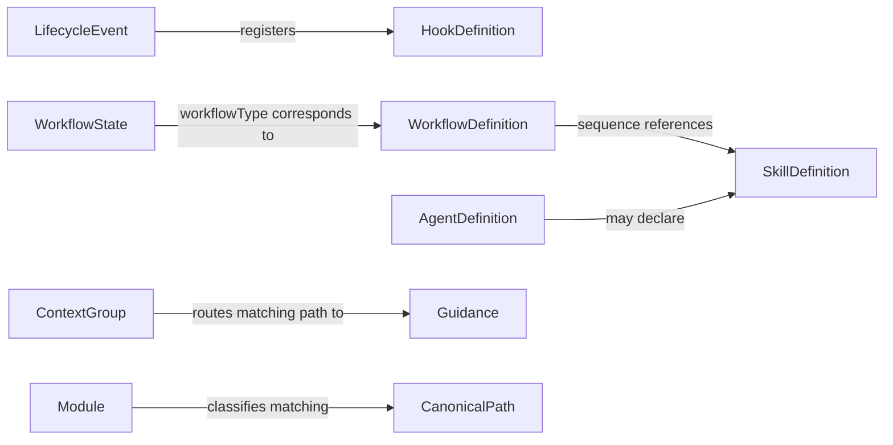

# Domain Entities Reference

<!-- Last scanned: 2026-08-04 -->
<!-- This file is referenced by Claude skills and agents for project-specific context. -->

> easy-claude has no traditional domain entities (no database models, DTOs, or ORM classes).
> This reference classifies framework definitions, configuration records, and runtime state without presenting them as formal DDD/ORM entities.

<!-- PROMPT-ENHANCE:QUICK-SUMMARY:START -->

## Quick Summary

**Goal:** Map easy-claude's source-backed conceptual artifacts and state boundaries while keeping formal entities, DTOs, databases, and cross-service synchronization explicitly N/A.

**Summary:**

- Use the Entity Catalog for identity/property ownership and the relationship diagram for name/path/configuration links.
- Use DTO Mapping and Aggregate Boundaries only with their explicit non-domain/plain-object classifications.
- Use the Coverage Report to distinguish verified N/A areas from real framework state and tooling persistence.

**Classification:** Hook, Skill, and Agent are conceptual definitions; Module and Context Group are configuration value records; Workflow Definition and Workflow State are aggregate-like plain-object boundaries, not DDD aggregate roots.

**Decision sequence:** detect framework/architecture → classify the artifact → trace its owner and consumers → verify persistence/boundary evidence → document only labels supported above 80% confidence.

<!-- PROMPT-ENHANCE:QUICK-SUMMARY:END -->

---

## Entity Catalog

No entry below has a database ID, foreign key, ORM base class, or entity timestamp. “Aggregate-like” describes ownership of nested plain values; it does not assert a formal DDD type.

### hooks Entities

| Entity | Key Properties | Base Class | Relationships | File |
| --- | --- | --- | --- | --- |
| Hook Definition | Lifecycle event, matcher, command, execution type | Conceptual definition; none | Event registration invokes one or more hook commands | `.claude/settings.json:32-52` |

### hooks-lib Entities

| Entity | Key Properties | Base Class | Relationships | File |
| --- | --- | --- | --- | --- |
| Workflow State | External `sessionId`; workflow type, steps, current index, completed steps, todos, timestamps | Aggregate-like runtime plain object; none | Corresponds to a Workflow Definition; owns nested step/todo values | `.claude/hooks/lib/workflow-state.cjs:35-61,119-175` |
| Module | Name, kind, path regex, description, tags, metadata | Configuration value record; none | Classifies a canonical path through regex lookup | `.claude/hooks/lib/project-config-schema.cjs:186-197`; `docs/project-config.json:23-73` |
| Context Group | Name, path regexes, extensions, guide document, rules | Configuration value record; none | Routes matching paths to guidance | `.claude/hooks/lib/project-config-schema.cjs:198-210`; `docs/project-config.json:74-105` |

### skills Entities

| Entity | Key Properties | Base Class | Relationships | File |
| --- | --- | --- | --- | --- |
| Skill Definition | Name, path, description, category, lifecycle/supporting-asset metadata | Conceptual definition; none | Workflow sequences reference skill names | `.claude/scripts/scan_skills.py:70-115`; `.claude/workflows.schema.json:135-143` |

### agents Entities

| Entity | Key Properties | Base Class | Relationships | File |
| --- | --- | --- | --- | --- |
| Agent Definition | Name, description, model, memory, optional skills | Conceptual definition; none | May declare Skill references by name | `.claude/agents/code-reviewer.md:1-10`; `.claude/agents/frontend-developer.md:1-11`; `.claude/agents/architect.md:1-12` |

### workflows Entities

| Entity | Key Properties | Base Class | Relationships | File |
| --- | --- | --- | --- | --- |
| Workflow Definition | Map-key identity, name, description, ordered sequence, nested actions/parallel groups | Aggregate-like configuration definition; none | Owns its sequence/group values and references Skills by name | `.claude/workflows.json:9-16`; `.claude/workflows.schema.json:71-164` |

### scripts Entities

No formal or conceptual identity owner is defined in this module. Scripts derive catalog/read-model outputs from canonical Skill and Workflow definitions (`.claude/scripts/scan_skills.py:70-115`; `.claude/scripts/generate_catalogs.py:124-175`).

### docs-framework Entities

No entity implementation is defined in this documentation-only module (`docs/project-config.json:66-72`).

---

## Entity Relationships

No database ER diagram is supportable. The source-backed conceptual relationships are:



These are name/path/configuration relationships, not foreign keys or persisted cardinalities (`.claude/settings.json:32-52`; `.claude/workflows.schema.json:71-164`; `.claude/hooks/lib/project-config-loader.cjs:206-242`).

---

## Cross-Service Entity Map

Not applicable. The repository is one modular framework package: all configured modules are libraries, and service, messaging, database, API, and infrastructure mappings are empty (`docs/project-config.json:23-73,132-152`). There is no owner-service/consumer-service entity boundary or synchronization event to map.

---

## DTO Mapping

No named domain DTO, ViewModel, Request/Response, CQRS carrier, or entity round-trip mapper is implemented. The nearest real mapping boundaries are deliberately non-domain:

| Source Carrier | Consumer Form | Mapping Owner | Classification | File |
| --- | --- | --- | --- | --- |
| Raw hook-event JSON | Normalized event object | `parseHookEvent`, delivered by hook runner | Infrastructure event adapter | `.claude/hooks/lib/stdin-parser.cjs:28-50,78-91`; `.claude/hooks/lib/hook-runner.cjs:56-73` |
| Project configuration | Normalized module/pattern/localization objects | Project-config loader | Infrastructure configuration model | `.claude/hooks/lib/project-config-loader.cjs:128-198,292-320` |
| Skill frontmatter | Catalog record/grouped YAML | Skill scanner and catalog generator | Application read-model projection | `.claude/scripts/scan_skills.py:70-115`; `.claude/scripts/generate_catalogs.py:124-175` |
| Workflow JSON plus skill descriptions | Markdown workflow/skill catalog | Workflow catalog builder | Presentation projection | `.claude/scripts/lib/workflow-skills-catalog.cjs:95-115,137-206` |

Mapping belongs to parsers/loaders/scanners/builders, not to hook handlers or a fictional DTO layer.

---

## Aggregate Boundaries

| Boundary | Owns | Invariants / Logic Owner | Classification |
| --- | --- | --- | --- |
| Workflow Definition | Ordered steps, pre-actions, parallel groups, conditional members | JSON schema owns required shape and group/barrier constraints (`.claude/workflows.schema.json:71-164`) | Aggregate-like configuration definition |
| Workflow State | One session's progression snapshot, completed steps, todos, timestamps | `workflow-state.cjs` owns initialization, persistence, idempotent completion, and advancement (`.claude/hooks/lib/workflow-state.cjs:68-175`) | Aggregate-like runtime plain object |

Formal aggregate roots, leaf entities, and value objects are not implemented. Do not infer them from nested JSON objects.

---

## Naming Conventions

| Artifact | Convention | Evidence |
| --- | --- | --- |
| Hook | kebab-case `.cjs`, referenced by canonical command path | `.claude/settings.json:37-52` |
| Skill | kebab-case directory with uppercase `SKILL.md` entry point | `.claude/scripts/scan_skills.py:70-106` |
| Agent | kebab-case `.md`; frontmatter `name` matches identity | `.claude/agents/code-reviewer.md:1-10`; `.claude/agents/frontend-developer.md:1-11`; `.claude/agents/architect.md:1-12` |
| Workflow | `workflow-`-prefixed map key; separate display name | `.claude/workflows.json:9-16` |
| Module / Context Group | kebab-case `name`; current context names use `-context` | `docs/project-config.json:23-104` |
| Mapping function | Verb-led parser/loader/scanner/builder; camelCase object fields | `.claude/hooks/lib/stdin-parser.cjs:78-91`; `.claude/hooks/lib/project-config-loader.cjs:128-198` |

---

## Coverage Report

| Configured Module | Formal Entities | Source-Backed Conceptual/State Coverage | Gap / N/A |
| --- | --- | --- | --- |
| hooks | None | Hook Definition | No ORM/entity persistence |
| hooks-lib | None | Workflow State; Module and Context Group schemas/loaders | No formal aggregates or value objects |
| skills | None | Skill Definition | Catalog projection is not a DTO |
| agents | None | Agent Definition | Skill references are names, not FKs |
| scripts | None | Derived Skill/Workflow read models; code-graph SQLite tooling | SQLite stores code topology, not domain records |
| workflows | None | Workflow Definition | Nested values are not leaf entities |
| docs-framework | None | Documentation only | No executable entity model |

Configured modules: 7/7 scanned. Formal entities, entity DTOs, service entity databases, business indexes/migrations, and entity seeders: none. Code-graph SQLite (`.claude/scripts/code_graph/graph.py:26-71`) and operational JSON state are tooling persistence only.

---

## Detailed Conceptual Definitions

---

## 1. Hook

A CJS executable registered for a Claude Code lifecycle event. Standard hooks receive a normalized event through `runHook`/`runHookSync`; explicit policy blockers may use the shared parser for direct exit-code control. stdout is reserved for intentional results/context and stderr for diagnostics or rejection reasons (`.claude/hooks/lib/hook-runner.cjs:56-175`; `.claude/hooks/lib/stdin-parser.cjs:28-97`).

**Location:** `.claude/hooks/<name>.cjs`
**Shared libraries:** `.claude/hooks/lib/<name>.cjs`
**Registration:** `.claude/settings.json` under `hooks.<EventType>[]`

### Hook Event Types

| Event              | When it fires                                   | Typical use                                                                       |
| ------------------ | ----------------------------------------------- | --------------------------------------------------------------------------------- |
| `SessionStart`     | Session begins (`startup`, `resume`, `compact`) | Initialize state, inject CLAUDE.md, recover after compaction                      |
| `SessionEnd`       | Session ends (`clear`, `exit`, `compact`)       | Persist state, cleanup                                                            |
| `PreToolUse`       | Before a tool executes (matched by tool name)   | Block sensitive ops, guard path boundaries, command-syntax guard                  |
| `PostToolUse`      | After a tool executes (matched by tool name)    | Output processing, task tracking, formatting                                      |
| `UserPromptSubmit` | When user submits a prompt                      | Prompt gating, workflow routing                                                   |
| `Notification`     | Idle/waiting events                             | Desktop notifications                                                             |
| `Stop`             | Agent stops                                     | Notifications                                                                     |

### Key Properties

- **Matcher:** Glob pattern filtering which tools/events trigger the hook (e.g., `Edit|Write|MultiEdit`)
- **Exit code 0:** Allow/success/fail-open; stdout is emitted only for intentional result or context output
- **Fail-open design:** Hooks catch errors and exit 0 to avoid blocking the session
- **Exit code 2:** Reserved for a verified safety/policy violation in a blocker

### Relationships

- Hooks that need project classification resolve **Context Groups** and **Modules** through `project-config-loader.cjs` (`.claude/hooks/lib/project-config-loader.cjs:169-242`).
- Skill activation and agent context are authored as static instructions in `CLAUDE.md` and canonical `.claude/agents/*.md` definitions.

---

## 2. Skill

A reusable task-automation capability. Each skill is a directory with a `SKILL.md` entry point defining its goal, workflow, prerequisites, and rules. Workflows and agents reference skills by canonical name; the active host supplies the invocation syntax.

**Location:** `.claude/skills/<skill-name>/SKILL.md`
**Shared protocols:** `.claude/skills/shared/<protocol-name>.md`

### SKILL.md Structure

- **Frontmatter** (YAML): `name`, `version`, `description`
- **Prerequisites:** Files that must be read before execution
- **Quick Summary:** Goal, workflow overview, key rules
- **Workflow Steps:** Numbered steps with output markers (`Step N: ...`)
- **Next Steps:** Recommended follow-up skills
- **Closing Reminders:** Mandatory task planning and review notes

### Skill Variants

| Pattern         | Example                                    | Purpose                                         |
| --------------- | ------------------------------------------ | ----------------------------------------------- |
| Simple          | `.claude/skills/debug-investigate/SKILL.md` | Single markdown entry point |
| With scripts    | `.claude/skills/docs-seeker/scripts/` | Has helper scripts alongside SKILL.md |
| Shared protocol owner | `.claude/skills/shared/sync-inline-versions.md` | Canonical reusable protocol bodies and parity contract |

### Key Properties

- **`$ARGUMENTS`:** Placeholder in SKILL.md replaced with user-provided arguments at invocation
- **Workflow recommendation:** Most skills suggest activating a full workflow if not already in one
- **Evidence gate:** Implementation skills require `file:line` proof for all claims
- **Task tracking:** Multi-step skills create and synchronize task items before executing their steps

### Relationships

- Skills reference **Agents** as subagents when their protocol delegates specialized work
- Skills reference shared protocols in `.claude/skills/shared/`
- Skills are orchestrated in sequence by **Workflows**
- Project-specific rules are read from `docs/project-reference/*` through the `CLAUDE.md` project-reference-docs gate

---

## 3. Agent

A markdown file defining a specialized subagent role. The orchestrator spawns an agent by canonical name, and the agent carries its project/quality context in its own `.md` instructions. Each agent has a focused responsibility such as review, testing, debugging, or documentation management.

**Location:** `.claude/agents/<agent-name>.md`

### Agent Definition Structure

- **Frontmatter** (YAML):
    - `name` — Agent identifier
    - `description` — When to use this agent
    - `model` — Model selection, commonly `inherit`
    - `memory` — Memory scope, commonly `project`
    - `skills` — Optional skill delegation list
- **Body** (Markdown): Quick Summary, project context, key rules, role-specific workflow, output, and closing reminders

### Key Properties

- **Evidence Gate:** Most agents require `file:line` proof for claims
- **External Memory:** Agents write reports to `plans/reports/` to survive context loss
- **Static context contract:** Each canonical agent definition contains its required project-reference and shared quality protocols

### Relationships

- Agents are spawned by **Skills** during workflow execution
- Agents carry context in their canonical `.md` body
- Agents may activate **Skills** listed in their frontmatter
- Agent types are reflected by role-specific guidance authored into each `.md`

---

## 4. Workflow

A named sequence of skill steps that orchestrates a multi-step process (feature development, bugfix, refactoring). Workflows define the order of skills, gate conditions between steps, and orchestration patterns (sequential chaining, parallel execution).

**Definitions:** `.claude/workflows.json` (validated by `.claude/workflows.schema.json`)
**Supporting guides:** `.claude/workflows/*.md`

### Key Workflow Files

| File                          | Purpose                                                            |
| ----------------------------- | ------------------------------------------------------------------ |
| `.claude/workflows/primary-workflow.md` | Standard dev flow: plan, implement, test, review, docs |
| `.claude/workflows/orchestration-protocol.md` | Sequential chaining, parallel execution, and recovery |
| `.claude/workflows/documentation-management.md` | Documentation update workflow |

### Key Properties

- **Step gates:** Steps have validation requirements (e.g., tests 100% passing, 0 critical issues, user approval)
- **Skill activation:** Each step maps to a canonical skill name
- **Orchestration patterns:** Sequential (plan then code then test), parallel (backend + frontend), recovery (resume from failure)

### Relationships

- Workflows orchestrate **Skills** in a defined sequence
- Skills within workflows spawn **Agents** as subagents
- Workflow routing and advancement are model-driven from the static catalog in `CLAUDE.md`
- Session workflow state persists under the framework temp directory as `workflow/{sessionId}.json` (`.claude/hooks/lib/workflow-state.cjs:15-29`)

---

## 5. Context Group

A configuration value record in `docs/project-config.json` mapping file paths/extensions to guidance and rules. The Claude-MD generator converts context-group rules and documents into Golden Rules and path-based pre-read routing (`.claude/skills/claude-md-init/scripts/section-builders.cjs:43-51,194-207`).

**Location:** `docs/project-config.json` under `contextGroups[]`

### Schema

```json
{
    "name": "hooks-context",
    "pathRegexes": ["\\\\.claude\\\\/hooks\\\\/.*\\.cjs$"],
    "fileExtensions": [".cjs"],
    "guideDoc": ".claude/docs/hooks/README.md",
    "rules": ["Hooks use CommonJS (require/module.exports)"]
}
```

### Key Properties

- **`pathRegexes`** (required): Array of regex patterns matching file paths
- **`fileExtensions`** (optional): File extension filter
- **`guideDoc`** (optional): Path to the primary guide document for this context
- **`patternsDoc`** (optional): Path to coding patterns reference
- **`stylingDoc`** / **`designSystemDoc`** (optional): UI-specific references
- **`rules`** (optional): Rule strings used to build shared Golden Rules

### Relationships

- Context groups map paths to the guide or patterns document a reader should open (`.claude/skills/claude-md-init/scripts/section-builders.cjs:194-207`)
- Context groups reference documentation files that **Skills** and **Agents** read directly
- Context groups complement **Modules** (modules identify _what_ a component is; context groups define _what rules apply_)

---

## 6. Module

A registry entry in `docs/project-config.json` that describes a project component. Modules provide identity metadata (name, kind, description, tags) used by hooks to detect which part of the codebase a file belongs to.

**Location:** `docs/project-config.json` under `modules[]`

### Schema

```json
{
    "name": "hooks",
    "kind": "library",
    "pathRegex": "\\\\.claude\\\\/hooks\\\\/",
    "description": "Runtime hooks for session initialization, safety gates, graph maintenance, and code formatting",
    "tags": ["core", "cjs"]
}
```

### Key Properties

- **`name`** (required): Module identifier
- **`kind`** (required): Classification — `library`, `frontend-app`, `backend-service`, etc.
- **`pathRegex`** (required): Regex pattern matching files belonging to this module
- **`description`** (optional): Human-readable purpose
- **`tags`** (optional): Categorization labels (e.g., `core`, `cjs`, `markdown`, `tooling`)
- **`meta`** (optional): Freeform module metadata supported by the shared schema

### Current Modules

| Module           | Kind    | Description                                               |
| ---------------- | ------- | --------------------------------------------------------- |
| `hooks`          | library | Runtime hooks for session init, safety gates & formatting |
| `hooks-lib`      | library | Shared utility modules consumed by hooks                  |
| `skills`         | library | Skill definitions for task automation                     |
| `agents`         | library | Agent definitions for specialized subagent roles          |
| `scripts`        | library | Utility scripts for catalog generation and management     |
| `workflows`      | library | Workflow definitions for multi-step task orchestration    |
| `docs-framework` | library | Framework documentation                                   |

### Relationships

- Modules are resolved by `getModuleForPath()` in `project-config-loader.cjs` (`.claude/hooks/lib/project-config-loader.cjs:169-198,232-242`)
- Modules complement **Context Groups** (modules identify the component; context groups define the rules)

---

<!-- PROMPT-ENHANCE:CLOSING-REMINDERS:START -->

## Closing Reminders

1. **Do not invent DDD types** — “conceptual,” “configuration value record,” and “aggregate-like plain object” are deliberate boundaries.
2. **Do not invent persistence or service synchronization** — code-graph SQLite and operational JSON are tooling state; service/entity storage and cross-service maps are N/A.
3. **Verify every catalog entry** — all artifact names, properties, relationships, and files require current canonical-source evidence.

<!-- PROMPT-ENHANCE:CLOSING-REMINDERS:END -->
