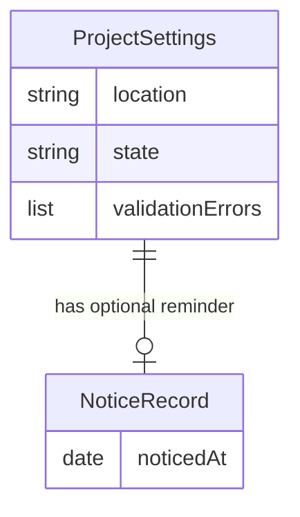

# Project Context Intake — Feature Spec

## Related Documentation

| Type | Link | Description |
|---|---|---|
| Spec index | [Context Delivery](INDEX.md) | Derived navigation; refresh via `spec [mode=index]` |
| Integration evidence | `.claude/hooks/tests/suites/init-prompt-gate.test.cjs` | Executable case mapping |
| Related capability | [Protocol Delivery](README.ProtocolDelivery.md) | Independent framework instruction delivery |

## 1. Overview

A project can use the assistant without recording project settings. Ordinary work then proceeds using repository evidence, with an occasional optional invitation to record those facts. If the project author records settings that cannot be accepted, ordinary work waits for their repair; the assistant must not silently replace declared facts with assumptions. An explicitly requested repair remains available. This capability owns that intake choice, including relocated settings, and the boundary before optional project-context setup guidance.

## 2. Glossary

| Term | Meaning |
|---|---|
| Project settings | Project facts the author elects to record at the configured location |
| Missing | No recorded settings exist at that location |
| Invalid | Recorded settings exist but cannot be read or do not meet the declared requirements |
| Repair action | An offered action to re-evaluate project context, initialize it through its alias, or repair recorded settings |
| Optional setup | Guidance to generate missing root instructions, refresh old references, or build optional project knowledge |
| Notice record | The time the optional missing-settings reminder was last issued or dismissed |

## 3. User Stories & Acceptance Criteria

### US-PCI-01: Work without mandatory project setup

As a developer adopting the assistant, I want ordinary work to proceed with or without recorded project settings, so I can decide when to record project facts.

- **AC-PCI-01:** Given settings are missing, when I submit ordinary work, then work proceeds using repository evidence; failure to find settings does not trigger automatic optional setup. **BR-PCI-01**.
- **AC-PCI-02:** Given settings were relocated, when I submit work, then the configured location determines whether settings are missing, invalid or accepted; an unrelated default location does not change that result. **BR-PCI-01, BR-PCI-02**.
- **AC-PCI-03:** Given missing settings and a reminder within the last day, when I submit more work, then no reminder repeats; once a day has elapsed a reminder may appear again. **BR-PCI-03**.
- **AC-PCI-04:** Given accepted settings and project content, when I submit ordinary work with missing root instructions, then existing optional setup guidance remains available. **BR-PCI-01**.

- **AC-PCI-07:** Given accepted settings and old project references, when I submit ordinary work, then refresh guidance offers available actions for all references or one selected reference; unavailable legacy actions are not suggested. **BR-PCI-04**.

### US-PCI-02: Repair declared facts before ordinary work

As a project maintainer, I want invalid recorded settings to be explained and repair actions to remain accessible, so the assistant does not work from rejected facts.

- **AC-PCI-05:** Given invalid settings, when I submit ordinary work, then the request waits and guidance names the settings location and available validation errors; dismissal of optional setup does not waive this requirement. **BR-PCI-02**.
- **AC-PCI-06:** Given invalid settings, when I explicitly invoke one offered repair action at the start of the request, then the repair proceeds; mentioning a repair action elsewhere or invoking a different action with a similar name still waits. **BR-PCI-02**.

## 4. Business Rules

### BR-PCI-01: Missing settings never impose setup [HARD]

| Trigger | Rule | Failure outcome |
|---|---|---|
| Settings missing at their configured location | Use portable defaults and repository evidence; optional project-context setup guidance is not invoked | No settings-required block or automatic context-generation directive |
| Settings accepted and project contains content | Existing optional setup guidance may run | Guidance remains dismissible |

**Invariant:** For ALL ordinary requests in a project with missing settings, work proceeds without config-dependent optional setup directives, regardless of existing project content or leftover freshness notices.

[Source: rule/framework.contextdelivery/MissingSettings]

**Task-scoped discovery:** After accepting the entire recorded settings, a reader may request the discovery inputs and named sections needed for the task. The view preserves configured reference selection, including the difference between absent selection and an explicitly empty selection, and names other available sections. It never validates only the selected sections. Missing settings remain supported; rejected settings and unknown requested sections return an error without a misleading partial facts view. Editing settings requires the full source.

### BR-PCI-02: Rejected declared facts require exact repair [HARD]

| Trigger | Rule | Failure outcome |
|---|---|---|
| Settings exist but are rejected | Wait for repair; name the location and first available validation errors | Request is blocked with actionable settings guidance |
| A repair action is explicitly invoked first | Permit its exact name, ignoring letter case and leading whitespace, followed by end-of-request or whitespace before arguments | Different names and incidental mentions do not permit ordinary work |
| Optional setup is dismissed | Keep rejected settings authoritative until repaired or removed | Ordinary work still waits |

**Invariant:** For ALL requests with invalid recorded settings, only an explicit first-token invocation of one of the three offered repair actions proceeds; ordinary requests, similar names and incidental mentions wait.

[Source: rule/framework.contextdelivery/ExactConfigRepair]

### BR-PCI-03: Missing-settings reminders are bounded [SOFT]

The optional invitation names the configured settings location, explains repository-evidence fallback and appears at most once during a one-day notice window. A notice/dismissal record less than one day old suppresses it; a record at least one day old does not. Failure to preserve notice state may cause repetition but must not block ordinary work. SOFT because repetition affects guidance volume, without corrupting facts or granting authority.

[Source: rule/framework.contextdelivery/MissingSettingsNotice]

### BR-PCI-04: Refresh guidance uses available actions [SOFT]

When old project references are reported before ordinary project work, offer both the available all-reference refresh action and the available single-reference refresh action with an explicit target. Preserve specific target suggestions supplied by the freshness assessment. Do not suggest unavailable legacy actions. Guidance remains advisory and existing dismissal rules remain in effect. SOFT because this invitation guides context refresh without changing data or access rights.

[Source: rule/framework.contextdelivery/StaleReferenceGuidance]

## 5. Domain Model

| Concept | Facts | Ownership |
|---|---|---|
| Project settings | Configured location; missing, invalid or accepted state; available validation errors | Project author chooses facts and location; intake evaluates acceptance |
| Notice record | Time of the latest missing-settings notice or dismissal | Intake owns the one-day reminder window |



[Source: component/framework.contextdelivery/ProjectContextIntake]

No additional entity invariants or business lifecycle transitions are introduced beyond BR-PCI-01 and BR-PCI-02.

## 6. Process Flows

1. A developer submits a request.
2. Intake evaluates recorded settings at the configured location.
3. Missing settings: offer the bounded optional reminder, then allow the request using evidence.
4. Rejected settings: allow an explicit exact repair action; otherwise explain rejection and wait.
5. Accepted settings: allow the request and retain existing optional context-setup guidance where applicable.

Example: a developer adopts the assistant in a content-bearing project without recorded facts. The first request sees an optional reminder; a second request within a day proceeds quietly. Recording rejected facts changes the next ordinary request to a repair-required outcome.

No graphical view or navigation surface is owned here; outcomes appear in the assistant conversation.

## 7. Permissions & Roles

| Role | Ordinary request with missing/accepted settings | Ordinary request with invalid settings | Exact repair request with invalid settings |
|---|---|---|---|
| Developer / project maintainer | Allowed | Wait for repair | Allowed |
| Assistant | Follow evidence or accepted facts | Explain rejection; do not substitute facts | Perform the explicitly requested repair |

## 8. Test Specifications

Test summary: 9 cases — 1 core preservation, 1 repair-access preservation, 3 validation/notice, 1 refresh workflow, 1 rejection boundary, 2 properties. Property domains cover state-transition eligibility; arithmetic, conservation, inverse and commutativity classes are inapplicable to this read-only intake choice.

### Core preservation

#### TC-PCI-001: Accepted relocated settings preserve setup [P1]

**Objective:** Protect BR-PCI-01, BR-PCI-02 through the observable intake outcome.
**Business Intent / Invariant Guarded:** Work proceeds and existing optional root-setup guidance remains available.
**Preconditions:** Accepted relocated settings and missing root instructions.
**Real-World Reachability:** A maintainer records accepted facts at a relocated location; the default location is empty. These requests follow completed fixture preparation; no timing race or readiness delay is assumed.
**Demo Flow:** Arrange the stated project facts, submit the described request, and observe guidance or permission.

```gherkin
Given accepted relocated settings and missing root instructions
When the developer submits ordinary work
Then work proceeds and existing optional root-setup guidance remains available
```

**Expected Result:** The conversation shows the stated guidance or permission; recorded project facts are unchanged. Navigation is inapplicable because there is no graphical view.
**Acceptance Criteria:** Success is the stated outcome; failure is any contrary permission or setup guidance.
**Test Data:** valid configured location; no default settings.

**Task-scoped variant:** Accepted relocated settings return discovery inputs and requested sections without unrelated bodies. Explicitly empty reference selection stays empty; absent selection stays absent. Rejected facts in an unselected section and an unknown requested section produce errors rather than a partial accepted view; missing settings remain supported.

**Edge Cases:** An unrelated missing default location must not change acceptance.
**Evidence:** `[Source: rule/framework.contextdelivery/ValidConfiguredPath]`
**Related Behaviors:** `operation/framework.contextdelivery/ProjectContextIntake`, `test/framework.contextdelivery/ProjectContextIntake`
**CoveredBy:** `.claude/hooks/tests/suites/context-efficiency.test.cjs::TC-PCI-001`, `.claude/hooks/tests/suites/init-prompt-gate.test.cjs::[init-prompt-gate] TC-PCI-001 valid custom config preserves root setup`
**Status:** Tested

### Authorization / repair access

#### TC-PCI-021: Exact repair actions remain available [P1]

**Objective:** Protect BR-PCI-02 through the observable intake outcome.
**Business Intent / Invariant Guarded:** Repair proceeds without a settings-required block.
**Preconditions:** Invalid recorded settings.
**Real-World Reachability:** A maintainer records rejected facts, then explicitly selects a repair action in the next request. These requests follow completed fixture preparation; no timing race or readiness delay is assumed.
**Demo Flow:** Arrange the stated project facts, submit the described request, and observe guidance or permission.

```gherkin
Given invalid recorded settings
When the maintainer invokes an exact offered repair action first, with optional arguments
Then repair proceeds without a settings-required block
```

**Expected Result:** The conversation shows the stated guidance or permission; recorded project facts are unchanged. Navigation is inapplicable because there is no graphical view.
**Acceptance Criteria:** Success is the stated outcome; failure is any contrary permission or setup guidance.
**Test Data:** all three offered names; either supported invocation style; case and whitespace variations.

**Edge Cases:** End-of-request and whitespace argument boundaries remain accepted.
**Evidence:** `[Source: rule/framework.contextdelivery/ExactRepair]`
**Related Behaviors:** `operation/framework.contextdelivery/ProjectContextIntake`, `test/framework.contextdelivery/ProjectContextIntake`
**CoveredBy:** `.claude/hooks/tests/suites/init-prompt-gate.test.cjs::[init-prompt-gate] TC-PCI-021 invalid settings still permit explicit repair`
**Status:** Tested

### Validation and notices

#### TC-PCI-011: Missing settings remain optional [P1]

**Objective:** Protect BR-PCI-01 through the observable intake outcome.
**Business Intent / Invariant Guarded:** The first request receives only the portable-default invitation and the second proceeds quietly.
**Preconditions:** Missing settings at the default location.
**Real-World Reachability:** A developer adopts the assistant with source content and no recorded settings; no earlier intake notice exists. These requests follow completed fixture preparation; no timing race or readiness delay is assumed.
**Demo Flow:** Arrange the stated project facts, submit the described request, and observe guidance or permission.

```gherkin
Given missing settings at the default location
When the developer submits ordinary work twice within one day
Then the first request receives only the portable-default invitation and the second proceeds quietly
```

**Expected Result:** The conversation shows the stated guidance or permission; recorded project facts are unchanged. Navigation is inapplicable because there is no graphical view.
**Acceptance Criteria:** Success is the stated outcome; failure is any contrary permission or setup guidance.
**Test Data:** default settings location; content-bearing project with no recorded facts.

**Edge Cases:** Project content must not cause automatic setup.
**Evidence:** `[Source: rule/framework.contextdelivery/MissingSettings]`
**Related Behaviors:** `operation/framework.contextdelivery/ProjectContextIntake`, `test/framework.contextdelivery/ProjectContextIntake`
**CoveredBy:** `.claude/hooks/tests/suites/init-prompt-gate.test.cjs::[init-prompt-gate] TC-PCI-011 bare adopter works on portable defaults`
**Status:** Tested

#### TC-PCI-012: Reminder window expires [P1]

**Objective:** Protect BR-PCI-03 through the observable intake outcome.
**Business Intent / Invariant Guarded:** The portable-default optional invitation appears again without automatic setup.
**Preconditions:** Missing settings and a notice older than one day.
**Real-World Reachability:** A developer works without recorded settings, receives the invitation, and resumes ordinary work more than one day later. These requests follow completed fixture preparation; no timing race or readiness delay is assumed.
**Demo Flow:** Arrange the stated project facts, submit the described request, and observe guidance or permission.

```gherkin
Given missing settings and a notice older than one day
When the developer submits ordinary work
Then the portable-default optional invitation appears again without automatic setup
```

**Expected Result:** The conversation shows the stated guidance or permission; recorded project facts are unchanged. Navigation is inapplicable because there is no graphical view.
**Acceptance Criteria:** Success is the stated outcome; failure is any contrary permission or setup guidance.
**Test Data:** notice age greater than one day.

**Edge Cases:** Before one day, repeated requests remain quiet.
**Evidence:** `[Source: rule/framework.contextdelivery/MissingSettingsNotice]`
**Related Behaviors:** `operation/framework.contextdelivery/ProjectContextIntake`, `test/framework.contextdelivery/ProjectContextIntake`
**CoveredBy:** `.claude/hooks/tests/suites/init-prompt-gate.test.cjs::[init-prompt-gate] TC-PCI-012 missing-config notice expires after one day`
**Status:** Tested

#### TC-PCI-013: Invalid facts remain authoritative until repair [P1]

**Objective:** Protect BR-PCI-02 through the observable intake outcome.
**Business Intent / Invariant Guarded:** The request waits with the configured location and available validation errors.
**Preconditions:** Invalid recorded settings, including an unreadable or malformed record.
**Real-World Reachability:** A maintainer records incomplete or damaged settings and may previously have dismissed optional setup. These requests follow completed fixture preparation; no timing race or readiness delay is assumed.
**Demo Flow:** Arrange the stated project facts, submit the described request, and observe guidance or permission.

```gherkin
Given invalid recorded settings, including an unreadable or malformed record
When the developer requests ordinary work or dismisses optional setup
Then the request waits with the configured location and available validation errors
```

**Expected Result:** The conversation shows the stated guidance or permission; recorded project facts are unchanged. Navigation is inapplicable because there is no graphical view.
**Acceptance Criteria:** Success is the stated outcome; failure is any contrary permission or setup guidance.
**Test Data:** empty project name; malformed settings; unreadable configured location; dismissal phrases/state.

**Edge Cases:** A relocated invalid record cannot be replaced by default facts.
**Evidence:** `[Source: rule/framework.contextdelivery/InvalidSettings]`
**Related Behaviors:** `operation/framework.contextdelivery/ProjectContextIntake`, `test/framework.contextdelivery/ProjectContextIntake`
**CoveredBy:** `.claude/hooks/tests/suites/init-prompt-gate.test.cjs::[init-prompt-gate] TC-PCI-013 invalid custom config blocks with its path and schema errors`, `.claude/hooks/tests/suites/init-prompt-gate.test.cjs::[init-prompt-gate] TC-PCI-013 malformed or unreadable config fails closed`, `.claude/hooks/tests/suites/init-prompt-gate.test.cjs::[init-prompt-gate] TC-PCI-013 invalid config ignores setup dismissals`
**Status:** Tested

### Refresh workflow

#### TC-PCI-031: Old references offer usable refresh actions [P2]

**Objective:** Protect BR-PCI-04 so a developer can follow either refresh scope.
**Business Intent / Invariant Guarded:** Refresh guidance offers available all-reference and selected-reference actions.
**Preconditions:** Accepted settings, project content, root instructions and an existing old-reference notice.
**Real-World Reachability:** A project's recorded references age; a freshness assessment reports them before the developer resumes ordinary work. The next request follows that completed assessment.
**Demo Flow:** Resume project work after a freshness assessment and inspect the offered refresh choices.

```gherkin
Given accepted project settings and old references
When the developer submits ordinary work
Then guidance offers available all-reference and selected-reference refresh actions
And the specific assessed target is preserved
And the request remains allowed
```

**Expected Result:** The developer can choose either offered refresh scope without being directed to a removed action. No graphical navigation is owned here.
**Acceptance Criteria:** Both available actions appear; an unavailable legacy action is absent.
**Test Data:** One old structure reference with a specific offered refresh target.
**Edge Cases:** Optional graph activity is off; it must not alter refresh choices.
**Evidence:** `[Source: rule/framework.contextdelivery/StaleReferenceGuidance]`
**Related Behaviors:** `operation/framework.contextdelivery/ProjectContextIntake`, `test/framework.contextdelivery/StaleReferenceGuidance`
**CoveredBy:** `.claude/hooks/tests/suites/init-prompt-gate.test.cjs::[init-prompt-gate] TC-PCI-031 stale references name the supported single-document scan`
**Status:** Tested

### Rejection boundaries

#### TC-PCI-051: Similar repair names do not grant access [P1]

**Objective:** Protect BR-PCI-02 through the observable intake outcome.
**Business Intent / Invariant Guarded:** The request still waits for exact repair.
**Preconditions:** Invalid recorded settings.
**Real-World Reachability:** A developer types a repair-like action name incorrectly, or mentions a repair while asking for unrelated work. These requests follow completed fixture preparation; no timing race or readiness delay is assumed.
**Demo Flow:** Arrange the stated project facts, submit the described request, and observe guidance or permission.

```gherkin
Given invalid recorded settings
When the developer invokes a similar but different name or mentions repair later in the request
Then the request still waits for exact repair
```

**Expected Result:** The conversation shows the stated guidance or permission; recorded project facts are unchanged. Navigation is inapplicable because there is no graphical view.
**Acceptance Criteria:** Success is the stated outcome; failure is any contrary permission or setup guidance.
**Test Data:** suffixes punctuation, hyphen, underscore, slash or digit; incidental mentions.

**Edge Cases:** A complete repair name followed by whitespace is accepted instead.
**Evidence:** `[Source: rule/framework.contextdelivery/ExactConfigRepair]`
**Related Behaviors:** `operation/framework.contextdelivery/ProjectContextIntake`, `test/framework.contextdelivery/ProjectContextIntake`
**CoveredBy:** `.claude/hooks/tests/suites/init-prompt-gate.test.cjs::[init-prompt-gate] TC-PCI-051 repair prefixes and incidental mentions cannot bypass invalid config`
**Status:** Tested

### Invariant / Property

#### TC-PCI-071: All missing-settings ordinary requests avoid setup [P1]

**Objective:** Protect BR-PCI-01 through the observable intake outcome.
**Business Intent / Invariant Guarded:** Work proceeds without config-dependent setup guidance.
**Preconditions:** Any ordinary request with missing recorded settings.
**Real-World Reachability:** Projects adopt or remove recorded settings; content and prior freshness notices can remain when the next request is submitted. These requests follow completed fixture preparation; no timing race or readiness delay is assumed.
**Demo Flow:** Arrange the stated project facts, submit the described request, and observe guidance or permission.

```gherkin
Given any ordinary request with missing recorded settings
When the developer submits the request
Then work proceeds without config-dependent setup guidance
```

**Expected Result:** The conversation shows the stated guidance or permission; recorded project facts are unchanged. Navigation is inapplicable because there is no graphical view.
**Acceptance Criteria:** Success is the stated outcome; failure is any contrary permission or setup guidance.
**Test Data:** configured-location and leftover-state domain.

```yaml
inputDomain: "ordinary requests with missing settings, default or relocated location, content present and old freshness notice absent or present"
invariant: "for ALL inputs in this domain, work proceeds with no config-dependent optional setup directives"
boundaryCounterCase: "settings present but invalid → ordinary work waits for repair"
```

**Edge Cases:** Present invalid settings are outside this domain and must wait for repair.
**Evidence:** `[Source: rule/framework.contextdelivery/MissingSettings]`
**Related Behaviors:** `operation/framework.contextdelivery/ProjectContextIntake`, `test/framework.contextdelivery/ProjectContextIntake`
**CoveredBy:** `.claude/hooks/tests/suites/init-prompt-gate.test.cjs::[init-prompt-gate] TC-PCI-071 missing config stays optional across paths and leftover state`
**Status:** Tested

#### TC-PCI-072: Invalid settings admit only complete repair tokens [P1]

**Objective:** Protect BR-PCI-02 through the observable intake outcome.
**Business Intent / Invariant Guarded:** Only the explicit exact first action permits repair; all others wait.
**Preconditions:** Any request with invalid recorded settings.
**Real-World Reachability:** A maintainer records invalid settings; a developer selects or types an action in the next request. These requests follow completed fixture preparation; no timing race or readiness delay is assumed.
**Demo Flow:** Arrange the stated project facts, submit the described request, and observe guidance or permission.

```gherkin
Given any request with invalid recorded settings
When the developer submits either a complete offered repair action or another request
Then only the explicit exact first action permits repair; all others wait
```

**Expected Result:** The conversation shows the stated guidance or permission; recorded project facts are unchanged. Navigation is inapplicable because there is no graphical view.
**Acceptance Criteria:** Success is the stated outcome; failure is any contrary permission or setup guidance.
**Test Data:** three repair names, two supported styles, case/whitespace/argument and nonrepair suffix domains.

```yaml
inputDomain: "requests with invalid settings spanning exact offered repair names and ordinary/different-token/incidental-mention requests"
invariant: "for ALL inputs in this domain, permission holds exactly for an explicit first repair token ending at whitespace or request end"
boundaryCounterCase: "append a nonwhitespace suffix to an accepted repair token → request waits for repair"
```

**Edge Cases:** A single extra nonwhitespace character changes a repair name and must be rejected.
**Evidence:** `[Source: rule/framework.contextdelivery/ExactConfigRepair]`
**Related Behaviors:** `operation/framework.contextdelivery/ProjectContextIntake`, `test/framework.contextdelivery/ProjectContextIntake`
**CoveredBy:** `.claude/hooks/tests/suites/init-prompt-gate.test.cjs::[init-prompt-gate] TC-PCI-072 exact slash and dollar repair commands remain available`
**Status:** Tested
