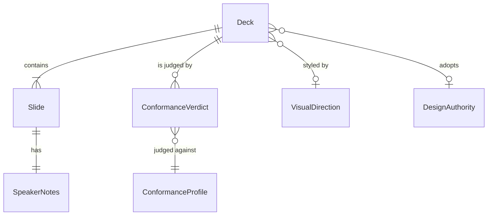

## Related Documentation

| Type                    | Path                                                                                                              | Description                                                             |
| ----------------------- | ----------------------------------------------------------------------------------------------------------------- | ----------------------------------------------------------------------- |
| General deck builder    | `.claude/skills/presentation-builder/SKILL.md`                                                                    | Command-only builder for a deck on any subject; owns the deck standard. |
| Deck standard           | `.claude/skills/presentation-builder/references/web-runtime-contract.md`                                          | Presenter and audience capabilities every conforming deck provides.     |
| Conformance checker     | `.claude/skills/presentation-builder/scripts/validate-presentation.cjs`                                           | Deterministic check of a deck against a conformance profile.            |
| Deck generator          | `.claude/skills/presentation-builder/scripts/create-presentation.cjs`                                             | Builds a conforming deck from a structured description.                 |
| Feature review deck     | `.claude/skills/feature-presentation/SKILL.md`, `.claude/skills/feature-presentation/references/deck-template.md` | Workflow step that synthesizes feature artifacts into one review deck.  |
| Visual direction        | `.claude/skills/ui-design/references/explore/workflow.md`                                                         | Divergent drafts, including a slide canvas, from which the user picks.  |
| Export and render check | `.claude/skills/html-export/SKILL.md`                                                                             | Renders a deck to images, paged document or recording.                  |
| Spec Index (derived) | `docs/specs/Presentation/INDEX.md` | Generated navigation catalog for this bucket; refresh through the spec index owner. |

# Presentation Decks — Feature Spec

> **Tech-free Feature Spec.** Implementation names and file paths appear only in frontmatter, Related Documentation and the Section 8 machine-only carriers.

## Sections

1. [Overview](#1-overview)
2. [Glossary](#2-glossary)
3. [User Stories & Acceptance Criteria](#3-user-stories--acceptance-criteria)
4. [Business Rules](#4-business-rules)
5. [Domain Model](#5-domain-model)
6. [Process Flows & Interaction Surface](#6-process-flows--interaction-surface)
7. [Permissions & Roles](#7-permissions--roles)
8. [Test Specifications](#8-test-specifications)

---

## 1. Overview

The framework produces two kinds of slide deck: a general deck on any subject, built only when a developer asks for it, and a feature review deck that a planning workflow can produce so product, analysis, development and QA reviewers see a feature before it is built. Both kinds meet one shared deck standard, checked the same way, so a reviewer always gets speaker notes, keyboard navigation, accessible announcements, a print path and a self-contained file. The general deck adds in-place editing for presenters; the review deck leaves editing out because its text must match the specifications it summarizes. Visual direction for a deck can be chosen by looking at drafts, and the chosen direction carries into the deck.

---

## 2. Glossary

| Term                | Definition                                                                                                                  | Context                                                                                   |
| ------------------- | --------------------------------------------------------------------------------------------------------------------------- | ----------------------------------------------------------------------------------------- |
| Deck                | One self-contained file of ordered slides that opens without a server.                                                      | Produced by the general builder or the feature review step.                               |
| General deck        | A deck on any subject, built only when a developer explicitly asks for it.                                                  | Carries the full presenter feature set, including in-place editing.                       |
| Feature review deck | A deck that synthesizes a feature's initiatives, specifications, tasks and prototypes for reviewers.                        | Produced by a planning workflow step or on request; its text mirrors canonical artifacts. |
| Slide               | One screen of a deck with a stable identity, a title and one job.                                                           | Its identity survives edits and regeneration.                                             |
| Speaker notes       | The presenter layer of a slide: what to say, why, evidence, transition, timing and a likely question.                       | Hidden from the audience until the presenter opens them.                                  |
| Deck standard       | The shared list of capabilities every conforming deck provides.                                                             | Owned by the general builder; used by both deck kinds.                                    |
| Conformance profile | A named subset of the deck standard that a deck is checked against.                                                         | `presenter` (default) or `review`.                                                        |
| Editing features    | In-place editing of slide text and notes, local draft saving, draft reset and clean export.                                 | Required by `presenter`; optional under `review`.                                         |
| Conformance verdict | The pass/fail outcome of checking one deck against one profile, listing every failed and advisory check.                    | Blocks hand-off of a review deck when it fails.                                           |
| Design authority    | The project's own design principles, design system and existing interface.                                                  | Outranks generic defaults when a deck represents the project.                             |
| Default look        | The built-in colours and type the generator uses when the author supplies none.                                             | Using it unchosen makes every deck look alike.                                            |
| Visual direction    | The approved colours, type, layout and principles picked from divergent drafts.                                             | Carried into the deck instead of being re-decided.                                        |
| Journey fixes       | Problems found by walking the main user journeys on the picked draft, recorded with the pick for the deck builder to apply. | Produced when a slide draft is picked; consumed by the deck builder.                      |
| Embedded demo       | An interactive prototype shown inside a review deck slide, with narration beside it.                                        | Driven by its own controls; the deck adds only narration.                                 |

---

## 3. User Stories & Acceptance Criteria

### US-PD-01: One standard checked the same way

**As a** framework maintainer
**I want to** check any deck against a named conformance profile
**So that** both deck kinds meet one standard without forcing features a deck kind should not have

**Acceptance Criteria:**

- **AC-PD-01** — **Given** a deck and no profile named **When** it is checked **Then** it is judged against the `presenter` profile; introducing profiles did not change that default verdict.
- **AC-PD-02** — **Given** a deck that lacks only editing features **When** it is checked against the `review` profile **Then** the verdict passes and lists each missing editing feature as advisory.
- **AC-PD-03** — **Given** a deck that lacks speaker notes on any slide **When** it is checked against either profile **Then** the verdict fails and names the slide.
- **AC-PD-04** — **Given** an unknown profile name **When** a check is requested **Then** no verdict is produced and the requester is told the valid profile names.
- **AC-PD-05** — **Given** any check **When** the verdict is reported **Then** it names the profile it was judged against.

### US-PD-02: Reviewers get a presentable review deck

**As a** product owner presenting a feature for review
**I want** a review deck with speaker notes, keyboard navigation, a slide overview and a print path
**So that** I can present it, hand it to someone else to present, or print it, without the text drifting from the specifications

**Acceptance Criteria:**

- **AC-PD-06** — **Given** a produced feature review deck **When** it is checked against the `review` profile **Then** it passes before the step reports the deck ready.
- **AC-PD-07** — **Given** a review deck that fails the `review` profile **When** the step would report it ready **Then** it does not; the failed checks are fixed and the deck re-checked first.
- **AC-PD-08** — **Given** any review deck slide, including demo slides **When** the presenter opens the notes **Then** the notes say what to show, why it matters, and the likely reviewer question.
- **AC-PD-09** — **Given** a review deck **When** it is opened with no network **Then** every slide renders with the project's own or the system's type, and no text is lost.
- **AC-PD-10** — **Given** a review deck **When** it is exported to images or a paged document **Then** every slide is captured, including by the export route that already existed for review decks.

### US-PD-03: The general deck respects the project and avoids the default look

**As a** developer asking for a general deck about the project
**I want** the builder to read the project's design authority and warn me when it falls back to the default look
**So that** the deck looks like this project's material, not like every other generated deck

**Acceptance Criteria:**

- **AC-PD-11** — **Given** a project that declares a design system **When** the general builder writes its design plan **Then** the plan records which design-authority documents it read and adopts their colours and type.
- **AC-PD-12** — **Given** a project with no design authority **When** the builder writes its design plan **Then** it records that none is configured and which locations it checked.
- **AC-PD-13** — **Given** a deck description with no chosen look **When** the generator builds the deck **Then** the deck is still built and the developer is warned that the default look was used.
- **AC-PD-14** — **Given** a deck description with a chosen look **When** the generator builds the deck **Then** no default-look warning appears.

### US-PD-04: A chosen slide direction carries into the deck

**As a** developer exploring visual directions for a presentation
**I want** the picked slide draft to hand its direction to a deck builder
**So that** the direction I chose is the one the deck uses, instead of being redesigned as a product screen

**Acceptance Criteria:**

- **AC-PD-15** — **Given** an exploration whose deliverable is a slide **When** the user picks a draft **Then** the next step is a deck builder that receives the approved direction and the journey fixes recorded with the pick, not further product-screen refinement; any substitution of the direction's type is recorded as a departure.
- **AC-PD-16** — **Given** an exploration whose deliverable is not a slide **When** the user picks a draft **Then** the existing refinement step follows, unchanged.

### US-PD-05: Each deck kind points to the other

**As a** developer or assistant choosing how to make a deck
**I want** each deck kind to state when to use the other
**So that** a feature review never lands in a general deck and a general talk never lands in a review deck

**Acceptance Criteria:**

- **AC-PD-17** — **Given** the feature review step's guidance **When** read **Then** it names the general builder as the owner of the deck standard and the conformance check it must pass, and says a deck on a general subject belongs to the general builder.
- **AC-PD-18** — **Given** the general builder's guidance **When** read **Then** it names the feature review step for artifact synthesis, and says that step passes the `review` profile.

---

## 4. Business Rules

### Rule Catalog

| Rule ID  | Name                                                 | Category        | Enforcement |
| -------- | ---------------------------------------------------- | --------------- | ----------- |
| BR-PD-01 | Two named conformance profiles                       | Conformance     | [HARD]      |
| BR-PD-02 | Default profile is unchanged                         | Compatibility   | [HARD]      |
| BR-PD-03 | Editing features are optional only in review         | Conformance     | [HARD]      |
| BR-PD-04 | Notes on every slide, in every profile               | Presenter layer | [HARD]      |
| BR-PD-05 | Review deck passes before hand-off                   | Workflow gate   | [HARD]      |
| BR-PD-06 | Self-contained unless an outside asset is declared   | Offline use     | [HARD]      |
| BR-PD-07 | Stable slide identity readable by both export routes | Export          | [HARD]      |
| BR-PD-08 | Design authority read before the design plan         | Design identity | [HARD]      |
| BR-PD-09 | Default-look warning                                 | Design identity | [SOFT]      |
| BR-PD-10 | Slide direction hands off to a deck builder          | Hand-off        | [HARD]      |
| BR-PD-11 | Two-way guidance between deck kinds                  | Discoverability | [HARD]      |

### BR-PD-01: Two named conformance profiles [HARD]

**Statement:** A deck is checked against exactly one of two profiles, `presenter` or `review`. Any other name is refused without a verdict.

```
IF profile ∈ {presenter, review} OR no profile named
  → CHECK the deck and REPORT one verdict naming the profile
ELSE
  → REFUSE: "Unknown profile; use presenter or review"
```

### BR-PD-02: Default profile is unchanged [HARD]

**Statement:** Naming no profile means `presenter`, and the verdict for any deck with no profile named is identical to its verdict under `presenter`; introducing profiles did not change the default verdict.

### BR-PD-03: Editing features are optional only in review [HARD]

**Statement:** Under `presenter`, missing editing features fail the verdict. Under `review`, missing editing features are advisory only. Every other check has the same weight in both profiles: a blocking check fails in both and an advisory check stays advisory in both. This rule owns the set of editing features; the deck standard and its checker mirror it, so widening or narrowing the set starts here.

| Missing check            | `presenter` | `review`                      |
| ------------------------ | ----------- | ----------------------------- |
| In-place editing control | FAIL        | advisory                      |
| Editing state announced  | FAIL        | advisory                      |
| Local draft saving       | FAIL        | advisory                      |
| Draft reset              | FAIL        | advisory                      |
| Clean export             | FAIL        | advisory                      |
| Any other standard check | its level   | the same level as `presenter` |

### BR-PD-04: Notes on every slide, in every profile [HARD]

**Statement:** Every slide has non-empty speaker notes with enough detail to present from (at least 40 characters); a slide without them fails the verdict in both profiles.

### BR-PD-05: Review deck passes before hand-off [HARD]

**Statement:** The feature review step reports a deck ready only after it passes the `review` profile. A failed check is fixed in the deck and the deck is re-checked; the step never reports a failing deck as ready.

```
IF review verdict = PASS
  → REPORT the deck ready, with the verdict
ELSE
  → FIX the failed checks, RE-CHECK; never report ready while failing
```

### BR-PD-06: Self-contained unless an outside asset is declared [HARD]

**Statement:** A deck opens and reads fully with no network. It may load an outside font or asset only when the deck itself declares that outside assets are allowed; otherwise type comes from the project's design authority, from a font file packaged inside the deck, or from the system. An embedded demo counts as part of the deck: when any embedded demo loads an outside asset, the deck declares that outside assets are allowed and tells the viewer that demos need a network to show exactly. The deck check fails an undeclared outside font, image, media file, frame or linked style; an outside script is only warned about and a style imported from inside another style is not detected, so the author confirms both before calling a deck offline-ready.

### BR-PD-07: Stable slide identity readable by both export routes [HARD]

**Statement:** Each review deck slide keeps a stable identity, named for the slide's job rather than its position, and is recognized both by the general deck standard and by the export route that already existed for review decks, so earlier export instructions keep working. Text copied into a slide from a source artifact, including a text wireframe, is shown as text and never changes the slide's structure, so every slide stays recognizable and keeps its notes; continuation slides of the same job are numbered so identities stay unique.

### BR-PD-08: Design authority read before the design plan [HARD]

**Statement:** When the general builder makes a deck that represents the project, it reads the project's design authority before writing its design plan and records what it read, or records that none is configured and where it looked.

### BR-PD-09: Default-look warning [SOFT]

**Statement:** When a deck description chooses no look, the generator still builds the deck and warns the developer that the default look was used.

### BR-PD-10: Slide direction hands off to a deck builder [HARD]

**Statement:** When a visual exploration's deliverable is a slide, the picked direction, together with the journey fixes recorded with the pick, is handed to a deck builder; other deliverables keep their existing refinement step. When the picked direction's type cannot travel into the deck (a font loaded from a network and not packaged inside the deck), the deck uses the project's type, then the system's, and records the substitution as a departure from the picked direction. The picked direction's design tokens are recorded with the pick and the journey fixes with the run notes, so a deck builder started later reads both from files rather than from the conversation.

### BR-PD-11: Two-way guidance between deck kinds [HARD]

**Statement:** The guidance of each deck kind names the other, when to use it, and the conformance profile the review deck passes.

---

## 5. Domain Model

### Relationships (overview)



### Entity: Deck

| Property               | Type          | Required | Constraints             | Business Meaning                                   |
| ---------------------- | ------------- | -------- | ----------------------- | -------------------------------------------------- |
| Identity               | text          | Yes      | Stable across revisions | Lets saved drafts and re-checks find the same deck |
| Kind                   | enum DeckKind | Yes      | —                       | General or feature review                          |
| Slides                 | list of Slide | Yes      | At least one            | The ordered content                                |
| Outside assets allowed | yes/no        | Yes      | Default no              | Whether the deck may load anything from a network  |

### Entity: Slide

| Property | Type | Required | Constraints        | Business Meaning                |
| -------- | ---- | -------- | ------------------ | ------------------------------- |
| Identity | text | Yes      | Unique in the deck | Jump target and export identity |
| Title    | text | Yes      | —                  | What the slide is about         |
| Purpose  | text | Yes      | —                  | The one job the slide does      |

### Entity: SpeakerNotes

| Property   | Type | Required | Constraints            | Business Meaning                        |
| ---------- | ---- | -------- | ---------------------- | --------------------------------------- |
| Talk track | text | Yes      | Enough to present from | What the presenter says and points at   |
| Why | text | Review deck | —                      | Why the slide matters to this audience  |
| Question | text | Review deck | —                      | The likely audience question and answer |

Every deck needs notes enough to present from (BR-PD-04); the review deck's notes always also carry the why and the likely question (TC-PD-007).

### Entity: ConformanceVerdict

| Property | Type                    | Required | Constraints                        | Business Meaning                         |
| -------- | ----------------------- | -------- | ---------------------------------- | ---------------------------------------- |
| Profile  | enum ConformanceProfile | Yes      | —                                  | Which subset of the standard was applied |
| Outcome  | enum Outcome            | Yes      | FAIL when any blocking check fails | Whether the deck may be handed off       |
| Failed   | list of text            | Yes      | May be empty                       | Blocking checks the deck missed          |
| Advisory | list of text            | Yes      | May be empty                       | Non-blocking checks the deck missed      |

### Enum: DeckKind

| Value         | Meaning                                                   |
| ------------- | --------------------------------------------------------- |
| General       | A deck on any subject, built on explicit request          |
| FeatureReview | A deck synthesizing one feature's artifacts for reviewers |

### Enum: ConformanceProfile

| Value     | Meaning                                                 |
| --------- | ------------------------------------------------------- |
| presenter | The full standard, including editing features (default) |
| review    | The full standard with editing features advisory        |

### Enum: Outcome

| Value | Meaning                            |
| ----- | ---------------------------------- |
| PASS  | No blocking check failed           |
| FAIL  | At least one blocking check failed |

### Domain Events (business occurrences)

| Occurrence               | When it happens                             | Who/what reacts (business outcome)        |
| ------------------------ | ------------------------------------------- | ----------------------------------------- |
| Deck checked             | A deck is checked against a profile         | A verdict is reported naming the profile  |
| Review deck ready        | A review deck passes the `review` profile   | The step reports the deck to reviewers    |
| Default look used        | The generator builds without a chosen look  | The developer is warned                   |
| Slide direction approved | The user picks a slide draft in exploration | The direction is handed to a deck builder |

---

## 6. Process Flows & Interaction Surface

### 6.1 Process Flows

#### Flow: Produce a feature review deck

| Step | Actor                 | Action                                                                    | System Response                       | Next  |
| ---- | --------------------- | ------------------------------------------------------------------------- | ------------------------------------- | ----- |
| 1    | Workflow or developer | Starts the feature review step                                            | Gathers the feature's artifacts       | 2     |
| 2    | Assistant             | Builds the deck with notes on every slide                                 | One self-contained deck is saved      | 3     |
| 3    | Assistant             | Checks the deck against `review`                                          | A verdict naming `review` is produced | 4 / 5 |
| 4    | Assistant             | Verdict FAIL → fixes failed checks                                        | Deck changed                          | 3     |
| 5    | Assistant             | Verdict PASS → runs the fidelity and demo reviews, reports the deck ready | Report includes the verdict           | end   |

#### Flow: Build a general deck

| Step | Actor     | Action                                     | System Response                                   | Next |
| ---- | --------- | ------------------------------------------ | ------------------------------------------------- | ---- |
| 1    | Developer | Asks for a general deck                    | Builder frames audience, goal and evidence        | 2    |
| 2    | Assistant | Reads the project's design authority       | Records what was read, or that none is configured | 3    |
| 3    | Assistant | Writes the design plan and builds the deck | Warns when the default look was used              | 4    |
| 4    | Assistant | Checks the deck against `presenter`        | Verdict reported                                  | end  |

#### Flow: Carry an explored slide direction into a deck

| Step | Actor     | Action                                                                        | System Response                                                                                       | Next |
| ---- | --------- | ----------------------------------------------------------------------------- | ----------------------------------------------------------------------------------------------------- | ---- |
| 1    | Developer | Explores directions with a slide deliverable                                  | One to three slide drafts are shown                                                                   | 2    |
| 2    | Developer | Picks a draft                                                                 | The pick is recorded                                                                                  | 3    |
| 3    | Assistant | Hands the approved direction and its recorded journey fixes to a deck builder | The deck builder adopts the direction as its design plan, applies the fixes and records any departure | end  |

### 6.2 View Inventory

| View                | Purpose and information (priority)                                                                                          | Container      | Driving story |
| ------------------- | --------------------------------------------------------------------------------------------------------------------------- | -------------- | ------------- |
| Slide               | Now: title, the slide's one claim or demo, position in the deck. Later: notes. Not here: editing controls in a review deck. | Full view      | US-PD-02      |
| Speaker notes panel | Now: talk track, why, evidence, question for the current slide.                                                             | Side panel     | US-PD-02      |
| Slide overview      | Now: every slide title, current slide marked; jump to any slide.                                                            | Focused dialog | US-PD-02      |
| Print layout        | Now: one slide per page, controls hidden, notes inclusion stated.                                                           | Full view      | US-PD-02      |

### 6.3 Navigation Map

- Entry: opening the deck shows the first slide and its position.
- Slide ↔ slide: previous/next controls and the keyboard; the overview jumps to any slide and returns to where it was opened.
- Slide → notes: the notes control opens the panel for the current slide; closing returns to the slide.
- Demo slides: interacting inside the embedded demo does not change slides; leaving the demo returns control to the deck.

### 6.4 Key UI States

| View        | State                                   | What the viewer perceives                                                                                                                           |
| ----------- | --------------------------------------- | --------------------------------------------------------------------------------------------------------------------------------------------------- |
| Slide       | Populated                               | Title, content and "slide N of M" position announced                                                                                                |
| Slide       | Empty demo                              | A clear "no prototype or design available" message, never blank; no "Simulated" note, and notes that narrate the steps instead. A demo shown as a text wireframe is not empty and keeps its narration |
| Slide       | Taller than the screen (zoom or narrow) | The down keys scroll to the end of the slide, skipping no line, before moving to the next slide; a held key stops at the slide's end; a new slide opens at its top, except that going back with a scroll key lands at the previous slide's end |
| Notes panel | Open                                    | Notes for the current slide, with the slide's title; on a narrow screen the panel scrolls into view, and long notes scroll by keyboard at high zoom; while keyboard focus is in the notes, the scroll keys scroll the notes, not the deck |
| Overview | Open | The slide overview holds the keys: the deck behind it neither scrolls nor changes slide until it closes |
| Any view    | Reduced motion                          | No decorative movement                                                                                                                              |
| Any view    | Offline                                 | All text readable in the project's or system type                                                                                                   |

### 6.5 Per-Story Interaction Flow

- **US-PD-02:** open deck → first slide announced → next through slides → open notes on a demo slide → read what to show and the likely question → open overview → jump to the summary → print one slide per page.

---

## 7. Permissions & Roles

| Role                 |     Build general deck      |  Build review deck  | Check a deck | Edit deck in place |
| -------------------- | :-------------------------: | :-----------------: | :----------: | :----------------: |
| Developer            | yes (explicit request only) |         yes         |     yes      | general decks only |
| Planning workflow    |             no              | yes (optional step) |     yes      |         no         |
| Reviewer / presenter |             no              |         no          |      no      | general decks only |

The general builder never starts on the assistant's own initiative; only an explicit developer request starts it. Its conformance checker may be used by other steps.

---

## 8. Test Specifications

> Observable surface: the conformance verdict, the deck as opened by a reviewer, and the guidance text of each deck kind. Property cases guard the rules that judge any deck; the rules that constrain guidance text have no input space to quantify over, so text-presence cases guard them (see Rule Coverage).

> Status note: `Implemented` = the executing test exists, its assertion was checked against the case, and it passed in the sync run of 2026-09-27. Each becomes `Tested` after the release-close full test run passes. A `Gap:` or `Caveat:` in a carrier names a clause or edge case its test does not assert.

### Test Summary

| Priority  |  Count | Automated | Manual |
| --------- | -----: | --------: | -----: |
| P0        |      0 |         0 |      0 |
| P1        |     13 |        13 |      0 |
| P2        |      4 |         4 |      0 |
| **Total** | **17** |    **17** |  **0** |

> Numbering note: TC-PD-001..012 predate decade numbering and are kept stable (the reviewed plan cites them); TC-PD-001 and TC-PD-004 are property cases filed in the core decade and grouped under Invariant / Property Tests. New cases use decades 011-019, 021-029, 061-069.

### Rule Coverage

| Rule     | Kind                                                                                                                 | Proven by                       |
| -------- | -------------------------------------------------------------------------------------------------------------------- | ------------------------------- |
| BR-PD-01 | Property (any profile name)                                                                                          | TC-PD-005, TC-PD-006            |
| BR-PD-02 | Property (any deck)                                                                                                  | TC-PD-001                       |
| BR-PD-03 | Property (any check)                                                                                                 | TC-PD-002, TC-PD-004, TC-PD-006 |
| BR-PD-04 | Property (any slide, either profile)                                                                                 | TC-PD-003, TC-PD-007            |
| BR-PD-05 | Guidance text — no input space                                                                                       | TC-PD-008                       |
| BR-PD-06 | Property (any deck with an outside asset)                                                                            | TC-PD-009, TC-PD-013            |
| BR-PD-07 | Property shown on the documented template (N slides); the checker enforces present, unique identities for every deck | TC-PD-010, TC-PD-007                       |
| BR-PD-08 | Guidance text — no input space                                                                                       | TC-PD-012                       |
| BR-PD-09 | [SOFT] example pair                                                                                                  | TC-PD-011                       |
| BR-PD-10 | Guidance text — no input space                                                                                       | TC-PD-061, TC-PD-012            |
| BR-PD-11 | Guidance text — no input space                                                                                       | TC-PD-012                       |
| §7       | Permission                                                                                                           | TC-PD-021, TC-PD-022            |

### Conformance Profile Tests

> Checking a deck against a named profile (US-PD-01).

#### TC-PD-002: The review profile makes only editing features advisory [P1]

**Objective:** Prove the review profile relaxes exactly the five editing checks.

**Business Intent / Invariant Guarded:** A review deck is not forced to carry editing, and nothing else is relaxed (BR-PD-03).

**Proves:** AC-PD-02 / BR-PD-03

```gherkin
Given a deck that meets the standard except the five editing features, and that shows an editing control which announces no state
When it is checked against presenter and against review
Then presenter fails on exactly the five editing checks
And review passes, listing exactly those five as advisory
```

**Acceptance Criteria:**

- ✅ The set of checks failing under presenter and advisory under review is exactly: editing control, editing state announced, local draft saving, draft reset, clean export
- ✅ Each advisory says which editing feature is missing
- ❌ Any sixth check becomes advisory under review
- ❌ Review fails this deck
- ❌ An advisory repeats the wording used when that feature is present, so a missing feature reads as present

**Test Data:** a conforming deck with the editing implementation, draft saving, reset and export removed, keeping an editing control that announces no state (so the "editing state announced" check is exercised, not skipped).

**Edge Cases:**

- A deck with no editing control at all → the "editing state announced" check has nothing to judge, passes in both profiles, and says so instead of asking for a state. The same holds for a deck with no notes control and its "notes state announced" check.

<!-- machine-only carrier — ignore when reading as BA/QA -->

> **Evidence:** `[Source: rule/skills/presentation-review-profile]`
> **Related Behaviors:** `operation/skills/validate-presentation` · `test/skills/validate-presentation` · `test/hooks/content-presence`
> **CoveredBy:** `.claude/skills/presentation-builder/tests/validate-presentation.test.cjs::TC-PD-002`, `.claude/hooks/tests/suites/content-presence.test.cjs::TC-PD-002` · **Status:** Implemented — evidence: `.claude/skills/presentation-builder/tests/validate-presentation.test.cjs:160`, `.claude/hooks/tests/suites/content-presence.test.cjs:1947` (passed in the 2026-09-28 fix-loop run)

#### TC-PD-003: Missing or blank notes fail in both profiles [P1]

**Objective:** Prove every slide needs real speaker notes whichever profile is used.

**Business Intent / Invariant Guarded:** Every deck can be presented by someone else (BR-PD-04).

**Proves:** AC-PD-03 / BR-PD-04

```gherkin
Given a deck in which one slide, not the first, has no speaker notes or only blank notes
When it is checked against presenter and against review
Then both verdicts fail and name that slide
```

**Acceptance Criteria:**

- ✅ Both profiles fail and the failure names the slide
- ❌ Review treats missing notes as advisory
- ❌ Notes made only of spaces or empty formatting count as notes

**Test Data:**

```yaml
inputDomain: 'any deck, any slide position, either profile'
invariant: 'for ALL slides, missing or blank notes fail the verdict in both profiles and name the slide'
boundaryCounterCase: 'notes holding only spaces and empty formatting on the third slide → both profiles fail naming that slide'
```

**Edge Cases:**

- Notes present but under 40 characters → fail as too brief in both profiles.

<!-- machine-only carrier — ignore when reading as BA/QA -->

> **Evidence:** `[Source: rule/skills/presentation-notes-coverage]`
> **Related Behaviors:** `operation/skills/validate-presentation` · `test/skills/validate-presentation` · `test/hooks/content-presence`
> **CoveredBy:** `.claude/skills/presentation-builder/tests/validate-presentation.test.cjs::TC-PD-003`, `.claude/hooks/tests/suites/content-presence.test.cjs::TC-PD-003` · **Status:** Implemented — evidence: `.claude/skills/presentation-builder/tests/validate-presentation.test.cjs:214`, `.claude/hooks/tests/suites/content-presence.test.cjs:2003` (passed in the 2026-09-28 fix-loop run)

#### TC-PD-005: An unknown profile is refused [P2]

**Objective:** Prove only the two named profiles produce a verdict, and a failing verdict ends with a failing exit.

**Business Intent / Invariant Guarded:** A typo never yields a silently wrong verdict (BR-PD-01).

**Proves:** AC-PD-04 / BR-PD-01

```gherkin
Given a readable deck
When a check names an unknown profile, or names the profile without an equals sign
Then no verdict is produced and the message names both valid profiles
And naming "presenter" or "review" correctly produces a verdict
```

**Acceptance Criteria:**

- ✅ Unknown or malformed profile → no verdict, both valid names shown
- ✅ `presenter` and `review` → a verdict
- ✅ A deck that fails a blocking check → a failing verdict and a non-zero exit under either profile
- ❌ An unknown name falls back to either profile

**Test Data:**

```yaml
inputDomain: 'any profile name other than exactly "presenter" or "review": another word, a different letter case, an empty name, or the name given without an equals sign'
invariant: 'for ALL such names no verdict is produced and the message names presenter and review'
boundaryCounterCase: 'exactly "presenter" and exactly "review" → a verdict naming that profile'
```

**Edge Cases:**

- "Review" with a capital letter → refused (names are exact).

<!-- machine-only carrier — ignore when reading as BA/QA -->

> **Evidence:** `[Source: rule/skills/presentation-profile-names]`
> **Related Behaviors:** `operation/skills/validate-presentation` · `test/skills/validate-presentation`
> **CoveredBy:** `.claude/skills/presentation-builder/tests/validate-presentation.test.cjs::TC-PD-005`, `.claude/hooks/tests/suites/content-presence.test.cjs::TC-PD-005` · **Status:** Implemented — evidence: `.claude/skills/presentation-builder/tests/validate-presentation.test.cjs:275`, `.claude/hooks/tests/suites/content-presence.test.cjs:2076` (passed in the 2026-09-28 fix-loop run)

#### TC-PD-006: The verdict names its profile [P2]

**Objective:** Prove every verdict states the profile it was judged against.

**Business Intent / Invariant Guarded:** A reader of any verdict can tell which standard it was judged against, so a review pass is never mistaken for a presenter pass, and the verdict's wording never sends a review reader to editing steps the review standard does not require (BR-PD-01, BR-PD-03).

**Proves:** AC-PD-05 / BR-PD-01, BR-PD-03

```gherkin
Given any deck
When it is checked against review, and again with no profile named
Then the first verdict states it was judged against review
And the second states it was judged against presenter
And each verdict's follow-up steps and failure reasons fit its own profile
```

**Acceptance Criteria:**

- ✅ Review check → verdict names review
- ✅ No profile named → verdict names presenter
- ✅ Review follow-up steps leave out editing, drafts, reset and export; presenter keeps the full live-delivery walk
- ✅ A missing deck identity fails under both profiles, and the review reason does not cite draft saving
- ❌ A verdict with no profile named

**Test Data:** the conforming fixture deck.

**Edge Cases:** none — the profile is always known once a verdict exists (unknown names produce no verdict, TC-PD-005).

<!-- machine-only carrier — ignore when reading as BA/QA -->

> **Evidence:** `[Source: rule/skills/presentation-profile-names]`
> **Related Behaviors:** `operation/skills/validate-presentation` · `test/skills/validate-presentation`
> **CoveredBy:** `.claude/skills/presentation-builder/tests/validate-presentation.test.cjs::TC-PD-006`, `.claude/hooks/tests/suites/content-presence.test.cjs::TC-PD-006` · **Status:** Implemented — evidence: `.claude/skills/presentation-builder/tests/validate-presentation.test.cjs:322,379`, `.claude/hooks/tests/suites/content-presence.test.cjs:2117` (passed in the 2026-09-28 fix-loop run)

### Review Deck Tests

> The feature review deck and its hand-off gate (US-PD-02).

#### TC-PD-007: A review deck built to the template passes review [P1]

**Objective:** Prove the documented review deck meets the shared standard under review, with presentable notes.

**Business Intent / Invariant Guarded:** The review deck as documented meets the shared standard, so reviewers get notes, navigation, overview and print (BR-PD-05).

**Proves:** AC-PD-06, AC-PD-08 / BR-PD-04, BR-PD-05

```gherkin
Given a review deck built from the documented review deck template, including a demo slide
When it is checked against review
Then the verdict passes
And every slide's notes, the demo slide's included, give the talk track (what to say and show), why it matters and the likely reviewer question
```

**Acceptance Criteria:**

- ✅ Review verdict passes
- ✅ Every slide's notes carry a talk track, a why and a likely question
- ✅ A demo shown as a text wireframe keeps its narration and shows no "not available" message
- ✅ Text copied into a slide, even text that looks like markup, never changes the slide's structure
- ❌ A slide whose notes lack the why or the likely question

**Test Data:** the template's example deck — title, how-to, one demo slide, one normal slide.

**Edge Cases:**

- A demo slide with no prototype → still carries notes and shows the empty-state message (TC-PD-062).

<!-- machine-only carrier — ignore when reading as BA/QA -->

> **Evidence:** `[Source: component/skills/review-deck-template]`
> **Related Behaviors:** `component/skills/review-deck-template` · `operation/skills/validate-presentation` · `test/hooks/content-presence`
> **CoveredBy:** `.claude/hooks/tests/suites/content-presence.test.cjs::TC-PD-007` · **Status:** Implemented — evidence: `.claude/hooks/tests/suites/content-presence.test.cjs:2146` (passed in the 2026-09-28 fix-loop run)

#### TC-PD-008: The review step never reports a failing deck ready [P1]

**Objective:** Prove the review step's guidance makes the review check a blocking step.

**Business Intent / Invariant Guarded:** A review deck that fails the shared standard is never handed to reviewers as ready (BR-PD-05).

**Proves:** AC-PD-07 / BR-PD-05

```gherkin
Given the feature review step's guidance
When it describes finishing the deck
Then passing the review profile is a blocking step before the deck is reported ready
And a failing deck is fixed and re-checked, never reported ready
```

**Acceptance Criteria:**

- ✅ The guidance runs the review check before the ready report
- ✅ The guidance forbids reporting a failing deck ready
- ❌ The check is optional or runs after the ready report

**Test Data:** the review step's guidance text.

**Edge Cases:** none — guidance text has no input space (Rule Coverage).

<!-- machine-only carrier — ignore when reading as BA/QA -->

> **Evidence:** `[Source: rule/skills/review-deck-hand-off-gate]`
> **Related Behaviors:** `rule/skills/review-deck-hand-off-gate` · `test/hooks/content-presence`
> **CoveredBy:** `.claude/hooks/tests/suites/content-presence.test.cjs::TC-PD-008` · **Status:** Implemented — evidence: `.claude/hooks/tests/suites/content-presence.test.cjs:2250` (passed in the 2026-09-28 fix-loop run)

#### TC-PD-009: A deck that loads an outside asset must declare it [P1]

**Objective:** Prove a deck loading a font, image, media file, frame or linked style from a network fails unless it declares outside assets allowed, and that the template loads nothing.

**Business Intent / Invariant Guarded:** A review deck opens with its intended look without a network unless it says otherwise (BR-PD-06).

**Proves:** AC-PD-09 / BR-PD-06

```gherkin
Given the documented review deck template, and the same deck with an outside web font added
When each is checked
Then the template loads no outside font or asset and passes
And the deck with the outside font fails until it declares outside assets allowed
```

**Acceptance Criteria:**

- ✅ Template: no outside reference
- ✅ Undeclared outside font → fails naming the asset rule
- ✅ Declared outside font → the asset rule passes
- ❌ An undeclared outside asset passes

**Test Data:**

```yaml
inputDomain: 'any deck, including the documented template, that references a font, image, style or frame from a network address'
invariant: 'for ALL such decks the verdict fails on the asset rule unless the deck declares outside assets allowed'
boundaryCounterCase: 'the same deck carrying the outside-assets-allowed declaration → the asset rule passes'
```

**Edge Cases:**

- An outside reference inside an embedded demo → covered by TC-PD-013.
- An outside script → a warning for the author to check, not a failure; a style imported from inside another style is not detected (BR-PD-06).

<!-- machine-only carrier — ignore when reading as BA/QA -->

> **Evidence:** `[Source: rule/skills/presentation-asset-policy]`
> **Related Behaviors:** `operation/skills/validate-presentation` · `component/skills/review-deck-template` · `test/skills/validate-presentation` · `test/hooks/content-presence`
> **CoveredBy:** `.claude/skills/presentation-builder/tests/validate-presentation.test.cjs::TC-PD-009`, `.claude/hooks/tests/suites/content-presence.test.cjs::TC-PD-009` · **Status:** Implemented — evidence: `.claude/skills/presentation-builder/tests/validate-presentation.test.cjs:343`, `.claude/hooks/tests/suites/content-presence.test.cjs:2330` (passed in the 2026-09-28 fix-loop run)

#### TC-PD-010: Review slides keep stable identities recognized by both export routes [P1]

**Objective:** Prove every review slide is found by both export routes and keeps an identity that does not depend on its position.

**Business Intent / Invariant Guarded:** A review deck exports to every supported format with every slide, whichever export route is used, and a slide keeps its identity when slides are added (BR-PD-07).

**Proves:** AC-PD-10 / BR-PD-07

```gherkin
Given a review deck built from the template with N slides
When its slides are located by the general standard and by the existing review-deck export route
Then both find the same N slides
And every slide carries a unique identity named for its job, not its position
```

**Acceptance Criteria:**

- ✅ Both routes find N slides
- ✅ Identities are unique and not position numbers
- ❌ A slide found by one route only
- ❌ A slide with a missing or repeated identity passes the check

**Test Data:**

```yaml
inputDomain: 'any review deck built from the template, with any number N ≥ 2 of slides'
invariant: 'for ALL such decks both routes find the same N slides, each with a unique identity named for its job'
boundaryCounterCase: 'a slide with no identity, or two slides sharing one → the verdict fails in both profiles'
```

**Edge Cases:**

- A slide inserted between two others → the existing slides keep their identities.

<!-- machine-only carrier — ignore when reading as BA/QA -->

> **Evidence:** `[Source: rule/skills/presentation-slide-identity]`
> **Related Behaviors:** `operation/skills/validate-presentation` · `component/skills/review-deck-template` · `test/skills/validate-presentation` · `test/hooks/content-presence`
> **CoveredBy:** `.claude/hooks/tests/suites/content-presence.test.cjs::TC-PD-010`, `.claude/skills/presentation-builder/tests/validate-presentation.test.cjs::TC-PD-010` · **Status:** Implemented — evidence: `.claude/hooks/tests/suites/content-presence.test.cjs:2361`, `.claude/skills/presentation-builder/tests/validate-presentation.test.cjs:360` (passed in the 2026-09-28 fix-loop run)

#### TC-PD-013: A demo that loads anything from a network makes the deck declare outside assets [P1]

**Objective:** Prove the review step detects outside assets in the prototypes it embeds and declares them honestly.

**Business Intent / Invariant Guarded:** A review deck never claims to be self-contained while its demos need a network (BR-PD-06, embed clause).

**Proves:** AC-PD-09 / BR-PD-06

```gherkin
Given a feature review is built from a prototype that loads a font, image, style or frame from a network address
When the review step prepares the deck
Then the deck declares that outside assets are allowed
And its how-to slide says demos need a network to show exactly
And the deck's own content, outside the demos, loads nothing from a network
```

**Acceptance Criteria:**

- ✅ The step's outside-asset scan flags a prototype that loads a web font, a network image, a network style or a network frame
- ✅ A prototype whose only outside asset is a web font is flagged — the shared checker cannot see inside embedded demos, so this scan is where the rule is enforced
- ✅ The deck then declares outside assets and tells the viewer
- ❌ A plain link a reader can follow, which loads nothing, is flagged
- ❌ A deck with such a demo claims to be self-contained

**Test Data:**

```yaml
inputDomain: 'any embedded prototype that loads a font, image, style or frame from a network address'
invariant: 'for ALL such prototypes the scan flags them, and the deck declares outside assets allowed and tells the viewer demos need a network'
boundaryCounterCase: 'a prototype whose fonts, images, styles and frames are all local, or that only links to a network page → not flagged, no declaration added'
```

Samples: a stylesheet link to a web font address; an image from a network address; a style that pulls a background from a network address; a frame loading a network page.

**Edge Cases:**

- A network address that only appears as visible text, not as something loaded → not an outside asset.

<!-- machine-only carrier — ignore when reading as BA/QA -->

> **Evidence:** `[Source: rule/skills/review-deck-outside-asset-scan]`
> **Related Behaviors:** `rule/skills/review-deck-outside-asset-scan` · `test/hooks/content-presence`
> **CoveredBy:** `.claude/hooks/tests/suites/content-presence.test.cjs::TC-PD-008` (outside-asset scan and its declaration), `.claude/hooks/tests/suites/content-presence.test.cjs::TC-PD-009` (deck's own markup) · **Status:** Implemented — evidence: `.claude/hooks/tests/suites/content-presence.test.cjs:2250`, `.claude/hooks/tests/suites/content-presence.test.cjs:2330` (passed in the 2026-09-28 fix-loop run)

#### TC-PD-062: The review deck shows its key states [P2]

**Objective:** Prove each deck kind provides the key states reviewers and presenters rely on — the review deck template and a deck made by the general builder.

**Business Intent / Invariant Guarded:** Reviewers always see where they are, can reach notes and every slide, and never meet a blank demo (§6.4).

**Proves:** AC-PD-06, AC-PD-08 / §6.4 Key UI States

```gherkin
Given the documented review deck template
When it is inspected
Then it announces the current slide and its title
And it offers a notes panel, a slide overview with a close action, and a reduced-motion path
And a slide without any prototype or design shows a clear "not available" message, without a "Simulated" note
And on a slide taller than the screen, the down keys scroll to its end before moving to the next slide
And long notes can be read to their end by keyboard at high zoom, starting from the top on every slide
And a deck made by the general builder follows the same key rules: a held key stops at the slide's end, a new slide opens at its top, going back with a scroll key lands at the previous slide's end, and while focus is in the notes or the overview is open the deck does not move
```

**Acceptance Criteria:**

- ✅ Position announcement, notes panel, overview with close, reduced-motion path, empty-demo message all present
- ✅ An overflowing slide scrolls with the down keys before the deck moves on
- ✅ The general builder's deck follows the same key rules, including the notes and overview states
- ❌ An empty demo still says "Simulated"
- ❌ Any of them missing

**Test Data:** the template's example deck.

**Edge Cases:**

- The deck opened in a viewer that blocks its interactive behaviour → every slide is still readable, one after another on a single page, and the navigation controls are hidden.

<!-- machine-only carrier — ignore when reading as BA/QA -->

> **Evidence:** `[Source: component/skills/review-deck-template]`
> **Related Behaviors:** `component/skills/review-deck-template` · `test/hooks/content-presence`
> **CoveredBy:** `.claude/hooks/tests/suites/content-presence.test.cjs::TC-PD-007` (key-state markup), `.claude/hooks/tests/suites/content-presence.test.cjs::TC-PD-062` (review template engine run headless, and the general builder's harness run inside the aggregate runner), `.claude/skills/presentation-builder/tests/create-presentation.test.cjs::TC-PD-062` (general builder keys) · **Status:** Implemented — evidence: `.claude/hooks/tests/suites/content-presence.test.cjs:2146`, `.claude/hooks/tests/suites/content-presence.test.cjs:2526`, `.claude/skills/presentation-builder/tests/create-presentation.test.cjs:196` (passed in the 2026-09-28 fix-loop run). The engine harness runs the template's real script against a small headless page: scroll first, landing at the top, a held key stopping at the edge, the notes holding the scroll keys after keyboard focus, even at their end, Shift+Space going back, and the empty-demo swap. Gap: the page scroll below 900px width, smooth scrolling, the overview dialog, fullscreen, the narrow-screen notes reveal and the no-JavaScript fallback are browser-checked only.

### Design Identity and Hand-off Tests

> The general deck's look and the routes between deck kinds (US-PD-03, US-PD-04, US-PD-05).

#### TC-PD-011: The generator warns only when the default look is used [P1]

**Objective:** Prove the default-look warning appears exactly when no look is chosen.

**Business Intent / Invariant Guarded:** A developer always learns when a deck ignored the design plan and fell back to the default look (BR-PD-09).

**Proves:** AC-PD-13, AC-PD-14 / BR-PD-09

```gherkin
Given one deck description with no chosen look and one with a chosen look
When both are built through the generator's normal entry point
Then both decks are built
And only the first run tells the developer that the default look was used
```

**Acceptance Criteria:**

- ✅ No look → deck built and warning shown
- ✅ Chosen look → deck built, no warning
- ❌ The warning stops the build

**Test Data:** two minimal deck descriptions, identical except for the chosen look.

**Edge Cases:**

- A look given only as empty, unrecognized or unusable values → counts as no chosen look: the deck is built with the default look and the warning appears.

<!-- machine-only carrier — ignore when reading as BA/QA -->

> **Evidence:** `[Source: rule/skills/presentation-default-look-warning]`
> **Related Behaviors:** `operation/skills/create-presentation` · `test/skills/create-presentation` · `test/hooks/content-presence`
> **CoveredBy:** `.claude/skills/presentation-builder/tests/create-presentation.test.cjs::TC-PD-011`, `.claude/hooks/tests/suites/content-presence.test.cjs::TC-PD-011` · **Status:** Implemented — evidence: `.claude/skills/presentation-builder/tests/create-presentation.test.cjs:639`, `.claude/hooks/tests/suites/content-presence.test.cjs:2409` (passed in the 2026-09-28 fix-loop run)

#### TC-PD-012: Guidance links design authority, hand-off and both deck kinds [P1]

**Objective:** Prove the guidance of each deck kind and of the exploration keeps the design and hand-off routes.

**Business Intent / Invariant Guarded:** The routes between design, general deck and review deck stay discoverable (BR-PD-08, BR-PD-10, BR-PD-11).

**Proves:** AC-PD-11, AC-PD-12, AC-PD-15, AC-PD-16, AC-PD-17, AC-PD-18 / BR-PD-08, BR-PD-10, BR-PD-11

```gherkin
Given the guidance of the general builder, the feature review step and the visual exploration
When they are read
Then the general builder reads design authority before its design plan
And its design plan records the documents read and adopts their colours and type, or records that none is configured and which locations were checked
And the general builder names the review step as the place for a deck that synthesizes a feature's artifacts, and says that step passes the review profile
And the review step names the general builder's standard and the review profile, and says a deck on a general subject belongs to the general builder
And a slide deliverable in exploration hands off to a deck builder while other deliverables keep their refinement step
```

**Acceptance Criteria:**

- ✅ Each clause above is present in the named guidance
- ✅ The exploration's recorded pick carries the design tokens, and its run notes carry the journey fixes
- ❌ The none-configured branch or the locations checked are missing
- ❌ The builder names the review step without its profile
- ❌ Either deck kind names the other without saying when to use it

**Test Data:** the three guidance texts.

**Edge Cases:**

- A general deck whose subject is not the project (an outside topic, a lesson, a talk) → its design plan records that the deck does not represent the project, and no design authority is read.

<!-- machine-only carrier — ignore when reading as BA/QA -->

> **Evidence:** `[Source: rule/skills/presentation-design-authority]` · `[Source: rule/skills/deck-kind-routing]` · `[Source: rule/skills/explore-slide-hand-off]`
> **Related Behaviors:** `rule/skills/presentation-design-authority` · `rule/skills/deck-kind-routing` · `test/hooks/content-presence`
> **CoveredBy:** `.claude/hooks/tests/suites/content-presence.test.cjs::TC-PD-012` · **Status:** Implemented — evidence: `.claude/hooks/tests/suites/content-presence.test.cjs:2453` (passed in the 2026-09-28 fix-loop run). Owner naming and the hand-off adoption are asserted inside TC-PD-012. Gap: the non-project edge case has no test assertion

#### TC-PD-061: A chosen slide direction and its recorded fixes reach the deck builder [P2]

**Objective:** Prove the exploration hands a picked slide direction, with its recorded fixes, to a deck builder.

**Business Intent / Invariant Guarded:** The direction a developer picked, and the journey fixes recorded with the pick, are what the deck uses (BR-PD-10).

**Proves:** AC-PD-15, AC-PD-16 / BR-PD-10

```gherkin
Given a visual exploration whose deliverable is a slide
When the developer picks a draft
Then the next step names a deck builder
And the approved direction and the recorded journey fixes are handed to it
And a substitution of the direction's type is recorded as a departure
And an exploration of any other deliverable still continues to its refinement step
```

**Acceptance Criteria:**

- ✅ Slide deliverable → deck builder with direction and fixes
- ✅ Other deliverable → refinement step unchanged
- ❌ A slide deliverable routed to product-screen refinement

**Test Data:** the exploration guidance text.

**Edge Cases:** none — guidance text has no input space (Rule Coverage).

<!-- machine-only carrier — ignore when reading as BA/QA -->

> **Evidence:** `[Source: rule/skills/explore-slide-hand-off]`
> **Related Behaviors:** `rule/skills/explore-slide-hand-off` · `test/hooks/content-presence`
> **CoveredBy:** `.claude/hooks/tests/suites/content-presence.test.cjs::TC-PD-012` (TC-PD-061 hand-off assertions) · **Status:** Implemented — evidence: `.claude/hooks/tests/suites/content-presence.test.cjs:2453` (passed in the 2026-09-28 fix-loop run)

### Permission Tests

> Who may start or edit each deck kind (§7).

#### TC-PD-021: The general builder starts only on an explicit developer request [P1]

**Objective:** Prove the assistant cannot start the general builder by itself.

**Business Intent / Invariant Guarded:** A general deck is never produced on the assistant's own initiative (§7).

**Proves:** §7 Role-Permission Matrix

```gherkin
Given the list of skills the assistant may start by itself
When it is read
Then the general deck builder is not in it
And a developer can still start it by name
```

**Acceptance Criteria:**

- ✅ Builder is developer-start only
- ❌ The assistant may start it by itself

**Test Data:** the builder's start setting.

**Edge Cases:** none.

<!-- machine-only carrier — ignore when reading as BA/QA -->

> **Evidence:** `[Source: component/skills/utility-frontmatter]`
> **Related Behaviors:** `component/skills/utility-frontmatter` · `test/hooks/content-presence`
> **CoveredBy:** `.claude/hooks/tests/suites/content-presence.test.cjs::TC-ADS-008` (command-only utility list includes the general builder) · **Status:** Implemented — evidence: `.claude/hooks/tests/suites/content-presence.test.cjs:1756` (passed in the 2026-09-28 fix-loop run). Caveat: "a developer can still start it by name" rests on the manual-only flag's meaning; no separate assertion

#### TC-PD-022: A review deck offers reviewers no in-place editing [P1]

**Objective:** Prove the review deck template offers no editing controls and no text editable in place.

**Business Intent / Invariant Guarded:** Review deck text keeps matching the specifications it summarizes (§7; BR-PD-03 review profile).

**Proves:** §7 Role-Permission Matrix / AC-PD-06

```gherkin
Given the documented review deck template
When a reviewer opens it
Then no editing, draft-saving, reset or export control is offered
```

**Acceptance Criteria:**

- ✅ None of the four controls present, and no slide text editable in place
- ❌ Any of them present, or any text editable in place

**Test Data:** the template's example deck.

**Edge Cases:** none.

<!-- machine-only carrier — ignore when reading as BA/QA -->

> **Evidence:** `[Source: component/skills/review-deck-template]`
> **Related Behaviors:** `component/skills/review-deck-template` · `test/hooks/content-presence`
> **CoveredBy:** `.claude/hooks/tests/suites/content-presence.test.cjs::TC-PD-007` (no-editing-control assertions) · **Status:** Implemented — evidence: `.claude/hooks/tests/suites/content-presence.test.cjs:2146` (passed in the 2026-09-28 fix-loop run)

### Invariant / Property Tests

> Universally quantified rules about how any deck is judged (BR-PD-02, BR-PD-03).

#### TC-PD-001: A deck checked with no profile is judged exactly as before [P1]

**Objective:** Prove naming no profile always gives the presenter verdict.

**Business Intent / Invariant Guarded:** Existing general decks keep their verdict; profiles never loosen the default (BR-PD-02 property: for every deck, the no-profile verdict equals the presenter verdict).

**Proves:** AC-PD-01 / BR-PD-02

```gherkin
Given each of three decks: one meeting the standard, one failing only an editing check (draft saving), and one failing only a non-editing check (the print path)
When each is checked with no profile named and against presenter
Then the two verdicts are identical for every deck
And the conforming deck passes while the other two fail, the draft-saving deck naming draft saving
```

**Acceptance Criteria:**

- ✅ Identical verdicts for all three decks
- ✅ The draft-saving deck fails with no profile named (the input where presenter and review differ)
- ❌ Any difference between the no-profile and presenter verdicts

**Test Data:**

```yaml
inputDomain: 'any deck (sampled: conforming; failing only an editing check; failing only a non-editing check)'
invariant: 'for ALL decks, the verdict with no profile named equals the presenter verdict'
boundaryCounterCase: 'the deck failing only draft saving → fails with no profile named, although review would pass it'
```

**Edge Cases:** none beyond the three samples.

<!-- machine-only carrier — ignore when reading as BA/QA -->

> **Evidence:** `[Source: rule/skills/presentation-default-profile]`
> **Related Behaviors:** `operation/skills/validate-presentation` · `test/skills/validate-presentation` · `test/hooks/content-presence`
> **CoveredBy:** `.claude/skills/presentation-builder/tests/validate-presentation.test.cjs::TC-PD-001`, `.claude/hooks/tests/suites/content-presence.test.cjs::TC-PD-001` · **Status:** Implemented — evidence: `.claude/skills/presentation-builder/tests/validate-presentation.test.cjs:138`, `.claude/hooks/tests/suites/content-presence.test.cjs:1913` (passed in the 2026-09-28 fix-loop run)

#### TC-PD-004: Non-editing checks keep their weight under review [P1]

**Objective:** Prove review relaxes nothing outside the five editing checks.

**Business Intent / Invariant Guarded:** The review profile relaxes editing only (BR-PD-03 property: for every non-editing check, review outcome = presenter outcome).

**Proves:** BR-PD-03

```gherkin
Given, for each of several non-editing checks, a deck failing only that check
When each deck is checked against review
Then each verdict fails and names that check
```

**Acceptance Criteria:**

- ✅ Review fails each sampled deck on the same check presenter fails
- ✅ Each failure says what is missing
- ✅ A deck longer than six slides without an overview still fails review on the overview
- ❌ Review reports any non-editing check as advisory
- ❌ A failure repeats the wording used when that check passes

**Test Data:**

```yaml
inputDomain: 'any deck failing exactly one check outside the five editing checks (sampled: print path, live announcement, document language, reduced-motion path, overview on a deck longer than six slides)'
invariant: 'for ALL such decks the review verdict fails and names that check, as presenter does'
boundaryCounterCase: 'a deck failing only an editing check → review passes and lists it as advisory (TC-PD-002)'
```

**Edge Cases:** none beyond the samples.

<!-- machine-only carrier — ignore when reading as BA/QA -->

> **Evidence:** `[Source: rule/skills/presentation-review-profile]`
> **Related Behaviors:** `operation/skills/validate-presentation` · `test/skills/validate-presentation` · `test/hooks/content-presence`
> **CoveredBy:** `.claude/skills/presentation-builder/tests/validate-presentation.test.cjs::TC-PD-004`, `.claude/hooks/tests/suites/content-presence.test.cjs::TC-PD-004` · **Status:** Implemented — evidence: `.claude/skills/presentation-builder/tests/validate-presentation.test.cjs:237`, `.claude/hooks/tests/suites/content-presence.test.cjs:2033` (passed in the 2026-09-28 fix-loop run)

---

> Next: Section 4 rule groups and Section 5 entities carry no `[Source:]` anchor yet — add them through `/spec [mode=update]`. After the release-close full test run passes, flip each `Implemented` case to `Tested`. The derived bucket index `INDEX.md` is regenerated by `/spec [mode=index]`.
