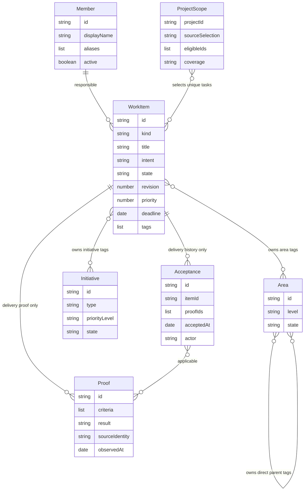

> **DRAFT — provisional contract evidence. Case guards are mapped to authored tests; execution remains unverified. Requirement, story, rule and domain evidence still needs complete source mapping.**

## Related Documentation

| Type | Path | Role |
|---|---|---|
| Governing plan | `plans/261003-task-pbi-tracking/plan.md` | Selected scope and execution obligations |
| Case continuations | `README.TaskTracking-Part2.md`, `README.TaskTracking-Part3.md`, `README.TaskTracking-Part4.md`, `README.TaskTracking-Part5.md`, `README.TaskTracking-Part6.md` | Same capability and stable case identity; Part4 owns operation discovery, linked concerns and publication checkpoints; Part5 owns local author identity and retained attribution; Part6 owns conserved scope, authority and stakeholder journeys; retired purpose-only operations remain explicitly historical |
| Case continuation | `README.TaskTracking-Part7.md` | Same capability and stable case identity; Part7 owns the vocabulary and migration cases |
| Case continuation | `README.TaskTracking-Part8.md` | Same capability and stable case identity; Part8 owns snapshot forms and size, exact area/initiative figures, single-record reads, inert labels and paging |
| Case continuation | `README.TaskTracking-Part9.md` | Current business intents, placement inspection and Implemented delivery standing: area placement, record-owned tags, kind-owned values, initiative decisions, due dates and unsupported first vocabulary |
| Decision record | `docs/adr/0005-work-tracker-vocabulary-and-migration.md` | Vocabulary change, read-only earlier-vocabulary projects, explicit migration and the rejected alternatives |
| Design intent | `team-artifacts/design-specs/task-tracking.md` | Shared preview views/data; P16 selected A, visual verification pending |
| Derived index | [INDEX.md](INDEX.md) | Navigation only; refresh through owning generator |
| Test coverage | `.claude/hooks/tests/suites/task-tracking-*.test.cjs`, `.claude/skills/task-track/tests/workspace-browser.test.cjs` | Authored primary guards are mapped in each case; no test or visual execution result is claimed |

## 1. Overview

Teams capture initiatives, plan delivery and manage responsibility in their own working copies, then share proposed changes through their existing version-control process. Contributors can use an assistant or an optional local workspace to inspect and change the same authoritative work. Progress distinguishes accepted delivery, current verification and work still remaining.

Scope includes initiatives, areas, delivery tasks, stories and enabling subtasks; stable people identities; exact assignment; kind-specific lifecycle changes; current and historical views; linked upkeep; and read-only reconciliation of manual changes. Current portable records use vocabulary 3. Supported earlier vocabulary 2 is mapped for read-only inspection; first vocabulary 1 is unsupported and refused by name. Native record owners retain their own authority and unsupported operations preserve their records.

Stakeholders inspect project scope, an area and its descendant areas, or an initiative and its directly tagged work. Affiliations are stored on the tagged record, rather than on a group member list. Areas may have optional application, product, module or feature levels. Initiatives have idea, feedback or initiative types and an independent person-decided lifecycle. Delivery tasks are independently useful outcomes for a person or consuming system; stories, subtasks, areas and initiatives add no delivery credit.

Area placement permits multiple parents, skipped or equal levels and unset levels while forbidding cycles and a stated parent deeper than its direct child. Optional display labels change text alone. Scope selection preserves exact source, coverage, intent, proof and contextual return. Every snapshot form lists every inspected record of its scope; complete project snapshots show each area and initiative’s own figures without adding overlapping scopes together.

No shared hosted editing, separate account service, cross-copy exclusive ownership guarantee, member ranking, delivery forecasts, implicit migration or automatic acceptance. Optional historical metrics need complete retained observations and a later release decision. The local app requires daily-journey evidence, estimated upkeep and a bounded reuse comparison before release; rejected candidates may not expand the selected local/offline scope.

### Requirement catalog

Each requirement's complete source mapping is **TBD (requirement-level evidence)**. These IDs own the intended outcome independently of any implementation. Authored case guards do not by themselves prove every requirement condition.

| Requirement | Intended outcome |
|---|---|
| FR-TPT-001 | Save minimally defined work with stable identity and its kind’s first state: delivery and initiatives start Draft; areas start Active. |
| FR-TPT-002 | Link governing intent, plans and source initiatives without copying their authority. |
| FR-TPT-003 | Refine releasable outcomes; readiness requires reviewed acceptance and decisions. |
| FR-TPT-004 | Inspect explained placement leads and held affiliations without saving, then organize exact work through record-owned area and initiative tags without cycles, duplicate credit or compulsory wrappers. |
| FR-TPT-005 | Find ready, unblocked work with explained prerequisites and stable ordering. |
| FR-TPT-006 | Recognize supported record versions and reject malformed or unknown declarations. |
| FR-TPT-007 | Apply each authorized record operation once, preserve newer work and return exact results. |
| FR-TPT-008 | Preserve authored body, custom fields, identity and unrelated history. |
| FR-TPT-009 | Work on exact linked items through direct or guided work without invented context. |
| FR-TPT-010 | Allowed linked upkeep reflects observed scoped activity and actual outcomes. |
| FR-TPT-011 | Certified Done requires current applicable proof and an actual scoped acceptance action. |
| FR-TPT-012 | Explain accepted, remaining, canceled and reopened scope with unique membership. |
| FR-TPT-013 | Explain stale proof, unresolved references, interrupted work and missing evidence. |
| FR-TPT-014 | Review consistency without automatically repairing or accepting work. |
| FR-TPT-015 | Provide a readable offline interactive progress snapshot. |
| FR-TPT-016 | Disclose snapshot source, scope, date, coverage and partial/unavailable inputs. |
| FR-TPT-017 | Support keyboard, accessible focus, text status, narrow layouts and print reading. |
| FR-TPT-018 | Treat record content as untrusted data and omit sensitive work details. |
| FR-TPT-019 | Work in a clean adopting project, relocated roots and supported host environments. |
| FR-TPT-020 | Explicit operations remain usable outside guided workflows and with missing instrumentation. |
| FR-TPT-021 | Bound inspection and operations; explain limits and partial results. |
| FR-TPT-022 | Preview authorized repair/relocation and preserve recoverable original records. |
| FR-TPT-023 | Keep dated owner-attested health distinct from activity and delivery. |
| FR-TPT-024 | Do not invent historical flow measurements or forecasts from incomplete observations. |
| FR-TPT-025 | Respect independent work-selection, tracking-update and access controls. |
| FR-TPT-026 | Save only requested artifacts and report actual saved versus pending outcomes. |
| FR-TPT-027 | Preserve artifact meaning and owners across callers and manual reconciliation. |
| FR-TPT-028 | Defined provisional intent can guide work before implementation evidence exists. |
| FR-TPT-029 | Unlinked work may continue; offer linking at a checkpoint without forcing a ticket. |
| FR-TPT-030 | Observe external edits on the next allowed scoped read; do not claim continuous observation. |
| FR-TPT-031 | Keep successful primary saves when secondary updates fail; retry unresolved work only. |
| FR-TPT-032 | Disclose unsupported/untracked/partial paths; prove every claimed scenario independently. |
| FR-TPT-033 | Discover configured artifact owners through concise conditional guidance. |
| FR-TPT-034 | Discover, create or refresh a requested snapshot before requesting its opening. |
| FR-TPT-035 | Preserve one native delivery authority and allow only trusted supported extensions. |
| FR-TPT-036 | Preserve native rules, metrics and evidence meanings; unsupported proof stays unknown. |
| FR-TPT-037 | Select native current-copy versus locally pinned shared snapshots without silent substitution. |
| FR-TPT-038 | Offer optional local work management bound to one selected working copy. |
| FR-TPT-039 | Human and assistant operations share identity, authority, revision and result meanings. |
| FR-TPT-040 | Assign self/others using stable member identity; preserve responsibility history. |
| FR-TPT-041 | Prefer cancel/archive/retire; delete only exact authorized unreferenced drafts or, by its own explicit action with a stated reason and a current preview of what is removed, exact unreferenced ended work (canceled or retired). Open, started or accepted work is canceled or retired first; nothing cascades. |
| FR-TPT-042 | Label local proposals/shared baselines and reveal semantic conflicts after sharing. |
| FR-TPT-043 | Keep local management isolated, scoped, bounded and recoverable. |
| FR-TPT-044 | Maintain exact linked work through feature, defect, specification, planning and direct work. |
| FR-TPT-045 | Reminders observe bounded hints; they do not own status or certify acceptance. |
| FR-TPT-046 | Release only with actual operation, journey, preservation, portability and recovery evidence. |
| FR-TPT-047 | Discover supported work operations through named purposes; explicit assistant and direct operations share authority, refusal and result meanings. |
| FR-TPT-048 | Inspect exact relationships between governing intent, delivery items and enabling work in either direction, with owner, reason and coverage limits. |
| FR-TPT-049 | Receive concise relevant work guidance, including read-oriented module or feature status, progress and report requests, while preserving selection choice, independent tracking controls and the requested primary work. |
| FR-TPT-050 | Reconcile exact linked work against the complete final publication candidate, reread saved updates and state unresolved concerns without accepting delivery. |
| FR-TPT-051 | Use the selected working copy's local author identity without shared member setup when no explicit custom identity is chosen; preserve existing identity choices, permissions and tracking controls. |
| FR-TPT-052 | Retain minimal names for locally attributed work across personal working copies without turning historical attribution into active membership, new assignment eligibility or owner-attested health. |
| FR-TPT-053 | Set or clear optional area levels and maintain record-owned affiliations without rewriting targets or unrelated work. |
| FR-TPT-054 | Inspect exact unique delivery identities in project, transitive area or direct initiative scope, with excluded work and honest coverage. |
| FR-TPT-055 | Navigate area trees, initiative lists, shared affiliations and untagged outcomes while retaining source, entry context and authority. |
| FR-TPT-056 | Read supported earlier vocabulary 2 in current vocabulary 3 without saving; refuse mixed/undecidable projects and older save requests; preserve an earlier report when a replacement is refused. |
| FR-TPT-057 | Explicitly preview and migrate supported earlier vocabulary 2 to current 3 with identities, authored content and eligible/accepted/remaining task sets conserved; disclose standing changes and require safe restore protection. Interrupted work requires explicit safe continuation or whole restoration followed by explicit abandonment. |
| FR-TPT-058 | Choose how much record detail a progress snapshot carries: complete readable detail, the same detail packed for compact sharing, or no record detail; hold the snapshot to a stated size. Unless a form is named, a snapshot is the compact version within a default size and says that it is one; the complete form is written whenever it is requested by name, and the workspace always shows it. Every inspected record of the snapshot's scope stays listed in every form, a snapshot is still never refused for its size, and any detail left out is named together with the way to read it. |
| FR-TPT-059 | Read each area and initiative’s own exact task figures and per-kind status totals without adding overlapping scopes or granting supporting kinds delivery credit. |
| FR-TPT-060 | Read one exact record in full through an explicit work operation, including when a snapshot left its detail out; an identity held by more than one record returns each of them and selects none. |
| FR-TPT-061 | Optionally customize inert kind, area-level and initiative-type display words; validate against the project’s declared vocabulary without changing exchanged values or authority. |

| FR-TPT-062 | Place areas under admissible direct area parents; preserve acyclic placement and stated direct-level ordering, including reverse checks when a level changes. |
| FR-TPT-063 | Set only values owned by the chosen kind; omission preserves, optional null clears, and an initiative type defaults to idea and cannot be cleared. |
| FR-TPT-064 | Approve, commit, close, cancel or reopen initiatives only through explicit permitted person decisions; delivery progress never makes those decisions. |
| FR-TPT-065 | Show due and overdue facts for applicable open work at the UTC read date without changing readiness, acceptance or counts. |

## 2. Glossary

| Term | Meaning |
|---|---|
| Contributor | Person finding, executing or maintaining team work in a personal working copy. |
| Coordinator | Person organizing scope, responsibilities and competing proposals. |
| Assistant | Delegated actor executing permitted work for a person; receives no independent acceptance authority. |
| Work item | Identified initiative, area, delivery task, story or subtask; kind owns its values, lifecycle and delivery contribution. |
| Delivery item | Independently releasable, useful outcome for a person or consuming system, counted once in selected delivery scope; a screen is not required. Stored and shown as a task. |
| Work group | Historical vocabulary-2 project/vision record with a member list; not a current record kind or write operation. |
| Group purpose | Historical vocabulary-2 area/domain/capability/program descriptor used only to explain compatibility mapping. |
| Area | Enduring organizational scope. Optional level is application, product, module or feature; initial state is Active. Its parents are area tags on that area. |
| Domain | Historical descriptive group purpose; migration maps it to an area at module level. |
| Capability | Historical descriptive group purpose; migration maps it to an area at feature level. |
| Program | Historical descriptive group purpose; migration maps its group to an initiative of type initiative. |
| Stakeholder | Person, including an executive, inspecting permitted work and evidence; the title grants no additional access or mutation authority. |
| Selected scope | All admitted project work, one area with its descendant-area union, or one initiative with directly tagged work only. Display filters never redefine scope. |
| Shared affiliation | One record tags several areas or initiatives; each selected scope counts an eligible delivery task identity once. |
| Ungrouped outcome | Historical name for untagged delivery work; it stays inspectable at project scope. |
| Chosen entry path | A selected source and valid area/initiative navigation path retained for return; it grants no exclusive parenthood. |
| Member | Stable team identity with display name, aliases and active/inactive availability. |
| Assignee | Primary member responsible for a record; collaborators and organizational context are distinct. |
| Proof | Result connected to applicable criteria and relevant source identity. |
| Acceptance | Actual authorized decision accepting an exact delivered scope using required current proof. |
| Implemented | A contributor’s recorded declaration that delivery work is built and published for review. Captured intent is enough to record it; the declaration supplies no verification proof, acceptance or delivery credit. |
| Placement lead | Read-only recommendation explained by matching work descriptions or named similar work; it is a reason to inspect an exact owner, never a selected owner, tag or link. |
| Current verification | Confidence from still-applicable current proof; may fall without erasing acceptance history. |
| Local proposal | Change present in a personal working copy, not yet part of the selected shared baseline. |
| Shared baseline | One selected locally available integration revision; its remote freshness can be unknown. |
| Native profile | Project-owned record format, lifecycle, metric and operation rules retaining their original authority. |
| Snapshot | Disposable derived view of named source scope and observations; viewing cannot change work. |
| Work operation purpose | A named choice describing inspection, maintenance, linking, lifecycle action, verification, acceptance, reporting or local management. It does not grant permission. |
| Linked concern | Derived explanation of an exact declared relationship, its owner and current unresolved or stale facts; it is not another authoritative record. |
| Publication candidate | The complete proposed change relative to the selected receiving baseline, including earlier proposed changes and pending work. |
| Saving producer | The actual work owner that successfully saves an artifact or completes a publication checkpoint; nested work retains that owner and its actual context. |
| Local author identity | Stable author address and chosen author name from the selected working copy; supplies attribution when no explicit custom identity is chosen, without establishing access or shared membership. |
| Retained attribution | Minimal stable identity and display name recorded during a permitted save so another person can recognize prior responsibility; historical display alone grants no operational eligibility. |
| Current vocabulary | Portable vocabulary 3: initiative, task, story, subtask and area; each kind has its declared lifecycle and owned values. |
| Earlier vocabulary | Supported vocabulary 2: initiative, task, story, subtask, project and vision; compatible reads map it without saving. First vocabulary 1 is unsupported. |
| Vocabulary declaration | The single project-level statement of which vocabulary the project's stored records use. |
| Vocabulary migration | Explicit one-way supported 2 → 3 conversion; preview and reads never authorize or perform it. |
| Detail form | How much record detail one progress snapshot carries: complete (every record's detail is readable in the snapshot itself), packed (the same detail, held compactly and opened on request through enhanced interactions) or none (the overview and the list of records only). A packed or detail-free snapshot is a compact version; unless a form is named, a snapshot is packed. Record detail is a record's outcome, criteria, links, responsibility, proof, acceptance and history, together with the separately labelled group and linked-concern inspections. |
| Size budget | Upper size a reader states for one snapshot or a project configures for the snapshots it configures. Unstated, a compact snapshot is held to 15 MB and the complete form to none. It selects the richest detail form that fits and never removes a record from the list. |
| Group figures | For one group, the eligible, accepted, currently verified and remaining delivery counts and the percentage of that group's own exact Delivery scope, shown beside other groups in a project snapshot and never added together. |
| Kind display label | A project's own display word for a kind; inert text that changes no stored word, identity, count or request. |

Actors are Contributor, Coordinator, Assistant and Stakeholder. These are participation roles, not a new account or access-control hierarchy.

| Initiative | Intent of type idea, feedback or initiative, initially idea/Draft; its Draft → Approved → Committed → Done decisions are independent of task acceptance. |

| Tag | Area or initiative affiliation owned by the tagged record. A supplied relation replaces that set; omission preserves it and an empty set clears it. |

| Due / overdue | An applicable deadline is a real YYYY-MM-DD date. Open nonretired work is overdue only after that date in UTC; this fact grants no delivery or decision authority. |

## 3. User Stories & Acceptance Criteria

Each row is a story in the form **As a** named actor, **I want to** the action, **so that** the stated value. Each criterion includes observable success and refusal; referenced rules govern both. Complete story-level evidence is **TBD (story-level source mapping)**; the related case guards are mapped separately.

| Story | Actor; action; value | Acceptance criterion |
|---|---|---|
| US-TPT-01 | Contributor; capture minimal work; preserve identity and kind meaning | AC-TPT-01: Given permitted minimal title and intent, when I capture a current kind then its stable identity and kind-owned first state are saved: initiative/ delivery Draft or area Active, with initiative type idea by default and no delivery credit (BR-TPT-01/02/27/30). |
| US-TPT-02 | Coordinator; refine releasable outcomes; avoid counting technical chores as delivery | AC-TPT-02: Given an initiative, when I request refinement, then requested delivery items retain lineage; incomplete decisions cannot promote Ready (BR-TPT-03/04). |
| US-TPT-03 | Coordinator; organize and prioritize exact work; find ready delivery | AC-TPT-03: Given valid tags and priorities, when I inspect selected project/area/initiative work then eligible tasks are unique, ordering is numeric priority then stable identity, and readiness exposes unmet prerequisites; organization grants no credit (BR-TPT-03/04/05/27/28). |
| US-TPT-04 | Contributor; record a selected item’s work standing; make actual work visible | AC-TPT-04: Given delivery work in Draft, Planned, Ready or In progress with captured intent, when I declare it built and published for review then it becomes Implemented without needing criteria, readiness review or assignment and earns no acceptance; automatic upkeep cannot record that declaration. Starting exact Ready work, or returning Implemented work to In progress, requires the applicable current readiness and responsible member; ambiguous/all-linked selection changes nothing (BR-TPT-03/06/07/14). |
| US-TPT-05 | Contributor; record and resolve a blocker; resume valid work | AC-TPT-05: Given active work, when I block with a reason then the reason/prior state remain visible; resume without resolution/current prerequisites is refused (BR-TPT-06). |
| US-TPT-06 | Coordinator; verify and accept an outcome; count delivered scope honestly | AC-TPT-06: Given Implemented work, when I request Verifying then current criteria, reviewed readiness, resolved decisions, current prerequisites and an active responsible member are required; missing facts preserve Implemented. Given Verifying work with current required proof, when I accept exact scope then acceptance is recorded; missing/failed/stale proof refuses certification (BR-TPT-03/06/07/08). |
| US-TPT-07 | Contributor; open current status; understand remaining scope without finding paths | AC-TPT-07: Given a status request, when I open then current permitted inputs are reflected before launch request; generation/opening failures remain separate (BR-TPT-09/10). |
| US-TPT-08 | Coordinator; inspect stale proof; preserve delivered history | AC-TPT-08: Given accepted work and relevant later changes, when I inspect then current verification falls with a reason; historical acceptance is retained (BR-TPT-07/08). |
| US-TPT-09 | Coordinator; change scope deliberately; see why arithmetic changed | AC-TPT-09: Given three unique items and one accepted, when adding a fourth then 1/4 accepted and three remain; filters cannot change that scope (BR-TPT-04/08). |
| US-TPT-10 | Coordinator; inspect old records; adopt without losing history | AC-TPT-10: Given existing records, when I inspect/preview repair then content and old recorded Done stay visible; no unrequested migration or invented proof occurs (BR-TPT-02/11). |
| US-TPT-11 | Contributor; recover competing edits/retries; preserve team work | AC-TPT-11: Given a newer competing save, when I save old work then a conflict preserves my draft/current record; completed retries cannot double-apply (BR-TPT-02/12). |
| US-TPT-12 | Contributor; save specifications and delivery items directly; maintain correct owners | AC-TPT-12: Given exact save intent, when I save then only requested owners change; no automatic partner record/readiness/delivery is inferred (BR-TPT-01/03/13). |
| US-TPT-13 | Contributor; implement defined provisional intent; avoid evidence deadlock | AC-TPT-13: Given complete provisional behavior, when I work then absent implementation proof does not block start; missing required behavior blocks only that decision (BR-TPT-03/13). |
| US-TPT-14 | Contributor; disable optional tracking/selection; retain direct work | AC-TPT-14: Given off/observe/skip choice, when I work then primary work continues under actual access; unsolicited records/flows are not created (BR-TPT-01/14/15). |
| US-TPT-15 | Coordinator; inspect manual changes; reconcile current truth | AC-TPT-15: Given an external edit, when I next inspect permitted scope then current content and gaps appear; no immediate observation or automatic semantic repair is claimed (BR-TPT-10/16). |
| US-TPT-16 | Contributor; retain successful saves; repair secondary failures safely | AC-TPT-16: Given saved intent and a failed link/report update, when I inspect then saved and pending results are separate; retry touches only unresolved work (BR-TPT-12). |
| US-TPT-17 | Contributor; save native intent; preserve one project authority | AC-TPT-17: Given native owners, when I save requested intent then existing identities/coverage remain; unsupported extra coverage creation leaves a pending gap (BR-TPT-11/13). |
| US-TPT-18 | Coordinator; assign native delivery; preserve actual owner rules | AC-TPT-18: Given an exact previewed leaf set and requested active stable member, when supported native assignment applies then each applied leaf reads back that member; every selected leaf has an explicit applied/refused/pending outcome, unresolved results show actual unchanged/current ownership, and unselected leaves/coordinator remain unchanged; an unproved whole write footprint refuses every affected write (BR-TPT-11/17). |
| US-TPT-19 | Coordinator; choose native working/shared status; inspect honest scope | AC-TPT-19: Given a selected current/shared scope, when I view then one named source is used; unavailable shared revision cannot substitute current work or fetch implicitly (BR-TPT-10/11/18). |
| US-TPT-20 | Coordinator; inspect native freshness/history; avoid destroying project meaning | AC-TPT-20: Given archives/aliases/feedback, when I review then native metric meaning/history/unknown dates remain; no portable acceptance is fabricated (BR-TPT-07/11). |
| US-TPT-21 | Contributor; open one local workspace; avoid changing the wrong project | AC-TPT-21: Given selected working copy/profile, when I open then scope/capabilities are visible and nothing canonical is written; incompatible/unsafe scope is refused (BR-TPT-10/15/18). |
| US-TPT-22 | Contributor; create/edit through UI or assistant; get equivalent outcomes | AC-TPT-22: Given the same exact authorized change, when either surface saves then the same record/rules/result apply; stale revisions retain drafts (BR-TPT-02/12/15). |
| US-TPT-23 | Coordinator; assign self/others and inspect people; understand responsibility | AC-TPT-23: Given an active stable member, when I assign then owner changes without starting/accepting; unknown/inactive/ambiguous identity refuses change (BR-TPT-17). |
| US-TPT-24 | Coordinator; remove obsolete work; retain references/history | AC-TPT-24: Given obsolete referenced work, when I remove then cancel/archive/retire preserves history; hard deletion is only permitted for an exact unreferenced draft or, by its own explicit action with a stated reason and a current preview of what is removed, exact unreferenced ended work (canceled or retired); open, started or accepted work is canceled or retired first and nothing cascades (BR-TPT-19). |
| US-TPT-25 | Coordinator; share and reconcile proposals; distinguish local and agreed responsibility | AC-TPT-25: Given competing personal changes, when shared scope is reread then identity/member/link/proof conflicts are surfaced; text merge alone cannot certify validity (BR-TPT-18). |
| US-TPT-26 | Assistant; maintain exact linked work during delivery; reduce duplicate manual upkeep | AC-TPT-26: Given allowed exact linkage, when actual work checkpoints occur then scoped activity/blocker/proof changes reflect observed outcomes; editing/stopping/green results never accept work (BR-TPT-07/14/16). |
| US-TPT-27 | Contributor; recover missing instrumentation; keep progress honest | AC-TPT-27: Given missing reminders or unlinked work, when I continue then no forced ticket appears and next allowed inspection reconciles; unsupported immediate upkeep stays explicit (BR-TPT-14/16/20). |
| US-TPT-28 | Contributor; choose a supported work operation; maintain exact work directly or with an assistant | AC-TPT-28: Given an exact authorized request, when I choose its purpose then supported operations explain and apply the same rules through either entry; omitted purpose inspects, and unknown purpose or unsupported capability changes nothing (BR-TPT-01/07/12/21). |
| US-TPT-29 | Coordinator; inspect links from intent or work; find exact coverage and freshness concerns | AC-TPT-29: Given a selected owner or item, when I inspect relationships then each result names the exact owner, relation, direction and current concern; missing, ambiguous or bounded scope remains qualified without guessed repair or copied criteria (BR-TPT-05/10/13/22). |
| US-TPT-30 | Contributor; receive useful guidance for a work request; retain my control over procedures | AC-TPT-30: Given a relevant request, when guidance is eligible then a concise notice names the available purpose or concern; unrelated or quoted content stays silent, and restricted selection, Skip, off, observe and opt-out retain their distinct effects (BR-TPT-14/15/20/23). |
| US-TPT-31 | Assistant; check exact linked work before finishing publication; report honest saved and pending outcomes | AC-TPT-31: Given an authorized publication task, when I check its final complete candidate then exact linked concerns and uncovered scope are explicit, authorized updates are saved and reread, and my final self-check identifies remaining reasons; changed candidates require a fresh check and publication alone grants no acceptance (BR-TPT-07/12/13/24). |
| US-TPT-32 | Contributor; use my locally configured author identity; maintain permitted work without shared enrollment | AC-TPT-32: Given no explicit custom identity and a usable author address in my selected working copy, when I request a supported identity-dependent action then it uses my resolved stable identity and author name, or full address when the name is missing; explicit custom choices remain selected, unusable identity is explained without substitution, and existing permission and tracking controls remain unchanged (BR-TPT-14/15/17/25). |
| US-TPT-33 | Coordinator; recognize previous local contributors after sharing; distinguish historical attribution from available members | AC-TPT-33: Given work saved by a local contributor and later inspected by another person, when I read responsibility then its retained identity/name remain visible without shared enrollment; historical names grant no acting, new assignment or health-owner eligibility, and health stays Unknown without an eligible declared owner even when a dated attestation is retained (BR-TPT-08/17/26). |
| US-TPT-34 | Coordinator; maintain exact record affiliations; organize work without changing targets | AC-TPT-34: Given current permitted records, when I preview and save supplied area or initiative tags then only that record changes, omitted relations are preserved and empty sets clear; invalid targets, an empty patch, stale revision or denied authority preserve saved facts and the draft (BR-TPT-02/05/12/15/27). |
| US-TPT-35 | Stakeholder; inspect an area and its descendants; see exact delivery scope | AC-TPT-35: Given a permitted source, when I select an area then its transitive area union yields the exact unique eligible task list and denominator; direct child areas remain distinct, and incomplete inputs yield reasons without complete figures; Back preserves selected scope (BR-TPT-04/05/10/28/29). |
| US-TPT-36 | Stakeholder; inspect initiatives, shared and untagged work; retain one identity | AC-TPT-36: Given overlapping affiliations, when I select an initiative then only directly tagged work belongs to it; area and nested-initiative paths add no work. Shared and untagged records remain reachable with source, identity and return context preserved; filters and labels add no authority (BR-TPT-04/15/27/28/29). |
| US-TPT-37 | Stakeholder; inspect a supported earlier project; retain records and exact progress | AC-TPT-37: Given vocabulary 2, when I inspect working or pinned source then the current 3 kinds, levels, types, states and tags are shown without saving and with equal total/accepted/remaining/eligible task sets; every save refuses and upkeep skips. Mixed or undecidable input refuses; vocabulary 1 refuses by name with a safe next step (BR-TPT-10/28/30). |
| US-TPT-38 | Coordinator; explicitly migrate a supported earlier project; conserve content and task credit | AC-TPT-38: Given supported vocabulary 2 and all migration preconditions, when I preview then explicitly migrate then only owned representation changes, authored content and identities remain, exact task sets and counts are equal, and standing changes are disclosed. Unsafe input refuses unchanged; interrupted work requires safe explicit continuation or whole restoration followed by explicit abandonment; repetition changes nothing (BR-TPT-02/12/20/28/30). |
| US-TPT-39 | Stakeholder; read a progress snapshot sized for where I open it; follow status away from the working copy without losing sight of any record | AC-TPT-39: Given a permitted selected source, when I ask for a snapshot in the complete, packed or detail-free form, or with a size budget, then every inspected record of that scope is listed in each form with identical counts, the packed form shows exactly the detail the complete form shows, a budget writes the richest form that fits and still writes when none fits, and each snapshot that leaves detail out says so and names the way to read it; with no form named I get the compact version within the default size, which says that it is one, and I get the complete form whenever I request it by name or read the snapshot in the workspace; a snapshot is never refused for its size and a separately requested form never replaces the default one (BR-TPT-09/10/20/31). |
| US-TPT-40 | Stakeholder; compare area and initiative delivery and per-kind standing | AC-TPT-40: Given complete permitted scope, when I read its snapshot then every area/initiative figure equals that scope’s independent snapshot and overlapping figures are never added. Missing or cut coverage withholds all such figures together; per-kind status totals preserve kind lifecycles and grant only tasks delivery credit (BR-TPT-04/10/28/32). |
| US-TPT-41 | Contributor; read one exact record in full on request; act on a record whose detail a snapshot left out | AC-TPT-41: Given a permitted exact identity, when I ask for that record then I read its outcome, criteria, links, responsibility, proof, acceptance and history as currently stored and nothing changes; an identity held by more than one record returns each of them and selects none, and an unknown or denied identity is named without a substitute (BR-TPT-02/05/10/21/31). |
| US-TPT-42 | Coordinator; customize familiar display words; preserve exchanged values | AC-TPT-42: Given the project’s declared vocabulary, when I configure kind/level/type display labels then bounded nonblank inert text appears consistently while records, values, counts and authority stay unchanged; invalid labels and kind-word collisions refuse by named cause (BR-TPT-27/30/33). |

| US-TPT-43 | Coordinator; place areas; preserve valid organization | AC-TPT-43: Given current areas, when I set parents or a level then application has no parent and every stated direct parent is no deeper than its child; equal/skipped/unset levels are allowed; self/cycle/deeper-parent or reverse-invalidating edits refuse unchanged (BR-TPT-05/27). |

| US-TPT-44 | Contributor; edit only kind-owned values; preserve omitted facts | AC-TPT-44: Given a current record, when I set its type, priority level, level or deadline then only its applicable valid fields change; omission preserves and optional null clears; required initiative type cannot clear and numeric ordering remains independent (BR-TPT-02/27). |

| US-TPT-45 | Coordinator; decide an initiative’s lifecycle; distinguish commitment from delivery | AC-TPT-45: Given actual decision authority, when I approve/commit/close/cancel/reopen an initiative then its declared transition, required intent and reasons are enforced without automatic task acceptance or closure; forbidden steps and intent/criteria edits while Done refuse unchanged (BR-TPT-06/07/08). |

| US-TPT-46 | Stakeholder; inspect due and overdue work; retain honest delivery facts | AC-TPT-46: Given a real deadline, when I inspect at the UTC read day then only open nonretired work after its due day is overdue; invalid dates refuse and changing a date never changes readiness, acceptance or delivery counts (BR-TPT-10/27/31). |

| US-TPT-47 | Contributor; inspect where described or exact existing work belongs; judge organization before changing it | AC-TPT-47: Given a work description or exact existing identity, when I inspect placement then matching areas, initiatives, similar records and governing specifications explain their own matching words or named witnesses; existing tags, missing affiliations and possible duplicates remain distinct. I can browse direct area children; ended targets are omitted, an area receives no initiative lead, and missing/ambiguous owners or invalid/over-limit requests refuse without selecting or saving anything (BR-TPT-02/05/20/22/23). |

## 4. Business Rules

All rules below are **[HARD]**. Each universal statement applies to every operation in its declared domain. Complete rule-group evidence is **TBD (universal-rule source mapping)**; a mapped case guard does not establish every value in a rule domain. Messages describe the business reason.

| Rule | Universal statement and condition | Refusal/visible outcome |
|---|---|---|
| BR-TPT-01 Requested scope | For all discussion, quotation and work requests, only trusted exact save/update intent or established allowed linkage can change work. No guessed ticket or acceptance. | “No tracked item selected”; continue untracked and offer linkage at a checkpoint. |
| BR-TPT-02 Preservation | For all supported edits, only explicitly owned fields change; identity, authored body/custom content and unrelated history are retained. Root changes never migrate automatically. | “Existing content preserved; requested change was not saved” on collision/unsafe format. |
| BR-TPT-03 Readiness | For ALL delivery-kind Ready transitions and usual steps from Implemented to In progress or Verifying, reviewed outcome, current criteria, resolved decisions and current prerequisites are required. The latter steps also require an active responsible member. Recording Implemented itself needs captured intent alone and is not readiness approval. Initiative closure as Done may satisfy a prerequisite; an area never finishes and cannot satisfy one. Supporting kinds earn no task credit. | Explain the exact unmet prerequisite; preserve prior state. |
| BR-TPT-04 Unique scope | For all project rollups, count each eligible delivery identity once; groups/stories/subtasks/initiatives never add delivery credit. Canceled scope is disclosed/excluded; partially known scope stays qualified. | “Scope incomplete” or “No delivery scope”, never a guessed complete percentage. |
| BR-TPT-05 Relationships and placement | For ALL links and tags, targets have one valid selected-project owner; self-links, forbidden cycles and ambiguous/missing owners refuse. Tags reference the correct kind and are unique. Area parents are area tags only; application has none. Each stated direct parent level is no deeper than its direct child; equal/skipped/unset levels are permitted. A level edit checks direct children as well as parents; unstated levels do not impose a transitive ordering constraint. Placement inspection is read-only: explain leads by their own matching words or named similar-work witnesses, show an exact record’s held tags and missing affiliations separately, exclude itself from similar work and label possible duplicates without equating identities. Areas show ancestry and directly browsable children; canceled/retired targets are omitted and an area receives no initiative lead. A lead never selects, tags or links work; missing/ambiguous exact subjects and invalid or over-limit inspection requests refuse unchanged. | Name unresolved target, cycle or invalid direct placement; preserve exact prior facts. |
| BR-TPT-06 Kind lifecycle and correction | For ALL usual state actions, only the kind’s declared transitions apply with current prerequisites. Initiative steps require actual person decision authority: approval requires stated intent; close, cancel and reopen require a reason. Delivery blockers require reason/resolution and valid prior state. A usual Implemented declaration is available from Draft, Planned, Ready or In progress with captured intent alone; Blocked work resumes before taking that step. It records built-and-published standing, not independent publication proof. Leaving Implemented for In progress or Verifying needs the current readiness and responsibility facts in BR-TPT-03; cancellation requires a reason. A separate explicit reasoned correction uses manual-record authority, not additional decision authority; it may target only a state of that kind, retains target prerequisites, requires intent for initiative Approved/Committed/Done, and cannot place delivery work in Done. Automation performs no initiative or area decision. | Unavailable transition, missing decision/reason/intent or invalid correction refuses with pre-state/history preserved. |
| BR-TPT-07 Delivery acceptance | For ALL proof/accept actions, only delivery kinds are applicable. Certified delivery Done requires exact current applicable passing proof and actual scoped accepting authority. Latest applicable failed/skipped observations cannot borrow older passes; same-time contradictions cannot certify. Implemented standing, initiative closure and area cancellation are not proof or acceptance. | Acceptance pending or operation inapplicable; no fabricated delivery. |
| BR-TPT-08 Confidence and closed intent | For ALL relevant later changes, preserve historical acceptance and reduce only affected current confidence. Initiative task completion never closes the initiative; its closure may precede open tasks. A Done initiative’s intent or criteria cannot be edited until explicit permitted reopening/correction. Reopen/rescope changes delivered scope explicitly; health requires eligible owner/date/reason. | State the stale criterion or required reopening; preserve retained facts. |
| BR-TPT-09 Snapshot boundary | For all status views, viewing/filtering/reloading a snapshot cannot persist item changes. Initial open ensures current allowed output; filters do not redefine scope; printing retains labels. | “Snapshot” with source/as-of/coverage; generated versus opening outcomes separate. |
| BR-TPT-10 Inspection honesty | For all inspection scopes, unavailable/denied/partial input is distinct from empty. Currentness depends on selected content/criteria/proof/scope identity, not age alone. Existing outputs grant no broader access. | “Partial”, “Unavailable”, “No tracked work”, or dated fallback with exact limitations. |
| BR-TPT-11 Native authority | For all native operations, preserve project-owned states, fields, histories, dates, aliases, metric units and owners. Unsupported or unproved whole-footprint mutation/refresh is refused without substitute authority. | “Unsupported native operation; original records preserved.” |
| BR-TPT-12 Save/retry | For all saves, expected current revision and operation identity protect cooperating edits; same completed request applies once, changed reused request is refused. Primary and secondary outcomes remain separate; retry only unresolved work after reread. | “Conflict; review current item”, or “Saved; linked update/refresh pending.” |
| BR-TPT-13 Artifact ownership | For all specifications/plans/designs/refinements, governing requirements/cases/sequence remain at their actual owners. Saving one does not create companion tickets or duplicate criteria unless requested. Defined provisional intent can be implemented before proof exists. | “Coverage/link pending” or “Required behavior undecided”; no false promotion. |
| BR-TPT-14 Independent controls | For ALL direct/guided/automatic work, selection, tracking off/observe/linked, opt-out, refresh and actual access are independent. Automatic upkeep records observed activity and allowed delivery start/block/handoff only; it never records Implemented, edits tags, changes initiative/area state or accepts delivery. Supplying an observed transition does not authorize an automatic Implemented declaration. Stop-policy changes prevent the next optional save, retaining earlier success. | Explicit skipped/pending/refused upkeep while primary work continues. |
| BR-TPT-15 Local authority | For all local management operations, authority is bound to the selected working copy/session/profile and permitted scope; foreign context, untrusted embedded instructions and oversized requests cannot widen it. | “Operation not permitted for this workspace”; records preserved. |
| BR-TPT-16 Observations | For all updates/reviews/reminders, exact scoped observed facts drive activity/proof changes. Manual/outside-host work reconciles on next allowed scoped inspection. Findings/dirty hints never own status. | Candidate/gap/recovery result with no invented immediate observation or all-item repair. |
| BR-TPT-17 Responsibility | For all assignment changes, resolve an active stable member or currently validated local author, exact item and scope; aliases/history survive renaming/deactivation; local self-preference is not authorization. Historical display does not make a person an available assignment target. Assignment does not start/accept; coordinator is not leaf ownership. Existing permitted unassignment by an inactive custom actor remains permitted; inactivity is not a blanket denial of every operation. | “Member inactive, unknown or ambiguous” for an ineligible new assignment; no impersonation or silent change of actor. |
| BR-TPT-18 Sharing | For all local/shared views, label proposals versus one locally pinned baseline and disclose missing/unknown freshness. Personal copies have no global exclusive claim. Sharing/merge success cannot replace semantic checks or authorize publishing. | “Shared baseline unavailable” or a semantic conflict; no silent scope substitution. |
| BR-TPT-19 Conservative removal | For ALL deletion requests, refuse incoming references, including tags, and never cascade. Exact unreferenced untouched Draft work or an untouched Active area may use the narrow delete action; assigned/placed/started work does not qualify. Explicit deletion of exact unreferenced canceled/retired work additionally needs its own reason and current preview. Other open or accepted work is canceled/retired first. | Preserve records and name references or unmet removal preconditions. |
| BR-TPT-20 Bounds/operability | For all operations, declared limits, supported capabilities and partial results remain visible. Closing a workspace stops new work and allows already admitted work to settle within its declared shutdown bound; closure cannot claim success before that work and its result settle. If the bound expires, the outcome remains explicitly uncertain until reread or retry with the original operation identity; interrupted communication does not prove cancellation. Repeated close requests share the same outcome. No background full-inventory surveillance or generated-output loop. Optional app failure keeps explicit operations/allowed snapshot usable. | Useful bounded recovery or unavailable capability; never fictitious completed upkeep or a saved/canceled claim for an uncertain operation. |
| BR-TPT-21 Operation purposes | For all named work purposes, inspect, maintain, link, lifecycle, verify, accept, report and serve expose only supported existing operations and their actual prerequisites. An omitted purpose is inspect; an unknown purpose refuses without change. The assistant and direct operation interface use the same authority and result meanings. Verify inspects current evidence and gaps; it cannot manufacture proof. Test/review proof and arbitrary activity without an actual supported observation path are unavailable; explicit manual proof remains labelled and requires its own authority. Accept requires the actual scoped human decision and current proof. | “Unknown work purpose”, “Unsupported capability” or the exact prerequisite/refusal reason; no invented write or observation permission. |
| BR-TPT-22 Exact concern navigation | For all relationship inspections, derive incoming and outgoing navigation from exact declared relationships without saving reciprocal copies or duplicating requirements. Name each governing owner, relation, direction and current confidence. Matching text or overlapping changed locations can signal a concern but cannot select an item for mutation or establish semantic equivalence. Missing, duplicate, deleted, foreign or ambiguous owners and unsupported owner-qualified cases remain unresolved. Bound inspection and disclose visited scope, omissions and unavailable capabilities. | “Relationship unresolved”, “Coverage partial” or “No exact linked work”; no guessed join, repair, replacement record or falsely complete coverage. |
| BR-TPT-23 Advisory guidance | For all ordinary work or publication requests, including trusted read-oriented module/feature/initiative status, progress and report requests, guidance is concise, relevant, bounded and advisory; it never changes canonical work or proves that a procedure was executed. Unrelated requests, quoted instructions and a generic request to implement a feature alone produce no hierarchy-read notice. Preserve the governing selection policy: a restricted unrequested heavy procedure requires its single choice and answer; named requests and authorized required calls retain eligibility, and Skip is not replaced by another unrequested procedure. Tracking off suppresses optional work guidance, observe allows guidance without optional saves, and linked mode allows only exact authorized checkpoint updates; opt-out remains enforced. | Silent ineligible guidance, or a useful scoped notice/choice; unavailable guidance preserves the primary task and grants no authority. |
| BR-TPT-24 Publication reconciliation | For all publication checkpoints, inspect the complete actual candidate against its receiving baseline, including earlier proposed changes and pending work. A pending integration excludes unrelated receiving-side changes from the candidate. Candidate changes during review or repair invalidate the prior concern check. Check exact linked work, save only authorized supported updates, reread results, and explicitly self-check whether final linked concerns are saved or pending with reasons. Standalone publication uses its actual saving producer; nested work retains the actual linked producer/context and one owner records each actual checkpoint once. Optional failure retains the primary success and retries only the unresolved update with its original request identity. | “Checked final candidate; linked updates saved” or exact pending/skipped/untracked reasons; no acceptance, fictitious proof, duplicate checkpoint or repeated successful publication. |
| BR-TPT-25 Local identity | For all identity-dependent actions, an explicit custom identity takes precedence and retains its operation-specific eligibility; invalid or inactive explicit choices never silently become another author. With no explicit choice, use only the selected working copy's usable author address/name; an unambiguous declared identity match keeps that custom identity, and missing name alone uses the full address. Author addresses and email aliases use visible basic Latin letters, digits and punctuation, exactly one at-sign with nonempty portions, and no spaces or control characters; they are at most 254 characters. Compare email addresses without letter case; an automatic local identity uses the lower-case address, while a matched declared custom identity keeps its spelling. Local display names are at most 254 characters; declared custom display names retain their 160-character limit. No mailbox or remote validation is required. Missing, malformed, ambiguous or overlong identity refuses the affected action without changing work or shared membership/settings. Identity supplies attribution only; existing explicit capture without declared members, inactive custom-owner unassignment, access, proof and acceptance rules remain intact. An implicit identity change before a write requires renewed selection; retries cannot switch the retained request's actor. Ordinary inspection, reports and advisory guidance require no local author lookup, and optional off/observe upkeep stops before identity lookup. | “Local author identity unavailable”, “Identity ambiguous”, “Identity exceeds the allowed length” or “Selected actor changed”; permitted reads and primary untracked work remain available without guessed enrollment or broader authority. |
| BR-TPT-26 Attribution and health | For all permitted saves using a validated local author absent from declared members, retain only bounded stable identity and display name needed to recognize that contributor. Preserve earlier attribution; declared member names take precedence and need no redundant captured name. Viewing or sharing cannot add membership or rewrite earlier attribution. Historical names remain display-only, unavailable for new assignment and ineligible to establish owner-attested health. A permitted dated attestation may remain recorded, but a later inspection without an eligible declared owner shows health Unknown with that limitation; an eligible declared owner's actual dated attestation remains recognizable under the existing policy. | Historical responsibility remains readable; “Historical attribution only” or “Health Unknown: eligible declared owner unavailable”; no new acting authority, fabricated health, acceptance or delivery credit. |
| BR-TPT-27 Record-owned affiliations and values | For ALL tag saves, only the tagged record owns area/initiative affiliation. Each supplied relation replaces its set, an omitted relation preserves it, an empty set clears it, and a request with neither relation refuses. Targets are existing unique correctly typed nonself identities; an area may tag only parent areas. Ordinary non-tag linking preserves all tags and refuses tag relations in its list. Capture stores initial tags on its new record alone. Initiative owns type (feedback/idea/initiative, default idea, never null), optional priorityLevel (high/medium/low) and deadline. Area owns optional level (application/product/module/feature), never deadline. Task/story/subtask own optional deadline. Omission preserves; null clears optional values only; unknown or foreign-kind values refuse. Numeric priority 1–999 remains independent ordering. | Name invalid target/value/kind or empty patch; no target write or lost omitted field. |
| BR-TPT-28 Exact selected work | For ALL scopes, project selects all admitted work; an area selects itself, all descendant areas and records tagged to any area in that union; an initiative selects itself and directly initiative-tagged records only. Other links, area membership or nested initiative affiliation do not extend initiative scope. Count each eligible noncanceled nonretired task once, regardless of tag order or overlap. Supporting kinds add no delivery credit; excluded work remains labelled. Missing/ambiguous/cyclic/bounded input never yields complete figures or a guessed owner. | List inspected identities and unresolved/cut reasons; no complete percentage for partial, empty or unavailable scope. |
| BR-TPT-29 Truthful scope navigation | For ALL scope journeys, expose the area tree, initiative list and untagged work without compulsory wrappers. Keep source, selected delivery scope, identity, coverage, chosen entry context and useful return. A workspace selection explicitly changes scope; following separately labelled inspection links in a generated snapshot does not. Scoped snapshots carry only selected records and needed area ancestry; outside affiliations are named as outside without leaking outside detail. Plain/print reading and missing/denied links retain honest context. | Name unavailable path or outside/unresolved relation; no invented ancestry, substituted record or scope expansion. |
| BR-TPT-30 Vocabulary compatibility and explicit migration | For ALL portable projects, current vocabulary is 3 and supported earlier is 2. Resolve from a valid declaration or unambiguous supported record evidence; mixed/undecidable input refuses. First vocabulary 1, including first-only locations or stamps, is unsupported: reads, writes and migration refuse by name with an upgrade/recovery next step; no automatic reinterpretation. Earlier 2 reads map through one shared business mapping without saving; every save/preview-of-save refuses and upkeep skips until explicit migration. Current requests require version 3; older requests are refused whole. Explicit 2→3 migration offers a nonmutating preview, requires wholly readable/mappable portable source, unique safe destinations, no unfinished deletion, conserved exact task sets, and a restorable point: clean tracked owned paths or the person’s actual confirmation of a restorable backup when Git cannot restore them. Unknown Git status names its cause; preview may describe unmet protection but cannot authorize writing. Mapping converts program-purpose project/vision to initiative type initiative, other project/vision to area, and prior initiative to type idea. Area-purpose maps to product, or module when nested beneath another area-purpose; domain→module, capability→feature, unset→unset. Area current state becomes Active except Canceled; initiative Draft stays, Planned→Approved, Ready/In progress/Blocked/Verifying→Committed, Done/Canceled stay; delivery and historical states stay. Former membership becomes record-owned tags. Nested programs and crossing area/program scope preserve direct nongroup delivery membership and disclose dropped organizational edges; invalid level ordering clears the mapped level and is disclosed. Inert labels map to their applicable level/type owners or refuse before change. Identities, revisions, authored content, proof, history and receipt meaning remain; exact eligible/accepted/remaining task sets and totals are confirmed equal, while changed current verification/ready standing is disclosed. Interrupted/failed migration makes reads, writes and report refresh unavailable; explicit safe continuation completes, or whole source restoration followed by explicit abandon exits. External restoration never implies abandonment; changed unsafe source refuses with both recovery choices. Repeating completion changes nothing; a later stray old record is named and excluded. A refused replacement preserves the previous report. | Name every unmappable, unsafe, unsupported or recovery condition before changing source; no implicit migration, guessed count or claimed restore proof. |
| BR-TPT-31 Complete readable snapshot forms and due facts | For ALL snapshots, complete/packed/detail-free forms list every inspected scoped record with equal counts; packed restores complete detail, omission is named with a full-read route, and a budget chooses the richest fitting form but never refuses the list for size. Default is labelled compact; explicit complete is honored and requested forms stay separate. Report lists page by 20 and workspace area/initiative lists by 10; independent paging preserves reachability and context, while plain/print exposes all rows. Applicable deadlines are real YYYY-MM-DD dates; at a UTC read day, only nonretired work not Done/Canceled is overdue when the day is later than the due date. Date facts grant no readiness/acceptance/count change; a changed read-day overdue fact invalidates snapshot currentness even without file edits. | Explain omitted detail, invalid date, budget/result size or stale snapshot with an available next read. |
| BR-TPT-32 Independent scope figures and kind standing | For ALL complete snapshots, each area/initiative’s task figures equal that independently selected scope. Shared tasks may belong to several figures but figures are never summed. If any needed organizational coverage is partial, withhold all area/initiative figures together with reasons. Count inspected records once in their kind’s own states with canceled/retired separate; delivery standing excludes areas and initiatives, which have separate tables and never grant task credit. | Incomplete figures withheld; no unsupported complete percentage or pooled lifecycle. |
| BR-TPT-33 Inert declared-vocabulary labels | For ALL display labels, optional kind/level/type words are nonblank trimmed text, at most 160 characters in raw accepted input, with no control characters. Kind labels cannot collide with another declared vocabulary word or another kind’s label. Evaluate against the project’s declared vocabulary: an earlier-valid label cannot silently become a current kind label. Labels remain inert data, preserve exchanged values, counts, locations and permission, and do not select owners. | Named configuration field/collision; no execution, new authority or stored-word substitution. |

### Work operation purposes

These are actor-facing purposes; each permitted action still follows the existing lifecycle, ownership and authority rules.

| Purpose | Requested outcome |
|---|---|
| inspect | Read scoped work, ready choices and exact linked concerns; default when no purpose is supplied. |
| maintain | Capture, refine, adopt, assign, tag, update kind-owned values, retire, restore, attest health, delete an eligible draft or, by its own explicit action with a stated reason, delete exact unreferenced ended work (canceled or retired), each with required preview and authority. Open, started or accepted work is canceled or retired first; nothing cascades. |
| link | Maintain canonical relationships or explicitly link/unlink session work; distinguish these two outcomes before acting. |
| lifecycle | Plan, promote Ready, start, block, resume, hand off for verification, cancel or reopen through declared transitions. |
| verify | Inspect applicable criteria, source, proof and reconciliation gaps; report unavailable proof entry paths honestly. |
| accept | Record the actual human decision for exact verifying work with current required proof. |
| report | Inspect or refresh a named read-only progress snapshot; generation and opening remain distinct. |
| serve | When the person asks the assistant to open local management, enable supported writing for the selected actor and scope unless read-only access is explicitly requested. A direct launch without an explicit writing choice remains read-only. Opening grants no authority for the assistant to save work. |

## 5. Domain Model

The model is lightweight work records with business-owned invariants, not a new account hierarchy or tactical DDD aggregate. Identities survive display changes. Complete per-concept source evidence remains **TBD (domain source mapping)**.



| Concept | Required attributes and business meaning | Constraints |
|---|---|---|
| Work item | Stable identity, current kind, nonempty title, intent, kind state and revision; optional assignment, numeric priority, applicable owned values, criteria, links, blocker and attribution. | One owner; exact requested edits preserve body/history. Numeric priority 1–999 orders independently of initiative priorityLevel. |
| Member | Stable identity, display name, availability and aliases; validated local author may act within actual authority. | Historical attribution grants no active acting/assignment/health eligibility. |
| Area | Work item initially Active, optional application/product/module/feature level, area-parent tags. | No deadline or initiative tags; multiple parents without cycles; only stated direct levels constrain placement, including reverse children on level edits. |
| Initiative | Work item initially Draft, required feedback/idea/initiative type defaulting to idea; optional high/medium/low priorityLevel and deadline. | Person-decided lifecycle independent of delivery acceptance; Done intent/criteria requires permitted reopening or correction before editing; Canceled alone does not forbid an authorized intent/criteria edit. |
| Affiliation | Unique area/initiative target identities stored on the tagged work item. | Supplied relation replaces only itself; omitted preserves, empty clears; targets and unrelated owners never rewritten. |
| Proof | Applicable criterion/source identity, actual observation/result/time and retained reference. | Only delivery kinds; unrelated, stale, missing, failed or skipped proof never certifies Done. |
| Acceptance | Exact delivered scope, actual accepting actor/action/time and applicable proof. | Only delivery kinds; later stale proof preserves history, not current confidence. |
| Project scope | Exact source, selected project/area/initiative, unique eligible/excluded tasks, coverage and entry context. | Area is descendant union; initiative is direct tags only. Filters/navigation/labels do not change scope or credit; incomplete scope never yields complete figures. |

### Invariants

- INV-TPT-01: Every work identity has one authoritative home; ambiguous duplicate identity cannot be silently selected (BR-TPT-02/05/11).
- INV-TPT-02: Every assignment refers to a stable eligible identity and changes responsibility without granting delivery; prior attribution survives sharing, renaming and deactivation without making historical people eligible for new assignment (BR-TPT-17/25/26).
- INV-TPT-03: Every acceptance certifies only its exact delivered scope with required applicable proof (BR-TPT-07).
- INV-TPT-04: Every scoped delivery count conserves unique eligible membership; duplicate views and enabling subtasks add no credit (BR-TPT-04).
- INV-TPT-05: Every saved result describes actual primary/secondary outcomes and preserves a newer unaccepted edit when a stale save is refused (BR-TPT-12).
- INV-TPT-06: Every projection preserves the selected authority/scope and discloses unknown confidence or coverage (BR-TPT-09/10/11/18).
- INV-TPT-07: Every selected area union or direct initiative scope conserves unique eligible tasks; affiliations are owned by the tagged record and chosen paths never widen authority or membership (BR-TPT-27/28/29).
- INV-TPT-08: A project has one supported stored vocabulary; compatible reads and explicit supported migration preserve authored content, identities and exact eligible/accepted/remaining task sets; unsupported first vocabulary never becomes guessed current work (BR-TPT-30).
- INV-TPT-09: Every snapshot form lists each inspected scoped record once with equal counts; packed detail restores complete detail, and each area/initiative figure equals its independent exact task scope (BR-TPT-28/31/32).

Kind-owned values and tags follow BR-TPT-27 and do not grant completion or authority. Invalid kind values, targets, empty patches, stale revisions or denied saves preserve the exact prior state. Level changes must also preserve direct child placement.

### Portable lifecycle

Native projects retain their lifecycle. Portable delivery kinds task/story/subtask use Draft, Planned, Ready, In progress, Blocked, Implemented, Verifying, Done, Canceled. Initiatives use Draft, Approved, Committed, Done, Canceled; areas use Active, Canceled. Retired is visibility/history, not a new lifecycle state or delivery credit. Recorded delivery Done without applicable acceptance remains recorded/unverified. The tables declare business decisions; destination choices in a row share that decision’s allowed/refused witnesses.

| Transition | Required decision | Visible result |
|---|---|---|
| Draft → Planned | Requested planning with captured intent | Planned candidate, no readiness/delivery credit |
| Planned → Ready | Reviewed readiness and current dependencies | Selectable ready outcome, no implementation-proof requirement |
| Ready → In progress | Exact target, valid responsibility and allowed start | Actual scoped activity |
| In progress → Blocked | Actual obstacle, reason and prior state | Reason visible, delivery pending |
| Draft / Planned / Ready / In progress → Implemented | Explicit permitted declaration of built-and-published work with captured intent; no criteria, readiness or assignment prerequisite | Implemented is visible, with no proof, acceptance or accepted credit inferred |
| Implemented → In progress | Current criteria, reviewed readiness, resolved decisions/prerequisites and active responsible member | Work resumes; acceptance remains pending |
| Implemented → Verifying | Current criteria, reviewed readiness, resolved decisions/prerequisites and active responsible member | Verification may proceed; acceptance still needs current proof and a separate decision |
| Blocked → In progress or Verifying | Actual resolution, valid recorded prior state and target prerequisites | Requested admissible resumed/handoff state |
| In progress → Verifying | Implementation handoff, evidence pending/attached | Acceptance still pending |
| Verifying → Done | Actual scoped acceptance plus current required proof | Accepted history and separate current verification |
| Done → explicit active state | Authorized reopen/rescope; choose Planned/Ready/In progress only when that state's prerequisites hold | Historical receipt retained; accepted scope changes explicitly |
| Draft → Canceled | Current revision, actual owner authority, explicit decision and reason | Canceled history retained; removed from active delivery denominator |
| Planned → Canceled | Current revision, actual owner authority, explicit decision and reason | Canceled history retained; removed from active delivery denominator |
| Ready → Canceled | Current revision, actual owner authority, explicit decision and reason | Canceled history retained; removed from active delivery denominator |
| In progress → Canceled | Current revision, actual owner authority, explicit decision and reason | Canceled history retained; removed from active delivery denominator |
| Blocked → Canceled | Current revision, actual owner authority, explicit decision and reason | Canceled history retained; removed from active delivery denominator |
| Implemented → Canceled | Current revision, actual owner authority, explicit decision and reason | Canceled history retained; no acceptance created |
| Verifying → Canceled | Current revision, actual owner authority, explicit decision and reason | Canceled history retained; removed from active delivery denominator |
| Done → Canceled | Current revision, actual owner authority, explicit decision and reason | Historical acceptance/proof retained for attribution; removed from accepted numerator and active delivery denominator |

Initiative decisions use actual person decision authority, separate from manual correction authority:

| Initiative transition | Required decision | Visible result |
|---|---|---|
| Draft → Approved | Person decides; stated intent | Approved intent, no task acceptance |
| Approved → Committed | Person decides | Committed initiative, no delivery credit |
| Committed → Done | Person decides with reason | Closed even if tagged tasks remain open |
| Done → Committed | Person decides with reason | Explicitly reopened; subsequent intent edit permitted |
| Draft → Canceled | Person decides with reason | Canceled initiative, tasks unchanged |
| Approved → Canceled | Person decides with reason | Canceled initiative, tasks unchanged |
| Committed → Canceled | Person decides with reason | Canceled initiative, tasks unchanged |

| Area transition | Required decision | Visible result |
|---|---|---|
| Active → Canceled | Explicit permitted action with reason | Area canceled; tags and related work unchanged |

Initiative Done has no cancellation step and Canceled has no usual outgoing step. Area Canceled has no usual outgoing step. All undeclared kind/state pairs refuse. The separate reasoned correction in BR-TPT-06 is not an automatic or usual lifecycle transition; its target-kind prerequisites still apply.

Delivery cancellation eligibility is exactly Draft, Planned, Ready, In progress, Blocked, Implemented, Verifying and Done. Canceled has no outgoing cancellation transition. An identical completed operation identity/payload returns its original receipt within the retained retry horizon without revision/history growth. A new redundant cancellation of Canceled work is a no-op or refusal with no revision/history growth. A changed request under a reused operation identity is refused. Native cancellation eligibility remains with its native owner; unsupported or unproved actions preserve the original records.

Any undeclared transition is refused with state/references/history preserved. Repeating an already applied action is a recorded no-op or replay, never another acceptance or delivery credit. Retirement does not cascade. Business occurrences: assignment changes responsibility; blocker changes current work availability; acceptance records delivered scope; relevant later changes reduce confidence; scope change explains numerator/denominator movement.

## 6. Process Flows & Interaction Surface

### 6.1 Process flows

Capture/refine/affiliate: request exact artifact → save its kind’s first state at its owner → refine releasable outcomes → preview record-owned tags/dependencies → reviewed delivery readiness. Plan/design/spec success adds no delivered-item credit.

Execute/accept: select exact item or continue untracked → assign/start under allowed policy → record actual blocker/resolution → hand off to verification → inspect required current proof → actual scoped acceptance. Stopping work is not acceptance.

View/reconcile: request project status → resolve source/profile/access → inspect current permitted scope → regenerate disposable output when needed → request opening → inspect exact labels/findings. No record repair is implied.

Manage/share: open selected local workspace → select record → change only requested responsibility/content/lifecycle → inspect saved/pending/conflict outcome → share through the user's existing process → reread selected baseline → resolve semantic conflicts explicitly.

Direct upkeep: choose purpose → inspect capabilities and exact selected work → apply or refuse the requested operation → reread its actual outcome. A normal request may receive eligible guidance first; the notice does not substitute for the operation or its selection choice.

Linked inspection: select an exact intent owner or work item → inspect declared incoming/outgoing relationships → show exact owners, confidence and gaps → choose any separately authorized action. A concern view does not copy criteria or relink work.

Publication upkeep: identify the complete final candidate → inspect exact linked concerns → save supported authorized updates → reread → state the final self-check and pending reasons. A later candidate change returns to inspection; secondary failure does not repeat a successful primary save or publication.

Local identity: select permitted working copy → retain any explicit custom choice, otherwise resolve its local author → request exact supported work → inspect actual saved or refused result. No shared enrollment is required; identity does not enable optional upkeep or acceptance. A changed implicit identity before saving requires renewed selection without rebinding an old retry.

Shared attribution: inspect received work → recognize retained contributor name and stable identity → distinguish currently eligible members from historical-only names. A dated attestation remains history; current health is Unknown without an eligible declared owner, with that reason visible.

Stakeholder inspection: Overview → area tree or initiative list → exact selected scope → delivery task → governing intent/proof → Back preserves source, selected scope and context. Area descendants union their tasks; initiative selection includes directly tagged work only. Untagged work stays at project scope.

Affiliation maintenance: exact record → current area/initiative tags → replace a supplied relation or clear it → preview → current authorized save → reread changed owner and unchanged targets. The area-parent picker admits only valid nonself nondescendant choices; the level editor checks direct parents and children. Conflicts/denials preserve the draft.

Vocabulary migration: inspect supported earlier 2 read-only in current 3 terms → preview mapping, conservation, standing and restore obstacles → establish actual restore protection → explicit migration → reread current 3 and exact conserved task sets. Interrupted work is unavailable until safe continuation or whole restoration plus explicit abandonment. First 1 shows its named unsupported reason and next step; no entry implicitly migrates.

### 6.2 View inventory

| View / container | Now: primary task and information | Later/on demand | Not here / owner |
|---|---|---|---|
| Overview / full view | Source/local proposal/baseline before accepted/currently verified/remaining counts; primary action Open remaining work | Blockers/health/coverage, history/detail | Editing people/items belongs in their views; no ranking |
| Work / full view | Search/filter records; selected outcome/title/owner/state; primary Open item | Other rows/blockers/proof; detailed filters/history; the same filtered records grouped by recorded state | Assignment form and people metrics; moving, reordering or changing state from the grouped layout |
| My work / full view | Explicitly selected custom member's or validated local author's responsibility and actual activity; primary Open selected item | Collaborator scope, blockers and proof reasons | Performance score, identity inferred from activity, or acting eligibility from historical names |
| People / full view | Stable member/name/availability with owned work; primary Inspect selected member's work | Aliases/contributor history, collaborator/coordinator distinction | Global claim guarantee or person ranking |
| Item detail / full view | Outcome/current owner and capability-aware next action, normally Assign or selected lifecycle action | State/prerequisites/acceptance/current verification visible; history/receipts on demand | All-property editing or member configuration |
| Assignment / short focused editor | Assignee choice and Save assignment; item/owner carried; warning assignment does not start/accept | Stable IDs on demand | New-member form and simultaneous status edit |
| Item editor / full view | Minimal creation: kind/title/intent; editing exposes explicitly requested fields; primary Save item | Parent/priority/member/links only as needed; enrichment/history later | Governing specifications duplicated into item |
| Changes and proof / full view | Actual local/shared difference, criterion/proof applicability and pending/conflict; primary Inspect selected change | History, current-source identity, detailed evidence | Automatic publish, acceptance from a green label |
| Saved result / item detail | Actual saved change and one return action; unchanged state/acceptance/proof visible | Receipt and secondary pending recovery | Optimistic durable-success claim |
| Progress snapshot / read-only full view | Source/as-of/coverage and detail form, unique scoped metrics; each area/initiative’s own figures and the status totals by kind for the snapshot's scope; the list of every inspected record of that scope; primary Inspect remaining work | Search/filter/paging/detail/print and source links; record detail opened on request in the packed form | Persistent drag/edit/save; use workspace or explicit operations. Detail that the chosen form or a group's own scope leaves out belongs to the complete form, that group's snapshot, the workspace or the single-record read |
| Work guidance / conversational notice | Relevant purpose or exact concern and one next action; selection choice when required | Full operation details after selection | Full work inventory, private details, automatic item updates or acceptance |
| Linked concerns / read-only result | Selected owner/item, exact relation/direction, current confidence and complete/partial scope | Individual owner details and permitted recovery | Copied intent or criteria, guessed selection and automatic repair |
| Single record / read-only result | The exact requested record in full, or the named reason; every record that carries a repeated identity | Its governing links and history as recorded | Choosing between repeated identities, or any change to the record |
| Publication self-check / conversational result | Final candidate coverage, exact linked saved/pending/skipped outcomes and reasons | Evidence or unchanged history on demand | Acceptance from publication, unrelated receiving changes or repeated successful publication |
| Scope drilldown / full view | Source/coverage, area level or initiative type/state; exact eligible/excluded tasks and unique denominator; direct area children or direct initiative tags | Intent/proof, other affiliations, health and useful return | Broader inventory mixed into scope counts, hierarchy privilege or forecast |
| Affiliation and kind values / full editor | Exact record, current tags and only kind-owned fields; Preview then Save | Admissible parent choices, history and omitted preserved values | Target-record mutation, purpose/member-list editing or implied decisions |
| Contextual return / inline navigation | Chosen scope path and Back; direct-entry source/scope when no parent was chosen | Other direct affiliations, explicitly selected by the reader | Every ancestry path, invented unique parent or expanded write authority |

Three initial visual options cover only Work → item detail → assignment → saved result using the same data/priorities. Direction A — split workbench, with list beside detail — is selected. Selection does not settle behavior or establish visual/runtime verification; that evidence remains pending.

Work also offers a read-only grouped layout: the same filtered records arranged by recorded state in lifecycle order. Blocked work stays with In progress and is labelled Blocked; canceled work and records in any other recorded state are grouped apart from the lifecycle. Choosing the layout is a view operation: it changes no record, order, filter result or delivery scope, offers no dragging, and opens the same item detail and lifecycle actions as the list. The list beside detail remains the default; it presents its rows under the same recorded-state headings, open work nearest to completion first, which is presentation only.

### 6.3 Navigation map

Overview → Work/remaining → item detail → focused assignment or full item editor → actual result → Back to prior Work/filter context. People → selected member/My work → item detail → Back retains chosen member. Changes and proof → affected item/proof detail → Back retains selected change. A valid direct item link resolves current scope and offers the same exits; missing/denied target shows reason and safe return. Short editor Cancel/Escape returns without applying and retains the promised draft context. Long edits warn before deliberate unsaved discard; conflicts and errors preserve entered data.

Overview exposes area trees, initiative lists and untagged work. Selected area/initiative → exact work → source/proof → Back retains chosen source/scope/context; shared affiliations remain separately available. Workspace selection explicitly changes Delivery scope. Snapshot inspection links do not change its fixed Delivery scope; scoped snapshots carry only that scope and required ancestry, name outside affiliations as outside, and preserve readable plain/print exits. Report work/initiative lists page independently by 20; workspace top-level areas and initiative lists page by 10. Every row remains reachable and plain/print shows all rows. Dynamic delivery-scope switching in a generated snapshot remains deferred.

### 6.4 Key UI states

| State | Observable treatment and recovery |
|---|---|
| Loading | Work/read/save pending is visible; repeat save disabled until outcome. |
| Empty | “No tracked work” only for a complete empty scope; invite authorized capture. No delivery scope is not 100%. |
| Filter-empty | “No work matches this view”; clear filters without altering scope. |
| Invalid input | Explain required field/member/decision near the relevant input; retain draft. |
| Unavailable | Name missing/denied/unsupported scope or capability; retry permitted read or use available explicit operation/snapshot. |
| Partial | List inspected scope and gaps; no falsely complete counts. |
| Conflict | Keep draft and current saved work; review current record before retry. |
| Saving | Show actual pending save, prevent duplicate submission; no accepted/saved claim yet. |
| Saved | Acknowledge only actual successful change; next action returns to retained context. |
| Saved + secondary pending | Primary result remains saved; retry only unresolved link/report outcome. |
| Stale confidence | Preserve accepted history; explain relevant proof gap and offer re-verification. |
| Implemented | Show the recorded built-and-published declaration separately from readiness, current proof and acceptance; offer guarded return/verification or reasoned cancellation. |
| Migration required | The project is readable in the current words and marked read-only; a save explains that migration is required and retains the draft. Recovery is the explicit previewed migration. |
| Migration in progress | No count, record or editor is shown as current; every read, save and status report request names the unfinished migration. Recovery is running migration again, which never abandons; the way out without completing it is the stated restore followed by an explicit abandon request, which reports migration abandoned. |
| Detail not in this copy | The record stays listed; the snapshot says that it is a compact version, and beside the chosen record itself that its detail is not in this copy, and names the ways to read it. Recovery is the complete form, the group's own snapshot, the workspace or the single-record read. |
| Packed detail unavailable | Counts, group figures and every listed record remain readable; a notice beside the source says record detail needs enhanced interactions that this reader does not have, and a chosen record says the same. Recovery is the complete form. |

Every view exposes its applicable states, current location, one primary next step and a useful exit. Accessible labels/text statuses, keyboard/focus and narrow reflow are required; colours alone cannot convey state. Snapshot counts and the list of records remain readable when enhanced interactions are unavailable, and so does record detail in the complete form; a packed or detail-free snapshot states that limit.

### 6.5 Per-story interaction flow

| Story | Entry → action → visible result → return |
|---|---|
| US-TPT-01 | Work/Create or capture prompt → title/intent → identified Draft → Work with context retained |
| US-TPT-02 | Initiative detail/refine request → preview outcome slices → requested items/lineage → group or source initiative |
| US-TPT-03 | Group/Work → set memberships/priorities/readiness → unique scope/selectable ordering/reasons → Work |
| US-TPT-04 | Work/item → declare built and published, or start/return exact work → Implemented without acceptance, or In progress/current prerequisite refusal → item/Work |
| US-TPT-05 | Item → block/resume reason → blocked/prior state with current prerequisites → item |
| US-TPT-06 | Implemented/item → request guarded verification → Verifying or named missing readiness/responsibility; inspect current proof then accept exact scope → Done or acceptance pending → detail/Overview |
| US-TPT-07 | Status request/Overview → select actual scope → ensured snapshot and separate opening result → remaining/detail/back |
| US-TPT-08 | Changes and proof → inspect relevant change → accepted plus stale confidence reason → item/re-verification |
| US-TPT-09 | Group/item → add/cancel/reopen scoped outcome → explained denominator/numerator → Overview |
| US-TPT-10 | Inspect existing work → read/preview repair → preserved original and pending gaps → Work |
| US-TPT-11 | Item editor → save old revision → draft retained/conflict → review current/retry → result |
| US-TPT-12 | Exact save prompt/editor → save requested owner → actual save without partner records → selected owner |
| US-TPT-13 | Defined provisional intent → requested execution → actual work/provisional reconciliation → proof/detail |
| US-TPT-14 | Direct work/control choice → skip/off/observe → primary work plus truthful skipped upkeep → original work |
| US-TPT-15 | Work/status/check after manual edit → scoped reread → current fields/gaps → chosen repair preview |
| US-TPT-16 | Requested save → inspect separate outcomes → saved plus secondary pending → retry unresolved result |
| US-TPT-17 | Native intent owner → supported exact save → native identity/coverage pending → native item/guide |
| US-TPT-18 | Native group/item → preview exact assignees → supported result or preserved refusal → native owner |
| US-TPT-19 | Status scope selector → current/shared selection → pinned source or unavailable → source/detail/back |
| US-TPT-20 | Native inspection → history/metric reasons → preserved native meaning → native work |
| US-TPT-21 | Open workspace → confirm selected copy/profile → capability-aware scope → Work |
| US-TPT-22 | Item editor or exact prompt → requested save → same current rule/result → item/Work |
| US-TPT-23 | Work/TASK-104 → detail/Assign → choose active Maya/Save → owner Maya, Ready/not accepted/no proof → Back to Work |
| US-TPT-24 | Item/group → inspect references/remove → cancel/archive/retire, exact permitted draft delete or explicit delete of exact unreferenced ended work (canceled or retired) with a reason and current preview → surviving scope |
| US-TPT-25 | Changes/shared selector → inspect proposal and baseline → semantic conflicts/reconciled source → affected item |
| US-TPT-26 | Exact linked execution → actual checkpoints → scoped activity/proof, no automatic acceptance → item/result |
| US-TPT-27 | Missing reminder/unlinked work → continue/reconcile allowed checkpoint → explicit limits/link offer → original work |
| US-TPT-28 | Explicit work request → choose purpose/inspect exact item → supported result or named refusal → reread retained work |
| US-TPT-29 | Intent or item selection → read linked concerns → exact owners/confidence/gaps → inspect selected owner or return |
| US-TPT-30 | Relevant request → eligible notice or required selection choice → chosen permitted action or direct Skip → primary result |
| US-TPT-31 | Authorized publication → inspect final complete candidate → save/reread exact upkeep → self-check saved/pending reasons → primary outcome |
| US-TPT-32 | Select working copy → retain custom identity or use its local author → request permitted exact work → read actual attribution or identity refusal; no shared setup or policy change |
| US-TPT-33 | Inspect shared work → read retained prior contributor → distinguish historical name from eligible member and current health → return with selected scope retained |
| US-TPT-34 | Record → edit supplied tags → preview/save/reread owner only → prior context; invalid/stale/denied retains draft |
| US-TPT-35 | Overview → area → descendant scope → exact task/proof → Back retains area and source |
| US-TPT-36 | Overview → initiative or untagged work → direct scope/shared identity → return along chosen context |
| US-TPT-37 | Earlier 2 source → current 3 read-only inspection → refused save → migration preview; first 1 → named refusal/next step |
| US-TPT-38 | Preview → mapping/conservation/restore obstacles → explicit protected migration → conserved current scope; interrupted → safe continuation or whole restore/abandon |
| US-TPT-39 | Choose source and scope → choose a detail form or state a size budget → read the same list and counts in the written snapshot → open a record's detail where the form carries it, or follow the named way to read it → return to the list |
| US-TPT-40 | Project snapshot → independent area/initiative figures and kind standing → selected scope/detail → retained project scope |
| US-TPT-41 | Exact identity from a list, snapshot or link → request that record → read it in full or the named reason → continue the permitted work |
| US-TPT-42 | Declared-vocabulary labels → current display → unchanged exchanged values; invalid field → named refusal |

| US-TPT-43 | Area editor → admissible parents/level → preview/save → valid placement or unchanged refusal → area context |

| US-TPT-44 | Chosen-kind form → applicable values/null clear → save → owned changes only or draft-retaining refusal |

| US-TPT-45 | Initiative detail → permitted person decision/intent/reason → own state or refusal → task progress unchanged |

| US-TPT-46 | Open record/snapshot → inspect deadline at read day → due/overdue fact → same delivery counts; invalid date retains draft |

| US-TPT-47 | Explicit placement inspection → describe work or name exact record; inspect explained leads/held facts or open direct area children → read-only result or named refusal → inspect chosen exact owner before any separately authorized tag/link save |

## 7. Permissions & Roles

The platform adds no shared account or new role-based access hierarchy. Participation roles below operate only within the person's actual selected project access and trusted scope; a delegated assistant cannot exceed it. Member identity is responsibility data, not authentication. An assignment to another person creates a local proposal, not a globally exclusive claim.

| Actor | View | Create/edit | Assign | Lifecycle/acceptance | Remove | Scope |
|---|---|---|---|---|---|---|
| Contributor | Permitted selected scope | Requested supported records only | Self or active member with exact target | Allowed transitions; acceptance only with actual scoped authority and required current proof | Supported retirement; deletion only of an exact authorized unreferenced draft or, by its own explicit action with a stated reason and a current preview of what is removed, exact unreferenced ended work (canceled or retired); open, started or accepted work is canceled or retired first; no cascade | Own selected working copy and permitted baseline |
| Coordinator | Permitted selected scope | Same ownership/revision rules | Previewed exact leaf set; coordinator alone changes no leaf | Same proof/authority requirements, no implicit elevated privilege | No cascade; preserve references/history | Organizing role does not expand access |
| Assistant | Delegated permitted reads | Exact requested/allowed linked changes | Only explicit/established scoped intent | Actual observed outcomes; cannot invent accepting authority or proof | Only delegated exact authorized operation | Off/observe/opt-out/unsupported paths remain enforced |
| Stakeholder | Permitted selected source/scope only | None from stakeholder participation; separately established contributor authority is required | None from viewing | No acceptance, health attestation or lifecycle permission from a title or group purpose | None from viewing | Exact selected project/current or pinned source; denied scope remains denied |

Denied reads cannot be replaced with cached broader disclosure. Denied writes return not saved; no fictitious receipt. Native capabilities and local management scope are checked for each action, including retries and project switches. Imported record instructions are data and cannot authorize changes.

Local author information is attribution, not authentication or permission. Explicit custom choices and existing operation-specific inactive eligibility remain authoritative. Retained contributor names cannot act, receive a new assignment or qualify owner-attested health by themselves. No member enrollment, shared settings change or automatic tracking enablement follows identity resolution.

Tags, levels, types, labels, due dates and organizational selection confer no permission. Saves require current actor/revision and independent controls. Usual initiative transitions require actual person decision authority; manual reasoned correction uses manual-record authority separately and never bypasses target-kind prerequisites. Pinned baselines and snapshots remain read-only; stakeholder titles grant no write/decision/acceptance authority.

Vocabulary confers no permission. Reading an earlier-vocabulary project needs only the existing read access. Migration is an explicit maintenance action inside the selected working copy under the same local authority as any other save; a stakeholder view, a pinned baseline or a read-only snapshot cannot start it, and an assistant runs it only on an exact request, never as upkeep.

Detail forms, size budgets, area/initiative figures and display labels confer no permission. A snapshot in any form is read-only and discloses only the permitted selected source and scope; the single-record read needs the same read access as inspection and changes nothing.

## 8. Test Specifications

All 179 canonical cases are **Untested**, including two explicitly deprecated historical purpose-only cases (202 and 231). There are 177 applicable current bodies; the historical bodies retain their identities/content without dead execution claims. Authored primary guards and physical CoveredBy filters describe planned source reconciliation, not an observed run or exhaustive universal proof. Requirement/story/domain evidence remains provisional. Native positive operations remain conditional on their actual owner’s capability proof.

Stable identities in the main owner and Parts2–8 are retained. Part6’s retired purpose-only operations remain historical; its scope, authority, labels and conservation intents are amended to current tags. Part7’s existing 242–252 continue to own supported compatibility and migration business outcomes. Part8’s 253–262 own forms, figures, currentness, labels and paging. Part9 owns fifteen distinct business cases at source IDs 263, 268, 272, 275, 278, 326–331 and 333–336; source variants do not create additional cases. Word normalization is technical-only and creates no canonical business case332. Priority totals are P0: 43, P1: 133, P2: 3 (including historical bodies). No case is claimed executed.

The business-derived minimum is 167: 47 story outcomes + 33 HARD rules + 9 invariants + 27 declared lifecycle decision rows ×2 allowed/refused witnesses + 4 participation actors ×2 permission cases + 16 observable UI states. The lifecycle rows comprise 19 delivery decisions, 7 initiative decisions and 1 area decision; destination alternatives within a decision still require their own valid/refused boundary witnesses. This count is derived from business obligations, never executor, callback, assertion or viewport counts. The 177 current bodies exceed the floor; count alone proves neither breadth nor executable coverage.

CoveredBy reconciliation must be atomic with the accepted one-primary annotation remap. Technical-only source registrations 299/312/313 gain no business case. Source 390’s unrelated restore and paging callbacks join existing 246 and 262 separately. No migration mechanism case or test is created. Fresh owner/case/source hashes and derived indexes must be regenerated after the source annotations and canonical text settle; missing evidence remains UNKNOWN, never a passing claim.

#### TC-TPT-001: Capture an initiative [P1]

**Objective:** Verify retain useful future intent through the stated observable action.

**Business Intent / Invariant Guarded:** retain useful future intent.

**Proves:** AC-TPT-01, BR-TPT-01, BR-TPT-02.

**Preconditions:**

- A requested title/intent.
- The actor selects the actual project/profile and permitted scope before acting; native actions require the native capability and proof gate.

**Real-World Reachability:** The named actor first arranges the stated work through permitted capture, planning or inspection. The action follows after the actor has reviewed the selected item; no fixed clock delay is required. For an external edit, the teammate saves it before the next permitted inspection, so an immediate observation is not assumed.

**Demo Flow:** Arrange the stated permitted work, I save, then read back the affected item or scoped result. Repeat the stated failure/boundary with the invalid condition; inspect the preserved previous facts.

```gherkin
Given a requested title/intent
When I save
Then one identified draft is readable
And absent save intent creates nothing
```

**Expected Result:**

| Dimension | Expectation |
|---|---|
| UI | The workspace or read-only status view shows: one identified draft is readable. Unsupported capabilities have an explicit reason. |
| System behavior | Perform or refuse only the requested supported action; absent save intent creates nothing. |
| Business data state | Only the exact authorized requested facts change, if successful; all other item, owner, scope and history facts remain. A refused action retains pre-state. |
| Data shown on UI | Rereading the selected item/scope shows the actual result above, with local/shared source, acceptance and current verification distinctly labelled where applicable. |

**Acceptance Criteria:**

- ✅ one identified draft is readable.
- ❌ absent save intent creates nothing.

**Test Data:**

```json
{
  "project": "Team workspace",
  "kind": "Initiative",
  "title": "Schedule a weekly export",
  "intent": "People can receive an export at an agreed weekly time.",
  "state": "Draft",
  "saveRequested": true
}
```

**Edge Cases:**

- Boundary/failure: absent save intent creates nothing.
- Native unavailable/unproved action: show the unsupported reason and preserve original owners; never substitute another authority.
- Read or write access changed before the action: recheck actual scope and return denied/not saved, without fictitious success.

**Transition Invariants:** N/A — this case changes or inspects only the stated facts; it grants no implied lifecycle transition.

**Evidence:** [Source: test/work-tracking/TC-TPT-001]

**Related Behaviors:**

| Capability | Anchor |
|---|---|
| Intended observable outcome | AC-TPT-01, BR-TPT-01, BR-TPT-02 |
| Executing implementation/assertion | [Source: test/work-tracking/TC-TPT-001]; authored callback/assertion guard, NOT RUN; complete implementation mapping remains TBD |

**CoveredBy:** `.claude/hooks/tests/suites/task-tracking-core.test.cjs::TC-TPT-001: capture creates one draft and no delivery credit`, `.claude/hooks/tests/suites/task-tracking-core.test.cjs::TC-TPT-001: capture needs actual actor write authority`
**Status:** Untested

#### TC-TPT-002: Refine releasable outcomes [P1]

**Objective:** Verify avoid counting technical chores as delivery through the stated observable action.

**Business Intent / Invariant Guarded:** avoid counting technical chores as delivery.

**Proves:** AC-TPT-02, BR-TPT-03, BR-TPT-04.

**Preconditions:**

- An initiative.
- The actor selects the actual project/profile and permitted scope before acting; native actions require the native capability and proof gate.

**Real-World Reachability:** The named actor first arranges the stated work through permitted capture, planning or inspection. The action follows after the actor has reviewed the selected item; no fixed clock delay is required. For an external edit, the teammate saves it before the next permitted inspection, so an immediate observation is not assumed.

**Demo Flow:** Arrange the stated permitted work, I request refinement,, then read back the affected item or scoped result. Repeat the stated failure/boundary with the invalid condition; inspect the preserved previous facts.

```gherkin
Given an initiative
When I request refinement,
Then requested delivery items retain lineage
And incomplete decisions cannot promote Ready
```

**Expected Result:**

| Dimension | Expectation |
|---|---|
| UI | The workspace or read-only status view shows: requested delivery items retain lineage. Unsupported capabilities have an explicit reason. |
| System behavior | Perform or refuse only the requested supported action; incomplete decisions cannot promote Ready. |
| Business data state | Only the exact authorized requested facts change, if successful; all other item, owner, scope and history facts remain. A refused action retains pre-state. |
| Data shown on UI | Rereading the selected item/scope shows the actual result above, with local/shared source, acceptance and current verification distinctly labelled where applicable. |

**Acceptance Criteria:**

- ✅ requested delivery items retain lineage.
- ❌ incomplete decisions cannot promote Ready.

**Test Data:**

```json
{
  "sourceInitiative": "INITIATIVE-012",
  "requestedOutcomes": [
    "Download records as a file",
    "Export filtered records"
  ],
  "readiness": "required decisions still under review"
}
```

**Edge Cases:**

- Boundary/failure: incomplete decisions cannot promote Ready.
- Native unavailable/unproved action: show the unsupported reason and preserve original owners; never substitute another authority.
- Read or write access changed before the action: recheck actual scope and return denied/not saved, without fictitious success.

**Transition Invariants:** N/A — this case changes or inspects only the stated facts; it grants no implied lifecycle transition.

**Evidence:** [Source: test/work-tracking/TC-TPT-002]

**Related Behaviors:**

| Capability | Anchor |
|---|---|
| Intended observable outcome | AC-TPT-02, BR-TPT-03, BR-TPT-04 |
| Executing implementation/assertion | [Source: test/work-tracking/TC-TPT-002]; authored callback/assertion guard, NOT RUN; complete implementation mapping remains TBD |

**CoveredBy:** `.claude/hooks/tests/suites/task-tracking-core.test.cjs::TC-TPT-002: refinement retains lineage and cannot approve incomplete scope`
**Status:** Untested

#### TC-TPT-003: Group/prioritize scope [P1]

**Objective:** Verify ready-work selection follows the selected priority policy before the exact stable-identity tie-break, without changing work.

**Business Intent / Invariant Guarded:** BR-TPT-05: a useful next outcome follows priority first; equal-priority work follows the selected stable-identity order, and ineligible or unknown work cannot become silently ready.

**Proves:** AC-TPT-03, BR-TPT-04, BR-TPT-05.

**Preconditions:**

- The contributor selects permitted scope and valid group membership; its selected priority and exact-identity comparison orders are declared in Test Data.
- Three eligible Ready items have satisfied current prerequisites. One lower-priority item's identity sorts before both higher-priority identities. Each excluded witness has the separately named unmet or unresolved condition.

**Real-World Reachability:** The contributor creates and prioritizes eligible items through permitted planning, then requests the ready list after review. A teammate can block or cancel a prerequisite before that inspection. Self/cycle/foreign/unknown relationships are deliberately unvalidated imported or externally edited records, not relationships a successful supported save is allowed to create; the next permitted inspection exposes them.

**Demo Flow:** Inspect the scoped ready list and next suggestion, compare exact identities with Test Data, repeat each exclusion independently, then reread the sources.

```gherkin
Given the three eligible Ready items and separately excluded candidates in Test Data
When the contributor inspects ready work and the next suggestion
Then the ready identities are exactly TASK-900, TASK-901, TASK-104 and next is TASK-900
And higher priority precedes lower priority despite the lower item's earlier identity
And equal-priority TASK-900 precedes TASK-901 under the declared exact-identity order
And no excluded identity appears as ready; its unmet or unresolved reason is visible
And item content, links, owners, lifecycle, acceptance, proof and history remain unchanged
```

**Expected Result:**

| Dimension | Expectation |
|---|---|
| UI | Unique scoped ready identities and next identity match the explicit witness order; exclusions show their actual reasons. Partial scope is qualified. |
| System behavior | Compare selected priority first, then exact stable identity for ties; listing/next is read-only. Do not guess readiness from missing or invalid prerequisites. |
| Business data state | Every inspected source retains its pre-inspection identity, authored/custom content, links, owner, state, acceptance, proof and history. |
| Data shown on UI | Ready order TASK-900/TASK-901/TASK-104, next TASK-900; all excluded identities remain outside that list. Source and scope limitations remain labelled. |

**Acceptance Criteria:**

- ✅ Both different-priority and equal-priority identity witnesses match the declared expected order; each exclusion is checked independently, and source facts are unchanged.
- ❌ ID-first ordering TASK-104 before TASK-900, a reversed tie, any excluded identity marked ready, or any source mutation fails this case.

**Test Data:**

```json
{
  "scope": "Current checkout; local proposal",
  "selectedPriorityOrder": [
    "Higher",
    "Lower"
  ],
  "selectedExactIdentityOrder": [
    "TASK-104",
    "TASK-900",
    "TASK-901"
  ],
  "eligible": [
    {
      "id": "TASK-104",
      "priority": "Lower",
      "state": "Ready",
      "prerequisites": "resolved and satisfied"
    },
    {
      "id": "TASK-900",
      "priority": "Higher",
      "state": "Ready",
      "prerequisites": "resolved and satisfied"
    },
    {
      "id": "TASK-901",
      "priority": "Higher",
      "state": "Ready",
      "prerequisites": "resolved and satisfied"
    }
  ],
  "expectedReadyIds": [
    "TASK-900",
    "TASK-901",
    "TASK-104"
  ],
  "expectedNextId": "TASK-900",
  "excluded": {
    "TASK-201": "Blocked",
    "TASK-202": "blocked prerequisite",
    "TASK-203": "canceled unresolved prerequisite",
    "TASK-204": "unknown prerequisite",
    "TASK-205": "self dependency",
    "TASK-206": "cycle",
    "TASK-207": "foreign-project prerequisite",
    "TASK-208": "partially read prerequisite"
  }
}
```

**Edge Cases:**

- A partial read may show known eligible work with limitations; it cannot classify an unknown candidate as ready or claim complete scope.
- Each self/cycle/foreign/unknown prerequisite is independently flagged/refused; canceled or blocked prerequisites do not silently satisfy readiness.
- Native comparison/eligibility remains its proved selected owner policy; unavailable reads are disclosed, never replaced with broader data.

**Transition Invariants:** Read-only selection changes no lifecycle, acceptance or proof fact.

**Evidence:** [Source: test/work-tracking/TC-TPT-003]

**Related Behaviors:**

| Capability | Anchor |
|---|---|
| Intended observable outcome | AC-TPT-03, BR-TPT-04, BR-TPT-05 |
| Executing implementation/assertion | [Source: test/work-tracking/TC-TPT-003]; authored callback/assertion guard, NOT RUN; complete implementation mapping remains TBD |

**CoveredBy:** `.claude/hooks/tests/suites/task-tracking-core.test.cjs::TC-TPT-003: Ready ordering is priority then identity and stale readiness is excluded`, `.claude/hooks/tests/suites/task-tracking-core.test.cjs::TC-TPT-003: a dependency needs accepted current proof before Ready and start`, `.claude/hooks/tests/suites/task-tracking-core.test.cjs::TC-TPT-003: self, foreign and cyclic dependency links are refused without mutation`
**Status:** Untested

#### TC-TPT-004: Start a selected item [P1]

**Objective:** Verify make actual work visible through the stated observable action.

**Business Intent / Invariant Guarded:** make actual work visible.

**Proves:** AC-TPT-04, BR-TPT-03, BR-TPT-06.

**Preconditions:**

- Exact ready work and responsible member.
- The actor selects the actual project/profile and permitted scope before acting; native actions require the native capability and proof gate.

**Real-World Reachability:** The named actor first arranges the stated work through permitted capture, planning or inspection. The action follows after the actor has reviewed the selected item; no fixed clock delay is required. For an external edit, the teammate saves it before the next permitted inspection, so an immediate observation is not assumed.

**Demo Flow:** Arrange the stated permitted work, I start,, then read back the affected item or scoped result. Repeat the stated failure/boundary with the invalid condition; inspect the preserved previous facts.

```gherkin
Given exact ready work and responsible member
When I start,
Then that item becomes active
And ambiguous/all-linked selection changes nothing
```

**Expected Result:**

| Dimension | Expectation |
|---|---|
| UI | The workspace or read-only status view shows: that item becomes active. Unsupported capabilities have an explicit reason. |
| System behavior | Perform or refuse only the requested supported action; ambiguous/all-linked selection changes nothing. |
| Business data state | Only the exact authorized requested facts change, if successful; all other item, owner, scope and history facts remain. A refused action retains pre-state. |
| Data shown on UI | Rereading the selected item/scope shows the actual result above, with local/shared source, acceptance and current verification distinctly labelled where applicable. |

**Acceptance Criteria:**

- ✅ that item becomes active.
- ❌ ambiguous/all-linked selection changes nothing.

**Test Data:**

```json
{
  "project": "Team workspace",
  "item": "TASK-104",
  "scope": "Current checkout; local proposal",
  "title": "Export filtered records",
  "intent": "People can export only records matching current filters."
}
```

**Edge Cases:**

- Boundary/failure: ambiguous/all-linked selection changes nothing.
- Native unavailable/unproved action: show the unsupported reason and preserve original owners; never substitute another authority.
- Read or write access changed before the action: recheck actual scope and return denied/not saved, without fictitious success.

**Transition Invariants:**

- For all applicable declared transitions, current prerequisites and exact scope govern the post-state; historical facts remain attributable.
- Any undeclared state/action pair, missing prerequisite, stale request or repeated completed action must preserve the prior state/history and add no delivery credit.

**Evidence:** [Source: test/work-tracking/TC-TPT-004]

**Related Behaviors:**

| Capability | Anchor |
|---|---|
| Intended observable outcome | AC-TPT-04, BR-TPT-03, BR-TPT-06 |
| Executing implementation/assertion | [Source: test/work-tracking/TC-TPT-004]; authored callback/assertion guard, NOT RUN; complete implementation mapping remains TBD |

**CoveredBy:** `.claude/hooks/tests/suites/task-tracking-core.test.cjs::TC-TPT-004: starting requires a responsible active member and reviewed Ready scope`
**Status:** Untested

#### TC-TPT-005: Record and resolve a blocker [P1]

**Objective:** Verify resume valid work through the stated observable action.

**Business Intent / Invariant Guarded:** resume valid work.

**Proves:** AC-TPT-05, BR-TPT-06.

**Preconditions:**

- Active work.
- The actor selects the actual project/profile and permitted scope before acting; native actions require the native capability and proof gate.

**Real-World Reachability:** The named actor first arranges the stated work through permitted capture, planning or inspection. The action follows after the actor has reviewed the selected item; no fixed clock delay is required. For an external edit, the teammate saves it before the next permitted inspection, so an immediate observation is not assumed.

**Demo Flow:** Arrange the stated permitted work, I block with a reason, then read back the affected item or scoped result. Repeat the stated failure/boundary with the invalid condition; inspect the preserved previous facts.

```gherkin
Given active work
When I block with a reason
Then the reason/prior state remain visible
And resume without resolution/current prerequisites is refused
```

**Expected Result:**

| Dimension | Expectation |
|---|---|
| UI | The workspace or read-only status view shows: the reason/prior state remain visible. Unsupported capabilities have an explicit reason. |
| System behavior | Perform or refuse only the requested supported action; resume without resolution/current prerequisites is refused. |
| Business data state | Only the exact authorized requested facts change, if successful; all other item, owner, scope and history facts remain. A refused action retains pre-state. |
| Data shown on UI | Rereading the selected item/scope shows the actual result above, with local/shared source, acceptance and current verification distinctly labelled where applicable. |

**Acceptance Criteria:**

- ✅ the reason/prior state remain visible.
- ❌ resume without resolution/current prerequisites is refused.

**Test Data:**

```json
{
  "project": "Team workspace",
  "item": "TASK-104",
  "scope": "Current checkout; local proposal",
  "title": "Export filtered records",
  "intent": "People can export only records matching current filters."
}
```

**Edge Cases:**

- Boundary/failure: resume without resolution/current prerequisites is refused.
- Native unavailable/unproved action: show the unsupported reason and preserve original owners; never substitute another authority.
- Read or write access changed before the action: recheck actual scope and return denied/not saved, without fictitious success.

**Transition Invariants:**

- For all applicable declared transitions, current prerequisites and exact scope govern the post-state; historical facts remain attributable.
- Any undeclared state/action pair, missing prerequisite, stale request or repeated completed action must preserve the prior state/history and add no delivery credit.

**Evidence:** [Source: test/work-tracking/TC-TPT-005]

**Related Behaviors:**

| Capability | Anchor |
|---|---|
| Intended observable outcome | AC-TPT-05, BR-TPT-06 |
| Executing implementation/assertion | [Source: test/work-tracking/TC-TPT-005]; authored callback/assertion guard, NOT RUN; complete implementation mapping remains TBD |

**CoveredBy:** `.claude/hooks/tests/suites/task-tracking-core.test.cjs::TC-TPT-005: blocking and resuming retain the prior active state and require resolution`
**Status:** Untested

#### TC-TPT-006: Verify and accept an outcome [P1]

**Objective:** Verify count delivered scope honestly through the stated observable action.

**Business Intent / Invariant Guarded:** count delivered scope honestly.

**Proves:** AC-TPT-06, BR-TPT-07, BR-TPT-08.

**Preconditions:**

- Verifying work with current required proof.
- The actor selects the actual project/profile and permitted scope before acting; native actions require the native capability and proof gate.

**Real-World Reachability:** The named actor first arranges the stated work through permitted capture, planning or inspection. The action follows after the actor has reviewed the selected item; no fixed clock delay is required. For an external edit, the teammate saves it before the next permitted inspection, so an immediate observation is not assumed.

**Demo Flow:** Arrange the stated permitted work, I accept exact scope, then read back the affected item or scoped result. Repeat the stated failure/boundary with the invalid condition; inspect the preserved previous facts.

```gherkin
Given verifying work with current required proof
When I accept exact scope
Then acceptance is recorded
And missing/failed/stale proof refuses certification
```

**Expected Result:**

| Dimension | Expectation |
|---|---|
| UI | The workspace or read-only status view shows: acceptance is recorded. Unsupported capabilities have an explicit reason. |
| System behavior | Perform or refuse only the requested supported action; missing/failed/stale proof refuses certification. |
| Business data state | Only the exact authorized requested facts change, if successful; all other item, owner, scope and history facts remain. A refused action retains pre-state. |
| Data shown on UI | Rereading the selected item/scope shows the actual result above, with local/shared source, acceptance and current verification distinctly labelled where applicable. |

**Acceptance Criteria:**

- ✅ acceptance is recorded.
- ❌ missing/failed/stale proof refuses certification.

**Test Data:**

```json
{
  "project": "Team workspace",
  "item": "TASK-104",
  "scope": "Current checkout; local proposal",
  "title": "Export filtered records",
  "intent": "People can export only records matching current filters.",
  "state": "Verifying",
  "requiredCriteria": [
    "Authorized access",
    "Filtered records",
    "Agreed columns"
  ],
  "proofResult": "passing and current",
  "acceptingAction": "explicit exact scope"
}
```

**Edge Cases:**

- Boundary/failure: missing/failed/stale proof refuses certification.
- Native unavailable/unproved action: show the unsupported reason and preserve original owners; never substitute another authority.
- Read or write access changed before the action: recheck actual scope and return denied/not saved, without fictitious success.

**Transition Invariants:**

- For all applicable declared transitions, current prerequisites and exact scope govern the post-state; historical facts remain attributable.
- Any undeclared state/action pair, missing prerequisite, stale request or repeated completed action must preserve the prior state/history and add no delivery credit.

**Evidence:** [Source: test/work-tracking/TC-TPT-006]

**Related Behaviors:**

| Capability | Anchor |
|---|---|
| Intended observable outcome | AC-TPT-06, BR-TPT-07, BR-TPT-08 |
| Executing implementation/assertion | [Source: test/work-tracking/TC-TPT-006]; authored callback/assertion guard, NOT RUN; complete implementation mapping remains TBD |

**CoveredBy:** `.claude/hooks/tests/suites/task-tracking-core.test.cjs::TC-TPT-006: acceptance requires applicable proof for every criterion and an actual decision`, `.claude/hooks/tests/suites/task-tracking-core.test.cjs::TC-TPT-006: failed observations and forged runner proof cannot produce acceptance`, `.claude/hooks/tests/suites/task-tracking-runtime-contract.test.cjs::TC-TPT-006: CLI manual proof and acceptance require separate explicit actions`
**Status:** Untested

#### TC-TPT-007: Open current status [P1]

**Objective:** Verify understand remaining scope without finding paths through the stated observable action.

**Business Intent / Invariant Guarded:** understand remaining scope without finding paths.

**Proves:** AC-TPT-07, BR-TPT-09, BR-TPT-10.

**Preconditions:**

- A status request.
- The actor selects the actual project/profile and permitted scope before acting; native actions require the native capability and proof gate.

**Real-World Reachability:** The named actor first arranges the stated work through permitted capture, planning or inspection. The action follows after the actor has reviewed the selected item; no fixed clock delay is required. For an external edit, the teammate saves it before the next permitted inspection, so an immediate observation is not assumed.

**Demo Flow:** Arrange the stated permitted work, I open, then read back the affected item or scoped result. Repeat the stated failure/boundary with the invalid condition; inspect the preserved previous facts.

```gherkin
Given a status request
When I open
Then current permitted inputs are reflected before launch request
And generation/opening failures remain separate
```

**Expected Result:**

| Dimension | Expectation |
|---|---|
| UI | The workspace or read-only status view shows: current permitted inputs are reflected before launch request. Unsupported capabilities have an explicit reason. Inside the workspace the same status report can be read in place for the scope being inspected, without opening a separate file. |
| System behavior | Perform or refuse only the requested supported action; generation/opening failures remain separate. |
| Business data state | Only the exact authorized requested facts change, if successful; all other item, owner, scope and history facts remain. A refused action retains pre-state. |
| Data shown on UI | Rereading the selected item/scope shows the actual result above, with local/shared source, acceptance and current verification distinctly labelled where applicable. |

**Acceptance Criteria:**

- ✅ current permitted inputs are reflected before launch request.
- ❌ generation/opening failures remain separate.

**Test Data:**

```json
{
  "project": "Team workspace",
  "item": "TASK-104",
  "scope": "Current checkout; local proposal",
  "title": "Export filtered records",
  "intent": "People can export only records matching current filters."
}
```

**Edge Cases:**

- Boundary/failure: generation/opening failures remain separate.
- Reading the status report inside the workspace: it is the one generated report for the scope being inspected (whole project, a chosen group or a pinned shared source), brought up to date each time it is opened, after work is saved in the workspace and when the reader asks for a refresh. A read-only session may read it; reading it grants no ability to change work.
- The report cannot be brought up to date (for example a person's own file sits in its place, or generation is turned off): the reason and what to do are stated, the person's file is left untouched, and the last report read stays readable and is labelled with the scope and time it belongs to. A blank view is never shown in its place.
- The report shown inside the workspace is kept apart from the workspace itself: it cannot read or change the workspace session or its work.
- Size of the project: by product decision there is no limit on the total size of a project's records and the specifications and sources they link to. A project is read whole however large those add up to; total size is never a reason to withhold progress or refuse a change.
- Size of the status report: by product decision the complete form has no size limit, and a report is never refused or split for its size, whether generated on request or read inside the workspace. A reader may ask for a smaller detail form or state a size budget (TC-TPT-253 to TC-TPT-255); every inspected record stays listed and any detail left out is named. What it shows is still only what the bounded inspection read; when inspection is incomplete the report says so and names the limit reached.
- Native unavailable/unproved action: show the unsupported reason and preserve original owners; never substitute another authority.
- Read or write access changed before the action: recheck actual scope and return denied/not saved, without fictitious success.

**Transition Invariants:** N/A — this case changes or inspects only the stated facts; it grants no implied lifecycle transition.

**Evidence:** [Source: test/work-tracking/TC-TPT-007]

**Related Behaviors:**

| Capability | Anchor |
|---|---|
| Intended observable outcome | AC-TPT-07, BR-TPT-09, BR-TPT-10 |
| Executing implementation/assertion | [Source: test/work-tracking/TC-TPT-007]; authored callback/assertion guard, NOT RUN; complete implementation mapping remains TBD |

**CoveredBy:** `.claude/hooks/tests/suites/task-tracking-runtime-contract.test.cjs::TC-TPT-007: report initializes explicitly, reuses current output and refreshes changed canonical work`, `.claude/hooks/tests/suites/task-tracking-runtime-contract.test.cjs::TC-TPT-007: an integrity-valid previous renderer refreshes unchanged sources then preserves current bytes`, `.claude/hooks/tests/suites/task-tracking-runtime-contract.test.cjs::TC-TPT-007: disabled generation preserves a previous report and opens no viewer`, `.claude/hooks/tests/suites/task-tracking-runtime-contract.test.cjs::TC-TPT-007: viewer suppression keeps generation distinct from an observed open`, `.claude/hooks/tests/suites/task-tracking-runtime-contract.test.cjs::TC-TPT-007: edited generated output fails integrity checking and is never silently replaced`, `.claude/hooks/tests/suites/task-tracking-runtime-contract.test.cjs::TC-TPT-007: the workspace returns the one generated report for the selected scope as text and follows changed work without write authority`, `.claude/hooks/tests/suites/task-tracking-runtime-contract.test.cjs::TC-TPT-007: a file a person put in the report place refuses the in-place report and is left untouched`, `.claude/hooks/tests/suites/task-tracking-runtime-contract.test.cjs::TC-TPT-007: a large project gets its whole status report, past the record byte budget, from the command and inside the workspace`, `.claude/skills/task-track/tests/workspace-browser.test.cjs::The status report opens inside the workspace for the selected scope, follows saved and outside changes, and a refusal keeps the last report readable [variant: live-report-in-app]`
**Status:** Untested

#### TC-TPT-008: Inspect stale proof [P1]

**Objective:** Verify preserve delivered history through the stated observable action.

**Business Intent / Invariant Guarded:** preserve delivered history.

**Proves:** AC-TPT-08, BR-TPT-07, BR-TPT-08.

**Preconditions:**

- Accepted work and relevant later changes.
- The actor selects the actual project/profile and permitted scope before acting; native actions require the native capability and proof gate.

**Real-World Reachability:** The named actor first arranges the stated work through permitted capture, planning or inspection. The action follows after the actor has reviewed the selected item; no fixed clock delay is required. For an external edit, the teammate saves it before the next permitted inspection, so an immediate observation is not assumed.

**Demo Flow:** Arrange the stated permitted work, I inspect, then read back the affected item or scoped result. Repeat the stated failure/boundary with the invalid condition; inspect the preserved previous facts.

```gherkin
Given accepted work and relevant later changes
When I inspect
Then current verification falls with a reason
And historical acceptance is retained
```

**Expected Result:**

| Dimension | Expectation |
|---|---|
| UI | The workspace or read-only status view shows: current verification falls with a reason. Unsupported capabilities have an explicit reason. |
| System behavior | Perform or refuse only the requested supported action; historical acceptance is retained. |
| Business data state | Only the exact authorized requested facts change, if successful; all other item, owner, scope and history facts remain. A refused action retains pre-state. |
| Data shown on UI | Rereading the selected item/scope shows the actual result above, with local/shared source, acceptance and current verification distinctly labelled where applicable. |

**Acceptance Criteria:**

- ✅ current verification falls with a reason.
- ❌ historical acceptance is retained.

**Test Data:**

```json
{
  "project": "Team workspace",
  "item": "TASK-104",
  "scope": "Current checkout; local proposal",
  "title": "Export filtered records",
  "intent": "People can export only records matching current filters.",
  "state": "Done",
  "historicalAcceptance": "retained",
  "relevantLaterChange": "export criteria changed",
  "currentVerification": "stale"
}
```

**Edge Cases:**

- Boundary/failure: historical acceptance is retained.
- Native unavailable/unproved action: show the unsupported reason and preserve original owners; never substitute another authority.
- Read or write access changed before the action: recheck actual scope and return denied/not saved, without fictitious success.

**Transition Invariants:**

- For all applicable declared transitions, current prerequisites and exact scope govern the post-state; historical facts remain attributable.
- Any undeclared state/action pair, missing prerequisite, stale request or repeated completed action must preserve the prior state/history and add no delivery credit.

**Evidence:** [Source: test/work-tracking/TC-TPT-008]

**Related Behaviors:**

| Capability | Anchor |
|---|---|
| Intended observable outcome | AC-TPT-08, BR-TPT-07, BR-TPT-08 |
| Executing implementation/assertion | [Source: test/work-tracking/TC-TPT-008]; authored callback/assertion guard, NOT RUN; complete implementation mapping remains TBD |

**CoveredBy:** `.claude/hooks/tests/suites/task-tracking-core.test.cjs::TC-TPT-008: relevant code change makes proof stale while retaining accepted delivery history`
**Status:** Untested

#### TC-TPT-009: Change scope deliberately [P1]

**Objective:** Verify see why arithmetic changed through the stated observable action.

**Business Intent / Invariant Guarded:** see why arithmetic changed.

**Proves:** AC-TPT-09, BR-TPT-04, BR-TPT-08.

**Preconditions:**

- Three unique items and one accepted.
- The actor selects the actual project/profile and permitted scope before acting; native actions require the native capability and proof gate.

**Real-World Reachability:** The named actor first arranges the stated work through permitted capture, planning or inspection. The action follows after the actor has reviewed the selected item; no fixed clock delay is required. For an external edit, the teammate saves it before the next permitted inspection, so an immediate observation is not assumed.

**Demo Flow:** Arrange the stated permitted work, adding a fourth, then read back the affected item or scoped result. Repeat the stated failure/boundary with the invalid condition; inspect the preserved previous facts.

```gherkin
Given three unique items and one accepted
When adding a fourth
Then 1/4 accepted and three remain
And filters cannot change that scope
```

**Expected Result:**

| Dimension | Expectation |
|---|---|
| UI | The workspace or read-only status view shows: 1/4 accepted and three remain. Unsupported capabilities have an explicit reason. |
| System behavior | Perform or refuse only the requested supported action; filters cannot change that scope. |
| Business data state | Only the exact authorized requested facts change, if successful; all other item, owner, scope and history facts remain. A refused action retains pre-state. |
| Data shown on UI | Rereading the selected item/scope shows the actual result above, with local/shared source, acceptance and current verification distinctly labelled where applicable. |

**Acceptance Criteria:**

- ✅ 1/4 accepted and three remain.
- ❌ filters cannot change that scope.

**Test Data:**

```json
{
  "eligibleDelivery": [
    "TASK-101",
    "TASK-102",
    "TASK-103"
  ],
  "accepted": [
    "TASK-101"
  ],
  "newOutcome": "TASK-104",
  "expectedAccepted": "1/4",
  "expectedRemaining": 3
}
```

**Edge Cases:**

- Boundary/failure: filters cannot change that scope.
- Native unavailable/unproved action: show the unsupported reason and preserve original owners; never substitute another authority.
- Read or write access changed before the action: recheck actual scope and return denied/not saved, without fictitious success.

**Transition Invariants:** N/A — this case changes or inspects only the stated facts; it grants no implied lifecycle transition.

**Evidence:** [Source: test/work-tracking/TC-TPT-009]

**Related Behaviors:**

| Capability | Anchor |
|---|---|
| Intended observable outcome | AC-TPT-09, BR-TPT-04, BR-TPT-08 |
| Executing implementation/assertion | [Source: test/work-tracking/TC-TPT-009]; authored callback/assertion guard, NOT RUN; complete implementation mapping remains TBD |

**CoveredBy:** `.claude/hooks/tests/suites/task-tracking-core.test.cjs::TC-TPT-009: scope changes expose denominator and retain accepted count`
**Status:** Untested

#### TC-TPT-021: Contributor acts within actual selected authority [P1]

**Objective:** Verify participation and delegated scope preserve actual authority through the stated observable action.

**Business Intent / Invariant Guarded:** Participation and delegated scope preserve actual authority.

**Proves:** BR-TPT-15, BR-TPT-01.

**Preconditions:**

- Contributor has permitted access to the selected working copy and exact requested item.
- The actor selects the actual project/profile and permitted scope before acting; native actions require the native capability and proof gate.

**Real-World Reachability:** The stated actor first creates or selects work through permitted actions and reviews its current result. A competing teammate save, policy change or actual work checkpoint occurs before the next action when stated; the gap is the real review/work interval, with no invented delay or back-to-back race requirement.

**Demo Flow:** Arrange the stated permitted work, request the permitted scoped edit, then read back the affected item or scoped result. Repeat the stated failure/boundary with the invalid condition; inspect the preserved previous facts.

```gherkin
Given Contributor has permitted access to the selected working copy and exact requested item
When request the permitted scoped edit
Then the requested supported edit is saved and read back with its actual result
And participation role must not grant broader access
```

**Expected Result:**

| Dimension | Expectation |
|---|---|
| UI | The workspace or read-only status view shows: the requested supported edit is saved and read back with its actual result. Unsupported capabilities have an explicit reason. |
| System behavior | Perform or refuse only the requested supported action; participation role must not grant broader access. |
| Business data state | Only the exact authorized requested facts change, if successful; all other item, owner, scope and history facts remain. A refused action retains pre-state. |
| Data shown on UI | Rereading the selected item/scope shows the actual result above, with local/shared source, acceptance and current verification distinctly labelled where applicable. |

**Acceptance Criteria:**

- ✅ the requested supported edit is saved and read back with its actual result.
- ❌ participation role must not grant broader access.

**Test Data:**

```json
{
  "actor": "Contributor",
  "item": "TASK-104",
  "allowedScope": "Team workspace",
  "title": "Export filtered records",
  "intent": "People can export only records matching current filters."
}
```

**Edge Cases:**

- Boundary/failure: participation role must not grant broader access.
- Native unavailable/unproved action: show the unsupported reason and preserve original owners; never substitute another authority.
- Read or write access changed before the action: recheck actual scope and return denied/not saved, without fictitious success.

**Transition Invariants:** N/A — this case changes or inspects only the stated facts; it grants no implied lifecycle transition.

**Evidence:** [Source: test/work-tracking/TC-TPT-021]

**Related Behaviors:**

| Capability | Anchor |
|---|---|
| Intended observable outcome | BR-TPT-15, BR-TPT-01 |
| Executing implementation/assertion | [Source: test/work-tracking/TC-TPT-021]; authored callback/assertion guard, NOT RUN; complete implementation mapping remains TBD |

**CoveredBy:** `.claude/hooks/tests/suites/task-tracking-core.test.cjs::TC-TPT-021: contributor saves only the permitted selected edit with actual attribution and no broader authority`
**Status:** Untested

#### TC-TPT-022: Contributor cannot exceed current access [P0]

**Objective:** Verify no role or delegated request widens project authority through the stated observable action.

**Business Intent / Invariant Guarded:** No role or delegated request widens project authority.

**Proves:** BR-TPT-15, BR-TPT-18.

**Preconditions:**

- Contributor has no permitted write access to the selected item.
- The actor selects the actual project/profile and permitted scope before acting; native actions require the native capability and proof gate.

**Real-World Reachability:** The stated actor first creates or selects work through permitted actions and reviews its current result. A competing teammate save, policy change or actual work checkpoint occurs before the next action when stated; the gap is the real review/work interval, with no invented delay or back-to-back race requirement.

**Demo Flow:** Arrange the stated permitted work, attempt to change that item, then read back the affected item or scoped result. Repeat the stated failure/boundary with the invalid condition; inspect the preserved previous facts.

```gherkin
Given Contributor has no permitted write access to the selected item
When attempt to change that item
Then Operation not permitted for this workspace; original item remains readable only within permitted scope
And no saved receipt, cached broader disclosure or changed item
```

**Expected Result:**

| Dimension | Expectation |
|---|---|
| UI | The workspace or read-only status view shows: Operation not permitted for this workspace; original item remains readable only within permitted scope. Unsupported capabilities have an explicit reason. |
| System behavior | Perform or refuse only the requested supported action; no saved receipt, cached broader disclosure or changed item. |
| Business data state | Only the exact authorized requested facts change, if successful; all other item, owner, scope and history facts remain. A refused action retains pre-state. |
| Data shown on UI | Rereading the selected item/scope shows the actual result above, with local/shared source, acceptance and current verification distinctly labelled where applicable. |

**Acceptance Criteria:**

- ✅ Operation not permitted for this workspace; original item remains readable only within permitted scope.
- ❌ no saved receipt, cached broader disclosure or changed item.

**Test Data:**

```json
{
  "actor": "Contributor",
  "writeAccess": false,
  "title": "Export filtered records",
  "intent": "People can export only records matching current filters."
}
```

**Edge Cases:**

- Boundary/failure: no saved receipt, cached broader disclosure or changed item.
- Native unavailable/unproved action: show the unsupported reason and preserve original owners; never substitute another authority.
- Read or write access changed before the action: recheck actual scope and return denied/not saved, without fictitious success.

**Transition Invariants:** N/A — this case changes or inspects only the stated facts; it grants no implied lifecycle transition.

**Evidence:** [Source: test/work-tracking/TC-TPT-022]

**Related Behaviors:**

| Capability | Anchor |
|---|---|
| Intended observable outcome | BR-TPT-15, BR-TPT-18 |
| Executing implementation/assertion | [Source: test/work-tracking/TC-TPT-022]; authored callback/assertion guard, NOT RUN; complete implementation mapping remains TBD |

**CoveredBy:** `.claude/hooks/tests/suites/task-tracking-core.test.cjs::TC-TPT-022: a tag preview saves nothing and grants nothing: a stale preview, another actor, revoked write access and an unsupported profile are refused`, `.claude/hooks/tests/suites/task-tracking-runtime-contract.test.cjs::TC-TPT-022: read-only workspace refuses mutation while preserving canonical work`
**Status:** Untested

#### TC-TPT-023: Coordinator acts within actual selected authority [P1]

**Objective:** Verify participation and delegated scope preserve actual authority through the stated observable action.

**Business Intent / Invariant Guarded:** Participation and delegated scope preserve actual authority.

**Proves:** BR-TPT-15, BR-TPT-01.

**Preconditions:**

- Coordinator has permitted access to the selected working copy and exact requested item.
- The actor selects the actual project/profile and permitted scope before acting; native actions require the native capability and proof gate.

**Real-World Reachability:** The stated actor first creates or selects work through permitted actions and reviews its current result. A competing teammate save, policy change or actual work checkpoint occurs before the next action when stated; the gap is the real review/work interval, with no invented delay or back-to-back race requirement.

**Demo Flow:** Arrange the stated permitted work, request the permitted scoped edit, then read back the affected item or scoped result. Repeat the stated failure/boundary with the invalid condition; inspect the preserved previous facts.

```gherkin
Given Coordinator has permitted access to the selected working copy and exact requested item
When request the permitted scoped edit
Then the requested supported edit is saved and read back with its actual result
And participation role must not grant broader access
```

**Expected Result:**

| Dimension | Expectation |
|---|---|
| UI | The workspace or read-only status view shows: the requested supported edit is saved and read back with its actual result. Unsupported capabilities have an explicit reason. |
| System behavior | Perform or refuse only the requested supported action; participation role must not grant broader access. |
| Business data state | Only the exact authorized requested facts change, if successful; all other item, owner, scope and history facts remain. A refused action retains pre-state. |
| Data shown on UI | Rereading the selected item/scope shows the actual result above, with local/shared source, acceptance and current verification distinctly labelled where applicable. |

**Acceptance Criteria:**

- ✅ the requested supported edit is saved and read back with its actual result.
- ❌ participation role must not grant broader access.

**Test Data:**

```json
{
  "actor": "Coordinator",
  "item": "TASK-104",
  "allowedScope": "Team workspace",
  "title": "Export filtered records",
  "intent": "People can export only records matching current filters."
}
```

**Edge Cases:**

- Boundary/failure: participation role must not grant broader access.
- Native unavailable/unproved action: show the unsupported reason and preserve original owners; never substitute another authority.
- Read or write access changed before the action: recheck actual scope and return denied/not saved, without fictitious success.

**Transition Invariants:** N/A — this case changes or inspects only the stated facts; it grants no implied lifecycle transition.

**Evidence:** [Source: test/work-tracking/TC-TPT-023]

**Related Behaviors:**

| Capability | Anchor |
|---|---|
| Intended observable outcome | BR-TPT-15, BR-TPT-01 |
| Executing implementation/assertion | [Source: test/work-tracking/TC-TPT-023]; authored callback/assertion guard, NOT RUN; complete implementation mapping remains TBD |

**CoveredBy:** `.claude/hooks/tests/suites/task-tracking-core.test.cjs::TC-TPT-023: coordinator saves only the permitted selected edit with actual attribution and no broader authority`
**Status:** Untested

#### TC-TPT-024: Coordinator cannot exceed current access [P0]

**Objective:** Verify no role or delegated request widens project authority through the stated observable action.

**Business Intent / Invariant Guarded:** No role or delegated request widens project authority.

**Proves:** BR-TPT-15, BR-TPT-18.

**Preconditions:**

- Coordinator has no permitted write access to the selected item.
- The actor selects the actual project/profile and permitted scope before acting; native actions require the native capability and proof gate.

**Real-World Reachability:** The stated actor first creates or selects work through permitted actions and reviews its current result. A competing teammate save, policy change or actual work checkpoint occurs before the next action when stated; the gap is the real review/work interval, with no invented delay or back-to-back race requirement.

**Demo Flow:** Arrange the stated permitted work, attempt to change that item, then read back the affected item or scoped result. Repeat the stated failure/boundary with the invalid condition; inspect the preserved previous facts.

```gherkin
Given Coordinator has no permitted write access to the selected item
When attempt to change that item
Then Operation not permitted for this workspace; original item remains readable only within permitted scope
And no saved receipt, cached broader disclosure or changed item
```

**Expected Result:**

| Dimension | Expectation |
|---|---|
| UI | The workspace or read-only status view shows: Operation not permitted for this workspace; original item remains readable only within permitted scope. Unsupported capabilities have an explicit reason. |
| System behavior | Perform or refuse only the requested supported action; no saved receipt, cached broader disclosure or changed item. |
| Business data state | Only the exact authorized requested facts change, if successful; all other item, owner, scope and history facts remain. A refused action retains pre-state. |
| Data shown on UI | Rereading the selected item/scope shows the actual result above, with local/shared source, acceptance and current verification distinctly labelled where applicable. |

**Acceptance Criteria:**

- ✅ Operation not permitted for this workspace; original item remains readable only within permitted scope.
- ❌ no saved receipt, cached broader disclosure or changed item.

**Test Data:**

```json
{
  "actor": "Coordinator",
  "writeAccess": false,
  "title": "Export filtered records",
  "intent": "People can export only records matching current filters."
}
```

**Edge Cases:**

- Boundary/failure: no saved receipt, cached broader disclosure or changed item.
- Native unavailable/unproved action: show the unsupported reason and preserve original owners; never substitute another authority.
- Read or write access changed before the action: recheck actual scope and return denied/not saved, without fictitious success.

**Transition Invariants:** N/A — this case changes or inspects only the stated facts; it grants no implied lifecycle transition.

**Evidence:** [Source: test/work-tracking/TC-TPT-024]

**Related Behaviors:**

| Capability | Anchor |
|---|---|
| Intended observable outcome | BR-TPT-15, BR-TPT-18 |
| Executing implementation/assertion | [Source: test/work-tracking/TC-TPT-024]; authored callback/assertion guard, NOT RUN; complete implementation mapping remains TBD |

**CoveredBy:** `.claude/hooks/tests/suites/task-tracking-core.test.cjs::TC-TPT-024: coordinator without current write access receives no receipt and preserves the permitted scoped read`
**Status:** Untested

#### TC-TPT-025: Assistant acts within actual selected authority [P1]

**Objective:** Verify participation and delegated scope preserve actual authority through the stated observable action.

**Business Intent / Invariant Guarded:** Participation and delegated scope preserve actual authority.

**Proves:** BR-TPT-15, BR-TPT-01.

**Preconditions:**

- Assistant has permitted access to the selected working copy and exact requested item.
- The actor selects the actual project/profile and permitted scope before acting; native actions require the native capability and proof gate.

**Real-World Reachability:** The stated actor first creates or selects work through permitted actions and reviews its current result. A competing teammate save, policy change or actual work checkpoint occurs before the next action when stated; the gap is the real review/work interval, with no invented delay or back-to-back race requirement.

**Demo Flow:** Arrange the stated permitted work, request the permitted scoped edit, then read back the affected item or scoped result. Repeat the stated failure/boundary with the invalid condition; inspect the preserved previous facts.

```gherkin
Given Assistant has permitted access to the selected working copy and exact requested item
When request the permitted scoped edit
Then the requested supported edit is saved and read back with its actual result
And participation role must not grant broader access
```

**Expected Result:**

| Dimension | Expectation |
|---|---|
| UI | The workspace or read-only status view shows: the requested supported edit is saved and read back with its actual result. Unsupported capabilities have an explicit reason. |
| System behavior | Perform or refuse only the requested supported action; participation role must not grant broader access. |
| Business data state | Only the exact authorized requested facts change, if successful; all other item, owner, scope and history facts remain. A refused action retains pre-state. |
| Data shown on UI | Rereading the selected item/scope shows the actual result above, with local/shared source, acceptance and current verification distinctly labelled where applicable. |

**Acceptance Criteria:**

- ✅ the requested supported edit is saved and read back with its actual result.
- ❌ participation role must not grant broader access.

**Test Data:**

```json
{
  "actor": "Assistant",
  "item": "TASK-104",
  "allowedScope": "Team workspace",
  "title": "Export filtered records",
  "intent": "People can export only records matching current filters."
}
```

**Edge Cases:**

- Boundary/failure: participation role must not grant broader access.
- Native unavailable/unproved action: show the unsupported reason and preserve original owners; never substitute another authority.
- Read or write access changed before the action: recheck actual scope and return denied/not saved, without fictitious success.

**Transition Invariants:** N/A — this case changes or inspects only the stated facts; it grants no implied lifecycle transition.

**Evidence:** [Source: test/work-tracking/TC-TPT-025]

**Related Behaviors:**

| Capability | Anchor |
|---|---|
| Intended observable outcome | BR-TPT-15, BR-TPT-01 |
| Executing implementation/assertion | [Source: test/work-tracking/TC-TPT-025]; authored callback/assertion guard, NOT RUN; complete implementation mapping remains TBD |

**CoveredBy:** `.claude/hooks/tests/suites/task-tracking-core.test.cjs::TC-TPT-025: assistant saves only the permitted selected edit with actual attribution and no broader authority`
**Status:** Untested

#### TC-TPT-026: Assistant cannot exceed current access [P0]

**Objective:** Verify no role or delegated request widens project authority through the stated observable action.

**Business Intent / Invariant Guarded:** No role or delegated request widens project authority.

**Proves:** BR-TPT-15, BR-TPT-18.

**Preconditions:**

- Assistant has no permitted write access to the selected item.
- The actor selects the actual project/profile and permitted scope before acting; native actions require the native capability and proof gate.

**Real-World Reachability:** The stated actor first creates or selects work through permitted actions and reviews its current result. A competing teammate save, policy change or actual work checkpoint occurs before the next action when stated; the gap is the real review/work interval, with no invented delay or back-to-back race requirement.

**Demo Flow:** Arrange the stated permitted work, attempt to change that item, then read back the affected item or scoped result. Repeat the stated failure/boundary with the invalid condition; inspect the preserved previous facts.

```gherkin
Given Assistant has no permitted write access to the selected item
When attempt to change that item
Then Operation not permitted for this workspace; original item remains readable only within permitted scope
And no saved receipt, cached broader disclosure or changed item
```

**Expected Result:**

| Dimension | Expectation |
|---|---|
| UI | The workspace or read-only status view shows: Operation not permitted for this workspace; original item remains readable only within permitted scope. Unsupported capabilities have an explicit reason. |
| System behavior | Perform or refuse only the requested supported action; no saved receipt, cached broader disclosure or changed item. |
| Business data state | Only the exact authorized requested facts change, if successful; all other item, owner, scope and history facts remain. A refused action retains pre-state. |
| Data shown on UI | Rereading the selected item/scope shows the actual result above, with local/shared source, acceptance and current verification distinctly labelled where applicable. |

**Acceptance Criteria:**

- ✅ Operation not permitted for this workspace; original item remains readable only within permitted scope.
- ❌ no saved receipt, cached broader disclosure or changed item.

**Test Data:**

```json
{
  "actor": "Assistant",
  "writeAccess": false,
  "title": "Export filtered records",
  "intent": "People can export only records matching current filters."
}
```

**Edge Cases:**

- Boundary/failure: no saved receipt, cached broader disclosure or changed item.
- Native unavailable/unproved action: show the unsupported reason and preserve original owners; never substitute another authority.
- Read or write access changed before the action: recheck actual scope and return denied/not saved, without fictitious success.

**Transition Invariants:** N/A — this case changes or inspects only the stated facts; it grants no implied lifecycle transition.

**Evidence:** [Source: test/work-tracking/TC-TPT-026]

**Related Behaviors:**

| Capability | Anchor |
|---|---|
| Intended observable outcome | BR-TPT-15, BR-TPT-18 |
| Executing implementation/assertion | [Source: test/work-tracking/TC-TPT-026]; authored callback/assertion guard, NOT RUN; complete implementation mapping remains TBD |

**CoveredBy:** `.claude/hooks/tests/suites/task-tracking-core.test.cjs::TC-TPT-026: linked upkeep records only actual observations and never manufactures approval`
**Status:** Untested

#### TC-TPT-031: Allowed Draft → Planned [P1]

**Objective:** Verify current prerequisites control the requested lifecycle change through the stated observable action.

**Business Intent / Invariant Guarded:** Current prerequisites control the requested lifecycle change.

**Proves:** BR-TPT-06.

**Preconditions:**

- Captured intent and an explicit planning request.
- The actor selects the actual project/profile and permitted scope before acting; native actions require the native capability and proof gate.

**Real-World Reachability:** The stated actor first creates or selects work through permitted actions and reviews its current result. A competing teammate save, policy change or actual work checkpoint occurs before the next action when stated; the gap is the real review/work interval, with no invented delay or back-to-back race requirement.

**Demo Flow:** Arrange the stated permitted work, plan the captured draft, then read back the affected item or scoped result. Repeat the stated failure/boundary with the invalid condition; inspect the preserved previous facts.

```gherkin
Given captured intent and an explicit planning request
When plan the captured draft
Then Planned; no readiness or delivery credit
And undeclared or unmet transition must preserve the previous state
```

**Expected Result:**

| Dimension | Expectation |
|---|---|
| UI | The workspace or read-only status view shows: Planned; no readiness or delivery credit. Unsupported capabilities have an explicit reason. |
| System behavior | Perform or refuse only the requested supported action; undeclared or unmet transition must preserve the previous state. |
| Business data state | Only the exact authorized requested facts change, if successful; all other item, owner, scope and history facts remain. A refused action retains pre-state. |
| Data shown on UI | Rereading the selected item/scope shows the actual result above, with local/shared source, acceptance and current verification distinctly labelled where applicable. |

**Acceptance Criteria:**

- ✅ Planned; no readiness or delivery credit.
- ❌ undeclared or unmet transition must preserve the previous state.

**Test Data:**

```json
{
  "transition": "Draft → Planned",
  "prerequisites": "satisfied",
  "title": "Export filtered records",
  "intent": "People can export only records matching current filters."
}
```

**Edge Cases:**

- Boundary/failure: undeclared or unmet transition must preserve the previous state.
- Native unavailable/unproved action: show the unsupported reason and preserve original owners; never substitute another authority.
- Read or write access changed before the action: recheck actual scope and return denied/not saved, without fictitious success.

**Transition Invariants:**

- For all applicable declared transitions, current prerequisites and exact scope govern the post-state; historical facts remain attributable.
- Any undeclared state/action pair, missing prerequisite, stale request or repeated completed action must preserve the prior state/history and add no delivery credit.

**Evidence:** [Source: test/work-tracking/TC-TPT-031]

**Related Behaviors:**

| Capability | Anchor |
|---|---|
| Intended observable outcome | BR-TPT-06 |
| Executing implementation/assertion | [Source: test/work-tracking/TC-TPT-031]; authored callback/assertion guard, NOT RUN; complete implementation mapping remains TBD |

**CoveredBy:** `.claude/hooks/tests/suites/task-tracking-invariants.test.cjs::TC-TPT-031: the allowed lifecycle records actual decisions while delivery begins only at proof-backed acceptance`
**Status:** Untested

#### TC-TPT-032: Allowed Planned → Ready [P1]

**Objective:** Verify current prerequisites control the requested lifecycle change through the stated observable action.

**Business Intent / Invariant Guarded:** Current prerequisites control the requested lifecycle change.

**Proves:** BR-TPT-06, BR-TPT-03.

**Preconditions:**

- Reviewed outcome, criteria, resolved required decisions and current dependencies.
- The actor selects the actual project/profile and permitted scope before acting; native actions require the native capability and proof gate.

**Real-World Reachability:** The stated actor first creates or selects work through permitted actions and reviews its current result. A competing teammate save, policy change or actual work checkpoint occurs before the next action when stated; the gap is the real review/work interval, with no invented delay or back-to-back race requirement.

**Demo Flow:** Arrange the stated permitted work, make the selected planned item ready, then read back the affected item or scoped result. Repeat the stated failure/boundary with the invalid condition; inspect the preserved previous facts.

```gherkin
Given reviewed outcome, criteria, resolved required decisions and current dependencies
When make the selected planned item ready
Then Ready; implementation proof is not required for readiness
And undeclared or unmet transition must preserve the previous state
```

**Expected Result:**

| Dimension | Expectation |
|---|---|
| UI | The workspace or read-only status view shows: Ready; implementation proof is not required for readiness. Unsupported capabilities have an explicit reason. |
| System behavior | Perform or refuse only the requested supported action; undeclared or unmet transition must preserve the previous state. |
| Business data state | Only the exact authorized requested facts change, if successful; all other item, owner, scope and history facts remain. A refused action retains pre-state. |
| Data shown on UI | Rereading the selected item/scope shows the actual result above, with local/shared source, acceptance and current verification distinctly labelled where applicable. |

**Acceptance Criteria:**

- ✅ Ready; implementation proof is not required for readiness.
- ❌ undeclared or unmet transition must preserve the previous state.

**Test Data:**

```json
{
  "transition": "Planned → Ready",
  "prerequisites": "satisfied",
  "title": "Export filtered records",
  "intent": "People can export only records matching current filters."
}
```

**Edge Cases:**

- Boundary/failure: undeclared or unmet transition must preserve the previous state.
- Native unavailable/unproved action: show the unsupported reason and preserve original owners; never substitute another authority.
- Read or write access changed before the action: recheck actual scope and return denied/not saved, without fictitious success.

**Transition Invariants:**

- For all applicable declared transitions, current prerequisites and exact scope govern the post-state; historical facts remain attributable.
- Any undeclared state/action pair, missing prerequisite, stale request or repeated completed action must preserve the prior state/history and add no delivery credit.

**Evidence:** [Source: test/work-tracking/TC-TPT-032]

**Related Behaviors:**

| Capability | Anchor |
|---|---|
| Intended observable outcome | BR-TPT-06, BR-TPT-03 |
| Executing implementation/assertion | [Source: test/work-tracking/TC-TPT-032]; authored callback/assertion guard, NOT RUN; complete implementation mapping remains TBD |

**CoveredBy:** `.claude/hooks/tests/suites/task-tracking-runtime-contract.test.cjs::TC-TPT-032: CLI reviewed readiness is an explicit flag rather than a body permission`
**Status:** Untested

#### TC-TPT-033: Allowed Ready → In progress [P1]

**Objective:** Verify current prerequisites control the requested lifecycle change through the stated observable action.

**Business Intent / Invariant Guarded:** Current prerequisites control the requested lifecycle change.

**Proves:** BR-TPT-06, BR-TPT-03.

**Preconditions:**

- Exact ready item and a valid active responsible member.
- The actor selects the actual project/profile and permitted scope before acting; native actions require the native capability and proof gate.

**Real-World Reachability:** The stated actor first creates or selects work through permitted actions and reviews its current result. A competing teammate save, policy change or actual work checkpoint occurs before the next action when stated; the gap is the real review/work interval, with no invented delay or back-to-back race requirement.

**Demo Flow:** Arrange the stated permitted work, start that exact item, then read back the affected item or scoped result. Repeat the stated failure/boundary with the invalid condition; inspect the preserved previous facts.

```gherkin
Given exact ready item and a valid active responsible member
When start that exact item
Then In progress; only this item has actual activity
And undeclared or unmet transition must preserve the previous state
```

**Expected Result:**

| Dimension | Expectation |
|---|---|
| UI | The workspace or read-only status view shows: In progress; only this item has actual activity. Unsupported capabilities have an explicit reason. |
| System behavior | Perform or refuse only the requested supported action; undeclared or unmet transition must preserve the previous state. |
| Business data state | Only the exact authorized requested facts change, if successful; all other item, owner, scope and history facts remain. A refused action retains pre-state. |
| Data shown on UI | Rereading the selected item/scope shows the actual result above, with local/shared source, acceptance and current verification distinctly labelled where applicable. |

**Acceptance Criteria:**

- ✅ In progress; only this item has actual activity.
- ❌ undeclared or unmet transition must preserve the previous state.

**Test Data:**

```json
{
  "transition": "Ready → In progress",
  "prerequisites": "satisfied",
  "title": "Export filtered records",
  "intent": "People can export only records matching current filters."
}
```

**Edge Cases:**

- Boundary/failure: undeclared or unmet transition must preserve the previous state.
- Native unavailable/unproved action: show the unsupported reason and preserve original owners; never substitute another authority.
- Read or write access changed before the action: recheck actual scope and return denied/not saved, without fictitious success.

**Transition Invariants:**

- For all applicable declared transitions, current prerequisites and exact scope govern the post-state; historical facts remain attributable.
- Any undeclared state/action pair, missing prerequisite, stale request or repeated completed action must preserve the prior state/history and add no delivery credit.

**Evidence:** [Source: test/work-tracking/TC-TPT-033]

**Related Behaviors:**

| Capability | Anchor |
|---|---|
| Intended observable outcome | BR-TPT-06, BR-TPT-03 |
| Executing implementation/assertion | [Source: test/work-tracking/TC-TPT-033]; authored callback/assertion guard, NOT RUN; complete implementation mapping remains TBD |

**CoveredBy:** `.claude/hooks/tests/suites/task-tracking-case-contracts.test.cjs::TC-TPT-033: starting exact Ready work requires current responsibility and cannot promote a sibling`
**Status:** Untested

#### TC-TPT-034: Allowed In progress → Blocked [P1]

**Objective:** Verify current prerequisites control the requested lifecycle change through the stated observable action.

**Business Intent / Invariant Guarded:** Current prerequisites control the requested lifecycle change.

**Proves:** BR-TPT-06.

**Preconditions:**

- Active work with an actual obstacle and recoverable prior state.
- The actor selects the actual project/profile and permitted scope before acting; native actions require the native capability and proof gate.

**Real-World Reachability:** The stated actor first creates or selects work through permitted actions and reviews its current result. A competing teammate save, policy change or actual work checkpoint occurs before the next action when stated; the gap is the real review/work interval, with no invented delay or back-to-back race requirement.

**Demo Flow:** Arrange the stated permitted work, record the obstacle and reason, then read back the affected item or scoped result. Repeat the stated failure/boundary with the invalid condition; inspect the preserved previous facts.

```gherkin
Given active work with an actual obstacle and recoverable prior state
When record the obstacle and reason
Then Blocked with visible reason and prior active state
And undeclared or unmet transition must preserve the previous state
```

**Expected Result:**

| Dimension | Expectation |
|---|---|
| UI | The workspace or read-only status view shows: Blocked with visible reason and prior active state. Unsupported capabilities have an explicit reason. |
| System behavior | Perform or refuse only the requested supported action; undeclared or unmet transition must preserve the previous state. |
| Business data state | Only the exact authorized requested facts change, if successful; all other item, owner, scope and history facts remain. A refused action retains pre-state. |
| Data shown on UI | Rereading the selected item/scope shows the actual result above, with local/shared source, acceptance and current verification distinctly labelled where applicable. |

**Acceptance Criteria:**

- ✅ Blocked with visible reason and prior active state.
- ❌ undeclared or unmet transition must preserve the previous state.

**Test Data:**

```json
{
  "transition": "In progress → Blocked",
  "prerequisites": "satisfied",
  "title": "Export filtered records",
  "intent": "People can export only records matching current filters."
}
```

**Edge Cases:**

- Boundary/failure: undeclared or unmet transition must preserve the previous state.
- Native unavailable/unproved action: show the unsupported reason and preserve original owners; never substitute another authority.
- Read or write access changed before the action: recheck actual scope and return denied/not saved, without fictitious success.

**Transition Invariants:**

- For all applicable declared transitions, current prerequisites and exact scope govern the post-state; historical facts remain attributable.
- Any undeclared state/action pair, missing prerequisite, stale request or repeated completed action must preserve the prior state/history and add no delivery credit.

**Evidence:** [Source: test/work-tracking/TC-TPT-034]

**Related Behaviors:**

| Capability | Anchor |
|---|---|
| Intended observable outcome | BR-TPT-06 |
| Executing implementation/assertion | [Source: test/work-tracking/TC-TPT-034]; authored callback/assertion guard, NOT RUN; complete implementation mapping remains TBD |

**CoveredBy:** `.claude/hooks/tests/suites/task-tracking-case-contracts.test.cjs::TC-TPT-034: blocking retains the observed obstacle, recoverable prior state and unrelated work`
**Status:** Untested

#### TC-TPT-035: Allowed Blocked → prior active state [P1]

**Objective:** Verify current prerequisites control the requested lifecycle change through the stated observable action.

**Business Intent / Invariant Guarded:** Current prerequisites control the requested lifecycle change.

**Proves:** BR-TPT-06, BR-TPT-03.

**Preconditions:**

- Recorded blocker/prior active state, actual resolution and current prerequisites.
- The actor selects the actual project/profile and permitted scope before acting; native actions require the native capability and proof gate.

**Real-World Reachability:** The stated actor first creates or selects work through permitted actions and reviews its current result. A competing teammate save, policy change or actual work checkpoint occurs before the next action when stated; the gap is the real review/work interval, with no invented delay or back-to-back race requirement.

**Demo Flow:** Arrange the stated permitted work, resume after reviewing the resolution, then read back the affected item or scoped result. Repeat the stated failure/boundary with the invalid condition; inspect the preserved previous facts.

```gherkin
Given recorded blocker/prior active state, actual resolution and current prerequisites
When resume after reviewing the resolution
Then the valid prior active state; resolved reason retained
And undeclared or unmet transition must preserve the previous state
```

**Expected Result:**

| Dimension | Expectation |
|---|---|
| UI | The workspace or read-only status view shows: the valid prior active state; resolved reason retained. Unsupported capabilities have an explicit reason. |
| System behavior | Perform or refuse only the requested supported action; undeclared or unmet transition must preserve the previous state. |
| Business data state | Only the exact authorized requested facts change, if successful; all other item, owner, scope and history facts remain. A refused action retains pre-state. |
| Data shown on UI | Rereading the selected item/scope shows the actual result above, with local/shared source, acceptance and current verification distinctly labelled where applicable. |

**Acceptance Criteria:**

- ✅ the valid prior active state; resolved reason retained.
- ❌ undeclared or unmet transition must preserve the previous state.

**Test Data:**

```json
{
  "transition": "Blocked → prior active state",
  "prerequisites": "satisfied",
  "title": "Export filtered records",
  "intent": "People can export only records matching current filters."
}
```

**Edge Cases:**

- Boundary/failure: undeclared or unmet transition must preserve the previous state.
- Native unavailable/unproved action: show the unsupported reason and preserve original owners; never substitute another authority.
- Read or write access changed before the action: recheck actual scope and return denied/not saved, without fictitious success.

**Transition Invariants:**

- For all applicable declared transitions, current prerequisites and exact scope govern the post-state; historical facts remain attributable.
- Any undeclared state/action pair, missing prerequisite, stale request or repeated completed action must preserve the prior state/history and add no delivery credit.

**Evidence:** [Source: test/work-tracking/TC-TPT-035]

**Related Behaviors:**

| Capability | Anchor |
|---|---|
| Intended observable outcome | BR-TPT-06, BR-TPT-03 |
| Executing implementation/assertion | [Source: test/work-tracking/TC-TPT-035]; authored callback/assertion guard, NOT RUN; complete implementation mapping remains TBD |

**CoveredBy:** `.claude/hooks/tests/suites/task-tracking-case-contracts.test.cjs::TC-TPT-035: resume retains distinct actual resolution, reason and obstacle without duplicating attributable history`
**Status:** Untested

#### TC-TPT-036: Allowed In progress → Verifying [P1]

**Objective:** Verify current prerequisites control the requested lifecycle change through the stated observable action.

**Business Intent / Invariant Guarded:** Current prerequisites control the requested lifecycle change.

**Proves:** BR-TPT-06.

**Preconditions:**

- Active implementation with an actual handoff.
- The actor selects the actual project/profile and permitted scope before acting; native actions require the native capability and proof gate.

**Real-World Reachability:** The stated actor first creates or selects work through permitted actions and reviews its current result. A competing teammate save, policy change or actual work checkpoint occurs before the next action when stated; the gap is the real review/work interval, with no invented delay or back-to-back race requirement.

**Demo Flow:** Arrange the stated permitted work, hand off the selected outcome for verification, then read back the affected item or scoped result. Repeat the stated failure/boundary with the invalid condition; inspect the preserved previous facts.

```gherkin
Given active implementation with an actual handoff
When hand off the selected outcome for verification
Then Verifying; acceptance remains pending
And undeclared or unmet transition must preserve the previous state
```

**Expected Result:**

| Dimension | Expectation |
|---|---|
| UI | The workspace or read-only status view shows: Verifying; acceptance remains pending. Unsupported capabilities have an explicit reason. |
| System behavior | Perform or refuse only the requested supported action; undeclared or unmet transition must preserve the previous state. |
| Business data state | Only the exact authorized requested facts change, if successful; all other item, owner, scope and history facts remain. A refused action retains pre-state. |
| Data shown on UI | Rereading the selected item/scope shows the actual result above, with local/shared source, acceptance and current verification distinctly labelled where applicable. |

**Acceptance Criteria:**

- ✅ Verifying; acceptance remains pending.
- ❌ undeclared or unmet transition must preserve the previous state.

**Test Data:**

```json
{
  "transition": "In progress → Verifying",
  "prerequisites": "satisfied",
  "title": "Export filtered records",
  "intent": "People can export only records matching current filters."
}
```

**Edge Cases:**

- Boundary/failure: undeclared or unmet transition must preserve the previous state.
- Native unavailable/unproved action: show the unsupported reason and preserve original owners; never substitute another authority.
- Read or write access changed before the action: recheck actual scope and return denied/not saved, without fictitious success.

**Transition Invariants:**

- For all applicable declared transitions, current prerequisites and exact scope govern the post-state; historical facts remain attributable.
- Any undeclared state/action pair, missing prerequisite, stale request or repeated completed action must preserve the prior state/history and add no delivery credit.

**Evidence:** [Source: test/work-tracking/TC-TPT-036]

**Related Behaviors:**

| Capability | Anchor |
|---|---|
| Intended observable outcome | BR-TPT-06 |
| Executing implementation/assertion | [Source: test/work-tracking/TC-TPT-036]; authored callback/assertion guard, NOT RUN; complete implementation mapping remains TBD |

**CoveredBy:** `.claude/hooks/tests/suites/task-tracking-case-contracts.test.cjs::TC-TPT-036: real handoff reaches Verifying without inventing proof or acceptance`
**Status:** Untested

#### TC-TPT-037: Allowed Verifying → Done [P1]

**Objective:** Verify current prerequisites control the requested lifecycle change through the stated observable action.

**Business Intent / Invariant Guarded:** Current prerequisites control the requested lifecycle change.

**Proves:** BR-TPT-06, BR-TPT-07, INV-TPT-03.

**Preconditions:**

- Verifying work, current applicable passing required proof and actual scoped acceptance authority.
- The actor selects the actual project/profile and permitted scope before acting; native actions require the native capability and proof gate.

**Real-World Reachability:** The stated actor first creates or selects work through permitted actions and reviews its current result. A competing teammate save, policy change or actual work checkpoint occurs before the next action when stated; the gap is the real review/work interval, with no invented delay or back-to-back race requirement.

**Demo Flow:** Arrange the stated permitted work, accept the exact delivered scope, then read back the affected item or scoped result. Repeat the stated failure/boundary with the invalid condition; inspect the preserved previous facts.

```gherkin
Given verifying work, current applicable passing required proof and actual scoped acceptance authority
When accept the exact delivered scope
Then Done with durable acceptance history and separate current verification
And undeclared or unmet transition must preserve the previous state
```

**Expected Result:**

| Dimension | Expectation |
|---|---|
| UI | The workspace or read-only status view shows: Done with durable acceptance history and separate current verification. Unsupported capabilities have an explicit reason. |
| System behavior | Perform or refuse only the requested supported action; undeclared or unmet transition must preserve the previous state. |
| Business data state | Only the exact authorized requested facts change, if successful; all other item, owner, scope and history facts remain. A refused action retains pre-state. |
| Data shown on UI | Rereading the selected item/scope shows the actual result above, with local/shared source, acceptance and current verification distinctly labelled where applicable. |

**Acceptance Criteria:**

- ✅ Done with durable acceptance history and separate current verification.
- ❌ undeclared or unmet transition must preserve the previous state.

**Test Data:**

```json
{
  "transition": "Verifying → Done",
  "prerequisites": "satisfied",
  "title": "Export filtered records",
  "intent": "People can export only records matching current filters.",
  "state": "Verifying",
  "requiredCriteria": [
    "Authorized access",
    "Filtered records",
    "Agreed columns"
  ],
  "proofResult": "passing and current",
  "acceptingAction": "explicit exact scope"
}
```

**Edge Cases:**

- Boundary/failure: undeclared or unmet transition must preserve the previous state.
- Native unavailable/unproved action: show the unsupported reason and preserve original owners; never substitute another authority.
- Read or write access changed before the action: recheck actual scope and return denied/not saved, without fictitious success.

**Transition Invariants:**

- For all applicable declared transitions, current prerequisites and exact scope govern the post-state; historical facts remain attributable.
- Any undeclared state/action pair, missing prerequisite, stale request or repeated completed action must preserve the prior state/history and add no delivery credit.

**Evidence:** [Source: test/work-tracking/TC-TPT-037]

**Related Behaviors:**

| Capability | Anchor |
|---|---|
| Intended observable outcome | BR-TPT-06, BR-TPT-07, INV-TPT-03 |
| Executing implementation/assertion | [Source: test/work-tracking/TC-TPT-037]; authored callback/assertion guard, NOT RUN; complete implementation mapping remains TBD |

**CoveredBy:** `.claude/hooks/tests/suites/task-tracking-case-contracts.test.cjs::TC-TPT-037: Done requires current full proof and actual acceptance authority while preserving historical decisions`
**Status:** Untested

#### TC-TPT-038: Allowed Done → explicit active state [P1]

**Objective:** Verify current prerequisites control the requested lifecycle change through the stated observable action.

**Business Intent / Invariant Guarded:** Current prerequisites control the requested lifecycle change.

**Proves:** BR-TPT-06, BR-TPT-08.

**Preconditions:**

- Accepted work, explicit reopen/rescope intent and prerequisites of the chosen active state.
- The actor selects the actual project/profile and permitted scope before acting; native actions require the native capability and proof gate.

**Real-World Reachability:** The stated actor first creates or selects work through permitted actions and reviews its current result. A competing teammate save, policy change or actual work checkpoint occurs before the next action when stated; the gap is the real review/work interval, with no invented delay or back-to-back race requirement.

**Demo Flow:** Arrange the stated permitted work, reopen to that permitted active state, then read back the affected item or scoped result. Repeat the stated failure/boundary with the invalid condition; inspect the preserved previous facts.

```gherkin
Given accepted work, explicit reopen/rescope intent and prerequisites of the chosen active state
When reopen to that permitted active state
Then historical acceptance retained; active accepted scope changes explicitly
And undeclared or unmet transition must preserve the previous state
```

**Expected Result:**

| Dimension | Expectation |
|---|---|
| UI | The workspace or read-only status view shows: historical acceptance retained; active accepted scope changes explicitly. Unsupported capabilities have an explicit reason. |
| System behavior | Perform or refuse only the requested supported action; undeclared or unmet transition must preserve the previous state. |
| Business data state | Only the exact authorized requested facts change, if successful; all other item, owner, scope and history facts remain. A refused action retains pre-state. |
| Data shown on UI | Rereading the selected item/scope shows the actual result above, with local/shared source, acceptance and current verification distinctly labelled where applicable. |

**Acceptance Criteria:**

- ✅ historical acceptance retained; active accepted scope changes explicitly.
- ❌ undeclared or unmet transition must preserve the previous state.

**Test Data:**

```json
{
  "transition": "Done → explicit active state",
  "prerequisites": "satisfied",
  "title": "Export filtered records",
  "intent": "People can export only records matching current filters."
}
```

**Edge Cases:**

- Boundary/failure: undeclared or unmet transition must preserve the previous state.
- Native unavailable/unproved action: show the unsupported reason and preserve original owners; never substitute another authority.
- Read or write access changed before the action: recheck actual scope and return denied/not saved, without fictitious success.

**Transition Invariants:**

- For all applicable declared transitions, current prerequisites and exact scope govern the post-state; historical facts remain attributable.
- Any undeclared state/action pair, missing prerequisite, stale request or repeated completed action must preserve the prior state/history and add no delivery credit.

**Evidence:** [Source: test/work-tracking/TC-TPT-038]

**Related Behaviors:**

| Capability | Anchor |
|---|---|
| Intended observable outcome | BR-TPT-06, BR-TPT-08 |
| Executing implementation/assertion | [Source: test/work-tracking/TC-TPT-038]; authored callback/assertion guard, NOT RUN; complete implementation mapping remains TBD |

**CoveredBy:** `.claude/skills/task-track/tests/workspace-browser.test.cjs::Reopen accepted work uses the portable active state and fresh readiness decisions [variant: reopen-in-progress]`
**Status:** Untested

#### TC-TPT-039: Allowed declared portable state → Canceled [P1]

**Objective:** Verify current prerequisites control the requested lifecycle change through the stated observable action.

**Business Intent / Invariant Guarded:** Current prerequisites control the requested lifecycle change.

**Proves:** BR-TPT-06, BR-TPT-08.

**Preconditions:**

- The item is in one of Draft, Planned, Ready, In progress, Blocked, Implemented, Verifying, Done; the actor has current revision, actual owner authority, explicit cancellation decision and a nonempty reason.
- The actor selects the actual project/profile and permitted scope before acting; native actions require the native capability and proof gate.

**Real-World Reachability:** The stated actor first creates or selects work through permitted actions and reviews its current result. A competing teammate save, policy change or actual work checkpoint occurs before the next action when stated; the gap is the real review/work interval, with no invented delay or back-to-back race requirement.

**Demo Flow:** Arrange the stated permitted work, cancel the selected scope with its reason, then read back the affected item or scoped result. Repeat the stated failure/boundary with the invalid condition; inspect the preserved previous facts.

```gherkin
Given an item in one of Draft, Planned, Ready, In progress, Blocked, Implemented, Verifying, Done with current revision, actual owner authority, explicit cancellation decision and a nonempty reason
When cancel the selected scope with its reason
Then Canceled history retained and excluded from active delivery scope; prior Done acceptance/proof stays attributable but leaves the accepted numerator
And undeclared or unmet transition must preserve the previous state
```

**Expected Result:**

| Dimension | Expectation |
|---|---|
| UI | The workspace or read-only status view shows: Canceled history retained and excluded from active delivery scope; prior Done acceptance/proof stays attributable but leaves the accepted numerator. Unsupported capabilities have an explicit reason. |
| System behavior | Perform or refuse only the requested supported action; undeclared or unmet transition must preserve the previous state. |
| Business data state | Only the exact authorized requested facts change, if successful; all other item, owner, scope and history facts remain. A refused action retains pre-state. |
| Data shown on UI | Rereading the selected item/scope shows the actual result above, with local/shared source, acceptance and current verification distinctly labelled where applicable. |

**Acceptance Criteria:**

- ✅ Canceled history retained and excluded from active delivery scope; prior Done acceptance/proof stays attributable but leaves the accepted numerator.
- ❌ undeclared or unmet transition must preserve the previous state.

**Test Data:**

```json
{
  "transition": "Declared non-Canceled state → Canceled",
  "eligibleInitialStates": ["Draft", "Planned", "Ready", "In progress", "Blocked", "Verifying", "Done"],
  "acceptanceBeforeDoneCancellation": "retained history only; no accepted numerator afterward",
  "guards": "current revision, actual owner authority, explicit cancellation decision and a nonempty reason",
  "prerequisites": "satisfied",
  "title": "Export filtered records",
  "intent": "People can export only records matching current filters."
}
```

**Edge Cases:**

- Cancel Done: preserve the actual acceptance/proof history and incoming links; remove this identity from active accepted counts.
- Canceled by mistake: an explicit reasoned state change by a person returns the work to draft with its history kept; without that action or reason the canceled state is preserved, and Done is never reached this way.
- An identical completed operation identity/payload returns its original receipt within the retained retry horizon without revision/history growth. A new redundant cancellation of Canceled work is a no-op or refusal with no revision/history growth. A changed request under a reused operation identity is refused.

- Boundary/failure: undeclared or unmet transition must preserve the previous state.
- Native unavailable/unproved action: show the unsupported reason and preserve original owners; never substitute another authority.
- Read or write access changed before the action: recheck actual scope and return denied/not saved, without fictitious success.

**Transition Invariants:**

- For ALL seven eligible initial states, cancellation uses current revision, actual owner authority, explicit cancellation decision and a nonempty reason and preserves identity/history/references and children.
- Canceled → Canceled never applies a new transition or grows revision/history; replay returns only its original actual result.

- For all applicable declared transitions, current prerequisites and exact scope govern the post-state; historical facts remain attributable.
- Any undeclared state/action pair, missing prerequisite, stale request or repeated completed action must preserve the prior state/history and add no delivery credit.

**Evidence:** [Source: test/work-tracking/TC-TPT-039]

**Related Behaviors:**

| Capability | Anchor |
|---|---|
| Intended observable outcome | BR-TPT-06, BR-TPT-08 |
| Executing implementation/assertion | [Source: test/work-tracking/TC-TPT-039]; authored callback/assertion guard, NOT RUN; complete implementation mapping remains TBD |

**CoveredBy:** `.claude/hooks/tests/suites/task-tracking-core.test.cjs::TC-TPT-039: cancellation preserves history for all seven eligible states and is replay safe`, `.claude/hooks/tests/suites/task-tracking-core.test.cjs::TC-TPT-039: canceled work returns to draft only by an explicit reasoned correction made by a person`, `.claude/hooks/tests/suites/task-tracking-core.test.cjs::TC-TPT-039: a correction reaches any recorded state except done and keeps the facts its target state requires`, `.claude/hooks/tests/suites/task-tracking-core.test.cjs::TC-TPT-039: a correction out of canceled drops the blocker the cancellation kept, and a correction to blocked records a new one`, `.claude/hooks/tests/suites/task-tracking-runtime-contract.test.cjs::TC-TPT-039: the command corrects a recorded state only under its own flag and names that flag in discovery`, `.claude/skills/task-track/tests/workspace-browser.test.cjs::Canceled work is taken back to draft through an explicit reasoned state change, and done is never offered there [variant: state-correction]`
**Status:** Untested

#### TC-TPT-041: Governing owner saves remain separate [P1]

**Objective:** Verify no partner records or copied acceptance authority through the stated observable action.

**Business Intent / Invariant Guarded:** No partner records or copied acceptance authority.

**Proves:** AC-TPT-12, AC-TPT-17, BR-TPT-02, BR-TPT-13.

**Preconditions:**

- A requested specification/plan save with existing governing identities.
- The actor selects the actual project/profile and permitted scope before acting; native actions require the native capability and proof gate.

**Real-World Reachability:** The stated actor first creates or selects work through permitted actions and reviews its current result. A competing teammate save, policy change or actual work checkpoint occurs before the next action when stated; the gap is the real review/work interval, with no invented delay or back-to-back race requirement.

**Demo Flow:** Arrange the stated permitted work, save only the requested intent owner, then read back the affected item or scoped result. Repeat the stated failure/boundary with the invalid condition; inspect the preserved previous facts.

```gherkin
Given a requested specification/plan save with existing governing identities
When save only the requested intent owner
Then original IDs/cases/body and owner remain; linkage is saved only when requested, otherwise coverage/link pending
And no automatic delivery item, readiness, rewritten derived owner or certification
```

**Expected Result:**

| Dimension | Expectation |
|---|---|
| UI | The workspace or read-only status view shows: original IDs/cases/body and owner remain; linkage is saved only when requested, otherwise coverage/link pending. Unsupported capabilities have an explicit reason. |
| System behavior | Perform or refuse only the requested supported action; no automatic delivery item, readiness, rewritten derived owner or certification. |
| Business data state | Only the exact authorized requested facts change, if successful; all other item, owner, scope and history facts remain. A refused action retains pre-state. |
| Data shown on UI | Rereading the selected item/scope shows the actual result above, with local/shared source, acceptance and current verification distinctly labelled where applicable. |

**Acceptance Criteria:**

- ✅ original IDs/cases/body and owner remain; linkage is saved only when requested, otherwise coverage/link pending.
- ❌ no automatic delivery item, readiness, rewritten derived owner or certification.

**Test Data:**

```json
{
  "project": "Team workspace",
  "item": "TASK-104",
  "scope": "Current checkout; local proposal",
  "title": "Export filtered records",
  "intent": "People can export only records matching current filters."
}
```

**Edge Cases:**

- Boundary/failure: no automatic delivery item, readiness, rewritten derived owner or certification.
- Native unavailable/unproved action: show the unsupported reason and preserve original owners; never substitute another authority.
- Read or write access changed before the action: recheck actual scope and return denied/not saved, without fictitious success.

**Transition Invariants:** N/A — this case changes or inspects only the stated facts; it grants no implied lifecycle transition.

**Evidence:** [Source: test/work-tracking/TC-TPT-041]

**Related Behaviors:**

| Capability | Anchor |
|---|---|
| Intended observable outcome | AC-TPT-12, AC-TPT-17, BR-TPT-02, BR-TPT-13 |
| Executing implementation/assertion | [Source: test/work-tracking/TC-TPT-041]; authored callback/assertion guard, NOT RUN; complete implementation mapping remains TBD |

**CoveredBy:** `.claude/hooks/tests/suites/task-tracking-invariants.test.cjs::TC-TPT-041: a governing specification save remains its own owner and links never copy its acceptance authority`
**Status:** Untested

#### TC-TPT-042: Native history and measurement retain their meaning [P1]

**Objective:** Verify project-owned metric and history authority survive inspection through the stated observable action.

**Business Intent / Invariant Guarded:** Project-owned metric and history authority survive inspection.

**Proves:** AC-TPT-20, BR-TPT-11, INV-TPT-06.

**Preconditions:**

- Native shared/archive/alias/feedback work with old unknown dates and project measurement units.
- The actor selects the actual project/profile and permitted scope before acting; native actions require the native capability and proof gate.

**Real-World Reachability:** The stated actor first creates or selects work through permitted actions and reviews its current result. A competing teammate save, policy change or actual work checkpoint occurs before the next action when stated; the gap is the real review/work interval, with no invented delay or back-to-back race requirement.

**Demo Flow:** Arrange the stated permitted work, inspect delivery, responsibility and coverage, then read back the affected item or scoped result. Repeat the stated failure/boundary with the invalid condition; inspect the preserved previous facts.

```gherkin
Given native shared/archive/alias/feedback work with old unknown dates and project measurement units
When inspect delivery, responsibility and coverage
Then one native delivery home is counted; exclusions, native units, feedback sources and unknown dates stay visible; portable certification is unknown unless proved
And no duplicate credit, date backfill, guessed ownership or new ticket
```

**Expected Result:**

| Dimension | Expectation |
|---|---|
| UI | The workspace or read-only status view shows: one native delivery home is counted; exclusions, native units, feedback sources and unknown dates stay visible; portable certification is unknown unless proved. Unsupported capabilities have an explicit reason. |
| System behavior | Perform or refuse only the requested supported action; no duplicate credit, date backfill, guessed ownership or new ticket. |
| Business data state | Only the exact authorized requested facts change, if successful; all other item, owner, scope and history facts remain. A refused action retains pre-state. |
| Data shown on UI | Rereading the selected item/scope shows the actual result above, with local/shared source, acceptance and current verification distinctly labelled where applicable. |

**Acceptance Criteria:**

- ✅ one native delivery home is counted; exclusions, native units, feedback sources and unknown dates stay visible; portable certification is unknown unless proved.
- ❌ no duplicate credit, date backfill, guessed ownership or new ticket.

**Test Data:**

```json
{
  "project": "Team workspace",
  "item": "TASK-104",
  "scope": "Current checkout; local proposal",
  "title": "Export filtered records",
  "intent": "People can export only records matching current filters."
}
```

**Edge Cases:**

- Boundary/failure: no duplicate credit, date backfill, guessed ownership or new ticket.
- Native unavailable/unproved action: show the unsupported reason and preserve original owners; never substitute another authority.
- Read or write access changed before the action: recheck actual scope and return denied/not saved, without fictitious success.

**Transition Invariants:** N/A — this case changes or inspects only the stated facts; it grants no implied lifecycle transition.

**Evidence:** [Source: test/work-tracking/TC-TPT-042]

**Related Behaviors:**

| Capability | Anchor |
|---|---|
| Intended observable outcome | AC-TPT-20, BR-TPT-11, INV-TPT-06 |
| Executing implementation/assertion | [Source: test/work-tracking/TC-TPT-042]; authored callback/assertion guard, NOT RUN; complete implementation mapping remains TBD |

**CoveredBy:** `.claude/hooks/tests/suites/task-tracking-case-contracts.test.cjs::TC-TPT-042: unproved native history remains with original owners and receives no portable metric or certification`
**Status:** Untested

#### TC-TPT-043: Shared status uses one named locally available baseline [P1]

**Objective:** Verify local proposals cannot masquerade as merged team status through the stated observable action.

**Business Intent / Invariant Guarded:** Local proposals cannot masquerade as merged team status.

**Proves:** AC-TPT-19, AC-TPT-25, BR-TPT-18.

**Preconditions:**

- Local proposal changes and one available shared baseline, or no available baseline.
- The actor selects the actual project/profile and permitted scope before acting; native actions require the native capability and proof gate.

**Real-World Reachability:** The stated actor first creates or selects work through permitted actions and reviews its current result. A competing teammate save, policy change or actual work checkpoint occurs before the next action when stated; the gap is the real review/work interval, with no invented delay or back-to-back race requirement.

**Demo Flow:** Arrange the stated permitted work, select shared status, then read back the affected item or scoped result. Repeat the stated failure/boundary with the invalid condition; inspect the preserved previous facts.

```gherkin
Given local proposal changes and one available shared baseline, or no available baseline
When select shared status
Then only the named baseline appears; absent baseline gives Shared baseline unavailable and remote freshness remains disclosed
And no current-copy substitution, implicit remote fetch or proposal counted as shared
```

**Expected Result:**

| Dimension | Expectation |
|---|---|
| UI | The workspace or read-only status view shows: only the named baseline appears; absent baseline gives Shared baseline unavailable and remote freshness remains disclosed. Unsupported capabilities have an explicit reason. |
| System behavior | Perform or refuse only the requested supported action; no current-copy substitution, implicit remote fetch or proposal counted as shared. |
| Business data state | Only the exact authorized requested facts change, if successful; all other item, owner, scope and history facts remain. A refused action retains pre-state. |
| Data shown on UI | Rereading the selected item/scope shows the actual result above, with local/shared source, acceptance and current verification distinctly labelled where applicable. |

**Acceptance Criteria:**

- ✅ only the named baseline appears; absent baseline gives Shared baseline unavailable and remote freshness remains disclosed.
- ❌ no current-copy substitution, implicit remote fetch or proposal counted as shared.

**Test Data:**

```json
{
  "project": "Team workspace",
  "item": "TASK-104",
  "scope": "Current checkout; local proposal",
  "title": "Export filtered records",
  "intent": "People can export only records matching current filters."
}
```

**Edge Cases:**

- Boundary/failure: no current-copy substitution, implicit remote fetch or proposal counted as shared.
- Native unavailable/unproved action: show the unsupported reason and preserve original owners; never substitute another authority.
- Read or write access changed before the action: recheck actual scope and return denied/not saved, without fictitious success.

**Transition Invariants:** N/A — this case changes or inspects only the stated facts; it grants no implied lifecycle transition.

**Evidence:** [Source: test/work-tracking/TC-TPT-043]

**Related Behaviors:**

| Capability | Anchor |
|---|---|
| Intended observable outcome | AC-TPT-19, AC-TPT-25, BR-TPT-18 |
| Executing implementation/assertion | [Source: test/work-tracking/TC-TPT-043]; authored callback/assertion guard, NOT RUN; complete implementation mapping remains TBD |

**CoveredBy:** `.claude/hooks/tests/suites/task-tracking-boundaries.test.cjs::TC-TPT-043: a pinned symbolic-link or nested-repository entry is refused as a record and as evidence while regular files beside it are read`, `.claude/hooks/tests/suites/task-tracking-runtime-contract.test.cjs::TC-TPT-043: pinned config, canonical records and applicable source are read from one exact OID`, `.claude/hooks/tests/suites/task-tracking-runtime-contract.test.cjs::TC-TPT-043: missing and invalid baseline refs fail without substituting visible local proposals`, `.claude/hooks/tests/suites/task-tracking-runtime-contract.test.cjs::TC-TPT-043: pinned missing source remains unknown even if a matching worktree file exists`, `.claude/hooks/tests/suites/task-tracking-runtime-contract.test.cjs::TC-TPT-043: native shared inventory uses pinned source bytes while writable capability stays unavailable`, `.claude/hooks/tests/suites/task-tracking-runtime-contract.test.cjs::TC-TPT-043: worktree and shared report paths stay distinct and a pinned report ignores later local edits`, `.claude/hooks/tests/suites/task-tracking-runtime-contract.test.cjs::TC-TPT-043: CLI ref selection returns unavailable rather than the current copy when ref is missing`
**Status:** Untested

#### TC-TPT-044: Unproved native write footprint stays unavailable [P1]

**Objective:** Verify unsupported native operations preserve every authoritative owner through the stated observable action.

**Business Intent / Invariant Guarded:** Unsupported native operations preserve every authoritative owner.

**Proves:** AC-TPT-18, BR-TPT-11, BR-TPT-15.

**Preconditions:**

- A native operation lacks scoped preservation/conflict/retry proof or requests wider unpermitted changes.
- The actor selects the actual project/profile and permitted scope before acting; native actions require the native capability and proof gate.

**Real-World Reachability:** The stated actor first creates or selects work through permitted actions and reviews its current result. A competing teammate save, policy change or actual work checkpoint occurs before the next action when stated; the gap is the real review/work interval, with no invented delay or back-to-back race requirement.

**Demo Flow:** Arrange the stated permitted work, request creation, assignment, removal or refresh through that capability, then read back the affected item or scoped result. Repeat the stated failure/boundary with the invalid condition; inspect the preserved previous facts.

```gherkin
Given a native operation lacks scoped preservation/conflict/retry proof or requests wider unpermitted changes
When request creation, assignment, removal or refresh through that capability
Then Unsupported native operation; original records preserved; supported read-only view remains available within access
And no alternate record tree, broader refresh, invented writer or partial unapproved mutation
```

**Expected Result:**

| Dimension | Expectation |
|---|---|
| UI | The workspace or read-only status view shows: Unsupported native operation; original records preserved; supported read-only view remains available within access. Unsupported capabilities have an explicit reason. |
| System behavior | Perform or refuse only the requested supported action; no alternate record tree, broader refresh, invented writer or partial unapproved mutation. |
| Business data state | Only the exact authorized requested facts change, if successful; all other item, owner, scope and history facts remain. A refused action retains pre-state. |
| Data shown on UI | Rereading the selected item/scope shows the actual result above, with local/shared source, acceptance and current verification distinctly labelled where applicable. |

**Acceptance Criteria:**

- ✅ Unsupported native operation; original records preserved; supported read-only view remains available within access.
- ❌ no alternate record tree, broader refresh, invented writer or partial unapproved mutation.

**Test Data:**

```json
{
  "project": "Team workspace",
  "item": "TASK-104",
  "scope": "Current checkout; local proposal",
  "title": "Export filtered records",
  "intent": "People can export only records matching current filters."
}
```

**Edge Cases:**

- Boundary/failure: no alternate record tree, broader refresh, invented writer or partial unapproved mutation.
- Native unavailable/unproved action: show the unsupported reason and preserve original owners; never substitute another authority.
- Read or write access changed before the action: recheck actual scope and return denied/not saved, without fictitious success.

**Transition Invariants:** N/A — this case changes or inspects only the stated facts; it grants no implied lifecycle transition.

**Evidence:** [Source: test/work-tracking/TC-TPT-044]

**Related Behaviors:**

| Capability | Anchor |
|---|---|
| Intended observable outcome | AC-TPT-18, BR-TPT-11, BR-TPT-15 |
| Executing implementation/assertion | [Source: test/work-tracking/TC-TPT-044]; authored callback/assertion guard, NOT RUN; complete implementation mapping remains TBD |

**CoveredBy:** `.claude/hooks/tests/suites/task-tracking-core.test.cjs::TC-TPT-044: unproved native capability preserves the complete declared source inventory`, `.claude/hooks/tests/suites/task-tracking-upkeep.test.cjs::TC-TPT-044: unsupported native linkage never substitutes a portable owner and unlink remains available`
**Status:** Untested

#### TC-TPT-045: Foreign context cannot control the selected workspace [P1]

**Objective:** Verify management is bound to current trusted project scope through the stated observable action.

**Business Intent / Invariant Guarded:** Management is bound to current trusted project scope.

**Proves:** AC-TPT-21, BR-TPT-15.

**Preconditions:**

- A contributor has opened one project and another context requests a write.
- The actor selects the actual project/profile and permitted scope before acting; native actions require the native capability and proof gate.

**Real-World Reachability:** The stated actor first creates or selects work through permitted actions and reviews its current result. A competing teammate save, policy change or actual work checkpoint occurs before the next action when stated; the gap is the real review/work interval, with no invented delay or back-to-back race requirement.

**Demo Flow:** Arrange the stated permitted work, attempt that foreign-context change, then read back the affected item or scoped result. Repeat the stated failure/boundary with the invalid condition; inspect the preserved previous facts.

```gherkin
Given a contributor has opened one project and another context requests a write
When attempt that foreign-context change
Then Operation not permitted for this workspace; selected records remain unchanged
And no reuse of the old project authority after a project switch
```

**Expected Result:**

| Dimension | Expectation |
|---|---|
| UI | The workspace or read-only status view shows: Operation not permitted for this workspace; selected records remain unchanged. Unsupported capabilities have an explicit reason. |
| System behavior | Perform or refuse only the requested supported action; no reuse of the old project authority after a project switch. |
| Business data state | Only the exact authorized requested facts change, if successful; all other item, owner, scope and history facts remain. A refused action retains pre-state. |
| Data shown on UI | Rereading the selected item/scope shows the actual result above, with local/shared source, acceptance and current verification distinctly labelled where applicable. |

**Acceptance Criteria:**

- ✅ Operation not permitted for this workspace; selected records remain unchanged.
- ❌ no reuse of the old project authority after a project switch.

**Test Data:**

```json
{
  "project": "Team workspace",
  "item": "TASK-104",
  "scope": "Current checkout; local proposal",
  "title": "Export filtered records",
  "intent": "People can export only records matching current filters."
}
```

**Edge Cases:**

- Boundary/failure: no reuse of the old project authority after a project switch.
- Native unavailable/unproved action: show the unsupported reason and preserve original owners; never substitute another authority.
- Read or write access changed before the action: recheck actual scope and return denied/not saved, without fictitious success.

**Transition Invariants:** N/A — this case changes or inspects only the stated facts; it grants no implied lifecycle transition.

**Evidence:** [Source: test/work-tracking/TC-TPT-045]

**Related Behaviors:**

| Capability | Anchor |
|---|---|
| Intended observable outcome | AC-TPT-21, BR-TPT-15 |
| Executing implementation/assertion | [Source: test/work-tracking/TC-TPT-045]; authored callback/assertion guard, NOT RUN; complete implementation mapping remains TBD |

**CoveredBy:** `.claude/hooks/tests/suites/task-tracking-core.test.cjs::TC-TPT-045: request context cannot impersonate the actual workflow occurrence`, `.claude/hooks/tests/suites/task-tracking-runtime-contract.test.cjs::TC-TPT-045: the in-place report needs the session and the page policy admits only the report own script and stylesheet`, `.claude/hooks/tests/suites/task-tracking-runtime-contract.test.cjs::TC-TPT-045: generated output provenance cannot be moved to another project as writer authority`, `.claude/hooks/tests/suites/task-tracking-runtime-contract.test.cjs::TC-TPT-045: CLI requires explicit root and actor and cannot elevate body authority`, `.claude/hooks/tests/suites/task-tracking-runtime-contract.test.cjs::TC-TPT-045: wrong Host, Origin, fetch-site and session cannot access bound API`, `.claude/hooks/tests/suites/task-tracking-runtime-contract.test.cjs::TC-TPT-045: actor or root overrides cannot redirect the managed workspace`, `.claude/hooks/tests/suites/task-tracking-runtime-contract.test.cjs::TC-TPT-045: GET and invalid routes cannot mutate records or generate reports`, `.claude/hooks/tests/suites/task-tracking-runtime-contract.test.cjs::TC-TPT-045: only a single-use launch link of the selected workspace is ever handed to a browser launcher`, `.claude/hooks/tests/suites/task-tracking-runtime-contract.test.cjs::TC-TPT-045: the workspace loads its typefaces and icon only from itself and serves exactly the faces its stylesheet names`, `.claude/hooks/tests/suites/task-tracking-store.test.cjs::TC-TPT-045: literal path boundaries reject escape and absolute paths on every host`, `.claude/hooks/tests/suites/task-tracking-store.test.cjs::TC-TPT-045: a linked directory cannot become evidence or owner authority`, `.claude/hooks/tests/suites/task-tracking-store.test.cjs::TC-TPT-045: hard-linked files cannot become evidence authority`, `.claude/hooks/tests/suites/task-tracking-upkeep.test.cjs::TC-TPT-045: linked actor, producer and config identities govern optional checkpoint authority`, `.claude/hooks/tests/suites/task-tracking-upkeep.test.cjs::TC-TPT-045: foreign session context cannot become current linked authority`, `.claude/hooks/tests/suites/task-tracking-upkeep.test.cjs::TC-TPT-045: generated, private and foreign targets never become tracking reminders`, `.claude/hooks/tests/suites/task-tracking-upkeep.test.cjs::TC-TPT-045: a workflow checkpoint requires the actual current occurrence and never borrows link context`
**Status:** Untested

#### TC-TPT-046: Imported instructions remain inert work content [P1]

**Objective:** Verify reading work cannot grant permissions or disclose sensitive details through the stated observable action.

**Business Intent / Invariant Guarded:** Reading work cannot grant permissions or disclose sensitive details.

**Proves:** BR-TPT-01, BR-TPT-15, FR-TPT-018.

**Preconditions:**

- Work text includes an instruction to change all statuses and an unsafe link or private proof detail.
- The actor selects the actual project/profile and permitted scope before acting; native actions require the native capability and proof gate.

**Real-World Reachability:** The stated actor first creates or selects work through permitted actions and reviews its current result. A competing teammate save, policy change or actual work checkpoint occurs before the next action when stated; the gap is the real review/work interval, with no invented delay or back-to-back race requirement.

**Demo Flow:** Arrange the stated permitted work, read the work in the permitted view, then read back the affected item or scoped result. Repeat the stated failure/boundary with the invalid condition; inspect the preserved previous facts.

```gherkin
Given work text includes an instruction to change all statuses and an unsafe link or private proof detail
When read the work in the permitted view
Then text remains content; unsafe navigation and unauthorized changes are unavailable; only selected permitted proof summary is shown
And no automatic status change, instruction execution or sensitive disclosure
```

**Expected Result:**

| Dimension | Expectation |
|---|---|
| UI | The workspace or read-only status view shows: text remains content; unsafe navigation and unauthorized changes are unavailable; only selected permitted proof summary is shown. Unsupported capabilities have an explicit reason. |
| System behavior | Perform or refuse only the requested supported action; no automatic status change, instruction execution or sensitive disclosure. |
| Business data state | Only the exact authorized requested facts change, if successful; all other item, owner, scope and history facts remain. A refused action retains pre-state. |
| Data shown on UI | Rereading the selected item/scope shows the actual result above, with local/shared source, acceptance and current verification distinctly labelled where applicable. |

**Acceptance Criteria:**

- ✅ text remains content; unsafe navigation and unauthorized changes are unavailable; only selected permitted proof summary is shown.
- ❌ no automatic status change, instruction execution or sensitive disclosure.

**Test Data:**

```json
{
  "project": "Team workspace",
  "item": "TASK-104",
  "scope": "Current checkout; local proposal",
  "title": "Export filtered records",
  "intent": "People can export only records matching current filters."
}
```

**Edge Cases:**

- Boundary/failure: no automatic status change, instruction execution or sensitive disclosure.
- Native unavailable/unproved action: show the unsupported reason and preserve original owners; never substitute another authority.
- Read or write access changed before the action: recheck actual scope and return denied/not saved, without fictitious success.

**Transition Invariants:** N/A — this case changes or inspects only the stated facts; it grants no implied lifecycle transition.

**Evidence:** [Source: test/work-tracking/TC-TPT-046]

**Related Behaviors:**

| Capability | Anchor |
|---|---|
| Intended observable outcome | BR-TPT-01, BR-TPT-15, FR-TPT-018 |
| Executing implementation/assertion | [Source: test/work-tracking/TC-TPT-046]; authored callback/assertion guard, NOT RUN; complete implementation mapping remains TBD |

**CoveredBy:** `.claude/hooks/tests/suites/task-tracking-boundaries.test.cjs::TC-TPT-046: public snapshot, preview, apply, replay and batch omit private work values while exact raw owners and receipts persist`, `.claude/hooks/tests/suites/task-tracking-boundaries.test.cjs::TC-TPT-046: public deletion preview, save and replay omit private draft details while recovery retains its exact original`, `.claude/hooks/tests/suites/task-tracking-runtime-contract.test.cjs::TC-TPT-046: actual CLI stdout omits private work through inspect, preview, save, deletion and exact retry while raw receipts remain`, `.claude/hooks/tests/suites/task-tracking-runtime-contract.test.cjs::TC-TPT-046: actual HTTP JSON omits private work through session, inspect, preview, save, deletion and retry while owners stay exact`, `.claude/hooks/tests/suites/task-tracking-runtime-contract.test.cjs::TC-TPT-046: offline renderer escapes work content and binds executable/style CSP hashes`, `.claude/hooks/tests/suites/task-tracking-store.test.cjs::TC-TPT-046: sensitive evidence paths are refused while imported instructions stay inert`
**Status:** Untested

#### TC-TPT-047: Limits and local workspace failures expose recovery [P1]

**Objective:** Verify a limited or failed operation cannot look like complete management through the stated observable action.

**Business Intent / Invariant Guarded:** A limited or failed operation cannot look like complete management.

**Proves:** AC-TPT-21, AC-TPT-27, BR-TPT-20.

**Preconditions:**

- A requested read/save reaches its declared bound, or local workspace is unavailable.
- The actor selects the actual project/profile and permitted scope before acting; native actions require the native capability and proof gate.

**Real-World Reachability:** The stated actor first creates or selects work through permitted actions and reviews its current result. A competing teammate save, policy change or actual work checkpoint occurs before the next action when stated; the gap is the real review/work interval, with no invented delay or back-to-back race requirement.

**Demo Flow:** Arrange the stated permitted work, inspect the result and recover via an available permitted operation, then read back the affected item or scoped result. Repeat the stated failure/boundary with the invalid condition; inspect the preserved previous facts.

```gherkin
Given a requested read/save reaches its declared bound, or local workspace is unavailable
When inspect the result and recover via an available permitted operation
Then explicit limit/partial/unavailable result with useful recovery; previously saved work retained; no unsupported immediate upkeep claim
And no hanging or fictitious complete result, blind duplicate retry or false capacity claim
```

**Expected Result:**

| Dimension | Expectation |
|---|---|
| UI | The workspace or read-only status view shows: explicit limit/partial/unavailable result with useful recovery; previously saved work retained; no unsupported immediate upkeep claim. Unsupported capabilities have an explicit reason. |
| System behavior | Perform or refuse only the requested supported action; no hanging or fictitious complete result, blind duplicate retry or false capacity claim. |
| Business data state | Only the exact authorized requested facts change, if successful; all other item, owner, scope and history facts remain. A refused action retains pre-state. |
| Data shown on UI | Rereading the selected item/scope shows the actual result above, with local/shared source, acceptance and current verification distinctly labelled where applicable. |

**Acceptance Criteria:**

- ✅ explicit limit/partial/unavailable result with useful recovery; previously saved work retained; no unsupported immediate upkeep claim.
- ❌ no hanging or fictitious complete result, blind duplicate retry or false capacity claim.

**Test Data:**

```json
{
  "project": "Team workspace",
  "item": "TASK-104",
  "scope": "Current checkout; local proposal",
  "title": "Export filtered records",
  "intent": "People can export only records matching current filters."
}
```

**Edge Cases:**

- Boundary/failure: no hanging or fictitious complete result, blind duplicate retry or false capacity claim.
- A local prerequisite of the workspace tooling is missing: it is provided once, or the request is refused with the cause and a remedy that can work; a failed or stopped attempt is never reported as usable, and requests that overlap provide it once.
- Native unavailable/unproved action: show the unsupported reason and preserve original owners; never substitute another authority.
- Read or write access changed before the action: recheck actual scope and return denied/not saved, without fictitious success.

**Transition Invariants:** N/A — this case changes or inspects only the stated facts; it grants no implied lifecycle transition.

**Evidence:** [Source: test/work-tracking/TC-TPT-047]

**Related Behaviors:**

| Capability | Anchor |
|---|---|
| Intended observable outcome | AC-TPT-21, AC-TPT-27, BR-TPT-20 |
| Executing implementation/assertion | [Source: test/work-tracking/TC-TPT-047]; authored callback/assertion guard, NOT RUN; complete implementation mapping remains TBD |

**CoveredBy:** `.claude/hooks/tests/suites/task-tracking-core.test.cjs::TC-TPT-047: malformed and unknown policy fails closed rather than becoming an empty board`, `.claude/hooks/tests/suites/task-tracking-core.test.cjs::TC-TPT-047: priority, criteria and batch bounds reject invalid changes with no partial save`, `.claude/hooks/tests/suites/task-tracking-runtime-contract.test.cjs::TC-TPT-047: partial owner scope generates explicitly incomplete status rather than a precise percentage`, `.claude/hooks/tests/suites/task-tracking-runtime-contract.test.cjs::TC-TPT-047: CLI JSON byte budget refuses an oversized stream`, `.claude/hooks/tests/suites/task-tracking-runtime-contract.test.cjs::TC-TPT-047: workspace validates JSON content, declared byte limits and streamed byte limits`, `.claude/hooks/tests/suites/task-tracking-runtime-contract.test.cjs::TC-TPT-047: a missing pinned package is installed once by the locked, script-free command and then reused`, `.claude/hooks/tests/suites/task-tracking-runtime-contract.test.cjs::TC-TPT-047: package setup that cannot complete refuses with a remedy that can work and never calls the package usable`, `.claude/hooks/tests/suites/task-tracking-runtime-contract.test.cjs::TC-TPT-047: commands that overlap on one package folder run a single install and a waiting command never starts a second`, `.claude/hooks/tests/suites/task-tracking-runtime-contract.test.cjs::TC-TPT-047: a freshly copied bundle without packages installs its pinned package on the first read and reuses it afterwards`, `.claude/hooks/tests/suites/task-tracking-store.test.cjs::TC-TPT-047: record byte and request nesting budgets fail without changing existing work`, `.claude/hooks/tests/suites/task-tracking-store.test.cjs::TC-TPT-047: bounded reads accept the exact boundary and disclose the next byte`, `.claude/hooks/tests/suites/task-tracking-upkeep.test.cjs::TC-TPT-047: linkage accepts unique exact identities and declared workflow context only`, `.claude/hooks/tests/suites/task-tracking-upkeep.test.cjs::TC-TPT-047: patch observer retains at most 64 unique targets and refuses oversize input`, `.claude/hooks/tests/suites/task-tracking-upkeep.test.cjs::TC-TPT-047: activity retention is bounded while retry receipts and history remain attributable`
**Status:** Untested

#### TC-TPT-048: Health needs an actual owner date and reason [P1]

**Objective:** Verify delivery percentages do not infer project health through the stated observable action.

**Business Intent / Invariant Guarded:** Delivery percentages do not infer project health.

**Proves:** FR-TPT-023, BR-TPT-08.

**Preconditions:**

- A scope has changing accepted counts and no valid health attestation.
- The actor selects the actual project/profile and permitted scope before acting; native actions require the native capability and proof gate.

**Real-World Reachability:** The stated actor first creates or selects work through permitted actions and reviews its current result. A competing teammate save, policy change or actual work checkpoint occurs before the next action when stated; the gap is the real review/work interval, with no invented delay or back-to-back race requirement.

**Demo Flow:** Arrange the stated permitted work, inspect health, then request a permitted dated owner attestation, then read back the affected item or scoped result. Repeat the stated failure/boundary with the invalid condition; inspect the preserved previous facts.

```gherkin
Given a scope has changing accepted counts and no valid health attestation
When inspect health, then request a permitted dated owner attestation
Then health is missing before attestation and reflects the actual owner/date/reason afterward
And no generated author/time, automated health score or copied child state
```

**Expected Result:**

| Dimension | Expectation |
|---|---|
| UI | The workspace or read-only status view shows: health is missing before attestation and reflects the actual owner/date/reason afterward. Unsupported capabilities have an explicit reason. |
| System behavior | Perform or refuse only the requested supported action; no generated author/time, automated health score or copied child state. |
| Business data state | Only the exact authorized requested facts change, if successful; all other item, owner, scope and history facts remain. A refused action retains pre-state. |
| Data shown on UI | Rereading the selected item/scope shows the actual result above, with local/shared source, acceptance and current verification distinctly labelled where applicable. |

**Acceptance Criteria:**

- ✅ health is missing before attestation and reflects the actual owner/date/reason afterward.
- ❌ no generated author/time, automated health score or copied child state.

**Test Data:**

```json
{
  "project": "Team workspace",
  "item": "TASK-104",
  "scope": "Current checkout; local proposal",
  "title": "Export filtered records",
  "intent": "People can export only records matching current filters."
}
```

**Edge Cases:**

- Boundary/failure: no generated author/time, automated health score or copied child state.
- Native unavailable/unproved action: show the unsupported reason and preserve original owners; never substitute another authority.
- Read or write access changed before the action: recheck actual scope and return denied/not saved, without fictitious success.

**Transition Invariants:** N/A — this case changes or inspects only the stated facts; it grants no implied lifecycle transition.

**Evidence:** [Source: test/work-tracking/TC-TPT-048]

**Related Behaviors:**

| Capability | Anchor |
|---|---|
| Intended observable outcome | FR-TPT-023, BR-TPT-08 |
| Executing implementation/assertion | [Source: test/work-tracking/TC-TPT-048]; authored callback/assertion guard, NOT RUN; complete implementation mapping remains TBD |

**CoveredBy:** `.claude/hooks/tests/suites/task-tracking-core.test.cjs::TC-TPT-048: health needs an explicit scoped owner date and reason and never follows delivery percentages`, `.claude/hooks/tests/suites/task-tracking-core.test.cjs::TC-TPT-048: health cannot borrow another owner or automatic authority and retains attribution through rename`, `.claude/hooks/tests/suites/task-tracking-core.test.cjs::TC-TPT-048: foreign, future and malformed imported health stays unknown without guessed correction`, `.claude/hooks/tests/suites/task-tracking-runtime-contract.test.cjs::TC-TPT-048: CLI health attestation requires its explicit flag and shared health remains pinned to one OID`
**Status:** Untested

#### TC-TPT-049: Scope arithmetic is explained rather than guessed [P1]

**Objective:** Verify unique eligible outcomes determine acceptance and remaining work through the stated observable action.

**Business Intent / Invariant Guarded:** Unique eligible outcomes determine acceptance and remaining work.

**Proves:** AC-TPT-09, BR-TPT-04, BR-TPT-08, INV-TPT-04.

**Preconditions:**

- Three eligible outcomes with one accepted; separate add/cancel/reopen examples.
- The actor selects the actual project/profile and permitted scope before acting; native actions require the native capability and proof gate.

**Real-World Reachability:** The stated actor first creates or selects work through permitted actions and reviews its current result. A competing teammate save, policy change or actual work checkpoint occurs before the next action when stated; the gap is the real review/work interval, with no invented delay or back-to-back race requirement.

**Demo Flow:** Arrange the stated permitted work, inspect each explicitly requested scope change, then read back the affected item or scoped result. Repeat the stated failure/boundary with the invalid condition; inspect the preserved previous facts.

```gherkin
Given three eligible outcomes with one accepted; separate add/cancel/reopen examples
When inspect each explicitly requested scope change
Then add: 1/4 accepted and 3 remain; cancel one undelivered: 1/2 accepted and 1 remains with canceled disclosed; reopen accepted: 0/3 accepted and 3 remain; 4/10 accepted with one stale: 3/10 currently verified and 6 remain
And no empty/all-canceled 100%, incompatible-unit effort total, forecast or filter-driven denominator
```

**Expected Result:**

| Dimension | Expectation |
|---|---|
| UI | The workspace or read-only status view shows: add: 1/4 accepted and 3 remain; cancel one undelivered: 1/2 accepted and 1 remains with canceled disclosed; reopen accepted: 0/3 accepted and 3 remain; 4/10 accepted with one stale: 3/10 currently verified and 6 remain. Unsupported capabilities have an explicit reason. |
| System behavior | Perform or refuse only the requested supported action; no empty/all-canceled 100%, incompatible-unit effort total, forecast or filter-driven denominator. |
| Business data state | Only the exact authorized requested facts change, if successful; all other item, owner, scope and history facts remain. A refused action retains pre-state. |
| Data shown on UI | Rereading the selected item/scope shows the actual result above, with local/shared source, acceptance and current verification distinctly labelled where applicable. |

**Acceptance Criteria:**

- ✅ add: 1/4 accepted and 3 remain; cancel one undelivered: 1/2 accepted and 1 remains with canceled disclosed; reopen accepted: 0/3 accepted and 3 remain; 4/10 accepted with one stale: 3/10 currently verified and 6 remain.
- ❌ no empty/all-canceled 100%, incompatible-unit effort total, forecast or filter-driven denominator.

**Test Data:**

```json
{
  "project": "Team workspace",
  "item": "TASK-104",
  "scope": "Current checkout; local proposal",
  "title": "Export filtered records",
  "intent": "People can export only records matching current filters."
}
```

**Edge Cases:**

- Boundary/failure: no empty/all-canceled 100%, incompatible-unit effort total, forecast or filter-driven denominator.
- Native unavailable/unproved action: show the unsupported reason and preserve original owners; never substitute another authority.
- Read or write access changed before the action: recheck actual scope and return denied/not saved, without fictitious success.

**Transition Invariants:** N/A — this case changes or inspects only the stated facts; it grants no implied lifecycle transition.

**Evidence:** [Source: test/work-tracking/TC-TPT-049]

**Related Behaviors:**

| Capability | Anchor |
|---|---|
| Intended observable outcome | AC-TPT-09, BR-TPT-04, BR-TPT-08, INV-TPT-04 |
| Executing implementation/assertion | [Source: test/work-tracking/TC-TPT-049]; authored callback/assertion guard, NOT RUN; complete implementation mapping remains TBD |

**CoveredBy:** `.claude/hooks/tests/suites/task-tracking-boundaries.test.cjs::TC-TPT-049: four of ten accepted outcomes retain six remaining while one stale proof and support/canceled/retired groups stay distinct`, `.claude/hooks/tests/suites/task-tracking-core.test.cjs::TC-TPT-049: overlapping areas count unique tasks and exclude support items`, `.claude/hooks/tests/suites/task-tracking-core.test.cjs::TC-TPT-049: retirement and cancellation expose exclusions without deleting child work`, `.claude/skills/task-track/tests/workspace-browser.test.cjs::Filters and print preserve four accepted out of ten with three currently verified [variant: ten-outcomes-filter-print]`
**Status:** Untested

#### TC-TPT-051: Visible Loading with recovery [P1]

**Objective:** Verify the view labels actual outcomes and preserves the task context through the stated observable action.

**Business Intent / Invariant Guarded:** The view labels actual outcomes and preserves the task context.

**Proves:** BR-TPT-09, BR-TPT-10, BR-TPT-12.

**Preconditions:**

- A permitted read is pending.
- The actor selects the actual project/profile and permitted scope before acting; native actions require the native capability and proof gate.

**Real-World Reachability:** The stated actor first creates or selects work through permitted actions and reviews its current result. A competing teammate save, policy change or actual work checkpoint occurs before the next action when stated; the gap is the real review/work interval, with no invented delay or back-to-back race requirement.

**Demo Flow:** Arrange the stated permitted work, inspect the result and use the displayed permitted recovery, then read back the affected item or scoped result. Repeat the stated failure/boundary with the invalid condition; inspect the preserved previous facts.

```gherkin
Given a permitted read is pending
When inspect the result and use the displayed permitted recovery
Then Work/read/save pending is visible; repeat save disabled until outcome.
And no erased draft/context, fabricated success or falsely complete scope
```

**Expected Result:**

| Dimension | Expectation |
|---|---|
| UI | The workspace or read-only status view shows: Work/read/save pending is visible; repeat save disabled until outcome.. Unsupported capabilities have an explicit reason. |
| System behavior | Perform or refuse only the requested supported action; no erased draft/context, fabricated success or falsely complete scope. |
| Business data state | Only the exact authorized requested facts change, if successful; all other item, owner, scope and history facts remain. A refused action retains pre-state. |
| Data shown on UI | Rereading the selected item/scope shows the actual result above, with local/shared source, acceptance and current verification distinctly labelled where applicable. |

**Acceptance Criteria:**

- ✅ Work/read/save pending is visible; repeat save disabled until outcome..
- ❌ no erased draft/context, fabricated success or falsely complete scope.

**Test Data:**

```json
{
  "state": "Loading",
  "selectedItem": "TASK-104",
  "title": "Export filtered records",
  "intent": "People can export only records matching current filters."
}
```

**Edge Cases:**

- Boundary/failure: no erased draft/context, fabricated success or falsely complete scope.
- Native unavailable/unproved action: show the unsupported reason and preserve original owners; never substitute another authority.
- Read or write access changed before the action: recheck actual scope and return denied/not saved, without fictitious success.

**Transition Invariants:** N/A — this case changes or inspects only the stated facts; it grants no implied lifecycle transition.

**Evidence:** [Source: test/work-tracking/TC-TPT-051]

**Related Behaviors:**

| Capability | Anchor |
|---|---|
| Intended observable outcome | BR-TPT-09, BR-TPT-10, BR-TPT-12 |
| Executing implementation/assertion | [Source: test/work-tracking/TC-TPT-051]; authored callback/assertion guard, NOT RUN; complete implementation mapping remains TBD |

**CoveredBy:** `.claude/skills/task-track/tests/workspace-browser.test.cjs::Loading is observable until the real session read settles without writing [variant: pending-read]`
**Status:** Untested

#### TC-TPT-052: Visible Empty with recovery [P1]

**Objective:** Verify the view labels actual outcomes and preserves the task context through the stated observable action.

**Business Intent / Invariant Guarded:** The view labels actual outcomes and preserves the task context.

**Proves:** BR-TPT-09, BR-TPT-10, BR-TPT-12.

**Preconditions:**

- A complete permitted scope has no tracked work.
- The actor selects the actual project/profile and permitted scope before acting; native actions require the native capability and proof gate.

**Real-World Reachability:** The stated actor first creates or selects work through permitted actions and reviews its current result. A competing teammate save, policy change or actual work checkpoint occurs before the next action when stated; the gap is the real review/work interval, with no invented delay or back-to-back race requirement.

**Demo Flow:** Arrange the stated permitted work, inspect the result and use the displayed permitted recovery, then read back the affected item or scoped result. Repeat the stated failure/boundary with the invalid condition; inspect the preserved previous facts.

```gherkin
Given a complete permitted scope has no tracked work
When inspect the result and use the displayed permitted recovery
Then “No tracked work” only for a complete empty scope; invite authorized capture. No delivery scope is not 100%.
And no erased draft/context, fabricated success or falsely complete scope
```

**Expected Result:**

| Dimension | Expectation |
|---|---|
| UI | The workspace or read-only status view shows: “No tracked work” only for a complete empty scope; invite authorized capture. No delivery scope is not 100%.. Unsupported capabilities have an explicit reason. |
| System behavior | Perform or refuse only the requested supported action; no erased draft/context, fabricated success or falsely complete scope. |
| Business data state | Only the exact authorized requested facts change, if successful; all other item, owner, scope and history facts remain. A refused action retains pre-state. |
| Data shown on UI | Rereading the selected item/scope shows the actual result above, with local/shared source, acceptance and current verification distinctly labelled where applicable. |

**Acceptance Criteria:**

- ✅ “No tracked work” only for a complete empty scope; invite authorized capture. No delivery scope is not 100%..
- ❌ no erased draft/context, fabricated success or falsely complete scope.

**Test Data:**

```json
{
  "state": "Empty",
  "selectedItem": "TASK-104",
  "title": "Export filtered records",
  "intent": "People can export only records matching current filters."
}
```

**Edge Cases:**

- Boundary/failure: no erased draft/context, fabricated success or falsely complete scope.
- Native unavailable/unproved action: show the unsupported reason and preserve original owners; never substitute another authority.
- Read or write access changed before the action: recheck actual scope and return denied/not saved, without fictitious success.

**Transition Invariants:** N/A — this case changes or inspects only the stated facts; it grants no implied lifecycle transition.

**Evidence:** [Source: test/work-tracking/TC-TPT-052]

**Related Behaviors:**

| Capability | Anchor |
|---|---|
| Intended observable outcome | BR-TPT-09, BR-TPT-10, BR-TPT-12 |
| Executing implementation/assertion | [Source: test/work-tracking/TC-TPT-052]; authored callback/assertion guard, NOT RUN; complete implementation mapping remains TBD |

**CoveredBy:** `.claude/hooks/tests/suites/task-tracking-runtime-contract.test.cjs::TC-TPT-052: a project with no area and a project with no initiative each say so in a plain statement in place of the list`, `.claude/skills/task-track/tests/workspace-browser.test.cjs::A complete empty project invites capture without claiming full delivery [variant: complete-empty]`
**Status:** Untested

#### TC-TPT-053: Visible Filter-empty with recovery [P1]

**Objective:** Verify the view labels actual outcomes and preserves the task context through the stated observable action.

**Business Intent / Invariant Guarded:** The view labels actual outcomes and preserves the task context.

**Proves:** BR-TPT-09, BR-TPT-10, BR-TPT-12.

**Preconditions:**

- Tracked work exists but the selected filters match no records.
- The actor selects the actual project/profile and permitted scope before acting; native actions require the native capability and proof gate.

**Real-World Reachability:** The stated actor first creates or selects work through permitted actions and reviews its current result. A competing teammate save, policy change or actual work checkpoint occurs before the next action when stated; the gap is the real review/work interval, with no invented delay or back-to-back race requirement.

**Demo Flow:** Arrange the stated permitted work, inspect the result and use the displayed permitted recovery, then read back the affected item or scoped result. Repeat the stated failure/boundary with the invalid condition; inspect the preserved previous facts.

```gherkin
Given tracked work exists but the selected filters match no records
When inspect the result and use the displayed permitted recovery
Then “No work matches this view”; clear filters without altering scope.
And no erased draft/context, fabricated success or falsely complete scope
```

**Expected Result:**

| Dimension | Expectation |
|---|---|
| UI | The workspace or read-only status view shows: “No work matches this view”; clear filters without altering scope.. Unsupported capabilities have an explicit reason. |
| System behavior | Perform or refuse only the requested supported action; no erased draft/context, fabricated success or falsely complete scope. |
| Business data state | Only the exact authorized requested facts change, if successful; all other item, owner, scope and history facts remain. A refused action retains pre-state. |
| Data shown on UI | Rereading the selected item/scope shows the actual result above, with local/shared source, acceptance and current verification distinctly labelled where applicable. |

**Acceptance Criteria:**

- ✅ “No work matches this view”; clear filters without altering scope..
- ❌ no erased draft/context, fabricated success or falsely complete scope.

**Test Data:**

```json
{
  "state": "Filter-empty",
  "selectedItem": "TASK-104",
  "title": "Export filtered records",
  "intent": "People can export only records matching current filters."
}
```

**Edge Cases:**

- Boundary/failure: no erased draft/context, fabricated success or falsely complete scope.
- Native unavailable/unproved action: show the unsupported reason and preserve original owners; never substitute another authority.
- Read or write access changed before the action: recheck actual scope and return denied/not saved, without fictitious success.

**Transition Invariants:** N/A — this case changes or inspects only the stated facts; it grants no implied lifecycle transition.

**Evidence:** [Source: test/work-tracking/TC-TPT-053]

**Related Behaviors:**

| Capability | Anchor |
|---|---|
| Intended observable outcome | BR-TPT-09, BR-TPT-10, BR-TPT-12 |
| Executing implementation/assertion | [Source: test/work-tracking/TC-TPT-053]; authored callback/assertion guard, NOT RUN; complete implementation mapping remains TBD |

**CoveredBy:** `.claude/skills/task-track/tests/workspace-browser.test.cjs::Filter-empty recovery retains the selected delivery denominator and the unsaved record draft [variant: scoped-filter-draft-recovery]`
**Status:** Untested

#### TC-TPT-054: Visible Invalid input with recovery [P1]

**Objective:** Verify the view labels actual outcomes and preserves the task context through the stated observable action.

**Business Intent / Invariant Guarded:** The view labels actual outcomes and preserves the task context.

**Proves:** BR-TPT-09, BR-TPT-10, BR-TPT-12.

**Preconditions:**

- The actor has left a required field/member/decision invalid.
- The actor selects the actual project/profile and permitted scope before acting; native actions require the native capability and proof gate.

**Real-World Reachability:** The stated actor first creates or selects work through permitted actions and reviews its current result. A competing teammate save, policy change or actual work checkpoint occurs before the next action when stated; the gap is the real review/work interval, with no invented delay or back-to-back race requirement.

**Demo Flow:** Arrange the stated permitted work, inspect the result and use the displayed permitted recovery, then read back the affected item or scoped result. Repeat the stated failure/boundary with the invalid condition; inspect the preserved previous facts.

```gherkin
Given the actor has left a required field/member/decision invalid
When inspect the result and use the displayed permitted recovery
Then Explain required field/member/decision near the relevant input; retain draft.
And no erased draft/context, fabricated success or falsely complete scope
```

**Expected Result:**

| Dimension | Expectation |
|---|---|
| UI | The workspace or read-only status view shows: Explain required field/member/decision near the relevant input; retain draft.. Unsupported capabilities have an explicit reason. |
| System behavior | Perform or refuse only the requested supported action; no erased draft/context, fabricated success or falsely complete scope. |
| Business data state | Only the exact authorized requested facts change, if successful; all other item, owner, scope and history facts remain. A refused action retains pre-state. |
| Data shown on UI | Rereading the selected item/scope shows the actual result above, with local/shared source, acceptance and current verification distinctly labelled where applicable. |

**Acceptance Criteria:**

- ✅ Explain required field/member/decision near the relevant input; retain draft..
- ❌ no erased draft/context, fabricated success or falsely complete scope.

**Test Data:**

```json
{
  "state": "Invalid input",
  "selectedItem": "TASK-104",
  "title": "Export filtered records",
  "intent": "People can export only records matching current filters."
}
```

**Edge Cases:**

- Boundary/failure: no erased draft/context, fabricated success or falsely complete scope.
- Native unavailable/unproved action: show the unsupported reason and preserve original owners; never substitute another authority.
- Read or write access changed before the action: recheck actual scope and return denied/not saved, without fictitious success.

**Transition Invariants:** N/A — this case changes or inspects only the stated facts; it grants no implied lifecycle transition.

**Evidence:** [Source: test/work-tracking/TC-TPT-054]

**Related Behaviors:**

| Capability | Anchor |
|---|---|
| Intended observable outcome | BR-TPT-09, BR-TPT-10, BR-TPT-12 |
| Executing implementation/assertion | [Source: test/work-tracking/TC-TPT-054]; authored callback/assertion guard, NOT RUN; complete implementation mapping remains TBD |

**CoveredBy:** `.claude/hooks/tests/suites/task-tracking-cli-access.test.cjs::TC-TPT-054: the shipped command names the fields of an invalid configuration: the reason states the first three and how many more there are, and details lists every one`, `.claude/skills/task-track/tests/workspace-browser.test.cjs::Invalid capture retains entered work and identifies the missing outcome [variant: required-outcome]`
**Status:** Untested

#### TC-TPT-055: Visible Unavailable with recovery [P1]

**Objective:** Verify the view labels actual outcomes and preserves the task context through the stated observable action.

**Business Intent / Invariant Guarded:** The view labels actual outcomes and preserves the task context.

**Proves:** BR-TPT-09, BR-TPT-10, BR-TPT-12.

**Preconditions:**

- The selected source or capability is denied, missing or unsupported.
- The actor selects the actual project/profile and permitted scope before acting; native actions require the native capability and proof gate.

**Real-World Reachability:** The stated actor first creates or selects work through permitted actions and reviews its current result. A competing teammate save, policy change or actual work checkpoint occurs before the next action when stated; the gap is the real review/work interval, with no invented delay or back-to-back race requirement.

**Demo Flow:** Arrange the stated permitted work, inspect the result and use the displayed permitted recovery, then read back the affected item or scoped result. Repeat the stated failure/boundary with the invalid condition; inspect the preserved previous facts.

```gherkin
Given the selected source or capability is denied, missing or unsupported
When inspect the result and use the displayed permitted recovery
Then Name missing/denied/unsupported scope or capability; retry permitted read or use available explicit operation/snapshot.
And no erased draft/context, fabricated success or falsely complete scope
```

**Expected Result:**

| Dimension | Expectation |
|---|---|
| UI | The workspace or read-only status view shows: Name missing/denied/unsupported scope or capability; retry permitted read or use available explicit operation/snapshot.. Unsupported capabilities have an explicit reason. |
| System behavior | Perform or refuse only the requested supported action; no erased draft/context, fabricated success or falsely complete scope. |
| Business data state | Only the exact authorized requested facts change, if successful; all other item, owner, scope and history facts remain. A refused action retains pre-state. |
| Data shown on UI | Rereading the selected item/scope shows the actual result above, with local/shared source, acceptance and current verification distinctly labelled where applicable. |

**Acceptance Criteria:**

- ✅ Name missing/denied/unsupported scope or capability; retry permitted read or use available explicit operation/snapshot..
- ❌ no erased draft/context, fabricated success or falsely complete scope.

**Test Data:**

```json
{
  "state": "Unavailable",
  "selectedItem": "TASK-104",
  "title": "Export filtered records",
  "intent": "People can export only records matching current filters."
}
```

**Edge Cases:**

- Boundary/failure: no erased draft/context, fabricated success or falsely complete scope.
- Native unavailable/unproved action: show the unsupported reason and preserve original owners; never substitute another authority.
- Read or write access changed before the action: recheck actual scope and return denied/not saved, without fictitious success.

**Transition Invariants:** N/A — this case changes or inspects only the stated facts; it grants no implied lifecycle transition.

**Evidence:** [Source: test/work-tracking/TC-TPT-055]

**Related Behaviors:**

| Capability | Anchor |
|---|---|
| Intended observable outcome | BR-TPT-09, BR-TPT-10, BR-TPT-12 |
| Executing implementation/assertion | [Source: test/work-tracking/TC-TPT-055]; authored callback/assertion guard, NOT RUN; complete implementation mapping remains TBD |

**CoveredBy:** `.claude/skills/task-track/tests/workspace-browser.test.cjs::An unproved native profile remains unavailable and preserves its source [variant: native-unproved]`
**Status:** Untested

#### TC-TPT-056: Visible Partial with recovery [P1]

**Objective:** Verify the view labels actual outcomes and preserves the task context through the stated observable action.

**Business Intent / Invariant Guarded:** The view labels actual outcomes and preserves the task context.

**Proves:** BR-TPT-09, BR-TPT-10, BR-TPT-12.

**Preconditions:**

- Only part of requested scope can be read.
- The actor selects the actual project/profile and permitted scope before acting; native actions require the native capability and proof gate.

**Real-World Reachability:** The stated actor first creates or selects work through permitted actions and reviews its current result. A competing teammate save, policy change or actual work checkpoint occurs before the next action when stated; the gap is the real review/work interval, with no invented delay or back-to-back race requirement.

**Demo Flow:** Arrange the stated permitted work, inspect the result and use the displayed permitted recovery, then read back the affected item or scoped result. Repeat the stated failure/boundary with the invalid condition; inspect the preserved previous facts.

```gherkin
Given only part of requested scope can be read
When inspect the result and use the displayed permitted recovery
Then List inspected scope and gaps; no falsely complete counts.
And no erased draft/context, fabricated success or falsely complete scope
```

**Expected Result:**

| Dimension | Expectation |
|---|---|
| UI | The workspace or read-only status view shows: List inspected scope and gaps; no falsely complete counts.. Unsupported capabilities have an explicit reason. |
| System behavior | Perform or refuse only the requested supported action; no erased draft/context, fabricated success or falsely complete scope. |
| Business data state | Only the exact authorized requested facts change, if successful; all other item, owner, scope and history facts remain. A refused action retains pre-state. |
| Data shown on UI | Rereading the selected item/scope shows the actual result above, with local/shared source, acceptance and current verification distinctly labelled where applicable. |

**Acceptance Criteria:**

- ✅ List inspected scope and gaps; no falsely complete counts..
- ❌ no erased draft/context, fabricated success or falsely complete scope.

**Test Data:**

```json
{
  "state": "Partial",
  "selectedItem": "TASK-104",
  "title": "Export filtered records",
  "intent": "People can export only records matching current filters."
}
```

**Edge Cases:**

- Boundary/failure: no erased draft/context, fabricated success or falsely complete scope.
- Native unavailable/unproved action: show the unsupported reason and preserve original owners; never substitute another authority.
- Read or write access changed before the action: recheck actual scope and return denied/not saved, without fictitious success.

**Transition Invariants:** N/A — this case changes or inspects only the stated facts; it grants no implied lifecycle transition.

**Evidence:** [Source: test/work-tracking/TC-TPT-056]

**Related Behaviors:**

| Capability | Anchor |
|---|---|
| Intended observable outcome | BR-TPT-09, BR-TPT-10, BR-TPT-12 |
| Executing implementation/assertion | [Source: test/work-tracking/TC-TPT-056]; authored callback/assertion guard, NOT RUN; complete implementation mapping remains TBD |

**CoveredBy:** `.claude/skills/task-track/tests/workspace-browser.test.cjs::Partial inspection withholds writable controls and preserves unreadable source [variant: malformed-owner]`
**Status:** Untested

#### TC-TPT-057: Visible Conflict with recovery [P1]

**Objective:** Verify the view labels actual outcomes and preserves the task context through the stated observable action.

**Business Intent / Invariant Guarded:** The view labels actual outcomes and preserves the task context.

**Proves:** BR-TPT-09, BR-TPT-10, BR-TPT-12.

**Preconditions:**

- A teammate has saved newer item content after this actor opened the editor.
- The actor selects the actual project/profile and permitted scope before acting; native actions require the native capability and proof gate.

**Real-World Reachability:** The stated actor first creates or selects work through permitted actions and reviews its current result. A competing teammate save, policy change or actual work checkpoint occurs before the next action when stated; the gap is the real review/work interval, with no invented delay or back-to-back race requirement.

**Demo Flow:** Arrange the stated permitted work, inspect the result and use the displayed permitted recovery, then read back the affected item or scoped result. Repeat the stated failure/boundary with the invalid condition; inspect the preserved previous facts.

```gherkin
Given a teammate has saved newer item content after this actor opened the editor
When inspect the result and use the displayed permitted recovery
Then Keep draft and current saved work; review current record before retry.
And no erased draft/context, fabricated success or falsely complete scope
```

**Expected Result:**

| Dimension | Expectation |
|---|---|
| UI | The workspace or read-only status view shows: Keep draft and current saved work; review current record before retry.. Unsupported capabilities have an explicit reason. |
| System behavior | Perform or refuse only the requested supported action; no erased draft/context, fabricated success or falsely complete scope. |
| Business data state | Only the exact authorized requested facts change, if successful; all other item, owner, scope and history facts remain. A refused action retains pre-state. |
| Data shown on UI | Rereading the selected item/scope shows the actual result above, with local/shared source, acceptance and current verification distinctly labelled where applicable. |

**Acceptance Criteria:**

- ✅ Keep draft and current saved work; review current record before retry..
- ❌ no erased draft/context, fabricated success or falsely complete scope.

**Test Data:**

```json
{
  "state": "Conflict",
  "selectedItem": "TASK-104",
  "title": "Export filtered records",
  "intent": "People can export only records matching current filters.",
  "openedRevision": 7,
  "currentRevision": 8,
  "draftRetained": true
}
```

**Edge Cases:**

- Boundary/failure: no erased draft/context, fabricated success or falsely complete scope.
- Native unavailable/unproved action: show the unsupported reason and preserve original owners; never substitute another authority.
- Read or write access changed before the action: recheck actual scope and return denied/not saved, without fictitious success.

**Transition Invariants:** N/A — this case changes or inspects only the stated facts; it grants no implied lifecycle transition.

**Evidence:** [Source: test/work-tracking/TC-TPT-057]

**Related Behaviors:**

| Capability | Anchor |
|---|---|
| Intended observable outcome | BR-TPT-09, BR-TPT-10, BR-TPT-12 |
| Executing implementation/assertion | [Source: test/work-tracking/TC-TPT-057]; authored callback/assertion guard, NOT RUN; complete implementation mapping remains TBD |

**CoveredBy:** `.claude/skills/task-track/tests/workspace-browser.test.cjs::Conflicts retain the draft until the actor reviews the newer owner [variant: teammate-save]`
**Status:** Untested
