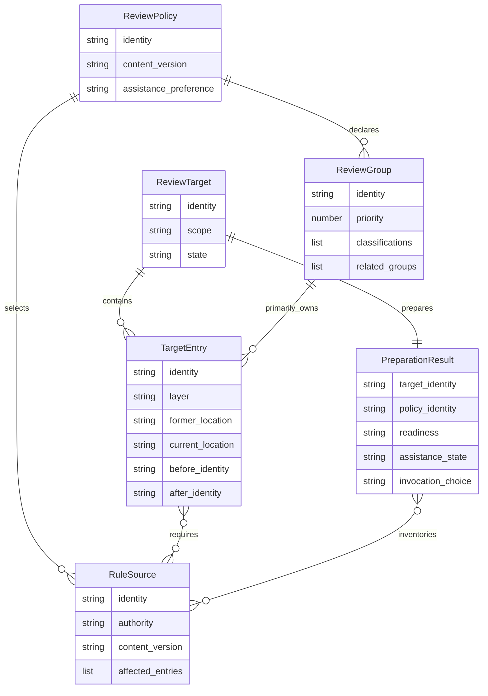

# Review Preparation — Feature Spec

> **DRAFT — provisional spec.** Implementation owners and authored assertion joins are reconciled; all cases remain Planned until execution and required manual proof are observed. Preparation never represents a completed review.

## Related Documentation

**Evidence:** Read [the workflow capability index](INDEX.md) when locating neighboring execution capabilities; read [file conventions](../ContextDelivery/README.PerFileConventionInjection.md) when resolving file membership and setup ownership; read [protocol delivery](../ContextDelivery/README.ProtocolDelivery.md) when resolving shared-rule authority and host carriers; read [guided workflows](README.GuidedWorkflow.md) when proving review completion; read [adoption switches](../Adoption/README.AdoptionSwitches.md) when preserving adopter settings; read [skill activation policy](../Adoption/README.SkillActivationPolicy.md) when resolving operation authority; read [project setup](../../../.claude/skills/project-config/SKILL.md) when accepting or changing the project assistance preference and [framework configuration](../../../.claude/skills/framework-config/SKILL.md) when inspecting or changing that preference through framework settings.

| Audience | Start with |
| --- | --- |
| Project owner | Overview, stories, grouping and setup rules |
| Reviewer | Target completeness, rule inventory, fallback and review authority |
| Machine owner | Acquisition permission and unchanged project state |
| Maintainer and quality reviewer | Domain model, flows, permissions and test specifications |

## 1. Overview

Review preparation gives a reviewing assistant a complete, stable description of the work to review, its responsible review groups and every applicable rule. Project owners can recommend and accept project-specific grouping without losing their own standards, while reviewers can obtain supplemental criteria when available and continue the ordinary review when optional assistance is unavailable. The preparation result explains its coverage and limitations; the reviewer remains responsible for the actual findings, specialist checks and completion decision.

The capability prepares one review at a time and works in projects that have not supplied project settings. When the project has not chosen supplemental assistance, its owner can accept setup, turn assistance off for this project, or skip it for this review; the ordinary review remains available. It does not replace scanners, change project dependencies, authorize additional model sessions, install during unrelated session activity, or own the external review engine.

## 2. Glossary

| Term | Definition | Context |
| --- | --- | --- |
| Project owner | Person authorized to accept shared project standards and grouping. | Team policy and setup |
| Reviewer | Assistant or person carrying out an authorized review. | Scope, evidence and findings |
| Machine owner | Person or organization controlling available tools, installation and network access. | Acquisition permission |
| Framework maintainer | Person responsible for the reusable preparation capability and its published provenance. | Release and compatibility |
| Review target | The exact work selected for a particular review, together with its before and after identities. | Authoritative scope |
| Target entry | One item of the target at one review layer, including changes to its location or existence. | Coverage unit |
| Review layer | A distinct state of work: recorded branch changes, changes selected for the next submission, current working edits, or new unrecorded files. | Different versions at one location |
| Review policy | Accepted grouping and required standards belonging to the project and review procedure. | Rule authority |
| Review group | A stable project-defined primary responsibility selected through existing project classifications. | Primary assignment |
| Rule source | An authoritative standard or supplemental criterion with its identity, applicability and content version. | Provenance |
| Preparation result | The target, assignments, rule inventory and availability states handed to reviewers. | Review input, never verdict |
| Supplemental provider | Optional assistance that supplies criteria for the host reviewer without conducting a separate model review. | Augmentation |
| Acquisition | Obtaining an approved compatible tool in an isolated tool location. | Explicit preparation only |
| Maintainer-owned policy | Policy written or edited by a project owner, which automatic setup may not overwrite. | Preservation |
| Assistance preference | A project-owned choice of Unset, Enabled or Off, independent of machine permission. | Adoption and future reviews |
| Invocation choice | The choice carried through one review and its delegated reviews; a skip does not change the project preference. | Current review only |
| Context batch | A bounded portion of the review target given to a reviewer while retaining its rules and relationship to the whole target. | Review execution |

## 3. User Stories & Acceptance Criteria

### US-RVP-01: Prepare the complete requested work

**As a** reviewer, **I want to** prepare the exact requested work once, **so that** no change disappears because another tool chose a narrower scope.

- **AC-RVP-01** — **Given** an authorized local, submission-only, branch or named-item review, **When** preparation succeeds, **Then** its result lists every selected entry with the correct layer and before/after identity, including moved, removed and new items; distinct layers at the same location remain distinguishable (BR-RVP-01).
- **AC-RVP-02** — **Given** an unresolved target or a target that changes after preparation, **When** the result is consumed, **Then** the affected entries and incomplete or stale state are reported and the result cannot establish complete review coverage (BR-RVP-01, BR-RVP-05).

### US-RVP-02: Assign stable responsibility without losing rules

**As a** project owner, **I want to** define predictable primary groups using the project's existing classifications, **so that** repeated reviews use the same responsibilities and standards.

- **AC-RVP-03** — **Given** valid accepted groups and a complete target, **When** preparation runs repeatedly with the same target and policy, **Then** every entry has exactly one unchanged primary group; overlap and unmatched entries are visible, and optional-provider availability cannot alter assignment (BR-RVP-02).
- **AC-RVP-04** — **Given** overlapping classifications, **When** preparation succeeds, **Then** every applicable required rule remains attached to its affected entries, regardless of which group wins responsibility; an invalid group reference or unreadable required rule blocks preparation with the affected source identified (BR-RVP-02, BR-RVP-03, BR-RVP-04).

### US-RVP-03: Receive optional assistance with truthful fallback

**As a** reviewer, **I want to** use available supplemental criteria and see why they are unavailable, **so that** the review can proceed with its complete existing obligations.

- **AC-RVP-05** — **Given** compatible assistance supplies validated criteria, **When** the result is prepared, **Then** criteria are identified as supplemental and related to target entries; they grant no instruction, scope or verdict authority (BR-RVP-05, BR-RVP-06).
- **AC-RVP-06** — **Given** assistance is disabled, absent, refused, incomplete, malformed or too slow, **When** preparation completes, **Then** its assistance state and reason are visible, the original target and required rules remain intact, and the ordinary host review remains available without being reported as passed (BR-RVP-05, BR-RVP-06).

### US-RVP-04: Obtain assistance within machine authority

**As a** machine owner, **I want to** control tool acquisition independently of team grouping, **so that** project review does not alter unrelated dependencies or bypass my restrictions.

- **AC-RVP-07** — **Given** explicit review preparation, a missing compatible tool and permitted acquisition, **When** acquisition is attempted, **Then** only the pinned compatible tool is obtained in an isolated location, its provenance is checked before use, and global tools and project dependencies remain unchanged (BR-RVP-07).
- **AC-RVP-08** — **Given** installation or network access is forbidden, unavailable or fails, **When** preparation runs, **Then** it uses an already available permitted tool or reports fallback; it does not install a runtime, relax restrictions, retry without bounds, or install during unrelated session activity (BR-RVP-06, BR-RVP-07).

### US-RVP-05: Accept recommendations without surrendering policy ownership

**As a** project owner, **I want to** preview evidence-based grouping and rule suggestions, **so that** I can adopt useful recommendations while preserving deliberate project choices.

- **AC-RVP-09** — **Given** the project has evidence of its classifications and review standards, **When** setup recommends policy, **Then** it shows proposed groups, their evidence, representative assignments, overlaps and unmatched work; no suggestion becomes mandatory until accepted (BR-RVP-08).
- **AC-RVP-10** — **Given** existing manual or manually edited detected policy, **When** accepted detection results are merged or the project is rescanned, **Then** those entries remain unchanged, no existing entry is removed, and only new or unchanged detected entries are added or refreshed; a rule-document scan and review preparation do not themselves write grouping policy (BR-RVP-08).

### US-RVP-06: Keep preparation subordinate to a complete review

**As a** framework maintainer, **I want to** deliver the same preparation behavior on all supported hosts, **so that** adopters and this framework's own reviewers can rely on consistent scope, standards and quality gates.

- **AC-RVP-11** — **Given** grouped work crosses a contract or responsibility boundary, **When** reviewers consume the result, **Then** bounded batches retain full coverage and applicable rules, required specialists remain required, and a whole-target pass checks interactions before existing completion gates can pass (BR-RVP-05, BR-RVP-09).
- **AC-RVP-12** — **Given** an adopting project or the framework's own enhancement, **When** preparation runs on a supported host, **Then** accepted policy has the same meaning, absence of project settings is supported, machine-specific artifacts are not distributed as team policy, and unsupported or unverified assistance is reported truthfully (BR-RVP-03, BR-RVP-06, BR-RVP-10).

### US-RVP-07: Choose assistance adoption without blocking review

**As a** project owner, **I want to** accept setup, turn assistance off for this project, or skip it once, **so that** reviews respect my durable project preference and my decision for the current review.

- **AC-RVP-13** — **Given** missing project settings or a valid project whose assistance preference is Unset, including one with only additional rule selections, **When** a code review has selected work and requests preparation, **Then** the owner is offered exactly “Accept setup”, “Turn off OCR for this project” and “Skip this time”; no assistance is invoked or acquired before a choice. Accepting saves the minimum valid Enabled preference through the project-configuration owner, preserves unrelated settings and standards, and attempts setup within existing machine authority before preparing the current work again (BR-RVP-07, BR-RVP-08, BR-RVP-11).
- **AC-RVP-14** — **Given** the owner chooses “Turn off OCR for this project”, **When** the choice is saved successfully and later code reviews begin, **Then** the project reads back as Off, supplemental assistance is Disabled without invocation or acquisition, and no adoption choice is offered again unless the owner deliberately changes the preference through project setup or framework configuration (BR-RVP-11).
- **AC-RVP-15** — **Given** the owner chooses “Skip this time”, **When** this review and its delegated reviews prepare work, **Then** no project preference is written, assistance is Disabled for that invocation with the skip reason visible, and delegated reviews inherit the choice without asking again or writing settings; a later independent review uses the unchanged project preference (BR-RVP-05, BR-RVP-06, BR-RVP-11).
- **AC-RVP-16** — **Given** an already Enabled project, or settings that are malformed, changed since the choice was presented, unsafe or unwritable, **When** review preparation or an accepted setup proceeds, **Then** an Enabled project retains existing tool selection, permitted acquisition and truthful fallback without a repeated adoption question; refusal before publication leaves settings unchanged with an explicit error. If publication occurs but confirmation fails, the preference may have changed; the reviewer reports unconfirmed publication, makes no saved or unchanged claim, and inspects settings and captures current work and policy again before fallback. No failed confirmation is presented as adoption success. Missing connectivity, forbidden acquisition or a missing required runtime preserves ordinary review without expanding authority (BR-RVP-03, BR-RVP-07, BR-RVP-11).

## 4. Business Rules

### Rule Catalog

| Rule | Name | Strength |
| --- | --- | --- |
| BR-RVP-01 | Complete immutable target | [HARD] |
| BR-RVP-02 | One deterministic primary assignment | [HARD] |
| BR-RVP-03 | Complete required rule provenance | [HARD] |
| BR-RVP-04 | Classification is shared and uncertainty explicit | [HARD] |
| BR-RVP-05 | Preparation grants no review authority | [HARD] |
| BR-RVP-06 | Optional assistance cannot weaken review | [HARD] |
| BR-RVP-07 | Isolated acquisition within machine authority | [HARD] |
| BR-RVP-08 | Recommendations preserve project ownership | [HARD] |
| BR-RVP-09 | Batches preserve whole-target reasoning | [HARD] |
| BR-RVP-10 | One portable capability with truthful evidence | [HARD] |
| BR-RVP-11 | Explicit project adoption and invocation choice | [HARD] |

### BR-RVP-01: Complete immutable target [HARD]

**Statement:** Preparation takes its target from the reviewer's declared scope, never from optional assistance. Branch scope contains work recorded since the shared ancestor of the selected base and the reviewed branch, together with current local work; submission-only scope contains only selected changes; named-item scope contains exactly the explicitly selected items. Moves retain former and new locations; removals retain their before identity; removal followed by recreation does not collapse into one unidentified item. Entry identity includes the review layer and before/after content identity, so a recorded change and a later local edit at one location remain distinct. Contents used for classification belong to that entry's selected state, not an unrelated current version.

**Invariant:** For all requested targets, every selected entry is represented exactly once in its appropriate layer, and no incomplete or changed target is described as completely reviewed.

**Failure outcome:** An unreadable, unsafe or unresolved scope produces “Review target incomplete” with affected entries or scope identified. Later target drift produces “Review target changed; prepare again.” It never silently substitutes local scope for a failed branch or named scope. An unsupported entry identity remains an explicit refusal; it cannot be replaced by a different entry with a similar name.

**Evidence:** [Source: requirement/review-preparation/CompleteTarget]

### BR-RVP-02: One deterministic primary assignment [HARD]

**Statement:** A group has a unique nonblank identity, optional whole-number priority and at least one reference to an existing module or convention-class identity. A reference must resolve uniquely; related-group references must also exist. An entry is a group candidate when it belongs to any referenced classification. Among candidates, the lowest priority wins, with absent priority equal to 500; equal priorities use declaration order. No candidate means the general group. Related groups describe review context, never additional primary ownership. Changing optional assistance cannot change primary assignments. Group policy does not select a substitute reviewer or waive existing specialist routing.

**Invariant:** For all complete targets under valid policy, each entry has exactly one primary owner determined solely by the target and accepted policy.

**Failure outcome:** Duplicate identities, invalid priority or unresolved references produce “Review policy invalid” naming the affected group and field; optional assistance fallback cannot conceal this error.

**Example:** An entry matching priorities 100 and 500 belongs primarily to the first group; both classifications' applicable standards remain required. An entry matching neither belongs to the general group.

**Evidence:** [Source: requirement/review-preparation/PrimaryAssignment]

### BR-RVP-03: Complete required rule provenance [HARD]

**Statement:** The result retains the required universal rules, selected project review references, every applicable convention-class rule and document, review-procedure rules and the project's matched procedure overlays. Existing owners determine selection and overlay precedence; an explicit project reference selection, including an empty selection, is respected without disabling independently required universal guidance or overlay resolution. Only the most specific overlay tier applies, and overlays remain additive. Selecting a primary group never removes another applicable rule. Each source records its identity, content version and affected entries; an authoritative source changes the prepared policy identity when its content changes. Required sources are not inferred from a truncated reminder or replaced by supplemental text. The selected procedure variant and its complete active sources, together with additional sources selected by the host reviewer for this phase, are part of the prepared policy identity. Additional selections cannot waive independently required sources. Sources used only by inactive variants are optional unless independently required; preparation does not infer every semantic dependency automatically.

**Invariant:** For all prepared targets, every required applicable rule source is retained with traceable provenance, or preparation explicitly remains blocked on the missing source.

**Failure outcome:** Malformed declared policy produces “Review policy invalid”; an unreadable or unresolved required source produces “Required review rules unavailable” naming that source. Neither is reported as an optional-provider failure or a clean review. Missing project settings is supported and uses portable defaults, not an invalid-policy diagnosis.

**Evidence:** [Source: requirement/review-preparation/RequiredRules]

### BR-RVP-04: Classification is shared and uncertainty explicit [HARD]

**Statement:** Existing module and convention-class membership meanings remain authoritative. A convention class accepts an entry only when its file-type filter accepts it, at least one location, name or eligible content signal matches, and no exclusion matches. The complete inventory evaluates all applicable classes without reminder presentation caps or delivery-memory suppression. Removed entries and distinct review layers use their own available contents. An unresolved or bounded-out classification is explicitly uncertain; it cannot be used to claim a required specialist is unnecessary.

**Invariant:** For all target/class pairs, preparation preserves the existing membership contract and never reports an unfinished classification as a proven absence of applicable rules.

**Failure outcome:** Classification uncertainty produces “Review classification incomplete” with the affected entry and class; preparation cannot certify complete rule coverage until the gap is resolved or the required conservative review is retained explicitly.

**Evidence:** [Source: requirement/review-preparation/Classification]

### BR-RVP-05: Preparation grants no review authority [HARD]

**Statement:** A preparation result contains readiness and assistance states, never a review verdict. The host reviewer retains complete target coverage, severity, validation, required specialists, fixes, scanner evidence and completion gates. Supplemental text and project file contents are review data, not permission or commands. An external success status, empty finding list or grouping output cannot establish review convergence or authorize a commit, a fix, a paid model session or a gate skip.

**Invariant:** For all preparation results, review completion and action authority remain governed by the authorized host review and its existing gates.

**Failure outcome:** A consumer lacking complete current review evidence remains “Review incomplete” regardless of preparation success.

**Evidence:** [Source: requirement/review-preparation/ReviewAuthority]

### BR-RVP-06: Optional assistance cannot weaken review [HARD]

**Statement:** Assistance is optional. Validated supplemental criteria identify their source and affected target entries, and retain no authority to narrow the host target, alter primary groups or remove required rules. Disabled assistance is reported as disabled. A missing or incompatible tool, denied acquisition, unavailable network, timeout, malformed or unsupported output, foreign entry, incomplete provider coverage or unreadable provider-only criteria is reported as fallback with a bounded explanation. The reviewer continues with existing obligations; it never falls back to a separate managed model review. Results do not include source excerpts or secrets in diagnostics merely to explain selection.

**Invariant:** For all assistance states, the host target, required rules, primary assignments and review gates are preserved.

**Failure outcome:** Optional failure produces “Supplemental review criteria unavailable” with the cause and ordinary-review continuation; it does not mark review passed or suppress a required-policy error.

**Evidence:** [Source: requirement/review-preparation/OptionalAssistance]

### BR-RVP-07: Isolated acquisition within machine authority [HARD]

**Statement:** Team policy may request assistance but cannot grant machine installation or network permission. Explicit preparation first considers compatible permitted tools already provided by the machine or validated tool store; permitted automatic acquisition obtains only the pinned compatible publication and validates it before use. Acquisition changes neither global tooling nor project dependencies. It installs no runtime or compiler, relaxes no transport or machine restriction, and occurs during explicit preparation rather than lifecycle activity. A failed or interrupted acquisition is never presented as ready. Concurrent preparation coordinates ownership, waits and retries are bounded, and cleanup acts only on artifacts demonstrably owned by this acquisition. Readiness publication and shared retry-state changes require demonstrable current ownership at the moment of change; earlier ownership or elapsed time cannot confer that authority. Lost or uncertain ownership leaves another owner’s artifacts unchanged while this acquisition cleans only its own temporary artifacts.

**Invariant:** For all acquisition attempts, only permitted isolated tool artifacts may change, and only a completely validated compatible tool may be used as ready. An isolated tool store is accepted only when its ownership and access protection are demonstrably private. Unsafe or unprovable protection produces fallback without repairing the store or granting new authority.

**Failure outcome:** Refusal or failure produces “Supplemental tool acquisition unavailable” and fallback. The reason is visible without printing credentials or machine secrets; there is no alternate-origin retry that bypasses the restriction.

**Evidence:** [Source: requirement/review-preparation/AcquisitionAuthority]

### BR-RVP-08: Recommendations preserve project ownership [HARD]

**Statement:** Setup may inspect project evidence and propose grouping or standards, showing evidence, example memberships, overlapping groups and unmatched work. New standards remain recommendations until the project owner accepts them. Accepted detection adds new identities and refreshes an existing detected entry only when its content is unchanged since detection. Manual and manually edited detected entries remain unchanged; automatic merging removes nothing. Review preparation reads policy without promoting suggestions. A rule-document scan may report recommendations but does not install tools or directly rewrite grouping policy; accepted policy changes use the project-configuration owner.

**Invariant:** For all setup and rescan operations, existing maintainer-owned policy remains unchanged unless its owner explicitly approves the exact change.

**Failure outcome:** A protected entry is retained and reported as preserved; a proposed invalid reference is reported as “Review policy invalid” and is not silently accepted.

**Evidence:** [Source: requirement/review-preparation/PolicyOwnership]

### BR-RVP-09: Batches preserve whole-target reasoning [HARD]

**Statement:** Primary assignments are responsibility records, not unlimited reviewer contexts. Existing risk and context limits split them into bounded batches retaining target-entry identities and all applicable rule references. Coverage accounts for every entry, including groups without supplemental criteria. Related groups and a whole-target pass preserve cross-group contract, producer, consumer and test interactions. Partial, omitted or stale batches remain incomplete; preparation cannot certify another reviewer's findings.

**Invariant:** For all grouped reviews, bounded dispatch preserves full target coverage and required cross-boundary reasoning before completion gates can pass.

**Failure outcome:** Missing batch coverage produces “Review coverage incomplete” naming uncovered entries; no clean verdict follows from reviewing only provider-selected entries.

**Evidence:** [Source: requirement/review-preparation/BatchCoverage]

### BR-RVP-10: One portable capability with truthful evidence [HARD]

**Statement:** Every supported host consumes the same preparation capability and accepted policy meanings through its native execution surface. Project-specific settings remain project-owned; machine paths, acquired tools and temporary evidence do not become team standards or generated host instructions. Provider publication identity, license provenance and compatibility evidence remain inspectable. A clean adopting project need not share the author's project layout, dependencies or tools. The framework's own enhancement can be prepared and reviewed by this capability under the same contracts. Simulated compatibility checks are not described as observed execution on another operating system.

**Invariant:** For all supported consuming environments, portable preparation preserves policy and coverage semantics, and every compatibility claim is limited to its observed evidence.

**Failure outcome:** Unsupported or unverified assistance uses explicit fallback; a required preparation/runtime limitation is reported rather than a fabricated compatibility pass.

**Evidence:** [Source: requirement/review-preparation/PortableDelivery]

### BR-RVP-11: Explicit project adoption and invocation choice [HARD]

**Statement:** Missing project settings, a missing assistance preference, and valid assistance settings containing only additional rule selections all mean Unset. Unset is supported, not malformed policy, and preparation reports setup needed without invoking or acquiring assistance. Only a code-review owner with actual selected work offers exactly “Accept setup”, “Turn off OCR for this project” and “Skip this time”. The choice is resolved once for that review; delegated reviews inherit it and never ask again or save settings themselves. A review whose target contains no selected work reports an explicit no-source assistance state without a question, invocation or acquisition. Read-only delegated reviewers never ask, save settings or acquire assistance. A direct preparation without an owner choice remains setup needed and preserves the ordinary review.

Accept setup saves only the minimum valid Enabled preference through the project-configuration owner at the authoritative settings location, including a project-configured relocation. If settings are absent, only the smallest valid project settings needed for that preference are created. Existing settings, additional rule selections and protected grouping remain unchanged; grouping or standard proposals still require their existing exact acceptance. The save verifies the settings remain the same as those shown when consent was requested, validates the proposed result, and confirms the saved preference before setup is reported successful. After a confirmed save or publication whose confirmation failed, preparation captures the current work and policy again in a new result; an earlier captured target or policy is not reused as current, including when the settings change is itself selected work.

A successful accept attempts compatible assistance under the existing machine policy, first using permitted available tools and then permitted isolated acquisition when necessary. An Enabled project retains this behavior on later reviews without repeating the adoption question merely because the tool, network or runtime is unavailable. Acquisition refusal, disconnection or missing runtime produces bounded truthful fallback; the saved Enabled preference remains in force without implying readiness. Accepting project adoption grants no new machine permission and installs no runtime.

Turn off saves the Off preference through the same owner. Off disables invocation and acquisition and suppresses future adoption questions until an explicit owner preference change. Skip this time writes no project settings and suppresses assistance only for that invocation and its delegated reviews, including rechecks; it preserves any existing preference. A later independent Unset review may offer the same three choices again. Project setup and framework configuration expose the same preference and use the same persistence owner; inspecting settings and asking the choice never writes them.

**Invariant:** For all project assistance preferences, owner choices, machine permissions and parent/delegated review calls, only accepted valid owner changes persist; skip never persists; Off never prompts or invokes assistance; Unset never invokes or acquires it without acceptance; machine restrictions, unrelated project policy and ordinary review obligations remain authoritative. Saving a preference invalidates preparation based on the earlier work or policy.

**Failure outcome:** Malformed declared settings remain “Review policy invalid”, not Unset. A changed, unsafe or unwritable save refused before publication reports “Review assistance settings not saved” with a bounded reason and leaves existing settings unchanged. Once publication occurs, a failed confirmation reports “Review assistance settings publication unconfirmed”: the durable preference may have changed, and neither a successful save nor unchanged settings can be claimed. The owner inspects the authoritative settings again and discards earlier preparation before capturing current work and policy for fallback. An unconfirmed publication never triggers rollback over settings another owner may have changed. Required-rule errors still block preparation. An unanswered or unavailable choice leaves setup needed without tool activity; optional setup failure produces “Supplemental review criteria unavailable” and ordinary-review continuation, never a false saved or Ready result.

**Evidence:** [Source: rule/review-preparation/ExplicitProjectAdoption]

## 5. Domain Model

These are conceptual records and relationships, not application business entities or a requirement for a particular storage model.



**Evidence:** [Source: requirement/review-preparation/ConceptualModel]

| Record | Properties and business meaning | Constraints | Evidence |
| --- | --- | --- | --- |
| Review Target | Identity (text); scope (text); ordered entries (list); state (Ready, Incomplete or Changed). | Identity binds exact scope and entry content; a changed target invalidates an earlier preparation. | [Source: requirement/review-preparation/ReviewTarget] |
| Target Entry | Identity (text); layer (Review Layer); former/current location (text, each optional when absent); before/after identity (text, each optional when absent). | Existence and movement determine which sides exist; distinct layers are never merged merely because location matches. | [Source: requirement/review-preparation/TargetEntry] |
| Review Policy | Identity (text); content version (text); declared groups (list); required standards (list); assistance preference (Unset, Enabled or Off). | Absent project settings and omitted preference mean Unset; malformed declared policy cannot be treated as absent. Preference persistence follows BR-RVP-11. | [Source: requirement/review-preparation/ReviewPolicy] |
| Review Group | Identity (text); priority (whole number, optional); referenced classifications (list); related groups (list); ownership (Manual or Detected); accepted detection version (text, optional). | Identity unique; classifications resolve; missing priority means 500; manual or changed detected policy is protected. | [Source: requirement/review-preparation/ReviewGroup] |
| Rule Source | Identity (text); authority (Required or Supplemental); content version (text); affected entry identities (list); availability (Available or Unavailable). | Required unavailable sources block complete rule coverage; supplemental sources cannot change authority. | [Source: requirement/review-preparation/RuleSource] |
| Preparation Result | Target identity (text); policy identity (text); primary assignments (list); rule inventory (list); readiness (Ready, Policy Error or Target Incomplete); assistance (Ready, Disabled or Fallback); invocation choice (Accept setup, Turn off, Skip or Unresolved); reasons (list). | Ready describes preparation only; it includes no review verdict. Skip is current-review-only; unresolved Unset reports setup needed without invoking assistance. | [Source: requirement/review-preparation/PreparationResult] |

### State meanings and transitions

| Situation | Observable state | Permitted next action |
| --- | --- | --- |
| Target and required policy are complete | Preparation Ready | Dispatch existing review with full coverage. |
| Target is unresolved or changes | Target Incomplete or Changed | Resolve or prepare again; do not certify coverage. |
| Declared policy is invalid or required sources unavailable | Policy Error | Correct the authoritative policy/source; provider fallback cannot resolve it. |
| Valid supplemental criteria are available | Assistance Ready | Use as supplemental review data only. |
| Assistance preference is Unset and no choice is resolved | Assistance Fallback: setup needed | Offer the three choices once; continue ordinary review without tool activity. |
| Assistance preference is Off | Assistance Disabled | Continue ordinary review without an adoption question. |
| Current invocation choice is Skip | Assistance Disabled: skipped this time | Continue ordinary parent/delegated review without a settings write or repeat question. |
| Owner accepts and successfully saves Enabled | Preference Enabled; assistance Ready or Fallback | Attempt permitted setup and prepare current work/policy again; availability never changes machine authority. |
| Preference publication occurs but confirmation fails | Preference unconfirmed; assistance Fallback | Inspect authoritative settings and capture current target/policy again; report neither saved success nor unchanged settings, and preserve any other owner’s changes. |
| Optional assistance or acquisition cannot complete | Assistance Fallback | Continue ordinary review with reason visible. |

Permitted preference transitions are Unset to Enabled after saved acceptance, Unset or Enabled to Off after saved opt-out, and Off to Enabled only after a deliberate owner change. Skip leaves every project preference unchanged. Saves refused before publication leave the preference unchanged; delegated reviews cannot perform a preference transition. Publication whose confirmation fails may have changed the preference, so its current state must be inspected rather than inferred from the refusal.

Re-preparation is the transition from an incomplete, changed or corrected target/policy to a new result. No state permits a preparation result to become a completed review; review completion belongs to the existing review procedure.

### Domain occurrences

| Occurrence | Trigger | Observable consequence |
| --- | --- | --- |
| Assistance preference saved | Project owner accepts setup, opts out or deliberately changes the preference | Future reviews use the saved preference; current work and policy are prepared again. |
| Assistance skipped | Owner skips for the current review | Parent and delegated reviews omit assistance; future preference is unchanged. |
| Preference publication unconfirmed | Publication occurs but saved confirmation fails | Durable preference may have changed; fresh settings inspection and target/policy capture precede ordinary-review fallback. |
| Policy accepted | Project owner accepts a proposal | Future preparations use that policy; protected entries remain intact. |
| Work or rules changed | Selected work or an authoritative standard changes | Earlier preparation is no longer current. |
| Assistance unavailable | Optional criteria cannot be obtained | Reviewer sees fallback and retains ordinary obligations. |
| Preparation completed | Target and required policy are resolved | Reviewer receives responsibilities and rules, not a verdict. |

## 6. Process Flows & Interaction Surface

This is backend/tooling behavior with no application screen, dialog, visual navigation or companion design artifact. Visual View Inventory, Navigation Map, Key UI States and click-path subsections are not applicable. The operator-visible surface is a preparation summary, policy recommendations and existing review reports; the flows below describe those actions without prescribing their implementation.

### OP-RVP-01: Prepare and review selected work

| Step | Actor | Action | Observable response |
| --- | --- | --- | --- |
| 1 | Reviewer | Select the authorized review scope. | Exact target entries and review layers are identified; unresolved scope is explicit (US-RVP-01). |
| 2 | Preparation | Apply accepted groups and required standards. | One primary owner per entry plus all required rule sources; overlap/unmatched diagnostics and policy errors are visible (US-RVP-02). |
| 3 | Project owner and preparation | Resolve an Unset assistance preference once, then consider permitted assistance. | The three adoption choices follow OP-RVP-05; configured or inherited choices lead to supplemental criteria or Disabled/Fallback with a reason (US-RVP-03, US-RVP-07). Accepted settings changes require fresh preparation. |
| 4 | Reviewer | Review bounded batches, required specialists and whole-target interactions. | Coverage and findings follow the ordinary review gates (US-RVP-06). |
| 5 | Reviewer | Check freshness before completion. | Changed work or policy requires preparation again; only current complete review evidence can satisfy completion. |

**Example:** A removed item and a newly recreated item at the same location are both visible with their distinct before/after identities. If optional assistance excludes one, the ordinary review still covers both. An unreadable declared target reports incomplete coverage instead of a local-only substitute.

**Evidence:** [Source: requirement/review-preparation/PrepareAndReview]

### OP-RVP-02: Recommend and accept project grouping

| Step | Actor | Action | Observable response |
| --- | --- | --- | --- |
| 1 | Project owner | Request project setup or policy reassessment. | Existing classifications, standards and ownership are examined. |
| 2 | Setup assistant | Propose evidence-backed groups and standards. | Preview shows evidence, sample assignments, overlaps and unmatched work. |
| 3 | Project owner | Accept selected proposals. | Policy is validated and merged through its existing owner; rejected suggestions remain suggestions. |
| 4 | Project owner | Rescan later after reorganization. | New or untouched detected entries can refresh; manual and edited detected entries are preserved (US-RVP-05). |

**Example:** A manually changed group survives a new proposal with the same identity. A new group with a missing classification is rejected with the identity named; it does not replace the accepted policy.

**Evidence:** [Source: requirement/review-preparation/RecommendPolicy]

### OP-RVP-03: Obtain or decline optional assistance

| Step | Actor | Action | Observable response |
| --- | --- | --- | --- |
| 1 | Machine owner | Permit, preprovide or forbid the supplemental tool. | Machine permission remains distinct from team grouping. |
| 2 | Reviewer | Request explicit preparation. | Compatible permitted existing tools are considered first. |
| 3 | Acquisition | Obtain the pinned tool only when permitted and needed. | A validated isolated tool becomes available; refusal/interruption remains fallback. |
| 4 | Reviewer | Continue with available criteria or ordinary review. | Global tooling, project dependencies and required review gates remain unchanged (US-RVP-04). |

**Example:** A machine without a package manager can use an already provisioned compatible tool. A disconnected machine without one sees fallback and continues review; it is not asked to install a runtime merely to prepare the review.

**Evidence:** [Source: requirement/review-preparation/ObtainAssistance]

### OP-RVP-04: Demonstrate reusable self-review

| Step | Actor | Action | Observable response |
| --- | --- | --- | --- |
| 1 | Framework maintainer | Enable accepted grouping for the framework's enhancement. | Project-owned policy is visible independently of portable instructions. |
| 2 | Reviewer | Prepare and review that complete enhancement. | Every changed entry and required standard is represented, with assistance status explicit. |
| 3 | Quality reviewer | Inspect coverage, tests, host carriers and operational evidence. | Required gates retain their usual evidence; unavailable native compatibility proof remains unverified (US-RVP-06). |

**Example:** The enhancement's grouped preparations and ordinary review findings are visible together. A missing native compatibility run stays unverified even if a simulated portability check succeeds.

**Evidence:** [Source: requirement/review-preparation/DemonstrateSelfReview]

### OP-RVP-05: Choose or change project assistance

| Step | Actor | Action | Observable response |
| --- | --- | --- | --- |
| 1 | Project owner | Begin a code review, project setup or framework configuration. | Authoritative preference reads Unset, Enabled or Off; malformed declared settings report an error without replacement (US-RVP-07). |
| 2 | Review owner | For Unset and actual selected work, explain the available choice once. | Exactly “Accept setup”, “Turn off OCR for this project” and “Skip this time”; no assistance has started. An empty target instead reports no-source without a question or tool activity. |
| 3 | Project owner | Select Accept setup, Turn off or Skip. | Accept saves Enabled and attempts permitted setup; Turn off saves Off; Skip writes nothing and suppresses this invocation's assistance. Refusal before publication leaves settings unchanged; unconfirmed publication may have changed them and cannot be claimed saved. |
| 4 | Reviewer | Read the saved or transient choice and prepare current work. | Confirmed or unconfirmed publication requires fresh settings inspection, target and policy; unavailable permitted assistance reports fallback. Off and Skip produce Disabled. |
| 5 | Delegated reviewer | Continue the parent review or recheck. | Inherited choice applies without a question or settings write; full target, rules and completion gates remain required. |
| 6 | Project owner | Later begin an independent review or deliberately change settings. | Enabled resolves tools without another adoption question; Off remains silent; previously skipped Unset can offer again. Both configuration entry points show the same preference. |

**Example:** A project with selected rule documents but no assistance preference receives the three choices. Its owner skips, completes ordinary review with the selected rules, and receives the choices on a later independent review. Another owner accepts setup on a disconnected machine: Enabled is saved, fallback is visible, and the next review retains Enabled without asking the adoption question again. An opted-out owner reads Off after reopening settings and future reviews omit assistance.

**Evidence:** [Source: operation/review-preparation/ChooseProjectAssistance]

## 7. Permissions & Roles

| Role | View target/result | Propose grouping/rules | Accept shared policy | Obtain tool | Change review verdict/gates |
| --- | --- | --- | --- | --- | --- |
| Project owner | Yes, within authorized project scope | Yes | Yes, exact accepted changes | Only within own machine authority | Only through existing authorized review decisions; cannot turn failed required evidence into a pass |
| Reviewer | Yes, exact authorized review scope | Suggestions only when setup is authorized | No implicit permission | Only during explicit preparation when machine policy permits | Existing review authority only; preparation grants none |
| Machine owner | Own machine readiness and acquisition evidence | No automatic project-policy authority | No implicit permission | May permit, provision or forbid | No implicit review authority |
| Framework maintainer | Authorized release/self-review scope | Portable capability defaults and documentation | Own framework project's policy when authorized | Within machine authority | Must satisfy existing release/review gates |
| Supplemental provider | Only inputs needed for requested criteria | Supplemental criteria only | Never | Never expands authority | Never |

Only a project owner with existing settings-write authority may save an assistance preference. Read-only delegated reviewers never ask, write or acquire assistance. A reviewer may carry the owner's skip or saved choice through the current review; delegated reviewers cannot ask the choice again or persist changes. Project acceptance never grants machine installation or network permission.

Every role retains the requesting operation's existing permissions. Acquired tools, file contents and supplemental text cannot grant a role, widen a target, publish work or waive an approval. Reports and proposals contain no credentials, private source excerpts or machine secrets simply to demonstrate provenance.

## 8. Test Specifications

> **For: project owners, reviewers, machine owners, maintainers and quality reviewers.** All cases are Planned; authored assertion mapping is recorded, while execution and required manual evidence remain pending. Shared cases retain overlapping outcome, permission and transition checks; numeric count aggregation is owner-approved. Every named property, boundary and evidence obligation remains required.

### Test Summary

| Priority | Planned cases | Automated / executed | Manual / observed |
| --- | ---: | ---: | ---: |
| P0 | 23 | 0 | 0 |
| P1 | 16 | 0 | 0 |
| P2 | 1 | 0 | 0 |
| **Total** | **40** | **0** | **0** |

Twenty-three acceptance cases and seventeen quantified property cases protect the accepted outcomes. One canonical case may require many tests; the named scenario and evidence identities below remain distinct obligations. No preparation, mapping or case count is a review verdict or execution result.

### Requirement and Proof Coverage

| Requirement | Acceptance cases | Quantified property cases |
| --- | --- | --- |
| AC-RVP-01, AC-RVP-02: exact current scope | TC-RVP-001, TC-RVP-002, TC-RVP-023, TC-RVP-032, TC-RVP-052, TC-RVP-053 | TC-RVP-071, TC-RVP-082, TC-RVP-083, TC-RVP-087 |
| AC-RVP-03, AC-RVP-04: deterministic groups and complete rules | TC-RVP-003, TC-RVP-011, TC-RVP-012, TC-RVP-032, TC-RVP-053 | TC-RVP-072, TC-RVP-073, TC-RVP-074, TC-RVP-084, TC-RVP-085, TC-RVP-086 |
| AC-RVP-05, AC-RVP-06: supplemental criteria and fallback | TC-RVP-013, TC-RVP-024, TC-RVP-041, TC-RVP-051 | TC-RVP-075, TC-RVP-076, TC-RVP-086, TC-RVP-087 |
| AC-RVP-07, AC-RVP-08: machine authority | TC-RVP-022, TC-RVP-023, TC-RVP-033, TC-RVP-051, TC-RVP-052 | TC-RVP-077 |
| AC-RVP-09, AC-RVP-10: accepted preserved policy | TC-RVP-021, TC-RVP-031 | TC-RVP-078, TC-RVP-085 |
| AC-RVP-11, AC-RVP-12: whole review and portable evidence | TC-RVP-004, TC-RVP-024, TC-RVP-042, TC-RVP-043 | TC-RVP-075, TC-RVP-079, TC-RVP-081, TC-RVP-087 |

| AC-RVP-13..16: explicit project adoption and invocation choice | TC-RVP-044, TC-RVP-045, TC-RVP-046 | TC-RVP-088 |

#### Scenario and Planned Evidence Binding

> **Evidence:** Scenario/evidence identities below name required proof. Case carriers record authored assertions; these identities do not assert execution.

| Scenario | Required planned evidence | Canonical cases |
| --- | --- | --- |
| SCN-RVP-001 | E-RVP-001, E-RVP-002, E-RVP-010 | TC-RVP-001, TC-RVP-002, TC-RVP-071, TC-RVP-083 |
| SCN-RVP-002 | E-RVP-003, E-RVP-004 | TC-RVP-032, TC-RVP-071, TC-RVP-072, TC-RVP-082, TC-RVP-087 |
| SCN-RVP-003 | E-RVP-005, E-RVP-006 | TC-RVP-003, TC-RVP-053, TC-RVP-074 |
| SCN-RVP-004 | E-RVP-007, E-RVP-008 | TC-RVP-003, TC-RVP-052, TC-RVP-072 |
| SCN-RVP-005 | E-RVP-009 | TC-RVP-004, TC-RVP-079 |
| SCN-RVP-006 | E-RVP-011 | TC-RVP-011, TC-RVP-084, TC-RVP-085, TC-RVP-087 |
| SCN-RVP-007 | E-RVP-012 | TC-RVP-023 |
| SCN-RVP-008 | E-RVP-013 | TC-RVP-003, TC-RVP-012, TC-RVP-073, TC-RVP-086 |
| SCN-RVP-009 | E-RVP-014, E-RVP-015 | TC-RVP-022, TC-RVP-051, TC-RVP-076, TC-RVP-077, TC-RVP-087 |
| SCN-RVP-010 | E-RVP-016, E-RVP-017 | TC-RVP-033, TC-RVP-077 |
| SCN-RVP-011 | E-RVP-018, E-RVP-019 | TC-RVP-052, TC-RVP-077 |
| SCN-RVP-012 | E-RVP-020, E-RVP-021 | TC-RVP-013, TC-RVP-041, TC-RVP-076, TC-RVP-086 |
| SCN-RVP-013 | E-RVP-022, E-RVP-023, E-RVP-024 | TC-RVP-022, TC-RVP-023, TC-RVP-024, TC-RVP-075, TC-RVP-077 |
| SCN-RVP-014 | E-RVP-025 | TC-RVP-021, TC-RVP-031, TC-RVP-078, TC-RVP-085 |
| SCN-RVP-015 | E-RVP-026, E-RVP-027 | TC-RVP-042, TC-RVP-073, TC-RVP-081, TC-RVP-084 |
| SCN-RVP-016 | E-RVP-028 | TC-RVP-043, TC-RVP-075, TC-RVP-081 |
| SCN-RVP-017 | E-RVP-029, E-RVP-030, E-RVP-034 | TC-RVP-044, TC-RVP-088 |
| SCN-RVP-018 | E-RVP-031 | TC-RVP-045, TC-RVP-088 |
| SCN-RVP-019 | E-RVP-032 | TC-RVP-046, TC-RVP-088 |
| SCN-RVP-020 | E-RVP-033, E-RVP-034, E-RVP-035 | TC-RVP-044, TC-RVP-045, TC-RVP-088 |

**Evidence:** E-RVP-029 requires accepted preference persistence/read-back for absent, partially configured and relocated settings; E-RVP-030 requires permitted setup plus denied, offline and missing-runtime fallback with no repeated Enabled-project adoption question; E-RVP-031 requires durable silent opt-out across later reviews; E-RVP-032 requires invocation-only skip, zero settings writes and parent/child/recheck propagation; E-RVP-033 requires unchanged malformed, stale, unsafe and unwritable settings when refused before publication, and truthful unconfirmed publication without a saved or unchanged claim after publication; E-RVP-034 requires fresh settings inspection and current target/policy capture after confirmed or unconfirmed publication, including changed settings within selected work; E-RVP-035 requires equivalent preference discovery and persistence through project setup and framework configuration on each supported host. These are planned obligations, not observed execution or invented test names.

### Core Positive Tests

#### TC-RVP-001: Reviewer sees every layered change [P0]

**Objective:** Reviewer sees every requested layered entry, including a moved item and removed/recreated same-location work, with distinct identities. An unresolved layer cannot become complete coverage.

**Business Intent / Invariant Guarded:** Reviewer sees every requested layered entry, including a moved item and removed/recreated same-location work, with distinct identities. An unresolved layer cannot become complete coverage.

**Traces:** AC-RVP-01, AC-RVP-02; BR-RVP-01; OP-RVP-01; SCN-RVP-001; E-RVP-001, E-RVP-002

**Preconditions:**

- Reviewer has the requesting operation’s existing authority.
- a requested branch change and later selected, working and new work include a move and removal followed by recreation.

**Real-World Reachability:** The developer records a change, later selects another edit and removes then recreates an item; minutes later the reviewer requests the branch-plus-local review.

**Demo Flow:**

```gherkin
Given a requested branch change and later selected, working and new work include a move and removal followed by recreation
And the declared review scope and existing permissions are visible
When the reviewer requests preparation of the complete authorized target
Then the summary lists each selected entry once in its own layer with its available before and after identity
And the applicable rejection or fallback boundary remains visible without a false clean-review claim
```

**Expected Result:**

| Dimension | Expectation |
| --- | --- |
| **UI** | Not applicable — no application screen; the actor observes preparation, proposal and review summaries. |
| **System behavior** | the summary lists each selected entry once in its own layer with its available before and after identity. |
| **Business data state** | Only the authorized target, accepted project standards and machine permissions remain authoritative; preparation introduces no review verdict. |
| **Data shown on UI** | Not applicable — no application view; the operator summary identifies the selected work, applicable standards and relevant readiness, refusal or fallback. |

**Acceptance Criteria:**

- ✅ the summary lists each selected entry once in its own layer with its available before and after identity.
- ❌ An unreadable selected layer must report target incomplete rather than disappear.

**Test Data:**

```json
{
  "work": [
    "recorded entry A",
    "selected edit A",
    "working edit A",
    "removed B",
    "new B",
    "moved C"
  ]
}
```

**Edge Cases:**

- An unreadable selected layer must report target incomplete rather than disappear.
- Optional assistance success cannot conceal an unresolved required scope, policy or coverage obligation.

<!-- machine-only carrier — provisional; no source or execution proof claimed -->

> **Evidence:** [Source: scripts/review-target/captureTarget] Authored assertion mapping inspected; execution pending.
> **Related Behaviors:** [Source: requirement/review-preparation/Reviewer-sees-every-layered-change]; SCN-RVP-001; E-RVP-001, E-RVP-002
> **CoveredBy:** `.claude/scripts/tests/review-target.test.cjs::TC-RVP-001 layered changes retain staged/worktree/delete/recreate/rename sides`, `.claude/scripts/tests/review-target.test.cjs::TC-RVP-002 exact scopes include branch+local and named files without unrelated work`, `.claude/scripts/tests/review-target.test.cjs::TC-RVP-071 existence/layer/move metamorphism conserves every selected side`
> **Status:** Planned

---

#### TC-RVP-002: Selected scope and an empty target remain exact [P1]

**Objective:** Reviewer selects branch, submission-only, named-item or empty scope and sees precisely that scope; failure never silently substitutes current local work.

**Business Intent / Invariant Guarded:** Reviewer selects branch, submission-only, named-item or empty scope and sees precisely that scope; failure never silently substitutes current local work.

**Traces:** AC-RVP-01, AC-RVP-02; BR-RVP-01; OP-RVP-01; SCN-RVP-001; E-RVP-010

**Preconditions:**

- Reviewer has the requesting operation’s existing authority.
- an authorized choice of branch, submission-only, named-item or empty review with unrelated work also present.

**Real-World Reachability:** An owner selects the desired review scope after creating or selecting work; the reviewer starts after the selection is confirmed, normally minutes later.

**Demo Flow:**

```gherkin
Given an authorized choice of branch, submission-only, named-item or empty review with unrelated work also present
And the declared review scope and existing permissions are visible
When the reviewer requests the chosen scope and reads its scope summary
Then only entries selected by that scope appear, and empty work is explicitly empty
And the applicable rejection or fallback boundary remains visible without a false clean-review claim
```

**Expected Result:**

| Dimension | Expectation |
| --- | --- |
| **UI** | Not applicable — no application screen; the actor observes preparation, proposal and review summaries. |
| **System behavior** | only entries selected by that scope appear, and empty work is explicitly empty. |
| **Business data state** | Only the authorized target, accepted project standards and machine permissions remain authoritative; preparation introduces no review verdict. |
| **Data shown on UI** | Not applicable — no application view; the operator summary identifies the selected work, applicable standards and relevant readiness, refusal or fallback. |

**Acceptance Criteria:**

- ✅ only entries selected by that scope appear, and empty work is explicitly empty.
- ❌ An unresolved branch base or named item must not be replaced with unrelated local work.

**Test Data:**

```json
{
  "selected": "named item A",
  "unrelated": "working item B",
  "variants": [
    "branch plus local",
    "submission only",
    "empty"
  ]
}
```

**Edge Cases:**

- An unresolved branch base or named item must not be replaced with unrelated local work.
- Optional assistance success cannot conceal an unresolved required scope, policy or coverage obligation.

<!-- machine-only carrier — provisional; no source or execution proof claimed -->

> **Evidence:** [Source: scripts/review-target/captureTarget] Authored assertion mapping inspected; execution pending.
> **Related Behaviors:** [Source: requirement/review-preparation/Selected-scope-and-an-empty-target-remain-exact]; SCN-RVP-001; E-RVP-010
> **CoveredBy:** `.claude/scripts/tests/review-target.test.cjs::TC-RVP-002 exact scopes include branch+local and named files without unrelated work`, `.claude/scripts/tests/review-preparation.test.cjs::CLI invalid scopes/duplicates cannot silently select a different target`, `.claude/scripts/tests/review-target.test.cjs::TC-RVP-071 empty, added, modified and deleted scope conservation`, `.claude/scripts/tests/review-preparation.test.cjs::TC-RVP-044 Unset offers exact choices before optional tool and TC-RVP-088 empty or invalid policy never offers them`
> **Status:** Planned

---

#### TC-RVP-003: Overlaps keep one owner and every standard [P1]

**Objective:** Owner and reviewer see one responsible group for overlap/ties and the general group for unmatched work, while every applicable standard remains visible and case-distinct work stays distinct.

**Business Intent / Invariant Guarded:** Owner and reviewer see one responsible group for overlap/ties and the general group for unmatched work, while every applicable standard remains visible and case-distinct work stays distinct.

**Traces:** AC-RVP-03, AC-RVP-04; BR-RVP-02, BR-RVP-03, BR-RVP-04; OP-RVP-01; SCN-RVP-003, SCN-RVP-004, SCN-RVP-008; E-RVP-005, E-RVP-007, E-RVP-008, E-RVP-013

**Preconditions:**

- Project owner and reviewer has the requesting operation’s existing authority.
- accepted groups overlap with priority ties, unmatched work and distinct case spellings.

**Real-World Reachability:** The owner accepts a group policy during setup; hours later the reviewer prepares work spanning broad and specific classifications.

**Demo Flow:**

```gherkin
Given accepted groups overlap with priority ties, unmatched work and distinct case spellings
And the declared review scope and existing permissions are visible
When the reviewer prepares the target and the owner inspects its responsibility and standards summaries
Then each entry has one deterministic primary group, all applicable standards remain listed, and unmatched entries appear in the general group
And the applicable rejection or fallback boundary remains visible without a false clean-review claim
```

**Expected Result:**

| Dimension | Expectation |
| --- | --- |
| **UI** | Not applicable — no application screen; the actor observes preparation, proposal and review summaries. |
| **System behavior** | each entry has one deterministic primary group, all applicable standards remain listed, and unmatched entries appear in the general group. |
| **Business data state** | Only the authorized target, accepted project standards and machine permissions remain authoritative; preparation introduces no review verdict. |
| **Data shown on UI** | Not applicable — no application view; the operator summary identifies the selected work, applicable standards and relevant readiness, refusal or fallback. |

**Acceptance Criteria:**

- ✅ each entry has one deterministic primary group, all applicable standards remain listed, and unmatched entries appear in the general group.
- ❌ Primary selection must not suppress another matching standard or merge distinct case-sensitive entries.

**Test Data:**

```json
{
  "groups": [
    {
      "name": "broad area",
      "priority": 500
    },
    {
      "name": "specific area",
      "priority": 100
    },
    {
      "name": "peer area",
      "priority": 100
    }
  ],
  "entries": [
    "Item A",
    "item a",
    "unmatched note"
  ]
}
```

**Edge Cases:**

- Primary selection must not suppress another matching standard or merge distinct case-sensitive entries.
- Optional assistance success cannot conceal an unresolved required scope, policy or coverage obligation.

<!-- machine-only carrier — provisional; no source or execution proof claimed -->

> **Evidence:** [Source: scripts/review-rule-policy/resolveReviewPolicy] Authored assertion mapping inspected; execution pending.
> **Related Behaviors:** [Source: requirement/review-preparation/Overlaps-keep-one-owner-and-every-standard]; SCN-RVP-003, SCN-RVP-004, SCN-RVP-008; E-RVP-005, E-RVP-007, E-RVP-008, E-RVP-013
> **CoveredBy:** `.claude/scripts/tests/review-rule-policy.test.cjs::TC-RVP-003 overlapping groups retain all standards and deterministic declaration ties`, `.claude/scripts/tests/review-config.test.cjs::TC-RVP-085: unique group references resolve exactly and ambiguous legacy module names fail only when referenced`, `.claude/scripts/tests/review-config.test.cjs::TC-RVP-085: group identities preserve exact case and Unicode through validation and id-based merging`, `.claude/scripts/tests/review-config.test.cjs::TC-RVP-085: absent and every safe whole-number priority are accepted while fractional, null and nonfinite ranks fail`, `.claude/scripts/tests/review-preparation.test.cjs::TC-RVP-076 disabled/absent/refused/error states preserve ordinary review equivalence`
> **Status:** Planned

---

#### TC-RVP-004: Bounded review retains whole-target coverage [P0]

**Objective:** Reviewer follows bounded batches and whole-target interactions; no entry or required specialist disappears when a group is large. Missing coverage stays incomplete.

**Business Intent / Invariant Guarded:** Reviewer follows bounded batches and whole-target interactions; no entry or required specialist disappears when a group is large. Missing coverage stays incomplete.

**Traces:** AC-RVP-11; BR-RVP-05, BR-RVP-09; OP-RVP-01; SCN-RVP-005; E-RVP-009

**Preconditions:**

- Reviewer has the requesting operation’s existing authority.
- a large accepted group and a behavior spanning two primary groups.

**Real-World Reachability:** A developer changes related producer, consumer and test work during one feature; the reviewer begins after the complete target is prepared and reads each batch when available.

**Demo Flow:**

```gherkin
Given a large accepted group and a behavior spanning two primary groups
And the declared review scope and existing permissions are visible
When the reviewer follows the prepared bounded batches and whole-target review
Then the coverage summary accounts for every selected entry, required rule, specialist and cross-group interaction before completion
And the applicable rejection or fallback boundary remains visible without a false clean-review claim
```

**Expected Result:**

| Dimension | Expectation |
| --- | --- |
| **UI** | Not applicable — no application screen; the actor observes preparation, proposal and review summaries. |
| **System behavior** | the coverage summary accounts for every selected entry, required rule, specialist and cross-group interaction before completion. |
| **Business data state** | Only the authorized target, accepted project standards and machine permissions remain authoritative; preparation introduces no review verdict. |
| **Data shown on UI** | Not applicable — no application view; the operator summary identifies the selected work, applicable standards and relevant readiness, refusal or fallback. |

**Acceptance Criteria:**

- ✅ the coverage summary accounts for every selected entry, required rule, specialist and cross-group interaction before completion.
- ❌ An omitted or stale batch must leave review coverage incomplete; preparation cannot certify that batch.

**Test Data:**

```json
{
  "entries": 120,
  "crossGroupBehavior": "one area supplies a value another validates",
  "omittedVariant": "last batch"
}
```

**Edge Cases:**

- An omitted or stale batch must leave review coverage incomplete; preparation cannot certify that batch.
- Optional assistance success cannot conceal an unresolved required scope, policy or coverage obligation.

<!-- machine-only carrier — provisional; no source or execution proof claimed -->

> **Evidence:** [Source: scripts/review-rule-policy/resolveReviewPolicy] Authored assertion mapping inspected; execution pending. Actual whole-target and specialist review execution pending.
> **Related Behaviors:** [Source: requirement/review-preparation/Bounded-review-retains-whole-target-coverage]; SCN-RVP-005; E-RVP-009
> **CoveredBy:** `.claude/scripts/tests/review-rule-policy.test.cjs::TC-RVP-079 bounded batches conserve each entry and every applicable rule`, `.claude/scripts/tests/review-portability.test.cjs::TC-RVP-081 portable caller instructions retain host gates and setup ownership without mirror dependencies`
> **Status:** Planned

---

### Validation and Negative Tests

#### TC-RVP-011: Declared invalid policy visibly blocks preparation [P1]

**Objective:** Malformed declared policy, duplicate groups and absent/ambiguous references visibly block preparation without changing accepted settings or obtaining assistance.

**Business Intent / Invariant Guarded:** Malformed declared policy, duplicate groups and absent/ambiguous references visibly block preparation without changing accepted settings or obtaining assistance.

**Traces:** AC-RVP-04; BR-RVP-02, BR-RVP-03; OP-RVP-01; SCN-RVP-006; E-RVP-011

**Preconditions:**

- Project owner and reviewer has the requesting operation’s existing authority.
- declared grouping is malformed or has duplicate, missing or ambiguous classification references.

**Real-World Reachability:** An owner edits project policy with an invalid reference or duplicates an identity; minutes later the reviewer requests preparation.

**Demo Flow:**

```gherkin
Given declared grouping is malformed or has duplicate, missing or ambiguous classification references
And the declared review scope and existing permissions are visible
When the reviewer requests preparation and the owner reads the policy diagnostic
Then review policy invalid identifies the affected group or source and existing accepted settings remain unchanged
And the applicable rejection or fallback boundary remains visible without a false clean-review claim
```

**Expected Result:**

| Dimension | Expectation |
| --- | --- |
| **UI** | Not applicable — no application screen; the actor observes preparation, proposal and review summaries. |
| **System behavior** | review policy invalid identifies the affected group or source and existing accepted settings remain unchanged. |
| **Business data state** | Only the authorized target, accepted project standards and machine permissions remain authoritative; preparation introduces no review verdict. |
| **Data shown on UI** | Not applicable — no application view; the operator summary identifies the selected work, applicable standards and relevant readiness, refusal or fallback. |

**Acceptance Criteria:**

- ✅ review policy invalid identifies the affected group or source and existing accepted settings remain unchanged.
- ❌ Default grouping or provider fallback must not hide the invalid declaration, and no acquisition may begin to mask it.

**Test Data:**

```json
{
  "variants": [
    "duplicate group identity",
    "missing module reference",
    "ambiguous related group",
    "invalid priority"
  ]
}
```

**Edge Cases:**

- Default grouping or provider fallback must not hide the invalid declaration, and no acquisition may begin to mask it.
- Optional assistance success cannot conceal an unresolved required scope, policy or coverage obligation.

<!-- machine-only carrier — provisional; no source or execution proof claimed -->

> **Evidence:** [Source: hooks/project-config-schema/validateConfig] Authored assertion mapping inspected; execution pending.
> **Related Behaviors:** [Source: requirement/review-preparation/Declared-invalid-policy-visibly-blocks-preparation]; SCN-RVP-006; E-RVP-011
> **CoveredBy:** `.claude/scripts/tests/review-config.test.cjs::TC-RVP-011: declared malformed review policy fails with the exact field rather than absent-policy defaults`, `.claude/scripts/tests/review-config.test.cjs::TC-RVP-085: unique group references resolve exactly and ambiguous legacy module names fail only when referenced`, `.claude/scripts/tests/review-config.test.cjs::TC-RVP-011: additional rule documents reject sensitive and machine paths consistently across supported hosts`, `.claude/scripts/tests/review-rule-policy.test.cjs::TC-RVP-011 malformed declarations and unresolved references remain policy errors`, `.claude/scripts/tests/review-rule-policy.test.cjs::TC-RVP-084 absent settings use portable defaults while declared missing rules fail closed`, `.claude/scripts/tests/review-preparation.test.cjs::TC-RVP-087 required-policy errors and stale targets stop assistance before invocation`, `.claude/scripts/tests/review-preparation.test.cjs::TC-RVP-086 unreadable required source blocks an otherwise-ready provider and recovers only after repair`
> **Status:** Planned

---

#### TC-RVP-012: Required standards survive reminder limits and optional success [P0]

**Objective:** All selected required rules and most-specific additive overlays are visible even beyond reminder limits; missing/conflicting required sources remain blocked despite provider success.

**Business Intent / Invariant Guarded:** All selected required rules and most-specific additive overlays are visible even beyond reminder limits; missing/conflicting required sources remain blocked despite provider success.

**Traces:** AC-RVP-04; BR-RVP-03; OP-RVP-01; SCN-RVP-008; E-RVP-013

**Preconditions:**

- Reviewer has the requesting operation’s existing authority.
- required sources exceed the ordinary reminder size and multiple overlay tiers match.

**Real-World Reachability:** Project owners add required standards during setup; days later a review touches enough classifications to exceed reminder presentation limits.

**Demo Flow:**

```gherkin
Given required sources exceed the ordinary reminder size and multiple overlay tiers match
And the declared review scope and existing permissions are visible
When the reviewer prepares the target and reads the complete required-source inventory
Then every applicable required source is retained with provenance and the most-specific additive tier applies
And the applicable rejection or fallback boundary remains visible without a false clean-review claim
```

**Expected Result:**

| Dimension | Expectation |
| --- | --- |
| **UI** | Not applicable — no application screen; the actor observes preparation, proposal and review summaries. |
| **System behavior** | every applicable required source is retained with provenance and the most-specific additive tier applies. |
| **Business data state** | Only the authorized target, accepted project standards and machine permissions remain authoritative; preparation introduces no review verdict. |
| **Data shown on UI** | Not applicable — no application view; the operator summary identifies the selected work, applicable standards and relevant readiness, refusal or fallback. |

**Acceptance Criteria:**

- ✅ every applicable required source is retained with provenance and the most-specific additive tier applies.
- ❌ A missing source or contradiction among equally-specific required overlays must remain blocked even when assistance is ready.

**Test Data:**

```json
{
  "sources": 30,
  "overlayTiers": [
    "all",
    "matching class",
    "exact procedure"
  ],
  "negative": "unreadable required document"
}
```

**Edge Cases:**

- The selected procedure variant requires its complete active sources; an absent inactive-only source does not block that variant.
- A missing source or contradiction among equally-specific required overlays must remain blocked even when assistance is ready.
- Optional assistance success cannot conceal an unresolved required scope, policy or coverage obligation.

<!-- machine-only carrier — provisional; no source or execution proof claimed -->

> **Evidence:** [Source: scripts/review-rule-policy/resolveReviewPolicy] Authored assertion mapping inspected; execution pending. Semantic equal-tier overlay contradiction judgment pending. Active procedure declarations retain full selected-mode bodies, default/explicit mode identity and explicit empty terminal-mode sources; inactive bodies are not eagerly required. Missing active bytes and active content drift are mapped.
> **Related Behaviors:** [Source: requirement/review-preparation/Required-standards-survive-reminder-limits-and-optional-success]; SCN-RVP-008; E-RVP-013
> **CoveredBy:** `.claude/scripts/tests/review-rule-policy.test.cjs::TC-RVP-012 complete inventory exceeds reminder limits and uses only most-specific overlays`, `.claude/scripts/tests/review-rule-policy.test.cjs::TC-RVP-073 explicit empty selection respects independent universal, lessons and index`, `.claude/scripts/tests/review-preparation.test.cjs::TC-RVP-041 valid criteria become supplemental artifacts without changing host obligations`, `.claude/scripts/tests/review-rule-policy.test.cjs::TC-RVP-012 active procedure bodies enter full inventory while inactive references stay optional`
> **Status:** Planned

---

#### TC-RVP-013: Invalid supplemental criteria produce truthful fallback [P1]

**Objective:** Reviewer receives explicit fallback for malformed, unsupported, excessive, slow or incomplete supplemental criteria and still sees the same complete host obligations.

**Business Intent / Invariant Guarded:** Reviewer receives explicit fallback for malformed, unsupported, excessive, slow or incomplete supplemental criteria and still sees the same complete host obligations.

**Traces:** AC-RVP-05, AC-RVP-06; BR-RVP-05, BR-RVP-06; OP-RVP-01; SCN-RVP-012; E-RVP-020, E-RVP-021

**Preconditions:**

- Reviewer has the requesting operation’s existing authority.
- optional assistance is requested and returns unsupported, malformed, excessive, slow or incomplete criteria.

**Real-World Reachability:** A reviewer requests optional criteria from an incompatible, interrupted or faulty external tool; its response or timeout is observed before the reviewer continues.

**Demo Flow:**

```gherkin
Given optional assistance is requested and returns unsupported, malformed, excessive, slow or incomplete criteria
And the declared review scope and existing permissions are visible
When the reviewer requests preparation and reads the assistance result
Then fallback names a bounded sanitized reason and ordinary review retains the exact target, groups and required rules
And the applicable rejection or fallback boundary remains visible without a false clean-review claim
```

**Expected Result:**

| Dimension | Expectation |
| --- | --- |
| **UI** | Not applicable — no application screen; the actor observes preparation, proposal and review summaries. |
| **System behavior** | fallback names a bounded sanitized reason and ordinary review retains the exact target, groups and required rules. |
| **Business data state** | Only the authorized target, accepted project standards and machine permissions remain authoritative; preparation introduces no review verdict. |
| **Data shown on UI** | Not applicable — no application view; the operator summary identifies the selected work, applicable standards and relevant readiness, refusal or fallback. |

**Acceptance Criteria:**

- ✅ fallback names a bounded sanitized reason and ordinary review retains the exact target, groups and required rules.
- ❌ No failed provider output may be used to report a clean review or remove an excluded host entry.

**Test Data:**

```json
{
  "variants": [
    "unsupported result",
    "foreign entry",
    "missing entry",
    "duplicate member",
    "excessive result",
    "timeout"
  ]
}
```

**Edge Cases:**

- No failed provider output may be used to report a clean review or remove an excluded host entry.
- Optional assistance success cannot conceal an unresolved required scope, policy or coverage obligation.

<!-- machine-only carrier — provisional; no source or execution proof claimed -->

> **Evidence:** [Source: scripts/review-provider-open-code-review/prepareSupplementalCriteria] Authored assertion mapping inspected; execution pending.
> **Related Behaviors:** [Source: requirement/review-preparation/Invalid-supplemental-criteria-produce-truthful-fallback]; SCN-RVP-012; E-RVP-020, E-RVP-021
> **CoveredBy:** `.claude/scripts/tests/review-provider-open-code-review.test.cjs::TC-RVP-013: unsupported, foreign, duplicate, missing and excessive provider output is unusable`, `.claude/scripts/tests/review-preparation.test.cjs::TC-RVP-013 malformed, foreign, incomplete and oversized criteria cannot narrow scope`, `.claude/scripts/tests/review-tool-process.test.cjs::TC-RVP-013: failed, noisy and hanging children return bounded redacted fallback reasons`, `.claude/scripts/tests/review-tool-process.test.cjs::TC-RVP-013: cancellation destroys actual child work and cannot publish a late download`
> **Status:** Planned

---

### Permission Tests

#### TC-RVP-021: Only exact owner acceptance promotes policy suggestions [P0]

**Objective:** Project owner previews and accepts exact policy proposals; a review/setup assistant without owner acceptance cannot make suggestions mandatory or overwrite standards.

**Business Intent / Invariant Guarded:** Project owner previews and accepts exact policy proposals; a review/setup assistant without owner acceptance cannot make suggestions mandatory or overwrite standards.

**Traces:** AC-RVP-09, AC-RVP-10; BR-RVP-08; OP-RVP-02; SCN-RVP-014; E-RVP-025

**Preconditions:**

- Project owner has the requesting operation’s existing authority.
- a setup assistant has proposed evidence-backed groups and standards that are not accepted.

**Real-World Reachability:** The owner requests setup, receives the preview, then decides minutes later which suggestions to accept; the acceptance follows the visible preview.

**Demo Flow:**

```gherkin
Given a setup assistant has proposed evidence-backed groups and standards that are not accepted
And the declared review scope and existing permissions are visible
When the owner previews and accepts selected proposals while leaving others unaccepted
Then only the exact accepted valid changes become authoritative, and the proposal shows evidence, overlaps and unmatched work
And the applicable rejection or fallback boundary remains visible without a false clean-review claim
```

**Expected Result:**

| Dimension | Expectation |
| --- | --- |
| **UI** | Not applicable — no application screen; the actor observes preparation, proposal and review summaries. |
| **System behavior** | only the exact accepted valid changes become authoritative, and the proposal shows evidence, overlaps and unmatched work. |
| **Business data state** | Only accepted valid policy becomes authoritative; unaccepted proposals remain recommendations. |
| **Data shown on UI** | Not applicable — no application view; the operator summary identifies the selected work, applicable standards and relevant readiness, refusal or fallback. |

**Acceptance Criteria:**

- ✅ only the exact accepted valid changes become authoritative, and the proposal shows evidence, overlaps and unmatched work.
- ❌ The assistant or reviewer without owner acceptance must not promote, install or overwrite suggested policy.

**Test Data:**

```json
{
  "accepted": [
    "group A"
  ],
  "unaccepted": [
    "group B",
    "new standard C"
  ]
}
```

**Edge Cases:**

- The assistant or reviewer without owner acceptance must not promote, install or overwrite suggested policy.
- Optional assistance success cannot conceal an unresolved required scope, policy or coverage obligation.

<!-- machine-only carrier — provisional; no source or execution proof claimed -->

> **Evidence:** [Source: hooks/convention-merge/mergeDetected] Authored assertion mapping inspected; execution pending. Actual AI recommendation, owner subset acceptance and setup write/read-back pending.
> **Related Behaviors:** [Source: requirement/review-preparation/Only-exact-owner-acceptance-promotes-policy-suggestions]; SCN-RVP-014; E-RVP-025
> **CoveredBy:** `.claude/scripts/tests/review-config.test.cjs::TC-RVP-021: unaccepted proposals stay inert and exact accepted subset alone enters the pure merge`, `.claude/scripts/tests/review-portability.test.cjs::TC-RVP-081 portable caller instructions retain host gates and setup ownership without mirror dependencies`
> **Status:** Planned

---

#### TC-RVP-022: Machine permission controls isolated assistance acquisition [P0]

**Objective:** Machine owner permits isolated acquisition or refuses it; reviewer sees ready assistance or truthful fallback, with global tools and project dependencies unchanged. Team preference grants no machine permission.

**Business Intent / Invariant Guarded:** Machine owner permits isolated acquisition or refuses it; reviewer sees ready assistance or truthful fallback, with global tools and project dependencies unchanged. Team preference grants no machine permission.

**Traces:** AC-RVP-07, AC-RVP-08; BR-RVP-07; OP-RVP-03; SCN-RVP-009, SCN-RVP-013; E-RVP-015, E-RVP-022

**Preconditions:**

- Machine owner and reviewer has the requesting operation’s existing authority.
- the team requests optional assistance but the machine owner independently permits or refuses acquisition.

**Real-World Reachability:** The machine owner sets policy before the review; hours later a reviewer explicitly requests preparation with no compatible permitted tool available.

**Demo Flow:**

```gherkin
Given the team requests optional assistance but the machine owner independently permits or refuses acquisition
And the declared review scope and existing permissions are visible
When the reviewer explicitly prepares a review after the machine policy is known
Then permitted validated isolated assistance may become ready, while refusal yields fallback and ordinary review remains available
And the applicable rejection or fallback boundary remains visible without a false clean-review claim
```

**Expected Result:**

| Dimension | Expectation |
| --- | --- |
| **UI** | Not applicable — no application screen; the actor observes preparation, proposal and review summaries. |
| **System behavior** | permitted validated isolated assistance may become ready, while refusal yields fallback and ordinary review remains available. |
| **Business data state** | Only the authorized target, accepted project standards and machine permissions remain authoritative; preparation introduces no review verdict. |
| **Data shown on UI** | Not applicable — no application view; the operator summary identifies the selected work, applicable standards and relevant readiness, refusal or fallback. |

**Acceptance Criteria:**

- ✅ permitted validated isolated assistance may become ready, while refusal yields fallback and ordinary review remains available.
- ❌ Team preference cannot grant machine permission or cause global or project dependency changes.

**Test Data:**

```json
{
  "teamPreference": "request assistance",
  "machineVariants": [
    "permitted",
    "network denied",
    "installation denied",
    "execution denied"
  ]
}
```

**Edge Cases:**

- Team preference cannot grant machine permission or cause global or project dependency changes.
- Optional assistance success cannot conceal an unresolved required scope, policy or coverage obligation.

<!-- machine-only carrier — provisional; no source or execution proof claimed -->

> **Evidence:** [Source: scripts/review-acquisition-policy/resolveAcquisitionPolicy] Authored assertion mapping inspected; execution pending.
> **Related Behaviors:** [Source: requirement/review-preparation/Machine-permission-controls-isolated-assistance-acquisition]; SCN-RVP-009, SCN-RVP-013; E-RVP-015, E-RVP-022
> **CoveredBy:** `.claude/scripts/tests/review-acquisition-policy.test.cjs::TC-RVP-022: only machine declarations control acquisition; team preferences do not reverse refusal`, `.claude/scripts/tests/review-acquisition-policy.test.cjs::TC-RVP-077: refusal is monotonic across every machine authority combination`, `.claude/scripts/tests/review-config.test.cjs::TC-RVP-022: machine schema permits documented denials and rejects null, unknown and malformed authority fields`, `.claude/scripts/tests/review-tool-process.test.cjs::TC-RVP-022: permission denial blocks all acquisition/cache writes and URL escape is refused`
> **Status:** Planned

---

#### TC-RVP-023: Authorized scope and sanitized evidence protect private work [P0]

**Objective:** Authorized work produces sanitized scoped evidence; an out-of-scope or sensitive source is refused without exposing its contents or changing unrelated work.

**Business Intent / Invariant Guarded:** Authorized work produces sanitized scoped evidence; an out-of-scope or sensitive source is refused without exposing its contents or changing unrelated work.

**Traces:** AC-RVP-02, AC-RVP-07; BR-RVP-01, BR-RVP-05, BR-RVP-07; OP-RVP-01, OP-RVP-03; SCN-RVP-007, SCN-RVP-013; E-RVP-012, E-RVP-024

**Preconditions:**

- Reviewer has the requesting operation’s existing authority.
- an authorized review is accompanied by an out-of-scope or sensitive source request and synthetic secret sentinels.

**Real-World Reachability:** A reviewer names allowed work while a mistaken or adversarial path points elsewhere; the affected operation refuses that request before content is used.

**Demo Flow:**

```gherkin
Given an authorized review is accompanied by an out-of-scope or sensitive source request and synthetic secret sentinels
And the declared review scope and existing permissions are visible
When the reviewer requests preparation and reads its scoped result or refusal
Then only authorized nonsensitive work is considered and every emitted or retained reason remains sanitized
And the applicable rejection or fallback boundary remains visible without a false clean-review claim
```

**Expected Result:**

| Dimension | Expectation |
| --- | --- |
| **UI** | Not applicable — no application screen; the actor observes preparation, proposal and review summaries. |
| **System behavior** | only authorized nonsensitive work is considered and every emitted or retained reason remains sanitized. |
| **Business data state** | Only the authorized target, accepted project standards and machine permissions remain authoritative; preparation introduces no review verdict. |
| **Data shown on UI** | Not applicable — no application view; the operator summary identifies the selected work, applicable standards and relevant readiness, refusal or fallback. |

**Acceptance Criteria:**

- ✅ only authorized nonsensitive work is considered and every emitted or retained reason remains sanitized.
- ❌ Unsafe boundaries must not expose private contents, read or overwrite unrelated work, or print credentials to explain selection.

**Test Data:**

```json
{
  "authorized": "synthetic item A",
  "forbidden": [
    "outside owned area",
    "credential source"
  ],
  "sentinel": "synthetic-private-marker"
}
```

**Edge Cases:**

- Unsafe boundaries must not expose private contents, read or overwrite unrelated work, or print credentials to explain selection.
- Optional assistance success cannot conceal an unresolved required scope, policy or coverage obligation.

<!-- machine-only carrier — provisional; no source or execution proof claimed -->

> **Evidence:** [Source: scripts/review-target/captureTarget] Authored assertion mapping inspected; execution pending.
> **Related Behaviors:** [Source: requirement/review-preparation/Authorized-scope-and-sanitized-evidence-protect-private-work]; SCN-RVP-007, SCN-RVP-013; E-RVP-012, E-RVP-024
> **CoveredBy:** `.claude/scripts/tests/review-target.test.cjs::TC-RVP-023 private/traversing paths and unowned output cannot expose or overwrite work`, `.claude/scripts/tests/review-target.test.cjs::TC-RVP-023 symlink/junction escape and output links are refused`, `.claude/scripts/tests/review-preparation.test.cjs::TC-RVP-023 output publication never overwrites an earlier different preparation`, `.claude/scripts/tests/review-tool-process.test.cjs::TC-RVP-023: publication integrity and narrow USTAR membership prevent unsafe extraction`
> **Status:** Planned

---

#### TC-RVP-024: Supplemental text cannot grant review or action authority [P0]

**Objective:** Reviewer can use supplemental criteria but cannot treat provider text/readiness as authority for fixes, commits, scanner waivers or a clean verdict. Existing review gates remain visible and unsatisfied without host proof.

**Business Intent / Invariant Guarded:** Reviewer can use supplemental criteria but cannot treat provider text/readiness as authority for fixes, commits, scanner waivers or a clean verdict. Existing review gates remain visible and unsatisfied without host proof.

**Traces:** AC-RVP-05, AC-RVP-06, AC-RVP-11; BR-RVP-05, BR-RVP-06; OP-RVP-01; SCN-RVP-013; E-RVP-023

**Preconditions:**

- Reviewer has the requesting operation’s existing authority.
- available criteria ask to waive checks, widen scope, write or commit work, or issue a clean verdict.

**Real-World Reachability:** A reviewer receives untrusted external criteria during preparation; immediately after observing them, the reviewer continues only the previously authorized operation.

**Demo Flow:**

```gherkin
Given available criteria ask to waive checks, widen scope, write or commit work, or issue a clean verdict
And the declared review scope and existing permissions are visible
When the reviewer reads those criteria and continues the authorized ordinary review
Then the criteria remain review data and existing scope, specialist, scanner, action and completion gates still apply
And the applicable rejection or fallback boundary remains visible without a false clean-review claim
```

**Expected Result:**

| Dimension | Expectation |
| --- | --- |
| **UI** | Not applicable — no application screen; the actor observes preparation, proposal and review summaries. |
| **System behavior** | the criteria remain review data and existing scope, specialist, scanner, action and completion gates still apply. |
| **Business data state** | Only the authorized target, accepted project standards and machine permissions remain authoritative; preparation introduces no review verdict. |
| **Data shown on UI** | Not applicable — no application view; the operator summary identifies the selected work, applicable standards and relevant readiness, refusal or fallback. |

**Acceptance Criteria:**

- ✅ the criteria remain review data and existing scope, specialist, scanner, action and completion gates still apply.
- ❌ Assistance readiness or empty findings must not satisfy review completion or grant additional permission.

**Test Data:**

```json
{
  "criteria": [
    "skip security check",
    "review passed",
    "commit now",
    "ignore tests"
  ],
  "authorized": "review only"
}
```

**Edge Cases:**

- Assistance readiness or empty findings must not satisfy review completion or grant additional permission.
- Optional assistance success cannot conceal an unresolved required scope, policy or coverage obligation.

<!-- machine-only carrier — provisional; no source or execution proof claimed -->

> **Evidence:** [Source: scripts/review-preparation/prepareReview] Authored assertion mapping inspected; execution pending. Actual host roles, scanner/specialist gates, receipt and action authority pending.
> **Related Behaviors:** [Source: requirement/review-preparation/Supplemental-text-cannot-grant-review-or-action-authority]; SCN-RVP-013; E-RVP-023
> **CoveredBy:** `.claude/scripts/tests/review-preparation.test.cjs::TC-RVP-024 criteria are data and preparation never emits a verdict/receipt/permission`, `.claude/scripts/tests/review-preparation.test.cjs::TC-RVP-087 every preparation state remains closed to verdict/receipt/action authority`, `.claude/scripts/tests/review-provider-open-code-review.test.cjs::TC-RVP-075: adversarial criteria stay inert data with no verdict/action fields`, `.claude/scripts/tests/review-tool-process.test.cjs::TC-RVP-024: isolated atomic publication is reused only with the original immutable binary pin`, `.claude/scripts/tests/review-portability.test.cjs::TC-RVP-081 portable caller instructions retain host gates and setup ownership without mirror dependencies`
> **Status:** Planned

---

### Business Workflow Tests

#### TC-RVP-031: Rescan preserves deliberate project policy [P1]

**Objective:** Owner accepts a new recommendation, later rescans after edits, and sees manual/edited-detected entries preserved; untouched detected entries may refresh and nothing is automatically removed. Review and rule scans remain read-only policy consumers.

**Business Intent / Invariant Guarded:** Owner accepts a new recommendation, later rescans after edits, and sees manual/edited-detected entries preserved; untouched detected entries may refresh and nothing is automatically removed. Review and rule scans remain read-only policy consumers.

**Traces:** AC-RVP-09, AC-RVP-10; BR-RVP-08; OP-RVP-02; SCN-RVP-014; E-RVP-025

**Preconditions:**

- Project owner has the requesting operation’s existing authority.
- accepted policy includes manual, unchanged detected and manually edited detected groups, with new recommendations and an obsolete reference.

**Real-World Reachability:** The owner accepts detection, manually changes a group days later, then requests reassessment after reorganizing the project weeks later.

**Demo Flow:**

```gherkin
Given accepted policy includes manual, unchanged detected and manually edited detected groups, with new recommendations and an obsolete reference
And the declared review scope and existing permissions are visible
When the owner accepts valid new detection results after later project reorganization
Then manual and edited-detected entries stay unchanged, new identities can be added, unchanged detected entries can refresh, and obsolete references remain visible
And the applicable rejection or fallback boundary remains visible without a false clean-review claim
```

**Expected Result:**

| Dimension | Expectation |
| --- | --- |
| **UI** | Not applicable — no application screen; the actor observes preparation, proposal and review summaries. |
| **System behavior** | manual and edited-detected entries stay unchanged, new identities can be added, unchanged detected entries can refresh, and obsolete references remain visible. |
| **Business data state** | Protected owner policy is preserved; only accepted new or unchanged detected content may change. |
| **Data shown on UI** | Not applicable — no application view; the operator summary identifies the selected work, applicable standards and relevant readiness, refusal or fallback. |

**Acceptance Criteria:**

- ✅ manual and edited-detected entries stay unchanged, new identities can be added, unchanged detected entries can refresh, and obsolete references remain visible.
- ❌ Review or a rule-document scan without acceptance must not rewrite policy, install tools or remove an entry to conceal an issue.

**Test Data:**

```json
{
  "ownership": [
    "manual",
    "detected unchanged",
    "detected edited"
  ],
  "proposals": [
    "new group",
    "obsolete reference"
  ]
}
```

**Edge Cases:**

- Review or a rule-document scan without acceptance must not rewrite policy, install tools or remove an entry to conceal an issue.
- Optional assistance success cannot conceal an unresolved required scope, policy or coverage obligation.

<!-- machine-only carrier — provisional; no source or execution proof claimed -->

> **Evidence:** [Source: hooks/convention-merge/mergeDetected] Authored assertion mapping inspected; execution pending. Actual setup rescan and owner write/read-back pending.
> **Related Behaviors:** [Source: requirement/review-preparation/Rescan-preserves-deliberate-project-policy]; SCN-RVP-014; E-RVP-025
> **CoveredBy:** `.claude/scripts/tests/review-config.test.cjs::TC-RVP-078: accepted detection preserves every manual/edited identity, refreshes only unchanged entries and removes nothing`, `.claude/scripts/tests/review-config.test.cjs::TC-RVP-031: id-based merge replays stably and keeps missing-fingerprint or edited detected policy protected`, `.claude/scripts/tests/review-portability.test.cjs::TC-RVP-081 portable caller instructions retain host gates and setup ownership without mirror dependencies`
> **Status:** Planned

---

#### TC-RVP-032: Replay stays stable and later drift requires preparation again [P0]

**Objective:** Reviewer repeats preparation with unchanged work/policy and sees stable routing; after a later work or governing-rule edit, the old result is visibly stale and re-preparation restores current readiness.

**Business Intent / Invariant Guarded:** Reviewer repeats preparation with unchanged work/policy and sees stable routing; after a later work or governing-rule edit, the old result is visibly stale and re-preparation restores current readiness.

**Traces:** AC-RVP-02, AC-RVP-03; BR-RVP-01, BR-RVP-02, BR-RVP-03, BR-RVP-05; OP-RVP-01; SCN-RVP-002; E-RVP-003, E-RVP-004

**Preconditions:**

- Reviewer has the requesting operation’s existing authority.
- a complete prepared target and policy are replayed unchanged, then selected content or a required standard is edited.

**Real-World Reachability:** The reviewer prepares work, then a developer or owner edits it over the following minutes; the reviewer observes that edit before the final freshness check.

**Demo Flow:**

```gherkin
Given a complete prepared target and policy are replayed unchanged, then selected content or a required standard is edited
And the declared review scope and existing permissions are visible
When the reviewer checks preparation freshness before completion and prepares the changed work again
Then unchanged replay has stable assignments, changed input invalidates the old result, and only the new current result can be preparation-ready
And the applicable rejection or fallback boundary remains visible without a false clean-review claim
```

**Expected Result:**

| Dimension | Expectation |
| --- | --- |
| **UI** | Not applicable — no application screen; the actor observes preparation, proposal and review summaries. |
| **System behavior** | unchanged replay has stable assignments, changed input invalidates the old result, and only the new current result can be preparation-ready. |
| **Business data state** | Only the authorized target, accepted project standards and machine permissions remain authoritative; preparation introduces no review verdict. |
| **Data shown on UI** | Not applicable — no application view; the operator summary identifies the selected work, applicable standards and relevant readiness, refusal or fallback. |

**Acceptance Criteria:**

- ✅ unchanged replay has stable assignments, changed input invalidates the old result, and only the new current result can be preparation-ready.
- ❌ Same locations or unchanged status labels must not make changed content appear current.

**Test Data:**

```json
{
  "changes": [
    "selected entry bytes",
    "required document",
    "selected convention",
    "accepted group definition"
  ]
}
```

**Edge Cases:**

- Same locations or unchanged status labels must not make changed content appear current.
- Optional assistance success cannot conceal an unresolved required scope, policy or coverage obligation.

**Transition Invariants:**

- Valid: changed or incomplete target -> a new current Ready result after resolution. Invalid: stale target -> claimed complete coverage without re-preparation.
- An invalid transition stays visibly incomplete, invalid, disabled or fallback as appropriate; it cannot produce a completed review.

<!-- machine-only carrier — provisional; no source or execution proof claimed -->

> **Evidence:** [Source: scripts/review-target/captureTarget] Authored assertion mapping inspected; execution pending.
> **Related Behaviors:** [Source: requirement/review-preparation/Replay-stays-stable-and-later-drift-requires-preparation-again]; SCN-RVP-002; E-RVP-003, E-RVP-004
> **CoveredBy:** `.claude/scripts/tests/review-target.test.cjs::TC-RVP-032 unchanged replay is stable while selected content drift invalidates it`, `.claude/scripts/tests/review-target.test.cjs::TC-RVP-082 captured artifacts and manifest identities reject tampering`, `.claude/scripts/tests/review-target.test.cjs::TC-RVP-082 byte-transform metamorphism changes identity while frozen content remains immutable`, `.claude/scripts/tests/review-preparation.test.cjs::TC-RVP-032 work/rule drift during assistance invalidates the prepared result`, `.claude/scripts/tests/review-rule-policy.test.cjs::TC-RVP-073 unchanged bytes do not preserve policy identity after grouping or reference selection changes`, `.claude/scripts/tests/review-portability.test.cjs::TC-RVP-042 copied portable payload prepares bare and typical adopters without npm or credentials`, `.claude/scripts/tests/review-preparation.test.cjs::TC-RVP-073 selected mode and host-source drift during assistance invalidate policy publication`
> **Status:** Planned

---

#### TC-RVP-033: Concurrent requests and interruption never make partial assistance ready [P0]

**Objective:** Two reviewers request assistance during the same cold-start period or retry after interruption; each sees bounded readiness/fallback, and no incomplete or uncertain tool state is reported usable.

**Business Intent / Invariant Guarded:** Two reviewers request assistance during the same cold-start period or retry after interruption; each sees bounded readiness/fallback, and no incomplete or uncertain tool state is reported usable.

**Traces:** AC-RVP-07, AC-RVP-08; BR-RVP-07; OP-RVP-03; SCN-RVP-010; E-RVP-016, E-RVP-017

**Preconditions:**

- Two reviewers has the requesting operation’s existing authority.
- two explicit preparation requests overlap during missing assistance, or an earlier attempt was interrupted.

**Real-World Reachability:** Two reviewers begin within seconds during the same cold-start period; a device shutdown or cancellation interrupts one attempt, and a later request follows the visible failure.

**Demo Flow:**

```gherkin
Given two explicit preparation requests overlap during missing assistance, or an earlier attempt was interrupted
And the declared review scope and existing permissions are visible
When each reviewer requests assistance or retries after observing the interrupted attempt
Then each receives a bounded readiness or fallback result and only completely validated assistance can be ready
And the applicable rejection or fallback boundary remains visible without a false clean-review claim
```

**Expected Result:**

| Dimension | Expectation |
| --- | --- |
| **UI** | Not applicable — no application screen; the actor observes preparation, proposal and review summaries. |
| **System behavior** | each receives a bounded readiness or fallback result and only completely validated assistance can be ready. |
| **Business data state** | Only the authorized target, accepted project standards and machine permissions remain authoritative; preparation introduces no review verdict. |
| **Data shown on UI** | Not applicable — no application view; the operator summary identifies the selected work, applicable standards and relevant readiness, refusal or fallback. |

**Acceptance Criteria:**

- ✅ each receives a bounded readiness or fallback result and only completely validated assistance can be ready.
- ❌ Partial or uncertain-owned state must not become usable merely because time elapsed; retries must not create an unbounded storm.

**Test Data:**

```json
{
  "requests": 2,
  "failures": [
    "interruption",
    "timeout",
    "unknown earlier owner",
    "recent failed attempt"
  ]
}
```

**Edge Cases:**

- Another owner replacing authority during a pause or immediately before publication prevents readiness and shared retry-state changes; its state remains unchanged.
- Partial or uncertain-owned state must not become usable merely because time elapsed; retries must not create an unbounded storm.
- Optional assistance success cannot conceal an unresolved required scope, policy or coverage obligation.

**Transition Invariants:**

- Valid: unavailable assistance -> Ready after permitted complete validation. Invalid: interrupted or uncertain partial assistance -> Ready merely by retrying or aging.
- An invalid transition stays visibly incomplete, invalid, disabled or fallback as appropriate; it cannot produce a completed review.

<!-- machine-only carrier — provisional; no source or execution proof claimed -->

> **Evidence:** [Source: scripts/review-tool-process/acquireNative] Authored assertion mapping inspected; execution pending. Current-lock replacement during validation, rejected continuations, readiness manifest emission and cooldown staging is mapped to refusal without foreign-state mutation; prior ownership alone cannot authorize publication.
> **Related Behaviors:** [Source: requirement/review-preparation/Concurrent-requests-and-interruption-never-make-partial-assistance-ready]; SCN-RVP-010; E-RVP-016, E-RVP-017
> **CoveredBy:** `.claude/scripts/tests/review-tool-process.test.cjs::TC-RVP-033: concurrent owners share one publication and never reclaim an unknown lock`, `.claude/scripts/tests/review-tool-process.test.cjs::TC-RVP-077: interrupted acquisition cleans only owned staging and cooldown bounds retries`, `.claude/scripts/tests/review-tool-process.test.cjs::TC-RVP-077: loss of current lock ownership prevents publication and preserves the replacement lock`, `.claude/scripts/tests/review-tool-process.test.cjs::TC-RVP-033: cancellation during delayed version validation cannot publish late readiness`, `.claude/scripts/tests/review-tool-process.test.cjs::TC-RVP-013: cancellation destroys actual child work and cannot publish a late download`, `.claude/scripts/tests/review-tool-process.test.cjs::TC-RVP-077: lock replacement during version validation preserves foreign lock and cooldown state`, `.claude/scripts/tests/review-tool-process.test.cjs::TC-RVP-077: rejected download and validation continuations cannot overwrite a replacement owner cooldown or cache`, `.claude/scripts/tests/review-tool-process.test.cjs::TC-RVP-033: current ownership is rechecked between ready manifest emission and publication`, `.claude/scripts/tests/review-tool-process.test.cjs::TC-RVP-077: ownership loss during cooldown staging cannot replace a foreign failure record`
> **Status:** Planned

---

### External Observable Outcome Tests

#### TC-RVP-041: Applicable criteria supplement the existing reviewer [P1]

**Objective:** Reviewer receives compatible, applicable, attributed supplemental criteria without a separate managed model review; broad/irrelevant or excluded-work criteria cannot change scope, ownership or required standards.

**Business Intent / Invariant Guarded:** Reviewer receives compatible, applicable, attributed supplemental criteria without a separate managed model review; broad/irrelevant or excluded-work criteria cannot change scope, ownership or required standards.

**Traces:** AC-RVP-05, AC-RVP-06; BR-RVP-05, BR-RVP-06; OP-RVP-01; SCN-RVP-012; E-RVP-021

**Preconditions:**

- Reviewer has the requesting operation’s existing authority.
- compatible assistance offers attributed criteria alongside the full required host standards.

**Real-World Reachability:** A reviewer explicitly requests available assistance after the target and policy are resolved, then reads the returned criteria before conducting the ordinary review.

**Demo Flow:**

```gherkin
Given compatible assistance offers attributed criteria alongside the full required host standards
And the declared review scope and existing permissions are visible
When the reviewer requests criteria and reviews their applicability to the selected entries
Then applicable criteria are supplemental, broad irrelevant criteria are identified as irrelevant, and ordinary host review retains responsibility
And the applicable rejection or fallback boundary remains visible without a false clean-review claim
```

**Expected Result:**

| Dimension | Expectation |
| --- | --- |
| **UI** | Not applicable — no application screen; the actor observes preparation, proposal and review summaries. |
| **System behavior** | applicable criteria are supplemental, broad irrelevant criteria are identified as irrelevant, and ordinary host review retains responsibility. |
| **Business data state** | Only the authorized target, accepted project standards and machine permissions remain authoritative; preparation introduces no review verdict. |
| **Data shown on UI** | Not applicable — no application view; the operator summary identifies the selected work, applicable standards and relevant readiness, refusal or fallback. |

**Acceptance Criteria:**

- ✅ applicable criteria are supplemental, broad irrelevant criteria are identified as irrelevant, and ordinary host review retains responsibility.
- ❌ Assistance must not start a separate managed model review, narrow scope, reroute responsibility or replace project standards.

**Test Data:**

```json
{
  "criteria": [
    "applicable standard for item A",
    "broad standard unrelated to project"
  ],
  "providerExcluded": "item B"
}
```

**Edge Cases:**

- Assistance must not start a separate managed model review, narrow scope, reroute responsibility or replace project standards.
- Optional assistance success cannot conceal an unresolved required scope, policy or coverage obligation.

<!-- machine-only carrier — provisional; no source or execution proof claimed -->

> **Evidence:** [Source: scripts/review-provider-open-code-review/prepareSupplementalCriteria] Authored assertion mapping inspected; execution pending.
> **Related Behaviors:** [Source: requirement/review-preparation/Applicable-criteria-supplement-the-existing-reviewer]; SCN-RVP-012; E-RVP-021
> **CoveredBy:** `.claude/scripts/tests/review-provider-open-code-review.test.cjs::TC-RVP-041: attributed path-only criteria preserve all layered memberships`, `.claude/scripts/tests/review-preparation.test.cjs::TC-RVP-041 valid criteria become supplemental artifacts without changing host obligations`
> **Status:** Planned

---

#### TC-RVP-042: Clean adoption preserves policy across supported hosts [P1]

**Objective:** Maintainer copies the capability into an unrelated project with absent settings/tools and observes equivalent policy, readiness and fallback on each supported host; inherited author-machine settings cannot masquerade as team defaults.

**Business Intent / Invariant Guarded:** Maintainer copies the capability into an unrelated project with absent settings/tools and observes equivalent policy, readiness and fallback on each supported host; inherited author-machine settings cannot masquerade as team defaults.

**Traces:** AC-RVP-12; BR-RVP-03, BR-RVP-10; OP-RVP-04; SCN-RVP-015; E-RVP-026, E-RVP-027

**Preconditions:**

- Framework maintainer has the requesting operation’s existing authority.
- the framework is copied into an unrelated bare project with absent project settings and optional tools.

**Real-World Reachability:** A maintainer copies a release into a fresh project and starts each supported host after setup completes; native platform observations occur only where such a machine is actually available.

**Demo Flow:**

```gherkin
Given the framework is copied into an unrelated bare project with absent project settings and optional tools
And the declared review scope and existing permissions are visible
When the maintainer prepares the same synthetic work through each supported host and inspects adoption evidence
Then project policy, coverage and fallback meanings agree without authoring-project dependencies or inherited personal settings becoming team policy
And the applicable rejection or fallback boundary remains visible without a false clean-review claim
```

**Expected Result:**

| Dimension | Expectation |
| --- | --- |
| **UI** | Not applicable — no application screen; the actor observes preparation, proposal and review summaries. |
| **System behavior** | project policy, coverage and fallback meanings agree without authoring-project dependencies or inherited personal settings becoming team policy. |
| **Business data state** | Only the authorized target, accepted project standards and machine permissions remain authoritative; preparation introduces no review verdict. |
| **Data shown on UI** | Not applicable — no application view; the operator summary identifies the selected work, applicable standards and relevant readiness, refusal or fallback. |

**Acceptance Criteria:**

- ✅ project policy, coverage and fallback meanings agree without authoring-project dependencies or inherited personal settings becoming team policy.
- ❌ A stale host carrier or unsupported native platform must remain a visible gap rather than a compatibility pass.

**Test Data:**

```json
{
  "projectLayouts": [
    "bare relocated project",
    "ordinary adopting project"
  ],
  "settings": "absent",
  "hosts": "every declared supported host"
}
```

**Edge Cases:**

- Capture and replay retain the actual procedure variant and host-selected additional standards; omitting a required selection cannot silently substitute another policy.
- A stale host carrier or unsupported native platform must remain a visible gap rather than a compatibility pass.
- Optional assistance success cannot conceal an unresolved required scope, policy or coverage obligation.

<!-- machine-only carrier — provisional; no source or execution proof claimed -->

> **Evidence:** [Source: scripts/review-preparation/prepareReview] Authored assertion mapping inspected; execution pending. Native Windows/Linux and generated three-host execution/parity pending. Actual --skill-mode and repeated --required-doc selections flow through capture and replay into policySelection and full inventory; same-byte different-mode identity, selected-source absence and required explicit-mode refusal are mapped.
> **Related Behaviors:** [Source: requirement/review-preparation/Clean-adoption-preserves-policy-across-supported-hosts]; SCN-RVP-015; E-RVP-026, E-RVP-027
> **CoveredBy:** `.claude/scripts/tests/review-portability.test.cjs::TC-RVP-042 copied portable payload prepares bare and typical adopters without npm or credentials`, `.claude/scripts/tests/review-preparation.test.cjs::TC-RVP-042 real direct CLI/replay uses shared preparation with strict statuses and redacted output`, `.claude/scripts/tests/review-config.test.cjs::review config discovery: isolated adopter help processes expose every preparation, group and machine option with policy text`, `.claude/scripts/tests/review-preparation.test.cjs::TC-RVP-042 direct CLI and replay propagate exact mode and required-source union`, `.claude/scripts/tests/review-portability.test.cjs::TC-RVP-088 copied setup routes execute Accept Off Skip and inherited replay without dependency writes`, `.claude/scripts/tests/review-portability.test.cjs::TC-RVP-042 copied canonical review modes retain selected source hashes and reject unknown variants`
> **Status:** Planned

---

#### TC-RVP-043: Self-review requires current independent completion evidence [P0]

**Objective:** Maintainer reviews this enhancement with complete preparation and actual assistance evidence; completion depends on current host reviews/tests and reports missing native operating-system proof honestly.

**Business Intent / Invariant Guarded:** Maintainer reviews this enhancement with complete preparation and actual assistance evidence; completion depends on current host reviews/tests and reports missing native operating-system proof honestly.

**Traces:** AC-RVP-11, AC-RVP-12; BR-RVP-05, BR-RVP-09, BR-RVP-10; OP-RVP-04; SCN-RVP-016; E-RVP-028

**Preconditions:**

- Framework maintainer and reviewer has the requesting operation’s existing authority.
- this enhancement has complete preparation and actual optional assistance, but completion tests or native-platform proof may still be absent.

**Real-World Reachability:** The maintainer opts in for this enhancement, obtains current preparation, completes independent static review, then runs final verification after source settles; each later action follows the observed prior result.

**Demo Flow:**

```gherkin
Given this enhancement has complete preparation and actual optional assistance, but completion tests or native-platform proof may still be absent
And the declared review scope and existing permissions are visible
When the maintainer reviews final enhancement coverage and existing completion evidence
Then the report distinguishes prepared criteria from independent findings, current verification and honest unverified platform gaps
And the applicable rejection or fallback boundary remains visible without a false clean-review claim
```

**Expected Result:**

| Dimension | Expectation |
| --- | --- |
| **UI** | Not applicable — no application screen; the actor observes preparation, proposal and review summaries. |
| **System behavior** | the report distinguishes prepared criteria from independent findings, current verification and honest unverified platform gaps. |
| **Business data state** | Only the authorized target, accepted project standards and machine permissions remain authoritative; preparation introduces no review verdict. |
| **Data shown on UI** | Not applicable — no application view; the operator summary identifies the selected work, applicable standards and relevant readiness, refusal or fallback. |

**Acceptance Criteria:**

- ✅ the report distinguishes prepared criteria from independent findings, current verification and honest unverified platform gaps.
- ❌ Provider success, simulation or one operating-system run must not be represented as complete review or native proof elsewhere.

**Test Data:**

```json
{
  "ready": "supplemental preparation",
  "completionVariants": [
    "missing independent review",
    "missing final tests",
    "native platform absent"
  ]
}
```

**Edge Cases:**

- Provider success, simulation or one operating-system run must not be represented as complete review or native proof elsewhere.
- Optional assistance success cannot conceal an unresolved required scope, policy or coverage obligation.

<!-- machine-only carrier — provisional; no source or execution proof claimed -->

> **Evidence:** [Source: requirement/review-preparation/DemonstrateSelfReview] Authored assertion mapping inspected; execution pending. Parent final enhancement self-review, suites, mutation, native and carrier evidence pending; no automated case executor exists.
> **Related Behaviors:** [Source: requirement/review-preparation/Self-review-requires-current-independent-completion-evidence]; SCN-RVP-016; E-RVP-028
> **CoveredBy:** Untested — manual proof pending
> **Status:** Planned

---

#### TC-RVP-044: Accepted setup persists preference and prepares current work [P1]

**Objective:** The project owner chooses assistance once, reads back the saved Enabled preference and continues a freshly prepared review with ready criteria or truthful machine-policy fallback.

**Business Intent / Invariant Guarded:** The project owner chooses assistance once, reads back the saved Enabled preference and continues a freshly prepared review with ready criteria or truthful machine-policy fallback.

**Traces:** AC-RVP-13, AC-RVP-16; BR-RVP-07, BR-RVP-08, BR-RVP-11; OP-RVP-05; SCN-RVP-017, SCN-RVP-020; E-RVP-029, E-RVP-030, E-RVP-034, E-RVP-035

**Preconditions:**

- Project settings are absent or valid with an Unset assistance preference; existing standards and unrelated settings may be present. The project owner has existing settings-write authority; machine permission is independently known.

**Real-World Reachability:** The owner starts a review in a new or partially configured project, reads the three choices, and accepts after considering them, normally seconds or minutes later. The reviewer waits for save confirmation, then prepares current work; a later independent review occurs after the first review finishes.

**Demo Flow:**

```gherkin
Given a project has not chosen supplemental assistance and the owner can change its settings
When the owner begins a code review and reads the adoption choice
Then exactly Accept setup, Turn off OCR for this project and Skip this time are offered before assistance begins
When the owner selects Accept setup after reading the choice
Then Enabled is saved and reads back from the authoritative project settings
And unrelated settings, selected rule documents and protected grouping remain unchanged
And the current work and policy are prepared again after the save
And permitted available assistance is used or permitted missing assistance is obtained, otherwise truthful fallback retains ordinary review
When the owner begins a later independent review after the first review ends
Then Enabled is retained and no adoption question is repeated merely because assistance remains unavailable
```

**Expected Result:**

| Dimension | Expectation |
| --- | --- |
| **System behavior** | The summary identifies saved Enabled, fresh preparation and either compatible assistance readiness or the bounded fallback reason. |
| **Business data state** | The minimum valid assistance preference is saved at the same authoritative location used by project settings, including a relocation; unrelated settings remain authoritative. |
| **UI** | Not applicable — operator tooling has no application screen; the owner observes the choice and preparation summary. |
| **Data shown on UI** | Not applicable — the operator reads the project preference and the assistance reason in settings and review summaries. |

**Acceptance Criteria:**

- ✅ A confirmed accept saves Enabled, reads back, attempts setup under existing machine policy and prepares current work and rules anew.
- ✅ Project setup and framework configuration expose the same saved preference.
- ❌ Unavailable tools, forbidden acquisition, offline access or missing runtime must not become automatic runtime installation, wider authority or a false Ready result.
- ❌ Refusal before publication must not overwrite settings; a failed publication confirmation must not appear saved or unchanged and requires fresh inspection and preparation before fallback.

**Test Data:**

```json
{
  "initial": "unset assistance preference with existing additional rule selections",
  "choice": "Accept setup",
  "machine": "acquisition forbidden, no compatible tool",
  "expectedPreference": "Enabled",
  "expectedAssistance": "Fallback",
  "laterReview": "no repeated adoption question"
}
```

**Edge Cases:**

- Missing whole project settings creates only minimum valid project settings; missing preference or rule-selection-only settings still offers the choice.
- A relocated authoritative settings location is used; no duplicate default-location settings are created.
- A permitted compatible warm tool works without acquisition; an Enabled cold project uses the existing permitted isolated acquisition or fallback.
- Disconnected, denied or missing-runtime setup saves the accepted preference but remains truthful fallback, and later Enabled reviews do not ask again.
- If settings are selected work, the post-save target contains the current settings change; earlier target/policy evidence is stale.
- All new grouping/rule suggestions remain governed by their existing exact acceptance.

<!-- machine-only carrier — provisional; executing assertions and results not yet mapped -->

> **Evidence:** [Source: requirement/review-preparation/AcceptedProjectSetup] Authored assertion mapping inspected; execution and native host interaction proof pending.
> **Related Behaviors:** [Source: rule/review-preparation/ExplicitProjectAdoption]; SCN-RVP-017, SCN-RVP-020; E-RVP-029, E-RVP-030, E-RVP-034, E-RVP-035
> **CoveredBy:** `.claude/scripts/tests/review-setup.test.cjs::TC-RVP-044 absent/minimum/rule-only accept saves only preference and requires fresh selected-config capture`, `.claude/scripts/tests/review-setup.test.cjs::TC-RVP-044 relocated canonical loader cascade and mirrored helper share one inspect/save boundary`, `.claude/scripts/tests/review-preparation.test.cjs::TC-RVP-044 Unset offers exact choices before optional tool and TC-RVP-088 empty or invalid policy never offers them`, `.claude/scripts/tests/review-portability.test.cjs::TC-RVP-088 copied setup routes execute Accept Off Skip and inherited replay without dependency writes`, `.claude/scripts/tests/review-setup.test.cjs::TC-RVP-088 postpublication faults retain truthful preference state and clean only owned artifacts`
> **Status:** Planned

---

#### TC-RVP-045: Project opt-out stays silent across later reviews [P1]

**Objective:** The project owner turns assistance off, reads back Off, and can review repeatedly without another adoption question or supplemental tool activity.

**Business Intent / Invariant Guarded:** The project owner turns assistance off, reads back Off, and can review repeatedly without another adoption question or supplemental tool activity.

**Traces:** AC-RVP-14, AC-RVP-16; BR-RVP-06, BR-RVP-11; OP-RVP-05; SCN-RVP-018, SCN-RVP-020; E-RVP-031, E-RVP-033, E-RVP-035

**Preconditions:**

- Project preference is Unset or the owner deliberately opens configuration to change an Enabled preference. Existing settings and standards are known; the owner has settings-write authority.

**Real-World Reachability:** The owner begins a review or opens project/framework settings, reads the current preference, and opts out seconds or minutes later. After confirmed save, delegated review proceeds; later independent reviews occur hours or days later.

**Demo Flow:**

```gherkin
Given the owner can change an Unset or Enabled project assistance preference
When the owner selects Turn off OCR for this project and waits for save confirmation
Then the authoritative project preference reads Off
And unrelated settings and selected standards are preserved
When the reviewer continues this review and its delegated reviews after the save
Then assistance is Disabled without invocation or acquisition and ordinary review retains all obligations
When the owner begins later independent code reviews
Then no adoption question is offered and assistance remains Disabled
And only a deliberate later owner preference change can re-enable assistance
```

**Expected Result:**

| Dimension | Expectation |
| --- | --- |
| **System behavior** | This and later review summaries identify Disabled for the project without repeatedly soliciting a choice. |
| **Business data state** | Off persists after reopening project or framework settings; only an explicit later authorized owner change can replace it. |
| **UI** | Not applicable — operator tooling has no application screen; the owner observes the choice and preparation summary. |
| **Data shown on UI** | Not applicable — the operator reads the project preference and the assistance reason in settings and review summaries. |

**Acceptance Criteria:**

- ✅ Successful opt-out persists Off and suppresses future adoption questions and assistance activity.
- ✅ Parent and delegated reviews retain full ordinary review scope, standards and gates.
- ❌ A failed save cannot be described as a durable opt-out, and a delegated reviewer cannot change Off.
- ❌ Existing additional rule selections or grouping must not be erased to save Off.

**Test Data:**

```json
{
  "initial": "Unset",
  "choice": "Turn off OCR for this project",
  "savedPreference": "Off",
  "futureReviews": 3,
  "expectedChoicePrompts": "none after confirmed save",
  "retainedStandards": ["manual group A", "additional rule B"]
}
```

**Edge Cases:**

- Off remains silent whether optional tooling is already available, missing or would otherwise be acquirable.
- Missing whole settings and a relocated settings owner both persist the same Off meaning without competing settings copies.
- Repeating the deliberate opt-out is stable and preserves unrelated settings.
- Malformed, changed, unsafe or unwritable settings refused before publication remain unchanged. Failed confirmation after publication reports an unconfirmed preference, requires fresh settings inspection and target/policy capture, and cannot be claimed as saved or unchanged.
- Deliberate re-enable through either configuration entry point is a separate authorized owner action, not a review-time surprise.

<!-- machine-only carrier — provisional; executing assertions and results not yet mapped -->

> **Evidence:** [Source: requirement/review-preparation/PersistentProjectOptOut] Authored assertion mapping inspected; execution and native host interaction proof pending.
> **Related Behaviors:** [Source: rule/review-preparation/ExplicitProjectAdoption]; SCN-RVP-018, SCN-RVP-020; E-RVP-031, E-RVP-033, E-RVP-035
> **CoveredBy:** `.claude/scripts/tests/review-setup.test.cjs::TC-RVP-045 deliberate off and re-enable persist stable choices without erasing standards`, `.claude/scripts/tests/review-portability.test.cjs::TC-RVP-088 copied setup routes execute Accept Off Skip and inherited replay without dependency writes`, `.claude/scripts/tests/review-setup.test.cjs::TC-RVP-044 relocated canonical loader cascade and mirrored helper share one inspect/save boundary`, `.claude/scripts/tests/review-setup.test.cjs::TC-RVP-088 postpublication faults retain truthful preference state and clean only owned artifacts`
> **Status:** Planned

---

#### TC-RVP-046: Skip affects one review and every delegated preparation [P1]

**Objective:** The project owner skips assistance for the current review without saving a preference; delegated reviews and rechecks inherit the skip, while a later independent review uses the unchanged project choice.

**Business Intent / Invariant Guarded:** The project owner skips assistance for the current review without saving a preference; delegated reviews and rechecks inherit the skip, while a later independent review uses the unchanged project choice.

**Traces:** AC-RVP-15; BR-RVP-05, BR-RVP-06, BR-RVP-11; OP-RVP-05; SCN-RVP-019; E-RVP-032

**Preconditions:**

- An authorized review has an Unset assistance preference and the owner is offered the three choices; or an owner explicitly requests a skip for the current Enabled review.

**Real-World Reachability:** The owner reads the choice then skips seconds or minutes later. Delegated reviews start only after the parent records the choice; rechecks follow their results. A later independent review starts after this invocation finishes.

**Demo Flow:**

```gherkin
Given the owner wants an ordinary review without supplemental assistance for this invocation
When the owner selects Skip this time and the reviewer continues
Then no project settings are written and the project preference is unchanged
And assistance is Disabled with the current-review skip reason
When delegated reviewers prepare the same work and the parent rechecks after receiving their results
Then they inherit the skip without asking the adoption question again or saving settings
And ordinary target coverage, required rules and review gates remain intact
When the owner later begins an independent review after this review finishes
Then an unchanged Unset preference may offer the same three choices again
And an unchanged Enabled preference uses its normal permitted assistance behavior
```

**Expected Result:**

| Dimension | Expectation |
| --- | --- |
| **System behavior** | Parent, child and recheck summaries show the inherited skip reason without supplemental activity or repeated questions. |
| **Business data state** | Absent settings remain absent and valid existing settings remain unchanged; no persistent skip or implicit Off preference is introduced. |
| **UI** | Not applicable — operator tooling has no application screen; the owner observes the choice and preparation summary. |
| **Data shown on UI** | Not applicable — the operator reads the project preference and the assistance reason in settings and review summaries. |

**Acceptance Criteria:**

- ✅ Skip performs no settings write and suppresses assistance for the parent invocation, delegated reviews and rechecks.
- ✅ The next independent review uses the original Unset, Enabled or Off preference.
- ❌ Child preparation must not re-ask, acquire assistance or save a choice.
- ❌ Skip must not erase selected required rules or imply a passed review.

**Test Data:**

```json
{
  "initial": "Unset with additional selected rules",
  "choice": "Skip this time",
  "delegatedReviews": 2,
  "recheck": "inherits Skip",
  "expectedSettingsChange": "none",
  "laterIndependentReview": "Unset offers again"
}
```

**Edge Cases:**

- Missing whole project settings remains missing; rule-selection-only settings remain unchanged with every selected rule still required.
- An explicit skip in an Enabled project preserves Enabled for future independent reviews.
- Parent retries and delegated replay never resolve the choice a second time or write the project preference.
- An empty selected target reports no-source without an adoption question, provider activity or acquisition.
- Direct preparation with Unset and no answered choice reports setup needed without provider activity; it does not invent acceptance.
- Required-policy errors stay blocking even while optional assistance is skipped.

<!-- machine-only carrier — provisional; executing assertions and results not yet mapped -->

> **Evidence:** [Source: requirement/review-preparation/InvocationOnlySkip] Authored assertion mapping inspected; execution and native host interaction proof pending.
> **Related Behaviors:** [Source: rule/review-preparation/ExplicitProjectAdoption]; SCN-RVP-019; E-RVP-032
> **CoveredBy:** `.claude/scripts/tests/review-preparation.test.cjs::TC-RVP-046 skip is invocation-local across parent child replay and recheck with complete rules`, `.claude/scripts/tests/review-preparation.test.cjs::TC-RVP-046 actual CLI carries transient skip through capture replay and independent Unset`, `.claude/scripts/tests/review-portability.test.cjs::TC-RVP-088 copied setup routes execute Accept Off Skip and inherited replay without dependency writes`
> **Status:** Planned

---

### Business Edge Case Tests

#### TC-RVP-051: Unavailable assistance preserves ordinary review [P2]

**Objective:** Reviewer on a disabled, unsupported, disconnected or tool-less machine sees Disabled/Fallback promptly; an allowed warm tool remains usable and the original target/groups/rules remain intact.

**Business Intent / Invariant Guarded:** Reviewer on a disabled, unsupported, disconnected or tool-less machine sees Disabled/Fallback promptly; an allowed warm tool remains usable and the original target/groups/rules remain intact.

**Traces:** AC-RVP-06, AC-RVP-08; BR-RVP-06, BR-RVP-07; OP-RVP-03; SCN-RVP-009; E-RVP-014, E-RVP-015

**Preconditions:**

- Reviewer and machine owner has the requesting operation’s existing authority.
- assistance is disabled, unsupported, offline or absent, or a permitted warm tool is available under restricted machine policy.

**Real-World Reachability:** The machine owner has disabled assistance or lost connectivity before the review; the reviewer starts later and waits only for the bounded readiness/fallback result.

**Demo Flow:**

```gherkin
Given assistance is disabled, unsupported, offline or absent, or a permitted warm tool is available under restricted machine policy
And the declared review scope and existing permissions are visible
When the reviewer explicitly requests preparation under that policy
Then Disabled or Fallback has a bounded visible reason, or the allowed compatible warm tool supplies criteria, while target, groups and rules stay identical
And the applicable rejection or fallback boundary remains visible without a false clean-review claim
```

**Expected Result:**

| Dimension | Expectation |
| --- | --- |
| **UI** | Not applicable — no application screen; the actor observes preparation, proposal and review summaries. |
| **System behavior** | Disabled or Fallback has a bounded visible reason, or the allowed compatible warm tool supplies criteria, while target, groups and rules stay identical. |
| **Business data state** | Only the authorized target, accepted project standards and machine permissions remain authoritative; preparation introduces no review verdict. |
| **Data shown on UI** | Not applicable — no application view; the operator summary identifies the selected work, applicable standards and relevant readiness, refusal or fallback. |

**Acceptance Criteria:**

- ✅ Disabled or Fallback has a bounded visible reason, or the allowed compatible warm tool supplies criteria, while target, groups and rules stay identical.
- ❌ Missing package tools or forbidden access must not force runtime installation, unbounded waits, altered machine restrictions or a clean verdict.

**Test Data:**

```json
{
  "variants": [
    "disabled",
    "unsupported machine",
    "disconnected cold start",
    "permitted warm tool",
    "read-only tool location",
    "demonstrably private tool store",
    "unsafe tool-store protection",
    "unprovable tool-store protection",
    "proof arrives after readiness deadline",
    "interrupted privacy proof"
  ]
}
```

**Edge Cases:**

- A demonstrably private store with a permitted compatible tool remains usable; unsafe or unprovable protection produces fallback without store repair or new authority.
- Expired or interrupted privacy proof cannot establish readiness, even if a successful answer arrives later.
- Missing package tools or forbidden access must not force runtime installation, unbounded waits, altered machine restrictions or a clean verdict.
- Optional assistance success cannot conceal an unresolved required scope, policy or coverage obligation.

**Transition Invariants:**

- Valid: Fallback/Disabled -> assistance Ready only after availability and permission change. Invalid: denied acquisition -> Ready through bypassed restrictions.
- An invalid transition stays visibly incomplete, invalid, disabled or fallback as appropriate; it cannot produce a completed review.

<!-- machine-only carrier — provisional; no source or execution proof claimed -->

> **Evidence:** [Source: scripts/review-acquisition-policy/resolveAcquisitionPolicy] Authored assertion mapping inspected; execution pending. Simulated Windows private, denied, unprovable, expired and aborted proof assertions are mapped/unverified; exact fixed-child argument/helper assertions and adapter budget/fallback composition are inspected, not executed. Actual pinned native invocation and native Windows cache ACL proof pending.
> **Related Behaviors:** [Source: requirement/review-preparation/Unavailable-assistance-preserves-ordinary-review]; SCN-RVP-009; E-RVP-014, E-RVP-015
> **CoveredBy:** `.claude/scripts/tests/review-acquisition-policy.test.cjs::TC-RVP-051: absence permits isolated defaults, while malformed declared machine policy refuses safely`, `.claude/scripts/tests/review-provider-open-code-review.test.cjs::TC-RVP-076: availability/refusal transitions never mutate host target or grant readiness authority`, `.claude/scripts/tests/review-provider-open-code-review.test.cjs::TC-RVP-051: real adapter rejects tampered or wrapper provisioning and rechecks bytes after version validation`, `.claude/scripts/tests/review-provider-open-code-review.test.cjs::TC-RVP-076: actual adapter empty, refused, expired and missing-coverage states preserve target and authority`, `.claude/scripts/tests/review-preparation.test.cjs::TC-RVP-051 timeout aborts owned provider activity and reports truthful fallback`, `.claude/scripts/tests/review-tool-process.test.cjs::TC-RVP-051: unsafe cache permissions cannot become machine authority`, `.claude/scripts/tests/review-tool-process.test.cjs::TC-RVP-051: simulated Windows privacy proof permits exact pinned warm reuse without writes`, `.claude/scripts/tests/review-tool-process.test.cjs::TC-RVP-051: simulated Windows unsafe or unprovable privacy never authorizes warm or cold state`, `.claude/scripts/tests/review-tool-process.test.cjs::TC-RVP-052: simulated Windows privacy probe uses fixed literal argv and minimal bounded environment`, `.claude/scripts/tests/review-tool-process.test.cjs::TC-RVP-033: simulated Windows privacy proof cannot outlive abort or absolute deadline`, `.claude/scripts/tests/review-tool-process.test.cjs::TC-RVP-052: actual fixed privacy child preserves argv and fails closed on denied or missing helper`, `.claude/scripts/tests/review-tool-process.test.cjs::TC-RVP-077: simulated Windows cold and contender cache checks retain one active privacy budget`, `.claude/scripts/tests/review-provider-open-code-review.test.cjs::TC-RVP-077: warm cache receives active limits and privacy miss preserves independent machine candidates`, `.claude/scripts/tests/review-portability.test.cjs::TC-RVP-088 copied setup routes execute Accept Off Skip and inherited replay without dependency writes`
> **Status:** Planned

---

#### TC-RVP-052: Unusual work names and modified tools remain safely bounded [P0]

**Objective:** Reviewer requests work whose names contain spaces, unusual characters or case distinctions, or encounters modified assistance; only the literal authorized work is considered, and unsafe/unverified assistance is refused with ordinary review available.

**Business Intent / Invariant Guarded:** Reviewer requests work whose names contain spaces, unusual characters or case distinctions, or encounters modified assistance; only the literal authorized work is considered, and unsafe/unverified assistance is refused with ordinary review available.

**Traces:** AC-RVP-01, AC-RVP-07, AC-RVP-08; BR-RVP-01, BR-RVP-07; OP-RVP-01, OP-RVP-03; SCN-RVP-004, SCN-RVP-011; E-RVP-008, E-RVP-018, E-RVP-019

**Preconditions:**

- Reviewer has the requesting operation’s existing authority.
- authorized work names contain spaces, Unicode, leading dashes, punctuation or case distinctions, and an assistance candidate may be modified or unsafe.

**Real-World Reachability:** A developer creates legitimate unusual names or a stored tool becomes modified by an external fault; minutes later the reviewer requests the selected work.

**Demo Flow:**

```gherkin
Given authorized work names contain spaces, Unicode, leading dashes, punctuation or case distinctions, and an assistance candidate may be modified or unsafe
And the declared review scope and existing permissions are visible
When the reviewer requests the literal named work and optional assistance
Then the target retains exact authorized identities and only verified permitted assistance is usable; otherwise ordinary review continues with explicit refusal
And the applicable rejection or fallback boundary remains visible without a false clean-review claim
```

**Expected Result:**

| Dimension | Expectation |
| --- | --- |
| **UI** | Not applicable — no application screen; the actor observes preparation, proposal and review summaries. |
| **System behavior** | the target retains exact authorized identities and only verified permitted assistance is usable; otherwise ordinary review continues with explicit refusal. |
| **Business data state** | Only the authorized target, accepted project standards and machine permissions remain authoritative; preparation introduces no review verdict. |
| **Data shown on UI** | Not applicable — no application view; the operator summary identifies the selected work, applicable standards and relevant readiness, refusal or fallback. |

**Acceptance Criteria:**

- ✅ the target retains exact authorized identities and only verified permitted assistance is usable; otherwise ordinary review continues with explicit refusal.
- ❌ Work names must not become extra actions or different entries; modified tools and unsafe candidate locations must not be executed.

**Test Data:**

```json
{
  "names": [
    "Item with spaces",
    "Échange",
    "-leading-name",
    "item;literal",
    "Item",
    "item"
  ],
  "toolVariants": [
    "modified",
    "unsafe location",
    "unverified wrapper"
  ]
}
```

**Edge Cases:**

- Unrepresentable filename bytes or malformed name text refuse explicitly, even beside a distinct valid Unicode neighbor; legitimate replacement-character and emoji names retain their own identities.
- A name that cannot be represented safely is refused explicitly rather than resolving to a similar authorized neighbor; ordinary supported names retain their exact contents.
- Work names must not become extra actions or different entries; modified tools and unsafe candidate locations must not be executed.
- Optional assistance success cannot conceal an unresolved required scope, policy or coverage obligation.

<!-- machine-only carrier — provisional; no source or execution proof claimed -->

> **Evidence:** [Source: scripts/review-target/captureTarget] Authored assertion mapping inspected; execution pending. Actual native Windows/Linux proof pending; header/version/argv tables are seams. Literal POSIX a\b.js and a/b.js neighbors have different bytes; named, staged, branch, worktree and untracked selections refuse unsupported identity rather than aliasing the slash neighbor. Ordinary slash identity and Windows real-separator assertions are retained; native execution pending. Raw POSIX invalid-encoding partitions across staged, branch, worktree and untracked inputs and named malformed high/low surrogate partitions map to explicit identity refusal with or without a valid Unicode neighbor. Literal replacement characters, emoji and Unicode retain exact selected sides and stable replay in every scope; coordinator identity refusal precedes provider invocation. Assertion authoring/static inspection only; execution pending. An opaque Git repository-metadata path also maps to explicit identity refusal in local and named scope rather than a swallowed non-Git fallback; execution pending.
> **Related Behaviors:** [Source: requirement/review-preparation/Unusual-work-names-and-modified-tools-remain-safely-bounded]; SCN-RVP-004, SCN-RVP-011; E-RVP-008, E-RVP-018, E-RVP-019
> **CoveredBy:** `.claude/scripts/tests/review-target.test.cjs::TC-RVP-052 literal unusual names survive and budgets never truncate a ready target`, `.claude/scripts/tests/review-provider-open-code-review.test.cjs::TC-RVP-052: path and native version validation preserve literal names and reject unsafe candidates`, `.claude/scripts/tests/review-tool-process.test.cjs::TC-RVP-052: exact platform/header/hash identity excludes wrappers and tampered candidates`, `.claude/scripts/tests/review-tool-process.test.cjs::TC-RVP-052: actual child argv preserves punctuation, Unicode and leading option names`, `.claude/scripts/tests/review-acquisition-policy.test.cjs::TC-RVP-052: machine tool locations must be explicit safe absolute paths`, `.claude/scripts/tests/review-target.test.cjs::TC-RVP-052 POSIX backslash names cannot alias a slash neighbor in any selected layer`, `.claude/scripts/tests/review-target.test.cjs::TC-RVP-052 opaque POSIX filename bytes refuse every Git layer without selecting a Unicode neighbor`, `.claude/scripts/tests/review-target.test.cjs::TC-RVP-052 malformed named surrogates refuse before filesystem replacement with or without a neighbor`, `.claude/scripts/tests/review-target.test.cjs::TC-RVP-071 valid replacement characters emoji and Unicode retain exact identity in every scope`, `.claude/scripts/tests/review-preparation.test.cjs::TC-RVP-052 unrepresentable named identity stops assistance before invocation while valid Unicode recovers`, `.claude/scripts/tests/review-preparation.test.cjs::TC-RVP-052 opaque Git filename identity stops assistance before substituted target publication`, `.claude/scripts/tests/review-target.test.cjs::TC-RVP-052 opaque Git repository path identity is refused even for named scope`
> **Status:** Planned

---

#### TC-RVP-053: Selected contents and uncertain classification stay visible [P1]

**Objective:** Reviewer sees classification use the selected work's contents, including removal and differing review layers; unreadable or bounded-out classification remains explicitly uncertain and cannot waive required review.

**Business Intent / Invariant Guarded:** Reviewer sees classification use the selected work's contents, including removal and differing review layers; unreadable or bounded-out classification remains explicitly uncertain and cannot waive required review.

**Traces:** AC-RVP-02, AC-RVP-04; BR-RVP-04; OP-RVP-01; SCN-RVP-003; E-RVP-005, E-RVP-006

**Preconditions:**

- Reviewer has the requesting operation’s existing authority.
- selected contents differ across recorded, selected and working layers, with unreadable, removed or bounded-out entry content.

**Real-World Reachability:** The developer selects an edit then changes the live copy minutes later, or removes an item; the reviewer prepares the chosen layer after those actions.

**Demo Flow:**

```gherkin
Given selected contents differ across recorded, selected and working layers, with unreadable, removed or bounded-out entry content
And the declared review scope and existing permissions are visible
When the reviewer prepares work and reads classification and obligation summaries
Then classification uses each selected layer, entries remain represented, and unknown membership is explicitly uncertain with conservative required review retained
And the applicable rejection or fallback boundary remains visible without a false clean-review claim
```

**Expected Result:**

| Dimension | Expectation |
| --- | --- |
| **UI** | Not applicable — no application screen; the actor observes preparation, proposal and review summaries. |
| **System behavior** | classification uses each selected layer, entries remain represented, and unknown membership is explicitly uncertain with conservative required review retained. |
| **Business data state** | Only the authorized target, accepted project standards and machine permissions remain authoritative; preparation introduces no review verdict. |
| **Data shown on UI** | Not applicable — no application view; the operator summary identifies the selected work, applicable standards and relevant readiness, refusal or fallback. |

**Acceptance Criteria:**

- ✅ classification uses each selected layer, entries remain represented, and unknown membership is explicitly uncertain with conservative required review retained.
- ❌ Live worktree contents must not replace another selected layer, and uncertainty must not prove a specialist unnecessary.

**Test Data:**

```json
{
  "contents": {
    "recorded": "signal present",
    "selected": "signal absent",
    "working": "different signal"
  },
  "unknownVariants": [
    "unreadable",
    "budget reached",
    "removed content",
    "binary work"
  ]
}
```

**Edge Cases:**

- Live worktree contents must not replace another selected layer, and uncertainty must not prove a specialist unnecessary.
- Optional assistance success cannot conceal an unresolved required scope, policy or coverage obligation.

<!-- machine-only carrier — provisional; no source or execution proof claimed -->

> **Evidence:** [Source: scripts/review-rule-policy/resolveReviewPolicy] Authored assertion mapping inspected; execution pending.
> **Related Behaviors:** [Source: requirement/review-preparation/Selected-contents-and-uncertain-classification-stay-visible]; SCN-RVP-003; E-RVP-005, E-RVP-006
> **CoveredBy:** `.claude/scripts/tests/review-rule-policy.test.cjs::TC-RVP-053 selected Git layers and deleted-before contents own classification`, `.claude/scripts/tests/review-rule-policy.test.cjs::TC-RVP-074 include/type/exclusion semantics and bounded content uncertainty are preserved`, `.claude/scripts/tests/review-rule-policy.test.cjs::TC-RVP-074 type/include/exclusion truth table retains both selected movement sides`
> **Status:** Planned

---

### Invariant / Property Tests

#### TC-RVP-071: Complete target conservation [P0]

**Objective:** Verify the universally quantified complete target conservation promise across the declared input domain.

**Business Intent / Invariant Guarded:** For ALL inputs in the declared domain, Every selected entry appears exactly once in its selected layer; unresolved/stale scope never counts as complete. Boundary behavior must remain fail-closed.

**Traces:** BR-RVP-01; AC-RVP-01, AC-RVP-02; OP-RVP-01; SCN-RVP-001, SCN-RVP-002; E-RVP-001, E-RVP-002, E-RVP-004, E-RVP-010

**Preconditions:**

- Reviewer has the requesting operation’s existing authority.
- All authorized local, branch, submission-only and named-item scopes, including empty work, movement, removal, recreation and multiple layers.

**Real-World Reachability:** The named actors create or accept the permitted work and policy first, then request preparation after that action is confirmed. Replays follow the previous visible result; later work/policy edits occur minutes later, and setup reassessment follows owner edits over days. Fault variants represent external incorrect criteria, partial acquisition or unverified evidence, never an implicit permission grant.

**Demo Flow:**

```gherkin
Given All authorized local, branch, submission-only and named-item scopes, including empty work, movement, removal, recreation and multiple layers
And the declared review scope and existing permissions are visible
When the reviewer prepares each authorized scope in the domain
Then for every input in the domain, Every selected entry appears exactly once in its selected layer; unresolved/stale scope never counts as complete
And the applicable rejection or fallback boundary remains visible without a false clean-review claim
```

**Expected Result:**

| Dimension | Expectation |
| --- | --- |
| **UI** | Not applicable — no application screen; the actor observes preparation, proposal and review summaries. |
| **System behavior** | Every selected entry appears exactly once in its selected layer; unresolved/stale scope never counts as complete. |
| **Business data state** | Only the authorized target, accepted project standards and machine permissions remain authoritative; preparation introduces no review verdict. |
| **Data shown on UI** | Not applicable — no application view; the operator summary identifies the selected work, applicable standards and relevant readiness, refusal or fallback. |

**Acceptance Criteria:**

- ✅ Every selected entry appears exactly once in its selected layer; unresolved/stale scope never counts as complete.
- ❌ Requested base or named item cannot resolve: target incomplete, no substituted scope

**Test Data:**

```yaml
inputDomain: "All authorized local, branch, submission-only and named-item scopes, including empty work, movement, removal, recreation and multiple layers"
invariant: "For ALL inputs in the domain: Every selected entry appears exactly once in its selected layer; unresolved/stale scope never counts as complete"
boundaryCounterCase: "Requested base or named item cannot resolve: target incomplete, no substituted scope"
```

**Edge Cases:**

- Every supported Unicode name preserves each selected side and layer; a name that cannot retain exact identity refuses without a substituted or partial ready target.
- Requested base or named item cannot resolve: target incomplete, no substituted scope
- Optional assistance success cannot conceal an unresolved required scope, policy or coverage obligation.

<!-- machine-only carrier — provisional; no source or execution proof claimed -->

> **Evidence:** [Source: scripts/review-target/captureTarget] Authored assertion mapping inspected; execution pending. Valid replacement-character, emoji and Unicode partitions in named, staged, branch, worktree and untracked inputs map to exact side/layer/count/content identity and stable replay; unrepresentable names map to explicit refusal. Existing movement/existence outcomes retained; execution pending.
> **Related Behaviors:** [Source: requirement/review-preparation/Complete-target-conservation]; SCN-RVP-001, SCN-RVP-002; E-RVP-001, E-RVP-002, E-RVP-004, E-RVP-010
> **CoveredBy:** `.claude/scripts/tests/review-target.test.cjs::TC-RVP-001 layered changes retain staged/worktree/delete/recreate/rename sides`, `.claude/scripts/tests/review-target.test.cjs::TC-RVP-002 exact scopes include branch+local and named files without unrelated work`, `.claude/scripts/tests/review-target.test.cjs::TC-RVP-071 empty, added, modified and deleted scope conservation`, `.claude/scripts/tests/review-target.test.cjs::TC-RVP-071 existence/layer/move metamorphism conserves every selected side`, `.claude/scripts/tests/review-target.test.cjs::TC-RVP-071 valid replacement characters emoji and Unicode retain exact identity in every scope`, `.claude/scripts/tests/review-target.test.cjs::TC-RVP-052 opaque POSIX filename bytes refuse every Git layer without selecting a Unicode neighbor`, `.claude/scripts/tests/review-target.test.cjs::TC-RVP-052 malformed named surrogates refuse before filesystem replacement with or without a neighbor`
> **Status:** Planned

---

#### TC-RVP-072: One deterministic primary assignment [P1]

**Objective:** Verify the universally quantified one deterministic primary assignment promise across the declared input domain.

**Business Intent / Invariant Guarded:** For ALL inputs in the declared domain, Every entry has exactly one primary owner solely from accepted policy and target; repeated frozen inputs give equal assignments. Boundary behavior must remain fail-closed.

**Traces:** BR-RVP-02; AC-RVP-03, AC-RVP-04; OP-RVP-01; SCN-RVP-002, SCN-RVP-004; E-RVP-003, E-RVP-007, E-RVP-008

**Preconditions:**

- Reviewer has the requesting operation’s existing authority.
- All valid accepted group sets, candidate overlaps, priorities/defaults, declaration-order ties and unmatched entries; any provider state.

**Real-World Reachability:** The named actors create or accept the permitted work and policy first, then request preparation after that action is confirmed. Replays follow the previous visible result; later work/policy edits occur minutes later, and setup reassessment follows owner edits over days. Fault variants represent external incorrect criteria, partial acquisition or unverified evidence, never an implicit permission grant.

**Demo Flow:**

```gherkin
Given All valid accepted group sets, candidate overlaps, priorities/defaults, declaration-order ties and unmatched entries; any provider state
And the declared review scope and existing permissions are visible
When the reviewer repeats preparation for each frozen target and valid group policy
Then for every input in the domain, Every entry has exactly one primary owner solely from accepted policy and target; repeated frozen inputs give equal assignments
And the applicable rejection or fallback boundary remains visible without a false clean-review claim
```

**Expected Result:**

| Dimension | Expectation |
| --- | --- |
| **UI** | Not applicable — no application screen; the actor observes preparation, proposal and review summaries. |
| **System behavior** | Every entry has exactly one primary owner solely from accepted policy and target; repeated frozen inputs give equal assignments. |
| **Business data state** | Only the authorized target, accepted project standards and machine permissions remain authoritative; preparation introduces no review verdict. |
| **Data shown on UI** | Not applicable — no application view; the operator summary identifies the selected work, applicable standards and relevant readiness, refusal or fallback. |

**Acceptance Criteria:**

- ✅ Every entry has exactly one primary owner solely from accepted policy and target; repeated frozen inputs give equal assignments.
- ❌ Duplicate/missing/ambiguous group reference: policy invalid, no general-group concealment

**Test Data:**

```yaml
inputDomain: "All valid accepted group sets, candidate overlaps, priorities/defaults, declaration-order ties and unmatched entries; any provider state"
invariant: "For ALL inputs in the domain: Every entry has exactly one primary owner solely from accepted policy and target; repeated frozen inputs give equal assignments"
boundaryCounterCase: "Duplicate/missing/ambiguous group reference: policy invalid, no general-group concealment"
```

**Edge Cases:**

- Duplicate/missing/ambiguous group reference: policy invalid, no general-group concealment
- Optional assistance success cannot conceal an unresolved required scope, policy or coverage obligation.

<!-- machine-only carrier — provisional; no source or execution proof claimed -->

> **Evidence:** [Source: scripts/review-rule-policy/resolveReviewPolicy] Authored assertion mapping inspected; execution pending.
> **Related Behaviors:** [Source: requirement/review-preparation/One-deterministic-primary-assignment]; SCN-RVP-002, SCN-RVP-004; E-RVP-003, E-RVP-007, E-RVP-008
> **CoveredBy:** `.claude/scripts/tests/review-rule-policy.test.cjs::TC-RVP-003 overlapping groups retain all standards and deterministic declaration ties`, `.claude/scripts/tests/review-preparation.test.cjs::TC-RVP-076 disabled/absent/refused/error states preserve ordinary review equivalence`, `.claude/scripts/tests/review-config.test.cjs::TC-RVP-085: unique group references resolve exactly and ambiguous legacy module names fail only when referenced`, `.claude/scripts/tests/review-config.test.cjs::TC-RVP-085: group identities preserve exact case and Unicode through validation and id-based merging`, `.claude/scripts/tests/review-config.test.cjs::TC-RVP-085: absent and every safe whole-number priority are accepted while fractional, null and nonfinite ranks fail`
> **Status:** Planned

---

#### TC-RVP-073: Complete required source provenance [P0]

**Objective:** Verify the universally quantified complete required source provenance promise across the declared input domain.

**Business Intent / Invariant Guarded:** For ALL inputs in the declared domain, Complete required source inventory and applicability survives primary selection; content changes invalidate prior policy identity. Boundary behavior must remain fail-closed.

**Traces:** BR-RVP-03; AC-RVP-04, AC-RVP-12; OP-RVP-01; SCN-RVP-008, SCN-RVP-015; E-RVP-013, E-RVP-026

**Preconditions:**

- Reviewer has the requesting operation’s existing authority.
- All applicable universal, project-selected, convention and procedure-overlay sources, including empty explicit project selections and inventories beyond reminder caps.

**Real-World Reachability:** The named actors create or accept the permitted work and policy first, then request preparation after that action is confirmed. Replays follow the previous visible result; later work/policy edits occur minutes later, and setup reassessment follows owner edits over days. Fault variants represent external incorrect criteria, partial acquisition or unverified evidence, never an implicit permission grant.

**Demo Flow:**

```gherkin
Given All applicable universal, project-selected, convention and procedure-overlay sources, including empty explicit project selections and inventories beyond reminder caps
And the declared review scope and existing permissions are visible
When the reviewer prepares work under each applicable required-source selection
Then for every input in the domain, Complete required source inventory and applicability survives primary selection; content changes invalidate prior policy identity
And the applicable rejection or fallback boundary remains visible without a false clean-review claim
```

**Expected Result:**

| Dimension | Expectation |
| --- | --- |
| **UI** | Not applicable — no application screen; the actor observes preparation, proposal and review summaries. |
| **System behavior** | Complete required source inventory and applicability survives primary selection; content changes invalidate prior policy identity. |
| **Business data state** | Only the authorized target, accepted project standards and machine permissions remain authoritative; preparation introduces no review verdict. |
| **Data shown on UI** | Not applicable — no application view; the operator summary identifies the selected work, applicable standards and relevant readiness, refusal or fallback. |

**Acceptance Criteria:**

- ✅ Complete required source inventory and applicability survives primary selection; content changes invalidate prior policy identity.
- ❌ Required source unavailable or contradictory equally-specific overlay: explicit unresolved policy, never provider fallback

**Test Data:**

```yaml
inputDomain: "All applicable universal, project-selected, convention and procedure-overlay sources, including empty explicit project selections and inventories beyond reminder caps"
invariant: "For ALL inputs in the domain: Complete required source inventory and applicability survives primary selection; content changes invalidate prior policy identity"
boundaryCounterCase: "Required source unavailable or contradictory equally-specific overlay: explicit unresolved policy, never provider fallback"
```

**Edge Cases:**

- Equivalent repeated or reordered additional selections retain identity; changing the selected procedure variant, active source set or active contents invalidates prior identity, including during assistance.
- Required source unavailable or contradictory equally-specific overlay: explicit unresolved policy, never provider fallback
- Optional assistance success cannot conceal an unresolved required scope, policy or coverage obligation.

<!-- machine-only carrier — provisional; no source or execution proof claimed -->

> **Evidence:** [Source: scripts/review-rule-policy/resolveReviewPolicy] Authored assertion mapping inspected; execution pending. Semantic overlay conflict judgment pending; source inventory and tier selection are assertion-mapped. Selected-mode identity and the normalized, deduplicated, sorted active source union bind full source hashes. Mode bodies and explicit project/spec/ADR/caller sources are mapped through initial resolution, replay and post-provider freshness; inactive-byte drift remains optional.
> **Related Behaviors:** [Source: requirement/review-preparation/Complete-required-source-provenance]; SCN-RVP-008, SCN-RVP-015; E-RVP-013, E-RVP-026
> **CoveredBy:** `.claude/scripts/tests/review-rule-policy.test.cjs::TC-RVP-012 complete inventory exceeds reminder limits and uses only most-specific overlays`, `.claude/scripts/tests/review-rule-policy.test.cjs::TC-RVP-073 explicit empty selection respects independent universal, lessons and index`, `.claude/scripts/tests/review-rule-policy.test.cjs::TC-RVP-073 unchanged bytes do not preserve policy identity after grouping or reference selection changes`, `.claude/scripts/tests/review-rule-policy.test.cjs::TC-RVP-084 absent settings use portable defaults while declared missing rules fail closed`, `.claude/scripts/tests/review-portability.test.cjs::TC-RVP-042 copied portable payload prepares bare and typical adopters without npm or credentials`, `.claude/scripts/tests/review-rule-policy.test.cjs::TC-RVP-073 explicit active source union is canonical, complete and bound to selected identity`, `.claude/scripts/tests/review-preparation.test.cjs::TC-RVP-073 selected mode and host-source drift during assistance invalidate policy publication`, `.claude/scripts/tests/review-portability.test.cjs::TC-RVP-042 copied canonical review modes retain selected source hashes and reject unknown variants`
> **Status:** Planned

---

#### TC-RVP-074: Selected-layer classification fidelity [P1]

**Objective:** Verify the universally quantified selected-layer classification fidelity promise across the declared input domain.

**Business Intent / Invariant Guarded:** For ALL inputs in the declared domain, Existing membership meaning holds; any unfinished predicate remains explicit uncertainty without dropped entries or waived specialists. Boundary behavior must remain fail-closed.

**Traces:** BR-RVP-04; AC-RVP-04; OP-RVP-01; SCN-RVP-003; E-RVP-005, E-RVP-006

**Preconditions:**

- Reviewer has the requesting operation’s existing authority.
- All supported entry/class combinations of accepted file type, include signal and exclusion, using selected-layer contents.

**Real-World Reachability:** The named actors create or accept the permitted work and policy first, then request preparation after that action is confirmed. Replays follow the previous visible result; later work/policy edits occur minutes later, and setup reassessment follows owner edits over days. Fault variants represent external incorrect criteria, partial acquisition or unverified evidence, never an implicit permission grant.

**Demo Flow:**

```gherkin
Given All supported entry/class combinations of accepted file type, include signal and exclusion, using selected-layer contents
And the declared review scope and existing permissions are visible
When the reviewer prepares each selected-layer entry and reads its classification
Then for every input in the domain, Existing membership meaning holds; any unfinished predicate remains explicit uncertainty without dropped entries or waived specialists
And the applicable rejection or fallback boundary remains visible without a false clean-review claim
```

**Expected Result:**

| Dimension | Expectation |
| --- | --- |
| **UI** | Not applicable — no application screen; the actor observes preparation, proposal and review summaries. |
| **System behavior** | Existing membership meaning holds; any unfinished predicate remains explicit uncertainty without dropped entries or waived specialists. |
| **Business data state** | Only the authorized target, accepted project standards and machine permissions remain authoritative; preparation introduces no review verdict. |
| **Data shown on UI** | Not applicable — no application view; the operator summary identifies the selected work, applicable standards and relevant readiness, refusal or fallback. |

**Acceptance Criteria:**

- ✅ Existing membership meaning holds; any unfinished predicate remains explicit uncertainty without dropped entries or waived specialists.
- ❌ Unreadable/bounded-out selected contents: incomplete classification with retained conservative obligations

**Test Data:**

```yaml
inputDomain: "All supported entry/class combinations of accepted file type, include signal and exclusion, using selected-layer contents"
invariant: "For ALL inputs in the domain: Existing membership meaning holds; any unfinished predicate remains explicit uncertainty without dropped entries or waived specialists"
boundaryCounterCase: "Unreadable/bounded-out selected contents: incomplete classification with retained conservative obligations"
```

**Edge Cases:**

- Unreadable/bounded-out selected contents: incomplete classification with retained conservative obligations
- Optional assistance success cannot conceal an unresolved required scope, policy or coverage obligation.

<!-- machine-only carrier — provisional; no source or execution proof claimed -->

> **Evidence:** [Source: scripts/review-rule-policy/resolveReviewPolicy] Authored assertion mapping inspected; execution pending.
> **Related Behaviors:** [Source: requirement/review-preparation/Selected-layer-classification-fidelity]; SCN-RVP-003; E-RVP-005, E-RVP-006
> **CoveredBy:** `.claude/scripts/tests/review-rule-policy.test.cjs::TC-RVP-053 selected Git layers and deleted-before contents own classification`, `.claude/scripts/tests/review-rule-policy.test.cjs::TC-RVP-074 include/type/exclusion semantics and bounded content uncertainty are preserved`, `.claude/scripts/tests/review-rule-policy.test.cjs::TC-RVP-074 type/include/exclusion truth table retains both selected movement sides`
> **Status:** Planned

---

#### TC-RVP-075: Preparation has no review authority [P0]

**Objective:** Verify the universally quantified preparation has no review authority promise across the declared input domain.

**Business Intent / Invariant Guarded:** For ALL inputs in the declared domain, Preparation and external text grant no verdict, scope widening, role elevation, fix/commit permission or gate waiver. Boundary behavior must remain fail-closed.

**Traces:** BR-RVP-05; AC-RVP-05, AC-RVP-06, AC-RVP-11; OP-RVP-01, OP-RVP-04; SCN-RVP-013, SCN-RVP-016; E-RVP-023, E-RVP-028

**Preconditions:**

- Reviewer has the requesting operation’s existing authority.
- All ready/error/incomplete preparation states and all optional assistance states, with any reviewer/project/machine/maintainer role.

**Real-World Reachability:** The named actors create or accept the permitted work and policy first, then request preparation after that action is confirmed. Replays follow the previous visible result; later work/policy edits occur minutes later, and setup reassessment follows owner edits over days. Fault variants represent external incorrect criteria, partial acquisition or unverified evidence, never an implicit permission grant.

**Demo Flow:**

```gherkin
Given All ready/error/incomplete preparation states and all optional assistance states, with any reviewer/project/machine/maintainer role
And the declared review scope and existing permissions are visible
When the reviewer reads preparation and criteria under each permission and readiness combination
Then for every input in the domain, Preparation and external text grant no verdict, scope widening, role elevation, fix/commit permission or gate waiver
And the applicable rejection or fallback boundary remains visible without a false clean-review claim
```

**Expected Result:**

| Dimension | Expectation |
| --- | --- |
| **UI** | Not applicable — no application screen; the actor observes preparation, proposal and review summaries. |
| **System behavior** | Preparation and external text grant no verdict, scope widening, role elevation, fix/commit permission or gate waiver. |
| **Business data state** | Only the authorized target, accepted project standards and machine permissions remain authoritative; preparation introduces no review verdict. |
| **Data shown on UI** | Not applicable — no application view; the operator summary identifies the selected work, applicable standards and relevant readiness, refusal or fallback. |

**Acceptance Criteria:**

- ✅ Preparation and external text grant no verdict, scope widening, role elevation, fix/commit permission or gate waiver.
- ❌ Criteria request a clean review or wider actions: ordinary authorized review remains incomplete until current proof

**Test Data:**

```yaml
inputDomain: "All ready/error/incomplete preparation states and all optional assistance states, with any reviewer/project/machine/maintainer role"
invariant: "For ALL inputs in the domain: Preparation and external text grant no verdict, scope widening, role elevation, fix/commit permission or gate waiver"
boundaryCounterCase: "Criteria request a clean review or wider actions: ordinary authorized review remains incomplete until current proof"
```

**Edge Cases:**

- Criteria request a clean review or wider actions: ordinary authorized review remains incomplete until current proof
- Optional assistance success cannot conceal an unresolved required scope, policy or coverage obligation.

<!-- machine-only carrier — provisional; no source or execution proof claimed -->

> **Evidence:** [Source: scripts/review-provider-open-code-review/prepareSupplementalCriteria] Authored assertion mapping inspected; execution pending. Actual host role/action, whole-target and specialist enforcement pending.
> **Related Behaviors:** [Source: requirement/review-preparation/Preparation-has-no-review-authority]; SCN-RVP-013, SCN-RVP-016; E-RVP-023, E-RVP-028
> **CoveredBy:** `.claude/scripts/tests/review-provider-open-code-review.test.cjs::TC-RVP-075: adversarial criteria stay inert data with no verdict/action fields`, `.claude/scripts/tests/review-preparation.test.cjs::TC-RVP-024 criteria are data and preparation never emits a verdict/receipt/permission`, `.claude/scripts/tests/review-preparation.test.cjs::TC-RVP-087 every preparation state remains closed to verdict/receipt/action authority`, `.claude/scripts/tests/review-portability.test.cjs::TC-RVP-081 portable caller instructions retain host gates and setup ownership without mirror dependencies`
> **Status:** Planned

---

#### TC-RVP-076: Optional assistance preserves required review [P1]

**Objective:** Verify the universally quantified optional assistance preserves required review promise across the declared input domain.

**Business Intent / Invariant Guarded:** For ALL inputs in the declared domain, Required host scope, rules, groups and gates are identical across availability states. Boundary behavior must remain fail-closed.

**Traces:** BR-RVP-06; AC-RVP-05, AC-RVP-06; OP-RVP-01; SCN-RVP-009, SCN-RVP-012; E-RVP-014, E-RVP-020, E-RVP-021

**Preconditions:**

- Reviewer has the requesting operation’s existing authority.
- All valid compatible supplemental criteria and all disabled/missing/incompatible/refused/incomplete/malformed/excessive/slow result variants.

**Real-World Reachability:** The named actors create or accept the permitted work and policy first, then request preparation after that action is confirmed. Replays follow the previous visible result; later work/policy edits occur minutes later, and setup reassessment follows owner edits over days. Fault variants represent external incorrect criteria, partial acquisition or unverified evidence, never an implicit permission grant.

**Demo Flow:**

```gherkin
Given All valid compatible supplemental criteria and all disabled/missing/incompatible/refused/incomplete/malformed/excessive/slow result variants
And the declared review scope and existing permissions are visible
When the reviewer prepares the same work under every assistance variant
Then for every input in the domain, Required host scope, rules, groups and gates are identical across availability states
And the applicable rejection or fallback boundary remains visible without a false clean-review claim
```

**Expected Result:**

| Dimension | Expectation |
| --- | --- |
| **UI** | Not applicable — no application screen; the actor observes preparation, proposal and review summaries. |
| **System behavior** | Required host scope, rules, groups and gates are identical across availability states. |
| **Business data state** | Only the authorized target, accepted project standards and machine permissions remain authoritative; preparation introduces no review verdict. |
| **Data shown on UI** | Not applicable — no application view; the operator summary identifies the selected work, applicable standards and relevant readiness, refusal or fallback. |

**Acceptance Criteria:**

- ✅ Required host scope, rules, groups and gates are identical across availability states.
- ❌ Foreign or missing provider member: fallback, no narrowed review

**Test Data:**

```yaml
inputDomain: "All valid compatible supplemental criteria and all disabled/missing/incompatible/refused/incomplete/malformed/excessive/slow result variants"
invariant: "For ALL inputs in the domain: Required host scope, rules, groups and gates are identical across availability states"
boundaryCounterCase: "Foreign or missing provider member: fallback, no narrowed review"
```

**Edge Cases:**

- Foreign or missing provider member: fallback, no narrowed review
- Optional assistance success cannot conceal an unresolved required scope, policy or coverage obligation.

<!-- machine-only carrier — provisional; no source or execution proof claimed -->

> **Evidence:** [Source: scripts/review-preparation/prepareReview] Authored assertion mapping inspected; execution pending. Actual pinned native invocation pending; adapter selection uses explicit native process/publication seams.
> **Related Behaviors:** [Source: requirement/review-preparation/Optional-assistance-preserves-required-review]; SCN-RVP-009, SCN-RVP-012; E-RVP-014, E-RVP-020, E-RVP-021
> **CoveredBy:** `.claude/scripts/tests/review-preparation.test.cjs::TC-RVP-076 disabled/absent/refused/error states preserve ordinary review equivalence`, `.claude/scripts/tests/review-provider-open-code-review.test.cjs::TC-RVP-013: unsupported, foreign, duplicate, missing and excessive provider output is unusable`, `.claude/scripts/tests/review-provider-open-code-review.test.cjs::TC-RVP-076: availability/refusal transitions never mutate host target or grant readiness authority`, `.claude/scripts/tests/review-provider-open-code-review.test.cjs::TC-RVP-077: real adapter resolves provisioned, cached and native PATH tools with acquisition/network denied`, `.claude/scripts/tests/review-provider-open-code-review.test.cjs::TC-RVP-051: real adapter rejects tampered or wrapper provisioning and rechecks bytes after version validation`, `.claude/scripts/tests/review-provider-open-code-review.test.cjs::TC-RVP-076: actual adapter empty, refused, expired and missing-coverage states preserve target and authority`, `.claude/scripts/tests/review-preparation.test.cjs::TC-RVP-051 timeout aborts owned provider activity and reports truthful fallback`, `.claude/scripts/tests/review-portability.test.cjs::TC-RVP-042 copied portable payload prepares bare and typical adopters without npm or credentials`
> **Status:** Planned

---

#### TC-RVP-077: Acquisition respects machine authority [P0]

**Objective:** Verify the universally quantified acquisition respects machine authority promise across the declared input domain.

**Business Intent / Invariant Guarded:** For ALL inputs in the declared domain, Only permitted isolated owned tool state changes; only a fully validated compatible tool is ready; wait/retry is bounded. Boundary behavior must remain fail-closed.

**Traces:** BR-RVP-07; AC-RVP-07, AC-RVP-08; OP-RVP-03; SCN-RVP-009, SCN-RVP-010, SCN-RVP-011, SCN-RVP-013; E-RVP-015, E-RVP-016, E-RVP-017, E-RVP-018, E-RVP-019, E-RVP-022

**Preconditions:**

- Machine owner and reviewer has the requesting operation’s existing authority.
- All explicit review acquisition attempts under allowed/denied policies, compatible/missing/modified tools, concurrent requests and interruption.

**Real-World Reachability:** The named actors create or accept the permitted work and policy first, then request preparation after that action is confirmed. Replays follow the previous visible result; later work/policy edits occur minutes later, and setup reassessment follows owner edits over days. Fault variants represent external incorrect criteria, partial acquisition or unverified evidence, never an implicit permission grant.

**Demo Flow:**

```gherkin
Given All explicit review acquisition attempts under allowed/denied policies, compatible/missing/modified tools, concurrent requests and interruption
And the declared review scope and existing permissions are visible
When the reviewer explicitly requests assistance under each machine permission and tool-readiness variant
Then for every input in the domain, Only permitted isolated owned tool state changes; only a fully validated compatible tool is ready; wait/retry is bounded
And the applicable rejection or fallback boundary remains visible without a false clean-review claim
```

**Expected Result:**

| Dimension | Expectation |
| --- | --- |
| **UI** | Not applicable — no application screen; the actor observes preparation, proposal and review summaries. |
| **System behavior** | Only permitted isolated owned tool state changes; only a fully validated compatible tool is ready; wait/retry is bounded. |
| **Business data state** | Only the authorized target, accepted project standards and machine permissions remain authoritative; preparation introduces no review verdict. |
| **Data shown on UI** | Not applicable — no application view; the operator summary identifies the selected work, applicable standards and relevant readiness, refusal or fallback. |

**Acceptance Criteria:**

- ✅ Only permitted isolated owned tool state changes; only a fully validated compatible tool is ready; wait/retry is bounded.
- ❌ Restricted, partial, corrupted or uncertain-owned assistance: unavailable/fallback without forbidden mutation or execution

**Test Data:**

```yaml
inputDomain: "All explicit review acquisition attempts under allowed/denied policies, compatible/missing/modified tools, concurrent requests, interruption and private, unsafe or unprovable tool-store protection"
invariant: "For ALL inputs in the domain: Only permitted isolated owned tool state changes; only a fully validated compatible tool is ready; wait/retry is bounded"
boundaryCounterCase: "Restricted, partial, corrupted or uncertain-owned assistance: unavailable/fallback without forbidden mutation or execution"
```

**Edge Cases:**

- Demonstrably private protection permits an otherwise valid isolated tool; unsafe or unprovable protection produces fallback without repairing the store or granting authority.
- Privacy proof that expires or is interrupted cannot authorize warm reuse or acquisition readiness; independent permitted machine tools remain eligible.
- Lost, unreadable or uncertain current ownership prevents shared publication and retry-state changes; a demonstrably valid current owner can still complete and clean its own artifacts.
- Restricted, partial, corrupted or uncertain-owned assistance: unavailable/fallback without forbidden mutation or execution
- Optional assistance success cannot conceal an unresolved required scope, policy or coverage obligation.

**Transition Invariants:**

- For ALL transitions in the declared domain, only resolved current inputs and existing permissions permit readiness; rejected transitions preserve prior authoritative scope, policy and ownership.
- An invalid transition stays visibly incomplete, invalid, disabled or fallback as appropriate; it cannot produce a completed review.

<!-- machine-only carrier — provisional; no source or execution proof claimed -->

> **Evidence:** [Source: scripts/review-acquisition-policy/resolveAcquisitionPolicy] Authored assertion mapping inspected; execution pending. Actual native Windows/Linux acquisition/cache contention and Windows ACL proof pending. Current ownership is checked through a bounded regular same-token lock and rechecked after download/validation, before ready publication, before shared cooldown replacement and before lock cleanup. Missing, invalid, nonregular, oversized, linked and unreadable locks refuse authority; foreign lock/cooldown/cache preservation and owned-temp cleanup are mapped. The inclusive lock-content boundary has a positive assertion. Simulated Windows successful, denied, unprovable, expired and aborted privacy proof, literal fixed-child/helper behavior, shared cold/contender budgets and provider warm-limit/fallback composition are mapped/unverified; no native Windows execution is claimed.
> **Related Behaviors:** [Source: requirement/review-preparation/Acquisition-respects-machine-authority]; SCN-RVP-009, SCN-RVP-010, SCN-RVP-011, SCN-RVP-013; E-RVP-015, E-RVP-016, E-RVP-017, E-RVP-018, E-RVP-019, E-RVP-022
> **CoveredBy:** `.claude/scripts/tests/review-acquisition-policy.test.cjs::TC-RVP-022: only machine declarations control acquisition; team preferences do not reverse refusal`, `.claude/scripts/tests/review-acquisition-policy.test.cjs::TC-RVP-077: refusal is monotonic across every machine authority combination`, `.claude/scripts/tests/review-tool-process.test.cjs::TC-RVP-052: exact platform/header/hash identity excludes wrappers and tampered candidates`, `.claude/scripts/tests/review-tool-process.test.cjs::TC-RVP-023: publication integrity and narrow USTAR membership prevent unsafe extraction`, `.claude/scripts/tests/review-tool-process.test.cjs::TC-RVP-022: permission denial blocks all acquisition/cache writes and URL escape is refused`, `.claude/scripts/tests/review-tool-process.test.cjs::TC-RVP-024: isolated atomic publication is reused only with the original immutable binary pin`, `.claude/scripts/tests/review-tool-process.test.cjs::TC-RVP-033: concurrent owners share one publication and never reclaim an unknown lock`, `.claude/scripts/tests/review-tool-process.test.cjs::TC-RVP-077: interrupted acquisition cleans only owned staging and cooldown bounds retries`, `.claude/scripts/tests/review-tool-process.test.cjs::TC-RVP-077: loss of current lock ownership prevents publication and preserves the replacement lock`, `.claude/scripts/tests/review-tool-process.test.cjs::TC-RVP-033: cancellation during delayed version validation cannot publish late readiness`, `.claude/scripts/tests/review-tool-process.test.cjs::TC-RVP-013: cancellation destroys actual child work and cannot publish a late download`, `.claude/scripts/tests/review-tool-process.test.cjs::TC-RVP-051: unsafe cache permissions cannot become machine authority`, `.claude/scripts/tests/review-provider-open-code-review.test.cjs::TC-RVP-077: real adapter resolves provisioned, cached and native PATH tools with acquisition/network denied`, `.claude/scripts/tests/review-provider-open-code-review.test.cjs::TC-RVP-051: real adapter rejects tampered or wrapper provisioning and rechecks bytes after version validation`, `.claude/scripts/tests/review-provider-open-code-review.test.cjs::TC-RVP-076: actual adapter empty, refused, expired and missing-coverage states preserve target and authority`, `.claude/scripts/tests/review-tool-process.test.cjs::TC-RVP-077: lock replacement during version validation preserves foreign lock and cooldown state`, `.claude/scripts/tests/review-tool-process.test.cjs::TC-RVP-077: rejected download and validation continuations cannot overwrite a replacement owner cooldown or cache`, `.claude/scripts/tests/review-tool-process.test.cjs::TC-RVP-077: missing, invalid, nonregular, oversized, linked and unreadable current locks refuse resumed authority`, `.claude/scripts/tests/review-tool-process.test.cjs::TC-RVP-077: a bounded regular same-token lock retains acquisition and cleanup authority`, `.claude/scripts/tests/review-tool-process.test.cjs::TC-RVP-033: current ownership is rechecked between ready manifest emission and publication`, `.claude/scripts/tests/review-tool-process.test.cjs::TC-RVP-077: ownership loss during cooldown staging cannot replace a foreign failure record`, `.claude/scripts/tests/review-tool-process.test.cjs::TC-RVP-051: simulated Windows privacy proof permits exact pinned warm reuse without writes`, `.claude/scripts/tests/review-tool-process.test.cjs::TC-RVP-051: simulated Windows unsafe or unprovable privacy never authorizes warm or cold state`, `.claude/scripts/tests/review-tool-process.test.cjs::TC-RVP-052: simulated Windows privacy probe uses fixed literal argv and minimal bounded environment`, `.claude/scripts/tests/review-tool-process.test.cjs::TC-RVP-033: simulated Windows privacy proof cannot outlive abort or absolute deadline`, `.claude/scripts/tests/review-tool-process.test.cjs::TC-RVP-052: actual fixed privacy child preserves argv and fails closed on denied or missing helper`, `.claude/scripts/tests/review-tool-process.test.cjs::TC-RVP-077: simulated Windows cold and contender cache checks retain one active privacy budget`, `.claude/scripts/tests/review-provider-open-code-review.test.cjs::TC-RVP-077: warm cache receives active limits and privacy miss preserves independent machine candidates`
> **Status:** Planned

---

#### TC-RVP-078: Setup preserves owner-controlled policy [P0]

**Objective:** Verify the universally quantified setup preserves owner-controlled policy promise across the declared input domain.

**Business Intent / Invariant Guarded:** For ALL inputs in the declared domain, Existing owner-controlled content is preserved and automatic merging removes nothing. Boundary behavior must remain fail-closed.

**Traces:** BR-RVP-08; AC-RVP-09, AC-RVP-10; OP-RVP-02; SCN-RVP-014; E-RVP-025

**Preconditions:**

- Project owner has the requesting operation’s existing authority.
- All manual, detected-unchanged, detected-edited and newly suggested policy combinations, with acceptance granted or absent.

**Real-World Reachability:** The named actors create or accept the permitted work and policy first, then request preparation after that action is confirmed. Replays follow the previous visible result; later work/policy edits occur minutes later, and setup reassessment follows owner edits over days. Fault variants represent external incorrect criteria, partial acquisition or unverified evidence, never an implicit permission grant.

**Demo Flow:**

```gherkin
Given All manual, detected-unchanged, detected-edited and newly suggested policy combinations, with acceptance granted or absent
And the declared review scope and existing permissions are visible
When the project owner previews and accepts permitted setup changes across every ownership variant
Then for every input in the domain, Existing owner-controlled content is preserved and automatic merging removes nothing
And the applicable rejection or fallback boundary remains visible without a false clean-review claim
```

**Expected Result:**

| Dimension | Expectation |
| --- | --- |
| **UI** | Not applicable — no application screen; the actor observes preparation, proposal and review summaries. |
| **System behavior** | Existing owner-controlled content is preserved and automatic merging removes nothing. |
| **Business data state** | Only the authorized target, accepted project standards and machine permissions remain authoritative; preparation introduces no review verdict. |
| **Data shown on UI** | Not applicable — no application view; the operator summary identifies the selected work, applicable standards and relevant readiness, refusal or fallback. |

**Acceptance Criteria:**

- ✅ Existing owner-controlled content is preserved and automatic merging removes nothing.
- ❌ Edited detected entry or obsolete reference: preserved with visible issue, never overwritten/deleted to make setup appear valid

**Test Data:**

```yaml
inputDomain: "All manual, detected-unchanged, detected-edited and newly suggested policy combinations, with acceptance granted or absent"
invariant: "For ALL inputs in the domain: Existing owner-controlled content is preserved and automatic merging removes nothing"
boundaryCounterCase: "Edited detected entry or obsolete reference: preserved with visible issue, never overwritten/deleted to make setup appear valid"
```

**Edge Cases:**

- Edited detected entry or obsolete reference: preserved with visible issue, never overwritten/deleted to make setup appear valid
- Optional assistance success cannot conceal an unresolved required scope, policy or coverage obligation.

<!-- machine-only carrier — provisional; no source or execution proof claimed -->

> **Evidence:** [Source: hooks/convention-merge/mergeDetected] Authored assertion mapping inspected; execution pending. Actual setup acceptance and write/read-back pending.
> **Related Behaviors:** [Source: requirement/review-preparation/Setup-preserves-owner-controlled-policy]; SCN-RVP-014; E-RVP-025
> **CoveredBy:** `.claude/scripts/tests/review-config.test.cjs::TC-RVP-078: accepted detection preserves every manual/edited identity, refreshes only unchanged entries and removes nothing`, `.claude/scripts/tests/review-config.test.cjs::TC-RVP-021: unaccepted proposals stay inert and exact accepted subset alone enters the pure merge`, `.claude/scripts/tests/review-config.test.cjs::TC-RVP-031: id-based merge replays stably and keeps missing-fingerprint or edited detected policy protected`, `.claude/scripts/tests/review-portability.test.cjs::TC-RVP-081 portable caller instructions retain host gates and setup ownership without mirror dependencies`
> **Status:** Planned

---

#### TC-RVP-079: Batches conserve whole-target coverage [P0]

**Objective:** Verify the universally quantified batches conserve whole-target coverage promise across the declared input domain.

**Business Intent / Invariant Guarded:** For ALL inputs in the declared domain, Union of reviewed entries and required sources remains complete; whole-target interactions and specialists remain required. Boundary behavior must remain fail-closed.

**Traces:** BR-RVP-09; AC-RVP-11; OP-RVP-01; SCN-RVP-005; E-RVP-009

**Preconditions:**

- Reviewer has the requesting operation’s existing authority.
- All complete targets split into bounded group batches, including cross-group behavior and oversized single entries.

**Real-World Reachability:** The named actors create or accept the permitted work and policy first, then request preparation after that action is confirmed. Replays follow the previous visible result; later work/policy edits occur minutes later, and setup reassessment follows owner edits over days. Fault variants represent external incorrect criteria, partial acquisition or unverified evidence, never an implicit permission grant.

**Demo Flow:**

```gherkin
Given All complete targets split into bounded group batches, including cross-group behavior and oversized single entries
And the declared review scope and existing permissions are visible
When the reviewer follows bounded batches and checks the whole-target coverage
Then for every input in the domain, Union of reviewed entries and required sources remains complete; whole-target interactions and specialists remain required
And the applicable rejection or fallback boundary remains visible without a false clean-review claim
```

**Expected Result:**

| Dimension | Expectation |
| --- | --- |
| **UI** | Not applicable — no application screen; the actor observes preparation, proposal and review summaries. |
| **System behavior** | Union of reviewed entries and required sources remains complete; whole-target interactions and specialists remain required. |
| **Business data state** | Only the authorized target, accepted project standards and machine permissions remain authoritative; preparation introduces no review verdict. |
| **Data shown on UI** | Not applicable — no application view; the operator summary identifies the selected work, applicable standards and relevant readiness, refusal or fallback. |

**Acceptance Criteria:**

- ✅ Union of reviewed entries and required sources remains complete; whole-target interactions and specialists remain required.
- ❌ Missing or stale batch: coverage incomplete, not a clean verdict

**Test Data:**

```yaml
inputDomain: "All complete targets split into bounded group batches, including cross-group behavior and oversized single entries"
invariant: "For ALL inputs in the domain: Union of reviewed entries and required sources remains complete; whole-target interactions and specialists remain required"
boundaryCounterCase: "Missing or stale batch: coverage incomplete, not a clean verdict"
```

**Edge Cases:**

- Missing or stale batch: coverage incomplete, not a clean verdict
- Optional assistance success cannot conceal an unresolved required scope, policy or coverage obligation.

<!-- machine-only carrier — provisional; no source or execution proof claimed -->

> **Evidence:** [Source: scripts/review-rule-policy/resolveReviewPolicy] Authored assertion mapping inspected; execution pending.
> **Related Behaviors:** [Source: requirement/review-preparation/Batches-conserve-whole-target-coverage]; SCN-RVP-005; E-RVP-009
> **CoveredBy:** `.claude/scripts/tests/review-rule-policy.test.cjs::TC-RVP-079 bounded batches conserve each entry and every applicable rule`
> **Status:** Planned

---

#### TC-RVP-081: Portable delivery has truthful compatibility [P1]

**Objective:** Verify the universally quantified portable delivery has truthful compatibility promise across the declared input domain.

**Business Intent / Invariant Guarded:** For ALL inputs in the declared domain, Policy and coverage semantics are portable; compatibility claims never exceed observed evidence. Boundary behavior must remain fail-closed.

**Traces:** BR-RVP-10; AC-RVP-12; OP-RVP-04; SCN-RVP-015, SCN-RVP-016; E-RVP-026, E-RVP-027, E-RVP-028

**Preconditions:**

- Framework maintainer has the requesting operation’s existing authority.
- All supported hosts and clean adopting project layouts, with any optional availability and observed/unobserved platform proof.

**Real-World Reachability:** The named actors create or accept the permitted work and policy first, then request preparation after that action is confirmed. Replays follow the previous visible result; later work/policy edits occur minutes later, and setup reassessment follows owner edits over days. Fault variants represent external incorrect criteria, partial acquisition or unverified evidence, never an implicit permission grant.

**Demo Flow:**

```gherkin
Given All supported hosts and clean adopting project layouts, with any optional availability and observed/unobserved platform proof
And the declared review scope and existing permissions are visible
When the maintainer prepares equivalent work on supported hosts and inspects actual compatibility evidence
Then for every input in the domain, Policy and coverage semantics are portable; compatibility claims never exceed observed evidence
And the applicable rejection or fallback boundary remains visible without a false clean-review claim
```

**Expected Result:**

| Dimension | Expectation |
| --- | --- |
| **UI** | Not applicable — no application screen; the actor observes preparation, proposal and review summaries. |
| **System behavior** | Policy and coverage semantics are portable; compatibility claims never exceed observed evidence. |
| **Business data state** | Only the authorized target, accepted project standards and machine permissions remain authoritative; preparation introduces no review verdict. |
| **Data shown on UI** | Not applicable — no application view; the operator summary identifies the selected work, applicable standards and relevant readiness, refusal or fallback. |

**Acceptance Criteria:**

- ✅ Policy and coverage semantics are portable; compatibility claims never exceed observed evidence.
- ❌ A host carrier is stale or native run absent: discrepancy/unverified proof remains visible

**Test Data:**

```yaml
inputDomain: "All supported hosts and clean adopting project layouts, with any optional availability and observed/unobserved platform proof"
invariant: "For ALL inputs in the domain: Policy and coverage semantics are portable; compatibility claims never exceed observed evidence"
boundaryCounterCase: "A host carrier is stale or native run absent: discrepancy/unverified proof remains visible"
```

**Edge Cases:**

- Unknown procedure variants, malformed declarations, unsafe source selections and exhausted bounds remain visible refusals rather than portable readiness claims.
- A host carrier is stale or native run absent: discrepancy/unverified proof remains visible
- Optional assistance success cannot conceal an unresolved required scope, policy or coverage obligation.

<!-- machine-only carrier — provisional; no source or execution proof claimed -->

> **Evidence:** [Source: scripts/review-preparation/prepareReview] Authored assertion mapping inspected; execution pending. Generated host parity and actual native Windows/Linux proof pending. Bounded declaration size/mode count/active source union and per-source size, canonical paths, unknown or malformed declarations, missing explicit mode and closed CLI repetition are mapped to refusal. These source-level checks do not establish native host execution.
> **Related Behaviors:** [Source: requirement/review-preparation/Portable-delivery-has-truthful-compatibility]; SCN-RVP-015, SCN-RVP-016; E-RVP-026, E-RVP-027, E-RVP-028
> **CoveredBy:** `.claude/scripts/tests/review-portability.test.cjs::TC-RVP-042 copied portable payload prepares bare and typical adopters without npm or credentials`, `.claude/scripts/tests/review-portability.test.cjs::TC-RVP-081 portable caller instructions retain host gates and setup ownership without mirror dependencies`, `.claude/scripts/tests/review-provider-open-code-review.test.cjs::TC-RVP-052: path and native version validation preserve literal names and reject unsafe candidates`, `.claude/scripts/tests/review-tool-process.test.cjs::TC-RVP-052: exact platform/header/hash identity excludes wrappers and tampered candidates`, `.claude/scripts/tests/review-config.test.cjs::review config discovery: isolated adopter help processes expose every preparation, group and machine option with policy text`, `.claude/scripts/tests/review-rule-policy.test.cjs::TC-RVP-081 unknown or malformed mode declarations and active source budgets fail closed`, `.claude/scripts/tests/review-preparation.test.cjs::TC-RVP-081 CLI active-source arguments are bounded canonical data`, `.claude/scripts/tests/review-portability.test.cjs::TC-RVP-088 all source-review specialist pointers consume the shared parent decision with mode exclusions`, `.claude/scripts/tests/review-portability.test.cjs::TC-RVP-042 copied canonical review modes retain selected source hashes and reject unknown variants`
> **Status:** Planned

---

#### TC-RVP-082: Target identity invalidates changed content [P0]

**Objective:** Verify the universally quantified target identity invalidates changed content promise across the declared input domain.

**Business Intent / Invariant Guarded:** For ALL inputs in the declared domain, Same selected content binds the same target identity; any changed selected content invalidates earlier current coverage. Boundary behavior must remain fail-closed.

**Traces:** Review Target constraint; BR-RVP-01; AC-RVP-02; OP-RVP-01; SCN-RVP-002; E-RVP-004

**Preconditions:**

- Reviewer has the requesting operation’s existing authority.
- All same-scope replay and later target-content changes.

**Real-World Reachability:** The named actors create or accept the permitted work and policy first, then request preparation after that action is confirmed. Replays follow the previous visible result; later work/policy edits occur minutes later, and setup reassessment follows owner edits over days. Fault variants represent external incorrect criteria, partial acquisition or unverified evidence, never an implicit permission grant.

**Demo Flow:**

```gherkin
Given All same-scope replay and later target-content changes
And the declared review scope and existing permissions are visible
When the reviewer repeats preparation, observes later selected-content changes and checks freshness
Then for every input in the domain, Same selected content binds the same target identity; any changed selected content invalidates earlier current coverage
And the applicable rejection or fallback boundary remains visible without a false clean-review claim
```

**Expected Result:**

| Dimension | Expectation |
| --- | --- |
| **UI** | Not applicable — no application screen; the actor observes preparation, proposal and review summaries. |
| **System behavior** | Same selected content binds the same target identity; any changed selected content invalidates earlier current coverage. |
| **Business data state** | Only the authorized target, accepted project standards and machine permissions remain authoritative; preparation introduces no review verdict. |
| **Data shown on UI** | Not applicable — no application view; the operator summary identifies the selected work, applicable standards and relevant readiness, refusal or fallback. |

**Acceptance Criteria:**

- ✅ Same selected content binds the same target identity; any changed selected content invalidates earlier current coverage.
- ❌ Same path/status but different contents: prepare again

**Test Data:**

```yaml
inputDomain: "All same-scope replay and later target-content changes"
invariant: "For ALL inputs in the domain: Same selected content binds the same target identity; any changed selected content invalidates earlier current coverage"
boundaryCounterCase: "Same path/status but different contents: prepare again"
```

**Edge Cases:**

- Same path/status but different contents: prepare again
- Optional assistance success cannot conceal an unresolved required scope, policy or coverage obligation.

**Transition Invariants:**

- For ALL transitions in the declared domain, only resolved current inputs and existing permissions permit readiness; rejected transitions preserve prior authoritative scope, policy and ownership.
- An invalid transition stays visibly incomplete, invalid, disabled or fallback as appropriate; it cannot produce a completed review.

<!-- machine-only carrier — provisional; no source or execution proof claimed -->

> **Evidence:** [Source: scripts/review-target/captureTarget] Authored assertion mapping inspected; execution pending.
> **Related Behaviors:** [Source: requirement/review-preparation/Target-identity-invalidates-changed-content]; SCN-RVP-002; E-RVP-004
> **CoveredBy:** `.claude/scripts/tests/review-target.test.cjs::TC-RVP-032 unchanged replay is stable while selected content drift invalidates it`, `.claude/scripts/tests/review-target.test.cjs::TC-RVP-082 captured artifacts and manifest identities reject tampering`, `.claude/scripts/tests/review-target.test.cjs::TC-RVP-082 byte-transform metamorphism changes identity while frozen content remains immutable`, `.claude/scripts/tests/review-preparation.test.cjs::TC-RVP-032 work/rule drift during assistance invalidates the prepared result`, `.claude/scripts/tests/review-rule-policy.test.cjs::TC-RVP-073 unchanged bytes do not preserve policy identity after grouping or reference selection changes`, `.claude/scripts/tests/review-portability.test.cjs::TC-RVP-042 copied portable payload prepares bare and typical adopters without npm or credentials`
> **Status:** Planned

---

#### TC-RVP-083: Entry movement and layers remain distinct [P0]

**Objective:** Verify the universally quantified entry movement and layers remain distinct promise across the declared input domain.

**Business Intent / Invariant Guarded:** For ALL inputs in the declared domain, Movement/existence preserves every real side and layer; no unrelated identity is collapsed. Boundary behavior must remain fail-closed.

**Traces:** Target Entry constraint; BR-RVP-01; AC-RVP-01; OP-RVP-01; SCN-RVP-001; E-RVP-001, E-RVP-002

**Preconditions:**

- Reviewer has the requesting operation’s existing authority.
- All before/after existence combinations, renamed entries and distinct layers sharing a location.

**Real-World Reachability:** The named actors create or accept the permitted work and policy first, then request preparation after that action is confirmed. Replays follow the previous visible result; later work/policy edits occur minutes later, and setup reassessment follows owner edits over days. Fault variants represent external incorrect criteria, partial acquisition or unverified evidence, never an implicit permission grant.

**Demo Flow:**

```gherkin
Given All before/after existence combinations, renamed entries and distinct layers sharing a location
And the declared review scope and existing permissions are visible
When the reviewer prepares work through movement, removal, recreation and layered edits
Then for every input in the domain, Movement/existence preserves every real side and layer; no unrelated identity is collapsed
And the applicable rejection or fallback boundary remains visible without a false clean-review claim
```

**Expected Result:**

| Dimension | Expectation |
| --- | --- |
| **UI** | Not applicable — no application screen; the actor observes preparation, proposal and review summaries. |
| **System behavior** | Movement/existence preserves every real side and layer; no unrelated identity is collapsed. |
| **Business data state** | Only the authorized target, accepted project standards and machine permissions remain authoritative; preparation introduces no review verdict. |
| **Data shown on UI** | Not applicable — no application view; the operator summary identifies the selected work, applicable standards and relevant readiness, refusal or fallback. |

**Acceptance Criteria:**

- ✅ Movement/existence preserves every real side and layer; no unrelated identity is collapsed.
- ❌ Deletion plus recreation represented as one unidentified change: target cannot certify completeness

**Test Data:**

```yaml
inputDomain: "All before/after existence combinations, renamed entries and distinct layers sharing a location"
invariant: "For ALL inputs in the domain: Movement/existence preserves every real side and layer; no unrelated identity is collapsed"
boundaryCounterCase: "Deletion plus recreation represented as one unidentified change: target cannot certify completeness"
```

**Edge Cases:**

- Deletion plus recreation represented as one unidentified change: target cannot certify completeness
- Optional assistance success cannot conceal an unresolved required scope, policy or coverage obligation.

<!-- machine-only carrier — provisional; no source or execution proof claimed -->

> **Evidence:** [Source: scripts/review-target/captureTarget] Authored assertion mapping inspected; execution pending.
> **Related Behaviors:** [Source: requirement/review-preparation/Entry-movement-and-layers-remain-distinct]; SCN-RVP-001; E-RVP-001, E-RVP-002
> **CoveredBy:** `.claude/scripts/tests/review-target.test.cjs::TC-RVP-001 layered changes retain staged/worktree/delete/recreate/rename sides`, `.claude/scripts/tests/review-target.test.cjs::TC-RVP-071 empty, added, modified and deleted scope conservation`, `.claude/scripts/tests/review-target.test.cjs::TC-RVP-082 captured artifacts and manifest identities reject tampering`, `.claude/scripts/tests/review-target.test.cjs::TC-RVP-071 existence/layer/move metamorphism conserves every selected side`
> **Status:** Planned

---

#### TC-RVP-084: Absent and invalid policy remain distinct [P1]

**Objective:** Verify the universally quantified absent and invalid policy remain distinct promise across the declared input domain.

**Business Intent / Invariant Guarded:** For ALL inputs in the declared domain, Absence permits portable defaults; declared invalid policy never receives absent-policy treatment. Boundary behavior must remain fail-closed.

**Traces:** Review Policy constraint; BR-RVP-03; AC-RVP-04, AC-RVP-12; OP-RVP-01; SCN-RVP-006, SCN-RVP-015; E-RVP-011, E-RVP-026

**Preconditions:**

- Reviewer has the requesting operation’s existing authority.
- All absent, valid, malformed and semantically unresolved policy declarations.

**Real-World Reachability:** The named actors create or accept the permitted work and policy first, then request preparation after that action is confirmed. Replays follow the previous visible result; later work/policy edits occur minutes later, and setup reassessment follows owner edits over days. Fault variants represent external incorrect criteria, partial acquisition or unverified evidence, never an implicit permission grant.

**Demo Flow:**

```gherkin
Given All absent, valid, malformed and semantically unresolved policy declarations
And the declared review scope and existing permissions are visible
When the reviewer prepares work with absent, valid and declared invalid policy
Then for every input in the domain, Absence permits portable defaults; declared invalid policy never receives absent-policy treatment
And the applicable rejection or fallback boundary remains visible without a false clean-review claim
```

**Expected Result:**

| Dimension | Expectation |
| --- | --- |
| **UI** | Not applicable — no application screen; the actor observes preparation, proposal and review summaries. |
| **System behavior** | Absence permits portable defaults; declared invalid policy never receives absent-policy treatment. |
| **Business data state** | Only the authorized target, accepted project standards and machine permissions remain authoritative; preparation introduces no review verdict. |
| **Data shown on UI** | Not applicable — no application view; the operator summary identifies the selected work, applicable standards and relevant readiness, refusal or fallback. |

**Acceptance Criteria:**

- ✅ Absence permits portable defaults; declared invalid policy never receives absent-policy treatment.
- ❌ Invalid declared group references with a successful provider: policy error persists

**Test Data:**

```yaml
inputDomain: "All absent, valid, malformed and semantically unresolved policy declarations"
invariant: "For ALL inputs in the domain: Absence permits portable defaults; declared invalid policy never receives absent-policy treatment"
boundaryCounterCase: "Invalid declared group references with a successful provider: policy error persists"
```

**Edge Cases:**

- Invalid declared group references with a successful provider: policy error persists
- Optional assistance success cannot conceal an unresolved required scope, policy or coverage obligation.

**Transition Invariants:**

- For ALL transitions in the declared domain, only resolved current inputs and existing permissions permit readiness; rejected transitions preserve prior authoritative scope, policy and ownership.
- An invalid transition stays visibly incomplete, invalid, disabled or fallback as appropriate; it cannot produce a completed review.

<!-- machine-only carrier — provisional; no source or execution proof claimed -->

> **Evidence:** [Source: hooks/project-config-schema/validateConfig] Authored assertion mapping inspected; execution pending.
> **Related Behaviors:** [Source: requirement/review-preparation/Absent-and-invalid-policy-remain-distinct]; SCN-RVP-006, SCN-RVP-015; E-RVP-011, E-RVP-026
> **CoveredBy:** `.claude/scripts/tests/review-config.test.cjs::TC-RVP-084: absent preparation policy and omitted optional group lists remain valid without mutation`, `.claude/scripts/tests/review-config.test.cjs::TC-RVP-011: declared malformed review policy fails with the exact field rather than absent-policy defaults`, `.claude/scripts/tests/review-rule-policy.test.cjs::TC-RVP-011 malformed declarations and unresolved references remain policy errors`, `.claude/scripts/tests/review-rule-policy.test.cjs::TC-RVP-084 absent settings use portable defaults while declared missing rules fail closed`, `.claude/scripts/tests/review-preparation.test.cjs::TC-RVP-087 required-policy errors and stale targets stop assistance before invocation`, `.claude/scripts/tests/review-preparation.test.cjs::TC-RVP-044 Unset offers exact choices before optional tool and TC-RVP-088 empty or invalid policy never offers them`
> **Status:** Planned

---

#### TC-RVP-085: Group references and ownership stay valid [P0]

**Objective:** Verify the universally quantified group references and ownership stay valid promise across the declared input domain.

**Business Intent / Invariant Guarded:** For ALL inputs in the declared domain, Identity/reference/default-priority and protected ownership constraints hold. Boundary behavior must remain fail-closed.

**Traces:** Review Group constraint; BR-RVP-02, BR-RVP-08; AC-RVP-03, AC-RVP-10; OP-RVP-02; SCN-RVP-006, SCN-RVP-014; E-RVP-011, E-RVP-025

**Preconditions:**

- Project owner has the requesting operation’s existing authority.
- All unique group identities with valid references, absent/explicit priorities and manual/detected ownership.

**Real-World Reachability:** The named actors create or accept the permitted work and policy first, then request preparation after that action is confirmed. Replays follow the previous visible result; later work/policy edits occur minutes later, and setup reassessment follows owner edits over days. Fault variants represent external incorrect criteria, partial acquisition or unverified evidence, never an implicit permission grant.

**Demo Flow:**

```gherkin
Given All unique group identities with valid references, absent/explicit priorities and manual/detected ownership
And the declared review scope and existing permissions are visible
When the owner proposes and accepts permitted groups across reference, priority and ownership variants
Then for every input in the domain, Identity/reference/default-priority and protected ownership constraints hold
And the applicable rejection or fallback boundary remains visible without a false clean-review claim
```

**Expected Result:**

| Dimension | Expectation |
| --- | --- |
| **UI** | Not applicable — no application screen; the actor observes preparation, proposal and review summaries. |
| **System behavior** | Identity/reference/default-priority and protected ownership constraints hold. |
| **Business data state** | Only the authorized target, accepted project standards and machine permissions remain authoritative; preparation introduces no review verdict. |
| **Data shown on UI** | Not applicable — no application view; the operator summary identifies the selected work, applicable standards and relevant readiness, refusal or fallback. |

**Acceptance Criteria:**

- ✅ Identity/reference/default-priority and protected ownership constraints hold.
- ❌ Duplicate identity, invalid priority or unauthorized manual overwrite: visible rejection/preservation

**Test Data:**

```yaml
inputDomain: "All unique group identities with valid references, absent/explicit priorities and manual/detected ownership"
invariant: "For ALL inputs in the domain: Identity/reference/default-priority and protected ownership constraints hold"
boundaryCounterCase: "Duplicate identity, invalid priority or unauthorized manual overwrite: visible rejection/preservation"
```

**Edge Cases:**

- Duplicate identity, invalid priority or unauthorized manual overwrite: visible rejection/preservation
- Optional assistance success cannot conceal an unresolved required scope, policy or coverage obligation.

<!-- machine-only carrier — provisional; no source or execution proof claimed -->

> **Evidence:** [Source: hooks/project-config-schema/validateConfig] Authored assertion mapping inspected; execution pending.
> **Related Behaviors:** [Source: requirement/review-preparation/Group-references-and-ownership-stay-valid]; SCN-RVP-006, SCN-RVP-014; E-RVP-011, E-RVP-025
> **CoveredBy:** `.claude/scripts/tests/review-config.test.cjs::TC-RVP-085: unique group references resolve exactly and ambiguous legacy module names fail only when referenced`, `.claude/scripts/tests/review-config.test.cjs::TC-RVP-085: group identities preserve exact case and Unicode through validation and id-based merging`, `.claude/scripts/tests/review-config.test.cjs::TC-RVP-085: absent and every safe whole-number priority are accepted while fractional, null and nonfinite ranks fail`, `.claude/scripts/tests/review-config.test.cjs::TC-RVP-078: accepted detection preserves every manual/edited identity, refreshes only unchanged entries and removes nothing`, `.claude/scripts/tests/review-rule-policy.test.cjs::TC-RVP-011 malformed declarations and unresolved references remain policy errors`
> **Status:** Planned

---

#### TC-RVP-086: Required and supplemental source authority stays distinct [P0]

**Objective:** Verify the universally quantified required and supplemental source authority stays distinct promise across the declared input domain.

**Business Intent / Invariant Guarded:** For ALL inputs in the declared domain, Required source failure blocks coverage; supplemental sources cannot reclassify authority or discard another source. Boundary behavior must remain fail-closed.

**Traces:** Rule Source constraint; BR-RVP-03, BR-RVP-06; AC-RVP-04, AC-RVP-05; OP-RVP-01; SCN-RVP-008, SCN-RVP-012; E-RVP-013, E-RVP-021

**Preconditions:**

- Reviewer has the requesting operation’s existing authority.
- All required/supplemental source sets and their affected entries, content versions and availability.

**Real-World Reachability:** The named actors create or accept the permitted work and policy first, then request preparation after that action is confirmed. Replays follow the previous visible result; later work/policy edits occur minutes later, and setup reassessment follows owner edits over days. Fault variants represent external incorrect criteria, partial acquisition or unverified evidence, never an implicit permission grant.

**Demo Flow:**

```gherkin
Given All required/supplemental source sets and their affected entries, content versions and availability
And the declared review scope and existing permissions are visible
When the reviewer prepares work with every required and supplemental source availability variant
Then for every input in the domain, Required source failure blocks coverage; supplemental sources cannot reclassify authority or discard another source
And the applicable rejection or fallback boundary remains visible without a false clean-review claim
```

**Expected Result:**

| Dimension | Expectation |
| --- | --- |
| **UI** | Not applicable — no application screen; the actor observes preparation, proposal and review summaries. |
| **System behavior** | Required source failure blocks coverage; supplemental sources cannot reclassify authority or discard another source. |
| **Business data state** | Only the authorized target, accepted project standards and machine permissions remain authoritative; preparation introduces no review verdict. |
| **Data shown on UI** | Not applicable — no application view; the operator summary identifies the selected work, applicable standards and relevant readiness, refusal or fallback. |

**Acceptance Criteria:**

- ✅ Required source failure blocks coverage; supplemental sources cannot reclassify authority or discard another source.
- ❌ Unavailable required document replaced by available criteria: still required-rules unavailable

**Test Data:**

```yaml
inputDomain: "All required/supplemental source sets and their affected entries, content versions and availability"
invariant: "For ALL inputs in the domain: Required source failure blocks coverage; supplemental sources cannot reclassify authority or discard another source"
boundaryCounterCase: "Unavailable required document replaced by available criteria: still required-rules unavailable"
```

**Edge Cases:**

- Missing active procedure or host-selected standards block before assistance begins; missing inactive-only standards remain optional.
- Unavailable required document replaced by available criteria: still required-rules unavailable
- Optional assistance success cannot conceal an unresolved required scope, policy or coverage obligation.

<!-- machine-only carrier — provisional; no source or execution proof claimed -->

> **Evidence:** [Source: scripts/review-preparation/prepareReview] Authored assertion mapping inspected; execution pending. Semantic equal-tier overlay conflict judgment pending; missing/unreadable sources have inspected assertion joins. Missing selected procedure or host source, unknown mode, malformed declaration and unsafe extra-source input stop assistance before invocation; repair restores readiness while absent inactive sources stay optional.
> **Related Behaviors:** [Source: requirement/review-preparation/Required-and-supplemental-source-authority-stays-distinct]; SCN-RVP-008, SCN-RVP-012; E-RVP-013, E-RVP-021
> **CoveredBy:** `.claude/scripts/tests/review-preparation.test.cjs::TC-RVP-086 unreadable required source blocks an otherwise-ready provider and recovers only after repair`, `.claude/scripts/tests/review-rule-policy.test.cjs::TC-RVP-012 complete inventory exceeds reminder limits and uses only most-specific overlays`, `.claude/scripts/tests/review-rule-policy.test.cjs::TC-RVP-084 absent settings use portable defaults while declared missing rules fail closed`, `.claude/scripts/tests/review-preparation.test.cjs::TC-RVP-087 required-policy errors and stale targets stop assistance before invocation`, `.claude/scripts/tests/review-preparation.test.cjs::TC-RVP-086 missing active mode or selected host document stops provider before invocation`, `.claude/scripts/tests/review-portability.test.cjs::TC-RVP-042 copied canonical review modes retain selected source hashes and reject unknown variants`
> **Status:** Planned

---

#### TC-RVP-087: Readiness transitions never certify review [P0]

**Objective:** Verify the universally quantified readiness transitions never certify review promise across the declared input domain.

**Business Intent / Invariant Guarded:** For ALL inputs in the declared domain, Only resolved current inputs can become preparation-ready; assistance recovery never resolves a host-policy error or establishes completed review. Boundary behavior must remain fail-closed.

**Traces:** Preparation Result constraint; BR-RVP-05, BR-RVP-06; AC-RVP-02, AC-RVP-06, AC-RVP-11; OP-RVP-01; SCN-RVP-002, SCN-RVP-006, SCN-RVP-009, SCN-RVP-013; E-RVP-004, E-RVP-011, E-RVP-014, E-RVP-023

**Preconditions:**

- Reviewer has the requesting operation’s existing authority.
- All ready/incomplete/changed/policy-error preparation states and ready/disabled/fallback assistance states.

**Real-World Reachability:** The named actors create or accept the permitted work and policy first, then request preparation after that action is confirmed. Replays follow the previous visible result; later work/policy edits occur minutes later, and setup reassessment follows owner edits over days. Fault variants represent external incorrect criteria, partial acquisition or unverified evidence, never an implicit permission grant.

**Demo Flow:**

```gherkin
Given All ready/incomplete/changed/policy-error preparation states and ready/disabled/fallback assistance states
And the declared review scope and existing permissions are visible
When the reviewer resolves preparation gaps or changes assistance permissions and checks the resulting state
Then for every input in the domain, Only resolved current inputs can become preparation-ready; assistance recovery never resolves a host-policy error or establishes completed review
And the applicable rejection or fallback boundary remains visible without a false clean-review claim
```

**Expected Result:**

| Dimension | Expectation |
| --- | --- |
| **UI** | Not applicable — no application screen; the actor observes preparation, proposal and review summaries. |
| **System behavior** | Only resolved current inputs can become preparation-ready; assistance recovery never resolves a host-policy error or establishes completed review. |
| **Business data state** | Only the authorized target, accepted project standards and machine permissions remain authoritative; preparation introduces no review verdict. |
| **Data shown on UI** | Not applicable — no application view; the operator summary identifies the selected work, applicable standards and relevant readiness, refusal or fallback. |

**Acceptance Criteria:**

- ✅ Only resolved current inputs can become preparation-ready; assistance recovery never resolves a host-policy error or establishes completed review.
- ❌ Provider ready while required policy remains invalid: policy error and review incomplete remain visible

**Test Data:**

```yaml
inputDomain: "All ready/incomplete/changed/policy-error preparation states and ready/disabled/fallback assistance states"
invariant: "For ALL inputs in the domain: Only resolved current inputs can become preparation-ready; assistance recovery never resolves a host-policy error or establishes completed review"
boundaryCounterCase: "Provider ready while required policy remains invalid: policy error and review incomplete remain visible"
```

**Edge Cases:**

- Provider ready while required policy remains invalid: policy error and review incomplete remain visible
- Optional assistance success cannot conceal an unresolved required scope, policy or coverage obligation.

**Transition Invariants:**

- For ALL transitions in the declared domain, only resolved current inputs and existing permissions permit readiness; rejected transitions preserve prior authoritative scope, policy and ownership.
- An invalid transition stays visibly incomplete, invalid, disabled or fallback as appropriate; it cannot produce a completed review.

<!-- machine-only carrier — provisional; no source or execution proof claimed -->

> **Evidence:** [Source: scripts/review-preparation/prepareReview] Authored assertion mapping inspected; execution pending. Actual host completion and permission gates pending.
> **Related Behaviors:** [Source: requirement/review-preparation/Readiness-transitions-never-certify-review]; SCN-RVP-002, SCN-RVP-006, SCN-RVP-009, SCN-RVP-013; E-RVP-004, E-RVP-011, E-RVP-014, E-RVP-023
> **CoveredBy:** `.claude/scripts/tests/review-preparation.test.cjs::TC-RVP-087 required-policy errors and stale targets stop assistance before invocation`, `.claude/scripts/tests/review-preparation.test.cjs::TC-RVP-032 work/rule drift during assistance invalidates the prepared result`, `.claude/scripts/tests/review-preparation.test.cjs::TC-RVP-087 every preparation state remains closed to verdict/receipt/action authority`, `.claude/scripts/tests/review-preparation.test.cjs::TC-RVP-076 disabled/absent/refused/error states preserve ordinary review equivalence`, `.claude/scripts/tests/review-provider-open-code-review.test.cjs::TC-RVP-076: availability/refusal transitions never mutate host target or grant readiness authority`, `.claude/scripts/tests/review-provider-open-code-review.test.cjs::TC-RVP-076: actual adapter empty, refused, expired and missing-coverage states preserve target and authority`, `.claude/scripts/tests/review-preparation.test.cjs::TC-RVP-044 Unset offers exact choices before optional tool and TC-RVP-088 empty or invalid policy never offers them`
> **Status:** Planned

---

#### TC-RVP-088: Every adoption choice preserves ownership and review obligations [P0]

**Objective:** Verify the project-choice contract for every preference, accepted or transient choice, settings location, machine restriction and parent/delegated review sequence.

**Business Intent / Invariant Guarded:** For ALL inputs in the declared domain, only a valid authorized accept or opt-out saves the project preference; skip never persists, Off never asks or invokes, and Unset never starts assistance without acceptance. Every choice preserves unrelated project settings, machine authority and ordinary review obligations; confirmed or unconfirmed publication requires fresh inspection and current preparation.

**Traces:** AC-RVP-13, AC-RVP-14, AC-RVP-15, AC-RVP-16; BR-RVP-03, BR-RVP-05, BR-RVP-06, BR-RVP-07, BR-RVP-08, BR-RVP-11; Review Policy and Preparation Result choice constraints; OP-RVP-05; SCN-RVP-017, SCN-RVP-018, SCN-RVP-019, SCN-RVP-020; E-RVP-029, E-RVP-030, E-RVP-031, E-RVP-032, E-RVP-033, E-RVP-034, E-RVP-035

**Preconditions:**

- An owner can arrange absent or valid project settings, an Unset, Enabled or Off preference, selected standards and known machine permission; parent and delegated reviews operate within existing authority.
- Invalid settings variants arise from an owner mistake, external modification, changed access or an unsafe settings location and must be refused unchanged before publication. A confirmation failure after publication may leave an authorized preference change present and must be reported as unconfirmed.

**Real-World Reachability:** Owners adopt the framework, select assistance and change project settings through their existing entry points; reviewers follow the confirmed choice. Repeats follow visible save/preparation results, children start after the parent decision, and future independent reviews occur after the prior invocation ends. A second owner can change settings while the first owner is considering the choice, producing a realistic stale-save boundary.

**Demo Flow:**

```gherkin
Given any supported project preference, owner choice, settings location and machine permission in the domain
When the owner reviews the choice, accepts or declines within existing authority, and reads the resulting preference and preparation summary
Then for every input only valid accepted owner preference changes persist and every unrelated setting and standard is preserved
And Unset without acceptance, Off and invocation Skip leave assistance inactive as required
And permitted Enabled setup becomes Ready only when available or remains bounded truthful Fallback
When delegated reviews and rechecks follow the parent choice and later independent reviews begin after completion
Then children inherit without prompting or saving and independent reviews use only the durable project preference
And confirmed or unconfirmed publication invalidates the earlier target and policy so settings are inspected and current work is prepared again
And refusal before publication preserves settings while failed confirmation after publication reports an unconfirmed preference without a saved or unchanged claim
```

**Expected Result:**

| Dimension | Expectation |
| --- | --- |
| **UI** | Not applicable — no application screen; the operator observes choice, settings and preparation summaries. |
| **System behavior** | Consent, prompt suppression, invocation skip, machine refusal and fresh preparation agree across every repeat and delegated call; ordinary review retains its complete obligations. |
| **Business data state** | Only authorized valid preference changes persist at the authoritative location. Skips and refusal before publication preserve prior settings; after unconfirmed publication the preference may have changed and must be freshly inspected. |
| **Data shown on UI** | Not applicable — operator summaries and reopened settings show the durable preference, invocation choice and truthful readiness reason. |

**Acceptance Criteria:**

- ✅ Confirmed accept and opt-out are stable on reread and repeated application, preserve unrelated project policy and use the authoritative relocated settings owner.
- ✅ Skip is invocation-local; children and rechecks never prompt or save, and later independent reviews retain the original preference.
- ✅ Machine refusal is never reversed by project consent; all existing scope, source, specialist and completion checks remain binding.
- ❌ Malformed declared settings, a stale consent snapshot, unsafe or unwritable settings detected before publication, or an unauthorized actor must not publish or appear adopted. Failed confirmation after publication must not be presented as saved or unchanged.
- ❌ A saved preference change must not leave an earlier target or policy usable as current review evidence.

**Test Data:**

```yaml
inputDomain: "All supported hosts and authoritative project-settings locations; absent settings or valid Unset, Enabled and Off preferences, including rule-selection-only settings; accept, opt-out, skip or unresolved choice; permitted or denied acquisition/network/execution and available, absent or incompatible tools; repeated parent, child, recheck and later independent review sequences; refusal before publication and failed confirmation after publication for absent or existing settings"
invariant: "For ALL inputs: only authorized validated owner preference changes persist; skip never persists; Off never asks or invokes; Unset never invokes or acquires without acceptance; children inherit without prompting or saving; unrelated settings, machine authority and ordinary review obligations are preserved; confirmed or unconfirmed publication requires fresh inspection and current preparation"
boundaryCounterCase: "Malformed declared settings, a changed consent snapshot, an unsafe or unwritable settings location, or an unauthorized save attempt is refused unchanged before publication. Publication followed by confirmation failure reports an unconfirmed preference that may have changed, with no rollback over foreign settings, no saved/unchanged/Ready claim, and fresh inspection and current target/policy capture before fallback"
```

**Edge Cases:**

- A missing whole config and a missing provider preference remain supported Unset states, not permission for silent acquisition.
- A valid additional-rule-only choice preserves all selected rules while requiring adoption consent.
- A configured Enabled project with missing tooling retains existing permitted acquisition or fallback and never repeats the adoption question on each disconnected or denied run.
- An empty selected target never asks or invokes assistance; read-only delegated reviewers never ask, save settings or acquire tools.
- Parent Skip overrides provider activity for its invocation while retaining a previously saved Enabled preference for future independent reviews.
- Configured Off stays silent through repeated code reviews and child calls until a deliberate owner change.
- Relocated settings are updated only through their authoritative owner; an alternate default copy cannot become a competing preference.
- A failed or denied save cannot become successful simply by retrying without a fresh settings check; required-rule failures remain blocking.
- Confirmation failure after publication for either absent or existing settings may leave the accepted preference present. Fresh inspection and current target/policy capture precede fallback, and no rollback replaces another owner’s settings.
- When the saved settings belong to selected work, a fresh target contains their current content; all saved preference changes require a fresh policy identity.
- Missing runtime never authorizes runtime installation; unsupported hosts or unobserved native platform behavior remain explicitly unverified.

**Transition Invariants:**

- For ALL legal owner transitions, Unset can become Enabled or Off after a confirmed save, Enabled can become Off after an accepted opt-out, and Off can become Enabled only after deliberate owner re-enable; fresh preparation follows each save.
- For ALL transitions refused before publication, skipped or delegated, the durable preference and unrelated settings remain unchanged. Publication whose confirmation fails is explicitly unconfirmed and may have changed the preference; fresh inspection and current target/policy capture precede fallback without rollback over another owner’s settings. A stale result, unconfirmed decision or provider success cannot establish a successful adoption or completed review.

<!-- machine-only carrier — provisional; executing assertions and results not yet mapped -->

> **Evidence:** [Source: rule/review-preparation/ExplicitProjectAdoption] Authored assertion mapping inspected; execution and native host interaction proof pending.
> **Related Behaviors:** [Source: operation/review-preparation/ChooseProjectAssistance]; SCN-RVP-017, SCN-RVP-018, SCN-RVP-019, SCN-RVP-020; E-RVP-029, E-RVP-030, E-RVP-031, E-RVP-032, E-RVP-033, E-RVP-034, E-RVP-035
> **CoveredBy:** `.claude/scripts/tests/review-setup.test.cjs::TC-RVP-044 absent/minimum/rule-only accept saves only preference and requires fresh selected-config capture`, `.claude/scripts/tests/review-setup.test.cjs::TC-RVP-045 deliberate off and re-enable persist stable choices without erasing standards`, `.claude/scripts/tests/review-setup.test.cjs::TC-RVP-088 missing consent, changed bytes/identity/path and malformed declarations refuse unchanged`, `.claude/scripts/tests/review-setup.test.cjs::TC-RVP-088 unsafe links, irregular/oversized sources and unwritable/publication failures preserve destination`, `.claude/scripts/tests/review-setup.test.cjs::TC-RVP-044 relocated canonical loader cascade and mirrored helper share one inspect/save boundary`, `.claude/scripts/tests/review-setup.test.cjs::TC-RVP-088 inspect/save argument authority is explicit and unsupported actions are refused`, `.claude/scripts/tests/review-preparation.test.cjs::TC-RVP-046 skip is invocation-local across parent child replay and recheck with complete rules`, `.claude/scripts/tests/review-preparation.test.cjs::TC-RVP-044 Unset offers exact choices before optional tool and TC-RVP-088 empty or invalid policy never offers them`, `.claude/scripts/tests/review-preparation.test.cjs::TC-RVP-046 actual CLI carries transient skip through capture replay and independent Unset`, `.claude/scripts/tests/review-portability.test.cjs::TC-RVP-088 copied setup routes execute Accept Off Skip and inherited replay without dependency writes`, `.claude/scripts/tests/review-portability.test.cjs::TC-RVP-088 all source-review specialist pointers consume the shared parent decision with mode exclusions`, `.claude/scripts/tests/review-setup.test.cjs::TC-RVP-088 postpublication faults retain truthful preference state and clean only owned artifacts`
> **Status:** Planned

---

## Closing Reminders

Preparation preserves the exact target and every required applicable rule, gives each entry one deterministic primary owner, and leaves actual review authority with the existing reviewer. Optional assistance may fall back; malformed declared policy or incomplete required coverage may not become a clean review. Unset requires the three adoption choices before assistance, Off remains silent, and Skip changes only the current review and its delegated preparations; accepted settings changes require fresh preparation.
